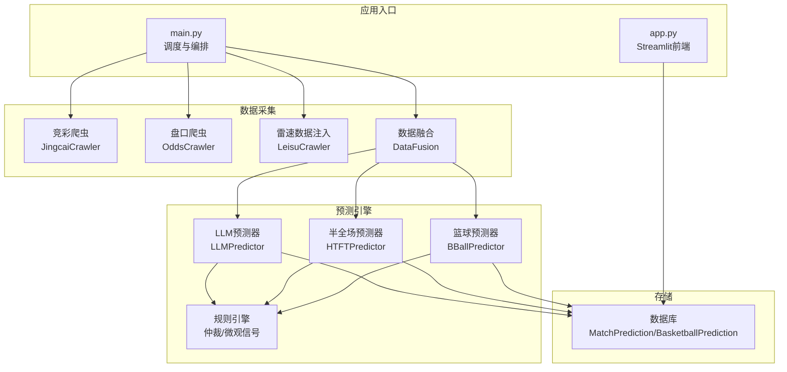
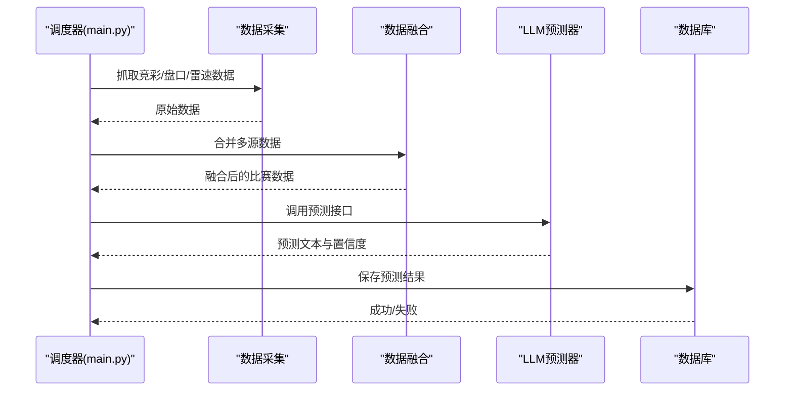
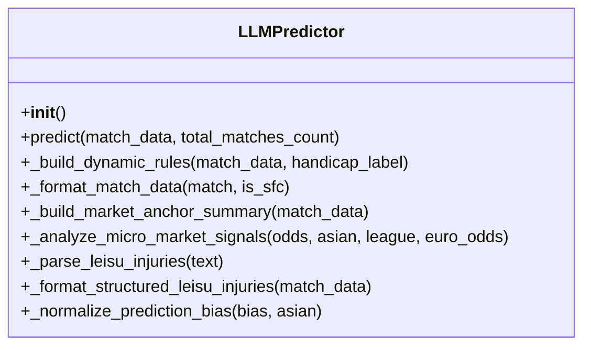
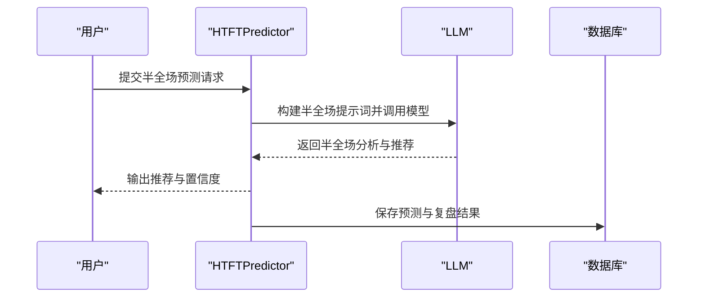
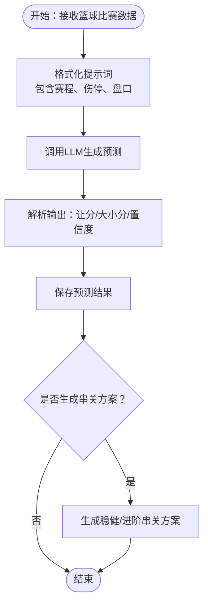
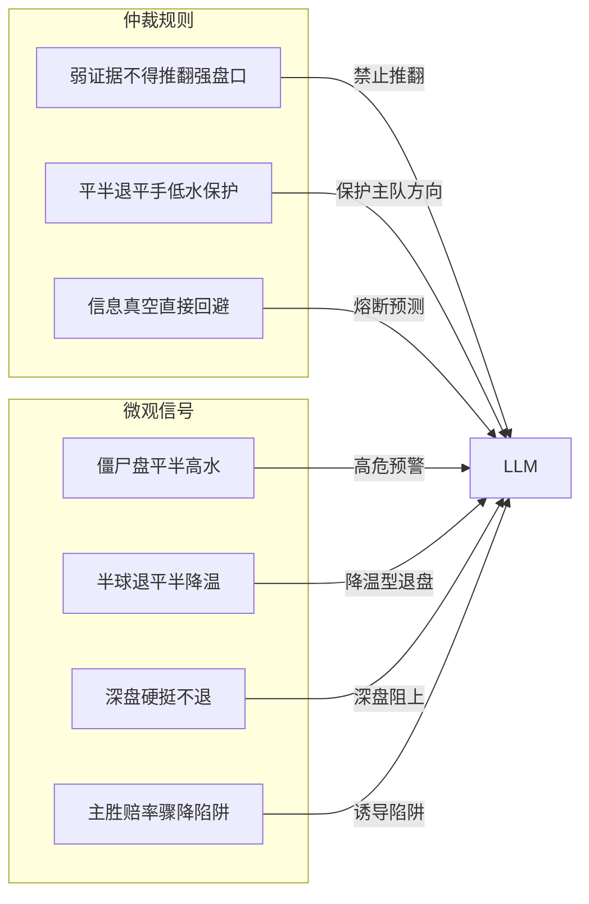
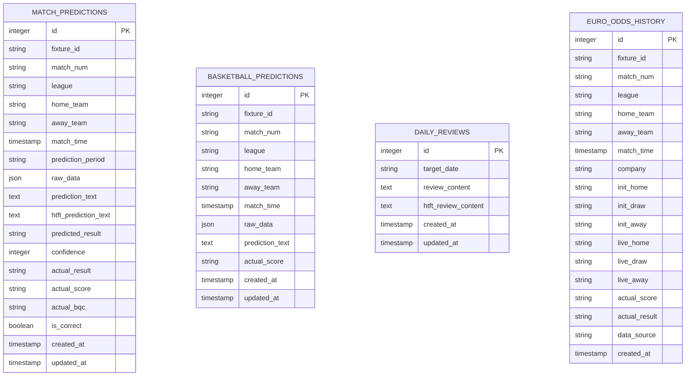
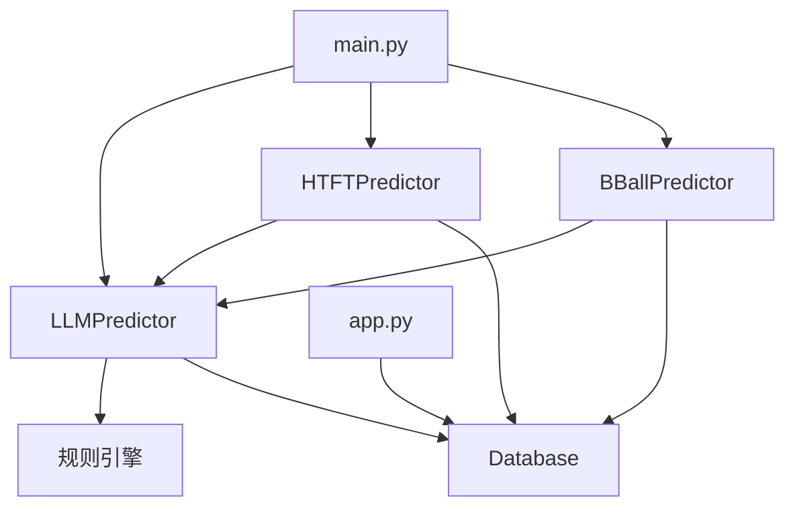

# AI预测系统

<cite>
**本文档引用的文件**
- [predictor.py](file://src/llm/predictor.py)
- [bball_predictor.py](file://src/llm/bball_predictor.py)
- [htft_predictor.py](file://src/llm/htft_predictor.py)
- [predictor_back.py](file://src/llm/predictor_back.py)
- [main.py](file://src/main.py)
- [app.py](file://src/app.py)
- [data_fusion.py](file://src/processor/data_fusion.py)
- [database.py](file://src/db/database.py)
- [.env](file://config/.env)
- [arbitration_rules.json](file://data/rules/arbitration_rules.json)
- [micro_signals.json](file://data/rules/micro_signals.json)
- [rule_registry.py](file://src/utils/rule_registry.py)
- [constants.py](file://src/constants.py)
</cite>

## 目录
1. [项目概述](#项目概述)
2. [项目结构](#项目结构)
3. [核心组件](#核心组件)
4. [架构总览](#架构总览)
5. [详细组件分析](#详细组件分析)
6. [依赖关系分析](#依赖关系分析)
7. [性能考虑](#性能考虑)
8. [故障排查指南](#故障排查指南)
9. [结论](#结论)
10. [附录](#附录)

## 项目概述
本项目是一个基于大语言模型（LLM）的AI预测系统，专注于体育赛事预测，涵盖：
- 足球全场预测（胜平负、让球胜平负）
- 半全场（半胜/半负/平局）预测
- 篮球竞彩预测（让分胜负、大小分）
- 进球数预测与赔率分析
- 规则引擎与AI模型的结合、动态调整与反馈循环

系统通过多源数据融合（竞彩官方数据、第三方盘口数据、伤停情报、历史交锋等），构建高质量提示词，驱动LLM进行深度推理与决策，并将预测结果持久化到数据库，支持复盘与模型优化。

## 项目结构
系统采用模块化设计，按功能域划分：
- 数据采集与处理：爬虫与数据融合
- 预测引擎：LLM预测器与规则引擎
- 应用与展示：命令行调度与Streamlit前端
- 数据存储：SQLAlchemy ORM模型与SQLite数据库
- 配置管理：.env环境变量与常量定义

**图表来源**
- [main.py:34-136](file://src/main.py#L34-L136)
- [data_fusion.py:57-108](file://src/processor/data_fusion.py#L57-L108)
- [predictor.py:20-46](file://src/llm/predictor.py#L20-L46)
- [htft_predictor.py:7-10](file://src/llm/htft_predictor.py#L7-L10)
- [bball_predictor.py:9-28](file://src/llm/bball_predictor.py#L9-L28)
- [database.py:68-126](file://src/db/database.py#L68-L126)

**章节来源**
- [main.py:34-136](file://src/main.py#L34-L136)
- [data_fusion.py:57-108](file://src/processor/data_fusion.py#L57-L108)
- [predictor.py:20-46](file://src/llm/predictor.py#L20-L46)
- [htft_predictor.py:7-10](file://src/llm/htft_predictor.py#L7-L10)
- [bball_predictor.py:9-28](file://src/llm/bball_predictor.py#L9-L28)
- [database.py:68-126](file://src/db/database.py#L68-L126)

## 核心组件
- LLM预测器（LLMPredictor）：负责构建提示词、调用大模型、解析输出、生成置信度与比分参考。
- 半全场预测器（HTFTPredictor）：基于LLMPredictor扩展，专门处理半全场玩法的剧本推演与复盘。
- 篮球预测器（BBallPredictor）：针对竞彩篮球的系统化提示词与串关方案生成。
- 数据融合（DataFusion）：整合竞彩、盘口、伤停、交锋、进球分布等多源数据。
- 规则引擎：仲裁规则与微观信号规则，提供动态风控与预测方向修正。
- 数据库（Database）：持久化预测结果、复盘报告、串关方案与历史赔率。

**章节来源**
- [predictor.py:20-46](file://src/llm/predictor.py#L20-L46)
- [htft_predictor.py:7-10](file://src/llm/htft_predictor.py#L7-L10)
- [bball_predictor.py:9-28](file://src/llm/bball_predictor.py#L9-L28)
- [data_fusion.py:57-108](file://src/processor/data_fusion.py#L57-L108)
- [database.py:68-126](file://src/db/database.py#L68-L126)

## 架构总览
系统采用“数据采集-融合-推理-存储-展示”的流水线架构。核心流程如下：
1. 爬取竞彩赛程与赔率，抓取第三方基本面与盘口数据，注入伤停/交锋/进球分布等结构化情报。
2. 构建提示词（含动态规则与盘口锚点），调用LLM进行推理。
3. 解析输出，提取推荐、置信度、比分参考等关键信息。
4. 将预测结果写入数据库，支持复盘与模型迭代。
5. 提供Streamlit前端用于登录、查看预测与生成串关方案。

**图表来源**
- [main.py:34-136](file://src/main.py#L34-L136)
- [data_fusion.py:57-108](file://src/processor/data_fusion.py#L57-L108)
- [predictor.py:113-125](file://src/llm/predictor.py#L113-L125)
- [database.py:256-304](file://src/db/database.py#L256-L304)

**章节来源**
- [main.py:34-136](file://src/main.py#L34-L136)
- [data_fusion.py:57-108](file://src/processor/data_fusion.py#L57-L108)
- [predictor.py:113-125](file://src/llm/predictor.py#L113-L125)
- [database.py:256-304](file://src/db/database.py#L256-L304)

## 详细组件分析

### LLM预测器（LLMPredictor）
- 动态规则装配：根据盘口深度、联赛特征、市场锚点动态拼接提示词规则，减少上下文负担并避免规则冲突。
- 盘口锚点与微观信号：解析亚指/欧赔/竞彩赔率，构建“让球方/实力方”锚点，识别深盘、升盘、降水等微观信号。
- 伤停量化：对伤停文本进行清洗与结构化抽取，计算核心缺阵人数，辅助预测权重。
- 输出解析：标准化预测偏向（胜/平/负/胜平/平负/胜负），生成置信度与比分参考。

**图表来源**
- [predictor.py:20-46](file://src/llm/predictor.py#L20-L46)
- [predictor.py:51-79](file://src/llm/predictor.py#L51-L79)
- [predictor.py:81-281](file://src/llm/predictor.py#L81-L281)
- [predictor.py:283-433](file://src/llm/predictor.py#L283-L433)
- [predictor.py:756-790](file://src/llm/predictor.py#L756-L790)

**章节来源**
- [predictor.py:20-46](file://src/llm/predictor.py#L20-L46)
- [predictor.py:51-79](file://src/llm/predictor.py#L51-L79)
- [predictor.py:81-281](file://src/llm/predictor.py#L81-L281)
- [predictor.py:283-433](file://src/llm/predictor.py#L283-L433)
- [predictor.py:756-790](file://src/llm/predictor.py#L756-L790)

### 半全场预测器（HTFTPredictor）
- 专用提示词：聚焦“上半场僵持期”与“下半场破局期”的剧本推演，结合亚指陷阱与赔率阈值控制。
- 输出规范：明确推荐（平胜/平负/平平/放弃）与置信度，提供半全场比分参考。
- 复盘能力：基于当日半全场预测与实际赛果生成专项复盘报告，提炼模型优化建议。

**图表来源**
- [htft_predictor.py:7-10](file://src/llm/htft_predictor.py#L7-L10)
- [htft_predictor.py:79-144](file://src/llm/htft_predictor.py#L79-L144)
- [htft_predictor.py:145-157](file://src/llm/htft_predictor.py#L145-L157)

**章节来源**
- [htft_predictor.py:7-10](file://src/llm/htft_predictor.py#L7-L10)
- [htft_predictor.py:79-144](file://src/llm/htft_predictor.py#L79-L144)
- [htft_predictor.py:145-157](file://src/llm/htft_predictor.py#L145-L157)

### 篮球预测器（BBallPredictor）
- 系统化提示词：强调赛程消耗、体能红线、核心阵容、高阶数据与盘口博弈。
- 输出规范：竞彩让分胜负、大小分推荐与置信度，支持交叉盘风险提示。
- 串关方案：基于当日预测结果生成稳健与进阶两种回报率方案。

**图表来源**
- [bball_predictor.py:92-122](file://src/llm/bball_predictor.py#L92-L122)
- [bball_predictor.py:166-198](file://src/llm/bball_predictor.py#L166-L198)
- [bball_predictor.py:199-282](file://src/llm/bball_predictor.py#L199-L282)

**章节来源**
- [bball_predictor.py:92-122](file://src/llm/bball_predictor.py#L92-L122)
- [bball_predictor.py:166-198](file://src/llm/bball_predictor.py#L166-L198)
- [bball_predictor.py:199-282](file://src/llm/bball_predictor.py#L199-L282)

### 数据融合（DataFusion）
- 多源数据合并：竞彩基础数据、盘口数据、第三方基本面与雷速体育情报。
- 可选注入：根据环境变量开关启用雷速数据注入，增强伤停、交锋、进球分布与情报。
- 错误容错：捕获异常并记录告警，不影响整体流程。

**章节来源**
- [data_fusion.py:57-108](file://src/processor/data_fusion.py#L57-L108)

### 规则引擎
- 仲裁规则：对预测进行仲裁，禁止弱证据推翻强盘口，保护主队方向等。
- 微观信号：识别升盘、降水、平衡盘等盘口形态，提供高危/关注级别预警与预测偏向修正。
- 规则注册与转换：将草稿规则转换为可执行的仲裁/微观规则，支持场景化剧本。

**图表来源**
- [arbitration_rules.json:1-63](file://data/rules/arbitration_rules.json#L1-L63)
- [micro_signals.json:1-800](file://data/rules/micro_signals.json#L1-L800)
- [rule_registry.py:221-245](file://src/utils/rule_registry.py#L221-L245)
- [rule_registry.py:248-268](file://src/utils/rule_registry.py#L248-L268)

**章节来源**
- [arbitration_rules.json:1-63](file://data/rules/arbitration_rules.json#L1-L63)
- [micro_signals.json:1-800](file://data/rules/micro_signals.json#L1-L800)
- [rule_registry.py:221-245](file://src/utils/rule_registry.py#L221-L245)
- [rule_registry.py:248-268](file://src/utils/rule_registry.py#L248-L268)

### 数据库模型
- 预测表：保存竞彩足球预测（含时间段标识）、半全场预测、实际赛果与正确性标记。
- 篮球预测表：保存竞彩篮球预测与实际比分。
- 日复盘表：保存每日复盘报告与半全场专项复盘。
- 历史赔率表：保存欧赔初赔/临赔历史，支持模式分析。

**图表来源**
- [database.py:68-126](file://src/db/database.py#L68-L126)
- [database.py:165-175](file://src/db/database.py#L165-L175)
- [database.py:176-198](file://src/db/database.py#L176-L198)

**章节来源**
- [database.py:68-126](file://src/db/database.py#L68-L126)
- [database.py:165-175](file://src/db/database.py#L165-L175)
- [database.py:176-198](file://src/db/database.py#L176-L198)

## 依赖关系分析
- 组件耦合：LLMPredictor与规则引擎松耦合，通过动态规则与信号解析集成；半全场与篮球预测器继承/复用LLM能力。
- 外部依赖：OpenAI SDK、dotenv、loguru、SQLAlchemy、Streamlit。
- 配置依赖：.env中的API密钥、模型名称与基础地址，数据库URL。

**图表来源**
- [predictor.py:20-46](file://src/llm/predictor.py#L20-L46)
- [htft_predictor.py:7-10](file://src/llm/htft_predictor.py#L7-L10)
- [bball_predictor.py:9-28](file://src/llm/bball_predictor.py#L9-L28)
- [database.py:200-217](file://src/db/database.py#L200-L217)
- [main.py:29-32](file://src/main.py#L29-L32)
- [app.py:29-31](file://src/app.py#L29-L31)

**章节来源**
- [predictor.py:20-46](file://src/llm/predictor.py#L20-L46)
- [htft_predictor.py:7-10](file://src/llm/htft_predictor.py#L7-L10)
- [bball_predictor.py:9-28](file://src/llm/bball_predictor.py#L9-L28)
- [database.py:200-217](file://src/db/database.py#L200-L217)
- [main.py:29-32](file://src/main.py#L29-L32)
- [app.py:29-31](file://src/app.py#L29-L31)

## 性能考虑
- 上下文控制：通过动态规则与盘口锚点减少提示词长度，降低Token消耗与延迟。
- 并发与批处理：主流程逐场预测，可在保持可读性的同时通过外部调度器并发执行。
- 数据缓存：将融合后的比赛数据写入本地JSON缓存，便于调试与重跑。
- 模型选择：通过环境变量切换模型与基础地址，便于A/B测试与成本控制。
- 数据库索引：按fixture_id、match_time、target_date建立索引，提升查询性能。

[本节为通用指导，无需特定文件引用]

## 故障排查指南
- API配置问题：检查.env中的LLM_API_KEY、LLM_API_BASE、LLM_MODEL是否正确。
- 数据库初始化：首次运行会自动创建表结构，确认SQLite路径与权限。
- 雷速注入失败：检查ENABLE_LEISU开关与网络环境，异常会被捕获并记录告警。
- Streamlit登录：确认认证令牌有效期与数据库用户有效性。
- 预测保存失败：检查数据库事务与字段映射，必要时查看回滚日志。

**章节来源**
- [.env:1-20](file://config/.env#L1-L20)
- [database.py:200-217](file://src/db/database.py#L200-L217)
- [data_fusion.py:19-36](file://src/processor/data_fusion.py#L19-L36)
- [app.py:94-108](file://src/app.py#L94-L108)
- [database.py:256-304](file://src/db/database.py#L256-L304)

## 结论
本系统通过“LLM推理 + 规则引擎 + 多源数据融合”的架构，实现了对足球、半全场与篮球的高精度预测。动态规则与微观信号有效降低了模型误判风险，数据库与复盘机制形成了闭环优化路径。建议在生产环境中进一步完善：
- 规则的自动化校准与A/B测试
- 多模型集成与不确定性量化
- 实时监控与告警机制
- 用户权限与审计日志

[本节为总结性内容，无需特定文件引用]

## 附录

### 提示词工程与模型选择策略
- 足球提示词：强调盘口锚点、微观信号、交叉验证与风控提示，输出包含竞彩推荐、让球推荐、置信度与比分参考。
- 半全场提示词：聚焦上半场僵持与下半场破局的剧本推演，结合亚指陷阱与赔率阈值。
- 篮球提示词：突出赛程消耗、体能红线、核心阵容与盘口博弈，输出让分胜负、大小分与置信度。
- 模型选择：通过LLM_MODEL与LLM_API_BASE灵活切换，支持不同供应商与版本。

**章节来源**
- [predictor.py:81-281](file://src/llm/predictor.py#L81-L281)
- [htft_predictor.py:11-77](file://src/llm/htft_predictor.py#L11-L77)
- [bball_predictor.py:29-90](file://src/llm/bball_predictor.py#L29-L90)
- [.env:4-7](file://config/.env#L4-L7)

### 结果解释与置信度
- 置信度：0-100分制，结合模型输出与风控信号综合确定。
- 偏向标准化：将自然语言偏向映射为统一枚举（胜/平/负/胜平/平负/胜负）。
- 比分参考：基于进球数预测与盘口锚点生成高概率比分组合。

**章节来源**
- [predictor.py:718-790](file://src/llm/predictor.py#L718-L790)
- [predictor.py:113-125](file://src/llm/predictor.py#L113-L125)

### 准确率评估与模型优化
- 复盘流程：基于实际赛果与预测文本生成复盘报告，定位冷门致死原因与模型偏差。
- 规则优化：根据复盘结果调整仲裁规则与微观信号阈值，形成闭环优化。
- 串关方案：基于预测置信度与交叉盘风险生成稳健/进阶串关策略。

**章节来源**
- [predictor.py:618-688](file://src/llm/predictor.py#L618-L688)
- [htft_predictor.py:79-144](file://src/llm/htft_predictor.py#L79-L144)
- [bball_predictor.py:199-282](file://src/llm/bball_predictor.py#L199-L282)

### 规则引擎与AI模型结合
- 仲裁规则：在强盘口与微观信号一致时，禁止用基本面/情报单独推翻市场方向。
- 微观信号：对升盘、降水、平衡盘等形态进行高危/关注预警，修正预测偏向。
- 动态调整：规则可由草稿生成，支持场景化剧本与版本化管理。

**章节来源**
- [arbitration_rules.json:1-63](file://data/rules/arbitration_rules.json#L1-L63)
- [micro_signals.json:1-800](file://data/rules/micro_signals.json#L1-L800)
- [rule_registry.py:221-245](file://src/utils/rule_registry.py#L221-L245)
- [rule_registry.py:248-268](file://src/utils/rule_registry.py#L248-L268)

### 性能调优建议
- 控制提示词长度：通过动态规则与盘口锚点减少上下文。
- 批量写入：合并预测结果后再写入数据库，减少IO次数。
- 缓存策略：对第三方数据与LLM响应进行短期缓存。
- 并发调度：在保证稳定性前提下并发执行多场比赛预测。

[本节为通用指导，无需特定文件引用]