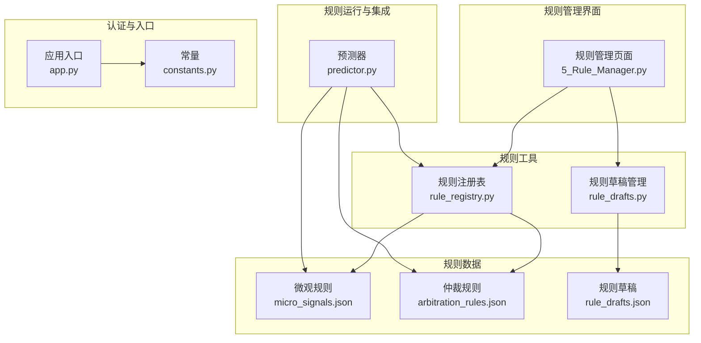
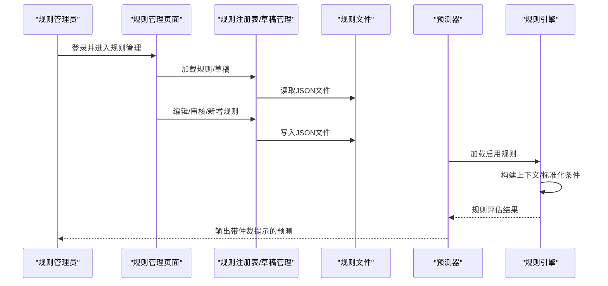
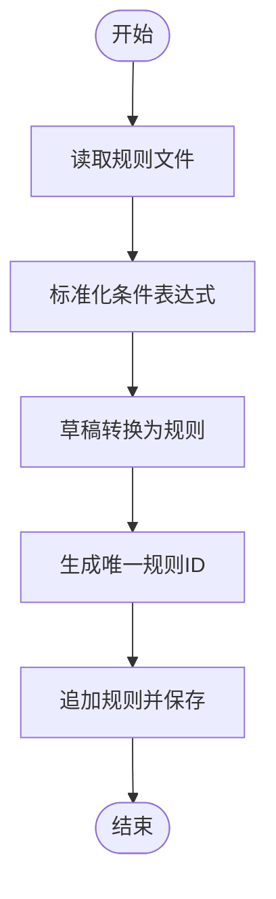
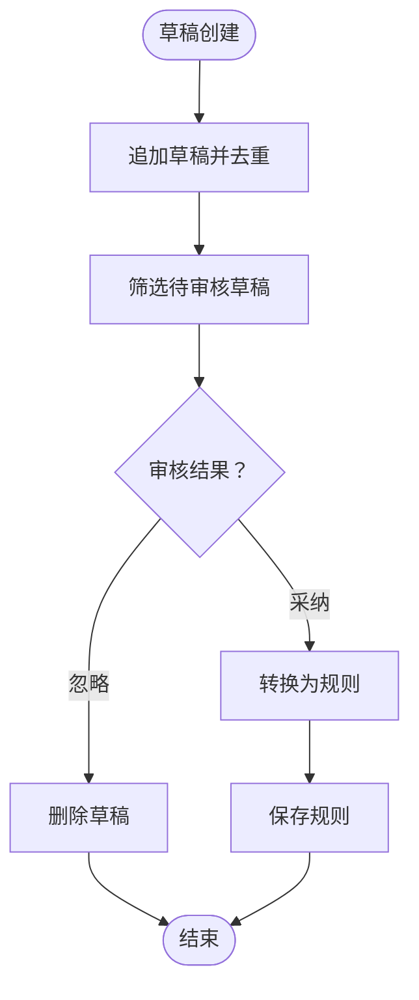
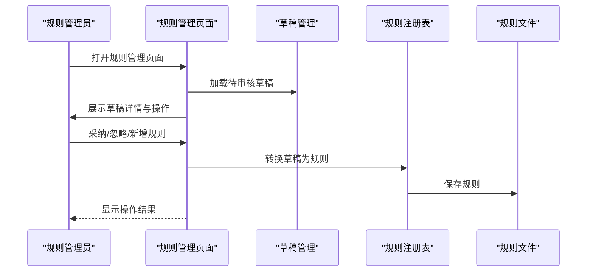
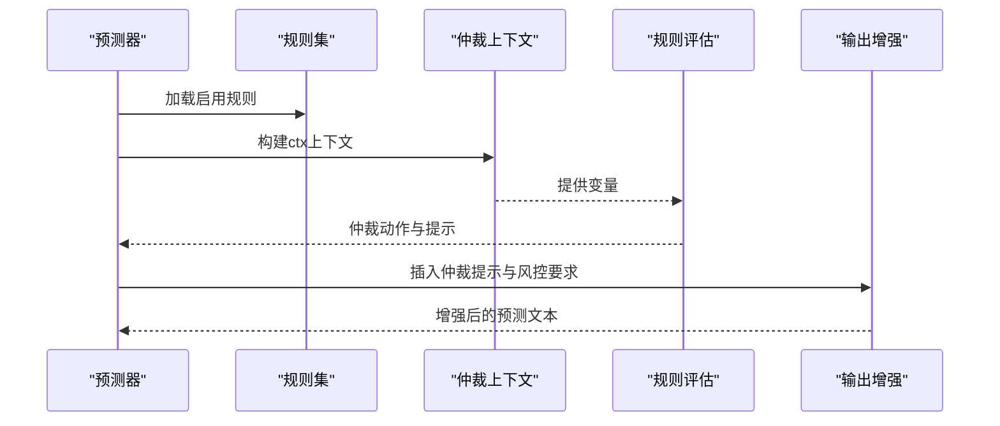
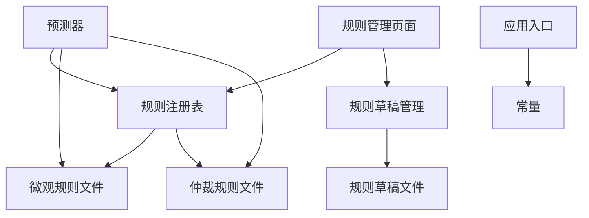

# 动态规则引擎

<cite>
**本文档引用的文件**
- [rule_registry.py](file://src/utils/rule_registry.py)
- [rule_drafts.py](file://src/utils/rule_drafts.py)
- [arbitration_rules.json](file://data/rules/arbitration_rules.json)
- [micro_signals.json](file://data/rules/micro_signals.json)
- [rule_drafts.json](file://data/rules/rule_drafts.json)
- [5_Rule_Manager.py](file://src/pages/5_Rule_Manager.py)
- [predictor.py](file://src/llm/predictor.py)
- [test_predictor_rules.py](file://tests/test_predictor_rules.py)
- [test_rule_feedback_loop.py](file://tests/test_rule_feedback_loop.py)
- [app.py](file://src/app.py)
- [constants.py](file://src/constants.py)
</cite>

## 目录
1. [引言](#引言)
2. [项目结构](#项目结构)
3. [核心组件](#核心组件)
4. [架构总览](#架构总览)
5. [详细组件分析](#详细组件分析)
6. [依赖关系分析](#依赖关系分析)
7. [性能考虑](#性能考虑)
8. [故障排除指南](#故障排除指南)
9. [结论](#结论)
10. [附录](#附录)

## 引言
本技术文档面向规则管理员与系统开发者，全面阐述动态规则引擎的设计与运行机制。系统通过“微观规则”和“仲裁保护规则”两大类规则，结合规则草稿的审核与发布流程，实现对预测模型的动态约束与风险控制。规则引擎具备以下能力：
- 规则加载与执行：从本地JSON文件加载规则，构建运行时上下文，安全求值布尔条件，执行动作。
- 条件表达式标准化：将自然语言条件映射为Python可执行表达式，支持AND/OR/NOT等逻辑运算符与BETWEEN语法。
- 动作类型归一化：将自然语言动作归一化为标准动作类型（如熔断、禁止推翻、强制双选等）。
- 规则注册表管理：提供规则ID生成、唯一性保证、规则追加与持久化。
- 草稿生命周期管理：支持草稿创建、审核、采纳、拒绝与删除。
- 风险评估与仲裁：在预测生成过程中，基于规则评估结果生成仲裁建议与风控提示。

## 项目结构
动态规则引擎涉及的核心目录与文件：
- 规则数据：data/rules/*.json（微观规则、仲裁规则、规则草稿）
- 规则工具：src/utils/rule_registry.py、src/utils/rule_drafts.py
- 规则管理界面：src/pages/5_Rule_Manager.py
- 规则运行与集成：src/llm/predictor.py
- 登录与鉴权：src/app.py、src/constants.py
- 测试：tests/test_predictor_rules.py、tests/test_rule_feedback_loop.py

**图表来源**
- [5_Rule_Manager.py:1-678](file://src/pages/5_Rule_Manager.py#L1-L678)
- [rule_registry.py:1-278](file://src/utils/rule_registry.py#L1-L278)
- [rule_drafts.py:1-91](file://src/utils/rule_drafts.py#L1-L91)
- [predictor.py:1-200](file://src/llm/predictor.py#L1-L200)
- [app.py:1-166](file://src/app.py#L1-L166)
- [constants.py:1-5](file://src/constants.py#L1-L5)

**章节来源**
- [5_Rule_Manager.py:1-678](file://src/pages/5_Rule_Manager.py#L1-L678)
- [rule_registry.py:1-278](file://src/utils/rule_registry.py#L1-L278)
- [rule_drafts.py:1-91](file://src/utils/rule_drafts.py#L1-L91)
- [predictor.py:1-200](file://src/llm/predictor.py#L1-L200)
- [app.py:1-166](file://src/app.py#L1-L166)
- [constants.py:1-5](file://src/constants.py#L1-L5)

## 核心组件
- 规则注册表（rule_registry.py）
  - 规则路径管理：提供微观规则与仲裁规则的文件路径。
  - 规则列表读写：加载/保存规则列表，确保目录存在与编码正确。
  - 规则ID生成：从草稿生成规则ID，保证唯一性与可读性。
  - 条件表达式标准化：将自然语言条件转换为Python可执行表达式，支持AND/OR/NOT/BETWEEN等。
  - 动作类型归一化：将自然语言动作映射为标准动作类型与载荷。
  - 草稿到规则转换：将规则草稿转换为微观规则或仲裁规则的最终形态。
- 规则草稿管理（rule_drafts.py）
  - 草稿文件读写：加载/保存草稿列表。
  - 草稿去重与ID生成：基于draft_id去重，自动生成唯一ID。
  - 草稿状态管理：支持草稿状态更新与删除。
  - 按日期替换：支持按源日期批量替换待审核草稿。
- 规则管理界面（5_Rule_Manager.py）
  - 规则编辑：支持启用/禁用、条件编辑、模板与偏向编辑。
  - 草稿审核：支持采纳为微观/仲裁规则、忽略草稿、新增规则。
  - 预填新增：基于草稿自动填充规则字段，一键新增。
  - 条件刚性分析：检测草稿/规则条件中的过死风险（如精确阈值、历史点位等）。
- 规则运行与集成（predictor.py）
  - 规则加载：加载启用的微观规则与仲裁规则。
  - 上下文构建：构建仲裁规则上下文（ctx），支持asian欧赔标签化。
  - 规则评估：对仲裁规则进行求值，生成仲裁动作与提示。
  - 风险策略：根据触发规则生成风控策略（置信度上限、强制双选等）。
  - 输出增强：在预测文本中插入仲裁提示与风控要求。
- 登录与鉴权（app.py、constants.py）
  - Token生成与校验：基于用户名+时间戳的Base64编码Token。
  - 会话有效期：默认8小时（28800秒）。
  - 页面路由：登录成功后跳转到仪表盘。

**章节来源**
- [rule_registry.py:1-278](file://src/utils/rule_registry.py#L1-L278)
- [rule_drafts.py:1-91](file://src/utils/rule_drafts.py#L1-L91)
- [5_Rule_Manager.py:1-678](file://src/pages/5_Rule_Manager.py#L1-L678)
- [predictor.py:1-200](file://src/llm/predictor.py#L1-L200)
- [app.py:1-166](file://src/app.py#L1-L166)
- [constants.py:1-5](file://src/constants.py#L1-L5)

## 架构总览
动态规则引擎采用“数据驱动 + 界面管理 + 运行时求值”的架构：
- 数据层：规则与草稿存储在data/rules目录的JSON文件中。
- 工具层：规则注册表与草稿管理提供规则的标准化、转换与持久化能力。
- 界面层：规则管理页面提供可视化编辑、审核与预填新增。
- 运行时层：预测器在生成预测时加载规则，构建上下文并求值，输出仲裁建议与风控提示。

**图表来源**
- [5_Rule_Manager.py:1-678](file://src/pages/5_Rule_Manager.py#L1-L678)
- [rule_registry.py:1-278](file://src/utils/rule_registry.py#L1-L278)
- [rule_drafts.py:1-91](file://src/utils/rule_drafts.py#L1-L91)
- [predictor.py:1-200](file://src/llm/predictor.py#L1-L200)

**章节来源**
- [5_Rule_Manager.py:1-678](file://src/pages/5_Rule_Manager.py#L1-L678)
- [rule_registry.py:1-278](file://src/utils/rule_registry.py#L1-L278)
- [rule_drafts.py:1-91](file://src/utils/rule_drafts.py#L1-L91)
- [predictor.py:1-200](file://src/llm/predictor.py#L1-L200)

## 详细组件分析

### 规则注册表（rule_registry.py）
- 规则路径管理
  - 提供微观规则与仲裁规则的文件路径，确保规则加载与保存的一致性。
- 规则列表读写
  - load_rule_list：安全读取JSON，异常时返回空列表。
  - save_rule_list：确保父目录存在，使用UTF-8编码写入。
- 规则ID生成与唯一性
  - generate_rule_id_from_draft：从草稿标题/问题类型等字段生成规则ID，自动添加前缀与数字后缀保证唯一。
  - ensure_unique_rule_id：在现有ID集合中查找唯一ID。
- 条件表达式标准化
  - normalize_micro_rule_condition：将自然语言条件转换为Python表达式，支持别名替换与BETWEEN展开。
  - normalize_arbitration_rule_condition：将条件转换为ctx上下文可访问形式。
  - normalize_arbitration_rule_action：将自然语言动作归一化为标准动作类型与载荷。
- 草稿到规则转换
  - convert_draft_to_micro_rule：将草稿转换为微观规则，包含偏向、效果、场景键等。
  - convert_draft_to_arbitration_rule：将草稿转换为仲裁规则，包含优先级、解释模板等。
- 规则追加
  - append_rule：向规则列表追加规则并去重保存。

**图表来源**
- [rule_registry.py:18-278](file://src/utils/rule_registry.py#L18-L278)

**章节来源**
- [rule_registry.py:1-278](file://src/utils/rule_registry.py#L1-L278)

### 规则草稿管理（rule_drafts.py）
- 草稿文件读写
  - load_rule_drafts：安全读取草稿JSON。
  - save_rule_drafts：写入草稿JSON。
- 草稿去重与ID生成
  - append_rule_drafts：基于draft_id去重，自动生成唯一ID。
- 按日期替换
  - replace_pending_rule_drafts_for_date：按源日期删除草稿并追加新草稿。
- 状态管理
  - get_pending_rule_drafts：筛选待审核草稿。
  - update_rule_draft_status：更新草稿状态。
  - delete_rule_draft：删除指定草稿。

**图表来源**
- [rule_drafts.py:10-91](file://src/utils/rule_drafts.py#L10-L91)

**章节来源**
- [rule_drafts.py:1-91](file://src/utils/rule_drafts.py#L1-L91)

### 规则管理界面（5_Rule_Manager.py）
- 规则编辑
  - 微观规则编辑：支持启用/禁用、条件、警告模板、预测偏向、作用类型编辑。
  - 仲裁规则编辑：支持启用/禁用、条件、动作类型、动作参数、解释模板、优先级编辑。
- 草稿审核
  - 采纳为微观/仲裁规则：自动去重并保存。
  - 忽略草稿：更新状态为rejected。
  - 新增规则：基于草稿预填字段一键新增。
- 条件刚性分析
  - 分析草稿/规则条件中的过死风险（历史点位、精确阈值、精确比值等）。
- 变量字典与动作参考
  - 提供微观规则与仲裁规则的变量字典与动作参考，便于编写条件与动作。

**图表来源**
- [5_Rule_Manager.py:1-678](file://src/pages/5_Rule_Manager.py#L1-L678)
- [rule_drafts.py:10-91](file://src/utils/rule_drafts.py#L10-L91)
- [rule_registry.py:221-278](file://src/utils/rule_registry.py#L221-L278)

**章节来源**
- [5_Rule_Manager.py:1-678](file://src/pages/5_Rule_Manager.py#L1-L678)
- [rule_drafts.py:1-91](file://src/utils/rule_drafts.py#L1-L91)
- [rule_registry.py:1-278](file://src/utils/rule_registry.py#L1-L278)

### 规则运行与集成（predictor.py）
- 规则加载
  - 加载启用的微观规则与仲裁规则，过滤禁用项。
- 上下文构建
  - _build_arbitration_rule_context：构建ctx上下文，支持asian欧赔标签化（favored_side、strength_gap_label等）。
- 规则评估
  - _evaluate_arbitration_rules：对仲裁规则求值，生成仲裁动作（如熔断、禁止推翻、强制双选、置信度上限、要求解释原因等）。
- 风险策略
  - _build_risk_policy：根据触发规则生成风控策略（置信度上限、强制双选、解释市场锚点等）。
- 输出增强
  - _apply_arbitration_actions/_enforce_minimum_risk_coverage：在预测文本中插入仲裁提示与风控要求。

**图表来源**
- [predictor.py:1-200](file://src/llm/predictor.py#L1-L200)
- [test_predictor_rules.py:11-184](file://tests/test_predictor_rules.py#L11-L184)

**章节来源**
- [predictor.py:1-200](file://src/llm/predictor.py#L1-L200)
- [test_predictor_rules.py:11-184](file://tests/test_predictor_rules.py#L11-L184)

### 登录与鉴权（app.py、constants.py）
- Token生成与校验
  - encode_auth_token/decode_auth_token：基于用户名+时间戳的Base64编码Token。
- 会话有效期
  - AUTH_TOKEN_TTL：默认8小时。
- 页面路由
  - 登录成功后跳转到仪表盘，支持退出登录清理会话。

**章节来源**
- [app.py:1-166](file://src/app.py#L1-L166)
- [constants.py:1-5](file://src/constants.py#L1-L5)

## 依赖关系分析
- 组件耦合
  - 规则管理界面依赖规则注册表与草稿管理，用于读取、编辑与保存规则。
  - 预测器依赖规则注册表进行规则加载与条件标准化。
  - 登录与鉴权为规则管理界面提供访问控制。
- 外部依赖
  - JSON文件作为规则与草稿的持久化存储。
  - OpenAI客户端用于预测生成（与规则引擎协同工作）。

**图表来源**
- [5_Rule_Manager.py:1-678](file://src/pages/5_Rule_Manager.py#L1-L678)
- [rule_registry.py:1-278](file://src/utils/rule_registry.py#L1-L278)
- [rule_drafts.py:1-91](file://src/utils/rule_drafts.py#L1-L91)
- [predictor.py:1-200](file://src/llm/predictor.py#L1-L200)
- [app.py:1-166](file://src/app.py#L1-L166)
- [constants.py:1-5](file://src/constants.py#L1-L5)

**章节来源**
- [5_Rule_Manager.py:1-678](file://src/pages/5_Rule_Manager.py#L1-L678)
- [rule_registry.py:1-278](file://src/utils/rule_registry.py#L1-L278)
- [rule_drafts.py:1-91](file://src/utils/rule_drafts.py#L1-L91)
- [predictor.py:1-200](file://src/llm/predictor.py#L1-L200)
- [app.py:1-166](file://src/app.py#L1-L166)
- [constants.py:1-5](file://src/constants.py#L1-L5)

## 性能考虑
- 规则加载与求值
  - 规则文件较小，加载与JSON解析成本低；条件求值使用Python内置表达式求值，复杂度与规则数量线性相关。
- 文件I/O
  - 规则与草稿文件读写集中在管理界面与注册表，建议在批量操作时合并写入，减少磁盘I/O。
- 上下文构建
  - 仲裁规则上下文构建包含欧赔标签化，计算量有限，对整体性能影响可忽略。
- 建议
  - 对大规模规则集，建议在规则管理界面进行分组筛选与分页展示，提升交互性能。
  - 在预测流程中，可缓存已构建的上下文，避免重复计算。

[本节为通用指导，不直接分析具体文件]

## 故障排除指南
- 规则条件过死
  - 现象：规则条件包含历史点位、精确阈值或精确比值，导致规则过于刚性。
  - 处理：使用规则管理界面的条件刚性分析，将历史点位替换为标签化变量（如欧赔标签、盘口趋势等）。
- 动作类型不识别
  - 现象：自然语言动作无法归一化为标准动作类型。
  - 处理：检查动作描述是否包含关键字（如“熔断”、“禁止推翻”、“强制双选”等），必要时手动填写动作类型与载荷。
- 规则ID冲突
  - 现象：新增规则ID与现有ID冲突。
  - 处理：使用规则ID生成逻辑，确保唯一性；必要时手动调整ID。
- 草稿状态异常
  - 现象：草稿状态未更新或删除失败。
  - 处理：通过规则管理界面的状态更新与删除功能进行修复。
- 预测仲裁提示缺失
  - 现象：预测文本中缺少仲裁提示或风控要求。
  - 处理：检查仲裁规则是否启用、条件是否满足；确认风险策略生成逻辑是否触发。

**章节来源**
- [5_Rule_Manager.py:63-82](file://src/pages/5_Rule_Manager.py#L63-L82)
- [test_rule_feedback_loop.py:632-647](file://tests/test_rule_feedback_loop.py#L632-L647)
- [test_predictor_rules.py:158-174](file://tests/test_predictor_rules.py#L158-L174)

## 结论
动态规则引擎通过“数据驱动 + 界面管理 + 运行时求值”的架构，实现了规则的灵活管理与高效执行。规则注册表负责条件标准化与动作归一化，规则草稿管理提供完善的审核流程，规则管理界面提供直观的操作体验，预测器在运行时加载规则并生成仲裁提示与风控策略。该体系既满足规则管理员的日常维护需求，也为预测模型提供了稳健的风险控制保障。

[本节为总结性内容，不直接分析具体文件]

## 附录

### 规则定义格式与字段说明
- 微观规则字段
  - id/name/category/level/condition/warning_template/prediction_bias/effect/enabled/source/scenario_key/scenario_parts/scenario_version
- 仲裁规则字段
  - id/name/category/priority/condition/action_type/action_payload/explanation_template/enabled/source/scenario_key/scenario_parts/scenario_version
- 草稿字段
  - draft_id/title/target_scope/problem_type/suggested_condition/suggested_action/suggested_bias/priority/status/source_matches/source_date/warning_message_template/...

**章节来源**
- [micro_signals.json:1-977](file://data/rules/micro_signals.json#L1-L977)
- [arbitration_rules.json:1-63](file://data/rules/arbitration_rules.json#L1-L63)
- [rule_drafts.json:1-229](file://data/rules/rule_drafts.json#L1-L229)

### 条件表达式与动作类型参考
- 条件表达式
  - 支持AND/OR/NOT/BETWEEN等逻辑运算符，支持别名替换（如origin_handicap→asian['start_hv']）。
- 动作类型
  - abort_prediction、forbid_override、force_double、cap_confidence、require_override_reason

**章节来源**
- [rule_registry.py:78-219](file://src/utils/rule_registry.py#L78-L219)
- [5_Rule_Manager.py:566-576](file://src/pages/5_Rule_Manager.py#L566-L576)