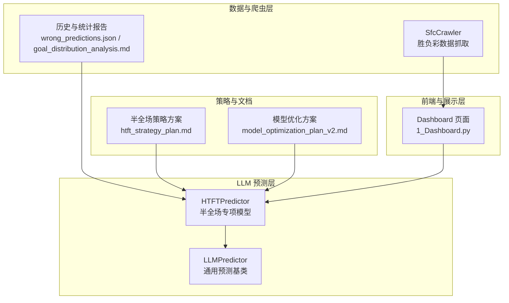
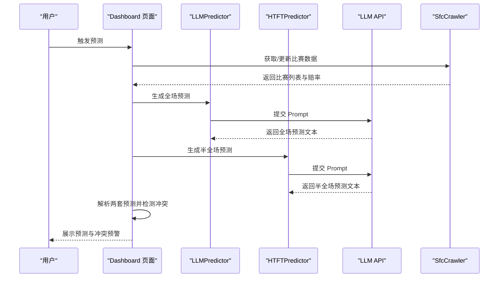
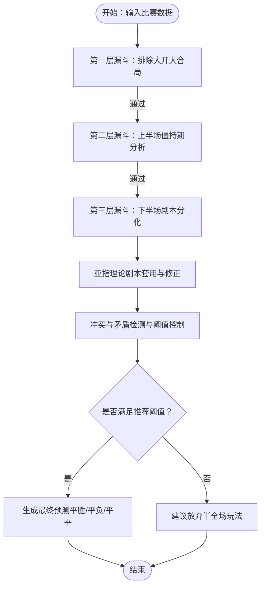
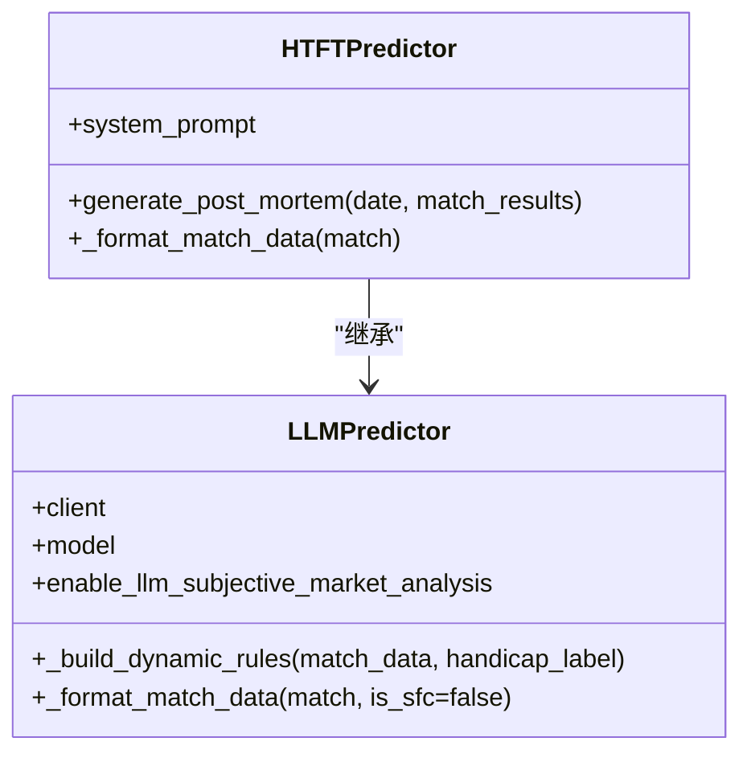
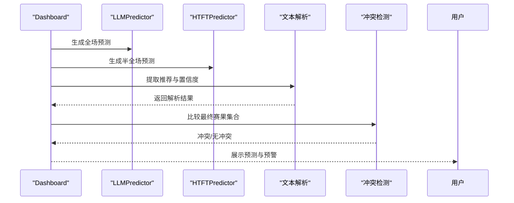
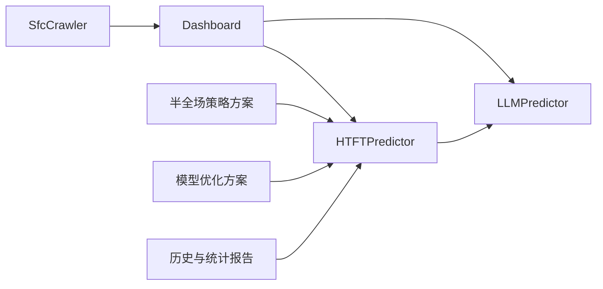

# 半全场预测模型

<cite>
**本文引用的文件**
- [htft_predictor.py](file://src/llm/htft_predictor.py)
- [htft_strategy_plan.md](file://docs/htft_strategy_plan.md)
- [predictor.py](file://src/llm/predictor.py)
- [1_Dashboard.py](file://src/pages/1_Dashboard.py)
- [model_optimization_plan_v2.md](file://docs/model_optimization_plan_v2.md)
- [goal_distribution_analysis.md](file://docs/goal_distribution_analysis.md)
- [wrong_predictions.json](file://data/reports/wrong_predictions.json)
- [sfc_crawler.py](file://src/crawler/sfc_crawler.py)
</cite>

## 目录
1. [简介](#简介)
2. [项目结构](#项目结构)
3. [核心组件](#核心组件)
4. [架构总览](#架构总览)
5. [详细组件分析](#详细组件分析)
6. [依赖关系分析](#依赖关系分析)
7. [性能考量](#性能考量)
8. [故障排查指南](#故障排查指南)
9. [结论](#结论)
10. [附录](#附录)

## 简介
本技术文档围绕“半全场预测模型”展开，系统阐述其理论基础、算法实现、赔率与概率转换、组合预测策略、时间因素与战术变化、球员疲劳度分析，以及与其他预测模型的协同机制与实际应用效果评估与优化方法。半全场（Half-Time/Full-Time）预测聚焦于“上半场僵持期”与“下半场破局期”的阶段性割裂，通过亚指理论、赔率规律与历史统计，构建“平胜/平负/平平”的剧本推演与风控流程，最终输出置信度与比分参考，辅助投注决策与风险控制。

## 项目结构
本项目采用模块化组织，半全场预测模型位于 LLM 预测器体系中，与大盘口预测、进球数推演、公众号文章生成等模块协同工作，并通过 Streamlit 页面进行可视化展示与交互。

图表来源
- [htft_predictor.py:1-157](file://src/llm/htft_predictor.py#L1-L157)
- [predictor.py:20-80](file://src/llm/predictor.py#L20-L80)
- [sfc_crawler.py:1-145](file://src/crawler/sfc_crawler.py#L1-L145)
- [1_Dashboard.py:1400-1465](file://src/pages/1_Dashboard.py#L1400-L1465)
- [htft_strategy_plan.md:1-76](file://docs/htft_strategy_plan.md#L1-L76)
- [model_optimization_plan_v2.md:1-50](file://docs/model_optimization_plan_v2.md#L1-L50)
- [goal_distribution_analysis.md:1-623](file://docs/goal_distribution_analysis.md#L1-L623)
- [wrong_predictions.json:1-238](file://data/reports/wrong_predictions.json#L1-L238)

章节来源
- [htft_predictor.py:1-157](file://src/llm/htft_predictor.py#L1-L157)
- [predictor.py:20-80](file://src/llm/predictor.py#L20-L80)
- [1_Dashboard.py:1400-1465](file://src/pages/1_Dashboard.py#L1400-L1465)

## 核心组件
- 半全场专项模型（HTFTPredictor）
  - 专用于“平胜/平负/平平”单关模式的剧本推演，强调“上半场僵持度”与“下半场破局力”的双阶段分析。
  - 输出包含“半全场单关推荐”“置信度”“半场/全场比分参考”等。
- 通用预测基类（LLMPredictor）
  - 提供统一的 LLM 客户端初始化、动态规则拼装、数据格式化与提示词模板化能力。
- Dashboard 展示与冲突检测
  - 对比全场模型与半全场模型的最终推荐，自动识别冲突并给出“模型分歧预警”，指导用户放弃高风险场次。
- 策略与优化文档
  - 半全场策略方案：明确“沉闷半场”“下半场杀机”“亚指陷阱”等筛选与建模漏斗。
  - 模型优化方案：引入战意系数、末期联赛法则、冷门背离预警与半全场风险过滤器升级。

章节来源
- [htft_predictor.py:1-157](file://src/llm/htft_predictor.py#L1-L157)
- [predictor.py:20-80](file://src/llm/predictor.py#L20-L80)
- [1_Dashboard.py:1400-1465](file://src/pages/1_Dashboard.py#L1400-L1465)
- [htft_strategy_plan.md:1-76](file://docs/htft_strategy_plan.md#L1-L76)
- [model_optimization_plan_v2.md:1-50](file://docs/model_optimization_plan_v2.md#L1-L50)

## 架构总览
半全场预测模型在系统中的位置与交互如下：

图表来源
- [1_Dashboard.py:1400-1465](file://src/pages/1_Dashboard.py#L1400-L1465)
- [htft_predictor.py:1-157](file://src/llm/htft_predictor.py#L1-L157)
- [predictor.py:20-80](file://src/llm/predictor.py#L20-L80)
- [sfc_crawler.py:1-145](file://src/crawler/sfc_crawler.py#L1-L145)

## 详细组件分析

### 半全场专项模型（HTFTPredictor）
- 角色与任务
  - 专注半全场（平胜/平负/平平）单关模式，通过“上半场僵持度”+“下半场破局力”的专属逻辑链，判断是否适合推荐“平胜/平负/平平”，或建议放弃。
- 分析工作流
  - 第一层漏斗：排除“大开大合局”（全场进球期望过高或深盘）。
  - 第二层漏斗：上半场打平（僵持期）分析，包含“半场进球能力与球队标签”“基本面与风格基因”“特殊赛程战意”“半场机构意图”。
  - 第三层漏斗：下半场剧本分化（平平 vs 平胜/平负），包含“进球时间与体能拐点”“全场生死盘托底”“特定指数排阻（3.10/3.25定律）”。
  - 亚指理论剧本套用与修正：阵容迷雾陷阱、骄傲的升班马、极限深盘杀下盘、实力碾压剧本（规避平胜陷阱）、半全场极度风控规则（红线规则）。
  - 冲突与矛盾检测与阈值控制：严格控制平胜/平负推荐阈值，避免滥用；若上下半场剧本不可调和或大开大合倾向，建议放弃。
- 输出格式
  - 半场僵持度评估、下半场剧本分化推演、亚指剧本匹配、核心风控提示、最终预测（半全场单关推荐、置信度、半场/全场比分参考）。

图表来源
- [htft_predictor.py:19-77](file://src/llm/htft_predictor.py#L19-L77)

章节来源
- [htft_predictor.py:1-157](file://src/llm/htft_predictor.py#L1-L157)

### 通用预测基类（LLMPredictor）
- 统一初始化与规则装配
  - 动态组装规则（盘型专属规则、通用变化规则、热钱规则、联赛特异性规则），减轻上下文负担，避免规则冲突。
- 数据格式化
  - 将比赛数据格式化为 Prompt 可读文本，包含基本面、伤停、高级攻防数据、历史交锋、近期战绩、进球分布等。
- 半全场赔率增强
  - 在通用格式化基础上，HTFTPredictor 重写格式化函数，特别强化半全场赔率（平胜/平负/平平等）字段，便于模型在 Prompt 中直接使用。

图表来源
- [predictor.py:20-80](file://src/llm/predictor.py#L20-L80)
- [htft_predictor.py:1-157](file://src/llm/htft_predictor.py#L1-L157)

章节来源
- [predictor.py:20-80](file://src/llm/predictor.py#L20-L80)
- [htft_predictor.py:1-157](file://src/llm/htft_predictor.py#L1-L157)

### Dashboard 展示与冲突检测
- 解析与提取
  - 从全场与半全场预测文本中提取“最终推荐”与“置信度”，并对“放弃”关键词进行特殊处理（放弃置信度反推真实置信度）。
- 冲突检测
  - 将半全场最终赛果映射到“胜/平/负”集合，若与全场模型给出的“胜/平/负”集合无交集，则判定为冲突，触发“模型分歧预警”，建议放弃该场比赛投注。
- 专项预测触发
  - 提供“触发专项半全场预测”的按钮，便于管理员或用户手动触发 HTFTPredictor 的预测流程。

图表来源
- [1_Dashboard.py:1400-1465](file://src/pages/1_Dashboard.py#L1400-L1465)

章节来源
- [1_Dashboard.py:1400-1465](file://src/pages/1_Dashboard.py#L1400-L1465)

### 半全场策略与建模漏斗
- 上半场打平（僵持期）分析要点
  - 基本面与风格基因：半场得失球能力极低、联赛与赛事阶段特性（防守型联赛、保级关键战/杯赛末轮）、强队慢热/弱队死守。
  - 机构意图：半场让步谨慎、亚指“平半高水”、半场大小球高水、低平局赔率。
- 下半场破局期分析要点
  - 基本面：进球时间分布（70-90分钟）、开放型联赛、防守体能崩溃、排除默契球。
  - 机构意图：避开高频平局赔率区间、特定指数排阻（3.10/3.25定律）、诱盘陷阱（阵容迷雾、骄傲的升班马）。
- 筛选与建模漏斗
  - 第一层：排除“大开大合”的比赛（全场大小球>3.0或全场让球>1.25）。
  - 第二层：寻找“沉闷半场”（两队近10场半场0-0/1-1概率>50%，半场大小球盘口为0.75/1球高水）。
  - 第三层：锁定“下半场杀机”（强队下半场进球数占全场>60%，全场平局欧赔>3.20）。

章节来源
- [htft_strategy_plan.md:1-76](file://docs/htft_strategy_plan.md#L1-L76)

### 模型优化与协同机制
- 战意系数与多维量化评估
  - 引入战意乘数（0.8-1.2），针对不同联赛与赛况动态调整胜率，避免唯排名论。
- 末期联赛预测策略
  - 针对不同联赛（如英超/德甲末期、西甲末期、北欧联赛）制定差异化过滤规则，防止滥用“平局/平胜”。
- 冷门背离预警策略
  - 当基本面与盘口发生剧烈冲突时，不再强行解释，而是拉响红色警报，提示博取高赔冷门。
- 半全场风险过滤器升级
  - 在考虑“平胜”前，必须先进行“胜胜”（半场即被打穿）的证伪；若强队战意满格且实力碾压，必须强制将“胜胜”作为首选，同时降低“平胜”的权重；若无法购买“胜胜”，直接输出“建议放弃半全场玩法”。

章节来源
- [model_optimization_plan_v2.md:1-50](file://docs/model_optimization_plan_v2.md#L1-L50)

### 历史回测与统计支持
- 错误预测案例库（wrong_predictions.json）
  - 提供多场实际赛果与预测文本，可用于复盘与模型迭代，识别常见偏差（如强队浅盘+平赔异常低压、深盘诱导等）。
- 进球分布统计（goal_distribution_analysis.md）
  - 基于不同联赛特征组与盘口、预测差异、倾向的统计，为大模型提供后验概率依据，辅助半全场与全场预测的置信度校准。

章节来源
- [wrong_predictions.json:1-238](file://data/reports/wrong_predictions.json#L1-L238)
- [goal_distribution_analysis.md:1-623](file://docs/goal_distribution_analysis.md#L1-L623)

## 依赖关系分析
- 组件耦合与协作
  - HTFTPredictor 继承 LLMPredictor，共享规则装配与数据格式化能力，同时重写 Prompt 与输出格式，实现半全场专项化。
  - Dashboard 作为入口，协调爬虫、通用预测与专项预测，并进行冲突检测与风险提示。
  - 策略文档与优化方案为模型提供方法论与落地实施路径。
- 外部依赖
  - LLM API（OpenAI）用于生成预测文本与复盘报告。
  - 爬虫模块负责获取胜负彩等外部数据源，为预测提供基础信息。

图表来源
- [htft_predictor.py:1-157](file://src/llm/htft_predictor.py#L1-L157)
- [predictor.py:20-80](file://src/llm/predictor.py#L20-L80)
- [1_Dashboard.py:1400-1465](file://src/pages/1_Dashboard.py#L1400-L1465)
- [htft_strategy_plan.md:1-76](file://docs/htft_strategy_plan.md#L1-L76)
- [model_optimization_plan_v2.md:1-50](file://docs/model_optimization_plan_v2.md#L1-L50)
- [goal_distribution_analysis.md:1-623](file://docs/goal_distribution_analysis.md#L1-L623)
- [wrong_predictions.json:1-238](file://data/reports/wrong_predictions.json#L1-L238)
- [sfc_crawler.py:1-145](file://src/crawler/sfc_crawler.py#L1-L145)

章节来源
- [htft_predictor.py:1-157](file://src/llm/htft_predictor.py#L1-L157)
- [predictor.py:20-80](file://src/llm/predictor.py#L20-L80)
- [1_Dashboard.py:1400-1465](file://src/pages/1_Dashboard.py#L1400-L1465)

## 性能考量
- Prompt 与规则装配
  - 通过动态规则拼装减少上下文长度，避免规则冲突，提高响应速度与稳定性。
- 文本解析与冲突检测
  - 使用正则提取推荐与置信度，避免复杂解析开销；冲突检测仅在两套模型均有输出时触发，降低不必要的计算。
- 数据抓取与缓存
  - 爬虫模块返回期号与比赛列表，前端可按需触发专项预测，避免重复抓取与冗余计算。

## 故障排查指南
- LLM 初始化失败
  - 检查 .env 中 LLM_API_KEY 与 LLM_API_BASE 是否正确配置；确认网络可达性与 API 限额。
- 半全场复盘报告生成失败
  - 检查 match_results 数据完整性与字段命名；确认 Prompt 内容未被截断；查看日志错误堆栈。
- Dashboard 冲突检测未生效
  - 确认半全场与全场预测文本中“最终推荐”字段格式一致；检查“放弃”关键词识别逻辑。
- 爬虫抓取异常
  - 检查目标站点状态与编码；确认请求头与超时设置；查看异常日志。

章节来源
- [htft_predictor.py:79-144](file://src/llm/htft_predictor.py#L79-L144)
- [1_Dashboard.py:1400-1465](file://src/pages/1_Dashboard.py#L1400-L1465)
- [sfc_crawler.py:1-145](file://src/crawler/sfc_crawler.py#L1-L145)

## 结论
半全场预测模型通过“上半场僵持期”与“下半场破局期”的双阶段分析，结合亚指理论与赔率规律，形成可解释、可风控的专项预测流程。配合 Dashboard 的冲突检测与风险提示、策略文档与优化方案的落地实施，以及历史回测与统计支持，模型在实战中具备较高的可操作性与可迭代性。建议持续完善半场数据抓取与赔率结构化，强化时间因素与战术变化的量化指标，进一步提升模型稳定性与命中率。

## 附录
- 半全场赔率结构与概率转换
  - 通过竞彩半全场赔率（平胜/平负/平平/胜胜/负负）构建先验概率分布，结合“3.10/3.25定律”与“平半高水”等信号进行排阻与诱导识别，辅助置信度计算。
- 时间因素与战术变化
  - 进球时间分布（70-90分钟）与体能拐点、联赛风格（开放型 vs 防守型）、赛程阶段（保级关键战/杯赛末轮）共同决定下半场分胜负的概率。
- 球员疲劳度分析
  - 结合高级攻防数据（场均射门、射正、xG）与近期战绩，评估两队在下半场的体能与战术执行能力，辅助防守体能崩溃与进攻效率下降的判断。
- 风险控制与投注组合建议
  - 当两套模型出现冲突时，优先放弃该场投注；在稳健组合中，可考虑“二串一”搭配中度信心稳胆与半全场高赔组合，严格控制注数成本与真实净回报率。