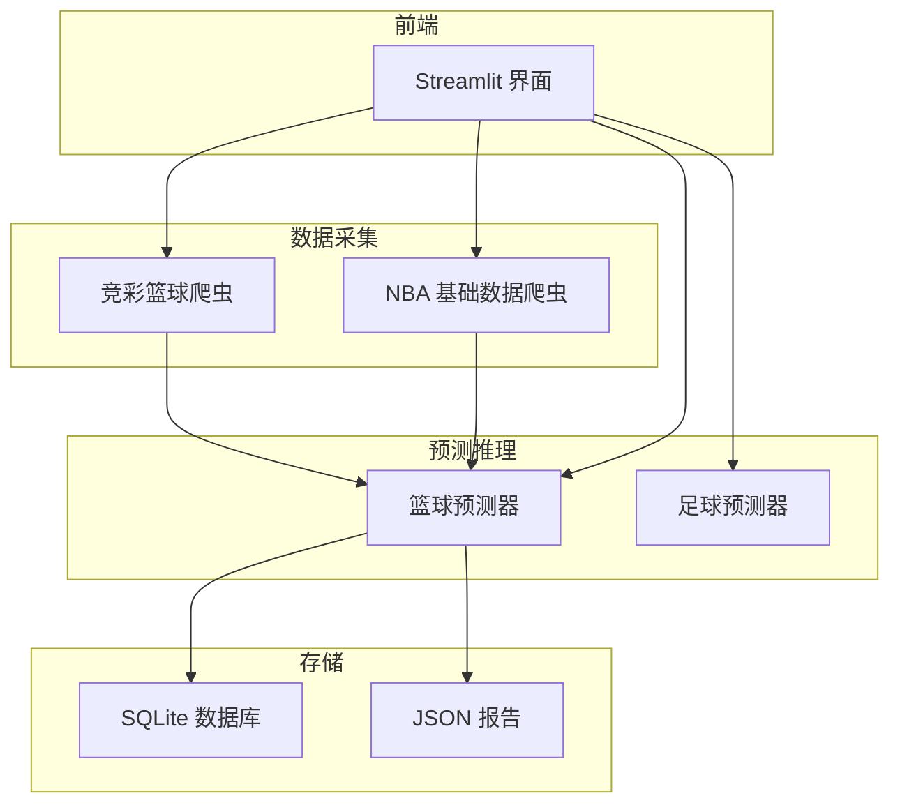
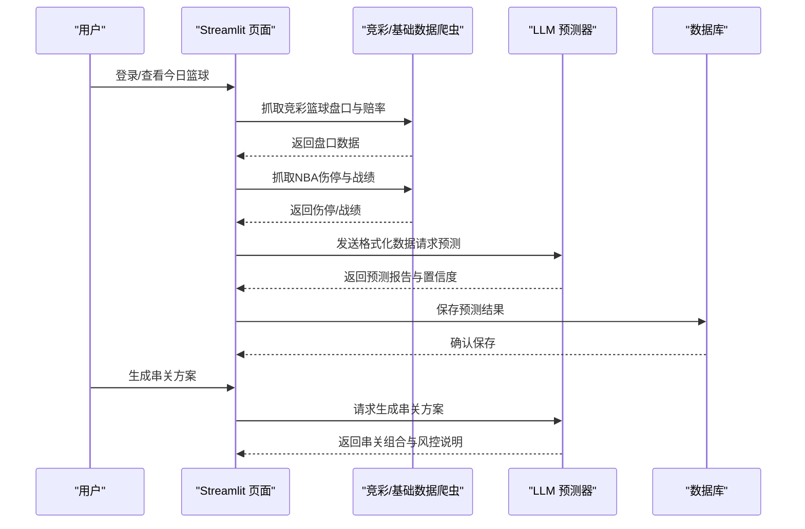
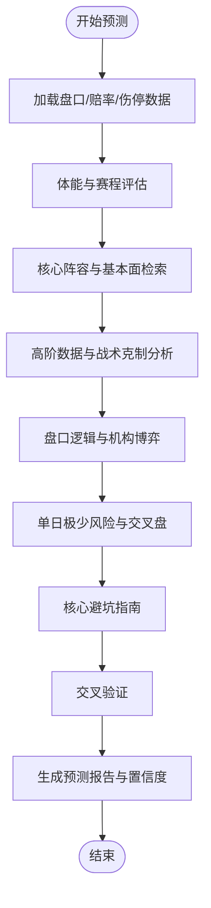
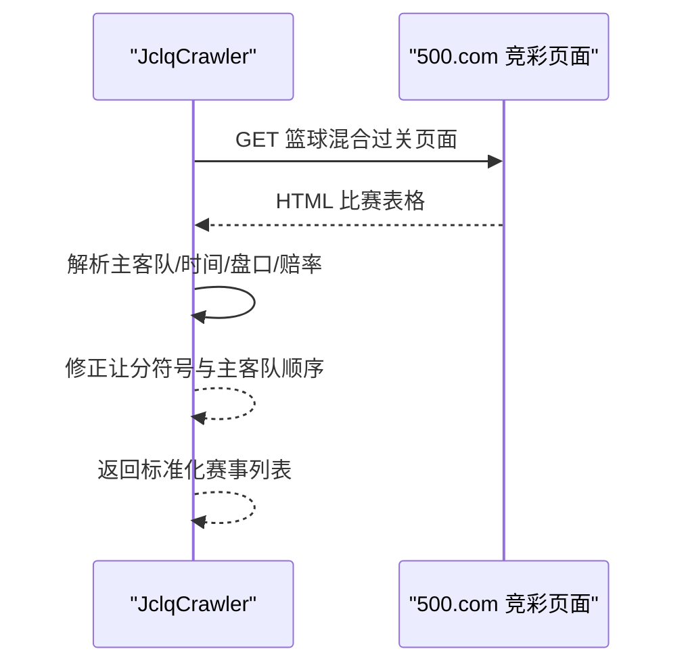
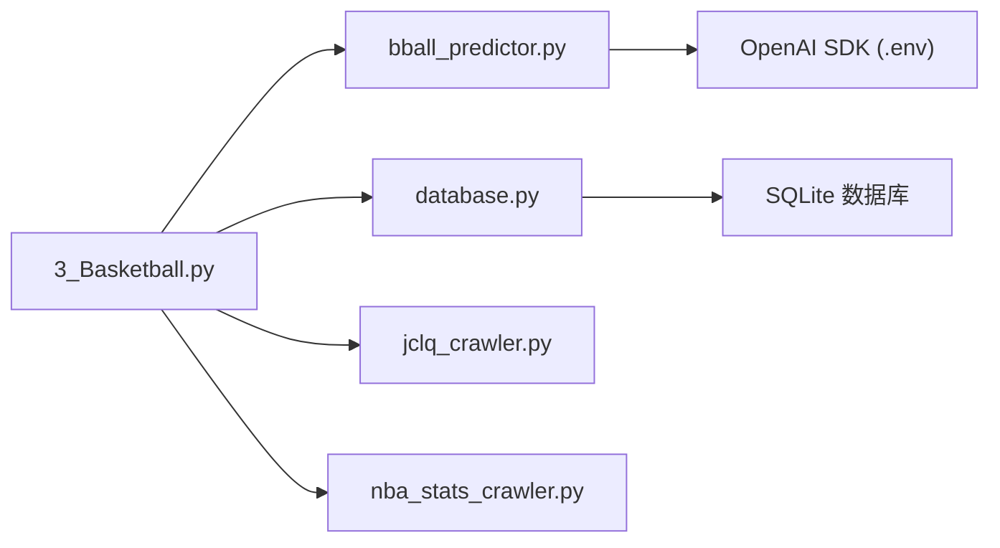

# 篮球预测模型

<cite>
**本文档引用的文件**
- [bball_predictor.py](file://src/llm/bball_predictor.py)
- [predictor.py](file://src/llm/predictor.py)
- [3_Basketball.py](file://src/pages/3_Basketball.py)
- [jclq_crawler.py](file://src/crawler/jclq_crawler.py)
- [nba_stats_crawler.py](file://src/crawler/nba_stats_crawler.py)
- [database.py](file://src/db/database.py)
- [run_bball_post_mortem.py](file://scripts/run_bball_post_mortem.py)
- [basketball_prediction_plan.md](file://docs/basketball_prediction_plan.md)
- [basketball_parlay_strategy.md](file://docs/basketball_parlay_strategy.md)
- [bball_all_compared_matches.json](file://data/reports/bball_all_compared_matches.json)
- [today_bball_matches.json](file://data/today_bball_matches.json)
</cite>

## 目录
1. [简介](#简介)
2. [项目结构](#项目结构)
3. [核心组件](#核心组件)
4. [架构总览](#架构总览)
5. [详细组件分析](#详细组件分析)
6. [依赖关系分析](#依赖关系分析)
7. [性能考虑](#性能考虑)
8. [故障排查指南](#故障排查指南)
9. [结论](#结论)
10. [附录](#附录)

## 简介
本文件面向篮球预测模型的技术文档，系统阐述模型的算法设计、数据处理流程与业务实践。重点包括：
- 篮球数据特点与盘口分析方法
- 球队状态评估与历史数据对比
- 篮球特有统计指标与攻防效率分析
- 伤病影响量化与风险评估
- 预测结果解读、投注建议生成与与足球模型的差异对比
- 实际应用中的注意事项与最佳实践

## 项目结构
该项目围绕“数据采集 → 预测推理 → 结果存储 → 复盘优化”的闭环构建，前端通过 Streamlit 提供可视化界面，后端通过 LLM 进行深度分析与串关生成。

**图表来源**
- [3_Basketball.py:1-451](file://src/pages/3_Basketball.py#L1-L451)
- [jclq_crawler.py:1-264](file://src/crawler/jclq_crawler.py#L1-L264)
- [nba_stats_crawler.py:1-133](file://src/crawler/nba_stats_crawler.py#L1-L133)
- [bball_predictor.py:1-282](file://src/llm/bball_predictor.py#L1-L282)
- [database.py:1-567](file://src/db/database.py#L1-L567)

**章节来源**
- [3_Basketball.py:1-451](file://src/pages/3_Basketball.py#L1-L451)
- [jclq_crawler.py:1-264](file://src/crawler/jclq_crawler.py#L1-L264)
- [nba_stats_crawler.py:1-133](file://src/crawler/nba_stats_crawler.py#L1-L133)
- [database.py:1-567](file://src/db/database.py#L1-L567)

## 核心组件
- 篮球预测器（BBallPredictor）：基于提示工程与多维度分析框架，输出让分胜负与大小分的综合预测。
- 竞彩篮球爬虫：抓取竞彩篮球的官方盘口与赔率数据。
- NBA 基础数据爬虫：抓取球队伤停与战绩等实时基本面数据。
- 数据库：持久化预测结果与复盘数据。
- 复盘脚本：自动化对比预测与实际结果，生成复盘报告。

**章节来源**
- [bball_predictor.py:1-282](file://src/llm/bball_predictor.py#L1-L282)
- [jclq_crawler.py:1-264](file://src/crawler/jclq_crawler.py#L1-L264)
- [nba_stats_crawler.py:1-133](file://src/crawler/nba_stats_crawler.py#L1-L133)
- [database.py:104-126](file://src/db/database.py#L104-L126)
- [run_bball_post_mortem.py:1-267](file://scripts/run_bball_post_mortem.py#L1-L267)

## 架构总览
篮球预测系统采用“前端交互 + 数据采集 + LLM 推理 + 存储与复盘”的分层架构。前端负责展示与控制，数据采集负责抓取官方盘口与实时伤停，LLM 负责多维度分析与生成串关方案，数据库负责持久化，复盘脚本负责闭环优化。

**图表来源**
- [3_Basketball.py:194-268](file://src/pages/3_Basketball.py#L194-L268)
- [jclq_crawler.py:14-138](file://src/crawler/jclq_crawler.py#L14-L138)
- [nba_stats_crawler.py:71-125](file://src/crawler/nba_stats_crawler.py#L71-L125)
- [bball_predictor.py:166-198](file://src/llm/bball_predictor.py#L166-L198)
- [database.py:331-366](file://src/db/database.py#L331-L366)

## 详细组件分析

### 篮球预测器（BBallPredictor）
- 角色与职责：资深篮球数据分析师与竞彩操盘专家，负责将多源数据转化为可解释的预测报告与串关方案。
- 分析工作流：
  1) 赛程消耗与体能红线评估（背靠背、客场、高原/极寒）
  2) 核心阵容与基本面实时检索（伤停、轮换、外援政策、欧篮深度）
  3) 高阶数据与战术克制（Pace、防守效率、空间博弈）
  4) 盘口逻辑与机构博弈（让分深浅、大小分诱导、交叉盘）
  5) 单日赛事极少风险（交叉盘收割）
  6) 核心避坑指南（体能优先、深盘后门掩护、大小分基于Pace与防守效率）
  7) 交叉验证与结论生成
- 输出格式：赛事概览、伤停与战意、盘口推演、核心风控提示、最终预测（让分/大小分/胜负/置信度）

**图表来源**
- [bball_predictor.py:29-90](file://src/llm/bball_predictor.py#L29-L90)
- [bball_predictor.py:166-198](file://src/llm/bball_predictor.py#L166-L198)

**章节来源**
- [bball_predictor.py:9-282](file://src/llm/bball_predictor.py#L9-L282)
- [basketball_prediction_plan.md:1-71](file://docs/basketball_prediction_plan.md#L1-L71)

### 竞彩篮球爬虫（JclqCrawler）
- 功能：抓取竞彩篮球今日可售比赛的盘口与赔率，修正主客队顺序与让分符号逻辑，解析胜负、让分胜负、大小分赔率。
- 输出：标准化的今日篮球赛事列表，包含比赛编号、对阵、时间、盘口与赔率。

**图表来源**
- [jclq_crawler.py:14-138](file://src/crawler/jclq_crawler.py#L14-L138)

**章节来源**
- [jclq_crawler.py:1-264](file://src/crawler/jclq_crawler.py#L1-L264)

### NBA 基础数据爬虫（NBAStatsCrawler）
- 功能：通过 ESPN API 获取球队伤停与战绩，支持中英文队名映射。
- 输出：每支球队的伤停清单与战绩摘要，用于预测器的基础数据注入。

**章节来源**
- [nba_stats_crawler.py:1-133](file://src/crawler/nba_stats_crawler.py#L1-L133)

### 数据库（BasketballPrediction）
- 表结构：存储篮球预测的原始数据、预测文本、实际比分与创建/更新时间。
- 方法：保存/查询篮球预测，支持按 fixture_id 精确匹配。

**章节来源**
- [database.py:104-126](file://src/db/database.py#L104-L126)
- [database.py:331-366](file://src/db/database.py#L331-L366)

### 复盘与报告（run_bball_post_mortem.py）
- 功能：抓取昨日赛果，对比预测与实际结果，生成 JSON 与 CSV 报告，更新命中状态。
- 输出：bball_all_compared_matches.json 与 detailed_bball_post_mortem_report.csv。

**章节来源**
- [run_bball_post_mortem.py:1-267](file://scripts/run_bball_post_mortem.py#L1-L267)
- [bball_all_compared_matches.json:1-128](file://data/reports/bball_all_compared_matches.json#L1-L128)

## 依赖关系分析
- 前端依赖：Streamlit 页面依赖预测器与数据库接口，负责展示与交互。
- 数据采集依赖：竞彩爬虫与 NBA 爬虫分别提供盘口/赔率与伤停/战绩。
- 预测器依赖：OpenAI SDK 与 .env 配置，输出预测文本与置信度。
- 存储依赖：SQLite 数据库存储预测与复盘数据。

**图表来源**
- [3_Basketball.py:1-451](file://src/pages/3_Basketball.py#L1-L451)
- [bball_predictor.py:1-282](file://src/llm/bball_predictor.py#L1-L282)
- [database.py:1-567](file://src/db/database.py#L1-L567)
- [jclq_crawler.py:1-264](file://src/crawler/jclq_crawler.py#L1-L264)
- [nba_stats_crawler.py:1-133](file://src/crawler/nba_stats_crawler.py#L1-L133)

**章节来源**
- [3_Basketball.py:1-451](file://src/pages/3_Basketball.py#L1-L451)
- [bball_predictor.py:1-282](file://src/llm/bball_predictor.py#L1-L282)
- [database.py:1-567](file://src/db/database.py#L1-L567)

## 性能考虑
- 爬取频率与缓存：前端对今日篮球数据使用 5 分钟缓存，避免频繁请求。
- LLM 调用成本：温度与 token 限制需平衡准确性与成本，建议在生产环境启用速率限制与重试机制。
- 数据库写入：批量保存预测与复盘结果，减少事务开销。
- 并发控制：全局重新预测时按批次处理，避免 API 限流与数据库压力。

[本节为通用指导，无需特定文件引用]

## 故障排查指南
- LLM API 配置：检查 .env 中 LLM_API_KEY、LLM_API_BASE、LLM_MODEL 是否正确。
- 爬虫异常：确认网络可达与页面结构未变更；竞彩页面让分/大小分解析逻辑依赖特定 class 与 data 属性。
- 数据库异常：确认 football.db 路径与权限，首次运行自动建表。
- 复盘脚本：确保昨日日期参数正确，数据库中存在对应预测记录。

**章节来源**
- [bball_predictor.py:10-28](file://src/llm/bball_predictor.py#L10-L28)
- [jclq_crawler.py:20-31](file://src/crawler/jclq_crawler.py#L20-L31)
- [database.py:200-217](file://src/db/database.py#L200-L217)
- [run_bball_post_mortem.py:80-125](file://scripts/run_bball_post_mortem.py#L80-L125)

## 结论
篮球预测模型通过“多维度基本面 + 盘口逻辑 + 机构博弈 + 体能与战意”的综合分析，形成可解释、可复盘、可迭代的预测体系。与足球模型相比，篮球更强调体能红线、深盘后门掩护与大小分基于 Pace 与防守效率的判断。建议在实际应用中持续优化提示词、强化复盘闭环，并结合串关风控策略提升稳健性。

[本节为总结性内容，无需特定文件引用]

## 附录

### 篮球预测核心维度规划
- 基本面与人员变动：核心伤停、阵容深度、轮换、外援政策
- 赛程消耗与体能：背靠背、客场、高原/极寒
- 战术克制与高阶数据：Pace、篮板、防守效率、对位克制
- 盘口逻辑与机构博弈：让分深浅、大小分诱导、交叉盘
- 欧篮专项：双赛周、魔鬼主场、40分钟赛制、防守效率权重

**章节来源**
- [basketball_prediction_plan.md:1-71](file://docs/basketball_prediction_plan.md#L1-L71)

### 篮球串关策略与风控
- 三大死穴：双胆双热、深盘体能、只看场均得分
- 职业级策略：同场关联、2串1矩阵防守、单日极少交叉盘避险
- 生成提示词优化：严禁长串、强制异构组合、体能一票否决、深盘后门掩护排除

**章节来源**
- [basketball_parlay_strategy.md:1-51](file://docs/basketball_parlay_strategy.md#L1-L51)

### 示例预测与复盘数据
- 今日篮球预测示例：包含让分/大小分/胜负/置信度与理由
- 复盘对比：预测命中/错误、原因与反思

**章节来源**
- [today_bball_matches.json:1-589](file://data/today_bball_matches.json#L1-L589)
- [bball_all_compared_matches.json:1-128](file://data/reports/bball_all_compared_matches.json#L1-L128)