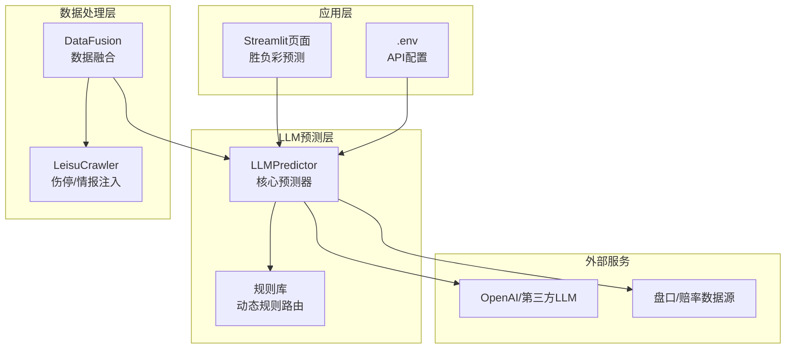
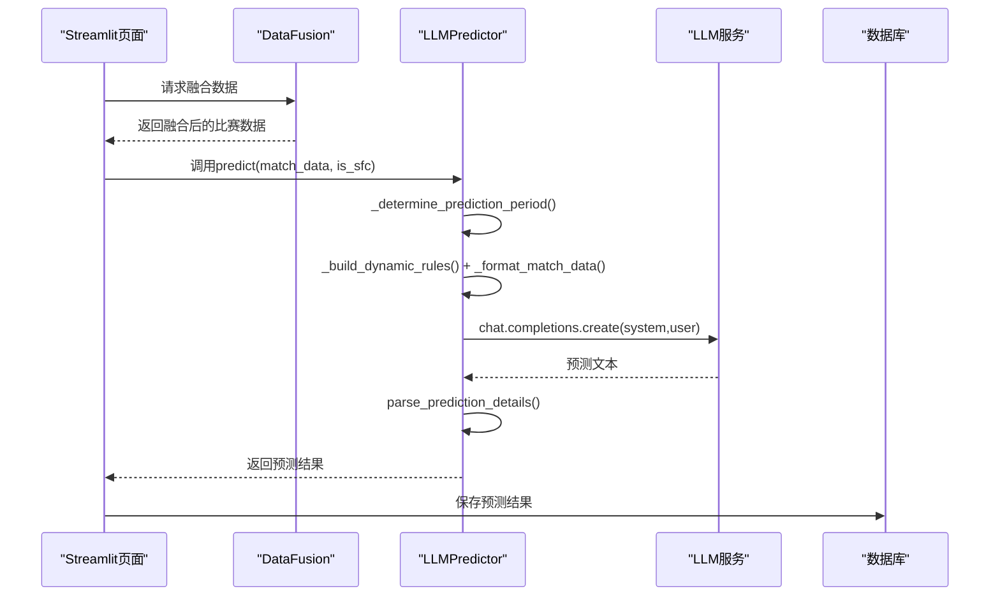
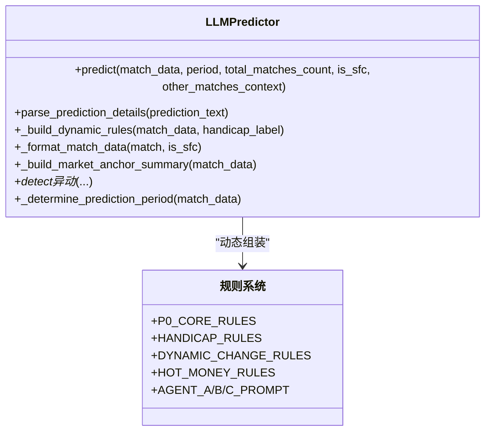
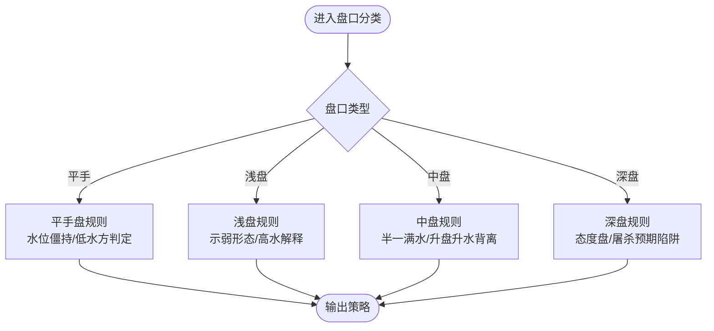
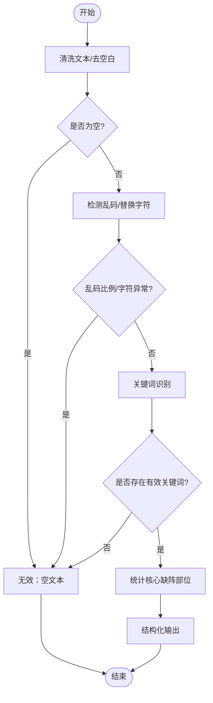
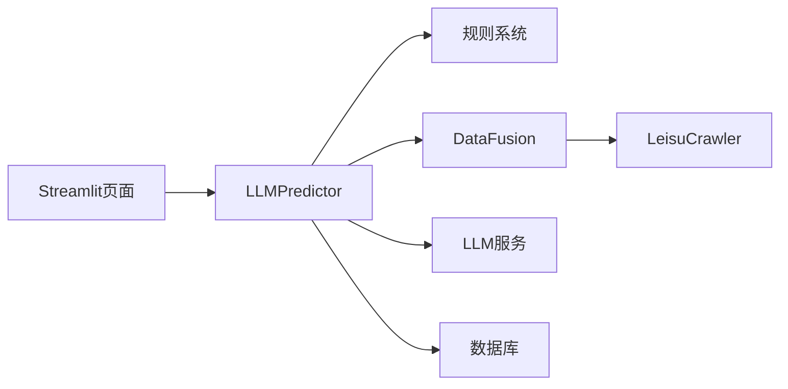

# 足球全场预测模型

<cite>
**本文档引用的文件**
- [predictor.py](file://src/llm/predictor.py)
- [predictor_back.py](file://src/llm/predictor_back.py)
- [rules.py](file://src/llm/rules.py)
- [data_fusion.py](file://src/processor/data_fusion.py)
- [.env](file://config/.env)
- [ShengFuCai.py](file://src/pages/4_ShengFuCai.py)
- [test_parse.py](file://scripts/test_parse.py)
- [rule_registry.py](file://src/utils/rule_registry.py)
</cite>

## 目录
1. [项目概述](#项目概述)
2. [项目结构](#项目结构)
3. [核心组件](#核心组件)
4. [架构总览](#架构总览)
5. [详细组件分析](#详细组件分析)
6. [依赖关系分析](#依赖关系分析)
7. [性能考量](#性能考量)
8. [故障排查指南](#故障排查指南)
9. [结论](#结论)
10. [附录](#附录)

## 项目概述
本项目为足球全场预测模型，围绕LLMPredictor类构建，通过提示词工程、动态规则路由、盘口分类机制、伤停数据量化、基本面分析与盘赔异动检测，形成一套可解释、可迭代的竞彩足球预测体系。系统支持多时间段预测（赛前24小时、12小时、临场），并提供胜负彩专用流程与结果解析。

## 项目结构
- src/llm：LLM预测器与规则库
- src/processor：数据融合与第三方数据注入
- src/pages：Streamlit前端页面（胜负彩预测界面）
- config：环境变量配置
- scripts：测试与验证脚本
- data：规则、报告、临时数据

**图表来源**
- [predictor.py:20-80](file://src/llm/predictor.py#L20-L80)
- [data_fusion.py:57-108](file://src/processor/data_fusion.py#L57-L108)
- [.env:1-20](file://config/.env#L1-L20)

**章节来源**
- [predictor.py:20-80](file://src/llm/predictor.py#L20-L80)
- [data_fusion.py:57-108](file://src/processor/data_fusion.py#L57-L108)
- [.env:1-20](file://config/.env#L1-L20)

## 核心组件
- LLMPredictor：核心预测器，负责提示词构建、动态规则组装、数据格式化、调用LLM并解析输出。
- 规则系统：P0绝对铁律、盘型规则（平手/浅盘/中盘/深盘）、动态变化规则、热钱方向规则、Agent角色提示词。
- 数据融合：整合竞彩、欧亚盘口、高级统计、伤停情报、历史交锋、进球分布等多源数据。
- 前端集成：Streamlit页面提供胜负彩预测入口，支持一键批量预测与结果展示。

**章节来源**
- [predictor.py:20-80](file://src/llm/predictor.py#L20-L80)
- [rules.py:11-227](file://src/llm/rules.py#L11-L227)
- [data_fusion.py:57-108](file://src/processor/data_fusion.py#L57-L108)
- [ShengFuCai.py:58-86](file://src/pages/4_ShengFuCai.py#L58-L86)

## 架构总览
预测流程从数据融合开始，LLMPredictor根据比赛时间自动判断预测时间段，动态组装提示词与规则，调用LLM生成分析报告，随后解析输出并持久化。前端页面提供交互入口与结果展示。

**图表来源**
- [ShengFuCai.py:58-86](file://src/pages/4_ShengFuCai.py#L58-L86)
- [predictor.py:689-754](file://src/llm/predictor.py#L689-L754)
- [predictor.py:289-440](file://src/llm/predictor.py#L289-L440)

**章节来源**
- [ShengFuCai.py:58-86](file://src/pages/4_ShengFuCai.py#L58-L86)
- [predictor.py:689-754](file://src/llm/predictor.py#L689-L754)
- [predictor.py:289-440](file://src/llm/predictor.py#L289-L440)

## 详细组件分析

### LLMPredictor类详解
- 初始化与配置
  - 从项目根目录动态定位config/.env，读取LLM_API_KEY、LLM_API_BASE、LLM_MODEL。
  - 支持开启LLM主观盘赔推演开关（ENABLE_LLM_SUBJECTIVE_MARKET_ANALYSIS）。
- 动态规则构建
  - P0绝对铁律：上下盘定义、主客不颠倒、让球逻辑自洽、赔率方向矛盾熔断、资金异动强制干预。
  - 盘型规则：平手、浅盘、中盘、深盘四类规则，针对不同盘口给出差异化推理约束。
  - 动态变化规则：退盘/升水等通用异动解释框架。
  - 热钱方向规则：基于欧赔初赔→临赔变化的资金流向识别，提供反向背离与共识同向的判定框架。
  - Agent角色：A（基本面）、B（盘口）、C（风控裁判长）三角色协同输出。
- 数据格式化与提示词工程
  - 自动计算场均进球/失球，结构化展示伤停、高阶攻防、历史交锋、进球分布、联赛排名等。
  - 量化伤停影响：识别有效伤停文本、统计核心缺阵人数、结构化输出伤停明细。
  - 市场锚点：亚指让球方与欧赔实力方的定义与文本化摘要，指导情报归类与盘口解释。
  - 盘赔异动检测：超深盘死水、半球生死盘、平手僵持、赔率方向矛盾、盘水背离、浅盘升水诱下、欧亚背离、浅盘示弱诱下等预警。
- 预测与解析
  - predict：根据比赛时间自动判断时间段，支持胜负彩专用提示词，支持同日多场比赛上下文。
  - parse_prediction_details：抽取竞彩推荐、进球数、比分、置信度等结构化信息。
- 时间段判断
  - 赛前>24小时：pre_24h；12-24小时：pre_12h；<12小时：final。

**图表来源**
- [predictor.py:20-80](file://src/llm/predictor.py#L20-L80)
- [rules.py:11-227](file://src/llm/rules.py#L11-L227)

**章节来源**
- [predictor.py:20-80](file://src/llm/predictor.py#L20-L80)
- [rules.py:11-227](file://src/llm/rules.py#L11-L227)

### 盘口分类机制与预测策略
- 平手盘（0）
  - 水位僵持：两端水位无变化，严禁双选，置信度上限55。
  - 低水方为客队：机构防范客胜，推荐主队不败。
- 浅盘（平半~半球）
  - 浅盘示弱总则：退盘、高水震荡、盘口僵持等示弱形态，需先检查受让方是否更舒适，避免误判诱下。
  - 浅盘高水真实阻力：若基本面无明显利空，浅盘高水更应理解为制造“让球方不稳”的假象。
- 中盘（半一~一球）
  - 半一满水：阻上经典手法，高水恐吓，推荐上盘打穿。
  - 一球低水+主队火力猛：警惕“屠杀预期”陷阱，避免线性推演大胜。
  - 升盘+升水背离：升盘本应降水，水位反升说明不看好上盘，判定为诱上，走下盘。
- 深盘与超深盘（≥1.25）
  - 深盘客让防主胜规则：当盘口为受半一或更深，且客队NSPF赔率<1.60时，主队爆冷概率被低估，严禁输出“平/负”双选。
  - 初盘深盘+低水/降水：态度盘（阻上），推荐正路打穿。
  - 强队无积分压力开出两球半：战意归零表演赛风险，防赢球输盘或爆冷。

**图表来源**
- [rules.py:32-64](file://src/llm/rules.py#L32-L64)

**章节来源**
- [rules.py:32-64](file://src/llm/rules.py#L32-L64)

### 伤停数据量化处理
- 有效性检测
  - 去除空白、替换字符、CJK字符乱码比例阈值，确保伤停文本可解析。
  - 关键词识别：伤病、停赛、缺阵等，防止“0人”误导。
- 核心缺阵统计
  - 统计跟腱、肌肉、韧带、膝、踝、骨折、重伤、赛季报销等高影响部位描述，量化核心缺阵人数。
- 结构化输出
  - 按主/客队拆分，输出伤病/停赛明细与核心缺阵人数，便于后续风险评估。

**图表来源**
- [predictor.py:283-308](file://src/llm/predictor.py#L283-L308)
- [predictor.py:412-433](file://src/llm/predictor.py#L412-L433)

**章节来源**
- [predictor.py:283-308](file://src/llm/predictor.py#L283-L308)
- [predictor.py:412-433](file://src/llm/predictor.py#L412-L433)

### 基本面分析与盘赔异动检测算法
- 基本面
  - 战意-状态三维评估：赛程密度、联赛风格克制、主场优势动态加权、近期状态权重极化、历史交锋衰减、压力维度。
  - 伤停与阵容：结构化伤停影响量化，核心缺阵人数作为风险因子。
  - 高阶攻防：场均进球/失球、射门/射正/xG等，支持fallback正则计算。
- 盘赔异动
  - 超深盘死水预警：初盘深盘且临场水位几乎无波动，提示受让方方向冷门。
  - 半球生死盘预警：维持半球盘但让球方水位异常飙升或升盘降水，判定阻上或诱上。
  - 平手盘水位僵持预警：两端水位无变化，严禁单选，需保留三选。
  - 赔率方向矛盾预警：亚指、欧赔、竞彩让球三者冲突时，强制熔断并降低置信度。
  - 盘水背离预警：升盘+升水，不看好上盘，判定为诱上。
  - 浅盘升水诱下预警：浅盘高水且水位持续升高，警惕诱下。
  - 欧亚背离量化预警：理论应开盘与实际盘口差异≥0.5球，提示背离风险。
  - 浅盘示弱诱下预警：浅盘示弱形态下，若受让方更舒适，避免误判诱下。

**章节来源**
- [predictor.py:482-585](file://src/llm/predictor.py#L482-L585)
- [predictor.py:587-657](file://src/llm/predictor.py#L587-L657)
- [predictor.py:2973-3148](file://src/llm/predictor.py#L2973-L3148)

### 预测偏好标准化与市场锚点
- 预测偏好标准化
  - _normalize_prediction_bias：将“主队方向/客队方向/胜/平/负”等文本归一化为“胜/平/负/胜平/平负/胜负”。
  - _tokens_to_prediction_bias/_prediction_bias_to_tokens：在多选与单选间转换。
- 市场锚点定义
  - _resolve_asian_giving_side：以亚盘即时/初盘为准，确定让球方与盘口强度。
  - _resolve_euro_strength_side：以欧赔初/临赔低赔方为准，确定实力方。
  - _build_market_anchor_summary：输出亚指/欧赔锚点文本，指导情报归类与盘口解释。

**章节来源**
- [predictor.py:717-791](file://src/llm/predictor.py#L717-L791)
- [predictor.py:659-716](file://src/llm/predictor.py#L659-L716)

### 信号权重计算与规则融合
- 微观信号规则
  - 基于规则注册表，将触发的rule_id映射为预测偏向，合并多个偏向得到“微观信号偏见”。
- 风控策略
  - 根据触发的规则ID、赔率方向矛盾、锚点分歧等，构建风控策略（熔断、双选、置信度上限等）。

**章节来源**
- [predictor.py:4462-4474](file://src/llm/predictor.py#L4462-L4474)
- [rule_registry.py:102-147](file://src/utils/rule_registry.py#L102-L147)

### 调用预测接口与结果处理示例
- 调用方式
  - Streamlit页面：predict_single_sfc_match(match, db) → LLMPredictor.predict(is_sfc=True)。
  - 直接调用：LLMPredictor().predict(match_data, period, total_matches_count, is_sfc, other_matches_context)。
- 结果解析
  - parse_prediction_details：抽取竞彩推荐、进球数、比分、置信度等。
- 错误处理
  - LLM调用异常：捕获异常并返回“预测失败: ...”。

**章节来源**
- [ShengFuCai.py:58-86](file://src/pages/4_ShengFuCai.py#L58-L86)
- [test_parse.py:1-13](file://scripts/test_parse.py#L1-L13)
- [predictor.py:751-753](file://src/llm/predictor.py#L751-L753)

## 依赖关系分析
- 组件耦合
  - LLMPredictor依赖规则系统与数据融合模块，耦合度适中，通过动态规则与提示词工程降低上下文负担。
  - 前端页面与预测器通过数据库交互，解耦良好。
- 外部依赖
  - LLM服务（OpenAI/第三方）与盘口/赔率数据源。
- 规则系统
  - 微观规则与仲裁规则通过规则注册表进行标准化与可扩展管理。

**图表来源**
- [predictor.py:20-80](file://src/llm/predictor.py#L20-L80)
- [data_fusion.py:57-108](file://src/processor/data_fusion.py#L57-L108)
- [ShengFuCai.py:58-86](file://src/pages/4_ShengFuCai.py#L58-L86)

**章节来源**
- [predictor.py:20-80](file://src/llm/predictor.py#L20-L80)
- [data_fusion.py:57-108](file://src/processor/data_fusion.py#L57-L108)
- [ShengFuCai.py:58-86](file://src/pages/4_ShengFuCai.py#L58-L86)

## 性能考量
- 上下文控制：动态规则组装与提示词工程减少单次对话上下文，降低“中间遗忘”风险。
- 缓存与批处理：Streamlit页面支持一键批量预测与缓存，减少重复抓取与LLM调用。
- 数据预处理：结构化伤停、高阶攻防数据与盘口锚点，提升推理效率与准确性。

## 故障排查指南
- LLM配置错误
  - 现象：初始化时报“LLM_API_KEY is not set”。
  - 处理：检查config/.env中LLM_API_KEY、LLM_API_BASE、LLM_MODEL是否正确配置。
- LLM调用失败
  - 现象：predict返回“预测失败: ...”。
  - 处理：检查网络连通性、API密钥有效性与服务端状态。
- 伤停解析异常
  - 现象：伤停明细疑似乱码/无效，跳过量化。
  - 处理：确认第三方数据源文本编码，必要时人工校验伤停文本。
- 预测结果解析失败
  - 现象：parse_prediction_details返回兜底结果。
  - 处理：检查LLM输出格式是否符合预期，必要时调整提示词。

**章节来源**
- [.env:1-20](file://config/.env#L1-L20)
- [predictor.py:35-38](file://src/llm/predictor.py#L35-L38)
- [predictor.py:751-753](file://src/llm/predictor.py#L751-L753)
- [predictor.py:283-308](file://src/llm/predictor.py#L283-L308)
- [test_parse.py:1-13](file://scripts/test_parse.py#L1-L13)

## 结论
本模型通过提示词工程与动态规则系统，将复杂的盘口博弈、基本面与伤停信息结构化为可解释的预测流程。盘口分类机制与异动检测算法为不同盘口提供了差异化策略，配合预测偏好标准化与市场锚点，提升了预测的稳定性与可解释性。前端集成与规则注册表进一步增强了系统的可维护性与可扩展性。

## 附录
- 示例调用路径
  - [ShengFuCai.py:58-86](file://src/pages/4_ShengFuCai.py#L58-L86)
  - [predictor.py:689-754](file://src/llm/predictor.py#L689-L754)
- 结果解析示例
  - [test_parse.py:1-13](file://scripts/test_parse.py#L1-L13)
- 规则注册与规范化
  - [rule_registry.py:102-147](file://src/utils/rule_registry.py#L102-L147)