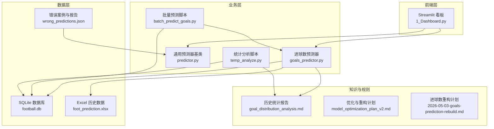
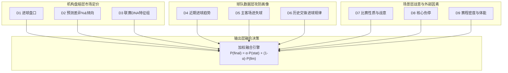
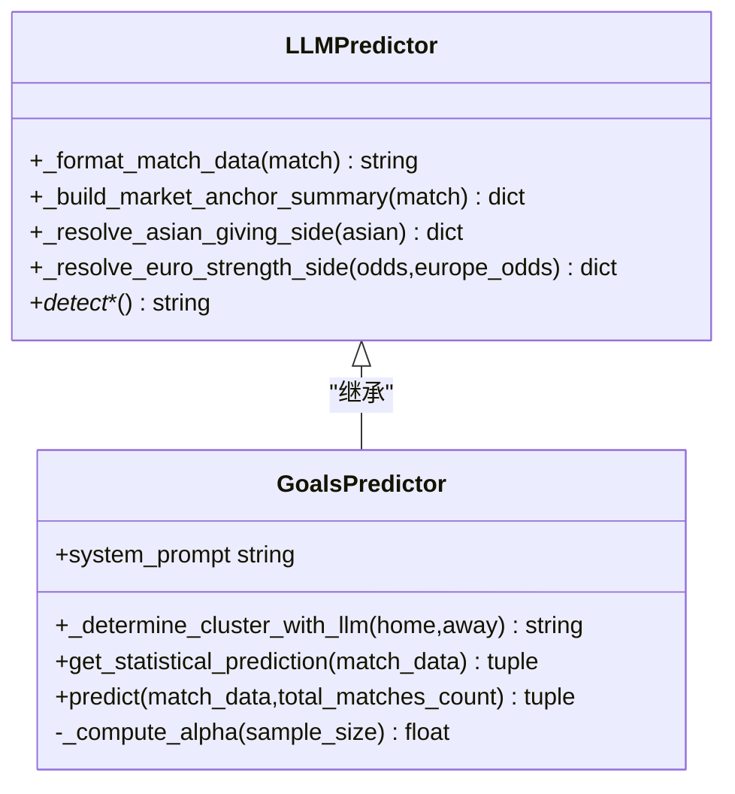
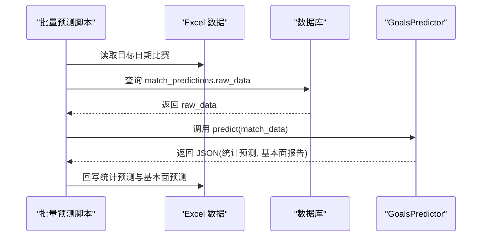
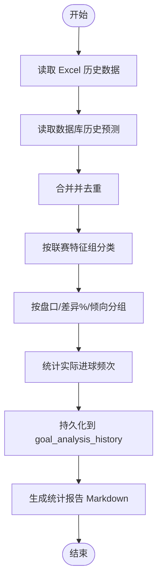
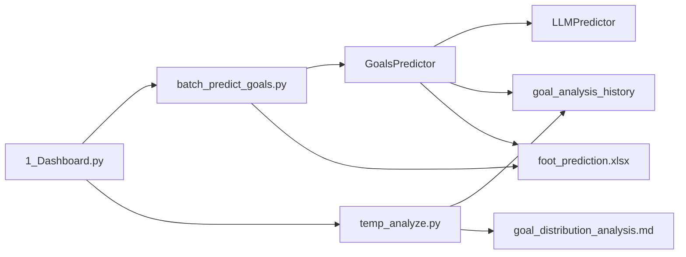

# 进球数预测模型

<cite>
**本文档引用的文件**
- [src/llm/goals_predictor.py](file://src/llm/goals_predictor.py)
- [src/llm/predictor.py](file://src/llm/predictor.py)
- [scripts/batch_predict_goals.py](file://scripts/batch_predict_goals.py)
- [scripts/temp_analyze.py](file://scripts/temp_analyze.py)
- [docs/goal_distribution_analysis.md](file://docs/goal_distribution_analysis.md)
- [docs/model_optimization_plan_v2.md](file://docs/model_optimization_plan_v2.md)
- [docs/plans/2026-05-03-goals-prediction-rebuild.md](file://docs/plans/2026-05-03-goals-prediction-rebuild.md)
- [src/pages/1_Dashboard.py](file://src/pages/1_Dashboard.py)
- [data/football.db](file://data/football.db)
- [scripts/analyze_errors.py](file://scripts/analyze_errors.py)
- [data/reports/wrong_predictions.json](file://data/reports/wrong_predictions.json)
</cite>

## 目录
1. [简介](#简介)
2. [项目结构](#项目结构)
3. [核心组件](#核心组件)
4. [架构总览](#架构总览)
5. [详细组件分析](#详细组件分析)
6. [依赖关系分析](#依赖关系分析)
7. [性能考虑](#性能考虑)
8. [故障排查指南](#故障排查指南)
9. [结论](#结论)
10. [附录](#附录)

## 简介
本技术文档面向“进球数预测模型”的设计与实现，系统阐述基于统计学与机器学习的进球数预测方法论，涵盖泊松分布、贝叶斯推断与深度学习思想在实际工程中的应用路径。文档还详细说明了进球时间分布分析、球队进攻效率与防守稳定性评估、历史进球数据挖掘与趋势分析、异常检测算法，以及预测结果的概率分布解读、置信区间计算与风险评估方法。最后提供模型验证、准确性评估与持续优化策略，帮助读者从理论到实践全面掌握该预测体系。

## 项目结构
该项目采用模块化分层架构，围绕“机构盘口信号”“球队攻防画像”“战意与外部因素”“统计后验概率”四个层次构建“四层十维深度融合决策引擎”。前端通过 Streamlit 提供可视化看板，后端通过 LLM 与数据库协同完成预测与回写。

**图表来源**
- [src/pages/1_Dashboard.py](file://src/pages/1_Dashboard.py)
- [src/llm/goals_predictor.py](file://src/llm/goals_predictor.py)
- [src/llm/predictor.py](file://src/llm/predictor.py)
- [scripts/batch_predict_goals.py](file://scripts/batch_predict_goals.py)
- [scripts/temp_analyze.py](file://scripts/temp_analyze.py)
- [data/football.db](file://data/football.db)
- [docs/goal_distribution_analysis.md](file://docs/goal_distribution_analysis.md)
- [docs/model_optimization_plan_v2.md](file://docs/model_optimization_plan_v2.md)
- [docs/plans/2026-05-03-goals-prediction-rebuild.md](file://docs/plans/2026-05-03-goals-prediction-rebuild.md)
- [data/reports/wrong_predictions.json](file://data/reports/wrong_predictions.json)

**章节来源**
- [src/pages/1_Dashboard.py](file://src/pages/1_Dashboard.py)
- [src/llm/goals_predictor.py](file://src/llm/goals_predictor.py)
- [src/llm/predictor.py](file://src/llm/predictor.py)
- [scripts/batch_predict_goals.py](file://scripts/batch_predict_goals.py)
- [scripts/temp_analyze.py](file://scripts/temp_analyze.py)
- [data/football.db](file://data/football.db)
- [docs/goal_distribution_analysis.md](file://docs/goal_distribution_analysis.md)
- [docs/model_optimization_plan_v2.md](file://docs/model_optimization_plan_v2.md)
- [docs/plans/2026-05-03-goals-prediction-rebuild.md](file://docs/plans/2026-05-03-goals-prediction-rebuild.md)
- [data/reports/wrong_predictions.json](file://data/reports/wrong_predictions.json)

## 核心组件
- 进球数预测器（GoalsPredictor）：继承通用预测器基类，聚焦“进球数预测”，内置四层十维分析框架与统计后验概率融合机制。
- 通用预测器基类（LLMPredictor）：提供盘口异动检测、伤停量化、情报锚点、市场锚点等通用能力，支撑进球数预测器的多维输入。
- 批量预测脚本（batch_predict_goals.py）：对接 Excel 与数据库，批量执行进球数预测并回写结果。
- 统计分析脚本（temp_analyze.py）：从 Excel 与数据库融合历史数据，生成“进球数概率分布统计报告”，驱动 LLM 的后验概率输入。
- Streamlit 看板（1_Dashboard.py）：提供“进球数专项控制台”，支持按日期预测、重新预测与统计报告更新。
- 数据库（football.db）：存储历史预测、盘口与基本面数据，支持统计回写与复盘分析。
- 错误分析与复盘（analyze_errors.py、wrong_predictions.json）：提供错误案例归因与优化建议，形成闭环改进。

**章节来源**
- [src/llm/goals_predictor.py](file://src/llm/goals_predictor.py)
- [src/llm/predictor.py](file://src/llm/predictor.py)
- [scripts/batch_predict_goals.py](file://scripts/batch_predict_goals.py)
- [scripts/temp_analyze.py](file://scripts/temp_analyze.py)
- [src/pages/1_Dashboard.py](file://src/pages/1_Dashboard.py)
- [data/football.db](file://data/football.db)
- [scripts/analyze_errors.py](file://scripts/analyze_errors.py)
- [data/reports/wrong_predictions.json](file://data/reports/wrong_predictions.json)

## 架构总览
四层十维深度融合架构将“机构定价信号”“球队攻防画像”“战意与外部因素”“统计后验概率”整合为统一的预测决策引擎。输出层通过加权融合实现统计模型与 LLM 推理的互补，提升预测稳定性与可解释性。

**图表来源**
- [docs/plans/2026-05-03-goals-prediction-rebuild.md](file://docs/plans/2026-05-03-goals-prediction-rebuild.md)
- [src/llm/goals_predictor.py](file://src/llm/goals_predictor.py)

**章节来源**
- [docs/plans/2026-05-03-goals-prediction-rebuild.md](file://docs/plans/2026-05-03-goals-prediction-rebuild.md)
- [src/llm/goals_predictor.py](file://src/llm/goals_predictor.py)

## 详细组件分析

### 组件A：进球数预测器（GoalsPredictor）
- 职责：基于机构盘口、联赛特征组、球队攻防画像、战意与外部因素，结合统计后验概率与 LLM 推理，输出“进球数预测”与“统计数据洞察”。
- 关键能力：
  - 统计匹配：按“盘口+差异%+倾向+特征组”在历史数据库中检索最高概率进球数，作为 LLM 的“后验概率提示”。
  - LLM 推理：在统一的四层十维框架下进行结构化推演，强制输出十维推演过程，确保可追溯与可解释。
  - 加权融合：根据样本量与特征组稳定性计算权重 α，融合统计概率与 LLM 概率分布，得到最终预测。
  - 数据透传：将近期进球趋势、主客场进失球、历史交锋规律、伤停情报等作为结构化输入传递给 LLM。

**图表来源**
- [src/llm/predictor.py](file://src/llm/predictor.py)
- [src/llm/goals_predictor.py](file://src/llm/goals_predictor.py)

**章节来源**
- [src/llm/goals_predictor.py](file://src/llm/goals_predictor.py)
- [src/llm/predictor.py](file://src/llm/predictor.py)

### 组件B：批量预测与回写（batch_predict_goals.py）
- 职责：从 Excel 读取目标日期的比赛数据，结合数据库中的原始预测数据，调用 GoalsPredictor 执行预测，并将统计预测与基本面预测结果回写到 Excel。
- 关键流程：
  - 读取 Excel（按日期匹配 sheet 与行）。
  - 查询数据库中对应比赛的 raw_data。
  - 构造 match_data（注入进球盘口、差异%、倾向）。
  - 调用 GoalsPredictor.predict，解析返回的 JSON。
  - 提取统计预测与基本面预测，回写到 Excel 对应列。

**图表来源**
- [scripts/batch_predict_goals.py](file://scripts/batch_predict_goals.py)
- [src/llm/goals_predictor.py](file://src/llm/goals_predictor.py)
- [data/football.db](file://data/football.db)

**章节来源**
- [scripts/batch_predict_goals.py](file://scripts/batch_predict_goals.py)
- [src/llm/goals_predictor.py](file://src/llm/goals_predictor.py)
- [data/football.db](file://data/football.db)

### 组件C：统计分析与报告生成（temp_analyze.py 与 goal_distribution_analysis.md）
- 职责：将 Excel 中的历史进球数据与数据库中的历史预测数据融合，按“联赛特征组+盘口+差异%+倾向”统计实际进球分布，生成“进球数概率分布统计报告”，供 LLM 作为后验概率参考。
- 关键流程：
  - 读取 Excel 与数据库，清洗与去重。
  - 定义/判定联赛特征组（A/B/C/D/E 组）。
  - 按盘口、差异%、倾向与特征组分组统计实际进球频次，生成概率分布。
  - 写入数据库表 goal_analysis_history，生成 Markdown 报告。

**图表来源**
- [scripts/temp_analyze.py](file://scripts/temp_analyze.py)
- [data/football.db](file://data/football.db)
- [docs/goal_distribution_analysis.md](file://docs/goal_distribution_analysis.md)

**章节来源**
- [scripts/temp_analyze.py](file://scripts/temp_analyze.py)
- [data/football.db](file://data/football.db)
- [docs/goal_distribution_analysis.md](file://docs/goal_distribution_analysis.md)

### 组件D：看板与控制台（1_Dashboard.py）
- 职责：提供“进球数专项控制台”，支持按日期预测、重新预测、更新统计报告等操作；在全局预测中注入进球数相关数据（如 Excel 中的进球盘口、差异%、倾向）。
- 关键功能：
  - 进球数专项控制台：调用批量预测脚本，回写 Excel。
  - 更新统计报告：调用统计分析脚本，刷新 Markdown 报告。
  - 全局预测：在调用通用预测器时，注入 goals_pan、goals_diff_percent、goals_trend 等字段。

**章节来源**
- [src/pages/1_Dashboard.py](file://src/pages/1_Dashboard.py)

## 依赖关系分析
- GoalsPredictor 依赖 LLMPredictor 的通用盘口与市场分析能力（如市场锚点、伤停量化、盘口异动检测等）。
- 统计后验概率来源于数据库表 goal_analysis_history，由 temp_analyze.py 自动生成与维护。
- 批量预测脚本依赖 Excel 与数据库，将预测结果回写至 Excel。
- Streamlit 看板作为入口，协调前端交互与后端预测流程。

**图表来源**
- [src/llm/goals_predictor.py](file://src/llm/goals_predictor.py)
- [src/llm/predictor.py](file://src/llm/predictor.py)
- [scripts/batch_predict_goals.py](file://scripts/batch_predict_goals.py)
- [scripts/temp_analyze.py](file://scripts/temp_analyze.py)
- [src/pages/1_Dashboard.py](file://src/pages/1_Dashboard.py)
- [data/football.db](file://data/football.db)
- [docs/goal_distribution_analysis.md](file://docs/goal_distribution_analysis.md)

**章节来源**
- [src/llm/goals_predictor.py](file://src/llm/goals_predictor.py)
- [src/llm/predictor.py](file://src/llm/predictor.py)
- [scripts/batch_predict_goals.py](file://scripts/batch_predict_goals.py)
- [scripts/temp_analyze.py](file://scripts/temp_analyze.py)
- [src/pages/1_Dashboard.py](file://src/pages/1_Dashboard.py)
- [data/football.db](file://data/football.db)
- [docs/goal_distribution_analysis.md](file://docs/goal_distribution_analysis.md)

## 性能考虑
- 数据访问优化：批量预测脚本与统计分析脚本尽量减少重复查询，通过去重与缓存（如 LLM 集群判定缓存）降低 IO 压力。
- LLM 调用成本控制：通过结构化 Prompt 与输出模板，减少不必要的上下文长度；在 Dashboard 中提供“按日期预测/重新预测”按钮，避免频繁全量调用。
- 数据库写入：统计分析脚本采用“INSERT OR REPLACE”策略，保证幂等性与一致性；批量预测脚本按 sheet 分组回写 Excel，减少文件 I/O 次数。
- 模型融合延迟：加权融合计算 α 权重与概率融合在内存中完成，对实时性影响可控。

[本节为通用指导，无需列出具体文件来源]

## 故障排查指南
- 无进球数机构数据：当比赛缺少进球盘口、差异%或倾向时，预测器返回“放弃预测”，需检查 Excel 数据或爬虫数据源。
- 统计样本不足：当历史匹配样本量较少时，α 权重较低，建议积累更多回写数据后再启用加权融合。
- 错误案例复盘：通过 analyze_errors.py 读取 wrong_predictions.json，生成深度复盘报告，识别模型盲区并提出 Prompt 优化建议。
- 数据不一致：若特征组在不同模块定义不一致，可能导致统计匹配与界面展示不一致，需统一到 constants.py 或导入统一函数。

**章节来源**
- [scripts/analyze_errors.py](file://scripts/analyze_errors.py)
- [data/reports/wrong_predictions.json](file://data/reports/wrong_predictions.json)
- [src/llm/goals_predictor.py](file://src/llm/goals_predictor.py)
- [docs/model_optimization_plan_v2.md](file://docs/model_optimization_plan_v2.md)

## 结论
本进球数预测模型通过“四层十维深度融合架构”，将机构盘口信号、球队攻防画像、战意与外部因素与统计后验概率有机结合，形成可解释、可追溯、可优化的预测体系。配合批量预测、统计报告与错误复盘机制，模型具备持续学习与迭代能力，能够在实战中不断提升预测准确性与稳定性。

[本节为总结性内容，无需列出具体文件来源]

## 附录

### A. 统计学原理与机器学习方法
- 泊松分布：适用于单位时间内稀有事件（进球）发生的建模，参数 λ 为平均进球率。在本模型中，λ 可由“近期进球趋势+主客场进失球+联赛特征组”共同决定。
- 贝叶斯推断：以历史统计报告为先验，结合当前比赛的机构盘口与基本面信息，更新后验概率，作为 LLM 的“统计提示”输入。
- 深度学习思想：在当前实现中，LLM 作为“前向推理引擎”，通过结构化 Prompt 与十维输入，模拟深度神经网络的特征融合与决策过程。

[本节为概念性说明，无需列出具体文件来源]

### B. 进球时间分布分析
- 进球时间分布可用于识别“上半场破僵率”“上半场/下半场进球占比”等特征，辅助判断“是否双方都进球（BTTS）”与总进球数分布。
- 当前实现可通过“进球时间分布”字段在格式化数据中透传给 LLM，作为 Prompt 中的定性提示。

**章节来源**
- [src/llm/predictor.py](file://src/llm/predictor.py)

### C. 历史进球数据挖掘与趋势分析
- 通过 temp_analyze.py 将 Excel 与数据库融合，按“盘口+差异%+倾向+特征组”统计实际进球分布，形成“历史统计报告”，为 LLM 提供后验概率依据。
- 报告文件：docs/goal_distribution_analysis.md

**章节来源**
- [scripts/temp_analyze.py](file://scripts/temp_analyze.py)
- [docs/goal_distribution_analysis.md](file://docs/goal_distribution_analysis.md)

### D. 异常检测算法
- 盘口异动检测：通过亚盘初盘与即时盘的水位变化、盘口升降，识别“深盘诱大”“浅盘惨案”“盘水背离”等异常信号。
- 欧亚背离量化：当欧赔与亚盘走势出现显著分歧时，触发预警，提示潜在风险。
- 伤停量化：通过结构化解析伤停文本，提取核心缺阵人数与伤情类型，作为战意与攻防画像的修正因子。

**章节来源**
- [src/llm/predictor.py](file://src/llm/predictor.py)

### E. 概率分布解读、置信区间与风险评估
- 概率分布：以“历史统计报告”中的概率分布为统计先验，结合 LLM 的概率分布输出，通过加权融合得到最终预测概率。
- 置信区间：通过“±1 球命中率”“精确命中率”“平均绝对误差（MAE）”等指标评估预测区间质量。
- 风险评估：结合“深盘/浅盘陷阱”“战意修正”“伤停修正”“体能修正”等维度，输出风险等级与建议权重。

**章节来源**
- [docs/plans/2026-05-03-goals-prediction-rebuild.md](file://docs/plans/2026-05-03-goals-prediction-rebuild.md)

### F. 模型验证、准确性评估与持续优化
- 验证方法：通过 wrong_predictions.json 与 analyze_errors.py 进行错误归因与优化建议生成。
- 准确性评估：新增“进球数专项复盘 Tab”，统计“精确命中率”“±1 球命中率”“按盘口区间/特征组统计”等指标。
- 持续优化：依据复盘报告与错误案例，迭代 Prompt 与数据透传，逐步完善“四层十维”框架。

**章节来源**
- [scripts/analyze_errors.py](file://scripts/analyze_errors.py)
- [data/reports/wrong_predictions.json](file://data/reports/wrong_predictions.json)
- [docs/plans/2026-05-03-goals-prediction-rebuild.md](file://docs/plans/2026-05-03-goals-prediction-rebuild.md)