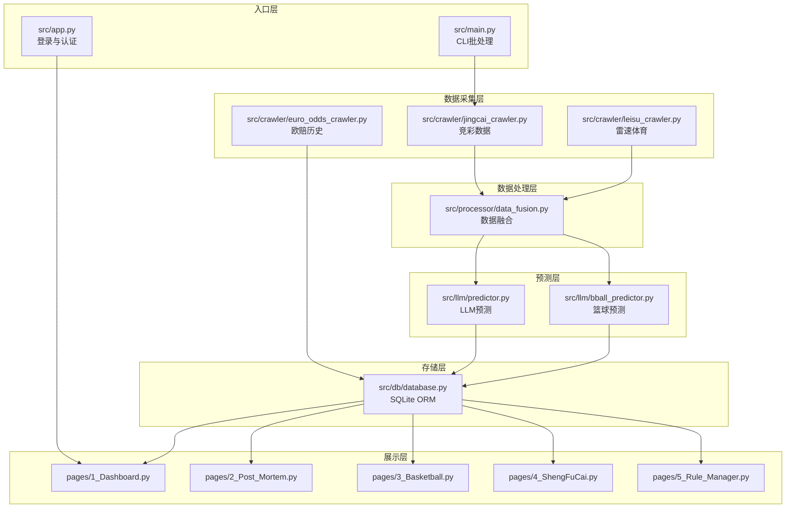
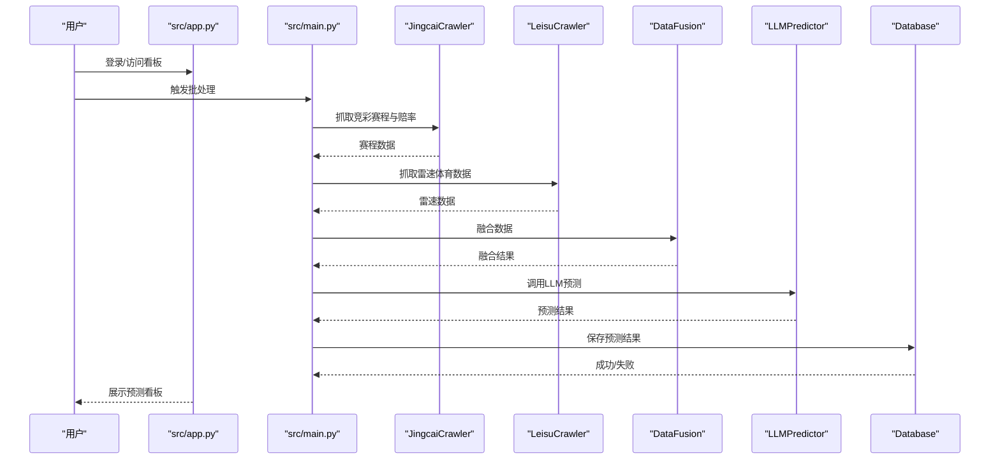
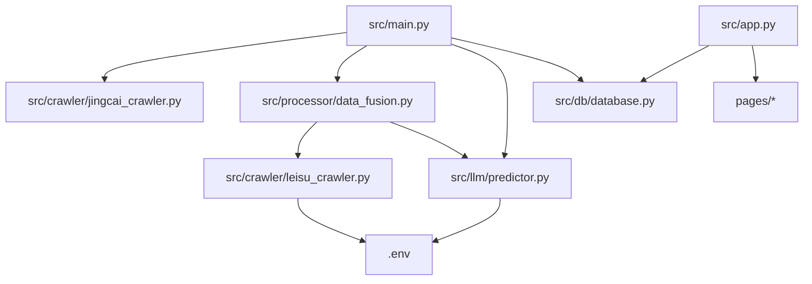

# API参考文档

<cite>
**本文档引用的文件**
- [database.py](file://src/db/database.py)
- [jingcai_crawler.py](file://src/crawler/jingcai_crawler.py)
- [leisu_crawler.py](file://src/crawler/leisu_crawler.py)
- [euro_odds_crawler.py](file://src/crawler/euro_odds_crawler.py)
- [predictor.py](file://src/llm/predictor.py)
- [bball_predictor.py](file://src/llm/bball_predictor.py)
- [data_fusion.py](file://src/processor/data_fusion.py)
- [main.py](file://src/main.py)
- [app.py](file://src/app.py)
- [constants.py](file://src/constants.py)
- [.env](file://config/.env)
- [SYSTEM.md](file://docs/SYSTEM.md)
- [README.md](file://README.md)
- [manage_users.py](file://src/manage_users.py)
</cite>

## 目录
1. [简介](#简介)
2. [项目结构](#项目结构)
3. [核心组件](#核心组件)
4. [架构总览](#架构总览)
5. [详细组件分析](#详细组件分析)
6. [依赖关系分析](#依赖关系分析)
7. [性能考虑](#性能考虑)
8. [故障排除指南](#故障排除指南)
9. [结论](#结论)
10. [附录](#附录)

## 简介
本API参考文档面向API使用者，提供数据库API、爬虫API、预测API、管理API的完整接口规范与集成指南。文档涵盖接口定义、参数说明、返回值格式、错误码、权限控制、安全验证、访问限制、版本管理与迁移策略，帮助开发者快速集成与稳定运行。

## 项目结构
系统采用分层架构：入口层（Streamlit/CLI）、数据采集层（爬虫）、数据处理层（融合）、预测层（LLM）、存储层（SQLite）、展示层（Streamlit页面）。核心模块包括数据库ORM、多源爬虫、数据融合、LLM预测器、用户管理与认证。

图表来源
- [SYSTEM.md](file://docs/SYSTEM.md)
- [README.md](file://README.md)

章节来源
- [SYSTEM.md](file://docs/SYSTEM.md)
- [README.md](file://README.md)

## 核心组件
- 数据库API：提供用户、预测、复盘、串关方案、欧赔历史等表的CRUD与查询接口。
- 爬虫API：提供竞彩赛程、赔率、雷速体育数据、欧赔历史等数据抓取接口。
- 预测API：提供LLM预测调用接口，支持足球、篮球、进球数、半全场等预测。
- 管理API：提供用户管理、权限控制、安全验证与访问限制。

章节来源
- [database.py](file://src/db/database.py)
- [jingcai_crawler.py](file://src/crawler/jingcai_crawler.py)
- [leisu_crawler.py](file://src/crawler/leisu_crawler.py)
- [euro_odds_crawler.py](file://src/crawler/euro_odds_crawler.py)
- [predictor.py](file://src/llm/predictor.py)
- [bball_predictor.py](file://src/llm/bball_predictor.py)
- [data_fusion.py](file://src/processor/data_fusion.py)
- [app.py](file://src/app.py)
- [manage_users.py](file://src/manage_users.py)

## 架构总览
系统通过CLI批处理或Web登录入口触发数据采集、融合、预测与落库流程。预测结果与复盘数据存储于SQLite数据库，Streamlit页面提供可视化看板与规则管理。

图表来源
- [main.py](file://src/main.py)
- [jingcai_crawler.py](file://src/crawler/jingcai_crawler.py)
- [leisu_crawler.py](file://src/crawler/leisu_crawler.py)
- [data_fusion.py](file://src/processor/data_fusion.py)
- [predictor.py](file://src/llm/predictor.py)
- [database.py](file://src/db/database.py)

## 详细组件分析

### 数据库API
数据库层基于SQLAlchemy + SQLite，提供用户、预测、复盘、串关方案、欧赔历史等表的ORM模型与DAO方法。

- 用户表（users）
  - 字段：id、username（唯一索引）、password_hash、role（admin/editor/vip）、valid_until、created_at
  - 接口：get_user(username)
- 足球预测表（match_predictions）
  - 字段：id、fixture_id（索引）、match_num、league、home_team、away_team、match_time、prediction_period（pre_24h/pre_12h/final/repredicted）、raw_data（JSON）、prediction_text、htft_prediction_text、predicted_result、confidence、actual_result、actual_score、actual_bqc、is_correct、created_at、updated_at
  - 接口：save_prediction(match_data, period)、get_prediction(match_num)、get_prediction_by_period(fixture_id, period)、get_all_predictions_by_fixture(fixture_id)、update_actual_result(fixture_id, score, bqc_result)
- 篮球预测表（basketball_predictions）
  - 字段：id、fixture_id（索引）、match_num、league、home_team、away_team、match_time、raw_data、prediction_text、actual_score、created_at、updated_at
  - 接口：save_bball_prediction(match_data)、get_bball_prediction_by_fixture(fixture_id)
- 胜负彩预测表（sfc_predictions）
  - 字段：id、issue_num（索引）、fixture_id、match_num、league、home_team、away_team、match_time、raw_data、prediction_text、created_at、updated_at
  - 接口：save_sfc_prediction(match_data)、get_sfc_prediction(issue_num, match_num)
- 每日串关方案表（daily_parlays）
  - 字段：id、target_date（索引）、current_parlay、previous_parlay、comparison_text、created_at、updated_at
  - 接口：save_parlays(target_date, current_parlay, previous_parlay, comparison_text)、get_parlays_by_date(target_date)
- 每日复盘表（daily_reviews）
  - 字段：id、target_date（唯一索引）、review_content、htft_review_content、created_at、updated_at
  - 接口：save_daily_review(target_date, review_content, htft_review_content)、get_daily_review(target_date)
- 欧赔历史表（euro_odds_history）
  - 字段：id、fixture_id（索引）、match_num、league、home_team、away_team、match_time、company、init_home、init_draw、init_away、live_home、live_draw、live_away、actual_score、actual_result、data_source、created_at
  - 接口：save_euro_odds(match_info, company_odds)
- 查询接口：get_predictions_by_date(target_date)（日周期窗口：目标日12:00~次日12:00）

返回值格式
- 成功：True/记录对象/列表
- 失败：False/None/空列表

错误处理
- 数据库异常捕获与回滚，打印错误信息并返回False/None

章节来源
- [database.py](file://src/db/database.py)

### 爬虫API
爬虫层提供多源数据抓取能力，包括竞彩赛程与赔率、雷速体育数据、欧赔历史等。

- 竞彩爬虫（JingcaiCrawler）
  - 方法：fetch_today_matches(target_date)、fetch_match_results(target_date)、fetch_history_matches(target_date)
  - 返回：list of dict，包含fixture_id、match_num、league、home_team、away_team、match_time、odds（nspf/spf/rangqiu/bqc）
- 雷速爬虫（LeisuCrawler）
  - 方法：fetch_match_data(home_team, away_team, match_time)、ensure_login()、close()
  - 返回：dict，包含伤停、进球分布、半全场、积分、历史交锋、近期战绩、情报等
  - 特性：Playwright自动化、Cookie持久化、匿名/登录模式、线程池隔离
- 欧赔爬虫（EuroOddsCrawler）
  - 方法：fetch_euro_odds(fixture_id, retries, delay, max_companies)
  - 返回：list of dict，包含company、init_home/init_draw/init_away、live_home/live_draw/live_away
  - 特性：AJAX接口、速率限制处理、重试机制

数据格式
- 竞彩：odds包含nspf/spf/rangqiu/bqc
- 雷速：结构化情报与统计数据
- 欧赔：公司列表与初赔/临赔

章节来源
- [jingcai_crawler.py](file://src/crawler/jingcai_crawler.py)
- [leisu_crawler.py](file://src/crawler/leisu_crawler.py)
- [euro_odds_crawler.py](file://src/crawler/euro_odds_crawler.py)

### 预测API
预测层通过LLM进行深度分析与推理，提供多类型预测能力。

- 足球预测（LLMPredictor）
  - 环境变量：LLM_API_KEY、LLM_API_BASE、LLM_MODEL
  - 方法：predict(match_data, total_matches_count) -> (prediction_result, period)
  - 输出：预测报告文本，包含竞彩推荐、置信度、分析逻辑
- 篮球预测（BBallPredictor）
  - 环境变量：LLM_API_KEY、LLM_API_BASE、LLM_MODEL
  - 方法：predict(match_data, total_matches_count) -> prediction_text
  - 输出：竞彩让分/大小分推荐与置信度
- 数据融合（DataFusion）
  - 方法：merge_data(jingcai_matches, odds_crawler, leisu_crawler=None)
  - 输出：融合后的比赛数据（包含亚盘、欧赔、近期战绩、交锋、进阶统计、雷速数据）

集成方法
- CLI批处理：调用src/main.py，自动完成数据采集、融合、预测、落库
- Web看板：通过Streamlit页面访问预测结果与复盘报告

章节来源
- [predictor.py](file://src/llm/predictor.py)
- [bball_predictor.py](file://src/llm/bball_predictor.py)
- [data_fusion.py](file://src/processor/data_fusion.py)
- [main.py](file://src/main.py)

### 管理API
管理层提供用户管理、权限控制、安全验证与访问限制。

- 用户管理（manage_users.py）
  - 方法：create_or_update_user(username, password, role, days_valid)
  - 功能：创建/更新用户，设置角色与有效期
- 认证与权限（app.py + constants.py）
  - 方法：encode_auth_token(username)、decode_auth_token(token)、check_login(username, password)
  - 机制：URL参数携带base64编码的username|timestamp，TTL由AUTH_TOKEN_TTL控制（28800秒）
  - 权限：admin/editor/vip三级角色，valid_until到期后拒绝登录
- 安全验证
  - 密码：SHA256哈希存储
  - Token：base64编码，带时间戳，过期自动失效
  - 访问限制：登录态校验，URL参数恢复登录状态

章节来源
- [manage_users.py](file://src/manage_users.py)
- [app.py](file://src/app.py)
- [constants.py](file://src/constants.py)

## 依赖关系分析

图表来源
- [main.py](file://src/main.py)
- [app.py](file://src/app.py)
- [.env](file://config/.env)

章节来源
- [main.py](file://src/main.py)
- [app.py](file://src/app.py)
- [.env](file://config/.env)

## 性能考虑
- 爬虫速率控制：欧赔爬虫内置重试与递增等待，避免被限流。
- 数据缓存：CLI批处理将融合数据缓存至JSON文件，支持中断续跑。
- 并发与隔离：雷速爬虫使用线程池与专用工作线程，规避事件循环冲突。
- 数据库优化：SQLite自动创建表与列补全，查询按索引字段（fixture_id、target_date）进行。
- LLM调用：按需调用，避免重复请求；支持OpenAI兼容网关与多模型切换。

## 故障排除指南
- LLM API配置错误
  - 现象：未找到LLM_API_KEY，抛出异常
  - 处理：检查config/.env中LLM_API_KEY、LLM_API_BASE、LLM_MODEL配置
- 数据库连接失败
  - 现象：数据库初始化失败或保存失败
  - 处理：确认DATABASE_URL指向正确路径，确保data/football.db可写
- 爬虫被限流
  - 现象：欧赔爬虫返回空数据或重试
  - 处理：增加重试次数与等待间隔，降低并发
- 雷速爬虫异常
  - 现象：Playwright初始化失败或验证码弹窗
  - 处理：确保已安装chromium，必要时手动完成验证码；启用匿名模式
- 认证失败
  - 现象：登录失败或Token过期
  - 处理：检查用户名/密码，确认valid_until未过期；重新生成Token

章节来源
- [predictor.py](file://src/llm/predictor.py)
- [database.py](file://src/db/database.py)
- [euro_odds_crawler.py](file://src/crawler/euro_odds_crawler.py)
- [leisu_crawler.py](file://src/crawler/leisu_crawler.py)
- [app.py](file://src/app.py)

## 结论
本API参考文档提供了数据库、爬虫、预测与管理API的完整接口规范与集成指南。通过明确的参数定义、返回值格式、错误码说明、权限控制与安全验证策略，开发者可以快速集成并稳定运行系统。建议在生产环境中遵循速率限制、数据缓存与并发隔离的最佳实践，确保系统的高性能与可靠性。

## 附录

### API版本管理与迁移
- 版本策略：当前代码为单一版本实现，数据库迁移通过Supabase迁移文件管理。
- 向后兼容：Database类自动补全列，保持历史数据兼容。
- 迁移指南：使用supabase db push应用迁移脚本，确保表结构一致性。

章节来源
- [database.py](file://src/db/database.py)
- [SYSTEM.md](file://docs/SYSTEM.md)