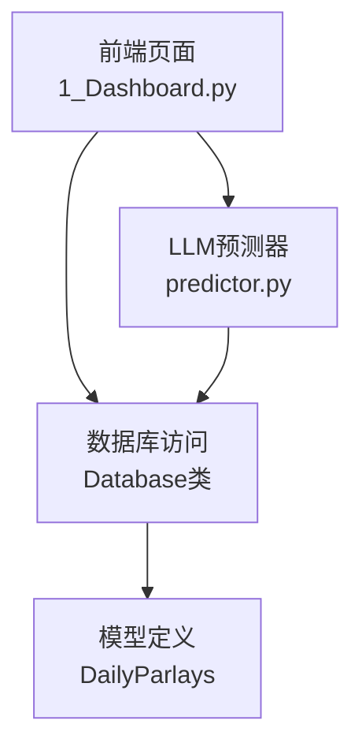
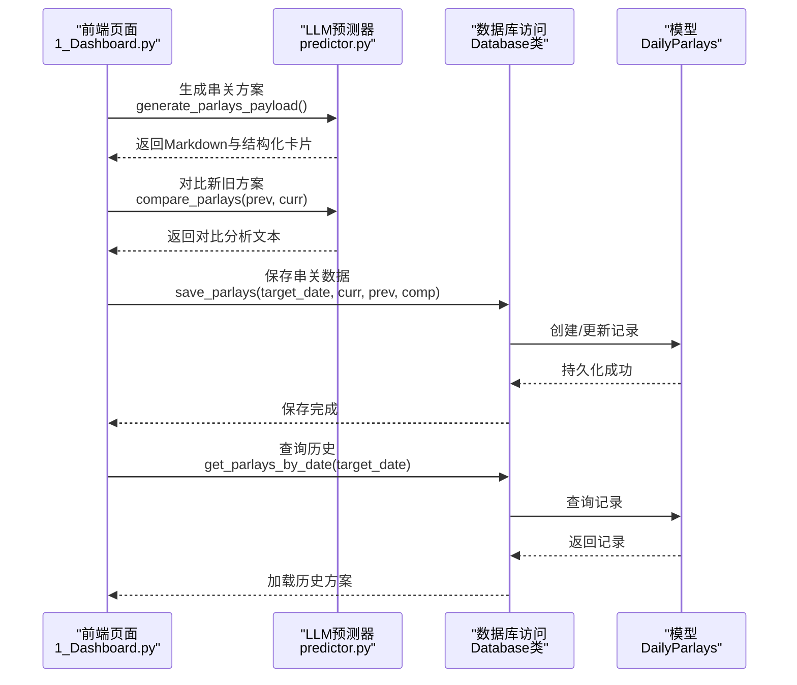
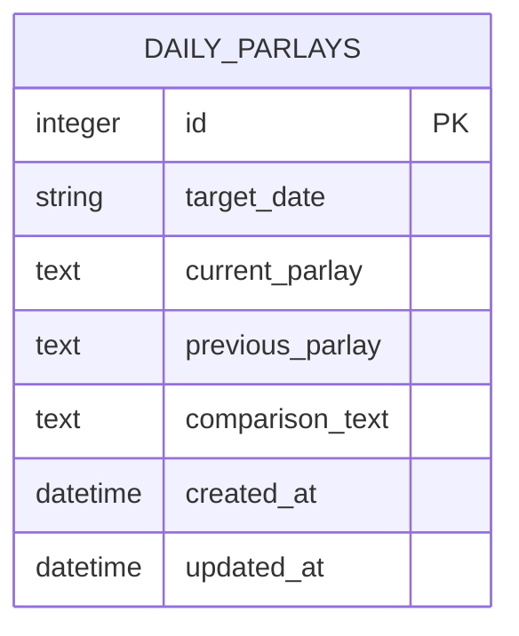
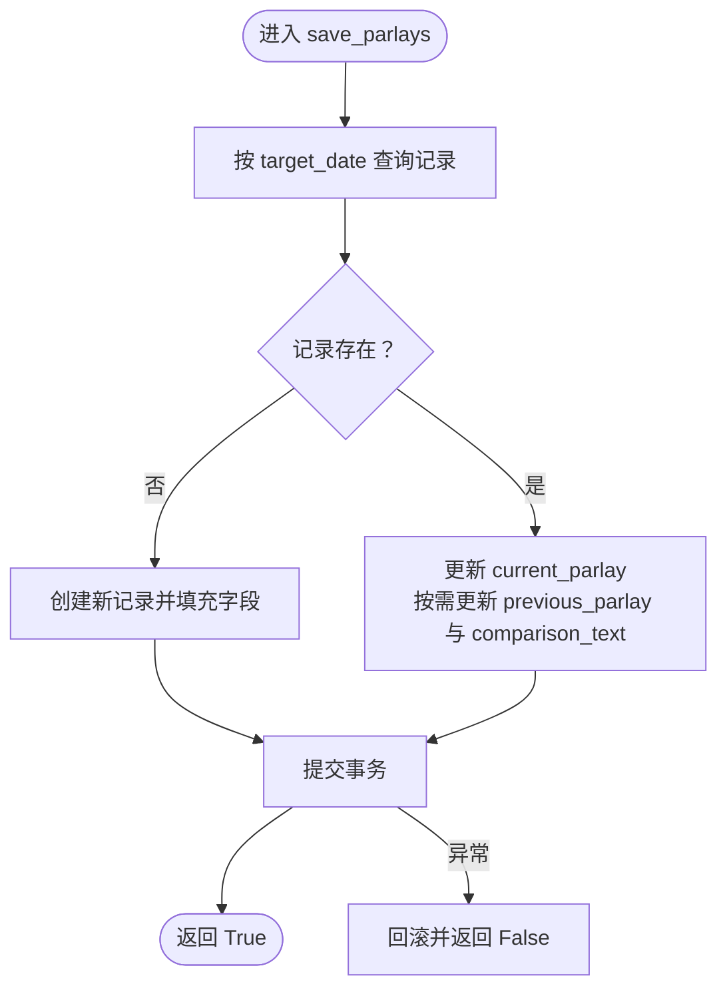
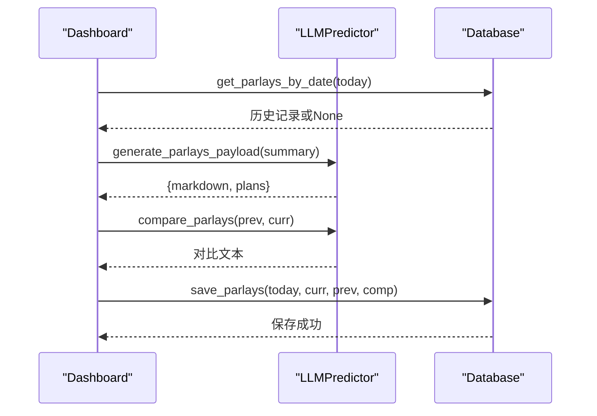
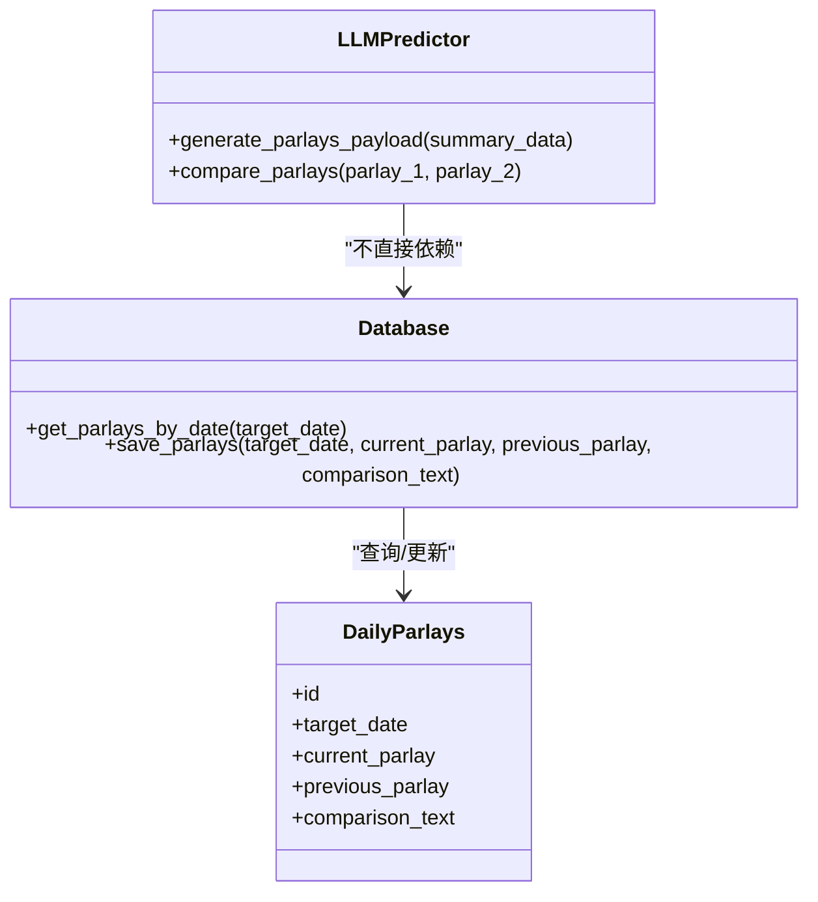

# 串关数据API

<cite>
**本文引用的文件**
- [database.py](file://src/db/database.py)
- [predictor.py](file://src/llm/predictor.py)
- [1_Dashboard.py](file://src/pages/1_Dashboard.py)
- [daily_parlay_template.md](file://docs/wechat/daily_parlay_template.md)
- [2026-05-09-football-parlay-refactor-plan.md](file://docs/plans/2026-05-09-football-parlay-refactor-plan.md)
- [test_predictor_rules.py](file://tests/test_predictor_rules.py)
</cite>

## 目录
1. [简介](#简介)
2. [项目结构](#项目结构)
3. [核心组件](#核心组件)
4. [架构总览](#架构总览)
5. [详细组件分析](#详细组件分析)
6. [依赖关系分析](#依赖关系分析)
7. [性能考量](#性能考量)
8. [故障排查指南](#故障排查指南)
9. [结论](#结论)
10. [附录](#附录)

## 简介
本文档聚焦于“串关数据API”，围绕 DailyParlays 相关的数据库操作方法，系统阐述以下内容：
- 保存与查询串关方案的核心接口：save_parlays、get_parlays_by_date
- 串关方案的数据结构、目标日期（target_date）格式要求与方案内容的存储方式
- 历史对比功能（current_parlay vs previous_parlay）与AI分析结果（comparison_text）的作用机制
- 串关数据管理与查询的最佳实践
- 具体的代码示例路径与日期处理技巧

## 项目结构
与串关数据API直接相关的模块与文件如下：
- 数据库层：DailyParlays 模型与 Database 类（含 save_parlays、get_parlays_by_date）
- 业务层：LLM Predictor（生成串关方案、对比方案）
- 前端页面：Dashboard（触发生成、对比、持久化）

图表来源
- [1_Dashboard.py:1103-1181](file://src/pages/1_Dashboard.py#L1103-L1181)
- [predictor.py:5824-5868](file://src/llm/predictor.py#L5824-L5868)
- [database.py:421-449](file://src/db/database.py#L421-L449)
- [database.py:148-164](file://src/db/database.py#L148-L164)

章节来源
- [database.py:148-164](file://src/db/database.py#L148-L164)
- [database.py:421-449](file://src/db/database.py#L421-L449)
- [predictor.py:5824-5868](file://src/llm/predictor.py#L5824-L5868)
- [1_Dashboard.py:1103-1181](file://src/pages/1_Dashboard.py#L1103-L1181)

## 核心组件
- DailyParlays 模型：用于存储每日生成的串关方案，字段包括 target_date、current_parlay、previous_parlay、comparison_text。
- Database 类：提供 get_parlays_by_date 与 save_parlays 方法，封装数据库会话与事务。
- LLMPredictor：负责生成串关方案（generate_parlays_payload）、渲染结构化卡片（_build_parlay_payload）、对比两次方案（compare_parlays）。
- Dashboard 页面：触发生成、对比、持久化，按日期加载历史记录。

章节来源
- [database.py:148-164](file://src/db/database.py#L148-L164)
- [database.py:421-449](file://src/db/database.py#L421-L449)
- [predictor.py:5806-5828](file://src/llm/predictor.py#L5806-L5828)
- [predictor.py:5830-5868](file://src/llm/predictor.py#L5830-L5868)
- [1_Dashboard.py:1103-1181](file://src/pages/1_Dashboard.py#L1103-L1181)

## 架构总览
串关数据API的调用链路如下：

图表来源
- [1_Dashboard.py:1103-1181](file://src/pages/1_Dashboard.py#L1103-L1181)
- [predictor.py:5806-5868](file://src/llm/predictor.py#L5806-L5868)
- [database.py:421-449](file://src/db/database.py#L421-L449)

## 详细组件分析

### 数据模型：DailyParlays
- 字段说明
  - id：自增主键
  - target_date：字符串，格式YYYY-MM-DD，索引字段，唯一性约束在 DailyReview 中体现，此处为索引
  - current_parlay：Text，最新生成的串关方案内容（Markdown）
  - previous_parlay：Text，上一次生成的串关方案内容（可空）
  - comparison_text：Text，AI对两次方案的对比分析结果（可空）
  - created_at / updated_at：时间戳

图表来源
- [database.py:148-164](file://src/db/database.py#L148-L164)

章节来源
- [database.py:148-164](file://src/db/database.py#L148-L164)

### 接口：get_parlays_by_date
- 功能：按目标日期查询串关记录
- 参数：target_date（字符串，YYYY-MM-DD）
- 返回：DailyParlays 实例或 None
- 复杂度：基于索引的单表查询，近似 O(log N) 查找

章节来源
- [database.py:421-424](file://src/db/database.py#L421-L424)

### 接口：save_parlays
- 功能：保存或更新某日的串关方案
- 参数：
  - target_date：字符串，YYYY-MM-DD
  - current_parlay：最新方案（Markdown）
  - previous_parlay：历史方案（可空）
  - comparison_text：对比分析（可空）
- 行为：
  - 若不存在对应日期记录则新建
  - 若存在则更新 current_parlay，并按需更新 previous_parlay 与 comparison_text
- 异常处理：捕获异常并回滚，返回布尔值表示是否成功

图表来源
- [database.py:426-449](file://src/db/database.py#L426-L449)

章节来源
- [database.py:426-449](file://src/db/database.py#L426-L449)

### 前端集成：Dashboard 页面
- 首次加载：若 session state 为空，按当前日期调用 get_parlays_by_date 加载历史
- 生成新方案：调用 predictor.generate_parlays_payload 获取 Markdown 与结构化卡片
- 对比分析：若存在历史方案且与新方案不同，调用 compare_parlays 生成对比文本
- 持久化：调用 save_parlays 保存 current_parlay、previous_parlay、comparison_text
- 展示：根据是否有历史与对比文本，分别展示最新、对比、历史三个标签页

图表来源
- [1_Dashboard.py:1103-1181](file://src/pages/1_Dashboard.py#L1103-L1181)
- [predictor.py:5806-5868](file://src/llm/predictor.py#L5806-L5868)
- [database.py:421-449](file://src/db/database.py#L421-L449)

章节来源
- [1_Dashboard.py:1103-1181](file://src/pages/1_Dashboard.py#L1103-L1181)

### 串关方案的数据结构与存储
- 方案内容（current_parlay/previous_parlay）：存储为 Markdown 文本，包含三套固定模板的方案、赔率推演、注数计算、风险提示等
- 结构化卡片（payload["plans"]）：包含每套方案的 plan_code、plan_name、target_status、role_desc、logic_summary、payout、matches、alternative 等字段
- 存储方式：以 Text 字段保存 Markdown 文本，便于直接渲染与对比；结构化卡片用于前端表格化展示

章节来源
- [predictor.py:5768-5804](file://src/llm/predictor.py#L5768-L5804)
- [predictor.py:5806-5828](file://src/llm/predictor.py#L5806-L5828)

### 历史对比与AI分析
- 对比触发条件：新旧方案内容不完全一致时才进行对比
- 对比内容：由 compare_parlays 生成，包含选场差异、风险与回报评估、最终建议等
- 存储位置：comparison_text 字段，便于后续展示与审计

章节来源
- [1_Dashboard.py:1138-1146](file://src/pages/1_Dashboard.py#L1138-L1146)
- [predictor.py:5830-5868](file://src/llm/predictor.py#L5830-L5868)

### 目标日期（target_date）格式要求
- 格式：YYYY-MM-DD（字符串）
- 用途：作为 DailyParlays 的索引字段，用于按日检索串关历史
- 页面使用：Dashboard 以当前日期字符串传入 get_parlays_by_date/save_parlays

章节来源
- [database.py:153-154](file://src/db/database.py#L153-L154)
- [1_Dashboard.py:1104](file://src/pages/1_Dashboard.py#L1104)

### 日期处理技巧
- 日期解析：Dashboard 使用 datetime.now().strftime("%Y-%m-%d") 生成目标日期字符串
- 历史窗口：其他模块（如预测）使用基于 12:00 的日周期窗口，但串关模块使用纯日期索引
- 建议：统一使用 ISO 8601 的 YYYY-MM-DD 字符串，避免时区与解析歧义

章节来源
- [1_Dashboard.py:1104](file://src/pages/1_Dashboard.py#L1104)

## 依赖关系分析
- Database 依赖 SQLAlchemy ORM 定义的 Base 与 DailyParlays 模型
- Dashboard 依赖 Database 与 LLMPredictor
- LLMPredictor 依赖 OpenAI API（通过 client/chat.completions 接口）生成对比分析

图表来源
- [database.py:421-449](file://src/db/database.py#L421-L449)
- [database.py:148-164](file://src/db/database.py#L148-L164)
- [predictor.py:5806-5868](file://src/llm/predictor.py#L5806-L5868)

章节来源
- [database.py:421-449](file://src/db/database.py#L421-L449)
- [database.py:148-164](file://src/db/database.py#L148-L164)
- [predictor.py:5806-5868](file://src/llm/predictor.py#L5806-L5868)

## 性能考量
- 查询性能：target_date 为索引字段，get_parlays_by_date 为单条记录查询，复杂度近似 O(log N)
- 写入性能：save_parlays 为单记录更新/插入，事务提交后返回布尔值，异常时回滚
- 建议：
  - 串关数据量不大，无需额外索引
  - 对比分析由外部 LLM 执行，建议在 UI 层使用 spinner 提示，避免阻塞主线程
  - 前端渲染结构化卡片时，优先使用 payload["plans"]，Markdown 仅作为回退展示

[本节为通用性能讨论，不直接分析具体文件]

## 故障排查指南
- 保存失败
  - 现象：save_parlays 返回 False 或控制台打印异常
  - 排查：检查数据库连接、事务提交、字段长度限制
  - 参考：[database.py:446-449](file://src/db/database.py#L446-L449)
- 对比失败
  - 现象：compare_parlays 返回错误信息或异常
  - 排查：检查 OpenAI API 配置、网络连通性、温度与最大令牌设置
  - 参考：[predictor.py:5854-5867](file://src/llm/predictor.py#L5854-L5867)
- 历史加载为空
  - 现象：get_parlays_by_date 返回 None
  - 排查：确认 target_date 格式正确、数据库中是否存在该日期记录
  - 参考：[database.py:422-424](file://src/db/database.py#L422-L424)

章节来源
- [database.py:446-449](file://src/db/database.py#L446-L449)
- [predictor.py:5854-5867](file://src/llm/predictor.py#L5854-L5867)
- [database.py:422-424](file://src/db/database.py#L422-L424)

## 结论
- DailyParlays 提供了简洁而高效的串关方案存储能力，以 target_date 为索引，支持按日查询与更新
- 通过 compare_parlays 与结构化卡片，实现了方案对比与可视化展示
- 建议在生产环境中：
  - 统一日期格式（YYYY-MM-DD）
  - 对比分析与数据库操作分离，避免阻塞
  - 前端优先使用结构化卡片，Markdown 作为回退

[本节为总结性内容，不直接分析具体文件]

## 附录

### 最佳实践清单
- 日期格式：始终使用 YYYY-MM-DD 字符串
- 对比触发：仅在新旧方案内容不完全一致时执行 compare_parlays
- 存储策略：current_parlay/previous_parlay/comparison_text 三者配合，便于历史追溯与对比
- 错误处理：save_parlays 与 compare_parlays 均有异常捕获与回滚，确保数据一致性

章节来源
- [1_Dashboard.py:1138-1146](file://src/pages/1_Dashboard.py#L1138-L1146)
- [database.py:426-449](file://src/db/database.py#L426-L449)
- [predictor.py:5830-5868](file://src/llm/predictor.py#L5830-L5868)

### 相关文档与测试
- 串关模板与展示规范：[daily_parlay_template.md](file://docs/wechat/daily_parlay_template.md)
- 串关重构计划与三套模板设计：[2026-05-09-football-parlay-refactor-plan.md](file://docs/plans/2026-05-09-football-parlay-refactor-plan.md)
- 串关生成与对比的单元测试：[test_predictor_rules.py](file://tests/test_predictor_rules.py)

章节来源
- [daily_parlay_template.md:1-22](file://docs/wechat/daily_parlay_template.md#L1-L22)
- [2026-05-09-football-parlay-refactor-plan.md:1-249](file://docs/plans/2026-05-09-football-parlay-refactor-plan.md#L1-L249)
- [test_predictor_rules.py:1085-1122](file://tests/test_predictor_rules.py#L1085-L1122)