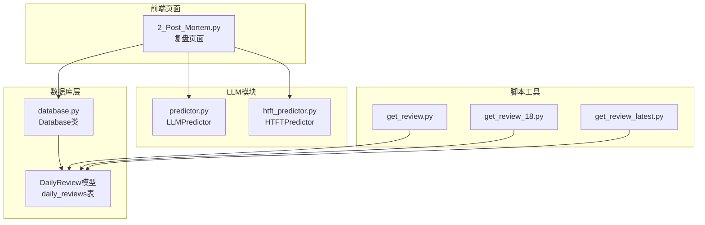
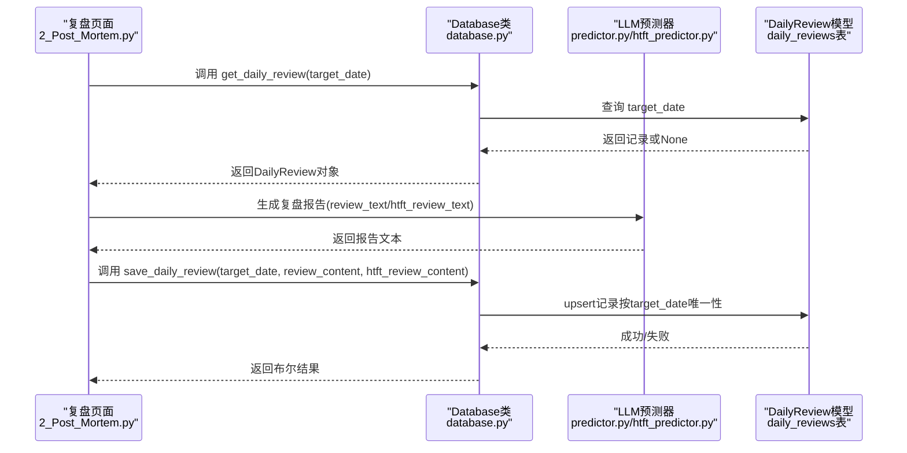
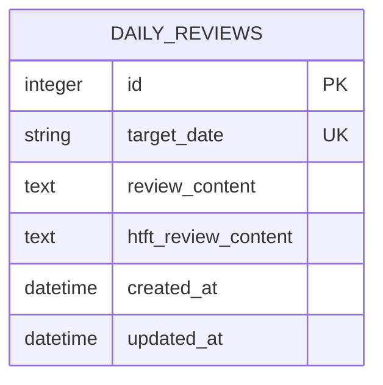
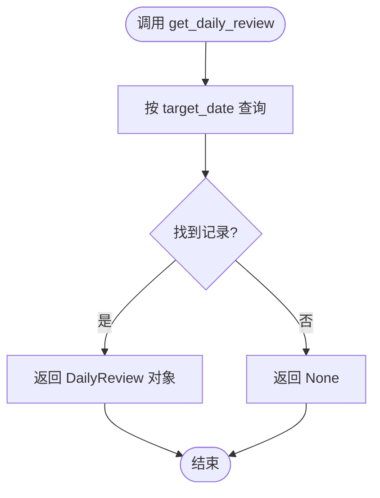
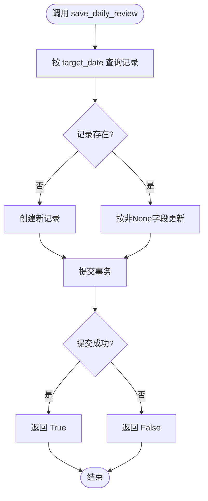
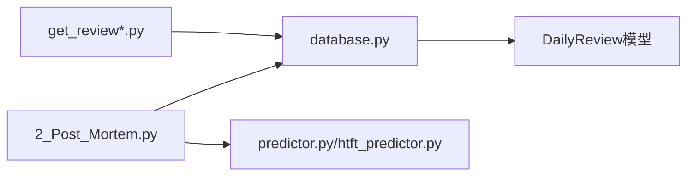

# 复盘数据API

<cite>
**本文档引用的文件**
- [database.py](file://src/db/database.py)
- [2_Post_Mortem.py](file://src/pages/2_Post_Mortem.py)
- [SYSTEM.md](file://docs/SYSTEM.md)
- [get_review.py](file://scripts/get_review.py)
- [get_review_18.py](file://scripts/get_review_18.py)
- [get_review_latest.py](file://scripts/get_review_latest.py)
- [htft_predictor.py](file://src/llm/htft_predictor.py)
- [test_post_mortem_report.py](file://tests/test_post_mortem_report.py)
</cite>

## 目录
1. [简介](#简介)
2. [项目结构](#项目结构)
3. [核心组件](#核心组件)
4. [架构概览](#架构概览)
5. [详细组件分析](#详细组件分析)
6. [依赖分析](#依赖分析)
7. [性能考虑](#性能考虑)
8. [故障排查指南](#故障排查指南)
9. [结论](#结论)
10. [附录](#附录)

## 简介
本文件面向复盘数据API的使用者与维护者，系统性阐述DailyReview相关数据库操作方法，包括save_daily_review、get_daily_review等核心接口。文档详细说明复盘数据的存储结构、目标日期（target_date）的唯一性要求、复盘内容的存储格式，解释普通复盘（review_content）与半全场专项复盘（htft_review_content）的区别，并提供复盘数据管理和查询的最佳实践，包含具体的代码示例路径和日期格式处理技巧。

## 项目结构
复盘数据API位于数据库层，通过SQLAlchemy ORM模型DailyReview进行持久化，前端页面通过Streamlit调用数据库接口生成与展示复盘报告，同时提供脚本工具用于查询与验证。

**图表来源**
- [database.py:165-175](file://src/db/database.py#L165-L175)
- [database.py:498-562](file://src/db/database.py#L498-L562)
- [2_Post_Mortem.py:554-781](file://src/pages/2_Post_Mortem.py#L554-L781)
- [htft_predictor.py:79-143](file://src/llm/htft_predictor.py#L79-L143)

**章节来源**
- [SYSTEM.md:144-156](file://docs/SYSTEM.md#L144-L156)

## 核心组件
- DailyReview模型：定义复盘数据的表结构，包含target_date（唯一索引）、review_content、htft_review_content等字段。
- Database类：提供数据库连接、会话管理、以及复盘数据的增删改查接口。
- 复盘页面：通过调用Database.save_daily_review与Database.get_daily_review实现复盘报告的生成、保存与展示。
- LLM预测器：LLMPredictor负责生成普通复盘报告，HTFTPredictor负责生成半全场专项复盘报告。
- 查询脚本：提供基于SQLite的查询示例，便于离线验证与调试。

**章节来源**
- [database.py:165-175](file://src/db/database.py#L165-L175)
- [database.py:498-562](file://src/db/database.py#L498-L562)
- [2_Post_Mortem.py:554-781](file://src/pages/2_Post_Mortem.py#L554-L781)
- [htft_predictor.py:79-143](file://src/llm/htft_predictor.py#L79-L143)

## 架构概览
复盘数据API遵循“页面-数据库-LLM”三层协作模式：
- 页面层：2_Post_Mortem.py负责交互与业务流程编排，调用Database接口并触发LLM生成报告。
- 数据库层：Database类封装SQLAlchemy会话，提供save_daily_review与get_daily_review等方法。
- LLM层：LLMPredictor与HTFTPredictor分别生成普通复盘与半全场专项复盘内容。

**图表来源**
- [database.py:498-562](file://src/db/database.py#L498-L562)
- [2_Post_Mortem.py:554-781](file://src/pages/2_Post_Mortem.py#L554-L781)
- [htft_predictor.py:79-143](file://src/llm/htft_predictor.py#L79-L143)

## 详细组件分析

### DailyReview模型与表结构
- 表名：daily_reviews
- 字段：
  - id：自增主键
  - target_date：字符串，唯一索引，格式为YYYY-MM-DD
  - review_content：Text，普通复盘内容
  - htft_review_content：Text，半全场专项复盘内容（可为空）
  - created_at/updated_at：时间戳
- 唯一性约束：target_date唯一，保证同一日期仅有一份复盘记录。

**图表来源**
- [database.py:165-175](file://src/db/database.py#L165-L175)

**章节来源**
- [database.py:165-175](file://src/db/database.py#L165-L175)
- [SYSTEM.md:154-155](file://docs/SYSTEM.md#L154-L155)

### get_daily_review接口
- 功能：按target_date查询复盘记录，若不存在返回None。
- 使用场景：页面首次加载时展示已持久化的复盘报告。
- 返回值：DailyReview对象或None。

**图表来源**
- [database.py:498-500](file://src/db/database.py#L498-L500)

**章节来源**
- [database.py:498-500](file://src/db/database.py#L498-L500)
- [2_Post_Mortem.py:554-567](file://src/pages/2_Post_Mortem.py#L554-L567)

### save_daily_review接口
- 功能：保存或更新某日的复盘记录，支持同时更新普通复盘与半全场复盘。
- 参数：
  - target_date：YYYY-MM-DD字符串
  - review_content：普通复盘文本（可为None表示不更新）
  - htft_review_content：半全场复盘文本（可为None表示不更新）
- 逻辑：若记录不存在则新建，否则按传入的非None字段进行更新。
- 返回值：布尔值，表示保存是否成功。

**图表来源**
- [database.py:541-562](file://src/db/database.py#L541-L562)

**章节来源**
- [database.py:541-562](file://src/db/database.py#L541-L562)
- [2_Post_Mortem.py:712-716](file://src/pages/2_Post_Mortem.py#L712-L716)
- [2_Post_Mortem.py:777-781](file://src/pages/2_Post_Mortem.py#L777-L781)

### 复盘内容存储格式
- 存储介质：SQLite数据库（data/football.db），表为daily_reviews。
- 文本格式：review_content与htft_review_content均为Text类型，通常为Markdown格式，便于前端渲染。
- 前端展示：页面通过st.markdown渲染复盘内容，支持富文本展示。

**章节来源**
- [database.py:165-175](file://src/db/database.py#L165-L175)
- [2_Post_Mortem.py:565-567](file://src/pages/2_Post_Mortem.py#L565-L567)
- [2_Post_Mortem.py:753-755](file://src/pages/2_Post_Mortem.py#L753-L755)

### 普通复盘与半全场专项复盘的区别
- 普通复盘（review_content）：
  - 由LLMPredictor.generate_post_mortem生成，涵盖全场预测命中率、维度分析、规则草稿等内容。
  - 保存时仅更新review_content字段，htft_review_content保持不变。
- 半全场专项复盘（htft_review_content）：
  - 由HTFTPredictor.generate_post_mortem生成，聚焦半全场（平胜/平负/平平）剧本偏差分析。
  - 保存时仅更新htft_review_content字段，review_content保持不变。
- 页面交互：普通复盘在“全场预测深度复盘”标签页，半全场复盘在“半全场专项复盘”标签页。

**章节来源**
- [2_Post_Mortem.py:554-567](file://src/pages/2_Post_Mortem.py#L554-L567)
- [2_Post_Mortem.py:751-781](file://src/pages/2_Post_Mortem.py#L751-L781)
- [htft_predictor.py:79-143](file://src/llm/htft_predictor.py#L79-L143)

### 日期格式与唯一性要求
- 日期格式：YYYY-MM-DD字符串，如"2026-04-18"。
- 唯一性：target_date在daily_reviews表中具有唯一索引，确保同一日期仅有一份复盘记录。
- 查询示例：脚本get_review_18.py演示了按固定日期查询的SQL写法。

**章节来源**
- [database.py:170](file://src/db/database.py#L170)
- [get_review_18.py:4](file://scripts/get_review_18.py#L4)

### 页面工作流与最佳实践
- 生成与保存流程：
  1) 计算准确率并生成复盘报告。
  2) 调用save_daily_review保存普通复盘或半全场复盘。
  3) 页面刷新并展示已持久化的报告。
- 最佳实践：
  - 日期参数统一使用YYYY-MM-DD格式，避免时区与解析歧义。
  - 保存时区分字段更新，仅传入需要更新的字段，避免覆盖已有内容。
  - 对于半全场专项复盘，单独调用HTFTPredictor并仅更新htft_review_content。
  - 在页面中先检查已存在的复盘记录，优先展示持久化内容，提升用户体验。

**章节来源**
- [2_Post_Mortem.py:698-719](file://src/pages/2_Post_Mortem.py#L698-L719)
- [2_Post_Mortem.py:759-781](file://src/pages/2_Post_Mortem.py#L759-L781)

## 依赖分析
- 页面依赖数据库：2_Post_Mortem.py直接调用Database.get_daily_review与Database.save_daily_review。
- 数据库依赖模型：Database类依赖DailyReview模型进行ORM映射。
- LLM依赖：LLMPredictor与HTFTPredictor分别生成不同类型的复盘内容。
- 查询脚本：get_review系列脚本直接访问SQLite数据库，验证数据一致性。

**图表来源**
- [2_Post_Mortem.py:554-781](file://src/pages/2_Post_Mortem.py#L554-L781)
- [database.py:498-562](file://src/db/database.py#L498-L562)
- [get_review.py:4](file://scripts/get_review.py#L4)

**章节来源**
- [2_Post_Mortem.py:554-781](file://src/pages/2_Post_Mortem.py#L554-L781)
- [database.py:498-562](file://src/db/database.py#L498-L562)
- [get_review.py:4](file://scripts/get_review.py#L4)

## 性能考虑
- 查询性能：target_date字段带有唯一索引，查询效率高。
- 更新策略：save_daily_review按需更新字段，避免不必要的全量覆盖。
- 前端渲染：复盘内容为Text类型，前端通过st.markdown渲染，适合长文本展示。
- 批量操作：若需批量生成复盘，建议分批处理并设置合理的事务提交间隔，避免长时间占用数据库连接。

## 故障排查指南
- 保存失败：
  - 检查target_date格式是否为YYYY-MM-DD。
  - 确认数据库连接正常，事务是否正确提交。
  - 查看返回值布尔结果，必要时增加日志输出。
- 查询无结果：
  - 确认target_date是否正确，注意大小写与空格。
  - 使用脚本get_review_latest.py或get_review.py验证数据库中是否存在记录。
- 内容为空：
  - 确认LLM生成流程是否成功返回文本。
  - 检查页面逻辑是否正确处理None值。

**章节来源**
- [database.py:558-562](file://src/db/database.py#L558-L562)
- [get_review_latest.py:4](file://scripts/get_review_latest.py#L4)
- [get_review.py:4](file://scripts/get_review.py#L4)

## 结论
复盘数据API通过DailyReview模型与Database类实现了对复盘内容的可靠持久化，支持普通复盘与半全场专项复盘的独立管理。页面层通过清晰的工作流与最佳实践，确保用户能够高效地生成、保存与查看复盘报告。遵循日期格式规范与唯一性约束，可有效避免重复记录与查询异常，提升系统的稳定性与可维护性。

## 附录

### API定义与使用示例
- get_daily_review(target_date: str) -> DailyReview | None
  - 示例路径：[database.py:498-500](file://src/db/database.py#L498-L500)
- save_daily_review(target_date: str, review_content: str | None, htft_review_content: str | None = None) -> bool
  - 示例路径：[database.py:541-562](file://src/db/database.py#L541-L562)
- 查询脚本示例：
  - 获取最新复盘：[get_review_latest.py:4](file://scripts/get_review_latest.py#L4)
  - 按日期查询复盘：[get_review_18.py:4](file://scripts/get_review_18.py#L4)
  - 通用查询复盘：[get_review.py:4](file://scripts/get_review.py#L4)

### 日期格式处理技巧
- 统一使用YYYY-MM-DD格式，避免跨时区与解析歧义。
- 页面中建议将用户输入的日期转换为标准格式后再调用API。
- LLM生成复盘时，确保日期字符串与数据库一致，便于后续查询与展示。