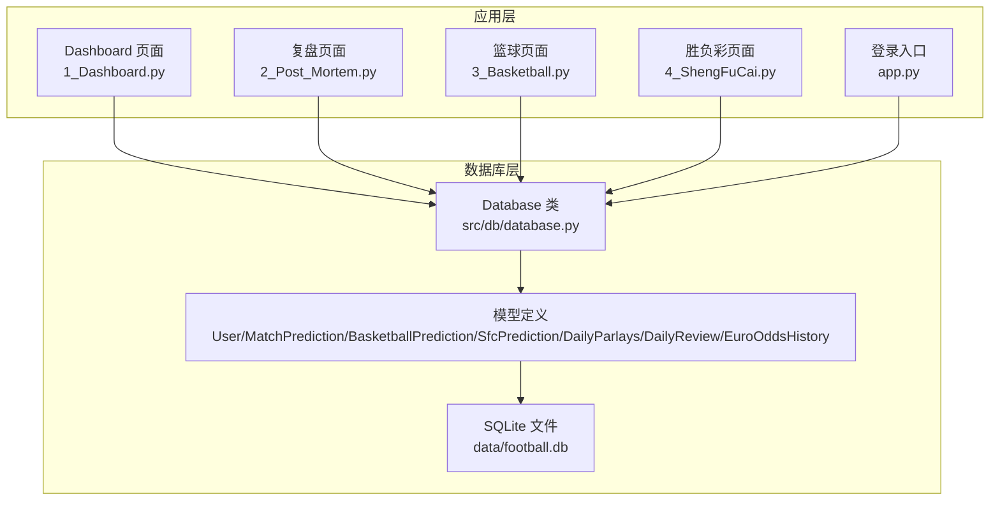
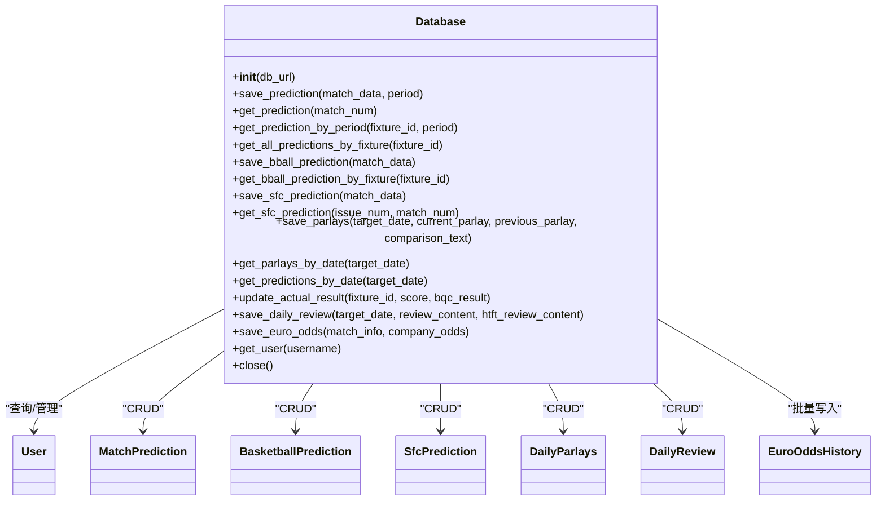
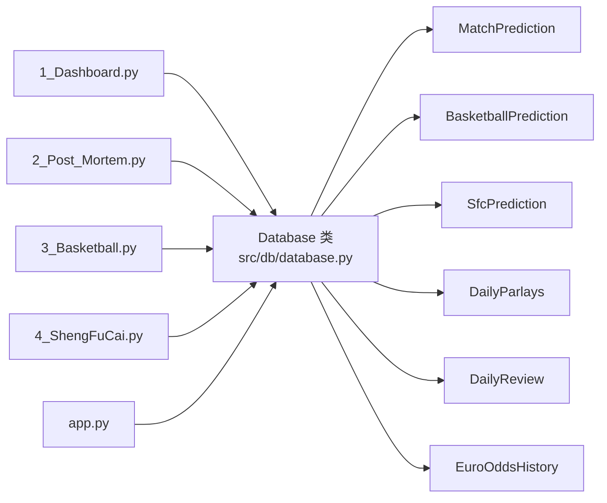

# 数据库API

<cite>
**本文引用的文件列表**
- [database.py](file://src/db/database.py)
- [20240326_add_prediction_period.sql](file://supabase/migrations/20240326_add_prediction_period.sql)
- [test_db.py](file://scripts/test_db.py)
- [check_db_constraints.py](file://scripts/check_db_constraints.py)
- [fix_database_constraint.py](file://scripts/fix_database_constraint.py)
- [1_Dashboard.py](file://src/pages/1_Dashboard.py)
- [2_Post_Mortem.py](file://src/pages/2_Post_Mortem.py)
- [3_Basketball.py](file://src/pages/3_Basketball.py)
- [4_ShengFuCai.py](file://src/pages/4_ShengFuCai.py)
- [app.py](file://src/app.py)
</cite>

## 目录
1. [简介](#简介)
2. [项目结构](#项目结构)
3. [核心组件](#核心组件)
4. [架构概览](#架构概览)
5. [详细组件分析](#详细组件分析)
6. [依赖关系分析](#依赖关系分析)
7. [性能考量](#性能考量)
8. [故障排查指南](#故障排查指南)
9. [结论](#结论)
10. [附录](#附录)

## 简介
本文件面向数据库API使用者与维护者，系统性梳理并说明 Database 类的全部公共方法，覆盖预测数据、串关方案、每日复盘、欧赔历史等核心接口；同时解释各数据模型的字段设计与业务含义，并提供最佳实践与性能优化建议。读者可据此快速上手数据库API的使用与扩展。

## 项目结构
数据库API位于 src/db/database.py，采用 SQLAlchemy ORM 定义模型与会话管理，使用 SQLite 作为本地存储，默认数据库文件位于 data/football.db。迁移脚本用于演进 match_predictions 表结构，配套脚本用于检查与修复约束问题。

图表来源
- [database.py:200-566](file://src/db/database.py#L200-L566)
- [1_Dashboard.py:1138-1162](file://src/pages/1_Dashboard.py#L1138-L1162)
- [2_Post_Mortem.py:376-401](file://src/pages/2_Post_Mortem.py#L376-L401)
- [3_Basketball.py:239-241](file://src/pages/3_Basketball.py#L239-L241)
- [4_ShengFuCai.py:58-86](file://src/pages/4_ShengFuCai.py#L58-L86)
- [app.py:94-108](file://src/app.py#L94-L108)

章节来源
- [database.py:200-566](file://src/db/database.py#L200-L566)
- [20240326_add_prediction_period.sql:1-51](file://supabase/migrations/20240326_add_prediction_period.sql#L1-L51)

## 核心组件
- Database 类：封装数据库连接、会话、模型查询与写入、事务回滚、辅助解析函数等。
- 模型集合：
  - User：用户账户与权限
  - MatchPrediction：足球预测（含时间段标识）
  - BasketballPrediction：篮球预测
  - SfcPrediction：胜负彩预测
  - DailyParlays：每日串关方案
  - DailyReview：每日复盘
  - EuroOddsHistory：欧赔历史

章节来源
- [database.py:58-198](file://src/db/database.py#L58-L198)

## 架构概览
Database 类通过 SQLAlchemy 创建引擎与会话，自动创建所有模型对应的表；提供统一的 CRUD 接口，支持多时间段预测、串关方案、复盘与欧赔历史的批量写入。

图表来源
- [database.py:200-566](file://src/db/database.py#L200-L566)

## 详细组件分析

### Database 类公共方法详解

- 初始化与连接
  - 方法：__init__(db_url=None)
  - 作用：构建 SQLite 引擎，确保 data/football.db 目录存在，创建所有表，执行列兼容性检查，建立会话。
  - 关键点：动态定位数据库路径，首次运行自动建表；内部调用 _ensure_match_predictions_columns 保证既有表具备必要列。
  - 异常：初始化失败抛出异常；建议在调用方捕获并记录日志。
  - 使用示例：参见页面入口与各页面对 Database 的实例化与关闭调用。

  章节来源
  - [database.py:200-217](file://src/db/database.py#L200-L217)
  - [app.py:94-108](file://src/app.py#L94-L108)
  - [1_Dashboard.py:1138-1139](file://src/pages/1_Dashboard.py#L1138-L1139)

- 保存/更新预测（支持时间段）
  - 方法：save_prediction(match_data, period='pre_24h')
  - 参数：
    - match_data：字典，包含 fixture_id、match_num、league、home_team、away_team、match_time、llm_prediction、htft_prediction 等字段
    - period：字符串，时间段标识，如 'pre_24h'、'pre_12h'、'final'
  - 返回：布尔值，成功为 True，失败为 False
  - 逻辑要点：
    - 根据 fixture_id 与 period 查询是否已存在记录，存在则更新，否则新建
    - 自动解析 match_time，提取预测中的“竞彩推荐”文本
    - 写入 raw_data、prediction_text、predicted_result、htft_prediction_text 等字段
  - 异常：捕获异常后回滚事务并返回 False
  - 使用示例：看板页面保存预测、复盘页面批量重预测后保存

  章节来源
  - [database.py:256-304](file://src/db/database.py#L256-L304)
  - [1_Dashboard.py:1533-1534](file://src/pages/1_Dashboard.py#L1533-L1534)

- 获取最新预测（按比赛编号模糊匹配）
  - 方法：get_prediction(match_num)
  - 参数：match_num（字符串，模糊匹配）
  - 返回：MatchPrediction 对象或 None
  - 逻辑：按 match_num 模糊匹配，按 created_at 降序取第一条
  - 使用示例：页面展示最新预测摘要

  章节来源
  - [database.py:312-316](file://src/db/database.py#L312-L316)

- 按时间段获取预测
  - 方法：get_prediction_by_period(fixture_id, period)
  - 参数：fixture_id、period
  - 返回：MatchPrediction 对象或 None
  - 使用示例：页面展示不同时间段的预测对比

  章节来源
  - [database.py:318-323](file://src/db/database.py#L318-L323)

- 获取某场比赛的所有时间段预测
  - 方法：get_all_predictions_by_fixture(fixture_id)
  - 返回：列表，按 created_at 降序排列
  - 使用示例：复盘页面对比历史预测

  章节来源
  - [database.py:325-329](file://src/db/database.py#L325-L329)

- 保存篮球预测
  - 方法：save_bball_prediction(match_data)
  - 参数：match_data（含 fixture_id、match_num、league、home_team、away_team、match_time、llm_prediction 等）
  - 返回：布尔值
  - 逻辑：按 fixture_id 去重，更新或新增
  - 使用示例：篮球页面保存全局预测结果

  章节来源
  - [database.py:331-372](file://src/db/database.py#L331-L372)
  - [3_Basketball.py:239-241](file://src/pages/3_Basketball.py#L239-L241)

- 获取篮球预测
  - 方法：get_bball_prediction_by_fixture(fixture_id)
  - 返回：BasketballPrediction 或 None

  章节来源
  - [database.py:368-372](file://src/db/database.py#L368-L372)

- 保存胜负彩预测
  - 方法：save_sfc_prediction(match_data)
  - 参数：match_data（含 issue_num、match_num、fixture_id、league、home_team、away_team、match_time、llm_prediction 等）
  - 返回：布尔值
  - 逻辑：按 (issue_num, match_num) 去重，更新或新增
  - 使用示例：胜负彩页面保存单场分析结果

  章节来源
  - [database.py:374-420](file://src/db/database.py#L374-L420)
  - [4_ShengFuCai.py:58-86](file://src/pages/4_ShengFuCai.py#L58-L86)

- 获取胜负彩预测
  - 方法：get_sfc_prediction(issue_num, match_num)
  - 返回：SfcPrediction 或 None

  章节来源
  - [database.py:415-420](file://src/db/database.py#L415-L420)

- 保存/更新串关方案
  - 方法：save_parlays(target_date, current_parlay, previous_parlay=None, comparison_text=None)
  - 参数：
    - target_date：字符串，YYYY-MM-DD
    - current_parlay：当前方案文本
    - previous_parlay：上次方案文本（可选）
    - comparison_text：AI对比分析结果（可选）
  - 返回：布尔值
  - 逻辑：按 target_date 去重，更新或新增
  - 使用示例：看板页面生成串关后持久化保存

  章节来源
  - [database.py:426-449](file://src/db/database.py#L426-L449)
  - [1_Dashboard.py:1152-1159](file://src/pages/1_Dashboard.py#L1152-L1159)

- 获取指定日期的串关方案
  - 方法：get_parlays_by_date(target_date)
  - 返回：DailyParlays 或 None

  章节来源
  - [database.py:422-424](file://src/db/database.py#L422-L424)

- 按日期获取预测（日周期窗口：当日12:00~次日12:00）
  - 方法：get_predictions_by_date(target_date)
  - 参数：target_date（字符串，YYYY-MM-DD）
  - 返回：列表（去重后的 MatchPrediction）
  - 逻辑：
    - 计算目标日 12:00 至次日 12:00 的时间窗
    - 查询 match_time 在该窗口内的记录
    - 同一 fixture_id 保留优先级：repredicted > final > pre_12h > pre_24h
  - 使用示例：复盘页面按日期筛选预测

  章节来源
  - [database.py:451-478](file://src/db/database.py#L451-L478)
  - [2_Post_Mortem.py:376-378](file://src/pages/2_Post_Mortem.py#L376-L378)

- 更新实际赛果
  - 方法：update_actual_result(fixture_id, score, bqc_result=None)
  - 参数：fixture_id、score（字符串，形如“主 3-1 客”）、bqc_result（可选，半全场结果）
  - 返回：布尔值
  - 逻辑：根据 fixture_id 查找所有记录，统一更新 actual_score、actual_result、actual_bqc
  - 使用示例：复盘页面更新赛果后统计正确率

  章节来源
  - [database.py:480-496](file://src/db/database.py#L480-L496)
  - [2_Post_Mortem.py:515-522](file://src/pages/2_Post_Mortem.py#L515-L522)

- 保存/更新每日复盘
  - 方法：save_daily_review(target_date, review_content, htft_review_content=None)
  - 参数：target_date、review_content、htft_review_content（可选）
  - 返回：布尔值
  - 逻辑：按 target_date 去重，更新或新增
  - 使用示例：复盘页面保存总结

  章节来源
  - [database.py:541-562](file://src/db/database.py#L541-L562)
  - [2_Post_Mortem.py:376-378](file://src/pages/2_Post_Mortem.py#L376-L378)

- 批量保存欧赔历史
  - 方法：save_euro_odds(match_info, company_odds)
  - 参数：
    - match_info：字典，包含 fixture_id、match_num、league、home_team、away_team、match_time、actual_score、actual_result
    - company_odds：列表，每项为包含公司与初赔/临赔的字典
  - 返回：整数（成功写入条数）
  - 逻辑：逐条构造 EuroOddsHistory 记录并批量写入
  - 使用示例：爬虫/分析脚本批量入库

  章节来源
  - [database.py:502-539](file://src/db/database.py#L502-L539)

- 获取用户
  - 方法：get_user(username)
  - 返回：User 或 None
  - 使用示例：登录校验

  章节来源
  - [database.py:309-310](file://src/db/database.py#L309-L310)
  - [app.py:94-108](file://src/app.py#L94-L108)

- 关闭会话
  - 方法：close()
  - 作用：释放数据库会话资源
  - 使用示例：各页面使用后及时关闭

  章节来源
  - [database.py:306-307](file://src/db/database.py#L306-L307)
  - [app.py:96-97](file://src/app.py#L96-L97)

### 数据模型与字段说明

- User（用户）
  - 字段：id、username（唯一且索引）、password_hash、role、valid_until、created_at
  - 用途：账号认证与权限控制

- MatchPrediction（足球预测）
  - 字段：id、fixture_id（索引）、match_num、league、home_team、away_team、match_time、prediction_period（默认 'pre_24h'）、raw_data、prediction_text、htft_prediction_text、predicted_result、confidence、actual_result、actual_score、actual_bqc、is_correct、created_at、updated_at
  - 用途：保存多时间段预测与实际结果

- BasketballPrediction（篮球预测）
  - 字段：id、fixture_id（索引）、match_num、league、home_team、away_team、match_time、raw_data、prediction_text、actual_score、created_at、updated_at
  - 用途：保存篮球比赛预测

- SfcPrediction（胜负彩预测）
  - 字段：id、issue_num（索引）、fixture_id、match_num（索引）、league、home_team、away_team、match_time、raw_data、prediction_text、created_at、updated_at
  - 用途：保存胜负彩期号与场次预测

- DailyParlays（每日串关方案）
  - 字段：id、target_date（索引）、current_parlay、previous_parlay、comparison_text、created_at、updated_at
  - 用途：保存每日生成的串关方案与对比分析

- DailyReview（每日复盘）
  - 字段：id、target_date（唯一且索引）、review_content、htft_review_content、created_at、updated_at
  - 用途：保存每日复盘总结

- EuroOddsHistory（欧赔历史）
  - 字段：id、fixture_id（索引）、match_num、league、home_team、away_team、match_time、company、init_home、init_draw、init_away、live_home、live_draw、live_away、actual_score、actual_result、data_source、created_at
  - 用途：记录赔率变化与实际结果

章节来源
- [database.py:58-198](file://src/db/database.py#L58-L198)
- [20240326_add_prediction_period.sql:1-51](file://supabase/migrations/20240326_add_prediction_period.sql#L1-L51)

## 依赖关系分析

图表来源
- [database.py:200-566](file://src/db/database.py#L200-L566)
- [1_Dashboard.py:1138-1162](file://src/pages/1_Dashboard.py#L1138-L1162)
- [2_Post_Mortem.py:376-401](file://src/pages/2_Post_Mortem.py#L376-L401)
- [3_Basketball.py:239-241](file://src/pages/3_Basketball.py#L239-L241)
- [4_ShengFuCai.py:58-86](file://src/pages/4_ShengFuCai.py#L58-L86)
- [app.py:94-108](file://src/app.py#L94-L108)

## 性能考量
- 索引策略
  - match_predictions：fixture_id、prediction_period、(fixture_id, prediction_period) 索引，支持按 fixture_id 与时间段查询
  - daily_parlays：target_date 索引
  - daily_reviews：target_date 唯一索引
  - basketball_predictions/sfc_predictions：fixture_id 或 (issue_num, match_num) 索引
- 查询窗口
  - get_predictions_by_date 使用 match_time 的时间窗过滤，避免全表扫描
- 批量写入
  - save_euro_odds 逐条写入，建议在上游聚合后再调用以减少事务次数
- 事务与回滚
  - 所有写入均在 try-except 中，失败时回滚，避免脏数据
- 建议
  - 高频查询字段添加索引
  - 大批量导入时考虑分批提交
  - 避免在热路径中频繁创建/销毁 Database 实例，建议复用或按需创建

章节来源
- [20240326_add_prediction_period.sql:48-51](file://supabase/migrations/20240326_add_prediction_period.sql#L48-L51)
- [check_db_constraints.py:13-45](file://scripts/check_db_constraints.py#L13-L45)

## 故障排查指南
- 初始化失败
  - 现象：数据库无法连接或建表失败
  - 排查：确认 data/football.db 路径可写；检查数据库文件权限
  - 参考：初始化逻辑与目录创建
- 列缺失
  - 现象：运行时报错缺少 predicted_result 等列
  - 排查：查看 _ensure_match_predictions_columns 是否执行成功
  - 参考：列兼容性检查
- 约束冲突
  - 现象：重复插入报错
  - 排查：检查唯一索引/约束；使用 get_* 方法先查询再更新
  - 参考：约束检查与修复脚本
- 查询为空
  - 现象：按日期查询无结果
  - 排查：确认 match_time 是否在目标日 12:00~次日 12:00 窗口内；核对日期格式
  - 参考：get_predictions_by_date 的时间窗逻辑
- 写入失败
  - 现象：save_* 返回 False
  - 排查：查看异常日志；确认必需字段（如 fixture_id）存在
  - 参考：各 save_* 方法的异常处理

章节来源
- [database.py:219-232](file://src/db/database.py#L219-L232)
- [check_db_constraints.py:1-49](file://scripts/check_db_constraints.py#L1-L49)
- [fix_database_constraint.py:1-75](file://scripts/fix_database_constraint.py#L1-L75)
- [test_db.py:1-9](file://scripts/test_db.py#L1-L9)

## 结论
Database 类提供了完善的预测数据生命周期管理能力，涵盖多时间段预测、体育专项预测、串关方案、每日复盘与欧赔历史。通过合理的索引与事务控制，能够满足日常预测与复盘场景的性能与可靠性需求。建议在生产环境中配合约束检查与修复脚本，确保数据库结构稳定。

## 附录

### API 方法一览与使用要点

- save_prediction(match_data, period)
  - 适用：足球预测（多时间段）
  - 要点：自动解析“竞彩推荐”，按 fixture_id+period 去重
- get_prediction(match_num)
  - 适用：按编号模糊匹配最新预测
- get_prediction_by_period(fixture_id, period)
  - 适用：按时间段获取预测
- get_all_predictions_by_fixture(fixture_id)
  - 适用：对比历史预测
- save_bball_prediction(match_data)
  - 适用：篮球预测
- get_bball_prediction_by_fixture(fixture_id)
  - 适用：查询篮球预测
- save_sfc_prediction(match_data)
  - 适用：胜负彩预测
- get_sfc_prediction(issue_num, match_num)
  - 适用：查询胜负彩预测
- save_parlays(target_date, current_parlay, previous_parlay, comparison_text)
  - 适用：串关方案保存与对比
- get_parlays_by_date(target_date)
  - 适用：查询串关方案
- get_predictions_by_date(target_date)
  - 适用：按日期窗口查询预测
- update_actual_result(fixture_id, score, bqc_result)
  - 适用：更新实际赛果
- save_daily_review(target_date, review_content, htft_review_content)
  - 适用：保存每日复盘
- save_euro_odds(match_info, company_odds)
  - 适用：批量保存欧赔历史
- get_user(username)
  - 适用：用户查询
- close()
  - 适用：释放会话

章节来源
- [database.py:256-562](file://src/db/database.py#L256-L562)
- [1_Dashboard.py:1138-1162](file://src/pages/1_Dashboard.py#L1138-L1162)
- [2_Post_Mortem.py:376-535](file://src/pages/2_Post_Mortem.py#L376-L535)
- [3_Basketball.py:239-241](file://src/pages/3_Basketball.py#L239-L241)
- [4_ShengFuCai.py:58-86](file://src/pages/4_ShengFuCai.py#L58-L86)
- [app.py:94-108](file://src/app.py#L94-L108)