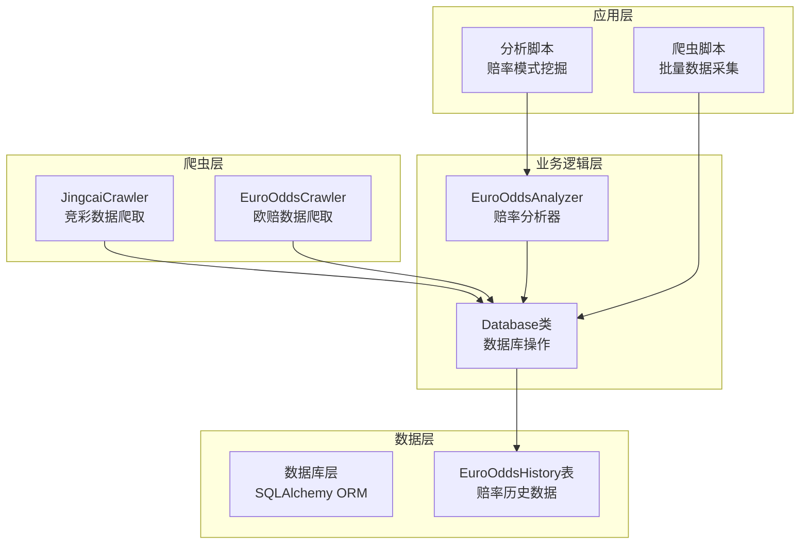
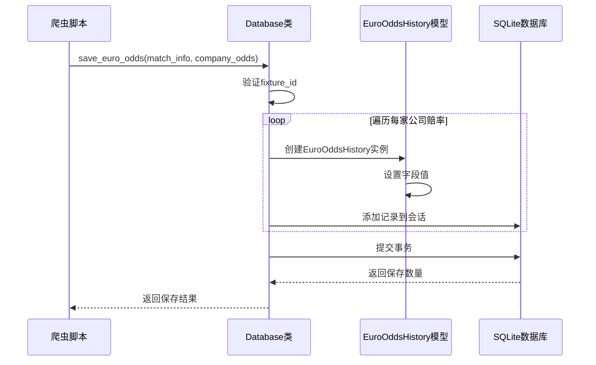
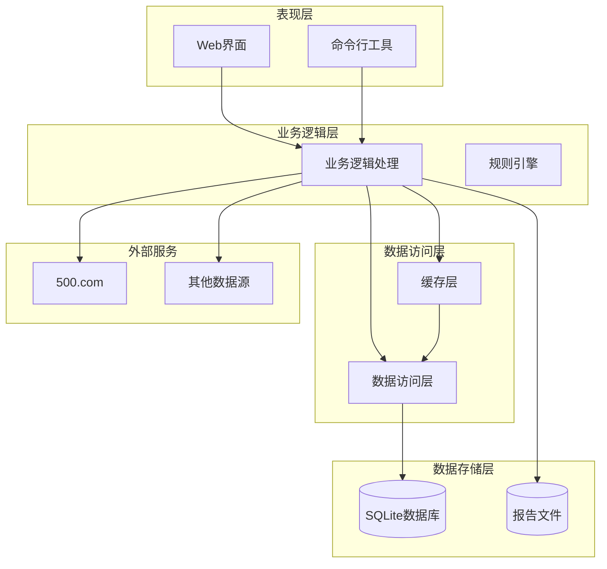
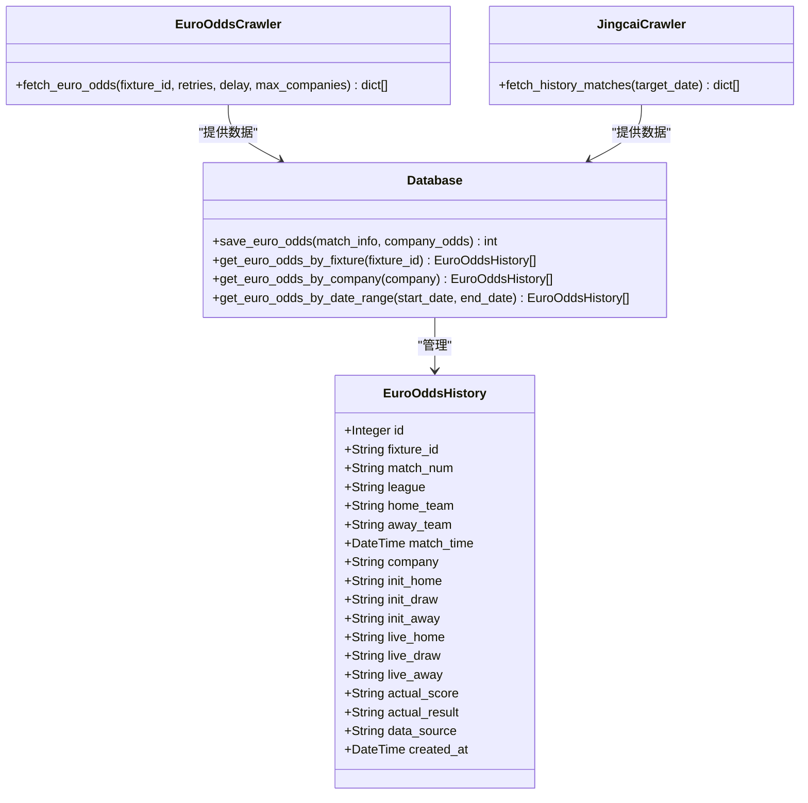
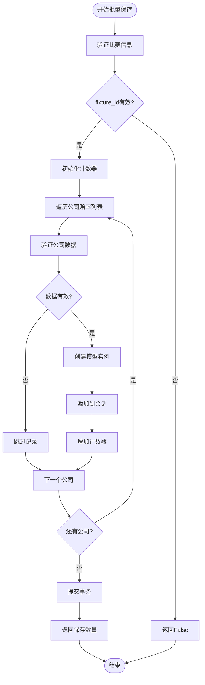
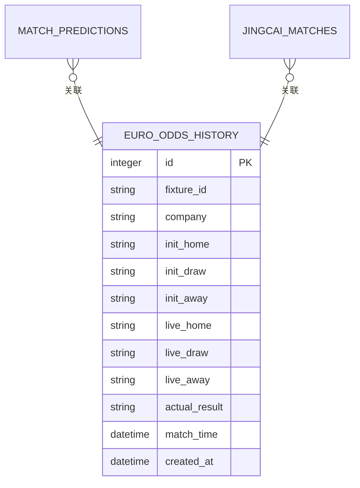
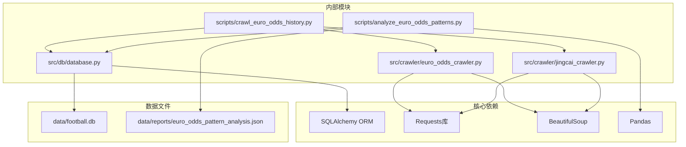

# 欧赔数据API

<cite>
**本文档引用的文件**
- [database.py](file://src/db/database.py)
- [euro_odds_crawler.py](file://src/crawler/euro_odds_crawler.py)
- [jingcai_crawler.py](file://src/crawler/jingcai_crawler.py)
- [crawl_euro_odds_history.py](file://scripts/crawl_euro_odds_history.py)
- [analyze_euro_odds_patterns.py](file://scripts/analyze_euro_odds_patterns.py)
- [analyze_odds_drop_trap.py](file://scripts/analyze_odds_drop_trap.py)
- [euro_odds_pattern_analysis.json](file://data/reports/euro_odds_pattern_analysis.json)
</cite>

## 目录
1. [简介](#简介)
2. [项目结构](#项目结构)
3. [核心组件](#核心组件)
4. [架构概览](#架构概览)
5. [详细组件分析](#详细组件分析)
6. [依赖关系分析](#依赖关系分析)
7. [性能考虑](#性能考虑)
8. [故障排除指南](#故障排除指南)
9. [结论](#结论)
10. [附录](#附录)

## 简介

欧赔数据API是足球预测系统中的核心模块，专门负责处理欧洲赔率（欧赔）历史数据的存储、查询和分析。该API基于SQLAlchemy ORM框架构建，提供了完整的数据库操作接口，支持批量保存欧赔数据、查询历史记录以及高级赔率分析功能。

系统通过爬虫模块从500.com等数据源获取实时赔率数据，经过预处理后存储到SQLite数据库中，为后续的赔率分析和预测模型提供数据支撑。欧赔数据在赔率分析中具有重要作用，能够帮助识别市场资金流向、判断比赛实力差距以及预测冷热趋势。

## 项目结构

该项目采用模块化设计，主要分为以下几个核心部分：



**图表来源**
- [database.py:176-198](file://src/db/database.py#L176-L198)
- [euro_odds_crawler.py:8-26](file://src/crawler/euro_odds_crawler.py#L8-L26)
- [jingcai_crawler.py:6-12](file://src/crawler/jingcai_crawler.py#L6-L12)

**章节来源**
- [database.py:176-198](file://src/db/database.py#L176-L198)
- [euro_odds_crawler.py:8-26](file://src/crawler/euro_odds_crawler.py#L8-L26)
- [jingcai_crawler.py:6-12](file://src/crawler/jingcai_crawler.py#L6-L12)

## 核心组件

### EuroOddsHistory数据模型

欧赔历史数据的核心存储结构如下：

| 字段名 | 类型 | 描述 | 索引 |
|--------|------|------|------|
| id | Integer | 主键ID | 是 |
| fixture_id | String(50) | 比赛唯一标识 | 是 |
| match_num | String(50) | 比赛编号 | 否 |
| league | String(100) | 联赛名称 | 否 |
| home_team | String(100) | 主队名称 | 否 |
| away_team | String(100) | 客队名称 | 否 |
| match_time | DateTime | 比赛时间 | 否 |
| company | String(100) | 博彩公司名称 | 否 |
| init_home | String(20) | 初赔主胜 | 否 |
| init_draw | String(20) | 初赔平局 | 否 |
| init_away | String(20) | 初赔客胜 | 否 |
| live_home | String(20) | 临赔主胜 | 否 |
| live_draw | String(20) | 临赔平局 | 否 |
| live_away | String(20) | 临赔客胜 | 否 |
| actual_score | String(50) | 实际比分 | 否 |
| actual_result | String(20) | 实际结果（胜/平/负） | 否 |
| data_source | String(50) | 数据来源 | 否 |
| created_at | DateTime | 创建时间 | 否 |

### Database类核心方法

Database类提供了完整的数据库操作接口，其中最重要的方法是`save_euro_odds`：



**图表来源**
- [database.py:502-539](file://src/db/database.py#L502-L539)

**章节来源**
- [database.py:176-198](file://src/db/database.py#L176-L198)
- [database.py:502-539](file://src/db/database.py#L502-L539)

## 架构概览

系统采用分层架构设计，各层职责明确：



**图表来源**
- [crawl_euro_odds_history.py:43-117](file://scripts/crawl_euro_odds_history.py#L43-L117)
- [analyze_euro_odds_patterns.py:46-80](file://scripts/analyze_euro_odds_patterns.py#L46-L80)

## 详细组件分析

### 数据模型设计

EuroOddsHistory模型采用了标准化的设计原则：



**图表来源**
- [database.py:176-198](file://src/db/database.py#L176-L198)
- [database.py:502-539](file://src/db/database.py#L502-L539)
- [euro_odds_crawler.py:17-102](file://src/crawler/euro_odds_crawler.py#L17-L102)
- [jingcai_crawler.py:233-323](file://src/crawler/jingcai_crawler.py#L233-L323)

### 数据存储结构

欧赔数据采用"初赔vs临赔"的存储方式，这种设计具有以下特点：

1. **双赔率对比**：同时存储初赔和临赔数据，便于分析赔率变化趋势
2. **公司维度**：按博彩公司维度存储，支持多公司数据对比
3. **时间维度**：记录比赛时间和数据创建时间，支持时间序列分析
4. **结果关联**：关联实际比赛结果，支持事后验证和回测

### 批量保存优化策略

系统实现了高效的批量保存机制：



**图表来源**
- [database.py:502-539](file://src/db/database.py#L502-L539)

**章节来源**
- [database.py:502-539](file://src/db/database.py#L502-L539)

### 博彩公司信息处理

系统支持多家博彩公司的赔率数据处理：

| 公司类型 | 公司名称示例 | 特点 |
|----------|-------------|------|
| 主流公司 | 澳门、Bet365、威廉希尔 | 市场影响力大，数据可靠性高 |
| 亚洲公司 | 立博、1xBet、188Bet | 亚洲市场代表性强 |
| 国际公司 | 欧洲各大博彩公司 | 全球市场覆盖广 |

博彩公司名称处理采用模糊匹配策略，支持中文全称、简称和别名识别。

### 初赔vs临赔数据存储

初赔和临赔数据采用分离存储的方式：



**图表来源**
- [database.py:176-198](file://src/db/database.py#L176-L198)

## 依赖关系分析

系统各组件之间的依赖关系如下：



**图表来源**
- [database.py:1-8](file://src/db/database.py#L1-L8)
- [euro_odds_crawler.py:1-6](file://src/crawler/euro_odds_crawler.py#L1-L6)
- [jingcai_crawler.py:1-5](file://src/crawler/jingcai_crawler.py#L1-L5)

**章节来源**
- [database.py:1-8](file://src/db/database.py#L1-L8)
- [euro_odds_crawler.py:1-6](file://src/crawler/euro_odds_crawler.py#L1-L6)
- [jingcai_crawler.py:1-5](file://src/crawler/jingcai_crawler.py#L1-L5)

## 性能考虑

### 数据库性能优化

1. **索引策略**：为`fixture_id`字段建立索引，提高查询性能
2. **批量操作**：使用批量插入减少数据库往返次数
3. **事务管理**：合理使用事务确保数据一致性
4. **连接池**：配置适当的连接池大小

### 爬虫性能优化

1. **请求限速**：设置合理的请求间隔，避免被限流
2. **重试机制**：实现指数退避的重试策略
3. **并发控制**：控制并发请求数量，避免服务器压力过大
4. **缓存策略**：对重复请求的结果进行缓存

### 内存管理

1. **流式处理**：对于大量数据采用流式处理方式
2. **分批处理**：将大数据集分成小批次处理
3. **及时释放**：及时释放不再使用的对象引用

## 故障排除指南

### 常见问题及解决方案

#### 数据库连接问题
- **症状**：无法连接到SQLite数据库
- **原因**：数据库文件路径错误或权限不足
- **解决**：检查数据库文件路径，确保程序有读写权限

#### 爬虫请求失败
- **症状**：从500.com获取数据失败
- **原因**：网络问题、反爬虫机制、服务器限流
- **解决**：增加重试次数，调整请求头，设置合理的请求间隔

#### 数据解析错误
- **症状**：赔率数据解析失败
- **原因**：网页结构变化、编码问题
- **解决**：更新解析逻辑，检查字符编码

### 调试技巧

1. **日志记录**：启用详细的日志记录，跟踪程序执行过程
2. **数据验证**：对输入数据进行严格验证
3. **异常处理**：实现完善的异常处理机制
4. **单元测试**：编写单元测试验证核心功能

**章节来源**
- [crawl_euro_odds_history.py:104-111](file://scripts/crawl_euro_odds_history.py#L104-L111)
- [euro_odds_crawler.py:104-110](file://src/crawler/euro_odds_crawler.py#L104-L110)

## 结论

欧赔数据API为足球预测系统提供了完整而高效的数据处理能力。通过标准化的数据模型设计、优化的批量保存机制和强大的分析功能，系统能够有效地处理复杂的赔率数据，并为后续的预测分析提供可靠的数据支撑。

该API的主要优势包括：
1. **完整性**：支持初赔vs临赔的完整数据链路
2. **可扩展性**：模块化设计便于功能扩展
3. **性能**：优化的数据库操作和爬虫机制
4. **可靠性**：完善的错误处理和重试机制

未来可以考虑的功能增强包括：
1. 支持更多的数据源
2. 实现实时数据推送
3. 增强数据分析算法
4. 提供更丰富的API接口

## 附录

### API使用示例

#### 批量保存欧赔数据
```python
# 准备比赛信息
match_info = {
    "fixture_id": "123456",
    "match_num": "B01",
    "league": "英超",
    "home_team": "曼城",
    "away_team": "利物浦",
    "match_time_parsed": "2024-01-15 20:00:00",
    "actual_score": "2:1",
    "actual_result": "胜"
}

# 准备公司赔率数据
company_odds = [
    {
        "company": "澳门",
        "init_home": "2.10",
        "init_draw": "3.20", 
        "init_away": "3.40",
        "live_home": "2.05",
        "live_draw": "3.25",
        "live_away": "3.35"
    },
    # 更多公司数据...
]

# 保存数据
db = Database()
saved_count = db.save_euro_odds(match_info, company_odds)
```

#### 查询欧赔数据
```python
# 按比赛查询
odds_list = db.get_euro_odds_by_fixture("123456")

# 按公司查询  
odds_list = db.get_euro_odds_by_company("澳门")

# 按日期范围查询
odds_list = db.get_euro_odds_by_date_range("2024-01-01", "2024-01-31")
```

### 赔率分析最佳实践

1. **数据质量检查**：确保初赔和临赔数据的有效性
2. **多公司对比**：使用多家公司的数据进行交叉验证
3. **时间序列分析**：关注赔率变化的时间趋势
4. **统计显著性**：确保分析结果具有统计意义
5. **回测验证**：使用历史数据验证分析方法的有效性

**章节来源**
- [analyze_euro_odds_patterns.py:49-80](file://scripts/analyze_euro_odds_patterns.py#L49-L80)
- [analyze_odds_drop_trap.py:7-27](file://scripts/analyze_odds_drop_trap.py#L7-L27)