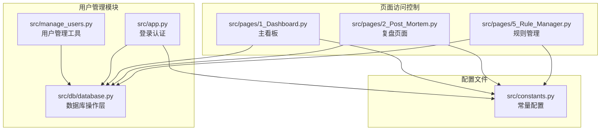
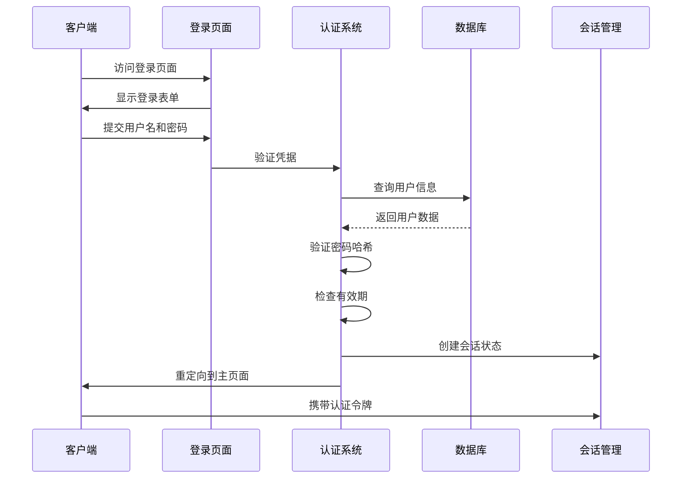
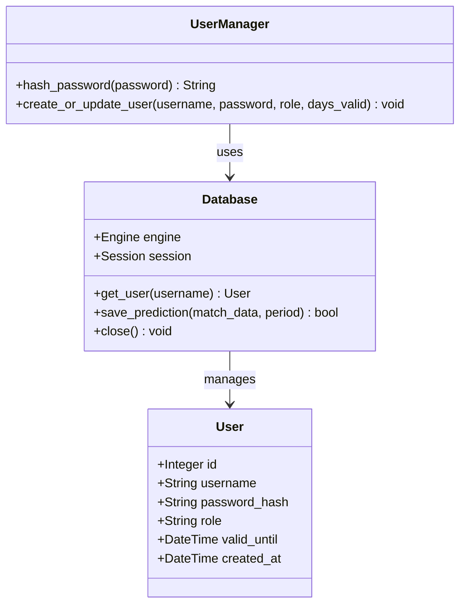
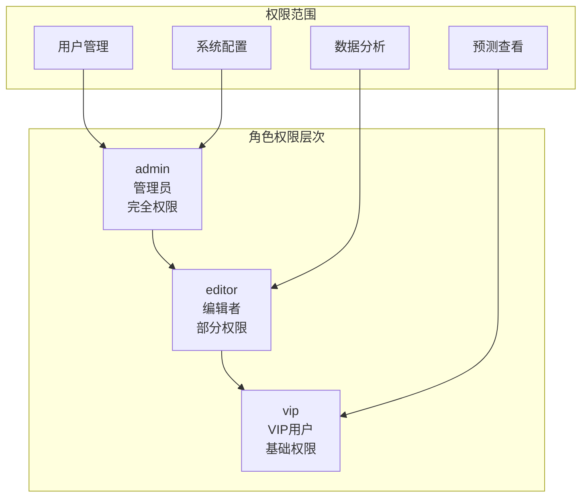
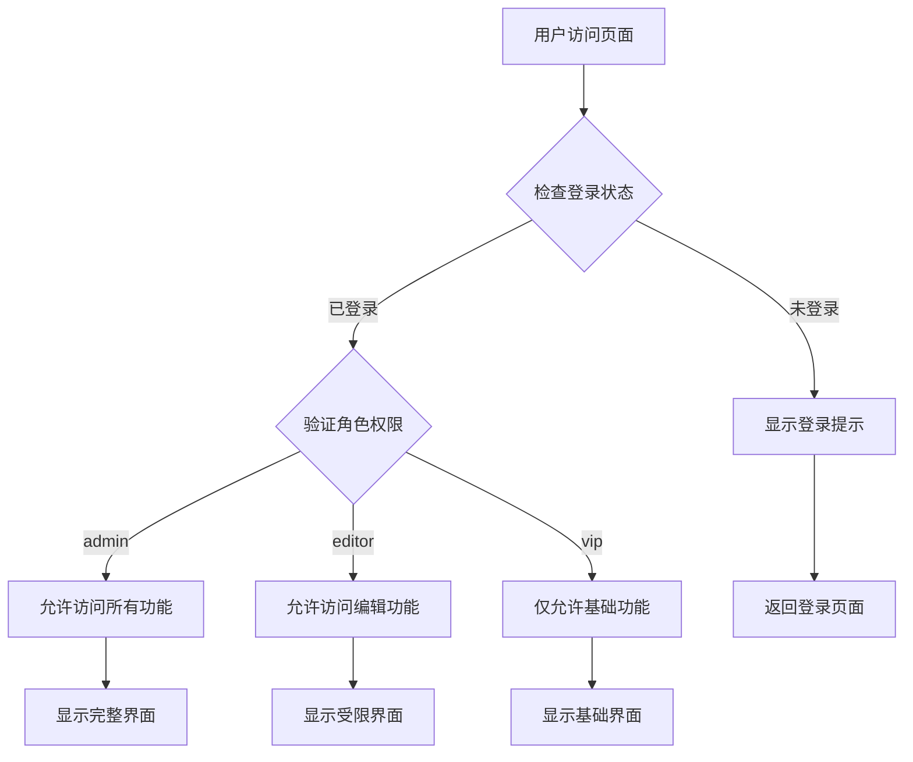
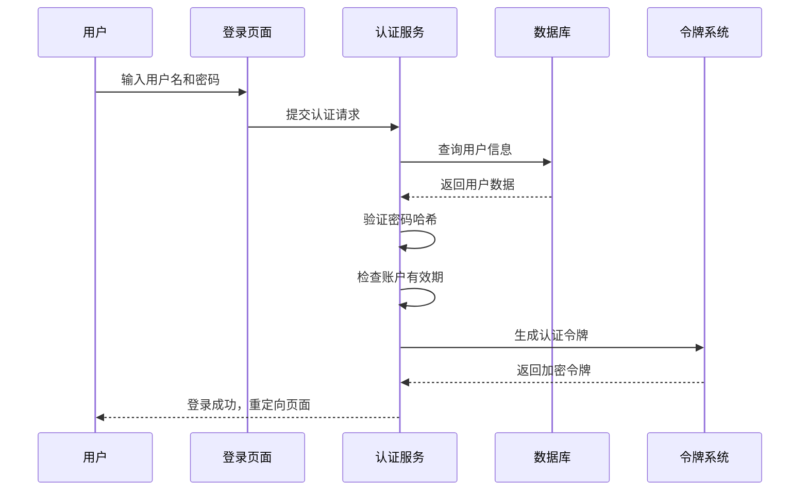
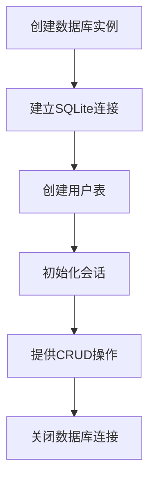
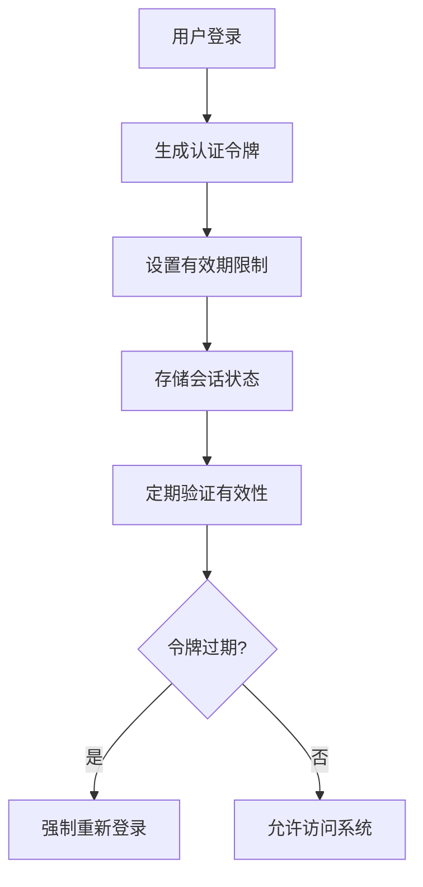

# 用户管理API

<cite>
**本文档引用的文件**
- [manage_users.py](file://src/manage_users.py)
- [database.py](file://src/db/database.py)
- [app.py](file://src/app.py)
- [constants.py](file://src/constants.py)
- [1_Dashboard.py](file://src/pages/1_Dashboard.py)
- [2_Post_Mortem.py](file://src/pages/2_Post_Mortem.py)
- [5_Rule_Manager.py](file://src/pages/5_Rule_Manager.py)
</cite>

## 目录
1. [简介](#简介)
2. [项目结构](#项目结构)
3. [核心组件](#核心组件)
4. [架构概览](#架构概览)
5. [详细组件分析](#详细组件分析)
6. [用户数据模型](#用户数据模型)
7. [权限控制系统](#权限控制系统)
8. [用户认证流程](#用户认证流程)
9. [数据库操作方法](#数据库操作方法)
10. [安全最佳实践](#安全最佳实践)
11. [故障排除指南](#故障排除指南)
12. [结论](#结论)

## 简介

用户管理API是足球预测系统的核心组件，负责管理用户账户、权限控制和认证机制。该系统采用SQLite数据库存储用户信息，支持三种角色权限（admin、editor、vip），并通过基于时间戳的令牌机制实现会话管理。

系统提供了完整的用户生命周期管理功能，包括用户创建、更新、权限分配和有效期管理。所有用户操作都经过严格的安全验证和权限控制。

## 项目结构

用户管理相关的文件组织结构如下：

**图表来源**
- [manage_users.py:1-45](file://src/manage_users.py#L1-L45)
- [database.py:200-310](file://src/db/database.py#L200-L310)
- [app.py:94-108](file://src/app.py#L94-L108)

**章节来源**
- [manage_users.py:1-45](file://src/manage_users.py#L1-L45)
- [database.py:1-567](file://src/db/database.py#L1-L567)
- [app.py:1-166](file://src/app.py#L1-L166)

## 核心组件

### 用户管理工具 (manage_users.py)

用户管理工具提供了便捷的命令行接口来创建和更新用户账户：

- **哈希密码函数**: 使用SHA-256算法对密码进行安全哈希
- **用户创建/更新**: 支持批量创建测试用户和更新现有用户
- **有效期管理**: 可设置用户的有效期天数

### 数据库操作层 (database.py)

数据库操作层封装了所有用户相关的数据库操作：

- **User模型**: 定义用户表结构和字段
- **数据库连接**: 管理SQLite数据库连接和会话
- **查询方法**: 提供用户查询和管理功能

### 认证系统 (app.py)

认证系统实现了完整的用户登录和会话管理：

- **令牌生成**: 基于用户名和时间戳生成加密令牌
- **登录验证**: 验证用户名、密码和有效期
- **会话管理**: 管理用户登录状态和权限

**章节来源**
- [manage_users.py:9-37](file://src/manage_users.py#L9-L37)
- [database.py:58-67](file://src/db/database.py#L58-L67)
- [app.py:51-108](file://src/app.py#L51-L108)

## 架构概览

用户管理系统采用分层架构设计，确保职责分离和代码可维护性：

**图表来源**
- [app.py:94-108](file://src/app.py#L94-L108)
- [database.py:309-310](file://src/db/database.py#L309-L310)

## 详细组件分析

### 用户模型设计

User模型定义了用户数据的完整结构：

**图表来源**
- [database.py:58-67](file://src/db/database.py#L58-L67)
- [database.py:200-217](file://src/db/database.py#L200-L217)
- [manage_users.py:9-37](file://src/manage_users.py#L9-L37)

### 用户管理工具功能

用户管理工具提供了以下核心功能：

1. **密码哈希**: 使用SHA-256算法确保密码安全存储
2. **用户创建**: 支持批量创建测试用户
3. **有效期设置**: 可配置用户的有效期天数
4. **角色管理**: 支持admin、editor、vip三种角色

**章节来源**
- [manage_users.py:12-37](file://src/manage_users.py#L12-L37)

## 用户数据模型

### 数据库表结构

用户表采用SQLite存储，具有以下字段定义：

| 字段名 | 类型 | 约束 | 描述 |
|--------|------|------|------|
| id | INTEGER | PRIMARY KEY, AUTOINCREMENT | 用户唯一标识符 |
| username | VARCHAR(50) | UNIQUE, NOT NULL, INDEX | 用户名，唯一索引 |
| password_hash | VARCHAR(128) | NOT NULL | SHA-256哈希后的密码 |
| role | VARCHAR(20) | DEFAULT 'vip' | 用户角色 |
| valid_until | DATETIME | NOT NULL | 账户有效期截止时间 |
| created_at | DATETIME | DEFAULT CURRENT_TIMESTAMP | 账户创建时间 |

### 角色权限体系

系统支持三种角色，每种角色具有不同的权限级别：

**图表来源**
- [database.py:64](file://src/db/database.py#L64)
- [1_Dashboard.py:199-200](file://src/pages/1_Dashboard.py#L199-L200)

**章节来源**
- [database.py:58-67](file://src/db/database.py#L58-L67)

## 权限控制系统

### 页面访问控制

系统通过会话状态和角色验证实现页面访问控制：

**图表来源**
- [1_Dashboard.py:199-200](file://src/pages/1_Dashboard.py#L199-L200)
- [2_Post_Mortem.py:76-80](file://src/pages/2_Post_Mortem.py#L76-L80)

### 动态功能控制

不同角色可以看到不同的功能选项：

- **Admin角色**: 可访问用户管理、规则管理、系统配置等功能
- **Editor角色**: 可访问数据分析、预测编辑等功能
- **VIP用户**: 仅能访问基本的预测查看功能

**章节来源**
- [1_Dashboard.py:265-277](file://src/pages/1_Dashboard.py#L265-L277)
- [5_Rule_Manager.py:384-408](file://src/pages/5_Rule_Manager.py#L384-L408)

## 用户认证流程

### 登录认证机制

系统采用基于令牌的认证机制，确保安全性：

**图表来源**
- [app.py:94-108](file://src/app.py#L94-L108)
- [database.py:309-310](file://src/db/database.py#L309-L310)

### 令牌管理

认证令牌采用以下机制：

1. **令牌生成**: `username|timestamp` 格式
2. **加密存储**: Base64编码防止明文传输
3. **有效期控制**: 默认8小时有效
4. **自动续期**: 访问时自动更新时间戳

**章节来源**
- [app.py:51-62](file://src/app.py#L51-L62)
- [constants.py:3-4](file://src/constants.py#L3-L4)

## 数据库操作方法

### 核心数据库操作

系统提供了完整的用户数据操作方法：

#### 用户查询操作

| 方法名 | 参数 | 返回值 | 描述 |
|--------|------|--------|------|
| get_user | username: str | User 或 None | 根据用户名查询用户 |
| create_or_update_user | username, password, role, days_valid | None | 创建或更新用户 |
| hash_password | password: str | str | 密码哈希计算 |

#### 数据库连接管理

**图表来源**
- [database.py:200-217](file://src/db/database.py#L200-L217)
- [manage_users.py:12-37](file://src/manage_users.py#L12-L37)

**章节来源**
- [database.py:309-310](file://src/db/database.py#L309-L310)
- [manage_users.py:9-37](file://src/manage_users.py#L9-L37)

## 安全最佳实践

### 密码安全

系统采用以下安全措施：

1. **哈希存储**: 使用SHA-256算法对密码进行不可逆哈希
2. **盐值机制**: 基于用户名生成独特的哈希值
3. **传输加密**: 令牌采用Base64编码防止明文传输

### 会话安全管理

**图表来源**
- [app.py:64-82](file://src/app.py#L64-L82)
- [constants.py:3-4](file://src/constants.py#L3-L4)

### 权限控制策略

1. **最小权限原则**: 每个角色仅授予必要的功能权限
2. **动态权限检查**: 在每次页面访问时验证用户权限
3. **会话超时处理**: 自动检测和处理过期会话

**章节来源**
- [app.py:94-108](file://src/app.py#L94-L108)
- [1_Dashboard.py:199-200](file://src/pages/1_Dashboard.py#L199-L200)

## 故障排除指南

### 常见问题及解决方案

#### 用户登录失败

**问题症状**: 用户无法登录系统
**可能原因**:
- 用户名不存在
- 密码错误
- 账户已过期

**解决步骤**:
1. 验证用户名和密码输入
2. 检查账户有效期
3. 重新创建或续期用户账户

#### 页面访问被拒绝

**问题症状**: 用户无法访问特定页面
**可能原因**:
- 权限不足
- 会话过期
- 令牌无效

**解决步骤**:
1. 检查用户角色权限
2. 重新登录系统
3. 清除浏览器缓存和Cookie

#### 数据库连接问题

**问题症状**: 系统无法连接到用户数据库
**可能原因**:
- 数据库文件损坏
- 权限不足
- 路径配置错误

**解决步骤**:
1. 检查数据库文件完整性
2. 验证文件权限设置
3. 重新初始化数据库连接

**章节来源**
- [app.py:99-108](file://src/app.py#L99-L108)
- [database.py:200-217](file://src/db/database.py#L200-L217)

## 结论

用户管理API为足球预测系统提供了完整、安全的用户管理解决方案。系统采用分层架构设计，确保了代码的可维护性和扩展性。通过严格的权限控制和安全机制，系统能够有效保护用户数据和系统资源。

主要特点包括：
- **多层次权限控制**: 支持admin、editor、vip三种角色
- **安全认证机制**: 基于令牌的认证和会话管理
- **灵活的用户管理**: 支持用户创建、更新和有效期管理
- **完善的错误处理**: 提供详细的故障诊断和恢复机制

该系统为后续的功能扩展和维护奠定了坚实的基础，能够满足不断增长的业务需求。