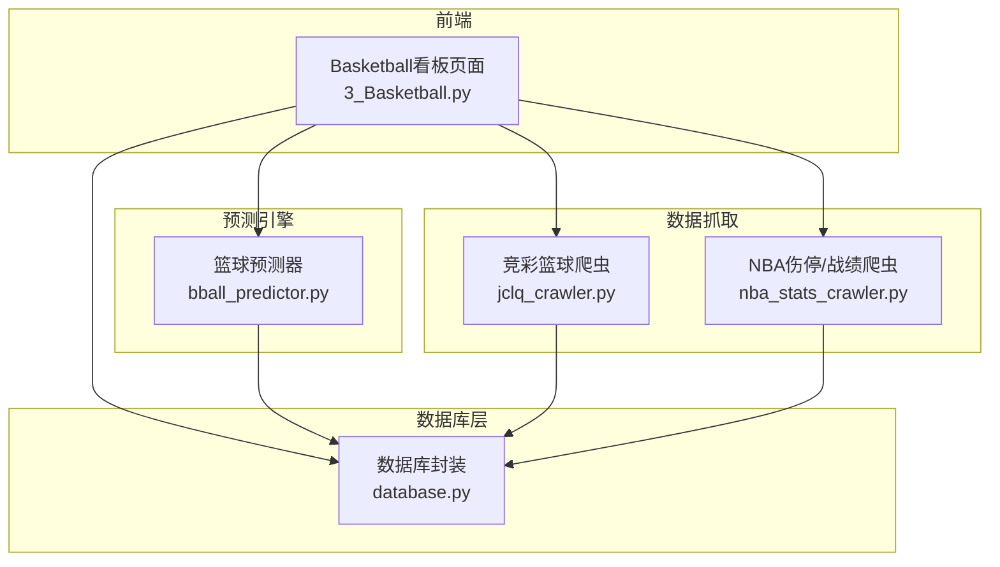
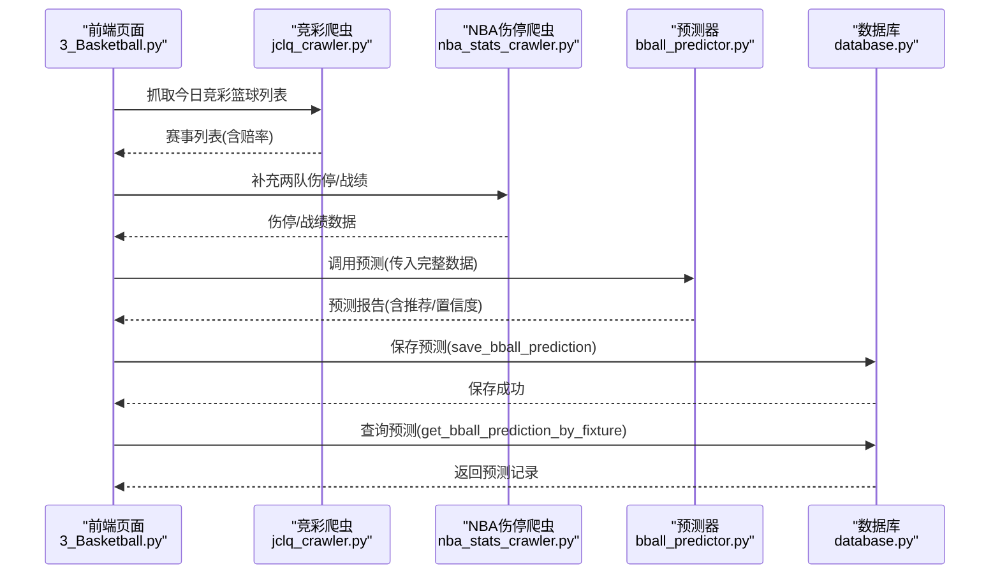
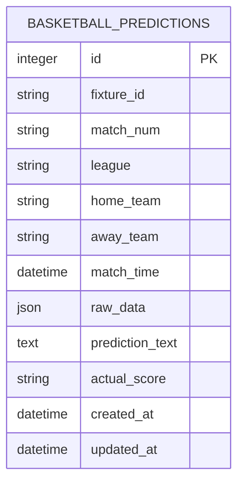
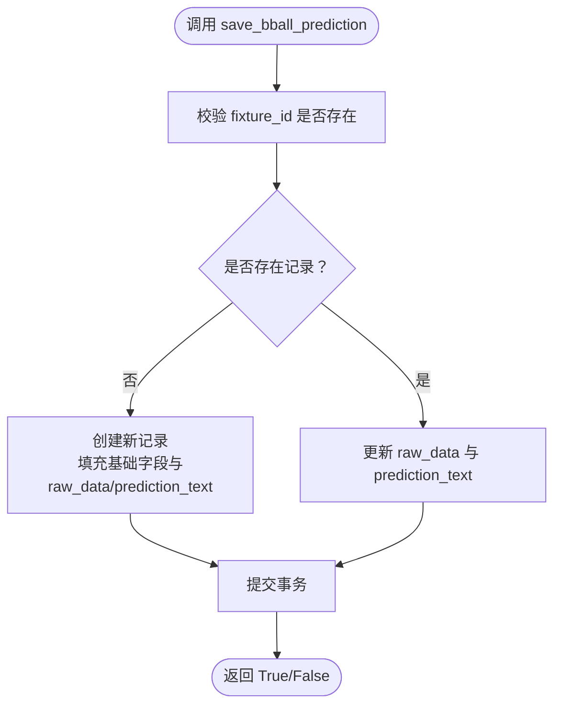
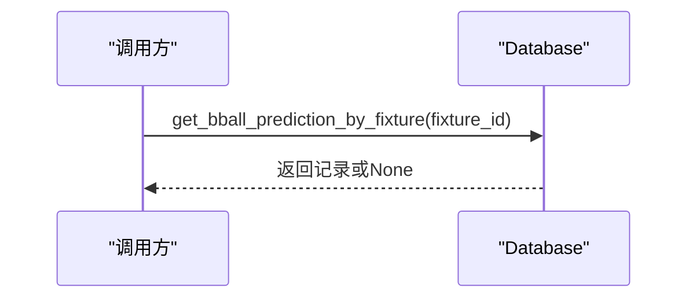
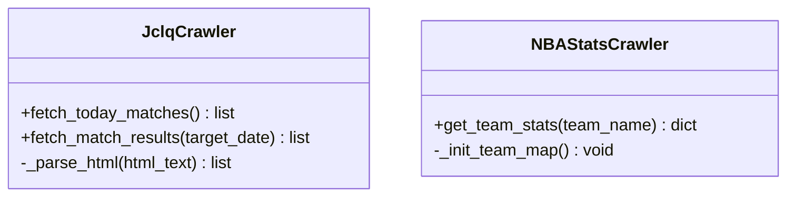
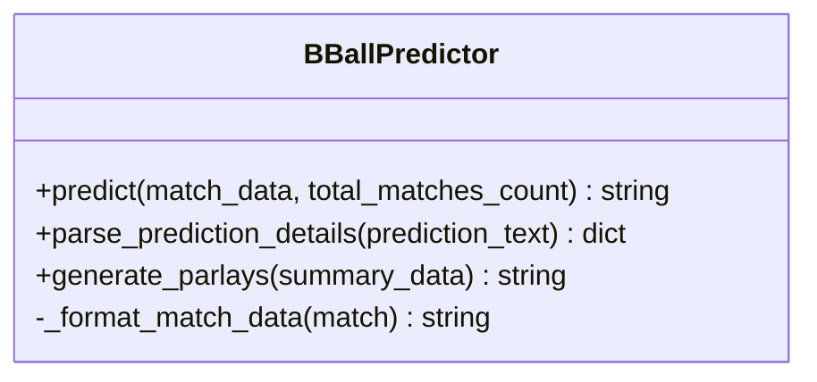
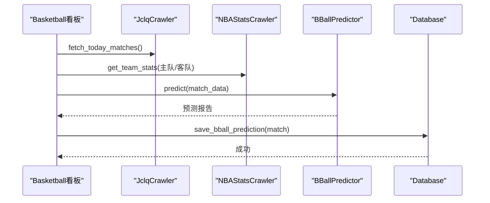
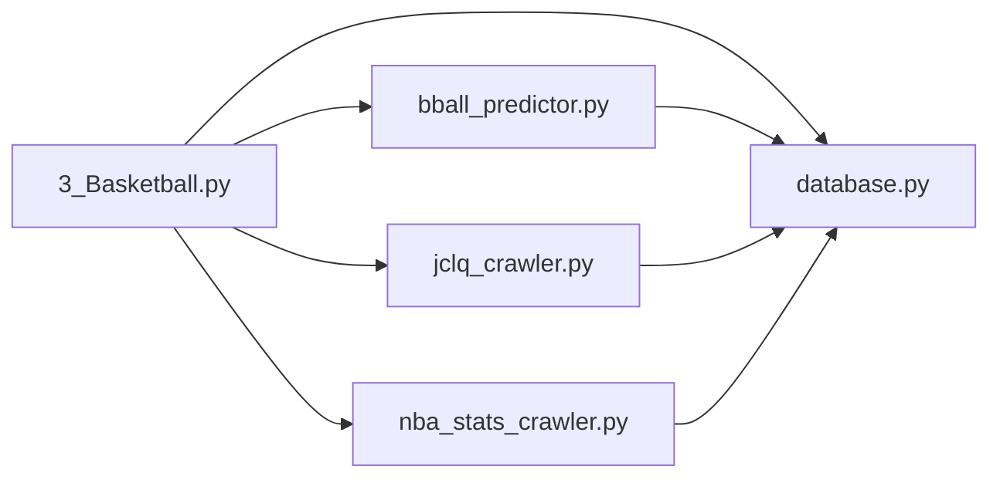

# 篮球数据API

<cite>
**本文引用的文件**
- [database.py](file://src/db/database.py)
- [3_Basketball.py](file://src/pages/3_Basketball.py)
- [bball_predictor.py](file://src/llm/bball_predictor.py)
- [jclq_crawler.py](file://src/crawler/jclq_crawler.py)
- [nba_stats_crawler.py](file://src/crawler/nba_stats_crawler.py)
- [today_bball_matches.json](file://data/today_bball_matches.json)
- [bball_all_compared_matches.json](file://data/reports/bball_all_compared_matches.json)
- [basketball_prediction_plan.md](file://docs/basketball_prediction_plan.md)
- [basketball_parlay_strategy.md](file://docs/basketball_parlay_strategy.md)
- [20240326_add_prediction_period.sql](file://supabase/migrations/20240326_add_prediction_period.sql)
</cite>

## 目录
1. [简介](#简介)
2. [项目结构](#项目结构)
3. [核心组件](#核心组件)
4. [架构总览](#架构总览)
5. [详细组件分析](#详细组件分析)
6. [依赖关系分析](#依赖关系分析)
7. [性能考量](#性能考量)
8. [故障排查指南](#故障排查指南)
9. [结论](#结论)
10. [附录](#附录)

## 简介
本文件面向篮球数据API的使用者与维护者，系统性阐述BasketballPrediction相关的数据库操作方法与数据结构，包括save_bball_prediction、get_bball_prediction_by_fixture等核心接口。文档同时解释篮球预测数据的存储结构、字段含义与使用场景，对比篮球与足球数据差异，梳理篮球预测结果的特殊处理逻辑，并提供查询与管理最佳实践及常见使用场景。

## 项目结构
该项目采用模块化分层设计，围绕Streamlit前端页面、LLM预测器、数据抓取器与数据库层协同工作：
- 前端页面：Basketball看板页面负责展示与交互，触发数据抓取与预测流程
- 数据抓取：竞彩篮球爬虫与NBA伤停/战绩爬虫负责采集原始数据
- 预测引擎：LLM预测器负责生成深度分析报告与串关方案
- 数据库层：SQLAlchemy ORM封装，提供统一的持久化接口

图表来源
- [3_Basketball.py:1-451](file://src/pages/3_Basketball.py#L1-L451)
- [jclq_crawler.py:1-264](file://src/crawler/jclq_crawler.py#L1-L264)
- [nba_stats_crawler.py:1-133](file://src/crawler/nba_stats_crawler.py#L1-L133)
- [bball_predictor.py:1-282](file://src/llm/bball_predictor.py#L1-L282)
- [database.py:1-567](file://src/db/database.py#L1-L567)

章节来源
- [3_Basketball.py:1-451](file://src/pages/3_Basketball.py#L1-L451)
- [database.py:1-567](file://src/db/database.py#L1-L567)

## 核心组件
本节聚焦BasketballPrediction相关的数据库接口与数据结构，涵盖：
- 数据模型：BasketballPrediction表结构与字段语义
- 数据库接口：save_bball_prediction、get_bball_prediction_by_fixture等
- 数据来源：竞彩篮球爬虫与NBA伤停爬虫
- 预测生成：LLM预测器输出结构与解析

章节来源
- [database.py:104-126](file://src/db/database.py#L104-L126)
- [database.py:331-372](file://src/db/database.py#L331-L372)
- [jclq_crawler.py:14-138](file://src/crawler/jclq_crawler.py#L14-L138)
- [nba_stats_crawler.py:71-125](file://src/crawler/nba_stats_crawler.py#L71-L125)
- [bball_predictor.py:124-198](file://src/llm/bball_predictor.py#L124-L198)

## 架构总览
篮球数据API的端到端流程如下：
- 数据抓取：从竞彩网站抓取今日篮球赛事基本信息与赔率，补充NBA伤停与战绩
- 预测生成：调用LLM预测器生成深度分析报告，包含让分/大小分推荐与置信度
- 数据持久化：将原始数据与预测结果写入BasketballPrediction表
- 查询展示：前端页面读取JSON文件与数据库，展示预测汇总与详细分析

图表来源
- [3_Basketball.py:194-268](file://src/pages/3_Basketball.py#L194-L268)
- [jclq_crawler.py:14-138](file://src/crawler/jclq_crawler.py#L14-L138)
- [nba_stats_crawler.py:71-125](file://src/crawler/nba_stats_crawler.py#L71-L125)
- [bball_predictor.py:166-198](file://src/llm/bball_predictor.py#L166-L198)
- [database.py:331-372](file://src/db/database.py#L331-L372)

## 详细组件分析

### 数据模型：BasketballPrediction
BasketballPrediction表用于存储竞彩篮球预测的完整生命周期数据，字段语义如下：
- 标识与时间：id、fixture_id、match_num、league、home_team、away_team、match_time
- 原始数据：raw_data（JSON格式，包含竞彩赔率、两队伤停/战绩等）
- 预测结果：prediction_text（LLM生成的完整分析报告）
- 实际结果：actual_score（用于复盘与准确率统计）

图表来源
- [database.py:104-126](file://src/db/database.py#L104-L126)

章节来源
- [database.py:104-126](file://src/db/database.py#L104-L126)

### 数据库接口：save_bball_prediction
- 功能：保存或更新某场比赛的篮球预测结果
- 输入：match_data（包含fixture_id、match_num、league、home_team、away_team、match_time、llm_prediction等）
- 逻辑要点：
  - 以fixture_id为唯一标识查找记录
  - 若不存在则新建；若存在则更新raw_data与prediction_text
  - 支持重复调用以刷新预测结果
- 返回：布尔值表示保存是否成功

图表来源
- [database.py:331-366](file://src/db/database.py#L331-L366)

章节来源
- [database.py:331-366](file://src/db/database.py#L331-L366)

### 数据库接口：get_bball_prediction_by_fixture
- 功能：按fixture_id查询某场比赛的篮球预测记录
- 返回：BasketballPrediction对象或None

图表来源
- [database.py:368-372](file://src/db/database.py#L368-L372)

章节来源
- [database.py:368-372](file://src/db/database.py#L368-L372)

### 数据来源：竞彩篮球爬虫与NBA伤停爬虫
- 竞彩篮球爬虫（JclqCrawler）
  - 抓取今日竞彩篮球列表，解析赔率与盘口
  - 修复主客队顺序与让分符号逻辑，确保与LLM输入一致
- NBA伤停爬虫（NBAStatsCrawler）
  - 通过ESPN API获取球队伤停与战绩
  - 构建中英文队名映射，增强匹配鲁棒性

图表来源
- [jclq_crawler.py:6-138](file://src/crawler/jclq_crawler.py#L6-L138)
- [nba_stats_crawler.py:6-125](file://src/crawler/nba_stats_crawler.py#L6-L125)

章节来源
- [jclq_crawler.py:14-138](file://src/crawler/jclq_crawler.py#L14-L138)
- [nba_stats_crawler.py:71-125](file://src/crawler/nba_stats_crawler.py#L71-L125)

### 预测引擎：LLM预测器
- 输入：完整match_data（含竞彩赔率、两队伤停/战绩）
- 输出：结构化的预测报告，包含让分/大小分推荐与置信度
- 特殊处理：
  - parse_prediction_details：从报告中抽取推荐与置信度
  - generate_parlays：基于当日汇总生成串关方案

图表来源
- [bball_predictor.py:9-282](file://src/llm/bball_predictor.py#L9-L282)

章节来源
- [bball_predictor.py:124-198](file://src/llm/bball_predictor.py#L124-L198)
- [bball_predictor.py:199-282](file://src/llm/bball_predictor.py#L199-L282)

### 前端集成：Basketball看板
- 数据加载：从data/today_bball_matches.json读取并缓存
- 全局重新预测：抓取最新数据，调用预测器，逐场保存预测
- 串关生成：基于当日汇总生成AI串关方案
- 单场重新预测：按需抓取伤停，调用预测器，保存更新

图表来源
- [3_Basketball.py:194-268](file://src/pages/3_Basketball.py#L194-L268)
- [3_Basketball.py:418-438](file://src/pages/3_Basketball.py#L418-L438)

章节来源
- [3_Basketball.py:91-451](file://src/pages/3_Basketball.py#L91-L451)

## 依赖关系分析
- 前端页面依赖数据库封装与预测器
- 预测器依赖.env配置的LLM API密钥与基础地址
- 数据库封装依赖SQLAlchemy ORM与SQLite文件football.db
- 爬虫依赖第三方API与HTML解析库

图表来源
- [3_Basketball.py:12-15](file://src/pages/3_Basketball.py#L12-L15)
- [database.py:1-9](file://src/db/database.py#L1-L9)
- [bball_predictor.py:1-27](file://src/llm/bball_predictor.py#L1-L27)
- [jclq_crawler.py:1-12](file://src/crawler/jclq_crawler.py#L1-L12)
- [nba_stats_crawler.py:1-4](file://src/crawler/nba_stats_crawler.py#L1-L4)

章节来源
- [3_Basketball.py:12-15](file://src/pages/3_Basketball.py#L12-L15)
- [database.py:1-9](file://src/db/database.py#L1-L9)

## 性能考量
- 数据抓取：竞彩爬虫与NBA伤停爬虫均设置超时参数，避免阻塞
- 数据库：使用事务提交与回滚，确保一致性；对fixture_id建立索引
- 前端缓存：使用@st.cache_data缓存今日篮球数据，减少IO
- 预测成本：LLM调用需考虑API延迟与费用，建议批量处理并控制并发

[本节为通用指导，不涉及具体文件分析]

## 故障排查指南
- LLM API配置
  - 确认.env文件中LLM_API_KEY已正确配置
  - 检查LLM_API_BASE与模型名称是否正确
- 数据库连接
  - 确认football.db路径存在且可写
  - 如遇列缺失，可通过迁移脚本自动补齐
- 爬虫异常
  - 竞彩网站编码与结构变更可能导致解析失败
  - NBA伤停爬虫需确保ESPN API可用
- 前端权限
  - 登录态过期或用户权限不足会导致页面重定向

章节来源
- [bball_predictor.py:10-27](file://src/llm/bball_predictor.py#L10-L27)
- [database.py:200-217](file://src/db/database.py#L200-L217)
- [jclq_crawler.py:20-31](file://src/crawler/jclq_crawler.py#L20-L31)
- [nba_stats_crawler.py:17-29](file://src/crawler/nba_stats_crawler.py#L17-L29)

## 结论
本篮球数据API以BasketballPrediction为核心，围绕数据抓取、预测生成与持久化形成闭环。通过标准化的数据库接口与前端看板，实现了从原始数据到预测结果再到可视化展示的完整流程。相比足球预测，篮球预测更强调核心球员状态、体能消耗与盘口博弈，预测器与文档均体现了这些差异化要点。建议在生产环境中加强异常监控、缓存策略与LLM调用成本控制。

[本节为总结性内容，不涉及具体文件分析]

## 附录

### 常见使用场景与最佳实践
- 全局重新预测
  - 适用：每日开盘前或赛程调整后
  - 流程：抓取竞彩列表 → 补充伤停/战绩 → 调用预测器 → 保存预测
  - 注意：控制并发与重试，避免API限流
- 单场重新预测
  - 适用：临场突发（如关键球员伤停）
  - 流程：抓取最新伤停 → 调用预测器 → 保存更新
- 串关方案生成
  - 适用：基于当日预测汇总生成稳健/进阶方案
  - 建议：采用2串1异构组合，规避“双胆双热”与深盘陷阱

章节来源
- [3_Basketball.py:194-268](file://src/pages/3_Basketball.py#L194-L268)
- [3_Basketball.py:306-389](file://src/pages/3_Basketball.py#L306-L389)
- [basketball_parlay_strategy.md:33-51](file://docs/basketball_parlay_strategy.md#L33-L51)

### 数据字段与含义对照
- fixture_id：比赛唯一标识
- match_num：比赛编号（如“周五301”）
- league：赛事名称（如“NBA”、“CBA”、“欧篮联”）
- home_team/away_team：主队/客队
- match_time：开赛时间
- raw_data：原始JSON数据（含竞彩赔率、两队伤停/战绩）
- prediction_text：LLM生成的预测报告
- actual_score：实际比分（用于复盘）

章节来源
- [database.py:104-126](file://src/db/database.py#L104-L126)

### 篮球与足球数据差异
- 盘口与大小分：篮球让分/大小分盘口更精细，机构博弈更复杂
- 体能与节奏：篮球节奏快、体能消耗大，第四节崩盘风险高
- 欧篮专项：40分钟赛制、主场优势巨大、防守效率权重更高
- 串关策略：篮球串关更强调风控与同场关联逻辑，避免长串

章节来源
- [basketball_prediction_plan.md:40-71](file://docs/basketball_prediction_plan.md#L40-L71)
- [basketball_parlay_strategy.md:7-21](file://docs/basketball_parlay_strategy.md#L7-L21)

### 数据查询与管理最佳实践
- 使用get_bball_prediction_by_fixture按fixture_id精确查询
- 对高频查询建立索引（fixture_id）
- 复盘时使用actual_score回填，结合bball_all_compared_matches.json进行准确率统计
- 前端缓存今日数据，减少IO与API调用

章节来源
- [database.py:368-372](file://src/db/database.py#L368-L372)
- [bball_all_compared_matches.json:1-128](file://data/reports/bball_all_compared_matches.json#L1-L128)