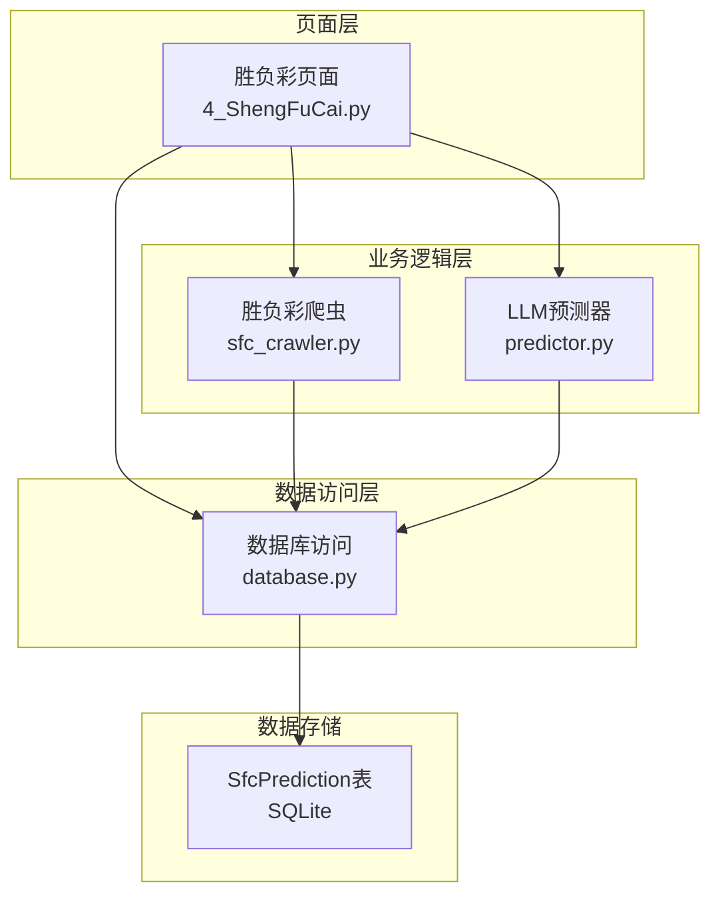
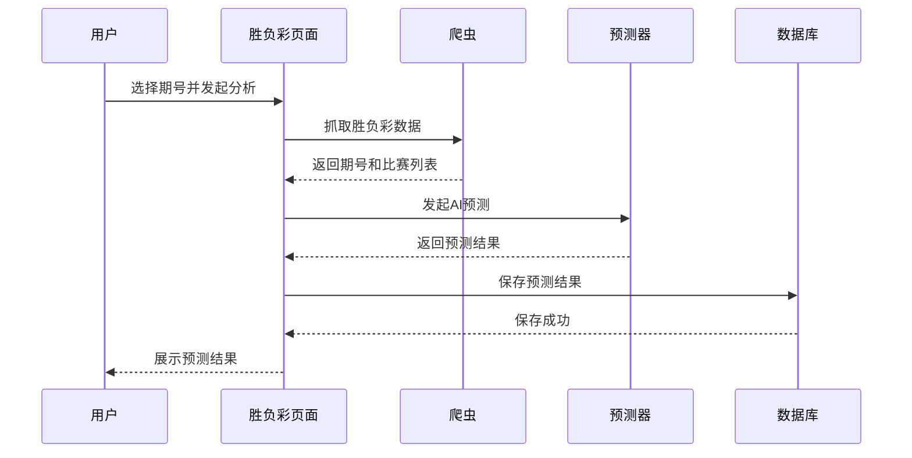
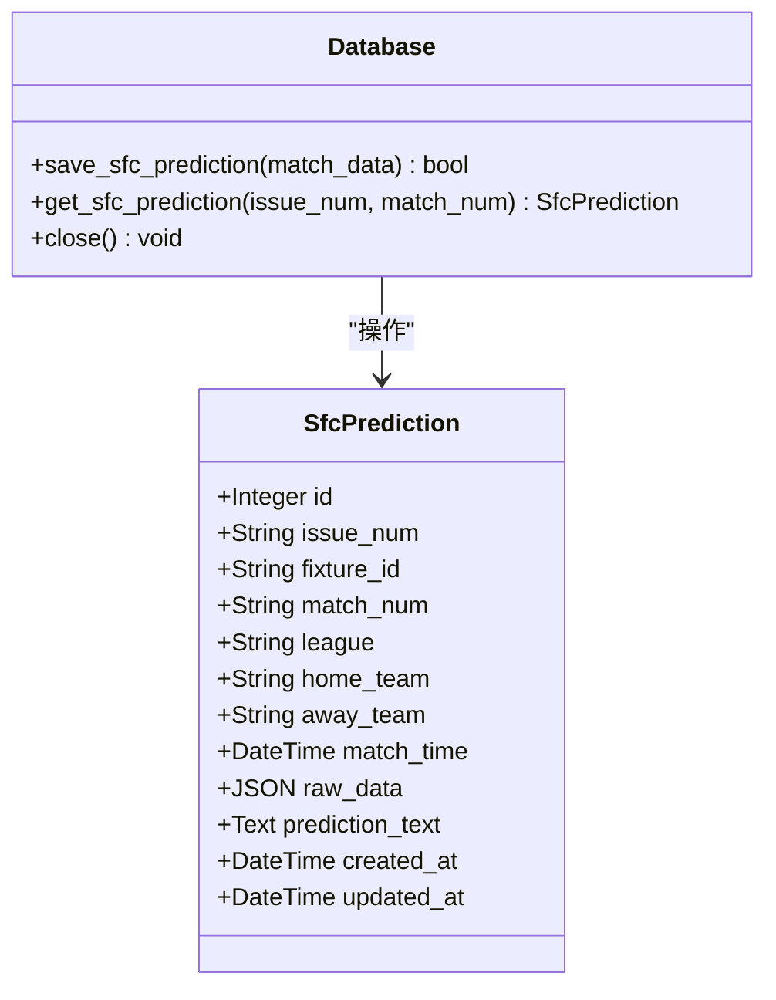
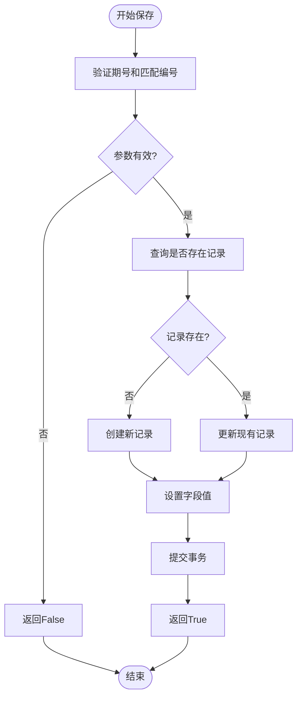
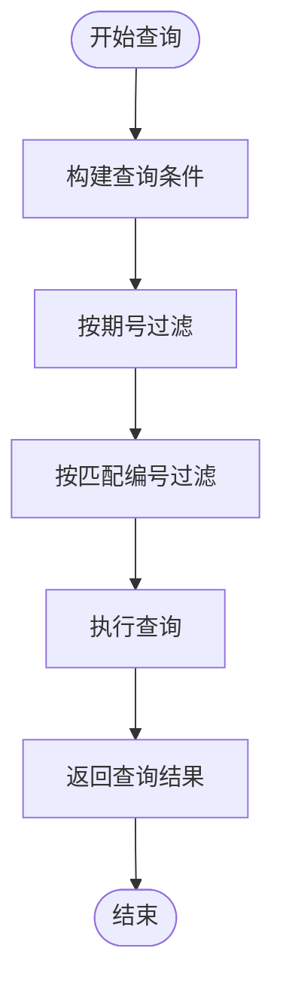
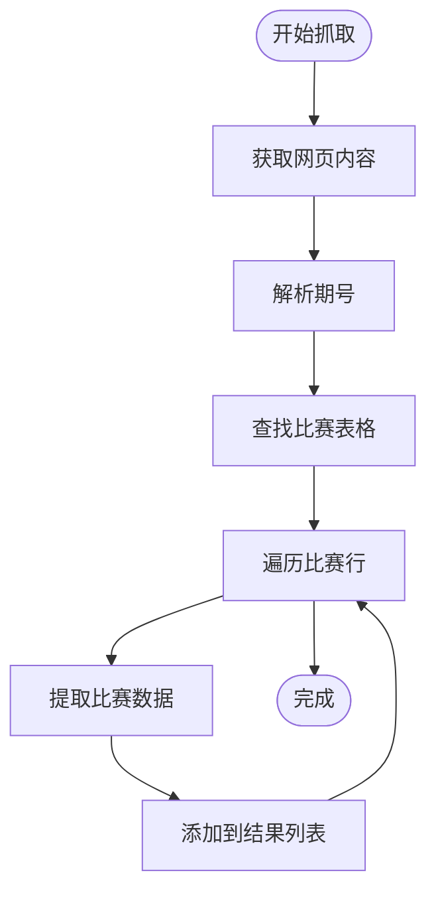
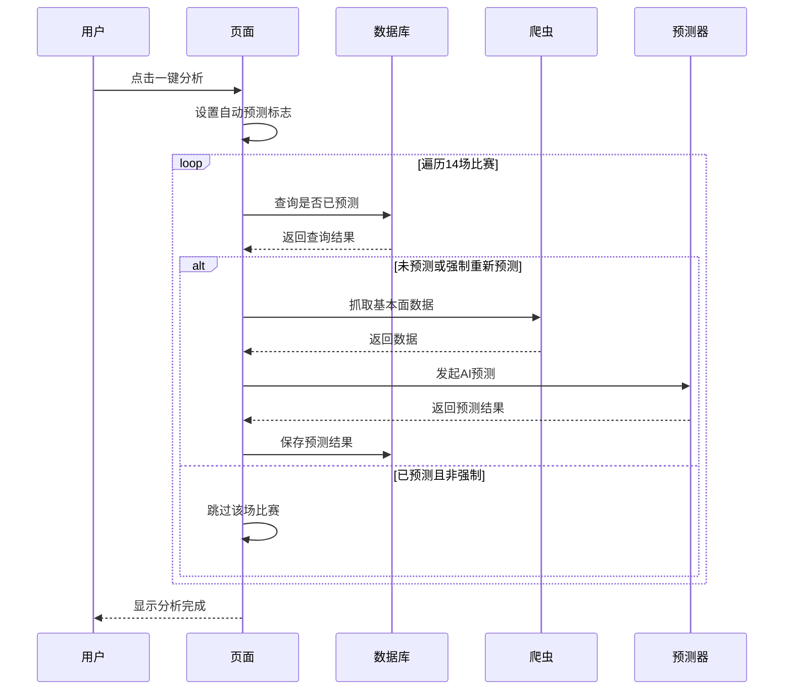
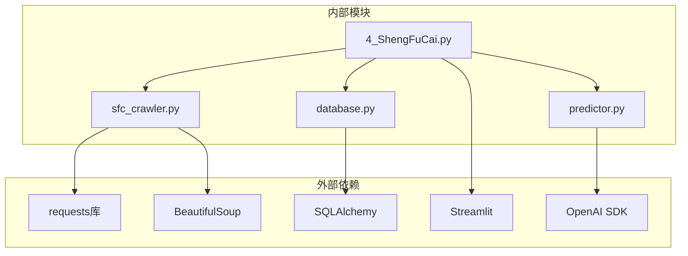

# 胜负彩数据API

<cite>
**本文档引用的文件**
- [database.py](file://src/db/database.py)
- [4_ShengFuCai.py](file://src/pages/4_ShengFuCai.py)
- [sfc_crawler.py](file://src/crawler/sfc_crawler.py)
- [predictor.py](file://src/llm/predictor.py)
- [predictor_back.py](file://src/llm/predictor_back.py)
- [test_sfc_issue.py](file://scripts/test_sfc_issue.py)
- [20240326_add_prediction_period.sql](file://supabase/migrations/20240326_add_prediction_period.sql)
</cite>

## 目录
1. [简介](#简介)
2. [项目结构](#项目结构)
3. [核心组件](#核心组件)
4. [架构概览](#架构概览)
5. [详细组件分析](#详细组件分析)
6. [依赖关系分析](#依赖关系分析)
7. [性能考量](#性能考量)
8. [故障排查指南](#故障排查指南)
9. [结论](#结论)

## 简介
本文档详细说明了胜负彩数据API的设计与实现，重点涵盖SfcPrediction相关的数据库操作方法，包括save_sfc_prediction、get_sfc_prediction等核心接口。文档深入解释了胜负彩数据的存储结构、期号（issue_num）概念和匹配编号（match_num）的使用方式，阐述了胜负彩与普通比赛预测的区别，以及期号管理的重要性。同时提供了胜负彩数据查询和管理的最佳实践，包含具体的代码示例和期号处理技巧。

## 项目结构
该项目采用模块化设计，胜负彩功能主要分布在以下模块：
- 数据库层：负责数据持久化和查询
- 爬虫层：负责从彩票网站抓取胜负彩数据
- 页面层：提供Web界面进行交互
- LLM预测层：负责AI预测分析

**图表来源**
- [4_ShengFuCai.py:1-288](file://src/pages/4_ShengFuCai.py#L1-L288)
- [sfc_crawler.py:1-145](file://src/crawler/sfc_crawler.py#L1-L145)
- [database.py:127-420](file://src/db/database.py#L127-L420)

**章节来源**
- [4_ShengFuCai.py:1-288](file://src/pages/4_ShengFuCai.py#L1-L288)
- [sfc_crawler.py:1-145](file://src/crawler/sfc_crawler.py#L1-L145)
- [database.py:127-420](file://src/db/database.py#L127-L420)

## 核心组件
胜负彩数据API的核心组件包括：

### 数据模型
SfcPrediction类定义了胜负彩数据的完整结构：
- **issue_num**: 期号，用于标识不同的胜负彩期次
- **match_num**: 匹配编号，格式为"胜负彩_X"
- **fixture_id**: 赛事ID，用于关联其他数据源
- **league**: 联赛名称
- **teams**: 主客队名称
- **match_time**: 比赛时间
- **raw_data**: 原始数据JSON
- **prediction_text**: AI预测结果

### 数据库操作接口
- **save_sfc_prediction**: 保存或更新胜负彩预测结果
- **get_sfc_prediction**: 获取指定期号和匹配编号的预测结果

**章节来源**
- [database.py:127-147](file://src/db/database.py#L127-L147)
- [database.py:374-420](file://src/db/database.py#L374-L420)

## 架构概览
胜负彩数据API采用分层架构，各层职责明确：

**图表来源**
- [4_ShengFuCai.py:58-86](file://src/pages/4_ShengFuCai.py#L58-L86)
- [database.py:374-420](file://src/db/database.py#L374-L420)

## 详细组件分析

### 数据模型设计
SfcPrediction模型采用了完整的数据结构设计：

**图表来源**
- [database.py:127-147](file://src/db/database.py#L127-L147)
- [database.py:374-420](file://src/db/database.py#L374-L420)

#### 数据存储结构特点
1. **期号管理**: 通过issue_num字段实现期号隔离，确保不同期次的数据独立存储
2. **匹配编号**: 使用"胜负彩_X"格式的match_num，便于数据检索和关联
3. **时间戳管理**: 自动记录created_at和updated_at，便于数据追踪
4. **JSON存储**: raw_data字段存储原始数据，便于扩展和调试

**章节来源**
- [database.py:127-147](file://src/db/database.py#L127-L147)

### 数据库操作方法详解

#### save_sfc_prediction方法
该方法实现了胜负彩预测结果的保存逻辑：

**图表来源**
- [database.py:374-413](file://src/db/database.py#L374-L413)

#### get_sfc_prediction方法
该方法实现了胜负彩预测结果的查询逻辑：

**图表来源**
- [database.py:415-420](file://src/db/database.py#L415-L420)

**章节来源**
- [database.py:374-420](file://src/db/database.py#L374-L420)

### 爬虫数据获取
胜负彩爬虫负责从彩票网站获取实时数据：

#### 期号获取机制
爬虫支持两种期号获取方式：
1. **指定期号**: 通过URL参数指定具体期号
2. **自动识别**: 从网页中自动提取当前期号

#### 数据解析流程

**图表来源**
- [sfc_crawler.py:37-139](file://src/crawler/sfc_crawler.py#L37-L139)

**章节来源**
- [sfc_crawler.py:14-139](file://src/crawler/sfc_crawler.py#L14-L139)

### 页面交互逻辑
胜负彩页面实现了完整的用户交互流程：

#### 自动预测流程

**图表来源**
- [4_ShengFuCai.py:198-224](file://src/pages/4_ShengFuCai.py#L198-L224)

**章节来源**
- [4_ShengFuCai.py:179-284](file://src/pages/4_ShengFuCai.py#L179-L284)

### LLM预测集成
胜负彩预测集成了LLM预测器，专门针对胜负彩特点进行了优化：

#### 专属提示词设计
预测器在处理胜负彩时会添加专属提示词：
- 明确预测目标：全场胜平负（不让球）
- 特定分析要求：交叉盘剧本判断
- 胜负彩专用逻辑：稳穿正路与诱盘下路识别

**章节来源**
- [predictor_back.py:726-729](file://src/llm/predictor_back.py#L726-L729)

## 依赖关系分析

**图表来源**
- [4_ShengFuCai.py:13-16](file://src/pages/4_ShengFuCai.py#L13-L16)
- [sfc_crawler.py:1-12](file://src/crawler/sfc_crawler.py#L1-L12)
- [database.py:1-8](file://src/db/database.py#L1-L8)

**章节来源**
- [4_ShengFuCai.py:13-16](file://src/pages/4_ShengFuCai.py#L13-L16)
- [sfc_crawler.py:1-12](file://src/crawler/sfc_crawler.py#L1-L12)
- [database.py:1-8](file://src/db/database.py#L1-L8)

## 性能考量
胜负彩数据API在设计时充分考虑了性能优化：

### 缓存策略
- **期号缓存**: 使用@st.cache_data装饰器缓存期号列表，缓存时间为3600秒
- **数据缓存**: 胜负彩数据同样使用缓存机制，避免重复抓取

### 数据库优化
- **索引设计**: 为issue_num和match_num字段建立索引，提高查询效率
- **事务管理**: 使用事务确保数据一致性
- **连接池**: 数据库连接采用连接池管理

### 网络请求优化
- **超时控制**: 所有网络请求设置15秒超时
- **编码处理**: 正确处理gb2312编码
- **错误重试**: 爬虫具有基本的错误处理机制

## 故障排查指南

### 常见问题及解决方案

#### 期号获取失败
**问题症状**: 无法获取期号列表或期号显示为"未知期号"
**解决方法**:
1. 检查网络连接和500彩票网可访问性
2. 查看爬虫日志获取详细错误信息
3. 验证fetch_available_issues方法的实现

#### 数据保存失败
**问题症状**: 预测结果无法保存到数据库
**解决方法**:
1. 检查数据库连接是否正常
2. 验证issue_num和match_num参数是否正确
3. 查看数据库日志获取具体错误信息

#### 预测结果为空
**问题症状**: 页面显示"待预测"状态
**解决方法**:
1. 确认LLM API配置正确
2. 检查预测器是否正常工作
3. 验证数据格式是否符合预期

**章节来源**
- [sfc_crawler.py:137-139](file://src/crawler/sfc_crawler.py#L137-L139)
- [database.py:410-413](file://src/db/database.py#L410-L413)

### 调试技巧
1. **日志分析**: 利用loguru记录详细的执行日志
2. **数据验证**: 在关键节点打印数据结构进行验证
3. **错误捕获**: 使用try-catch块捕获并记录异常信息

## 结论
胜负彩数据API通过清晰的分层架构和完善的数据库设计，实现了胜负彩数据的高效管理和查询。期号（issue_num）和匹配编号（match_num）的设计确保了数据的准确性和可追溯性。与普通比赛预测相比，胜负彩API专注于14场全场比赛的预测，具有独特的数据结构和分析逻辑。

该API的主要优势包括：
- **模块化设计**: 各层职责明确，便于维护和扩展
- **数据完整性**: 完整的SfcPrediction模型确保数据的完整性
- **性能优化**: 缓存机制和数据库优化提升响应速度
- **错误处理**: 完善的错误处理和日志记录机制

未来可以考虑的改进方向：
- 增加更多的数据验证和清理逻辑
- 实现更细粒度的权限控制
- 添加数据备份和恢复机制
- 优化LLM预测的性能和准确性