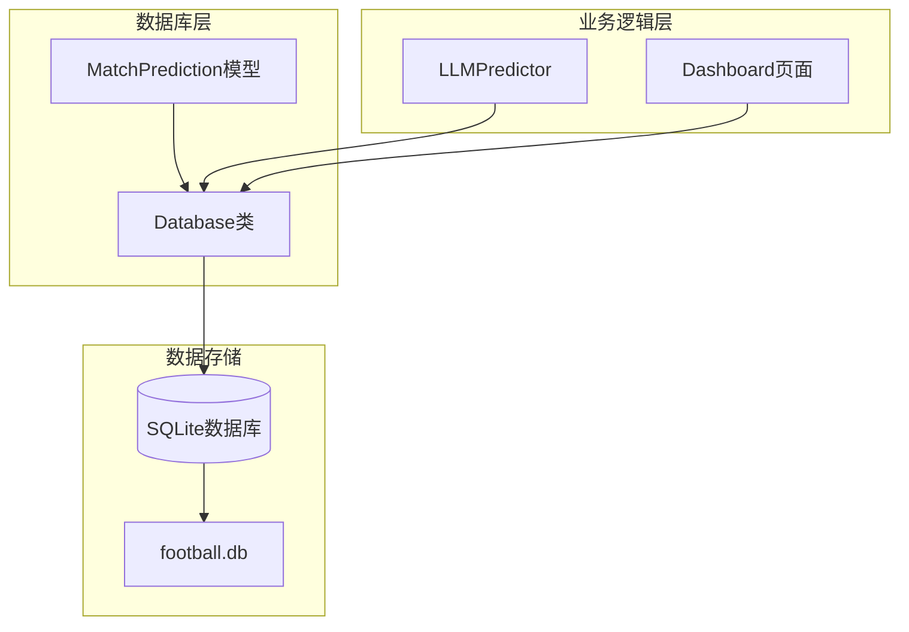
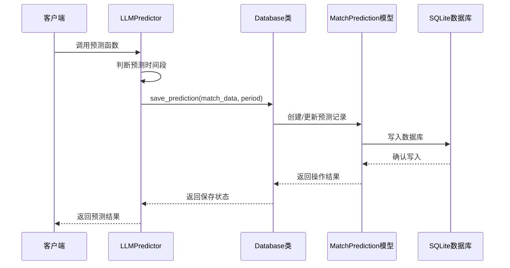
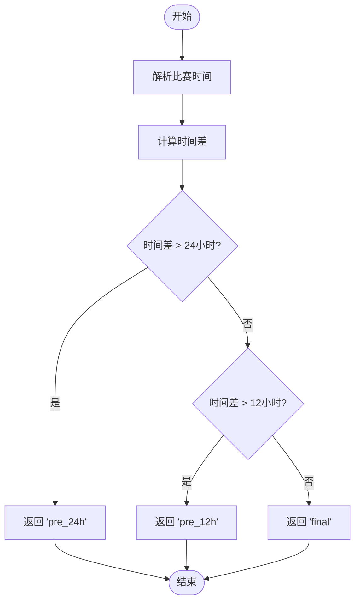

# 预测数据API

<cite>
**本文档引用的文件**
- [database.py](file://src/db/database.py)
- [predictor.py](file://src/llm/predictor.py)
- [predictor_back.py](file://src/llm/predictor_back.py)
- [1_Dashboard.py](file://src/pages/1_Dashboard.py)
- [test_time_period.py](file://scripts/test_time_period.py)
- [test_multitime_predictions.py](file://scripts/test_multitime_predictions.py)
- [20240326_add_prediction_period.sql](file://supabase/migrations/20240326_add_prediction_period.sql)
- [test_database_prediction_extract.py](file://tests/test_database_prediction_extract.py)
</cite>

## 目录
1. [简介](#简介)
2. [项目结构](#项目结构)
3. [核心组件](#核心组件)
4. [架构概览](#架构概览)
5. [详细组件分析](#详细组件分析)
6. [依赖关系分析](#依赖关系分析)
7. [性能考虑](#性能考虑)
8. [故障排除指南](#故障排除指南)
9. [结论](#结论)

## 简介

本文档详细说明了足球预测系统中的预测数据API，重点介绍MatchPrediction相关的数据库操作方法。该系统支持多时间段预测数据管理，包括赛前24小时、赛前12小时和最终预测，并提供了完整的预测数据存储、查询和更新功能。

## 项目结构

预测数据API位于src/db/database.py文件中，主要包含以下核心组件：



**图表来源**
- [database.py:68-102](file://src/db/database.py#L68-L102)
- [database.py:200-308](file://src/db/database.py#L200-L308)

**章节来源**
- [database.py:1-567](file://src/db/database.py#L1-L567)

## 核心组件

### MatchPrediction模型

MatchPrediction是预测数据的核心模型，定义了完整的预测数据结构：

| 字段名 | 类型 | 描述 | 约束 |
|--------|------|------|------|
| id | Integer | 主键，自增 | primary_key |
| fixture_id | String(50) | 比赛唯一标识，支持多时间段 | index=True |
| match_num | String(50) | 比赛编号 | nullable=True |
| league | String(100) | 联赛名称 | nullable=True |
| home_team | String(100) | 主队名称 | nullable=True |
| away_team | String(100) | 客队名称 | nullable=True |
| match_time | DateTime | 比赛时间 | nullable=True |
| prediction_period | String(20) | 预测时间段 | default='pre_24h' |
| raw_data | JSON | 原始数据JSON | nullable=True |
| prediction_text | Text | AI预测结果文本 | nullable=True |
| htft_prediction_text | Text | 半全场专项预测 | nullable=True |
| predicted_result | String(100) | 竞彩推荐结果 | nullable=True |
| confidence | Integer | 置信度(1-5星) | nullable=True |
| actual_result | String(50) | 实际赛果 | nullable=True |
| actual_score | String(50) | 实际比分 | nullable=True |
| actual_bqc | String(20) | 半全场赛果 | nullable=True |
| is_correct | Boolean | 预测正确性 | nullable=True |
| created_at | DateTime | 创建时间 | default=datetime.now |
| updated_at | DateTime | 更新时间 | default=datetime.now |

### 预测时间段概念

系统支持四种预测时间段：

1. **pre_24h**: 赛前24小时预测
2. **pre_12h**: 赛前12小时预测  
3. **final**: 赛前最终预测
4. **repredicted**: 历史重新预测

**章节来源**
- [database.py:68-102](file://src/db/database.py#L68-L102)
- [predictor_back.py:755-780](file://src/llm/predictor_back.py#L755-L780)

## 架构概览

预测数据API采用分层架构设计，实现了清晰的职责分离：



**图表来源**
- [database.py:256-304](file://src/db/database.py#L256-L304)
- [predictor_back.py:755-780](file://src/llm/predictor_back.py#L755-L780)

## 详细组件分析

### save_prediction 方法

#### 方法签名
```python
def save_prediction(self, match_data, period='pre_24h'):
```

#### 参数说明
- **match_data**: dict类型，包含比赛数据的完整字典
  - fixture_id: 比赛唯一标识符
  - match_num: 比赛编号
  - league: 联赛名称
  - home_team: 主队名称
  - away_team: 客队名称
  - match_time: 比赛时间
  - llm_prediction: AI预测文本
  - htft_prediction: 半全场预测文本
  - 其他相关统计数据
- **period**: 字符串类型，默认为'pre_24h'
  - 支持值: 'pre_24h', 'pre_12h', 'final', 'repredicted'

#### 返回值
- **True**: 保存成功
- **False**: 保存失败

#### 异常处理
- 数据库连接异常
- SQL执行异常
- 数据格式转换异常

#### 使用示例
```python
# 基本使用
match_data = {
    "fixture_id": "12345",
    "match_num": "英超_001",
    "league": "英超",
    "home_team": "曼城",
    "away_team": "利物浦",
    "match_time": "2026-03-27 20:00:00",
    "llm_prediction": "AI预测文本内容",
    "htft_prediction": "半全场预测内容"
}

db = Database()
success = db.save_prediction(match_data, "pre_24h")
```

**章节来源**
- [database.py:256-304](file://src/db/database.py#L256-L304)

### get_prediction 方法

#### 方法签名
```python
def get_prediction(self, match_num):
```

#### 参数说明
- **match_num**: 字符串类型，比赛编号
- 支持模糊匹配，使用SQL LIKE操作符

#### 返回值
- **MatchPrediction对象**: 最新的预测记录
- **None**: 未找到匹配记录

#### 查询逻辑
按创建时间降序排列，返回第一条匹配记录

#### 使用示例
```python
db = Database()
latest_prediction = db.get_prediction("英超_001")
if latest_prediction:
    print(f"预测结果: {latest_prediction.prediction_text}")
```

**章节来源**
- [database.py:312-316](file://src/db/database.py#L312-L316)

### get_prediction_by_period 方法

#### 方法签名
```python
def get_prediction_by_period(self, fixture_id, period):
```

#### 参数说明
- **fixture_id**: 字符串类型，比赛唯一标识符
- **period**: 字符串类型，预测时间段
  - 支持: 'pre_24h', 'pre_12h', 'final', 'repredicted'

#### 返回值
- **MatchPrediction对象**: 指定时间段的预测记录
- **None**: 未找到匹配记录

#### 使用示例
```python
db = Database()
pre_24h_prediction = db.get_prediction_by_period("12345", "pre_24h")
```

**章节来源**
- [database.py:318-323](file://src/db/database.py#L318-L323)

### get_all_predictions_by_fixture 方法

#### 方法签名
```python
def get_all_predictions_by_fixture(self, fixture_id):
```

#### 参数说明
- **fixture_id**: 字符串类型，比赛唯一标识符

#### 返回值
- **List[MatchPrediction]**: 指定比赛的所有时间段预测记录
- **List**: 空列表（无匹配记录）

#### 排序规则
按创建时间降序排列

#### 使用示例
```python
db = Database()
all_predictions = db.get_all_predictions_by_fixture("12345")
for period, prediction in all_predictions.items():
    print(f"{period}: {prediction.prediction_text[:50]}...")
```

**章节来源**
- [database.py:325-329](file://src/db/database.py#L325-L329)

### update_actual_result 方法

#### 方法签名
```python
def update_actual_result(self, fixture_id, score, bqc_result=None):
```

#### 参数说明
- **fixture_id**: 字符串类型，比赛唯一标识符
- **score**: 字符串类型，实际比分
- **bqc_result**: 字符串类型，半全场结果，可选

#### 返回值
- **True**: 更新成功
- **False**: 更新失败

#### 处理逻辑
- 查找指定fixture_id的所有预测记录
- 解析比分得到实际赛果
- 更新每条记录的实际比分、实际赛果和半全场结果
- 支持批量更新

#### 使用示例
```python
db = Database()
success = db.update_actual_result("12345", "2-1", "胜胜")
```

**章节来源**
- [database.py:480-496](file://src/db/database.py#L480-L496)

### 辅助方法

#### extract_prediction_recommendation 方法
从预测文本中提取竞彩推荐结果：

```python
@staticmethod
def extract_prediction_recommendation(prediction_text):
```

支持的模式：
- "竞彩推荐：胜(100%)"
- "不让球推荐：平(50%)/负(50%)"

#### get_predictions_by_date 方法
按日期范围查询预测数据：

```python
def get_predictions_by_date(self, target_date):
```

查询逻辑：
- 日期窗口：目标日12:00 ~ 次日12:00
- 相同fixture_id按时间段优先级选择：repredicted > final > pre_12h > pre_24h

**章节来源**
- [database.py:234-254](file://src/db/database.py#L234-L254)
- [database.py:451-478](file://src/db/database.py#L451-L478)

## 依赖关系分析

### 时间段判断逻辑

预测时间段的判断基于比赛时间与当前时间的差值：



**图表来源**
- [predictor_back.py:755-780](file://src/llm/predictor_back.py#L755-L780)

### 数据库迁移

系统通过SQL迁移脚本支持prediction_period字段：

```sql
-- 添加prediction_period列到match_predictions表
ALTER TABLE match_predictions ADD COLUMN prediction_period VARCHAR(20) DEFAULT 'pre_24h';

-- 创建索引
CREATE INDEX idx_fixture_id ON match_predictions(fixture_id);
CREATE INDEX idx_prediction_period ON match_predictions(prediction_period);
CREATE INDEX idx_fixture_period ON match_predictions(fixture_id, prediction_period);
```

**图表来源**
- [20240326_add_prediction_period.sql:1-51](file://supabase/migrations/20240326_add_prediction_period.sql#L1-L51)

**章节来源**
- [predictor_back.py:755-780](file://src/llm/predictor_back.py#L755-L780)
- [20240326_add_prediction_period.sql:1-51](file://supabase/migrations/20240326_add_prediction_period.sql#L1-L51)

## 性能考虑

### 数据库优化

1. **索引策略**
   - fixture_id: 支持快速按比赛查询
   - prediction_period: 支持按时间段过滤
   - fixture_id + prediction_period: 支持复合查询

2. **查询优化**
   - 使用LIMIT限制结果集大小
   - 合理使用ORDER BY和WHERE条件
   - 避免SELECT *，只查询必要字段

3. **缓存策略**
   - 页面级别缓存最近查询结果
   - 预测结果缓存机制

### 时间复杂度分析

- **save_prediction**: O(1) - 单条记录插入/更新
- **get_prediction**: O(n) - 需要排序查找最新记录
- **get_prediction_by_period**: O(1) - 基于索引的精确查询
- **get_all_predictions_by_fixture**: O(m) - m为同一比赛的预测记录数
- **update_actual_result**: O(m) - 批量更新所有时间段记录

### 最佳实践建议

1. **查询优化**
   ```python
   # 推荐：使用精确查询
   db.get_prediction_by_period(fixture_id, period)
   
   # 不推荐：使用模糊查询
   db.get_prediction(match_num)  # 可能返回多条记录
   ```

2. **批量操作**
   ```python
   # 使用事务批量更新
   with db.session.begin():
       for record in records:
           db.update_actual_result(record.fixture_id, score)
   ```

3. **数据清理**
   ```python
   # 定期清理历史数据
   old_records = db.session.query(MatchPrediction).filter(
       MatchPrediction.match_time < cutoff_date
   ).delete(synchronize_session=False)
   ```

## 故障排除指南

### 常见问题及解决方案

#### 1. 数据库连接失败
**症状**: 数据库初始化失败
**解决方案**:
- 检查数据库文件路径
- 确认SQLite驱动安装
- 验证文件权限

#### 2. 预测数据格式错误
**症状**: extract_prediction_recommendation返回None
**解决方案**:
- 检查预测文本格式
- 验证正则表达式匹配
- 使用测试用例验证

#### 3. 时间段判断错误
**症状**: 预测时间段不符合预期
**解决方案**:
- 检查比赛时间格式
- 验证当前时间获取
- 使用调试脚本测试

#### 4. 数据库迁移问题
**症状**: prediction_period字段缺失
**解决方案**:
- 执行SQL迁移脚本
- 检查数据库版本
- 验证索引创建

**章节来源**
- [test_database_prediction_extract.py:1-24](file://tests/test_database_prediction_extract.py#L1-L24)
- [test_time_period.py:1-51](file://scripts/test_time_period.py#L1-L51)

### 调试工具

#### 预测推荐提取测试
```python
# 测试用例验证
def test_extract_prediction_recommendation():
    text = "竞彩推荐：胜(100%)"
    result = Database.extract_prediction_recommendation(text)
    assert result == "胜(100%)"
```

#### 时间段测试
```python
# 测试时间段判断逻辑
def test_time_period():
    current_time = datetime.now()
    match_time = current_time + timedelta(hours=25)
    period = predictor._determine_prediction_period({
        "match_time": match_time.strftime("%Y-%m-%d %H:%M")
    })
    assert period == "pre_24h"
```

**章节来源**
- [test_database_prediction_extract.py:1-24](file://tests/test_database_prediction_extract.py#L1-L24)
- [test_time_period.py:1-51](file://scripts/test_time_period.py#L1-L51)

## 结论

预测数据API提供了完整的多时间段预测数据管理功能，具有以下特点：

1. **灵活的时间段支持**: 支持pre_24h、pre_12h、final和repredicted四种时间段
2. **完整的数据结构**: 包含原始数据、预测结果、实际赛果等完整字段
3. **高效的查询接口**: 提供多种查询方式满足不同使用场景
4. **健壮的异常处理**: 包含完善的错误处理和恢复机制
5. **良好的扩展性**: 支持历史重新预测和未来时间段扩展

该API为足球预测系统的数据管理提供了坚实的基础，支持从训练到生产的完整预测生命周期管理。