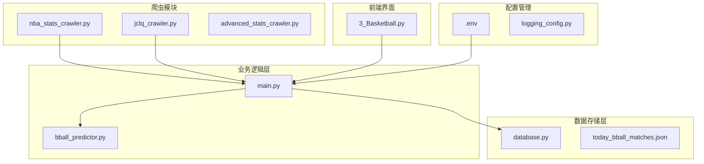
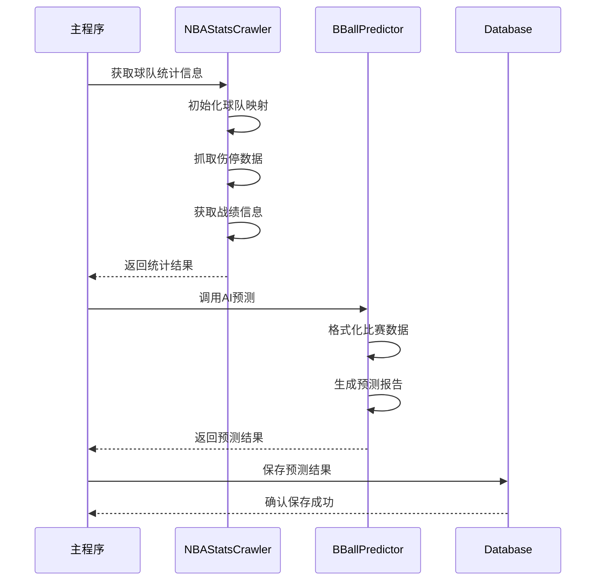
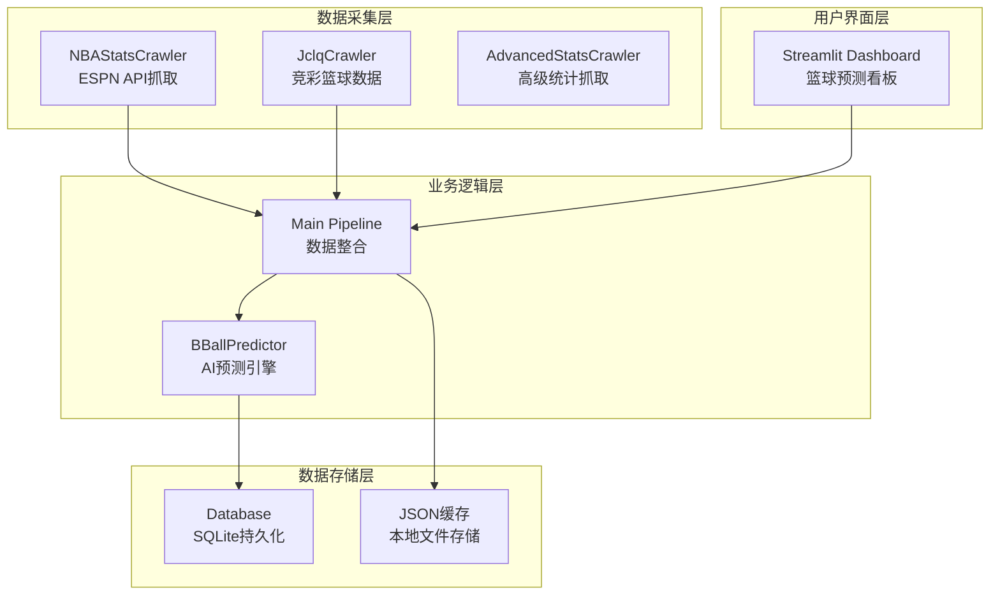
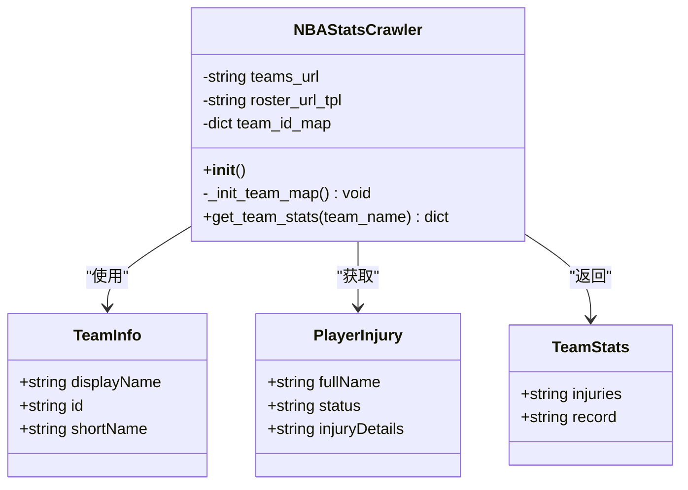
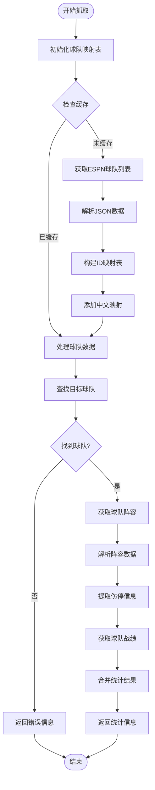
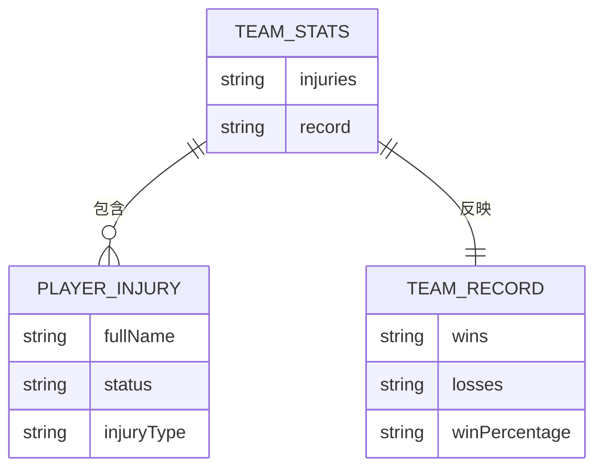
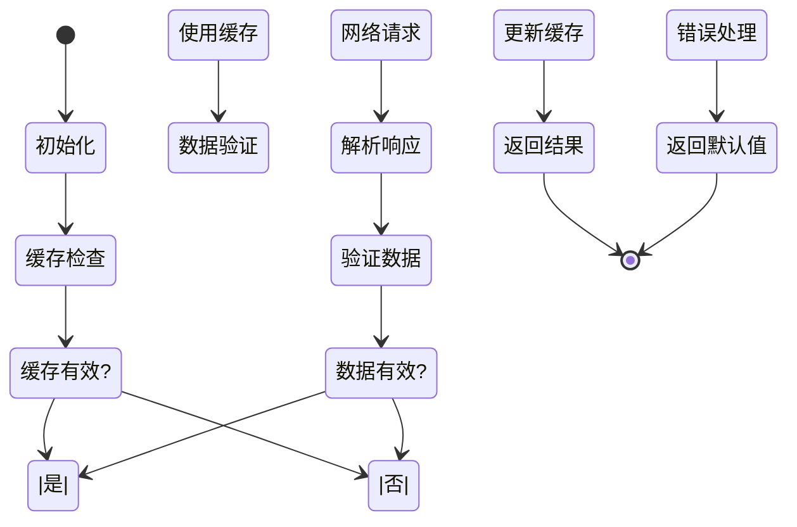
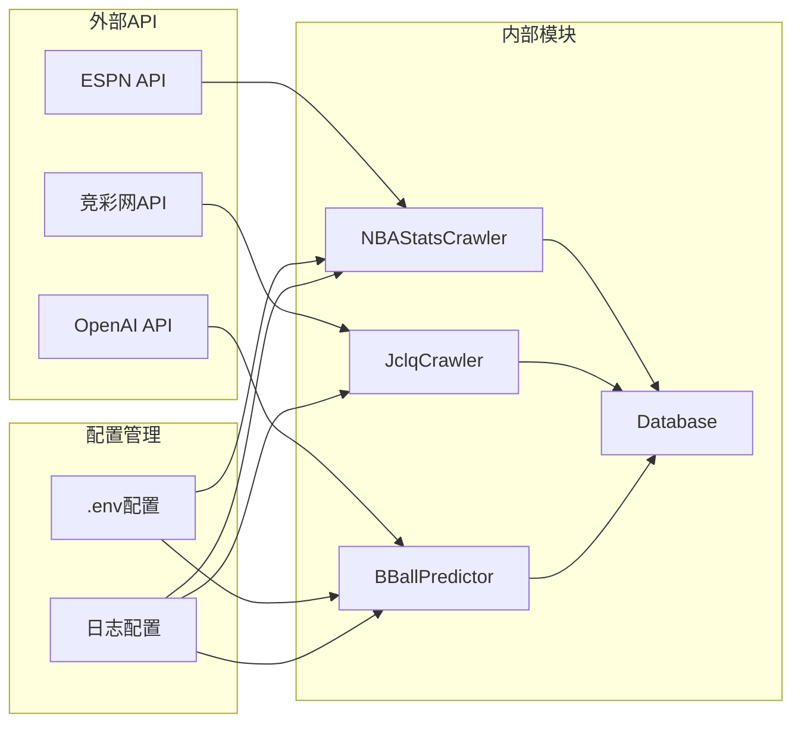
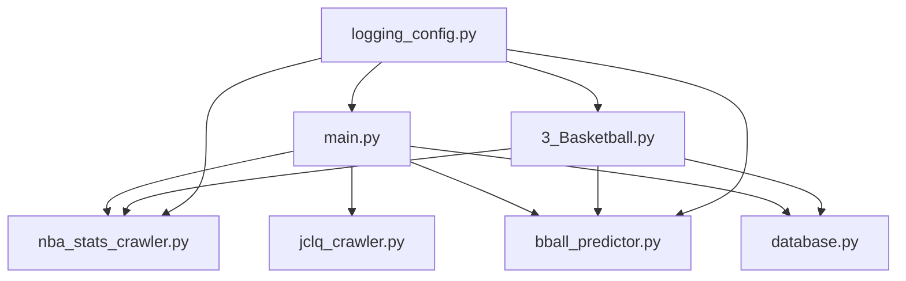

# NBA统计数据爬虫API

<cite>
**本文档引用的文件**
- [nba_stats_crawler.py](file://src/crawler/nba_stats_crawler.py)
- [main.py](file://src/main.py)
- [3_Basketball.py](file://src/pages/3_Basketball.py)
- [jclq_crawler.py](file://src/crawler/jclq_crawler.py)
- [bball_predictor.py](file://src/llm/bball_predictor.py)
- [.env](file://config/.env)
- [database.py](file://src/db/database.py)
- [logging_config.py](file://src/logging_config.py)
- [today_bball_matches.json](file://data/today_bball_matches.json)
</cite>

## 目录
1. [简介](#简介)
2. [项目结构](#项目结构)
3. [核心组件](#核心组件)
4. [架构概览](#架构概览)
5. [详细组件分析](#详细组件分析)
6. [依赖关系分析](#依赖关系分析)
7. [性能考虑](#性能考虑)
8. [故障排除指南](#故障排除指南)
9. [结论](#结论)
10. [附录](#附录)

## 简介

NBA统计数据爬虫API是一个专门用于获取NBA比赛数据、球员统计分析和球队表现评估的自动化系统。该系统集成了ESPN官网数据抓取、实时比分更新、数据同步机制和实时性保证，为篮球预测分析提供全面的数据支持。

该系统的主要功能包括：
- NBA比赛数据抓取和解析
- 球员伤停情况实时监控
- 球队战绩和表现评估
- 实时比分更新和数据同步
- 高级统计指标计算
- 数据质量控制和错误处理

## 项目结构

该项目采用模块化设计，主要包含以下核心模块：

**图表来源**
- [nba_stats_crawler.py:1-133](file://src/crawler/nba_stats_crawler.py#L1-L133)
- [main.py:1-183](file://src/main.py#L1-L183)
- [3_Basketball.py:1-451](file://src/pages/3_Basketball.py#L1-L451)

**章节来源**
- [nba_stats_crawler.py:1-133](file://src/crawler/nba_stats_crawler.py#L1-L133)
- [main.py:1-183](file://src/main.py#L1-L183)
- [3_Basketball.py:1-451](file://src/pages/3_Basketball.py#L1-L451)

## 核心组件

### NBAStatsCrawler类

NBAStatsCrawler是系统的核心爬虫组件，负责与ESPN官网API进行交互，获取NBA球队和球员的实时数据。

**主要特性：**
- 自动初始化球队ID映射表
- 支持中英文球队名称识别
- 实时伤停情况监控
- 球队战绩数据获取

**关键方法：**
- `_init_team_map()`: 初始化ESPN球队ID映射
- `get_team_stats(team_name)`: 获取指定球队的统计信息

**章节来源**
- [nba_stats_crawler.py:6-133](file://src/crawler/nba_stats_crawler.py#L6-L133)

### 数据处理流程

系统采用流水线式的数据处理架构，从数据抓取到最终预测的完整流程如下：

**图表来源**
- [main.py:144-176](file://src/main.py#L144-L176)
- [bball_predictor.py:166-198](file://src/llm/bball_predictor.py#L166-L198)

**章节来源**
- [main.py:144-176](file://src/main.py#L144-L176)
- [bball_predictor.py:166-198](file://src/llm/bball_predictor.py#L166-L198)

## 架构概览

系统采用分层架构设计，确保各组件职责清晰、耦合度低：

**图表来源**
- [nba_stats_crawler.py:6-133](file://src/crawler/nba_stats_crawler.py#L6-L133)
- [main.py:34-176](file://src/main.py#L34-L176)
- [database.py:200-567](file://src/db/database.py#L200-L567)

**章节来源**
- [main.py:34-176](file://src/main.py#L34-L176)
- [database.py:200-567](file://src/db/database.py#L200-L567)

## 详细组件分析

### NBAStatsCrawler组件分析

#### 类结构图

**图表来源**
- [nba_stats_crawler.py:6-133](file://src/crawler/nba_stats_crawler.py#L6-L133)

#### 数据抓取流程

系统通过以下步骤获取和处理NBA数据：

**图表来源**
- [nba_stats_crawler.py:12-125](file://src/crawler/nba_stats_crawler.py#L12-L125)

**章节来源**
- [nba_stats_crawler.py:12-125](file://src/crawler/nba_stats_crawler.py#L12-L125)

### 数据格式和结构

#### 篮球比赛数据结构

系统使用的标准化比赛数据格式如下：

| 字段名 | 类型 | 描述 | 示例 |
|--------|------|------|------|
| fixture_id | string | 比赛唯一标识 | "2038984" |
| match_num | string | 比赛编号 | "周五301" |
| league | string | 联赛名称 | "欧篮联" |
| home_team | string | 主队名称 | "摩纳哥" |
| away_team | string | 客队名称 | "巴萨" |
| match_time | string | 比赛时间 | "2026-04-11 01:30" |
| odds | dict | 赔率数据 | {sf: [...], rfsf: [...], dxf: [...]} |
| llm_prediction | string | AI预测结果 | "预测报告内容" |

#### 球队统计信息结构

**图表来源**
- [nba_stats_crawler.py:84-125](file://src/crawler/nba_stats_crawler.py#L84-L125)

**章节来源**
- [nba_stats_crawler.py:84-125](file://src/crawler/nba_stats_crawler.py#L84-L125)

### 实时更新策略

#### 数据同步机制

系统采用多层缓存和定时刷新机制确保数据的实时性和准确性：

**图表来源**
- [main.py:144-176](file://src/main.py#L144-L176)
- [3_Basketball.py:226-247](file://src/pages/3_Basketball.py#L226-L247)

**章节来源**
- [main.py:144-176](file://src/main.py#L144-L176)
- [3_Basketball.py:226-247](file://src/pages/3_Basketball.py#L226-L247)

## 依赖关系分析

### 外部依赖

系统依赖以下外部服务和API：

**图表来源**
- [.env:1-20](file://config/.env#L1-L20)
- [nba_stats_crawler.py:1-10](file://src/crawler/nba_stats_crawler.py#L1-L10)

**章节来源**
- [.env:1-20](file://config/.env#L1-L20)
- [nba_stats_crawler.py:1-10](file://src/crawler/nba_stats_crawler.py#L1-L10)

### 内部模块依赖

系统内部模块之间的依赖关系如下：

**图表来源**
- [main.py:25-31](file://src/main.py#L25-L31)
- [3_Basketball.py:12-15](file://src/pages/3_Basketball.py#L12-L15)

**章节来源**
- [main.py:25-31](file://src/main.py#L25-L31)
- [3_Basketball.py:12-15](file://src/pages/3_Basketball.py#L12-L15)

## 性能考虑

### 网络请求优化

系统采用以下策略优化网络请求性能：

1. **超时控制**: 所有HTTP请求设置10-15秒超时时间
2. **重试机制**: 关键API请求具备自动重试功能
3. **并发处理**: 合理控制并发请求数量，避免API限流
4. **缓存策略**: 采用多级缓存减少重复请求

### 数据处理优化

1. **增量更新**: 仅更新发生变化的数据
2. **批量写入**: 数据库操作采用批量提交
3. **内存管理**: 及时释放不再使用的数据对象
4. **压缩存储**: JSON数据采用压缩格式存储

## 故障排除指南

### 常见问题及解决方案

#### API访问失败

**问题症状**: 系统无法连接到ESPN API或其他外部服务

**解决方案**:
1. 检查网络连接状态
2. 验证API密钥配置
3. 查看防火墙设置
4. 检查API服务可用性

#### 数据解析错误

**问题症状**: 球队名称匹配失败或数据格式异常

**解决方案**:
1. 更新球队名称映射表
2. 检查数据格式变更
3. 验证编码格式
4. 清理缓存数据

#### 预测结果异常

**问题症状**: AI预测结果质量下降或出现错误

**解决方案**:
1. 检查LLM API配置
2. 验证输入数据格式
3. 更新模型参数
4. 查看日志错误信息

**章节来源**
- [logging_config.py:8-30](file://src/logging_config.py#L8-L30)
- [nba_stats_crawler.py:68-70](file://src/crawler/nba_stats_crawler.py#L68-L70)

## 结论

NBA统计数据爬虫API系统通过模块化设计和分层架构，实现了高效、可靠的NBA数据抓取和分析功能。系统的主要优势包括：

1. **完整的数据覆盖**: 涵盖球队、球员、比赛等全方位数据
2. **实时性保障**: 多层缓存和定时刷新机制确保数据新鲜度
3. **高可用性**: 完善的错误处理和故障恢复机制
4. **可扩展性**: 模块化设计便于功能扩展和维护
5. **用户友好**: 提供直观的Web界面和丰富的分析工具

该系统为篮球预测分析提供了坚实的数据基础，通过AI算法和专业分析模型，为用户提供高质量的预测结果和决策支持。

## 附录

### 配置参数说明

| 参数名 | 类型 | 默认值 | 描述 |
|--------|------|--------|------|
| FOOTBALL_API_KEY | string | "your_api_key_here" | API-Sports API密钥 |
| LLM_API_KEY | string | - | 大语言模型API密钥 |
| LLM_API_BASE | string | "https://api.deepseek.com" | LLM API基础地址 |
| LLM_MODEL | string | "deepseek-v4-pro" | 使用的模型名称 |
| DATABASE_URL | string | "sqlite:///data/football.db" | 数据库连接字符串 |

### 数据质量控制

系统采用多层次的数据质量控制机制：

1. **格式验证**: 所有数据导入时进行格式验证
2. **完整性检查**: 确保关键字段不为空
3. **一致性校验**: 检查数据间的一致性关系
4. **异常检测**: 自动识别异常数据并标记
5. **审计跟踪**: 记录所有数据变更历史