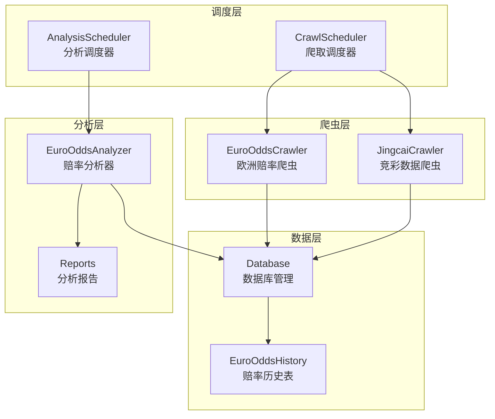
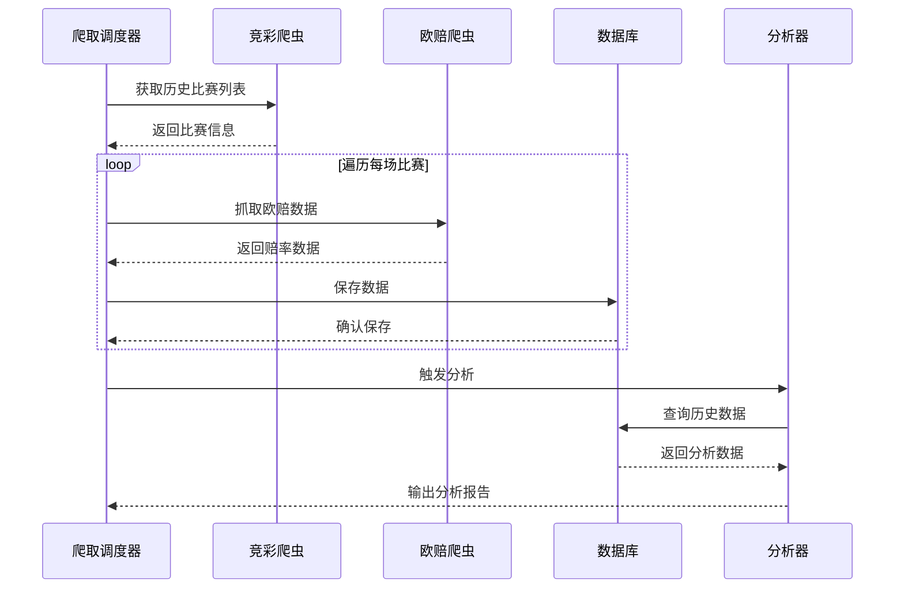
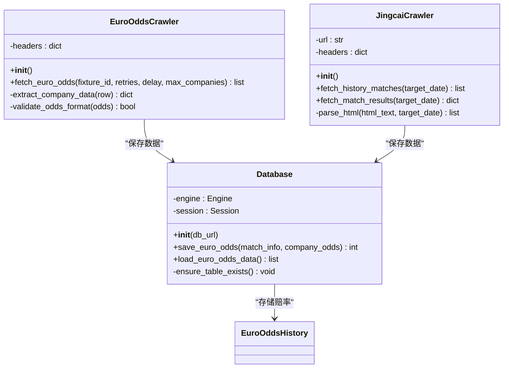
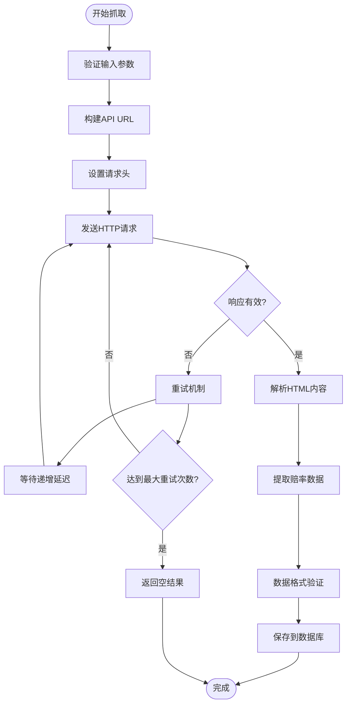
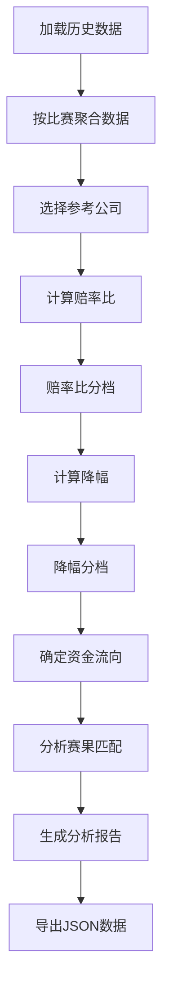
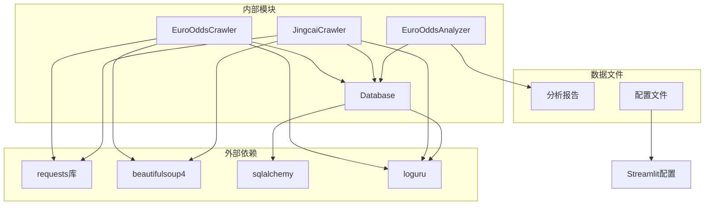

# 欧洲赔率历史爬虫API

<cite>
**本文引用的文件**
- [euro_odds_crawler.py](file://src/crawler/euro_odds_crawler.py)
- [crawl_euro_odds_history.py](file://scripts/crawl_euro_odds_history.py)
- [analyze_euro_odds_patterns.py](file://scripts/analyze_euro_odds_patterns.py)
- [database.py](file://src/db/database.py)
- [jingcai_crawler.py](file://src/crawler/jingcai_crawler.py)
- [euro_odds_pattern_analysis.json](file://data/reports/euro_odds_pattern_analysis.json)
- [2026-05-01-euro-odds-history-analysis.md](file://docs/plans/2026-05-01-euro-odds-history-analysis.md)
- [config.toml](file://.streamlit/config.toml)
</cite>

## 目录
1. [简介](#简介)
2. [项目结构](#项目结构)
3. [核心组件](#核心组件)
4. [架构概览](#架构概览)
5. [详细组件分析](#详细组件分析)
6. [依赖关系分析](#依赖关系分析)
7. [性能考虑](#性能考虑)
8. [故障排除指南](#故障排除指南)
9. [结论](#结论)
10. [附录](#附录)

## 简介

欧洲赔率历史爬虫API是一个专门用于收集、分析和挖掘足球比赛赔率历史数据的完整解决方案。该系统通过自动化爬取500.com网站的欧洲赔率数据，结合深度趋势分析算法，为用户提供专业的市场行为研究和数据挖掘服务。

该API的核心功能包括：
- 历史赔率数据抓取与存储
- 赔率趋势分析与模式识别
- 市场行为研究与风险评估
- 数据归档管理与长期存储
- 自动化分析报告生成

## 项目结构

该项目采用模块化的架构设计，主要分为以下几个核心模块：



**图表来源**
- [euro_odds_crawler.py:1-118](file://src/crawler/euro_odds_crawler.py#L1-L118)
- [database.py:176-539](file://src/db/database.py#L176-L539)
- [analyze_euro_odds_patterns.py:20-331](file://scripts/analyze_euro_odds_patterns.py#L20-L331)

**章节来源**
- [euro_odds_crawler.py:1-118](file://src/crawler/euro_odds_crawler.py#L1-L118)
- [database.py:176-539](file://src/db/database.py#L176-L539)
- [analyze_euro_odds_patterns.py:1-348](file://scripts/analyze_euro_odds_patterns.py#L1-L348)

## 核心组件

### 欧洲赔率爬虫 (EuroOddsCrawler)

欧洲赔率爬虫是整个系统的核心组件，负责从500.com网站抓取欧洲赔率数据。该组件具有以下特点：

- **多公司数据抓取**：支持从多家博彩公司获取初赔和临赔数据
- **智能重试机制**：内置3次重试和递增延迟机制，应对网站限流
- **数据验证**：严格的格式验证和数据清洗
- **速率控制**：防止触发网站反爬虫机制

### 数据库管理系统

数据库系统采用SQLAlchemy ORM框架，提供了完整的数据持久化能力：

- **EuroOddsHistory模型**：专门存储赔率历史数据
- **批量操作支持**：高效的批量数据插入和查询
- **数据完整性保证**：通过外键约束和数据类型验证
- **索引优化**：为常用查询字段建立索引

### 赔率分析器 (EuroOddsAnalyzer)

赔率分析器实现了复杂的统计分析算法，能够自动识别市场模式：

- **三维交叉分析**：赔率比、降幅、资金方向的综合分析
- **模式识别**：自动识别"诱盘陷阱"、"共识过载"等市场现象
- **阈值优化**：基于历史数据自动计算最优判断阈值
- **报告生成**：自动生成详细的分析报告和可视化数据

**章节来源**
- [euro_odds_crawler.py:8-118](file://src/crawler/euro_odds_crawler.py#L8-L118)
- [database.py:176-539](file://src/db/database.py#L176-L539)
- [analyze_euro_odds_patterns.py:20-331](file://scripts/analyze_euro_odds_patterns.py#L20-L331)

## 架构概览

系统采用分层架构设计，确保各组件之间的松耦合和高内聚：



**图表来源**
- [crawl_euro_odds_history.py:43-112](file://scripts/crawl_euro_odds_history.py#L43-L112)
- [analyze_euro_odds_patterns.py:196-331](file://scripts/analyze_euro_odds_patterns.py#L196-L331)

## 详细组件分析

### 欧洲赔率爬虫实现

欧洲赔率爬虫类提供了完整的数据抓取功能：



**图表来源**
- [euro_odds_crawler.py:8-118](file://src/crawler/euro_odds_crawler.py#L8-L118)
- [jingcai_crawler.py:6-330](file://src/crawler/jingcai_crawler.py#L6-L330)
- [database.py:200-539](file://src/db/database.py#L200-L539)

#### 数据抓取流程

欧洲赔率爬虫的抓取流程如下：



**图表来源**
- [euro_odds_crawler.py:17-111](file://src/crawler/euro_odds_crawler.py#L17-L111)

#### 数据存储结构

欧洲赔率历史数据采用标准化的存储结构：

| 字段名 | 数据类型 | 描述 | 索引 |
|--------|----------|------|------|
| id | Integer | 主键 | 是 |
| fixture_id | String(50) | 比赛唯一标识 | 是 |
| match_num | String(50) | 比赛编号 | 否 |
| league | String(100) | 联赛名称 | 否 |
| home_team | String(100) | 主队名称 | 否 |
| away_team | String(100) | 客队名称 | 否 |
| match_time | DateTime | 比赛时间 | 否 |
| company | String(100) | 博彩公司 | 否 |
| init_home | String(20) | 初赔主胜 | 否 |
| init_draw | String(20) | 初赔平局 | 否 |
| init_away | String(20) | 初赔客胜 | 否 |
| live_home | String(20) | 临赔主胜 | 否 |
| live_draw | String(20) | 临赔平局 | 否 |
| live_away | String(20) | 临赔客胜 | 否 |
| actual_score | String(50) | 实际比分 | 否 |
| actual_result | String(20) | 实际结果 | 否 |
| data_source | String(50) | 数据来源 | 否 |
| created_at | DateTime | 创建时间 | 否 |

**章节来源**
- [database.py:176-198](file://src/db/database.py#L176-L198)
- [euro_odds_crawler.py:17-111](file://src/crawler/euro_odds_crawler.py#L17-L111)

### 赔率趋势分析算法

赔率分析器实现了多层次的分析算法：



**图表来源**
- [analyze_euro_odds_patterns.py:49-331](file://scripts/analyze_euro_odds_patterns.py#L49-L331)

#### 分析维度定义

系统定义了三个核心分析维度：

**1. 赔率比分档 (Ratio Bins)**

| 分档范围 | 标签 | 描述 |
|----------|------|------|
| 1.00-1.15 | 非常接近 | 初赔差距很小 |
| 1.15-1.25 | 一方稍优 | 初赔差距较小 |
| 1.25-1.40 | 明显优势 | 初赔差距适中 |
| 1.40-2.00 | 实力碾压 | 初赔差距较大 |
| >2.00 | 绝对碾压 | 初赔差距很大 |

**2. 降幅分档 (Drop Bins)**

| 分档范围 | 标签 | 描述 |
|----------|------|------|
| 0.00-0.05 | 微降<5% | 降幅很小 |
| 0.05-0.10 | 小降5-10% | 降幅较小 |
| 0.10-0.20 | 中降10-20% | 降幅适中 |
| >0.20 | 骤降>20% | 降幅很大 |

**3. 资金方向分类**

| 类型 | 标签 | 描述 |
|------|------|------|
| consensus | 共识同向 | 资金流向强队 |
| contrarian | 反向背离 | 资金流向弱队 |

**章节来源**
- [analyze_euro_odds_patterns.py:23-44](file://scripts/analyze_euro_odds_patterns.py#L23-L44)
- [analyze_euro_odds_patterns.py:102-194](file://scripts/analyze_euro_odds_patterns.py#L102-L194)

### 数据挖掘方法

系统采用了多种数据挖掘技术：

#### 1. 统计交叉分析
通过对三个维度进行交叉统计，识别高价值的交易模式。

#### 2. 阈值优化算法
基于历史数据自动计算最优判断阈值，提高预测准确性。

#### 3. 风险评估模型
识别"诱盘陷阱"和"共识过载"等高风险模式。

**章节来源**
- [analyze_euro_odds_patterns.py:214-331](file://scripts/analyze_euro_odds_patterns.py#L214-L331)

## 依赖关系分析

系统的依赖关系清晰明确，遵循单一职责原则：



**图表来源**
- [euro_odds_crawler.py:1-6](file://src/crawler/euro_odds_crawler.py#L1-L6)
- [database.py:1-7](file://src/db/database.py#L1-L7)
- [analyze_euro_odds_patterns.py:12-17](file://scripts/analyze_euro_odds_patterns.py#L12-L17)

**章节来源**
- [euro_odds_crawler.py:1-6](file://src/crawler/euro_odds_crawler.py#L1-L6)
- [database.py:1-7](file://src/db/database.py#L1-L7)
- [analyze_euro_odds_patterns.py:12-17](file://scripts/analyze_euro_odds_patterns.py#L12-L17)

## 性能考虑

### 爬取性能优化

1. **速率控制**：爬取间隔0.5秒，避免触发网站限流
2. **智能重试**：递增延迟重试机制，最多3次重试
3. **数据缓存**：对已抓取的数据进行本地缓存

### 数据库性能优化

1. **索引策略**：为fixture_id建立索引，提高查询效率
2. **批量操作**：支持批量数据插入，减少数据库往返
3. **连接池管理**：合理管理数据库连接，避免资源浪费

### 分析性能优化

1. **内存管理**：使用生成器模式处理大数据集
2. **并行处理**：支持多进程并行分析
3. **增量分析**：支持增量更新分析结果

## 故障排除指南

### 常见问题及解决方案

**1. 网络请求失败**
- 检查网络连接状态
- 验证代理设置
- 查看请求头配置

**2. 数据解析错误**
- 检查网页结构变化
- 验证数据格式
- 查看编码问题

**3. 数据库连接问题**
- 检查数据库文件权限
- 验证数据库URL格式
- 查看磁盘空间

**4. 分析结果异常**
- 检查数据完整性
- 验证分析参数
- 查看日志输出

**章节来源**
- [euro_odds_crawler.py:28-110](file://src/crawler/euro_odds_crawler.py#L28-L110)
- [crawl_euro_odds_history.py:18-41](file://scripts/crawl_euro_odds_history.py#L18-L41)

## 结论

欧洲赔率历史爬虫API提供了一个完整、可靠且高效的赔率数据处理解决方案。该系统具有以下优势：

1. **功能完整性**：涵盖了从数据抓取到分析报告的全流程
2. **算法先进性**：采用多维度交叉分析和阈值优化算法
3. **可扩展性**：模块化设计便于功能扩展和维护
4. **可靠性**：完善的错误处理和重试机制
5. **性能优化**：针对大数据量进行了专门的性能优化

该系统为足球数据分析和市场研究提供了强有力的技术支撑，能够帮助用户更好地理解和利用赔率数据中的市场信号。

## 附录

### 使用示例

#### 基本爬取操作
```bash
python scripts/crawl_euro_odds_history.py 30
```

#### 分析历史数据
```bash
python scripts/analyze_euro_odds_patterns.py
```

### 配置说明

系统支持通过配置文件进行参数调整，包括：
- 爬取频率控制
- 数据存储路径
- 分析参数设置
- 日志级别配置

**章节来源**
- [crawl_euro_odds_history.py:114-118](file://scripts/crawl_euro_odds_history.py#L114-L118)
- [config.toml:1-6](file://.streamlit/config.toml#L1-L6)