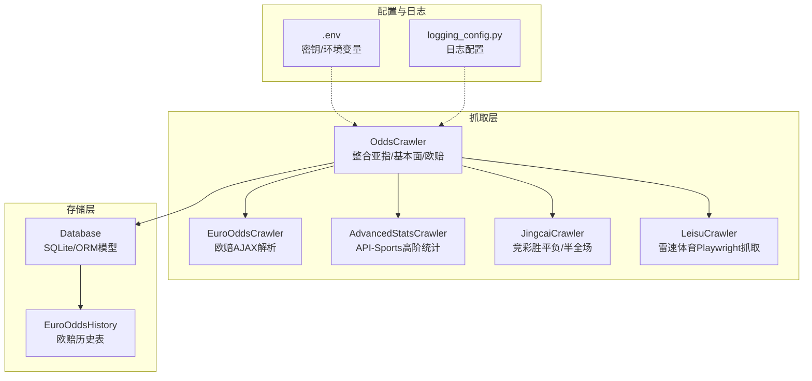
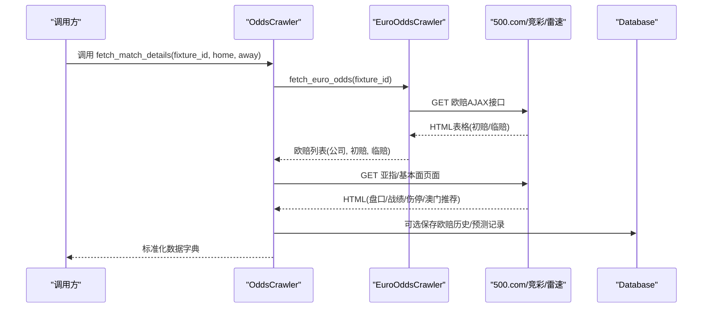
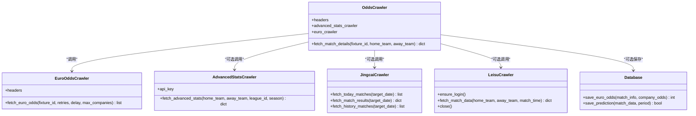
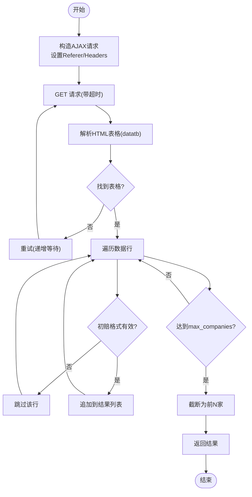
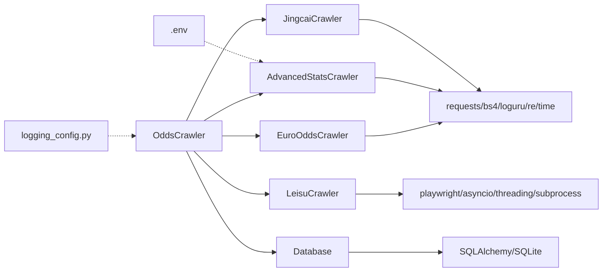

# 欧赔数据爬虫API

<cite>
**本文引用的文件**
- [odds_crawler.py](file://src/crawler/odds_crawler.py)
- [euro_odds_crawler.py](file://src/crawler/euro_odds_crawler.py)
- [advanced_stats_crawler.py](file://src/crawler/advanced_stats_crawler.py)
- [jingcai_crawler.py](file://src/crawler/jingcai_crawler.py)
- [leisu_crawler.py](file://src/crawler/leisu_crawler.py)
- [.env](file://config/.env)
- [database.py](file://src/db/database.py)
- [logging_config.py](file://src/logging_config.py)
- [test_leisu.py](file://scripts/test_leisu.py)
- [test_leisu_fetch.py](file://scripts/test_leisu_fetch.py)
- [run_post_mortem.py](file://scripts/run_post_mortem.py)
</cite>

## 目录
1. [简介](#简介)
2. [项目结构](#项目结构)
3. [核心组件](#核心组件)
4. [架构总览](#架构总览)
5. [详细组件分析](#详细组件分析)
6. [依赖分析](#依赖分析)
7. [性能考虑](#性能考虑)
8. [故障排查指南](#故障排查指南)
9. [结论](#结论)
10. [附录](#附录)

## 简介
本文件面向“欧赔数据爬虫API”的使用者与维护者，系统性阐述 odds_crawler 模块的功能边界、接口规范、数据结构、第三方数据源接入方式、数据格式标准化、赔率计算与分析逻辑、数据验证与质量保障机制，并提供配置参数、解析方法、错误处理策略与性能优化建议。文档同时覆盖与之配套的数据库存储、日志配置、竞彩与雷速数据源的协同使用，以及与预测与复盘流程的衔接。

## 项目结构
围绕欧赔数据抓取与整合，相关代码主要位于 src/crawler 目录，配合数据库层与日志配置，形成“抓取-解析-标准化-存储-应用”的闭环。

图表来源
- [odds_crawler.py:1-167](file://src/crawler/odds_crawler.py#L1-167)
- [euro_odds_crawler.py:1-118](file://src/crawler/euro_odds_crawler.py#L1-118)
- [advanced_stats_crawler.py:1-114](file://src/crawler/advanced_stats_crawler.py#L1-114)
- [jingcai_crawler.py:1-330](file://src/crawler/jingcai_crawler.py#L1-330)
- [leisu_crawler.py:1-609](file://src/crawler/leisu_crawler.py#L1-609)
- [database.py:176-198](file://src/db/database.py#L176-198)
- [.env:1-20](file://config/.env#L1-20)
- [logging_config.py:1-30](file://src/logging_config.py#L1-30)

章节来源
- [odds_crawler.py:1-167](file://src/crawler/odds_crawler.py#L1-L167)
- [euro_odds_crawler.py:1-118](file://src/crawler/euro_odds_crawler.py#L1-L118)
- [advanced_stats_crawler.py:1-114](file://src/crawler/advanced_stats_crawler.py#L1-L114)
- [jingcai_crawler.py:1-330](file://src/crawler/jingcai_crawler.py#L1-L330)
- [leisu_crawler.py:1-609](file://src/crawler/leisu_crawler.py#L1-L609)
- [database.py:176-198](file://src/db/database.py#L176-L198)
- [.env:1-20](file://config/.env#L1-L20)
- [logging_config.py:1-30](file://src/logging_config.py#L1-L30)

## 核心组件
- OddsCrawler：聚合抓取亚指、基本面、欧赔、高级统计与竞彩数据，统一输出标准化结构。
- EuroOddsCrawler：从500.com欧赔分析页AJAX接口抓取初赔与临赔，具备重试与限速防护。
- AdvancedStatsCrawler：可选对接API-Sports获取高阶统计（场均射门、射正、xG等），失败时降级。
- JingcaiCrawler：抓取竞彩胜平负与半全场赔率，支持历史数据与赛果回溯。
- LeisuCrawler：基于Playwright的雷速体育数据抓取，支持匿名模式与子进程隔离。
- Database：提供欧赔历史表存储、预测记录管理、复盘与串关方案管理等能力。
- 日志与配置：统一日志输出与第三方API密钥管理。

章节来源
- [odds_crawler.py:9-167](file://src/crawler/odds_crawler.py#L9-L167)
- [euro_odds_crawler.py:8-118](file://src/crawler/euro_odds_crawler.py#L8-L118)
- [advanced_stats_crawler.py:9-114](file://src/crawler/advanced_stats_crawler.py#L9-L114)
- [jingcai_crawler.py:6-330](file://src/crawler/jingcai_crawler.py#L6-L330)
- [leisu_crawler.py:18-609](file://src/crawler/leisu_crawler.py#L18-L609)
- [database.py:200-567](file://src/db/database.py#L200-L567)
- [logging_config.py:8-30](file://src/logging_config.py#L8-L30)

## 架构总览
OddsCrawler 作为入口协调多个数据源，先抓取欧赔（AJAX），再抓取亚指与基本面，最后可选抓取高级统计与竞彩数据。抓取到的数据经统一结构化后，既可用于预测流程，也可持久化至数据库。

图表来源
- [odds_crawler.py:17-161](file://src/crawler/odds_crawler.py#L17-L161)
- [euro_odds_crawler.py:17-111](file://src/crawler/euro_odds_crawler.py#L17-L111)
- [database.py:502-539](file://src/db/database.py#L502-L539)

## 详细组件分析

### OddsCrawler 组件
- 职责
  - 聚合亚指、基本面、欧赔、高级统计与竞彩数据。
  - 输出统一结构：包含亚洲盘口、欧洲赔率、近期战绩、交锋摘要、高级统计、伤停与阵容等。
- 关键接口
  - fetch_match_details(fixture_id, home_team=None, away_team=None)：返回标准化字典。
- 数据抓取流程
  - 欧赔：委托 EuroOddsCrawler 从AJAX接口抓取初赔与临赔。
  - 亚指：解析500.com亚指页面，提取澳门与Bet365的即时与初盘组合。
  - 基本面：解析500.com数据页，抽取积分排名、近期战绩、交锋摘要、澳门推荐、伤停与阵容。
  - 高级统计：可选调用 AdvancedStatsCrawler，若未配置API Key则降级为空。
  - 竞彩：可选调用 JingcaiCrawler 获取胜平负与半全场赔率。
  - 雷速：可选调用 LeisuCrawler 获取情报与SWOT模块。
- 错误处理
  - 对每个环节设置 try-except，记录错误日志并尽量返回可用数据。
  - 亚指与基本面解析对表格缺失、字段不足等情况进行健壮性判断。
- 性能与稳定性
  - 为500.com欧赔AJAX接口设置重试与递增等待，缓解限流。
  - 亚指与基本面请求设置超时，避免阻塞。
- 输出结构要点
  - asian_odds：包含 macau/bet365 的 start/live 字段。
  - europe_odds：列表，每项包含 company、init_*、live_*。
  - recent_form：包含 standings、home、away、h2h_summary、macau_recommendation、injuries。
  - advanced_stats：可选，主客队高阶统计。

图表来源
- [odds_crawler.py:9-16](file://src/crawler/odds_crawler.py#L9-L16)
- [euro_odds_crawler.py:8-16](file://src/crawler/euro_odds_crawler.py#L8-L16)
- [advanced_stats_crawler.py:15-26](file://src/crawler/advanced_stats_crawler.py#L15-L26)
- [jingcai_crawler.py:7-12](file://src/crawler/jingcai_crawler.py#L7-L12)
- [leisu_crawler.py:29-41](file://src/crawler/leisu_crawler.py#L29-L41)
- [database.py:502-539](file://src/db/database.py#L502-L539)

章节来源
- [odds_crawler.py:17-161](file://src/crawler/odds_crawler.py#L17-L161)
- [euro_odds_crawler.py:17-111](file://src/crawler/euro_odds_crawler.py#L17-L111)
- [advanced_stats_crawler.py:82-114](file://src/crawler/advanced_stats_crawler.py#L82-L114)
- [jingcai_crawler.py:13-323](file://src/crawler/jingcai_crawler.py#L13-L323)
- [leisu_crawler.py:237-321](file://src/crawler/leisu_crawler.py#L237-L321)

### EuroOddsCrawler 组件
- 职责
  - 从500.com欧赔分析页AJAX接口抓取初赔与临赔，解析为结构化列表。
- 关键接口
  - fetch_euro_odds(fixture_id, retries=3, delay=2.0, max_companies=5)：返回公司与初/临赔列表。
- 解析逻辑
  - 通过Referer与XHR头访问AJAX接口，解析datatb表格，提取初赔三列与临赔三列。
  - 使用正则校验初赔格式，过滤无效行。
  - 可限制返回公司数量（默认前5家主流公司）。
- 重试与限速
  - 内置重试与递增等待，避免被500.com限流。
- 输出结构
  - 每条记录包含 company、init_home/draw/away、live_home/draw/away。

图表来源
- [euro_odds_crawler.py:17-111](file://src/crawler/euro_odds_crawler.py#L17-L111)

章节来源
- [euro_odds_crawler.py:17-111](file://src/crawler/euro_odds_crawler.py#L17-L111)

### AdvancedStatsCrawler 组件
- 职责
  - 可选抓取API-Sports高阶统计（场均射门、射正、xG等），失败时降级为空。
- 关键接口
  - fetch_advanced_stats(home_team, away_team, league_id=None, season=None)：返回主客队统计。
- 降级策略
  - 未配置 FOOTBALL_API_KEY 或值为占位符时，直接返回空字典，供下游使用500网基本面正则fallback。
- 缓存与频率
  - 缓存球队ID，减少重复搜索；免费API有调用频率限制，建议外部缓存。

章节来源
- [advanced_stats_crawler.py:28-114](file://src/crawler/advanced_stats_crawler.py#L28-L114)
- [.env:1-20](file://config/.env#L1-L20)

### JingcaiCrawler 组件
- 职责
  - 抓取竞彩胜平负与半全场赔率，支持今日、历史与赛果回溯。
- 关键接口
  - fetch_today_matches(target_date=None)：返回今日比赛列表。
  - fetch_match_results(target_date)：返回赛果与时间。
  - fetch_history_matches(target_date)：返回历史已完赛比赛（含赔率与赛果）。
- 解析逻辑
  - 解析竞彩页面HTML，提取比赛编号、联赛、队伍、时间、不让球/让球赔率。
  - 半全场赔率单独请求并合并。
- 输出结构
  - 每场比赛包含 fixture_id、match_num、league、home/away_team、match_time、odds（nspf/spf/rangqiu/bqc）。

章节来源
- [jingcai_crawler.py:13-323](file://src/crawler/jingcai_crawler.py#L13-L323)

### LeisuCrawler 组件
- 职责
  - 基于Playwright抓取雷速体育数据，支持匿名模式与子进程隔离。
- 关键接口
  - ensure_login()：启动浏览器、加载Cookie或匿名模式。
  - fetch_match_data(home_team, away_team, match_time=None)：返回综合数据。
  - close()：释放资源。
- 技术细节
  - 使用线程池与专用工作线程，规避Streamlit事件循环冲突。
  - 支持子进程抓取，避免Playwright同步API在特定环境下的冲突。
  - 从guide页定位比赛，进入分析页与情报页提取模块化数据。
- 输出结构
  - 包含历史交锋、近期战绩、联赛积分、进球分布、伤停情况、半全场胜负等模块化文本片段，供上层进一步解析。

章节来源
- [leisu_crawler.py:29-321](file://src/crawler/leisu_crawler.py#L29-L321)
- [test_leisu.py:1-129](file://scripts/test_leisu.py#L1-L129)
- [test_leisu_fetch.py:1-20](file://scripts/test_leisu_fetch.py#L1-L20)

### 数据库与存储
- 欧赔历史表
  - 字段：fixture_id、match_num、league、home/away_team、match_time、company、init_*、live_*、actual_score、actual_result、data_source、created_at。
  - 用途：保存欧赔初赔与临赔的历史快照，支持复盘与模式分析。
- 预测记录
  - 支持按时间段（pre_24h、pre_12h、final、repredicted）保存与查询。
  - 提供提取竞彩推荐文本的辅助函数。
- 复盘与串关
  - 提供每日复盘与串关方案的保存与查询接口。

章节来源
- [database.py:176-198](file://src/db/database.py#L176-L198)
- [database.py:502-539](file://src/db/database.py#L502-L539)
- [database.py:256-304](file://src/db/database.py#L256-L304)
- [database.py:422-449](file://src/db/database.py#L422-L449)
- [database.py:498-501](file://src/db/database.py#L498-L501)

## 依赖分析
- 组件耦合
  - OddsCrawler 依赖 EuroOddsCrawler、AdvancedStatsCrawler、JingcaiCrawler、LeisuCrawler 与 Database。
  - EuroOddsCrawler 仅依赖标准库与第三方HTTP库。
  - AdvancedStatsCrawler 依赖API-Sports，失败时可降级。
  - JingcaiCrawler 与 LeisuCrawler 依赖各自的目标站点接口。
- 外部依赖
  - requests、BeautifulSoup、loguru、re、time、os、json、subprocess、threading、asyncio、playwright。
- 配置与密钥
  - FOOTBALL_API_KEY 用于API-Sports；数据库URL默认SQLite；消息推送等可选配置。

图表来源
- [odds_crawler.py:6-15](file://src/crawler/odds_crawler.py#L6-L15)
- [euro_odds_crawler.py:1-6](file://src/crawler/euro_odds_crawler.py#L1-L6)
- [advanced_stats_crawler.py:1-7](file://src/crawler/advanced_stats_crawler.py#L1-L7)
- [jingcai_crawler.py:1-5](file://src/crawler/jingcai_crawler.py#L1-L5)
- [leisu_crawler.py:1-16](file://src/crawler/leisu_crawler.py#L1-L16)
- [database.py:1-9](file://src/db/database.py#L1-L9)
- [.env:1-20](file://config/.env#L1-L20)
- [logging_config.py:1-30](file://src/logging_config.py#L1-L30)

章节来源
- [odds_crawler.py:6-15](file://src/crawler/odds_crawler.py#L6-L15)
- [euro_odds_crawler.py:1-6](file://src/crawler/euro_odds_crawler.py#L1-L6)
- [advanced_stats_crawler.py:1-7](file://src/crawler/advanced_stats_crawler.py#L1-L7)
- [jingcai_crawler.py:1-5](file://src/crawler/jingcai_crawler.py#L1-L5)
- [leisu_crawler.py:1-16](file://src/crawler/leisu_crawler.py#L1-L16)
- [database.py:1-9](file://src/db/database.py#L1-L9)
- [.env:1-20](file://config/.env#L1-L20)
- [logging_config.py:1-30](file://src/logging_config.py#L1-L30)

## 性能考虑
- 限流与重试
  - 欧赔AJAX接口采用递增等待重试，降低被限流风险。
  - 亚指/基本面请求设置超时，避免长时间阻塞。
- 并发与隔离
  - LeisuCrawler 使用线程池与专用工作线程，必要时通过子进程隔离Playwright。
- 缓存与降级
  - API-Sports统计使用团队ID缓存；未配置密钥时自动降级。
- I/O与解析
  - 优先解析AJAX接口（结构化更强），其次解析HTML（正则与表格定位）。
- 存储批量化
  - 欧赔历史批量插入，减少事务开销。

章节来源
- [euro_odds_crawler.py:28-111](file://src/crawler/euro_odds_crawler.py#L28-L111)
- [leisu_crawler.py:42-56](file://src/crawler/leisu_crawler.py#L42-L56)
- [advanced_stats_crawler.py:25-48](file://src/crawler/advanced_stats_crawler.py#L25-L48)
- [database.py:502-539](file://src/db/database.py#L502-L539)

## 故障排查指南
- 欧赔AJAX未返回表格
  - 现象：多次重试后仍提示未找到表格。
  - 排查：确认 fixture_id 正确、网络连通、Referer与Headers正确。
  - 参考
    - [euro_odds_crawler.py:40-46](file://src/crawler/euro_odds_crawler.py#L40-L46)
- 亚指/基本面解析失败
  - 现象：表格缺失或字段不足。
  - 排查：确认页面结构未变更、编码为gb2312、目标表格id存在。
  - 参考
    - [odds_crawler.py:39-42](file://src/crawler/odds_crawler.py#L39-L42)
    - [odds_crawler.py:75-78](file://src/crawler/odds_crawler.py#L75-L78)
- API-Sports不可用
  - 现象：高级统计为空。
  - 排查：检查 FOOTBALL_API_KEY 是否配置且非占位符。
  - 参考
    - [advanced_stats_crawler.py:90-92](file://src/crawler/advanced_stats_crawler.py#L90-L92)
    - [.env:1-20](file://config/.env#L1-L20)
- 雷速抓取异常
  - 现象：登录页加载超时或验证码阻断。
  - 排查：确认匿名模式可用、Cookie加载失败时自动降级、必要时启用子进程抓取。
  - 参考
    - [leisu_crawler.py:103-160](file://src/crawler/leisu_crawler.py#L103-L160)
    - [leisu_crawler.py:248-283](file://src/crawler/leisu_crawler.py#L248-L283)
- 日志与问题定位
  - 使用统一日志配置，关注 INFO/WARNING/ERROR 级别输出。
  - 参考
    - [logging_config.py:8-30](file://src/logging_config.py#L8-L30)

章节来源
- [euro_odds_crawler.py:40-46](file://src/crawler/euro_odds_crawler.py#L40-L46)
- [odds_crawler.py:39-42](file://src/crawler/odds_crawler.py#L39-L42)
- [odds_crawler.py:75-78](file://src/crawler/odds_crawler.py#L75-L78)
- [advanced_stats_crawler.py:90-92](file://src/crawler/advanced_stats_crawler.py#L90-L92)
- [.env:1-20](file://config/.env#L1-L20)
- [leisu_crawler.py:103-160](file://src/crawler/leisu_crawler.py#L103-L160)
- [leisu_crawler.py:248-283](file://src/crawler/leisu_crawler.py#L248-L283)
- [logging_config.py:8-30](file://src/logging_config.py#L8-L30)

## 结论
OddsCrawler 通过统一接口整合多源数据，形成标准化的欧赔与基本面视图，为预测与复盘提供高质量输入。其设计兼顾稳定性（重试、降级、超时）、可扩展性（可插拔第三方数据源）与可观测性（统一日志）。结合数据库的欧赔历史与预测记录，可支撑长期模式分析与回测验证。

## 附录

### 接口规范与数据结构
- 输入
  - fixture_id：比赛唯一标识（字符串）。
  - home_team/away_team：可选，用于高级统计与部分数据源匹配。
- 输出（OddsCrawler）
  - 字典，包含：
    - asian_odds：macau/bet365 的 start/live 字符串（格式为“上盘 | 盘口 | 下盘”）。
    - europe_odds：列表，每项包含 company、init_home/draw/away、live_home/draw/away。
    - recent_form：standings、home、away、h2h_summary、macau_recommendation、injuries。
    - advanced_stats：主客队高阶统计（可选）。
    - h2h：交锋历史（可选）。
- 数据来源
  - 欧赔：500.com AJAX。
  - 亚指/基本面：500.com 页面解析。
  - 高级统计：API-Sports（可选）。
  - 竞彩：500.com 竞彩页面。
  - 雷速：Live.Leisu.com（可选）。

章节来源
- [odds_crawler.py:17-161](file://src/crawler/odds_crawler.py#L17-L161)
- [euro_odds_crawler.py:17-111](file://src/crawler/euro_odds_crawler.py#L17-L111)
- [advanced_stats_crawler.py:82-114](file://src/crawler/advanced_stats_crawler.py#L82-L114)
- [jingcai_crawler.py:13-120](file://src/crawler/jingcai_crawler.py#L13-L120)
- [leisu_crawler.py:284-321](file://src/crawler/leisu_crawler.py#L284-L321)

### 配置参数与环境变量
- FOOTBALL_API_KEY：API-Sports密钥（可选）。
- DATABASE_URL：数据库连接串（默认SQLite）。
- LLM_*：大模型API密钥与基座（可选）。
- 消息推送：DINGTALK_WEBHOOK、TELEGRAM_*（可选）。
- 雷速体育：当前使用匿名访问，无需用户名/密码。

章节来源
- [.env:1-20](file://config/.env#L1-L20)

### 数据解析与验证要点
- 欧赔解析
  - 使用正则校验初赔格式，过滤无效行。
  - 限制返回公司数量，确保主流公司优先。
- 亚指解析
  - 识别澳门与Bet365公司，提取即时与初盘组合。
  - 对隐藏公司名（如“*门”、“**t3*5”）进行兼容处理。
- 基本面解析
  - 抽取积分、排名、近期战绩、交锋摘要、伤停与阵容。
  - 对空数据与旧版结构做兼容处理。
- 竞彩解析
  - 通过data-*属性提取赔率与时间，半全场赔率单独请求。
- 雷速解析
  - 从guide页定位分析页与情报页，按模块切分文本并清洗噪声。

章节来源
- [euro_odds_crawler.py:85-96](file://src/crawler/euro_odds_crawler.py#L85-L96)
- [odds_crawler.py:54-70](file://src/crawler/odds_crawler.py#L54-L70)
- [odds_crawler.py:95-101](file://src/crawler/odds_crawler.py#L95-L101)
- [odds_crawler.py:103-125](file://src/crawler/odds_crawler.py#L103-L125)
- [odds_crawler.py:127-156](file://src/crawler/odds_crawler.py#L127-L156)
- [jingcai_crawler.py:49-120](file://src/crawler/jingcai_crawler.py#L49-L120)
- [jingcai_crawler.py:122-148](file://src/crawler/jingcai_crawler.py#L122-L148)
- [leisu_crawler.py:410-460](file://src/crawler/leisu_crawler.py#L410-L460)
- [leisu_crawler.py:538-582](file://src/crawler/leisu_crawler.py#L538-L582)

### 赔率计算与盘口分析参考
- 赔率变化幅度
  - 可通过初赔与临赔计算相对变化百分比，用于盘口分析与市场情绪判断。
  - 参考
    - [run_post_mortem.py:197-211](file://scripts/run_post_mortem.py#L197-L211)
- 盘口方向与强度标签
  - 基于初/临赔变化幅度与阈值，给出“剧烈/中等/轻微”等标签，辅助仲裁与风控。
  - 参考
    - [src/llm/predictor.py:1706-1726](file://src/llm/predictor.py#L1706-L1726)

章节来源
- [run_post_mortem.py:197-211](file://scripts/run_post_mortem.py#L197-L211)
- [src/llm/predictor.py:1706-1726](file://src/llm/predictor.py#L1706-L1726)

### 数据质量保证措施
- 结构化输出与字段校验
  - 欧赔与亚指解析严格校验表格与字段长度，避免空数据污染。
- 降级与回退
  - API-Sports不可用时自动降级为空，不影响整体流程。
- 日志与监控
  - 统一日志输出，便于问题追踪与性能观测。
- 数据持久化
  - 欧赔历史批量入库，支持后续分析与回测。

章节来源
- [odds_crawler.py:85-101](file://src/crawler/odds_crawler.py#L85-L101)
- [advanced_stats_crawler.py:90-92](file://src/crawler/advanced_stats_crawler.py#L90-L92)
- [logging_config.py:8-30](file://src/logging_config.py#L8-L30)
- [database.py:502-539](file://src/db/database.py#L502-L539)