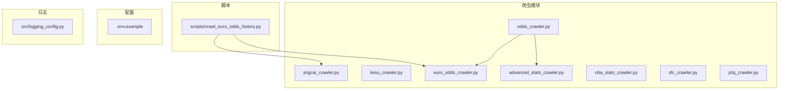
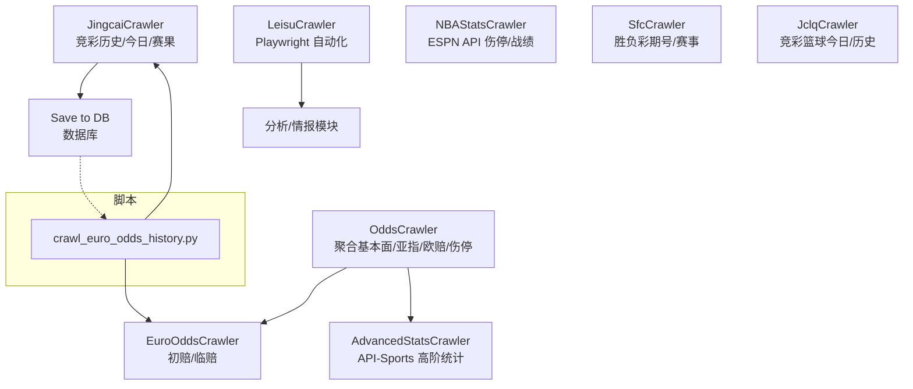
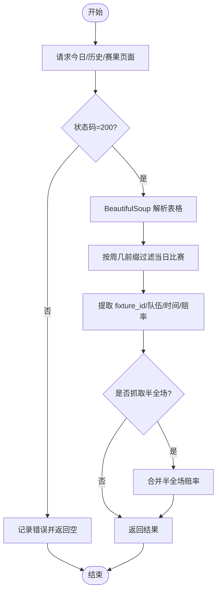
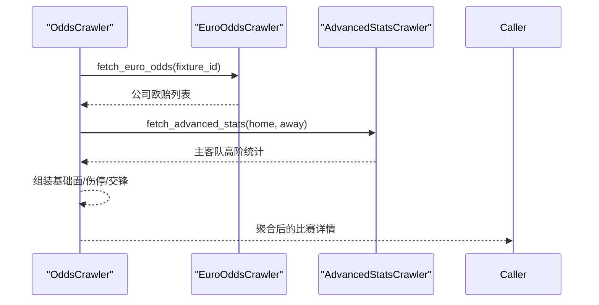
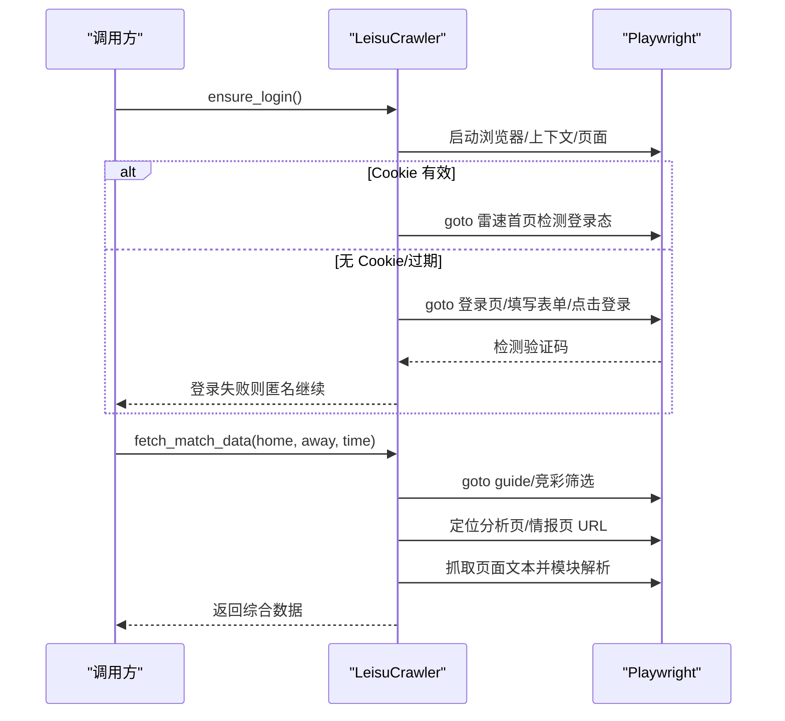
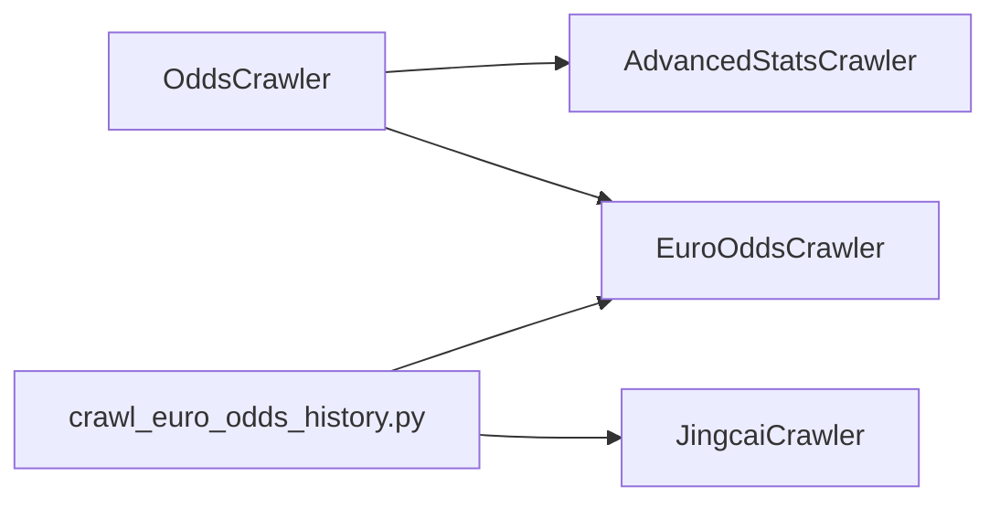

# 爬虫API

<cite>
**本文引用的文件**
- [src/crawler/jingcai_crawler.py](file://src/crawler/jingcai_crawler.py)
- [src/crawler/odds_crawler.py](file://src/crawler/odds_crawler.py)
- [src/crawler/leisu_crawler.py](file://src/crawler/leisu_crawler.py)
- [src/crawler/advanced_stats_crawler.py](file://src/crawler/advanced_stats_crawler.py)
- [src/crawler/euro_odds_crawler.py](file://src/crawler/euro_odds_crawler.py)
- [src/crawler/nba_stats_crawler.py](file://src/crawler/nba_stats_crawler.py)
- [src/crawler/sfc_crawler.py](file://src/crawler/sfc_crawler.py)
- [src/crawler/jclq_crawler.py](file://src/crawler/jclq_crawler.py)
- [scripts/crawl_euro_odds_history.py](file://scripts/crawl_euro_odds_history.py)
- [config/.env.example](file://config/.env.example)
- [src/logging_config.py](file://src/logging_config.py)
</cite>

## 目录
1. [简介](#简介)
2. [项目结构](#项目结构)
3. [核心组件](#核心组件)
4. [架构总览](#架构总览)
5. [详细组件分析](#详细组件分析)
6. [依赖分析](#依赖分析)
7. [性能考虑](#性能考虑)
8. [故障排查指南](#故障排查指南)
9. [结论](#结论)
10. [附录](#附录)

## 简介
本文件为该项目的爬虫API综合文档，覆盖以下爬虫模块的功能、接口规范、数据源、爬取策略、数据格式转换与错误处理机制，并提供配置参数、代理设置、反爬虫应对与数据质量保障方法。涉及模块包括：
- 竞彩数据爬虫（jingcai_crawler）
- 欧赔数据爬虫（odds_crawler 依赖 euro_odds_crawler）
- 雷速数据爬虫（leisu_crawler）
- 高级统计数据爬虫（advanced_stats_crawler）
- 欧洲赔率历史爬虫（euro_odds_crawler）
- NBA统计数据爬虫（nba_stats_crawler）
- 胜负彩爬虫（sfc_crawler）
- 竞彩篮球爬虫（jclq_crawler）

## 项目结构
爬虫模块集中于 src/crawler 目录，各模块职责清晰，部分模块之间存在组合/依赖关系。脚本目录 scripts 提供批量任务示例，config 提供环境变量模板，日志配置位于 src/logging_config.py。

图表来源
- [src/crawler/odds_crawler.py:1-167](file://src/crawler/odds_crawler.py#L1-L167)
- [src/crawler/euro_odds_crawler.py:1-118](file://src/crawler/euro_odds_crawler.py#L1-L118)
- [src/crawler/advanced_stats_crawler.py:1-114](file://src/crawler/advanced_stats_crawler.py#L1-L114)
- [scripts/crawl_euro_odds_history.py:1-118](file://scripts/crawl_euro_odds_history.py#L1-L118)

章节来源
- [src/crawler/jingcai_crawler.py:1-330](file://src/crawler/jingcai_crawler.py#L1-L330)
- [src/crawler/odds_crawler.py:1-167](file://src/crawler/odds_crawler.py#L1-L167)
- [src/crawler/leisu_crawler.py:1-609](file://src/crawler/leisu_crawler.py#L1-L609)
- [src/crawler/advanced_stats_crawler.py:1-114](file://src/crawler/advanced_stats_crawler.py#L1-L114)
- [src/crawler/euro_odds_crawler.py:1-118](file://src/crawler/euro_odds_crawler.py#L1-L118)
- [src/crawler/nba_stats_crawler.py:1-133](file://src/crawler/nba_stats_crawler.py#L1-L133)
- [src/crawler/sfc_crawler.py:1-145](file://src/crawler/sfc_crawler.py#L1-L145)
- [src/crawler/jclq_crawler.py:1-264](file://src/crawler/jclq_crawler.py#L1-L264)
- [scripts/crawl_euro_odds_history.py:1-118](file://scripts/crawl_euro_odds_history.py#L1-L118)
- [config/.env.example:1-16](file://config/.env.example#L1-L16)
- [src/logging_config.py:1-30](file://src/logging_config.py#L1-L30)

## 核心组件
- 竞彩数据爬虫（jingcai_crawler）：抓取竞彩足球今日赛事、半全场赔率、历史赛果与指定日期历史数据。
- 欧赔数据爬虫（odds_crawler + euro_odds_crawler）：聚合欧洲赔率与基本面数据，其中欧洲赔率来自 euro_odds_crawler。
- 雷速数据爬虫（leisu_crawler）：基于 Playwright 的浏览器自动化，支持登录态与 Cookie 管理，抓取分析页与情报页。
- 高级统计数据爬虫（advanced_stats_crawler）：通过 API-Sports 获取高阶技术统计（如场均进球），并带缓存与降级逻辑。
- 欧洲赔率历史爬虫（euro_odds_crawler）：批量抓取历史比赛的初赔/临赔数据，供回测与训练使用。
- NBA统计数据爬虫（nba_stats_crawler）：通过 ESPN API 获取NBA球队伤停与战绩。
- 胜负彩爬虫（sfc_crawler）：抓取胜负彩十四场赛事列表与期号。
- 竞彩篮球爬虫（jclq_crawler）：抓取竞彩篮球今日赛事、赔率与历史赛果。

章节来源
- [src/crawler/jingcai_crawler.py:13-323](file://src/crawler/jingcai_crawler.py#L13-L323)
- [src/crawler/odds_crawler.py:17-161](file://src/crawler/odds_crawler.py#L17-L161)
- [src/crawler/leisu_crawler.py:29-321](file://src/crawler/leisu_crawler.py#L29-L321)
- [src/crawler/advanced_stats_crawler.py:82-114](file://src/crawler/advanced_stats_crawler.py#L82-L114)
- [src/crawler/euro_odds_crawler.py:17-111](file://src/crawler/euro_odds_crawler.py#L17-L111)
- [src/crawler/nba_stats_crawler.py:71-125](file://src/crawler/nba_stats_crawler.py#L71-L125)
- [src/crawler/sfc_crawler.py:14-139](file://src/crawler/sfc_crawler.py#L14-L139)
- [src/crawler/jclq_crawler.py:14-257](file://src/crawler/jclq_crawler.py#L14-L257)

## 架构总览
下图展示了爬虫模块之间的协作关系与数据流向。odds_crawler 组合 euro_odds_crawler 与 advanced_stats_crawler；脚本 crawl_euro_odds_history.py 调用 jingcai_crawler 与 euro_odds_crawler 进行历史数据采集。

图表来源
- [src/crawler/odds_crawler.py:17-161](file://src/crawler/odds_crawler.py#L17-L161)
- [src/crawler/euro_odds_crawler.py:17-111](file://src/crawler/euro_odds_crawler.py#L17-L111)
- [src/crawler/advanced_stats_crawler.py:82-114](file://src/crawler/advanced_stats_crawler.py#L82-L114)
- [scripts/crawl_euro_odds_history.py:43-106](file://scripts/crawl_euro_odds_history.py#L43-L106)

## 详细组件分析

### 竞彩数据爬虫（jingcai_crawler）
- 数据源
  - 竞彩官网今日赛事与半全场赔率页面
  - 历史页面（按日期）
  - 赛果页面（按日期）
- 爬取策略
  - 使用 requests + BeautifulSoup 解析 HTML 表格
  - 对编码进行显式设置（gb2312/gbk）
  - 通过 data-* 属性提取关键字段（如 fixture_id、赔率、让球等）
  - 日期过滤：按周几前缀筛选当日比赛
- 数据格式转换
  - 赔率标准化为数组或字典
  - 时间拼接为“年-月-日 时:分”
  - 半全场赔率合并至主结构
- 错误处理
  - 状态码检查、异常捕获、日志记录
  - 历史/赛果解析失败时返回空集合或空字典
- 关键接口
  - fetch_today_matches(target_date=None)
  - fetch_match_results(target_date)
  - fetch_history_matches(target_date)

图表来源
- [src/crawler/jingcai_crawler.py:13-120](file://src/crawler/jingcai_crawler.py#L13-L120)
- [src/crawler/jingcai_crawler.py:122-148](file://src/crawler/jingcai_crawler.py#L122-L148)
- [src/crawler/jingcai_crawler.py:150-231](file://src/crawler/jingcai_crawler.py#L150-L231)
- [src/crawler/jingcai_crawler.py:233-323](file://src/crawler/jingcai_crawler.py#L233-L323)

章节来源
- [src/crawler/jingcai_crawler.py:13-323](file://src/crawler/jingcai_crawler.py#L13-L323)

### 欧赔数据爬虫（odds_crawler + euro_odds_crawler）
- 数据源
  - 500.com 欧赔分析页 AJAX 接口
  - 500.com 基础面数据（积分、战绩、交锋、伤停）
- 爬取策略
  - euro_odds_crawler：带重试与等待策略，限制公司数量
  - odds_crawler：组合欧赔与高级统计、伤停、交锋、澳门推荐等
- 数据格式转换
  - 欧赔：公司名、初赔、临赔三元组
  - 基础面：积分/排名、主客战绩、交锋摘要、伤停汇总
- 错误处理
  - 表格缺失、行解析失败时重试或跳过
  - API-Sports 未配置时降级为空数据

图表来源
- [src/crawler/odds_crawler.py:17-161](file://src/crawler/odds_crawler.py#L17-L161)
- [src/crawler/euro_odds_crawler.py:17-111](file://src/crawler/euro_odds_crawler.py#L17-L111)
- [src/crawler/advanced_stats_crawler.py:82-114](file://src/crawler/advanced_stats_crawler.py#L82-L114)

章节来源
- [src/crawler/odds_crawler.py:17-161](file://src/crawler/odds_crawler.py#L17-L161)
- [src/crawler/euro_odds_crawler.py:17-111](file://src/crawler/euro_odds_crawler.py#L17-L111)
- [src/crawler/advanced_stats_crawler.py:82-114](file://src/crawler/advanced_stats_crawler.py#L82-L114)

### 雷速数据爬虫（leisu_crawler）
- 数据源
  - 雷速体育 guide 页面、分析页、情报页
- 爬取策略
  - Playwright 启动 Chromium，设置 UA 与视口
  - 支持 Cookie 管理与登录态检测
  - 多线程执行，避免与 Streamlit 事件循环冲突
  - 子进程隔离执行以规避同步 API 冲突
- 数据格式转换
  - 从页面文本按模块切分，提取伤停、积分、进球分布、半全场胜负、历史交锋、近期战绩
  - 情报页提取 SWOT（有利/不利/中立）要点
- 错误处理
  - 登录失败回退匿名模式
  - 页面加载超时/验证码阻断时提示人工干预
  - 模块解析失败时记录警告并返回可用数据

图表来源
- [src/crawler/leisu_crawler.py:169-191](file://src/crawler/leisu_crawler.py#L169-L191)
- [src/crawler/leisu_crawler.py:237-321](file://src/crawler/leisu_crawler.py#L237-L321)
- [src/crawler/leisu_crawler.py:410-460](file://src/crawler/leisu_crawler.py#L410-L460)
- [src/crawler/leisu_crawler.py:538-582](file://src/crawler/leisu_crawler.py#L538-L582)

章节来源
- [src/crawler/leisu_crawler.py:29-321](file://src/crawler/leisu_crawler.py#L29-L321)

### 高级统计数据爬虫（advanced_stats_crawler）
- 数据源
  - API-Sports v3.football.api-sports.io
- 爬取策略
  - 通过环境变量 FOOTBALL_API_KEY 设置密钥
  - 缓存球队 ID，降低重复搜索成本
  - 未配置密钥时返回空数据，供下游降级
- 数据格式转换
  - 返回主/客队场均进球与失球（其他指标预留）
- 错误处理
  - 搜索/统计接口异常时记录调试日志并返回空

章节来源
- [src/crawler/advanced_stats_crawler.py:15-114](file://src/crawler/advanced_stats_crawler.py#L15-L114)

### 欧洲赔率历史爬虫（euro_odds_crawler）
- 数据源
  - 500.com 欧赔分析页 AJAX 接口
- 爬取策略
  - 带重试与递增等待，限制公司数量
  - 适配不同页面结构，提取初赔/临赔三元组
- 数据格式转换
  - 规范化公司名与赔率字段
- 错误处理
  - 表格缺失/解析失败时重试或返回空列表

章节来源
- [src/crawler/euro_odds_crawler.py:17-111](file://src/crawler/euro_odds_crawler.py#L17-L111)

### NBA统计数据爬虫（nba_stats_crawler）
- 数据源
  - ESPN API（teams、roster、team record）
- 爬取策略
  - 初始化球队名称与 ID 映射，补充中文映射
  - 通过 roster 接口提取伤停，通过 team 接口提取战绩
- 数据格式转换
  - 伤停翻译为中文状态描述
  - 战绩摘要字符串
- 错误处理
  - 接口异常时记录错误并返回默认值

章节来源
- [src/crawler/nba_stats_crawler.py:12-125](file://src/crawler/nba_stats_crawler.py#L12-L125)

### 胜负彩爬虫（sfc_crawler）
- 数据源
  - 500.com 胜负彩页面（期号与十四场赛事）
- 爬取策略
  - 解析期号列表与当前期号
  - 提取比赛编号、联赛、时间、队伍、fid
- 数据格式转换
  - 补全年份，生成统一时间格式
- 错误处理
  - 页面结构变化时兼容旧版选择器

章节来源
- [src/crawler/sfc_crawler.py:14-139](file://src/crawler/sfc_crawler.py#L14-L139)

### 竞彩篮球爬虫（jclq_crawler）
- 数据源
  - 500.com 竞彩篮球页面（混合玩法）
- 爬取策略
  - 修正主客队顺序与让分/大小分解析逻辑
  - 动态解析盘口值，避免 data- 属性滞后
- 数据格式转换
  - 胜负、让分胜负、大小分赔率标准化
  - 历史赛果计算胜负/让分胜负/大小分结果
- 错误处理
  - 解析失败时记录警告并跳过

章节来源
- [src/crawler/jclq_crawler.py:14-257](file://src/crawler/jclq_crawler.py#L14-L257)

## 依赖分析
- 模块内聚性
  - 各模块职责单一，内部封装解析细节
- 模块耦合度
  - odds_crawler 依赖 euro_odds_crawler 与 advanced_stats_crawler
  - crawl_euro_odds_history.py 依赖 jingcai_crawler 与 euro_odds_crawler
- 外部依赖
  - requests、BeautifulSoup、loguru
  - Playwright（leisu_crawler）
  - API-Sports（advanced_stats_crawler）
  - ESPN API（nba_stats_crawler）

图表来源
- [src/crawler/odds_crawler.py:6-15](file://src/crawler/odds_crawler.py#L6-L15)
- [scripts/crawl_euro_odds_history.py:13-15](file://scripts/crawl_euro_odds_history.py#L13-L15)

章节来源
- [src/crawler/odds_crawler.py:6-15](file://src/crawler/odds_crawler.py#L6-L15)
- [scripts/crawl_euro_odds_history.py:13-15](file://scripts/crawl_euro_odds_history.py#L13-L15)

## 性能考虑
- 请求并发与限流
  - euro_odds_crawler 内置重试与等待，避免被限流
  - crawl_euro_odds_history.py 对每场比赛间隔固定时间
- 解析效率
  - 使用 BeautifulSoup 的 find/find_all 定位关键节点
  - 避免重复解析同一页面，尽量一次性提取所需字段
- 缓存策略
  - advanced_stats_crawler 缓存球队 ID
- 浏览器资源
  - leisu_crawler 使用线程池与子进程隔离，减少主线程阻塞

## 故障排查指南
- 日志配置
  - 使用 src/logging_config.py 初始化日志，终端 INFO 级别输出与文件轮转
- 常见问题
  - 页面编码：确保 response.encoding 设置为 gb2312/gbk
  - 500.com 页面结构变化：检查选择器与 data-* 属性
  - API-Sports 限流：检查 FOOTBALL_API_KEY 是否配置
  - Playwright 事件循环冲突：确认使用线程池或子进程模式
- 定位步骤
  - 查看日志输出，定位具体模块与函数
  - 对异常模块增加更细粒度的 try/except 与日志
  - 对依赖外部 API 的模块，先验证鉴权与网络连通性

章节来源
- [src/logging_config.py:8-30](file://src/logging_config.py#L8-L30)
- [src/crawler/leisu_crawler.py:47-56](file://src/crawler/leisu_crawler.py#L47-L56)
- [src/crawler/advanced_stats_crawler.py:30-48](file://src/crawler/advanced_stats_crawler.py#L30-L48)

## 结论
本爬虫API体系以模块化设计为核心，结合多种数据源与解析策略，满足竞彩、欧赔、雷速、NBA等多场景需求。通过合理的错误处理、重试与降级机制，以及日志与配置管理，整体具备较好的稳定性与可维护性。建议在生产环境中配合代理池、随机延时与头部轮换进一步增强抗反爬能力，并持续监控外部 API 的可用性与配额。

## 附录

### 配置参数与环境变量
- API 密钥
  - FOOTBALL_API_KEY：API-Sports 访问密钥
- 大语言模型
  - LLM_API_KEY、LLM_API_BASE、LLM_MODEL
- 数据库
  - DATABASE_URL：默认 SQLite
- 消息推送
  - DINGTALK_WEBHOOK、TELEGRAM_BOT_TOKEN、TELEGRAM_CHAT_ID

章节来源
- [config/.env.example:1-16](file://config/.env.example#L1-L16)

### 反爬虫应对与数据质量保障
- 反爬虫应对
  - 随机 User-Agent、请求头伪装
  - 适当延迟与重试，避免高频访问
  - 使用代理池（建议在部署层实现）
- 数据质量保障
  - 对关键字段进行类型校验与默认值填充
  - 对解析失败的条目进行告警与跳过
  - 对外部 API 异常进行降级与缓存