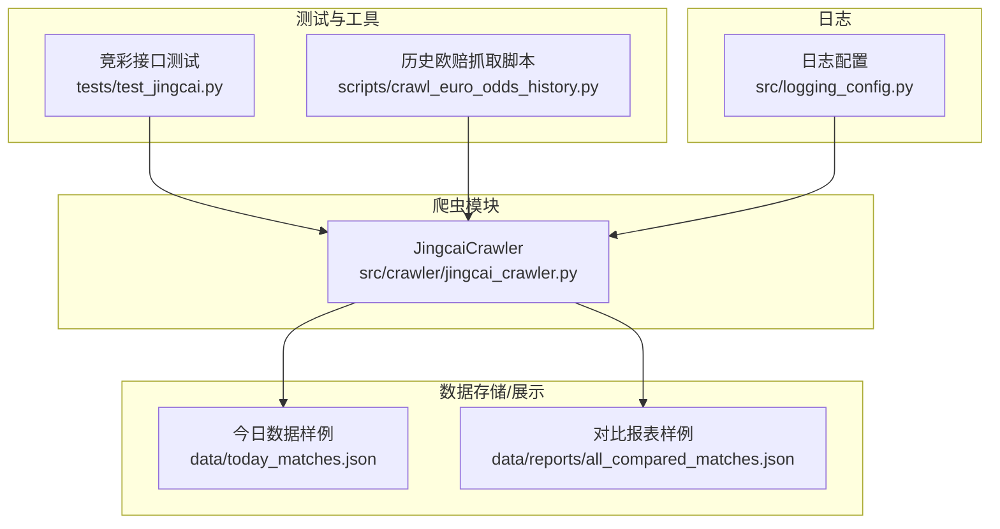
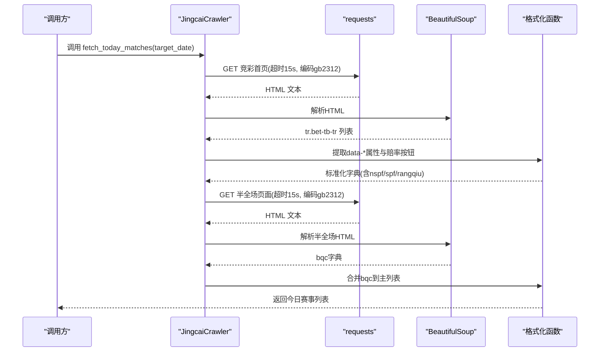
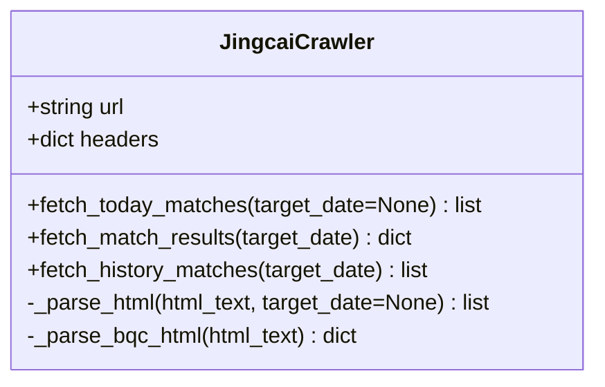
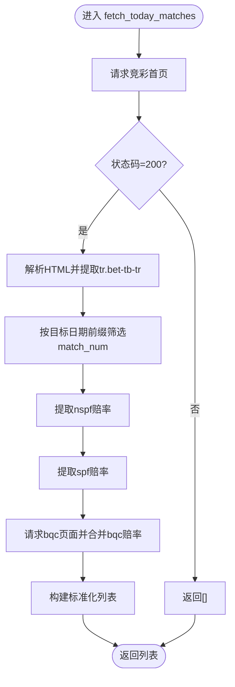
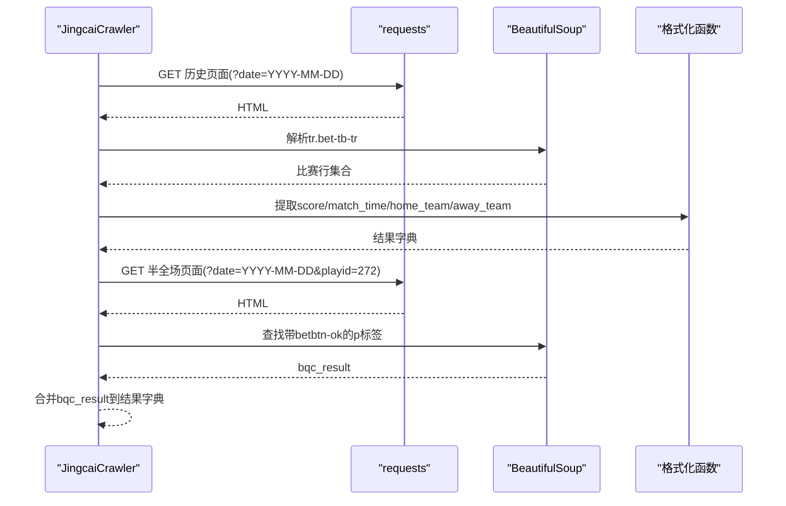
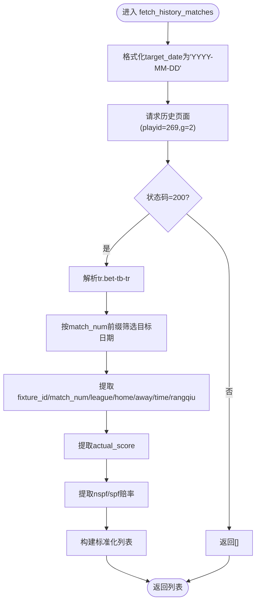
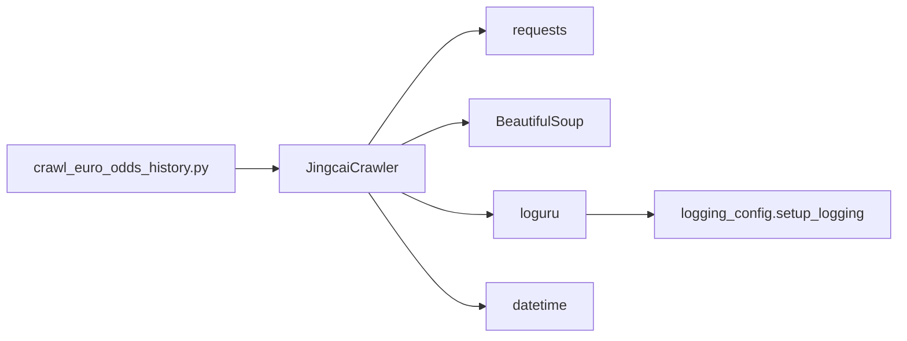

# 竞彩数据爬虫API

<cite>
**本文引用的文件**
- [src/crawler/jingcai_crawler.py](file://src/crawler/jingcai_crawler.py)
- [tests/test_jingcai.py](file://tests/test_jingcai.py)
- [src/logging_config.py](file://src/logging_config.py)
- [data/today_matches.json](file://data/today_matches.json)
- [data/reports/all_compared_matches.json](file://data/reports/all_compared_matches.json)
- [scripts/crawl_euro_odds_history.py](file://scripts/crawl_euro_odds_history.py)
</cite>

## 目录
1. [简介](#简介)
2. [项目结构](#项目结构)
3. [核心组件](#核心组件)
4. [架构总览](#架构总览)
5. [详细组件分析](#详细组件分析)
6. [依赖关系分析](#依赖关系分析)
7. [性能考量](#性能考量)
8. [故障排查指南](#故障排查指南)
9. [结论](#结论)
10. [附录](#附录)

## 简介
本文件面向竞彩数据爬虫API的使用者与维护者，系统化阐述 JingcaiCrawler 类的功能、接口规范与实现细节，涵盖今日赛事抓取、赛果抓取、历史赛事抓取三大核心方法。文档还解释竞彩官方网站的数据结构、HTML解析逻辑、赔率数据提取与格式转换流程，并提供参数说明、返回值格式、错误处理机制与使用示例，帮助读者在生产环境中安全、稳定地集成与扩展该爬虫模块。

## 项目结构
竞彩数据爬虫位于 src/crawler/jingcai_crawler.py，围绕竞彩官网（500彩票网）的竞彩足球页面进行数据抓取与解析。测试脚本 tests/test_jingcai.py 展示了另一种官方渠道（体育中心接口）的调用方式，可用于交叉验证或替代方案。日志系统通过 src/logging_config.py 初始化，确保运行期日志统一输出。示例数据文件 data/today_matches.json 与 data/reports/all_compared_matches.json 展示了抓取后的数据形态与下游应用的典型字段。

图表来源
- [src/crawler/jingcai_crawler.py:1-330](file://src/crawler/jingcai_crawler.py#L1-L330)
- [tests/test_jingcai.py:1-35](file://tests/test_jingcai.py#L1-L35)
- [src/logging_config.py:1-30](file://src/logging_config.py#L1-L30)
- [data/today_matches.json:1-120](file://data/today_matches.json#L1-L120)
- [data/reports/all_compared_matches.json:1-200](file://data/reports/all_compared_matches.json#L1-L200)
- [scripts/crawl_euro_odds_history.py:49-79](file://scripts/crawl_euro_odds_history.py#L49-L79)

章节来源
- [src/crawler/jingcai_crawler.py:1-330](file://src/crawler/jingcai_crawler.py#L1-L330)
- [tests/test_jingcai.py:1-35](file://tests/test_jingcai.py#L1-L35)
- [src/logging_config.py:1-30](file://src/logging_config.py#L1-L30)

## 核心组件
JingcaiCrawler 是竞彩数据爬虫的核心类，负责：
- 今日赛事抓取：获取竞彩足球页面的今日比赛列表与赔率（含不让球与让球两种玩法），并合并半全场赔率。
- 赛果抓取：按指定日期抓取已完成比赛的比分与时间，并可选抓取半全场赛果。
- 历史赛事抓取：从历史页面抓取指定日期已完赛的比赛，包含赔率与实际比分。

接口一览
- fetch_today_matches(target_date=None): 抓取今日赛事，返回列表，元素为字典，包含 fixture_id、match_num、league、home_team、away_team、match_time、odds（含 nspf、spf、rangqiu、可选 bqc）。
- fetch_match_results(target_date): 抓取指定日期的赛果，返回字典，键为 match_num，值为包含 score、match_time、home_team、away_team 的字典，必要时包含 bqc_result。
- fetch_history_matches(target_date): 抓取历史页面指定日期的已完赛比赛，返回列表，元素为字典，包含 fixture_id、match_num、league、home_team、away_team、match_time、actual_score、odds（含 nspf、spf、rangqiu）。

章节来源
- [src/crawler/jingcai_crawler.py:13-47](file://src/crawler/jingcai_crawler.py#L13-L47)
- [src/crawler/jingcai_crawler.py:150-231](file://src/crawler/jingcai_crawler.py#L150-L231)
- [src/crawler/jingcai_crawler.py:233-323](file://src/crawler/jingcai_crawler.py#L233-L323)

## 架构总览
JingcaiCrawler 的工作流分为三层：
- 请求层：使用 requests 发起 HTTP GET 请求，设置超时与编码（gb2312）。
- 解析层：使用 BeautifulSoup 解析 HTML，定位 tr.bet-tb-tr 行，提取 data-* 属性与赔率按钮数据。
- 数据层：构造标准化字典结构，合并半全场赔率，处理异常与空值，返回统一格式。

图表来源
- [src/crawler/jingcai_crawler.py:13-47](file://src/crawler/jingcai_crawler.py#L13-L47)
- [src/crawler/jingcai_crawler.py:49-120](file://src/crawler/jingcai_crawler.py#L49-L120)
- [src/crawler/jingcai_crawler.py:122-148](file://src/crawler/jingcai_crawler.py#L122-L148)

章节来源
- [src/crawler/jingcai_crawler.py:13-120](file://src/crawler/jingcai_crawler.py#L13-L120)
- [src/crawler/jingcai_crawler.py:122-148](file://src/crawler/jingcai_crawler.py#L122-L148)

## 详细组件分析

### JingcaiCrawler 类
- 成员变量
  - url：竞彩足球主页
  - headers：浏览器UA请求头
- 方法
  - fetch_today_matches(target_date=None)
  - _parse_html(html_text, target_date=None)
  - _parse_bqc_html(html_text)
  - fetch_match_results(target_date)
  - fetch_history_matches(target_date)

图表来源
- [src/crawler/jingcai_crawler.py:6-11](file://src/crawler/jingcai_crawler.py#L6-L11)
- [src/crawler/jingcai_crawler.py:13-323](file://src/crawler/jingcai_crawler.py#L13-L323)

章节来源
- [src/crawler/jingcai_crawler.py:6-11](file://src/crawler/jingcai_crawler.py#L6-L11)
- [src/crawler/jingcai_crawler.py:13-323](file://src/crawler/jingcai_crawler.py#L13-L323)

### 今日赛事抓取（fetch_today_matches）
- 功能：抓取竞彩足球今日比赛列表，合并半全场赔率。
- 参数
  - target_date：可选，支持字符串 'YYYY-MM-DD' 或 datetime.date 对象，默认为今天。
- 处理流程
  - 请求竞彩首页，解析 HTML，提取 tr.bet-tb-tr 行。
  - 通过 match_num 前缀与目标日期的星期映射，筛选当日比赛。
  - 提取 data-* 属性（fixture_id、match_num、league、home_team、away_team、match_time、match_date、rangqiu）。
  - 提取赔率按钮（data-type=nspf/spf），得到不让球与让球三值赔率。
  - 请求半全场页面，解析并合并 bqc 赔率字典。
- 返回值
  - list：每个元素为 dict，包含 fixture_id、match_num、league、home_team、away_team、match_time、odds（nspf、spf、rangqiu、可选 bqc）。
- 错误处理
  - HTTP 状态码非 200 返回空列表。
  - 异常捕获并记录警告，跳过出错行，保证健壮性。
- 时间处理
  - 支持传入字符串或 date 对象，内部转换为目标周几前缀，用于筛选 match_num 前缀。
- 示例
  - 调用：crawler.fetch_today_matches()
  - 输出：见 data/today_matches.json 的结构示例。

图表来源
- [src/crawler/jingcai_crawler.py:13-47](file://src/crawler/jingcai_crawler.py#L13-L47)
- [src/crawler/jingcai_crawler.py:49-120](file://src/crawler/jingcai_crawler.py#L49-L120)
- [src/crawler/jingcai_crawler.py:122-148](file://src/crawler/jingcai_crawler.py#L122-L148)

章节来源
- [src/crawler/jingcai_crawler.py:13-47](file://src/crawler/jingcai_crawler.py#L13-L47)
- [src/crawler/jingcai_crawler.py:49-120](file://src/crawler/jingcai_crawler.py#L49-L120)
- [src/crawler/jingcai_crawler.py:122-148](file://src/crawler/jingcai_crawler.py#L122-L148)
- [data/today_matches.json:1-120](file://data/today_matches.json#L1-L120)

### 赛果抓取（fetch_match_results）
- 功能：抓取指定日期已完成比赛的比分、时间与主客队名，可选抓取半全场赛果。
- 参数
  - target_date：字符串 'YYYY-MM-DD'
- 处理流程
  - 请求竞彩历史页面（带 date 参数），解析 HTML。
  - 通过 match_num 前缀筛选目标日期比赛。
  - 提取 score、match_time、home_team、away_team。
  - 额外请求半全场页面（playid=272），查找带有 betbtn-ok 类的 p 标签，提取 bqc_result。
- 返回值
  - dict：键为 match_num，值为包含 score、match_time、home_team、away_team、可选 bqc_result 的字典。
- 错误处理
  - HTTP 非 200 返回空字典。
  - 异常捕获并记录警告，不影响其他条目。
- 示例
  - 调用：crawler.fetch_match_results('2026-05-09')
  - 输出：与 data/reports/all_compared_matches.json 中的 raw_data 结构相似。

图表来源
- [src/crawler/jingcai_crawler.py:150-231](file://src/crawler/jingcai_crawler.py#L150-L231)

章节来源
- [src/crawler/jingcai_crawler.py:150-231](file://src/crawler/jingcai_crawler.py#L150-L231)
- [data/reports/all_compared_matches.json:1-200](file://data/reports/all_compared_matches.json#L1-L200)

### 历史赛事抓取（fetch_history_matches）
- 功能：从历史页面抓取指定日期已完赛的比赛，包含赔率与实际比分。
- 参数
  - target_date：字符串 'YYYY-MM-DD' 或 datetime.date
- 处理流程
  - 将 date 对象格式化为字符串，请求历史页面（playid=269, g=2）。
  - 解析 HTML，按 match_num 前缀筛选目标日期。
  - 提取 fixture_id、match_num、league、home_team、away_team、match_time、match_date、rangqiu。
  - 提取 actual_score（从 a.score 标签）。
  - 提取 nspf 与 spf 赔率（过滤掉标记为 betbtn-ok 的按钮，或取前3个）。
- 返回值
  - list：每个元素为 dict，包含 fixture_id、match_num、league、home_team、away_team、match_time、actual_score、odds（nspf、spf、rangqiu）。
- 错误处理
  - HTTP 非 200 返回空列表。
  - 异常捕获并记录警告，跳过出错行。
- 示例
  - 调用：crawler.fetch_history_matches('2026-05-09')
  - 输出：与 data/reports/all_compared_matches.json 中的 raw_data 结构相似。

图表来源
- [src/crawler/jingcai_crawler.py:233-323](file://src/crawler/jingcai_crawler.py#L233-L323)

章节来源
- [src/crawler/jingcai_crawler.py:233-323](file://src/crawler/jingcai_crawler.py#L233-L323)
- [data/reports/all_compared_matches.json:1-200](file://data/reports/all_compared_matches.json#L1-L200)

### HTML解析与数据提取逻辑
- 解析器：BeautifulSoup
- 关键选择器：tr.bet-tb-tr
- 数据来源：data-* 属性（fixture_id、match_num、simpleleague、homesxname、awaysxname、matchtime、matchdate、rangqiu、rfsf 等）
- 赔率来源：p[data-type='nspf'|'spf'|'bqc']，读取 data-sp 与 data-value
- 特殊处理：
  - display:none 的行跳过
  - 缺失或无效的赔率填充为 ['-', '-', '-']
  - 半全场 bqc 通过 data-value 与 data-sp 构建字典，按 fixture_id 合并

章节来源
- [src/crawler/jingcai_crawler.py:49-120](file://src/crawler/jingcai_crawler.py#L49-L120)
- [src/crawler/jingcai_crawler.py:122-148](file://src/crawler/jingcai_crawler.py#L122-L148)

### 数据字段说明
- 基础字段
  - fixture_id：比赛唯一标识
  - match_num：比赛编号（含日期前缀）
  - league：联赛名称
  - home_team：主队名称
  - away_team：客队名称
  - match_time：比赛时间（'YYYY-MM-DD HH:MM'）
- 赔率字段
  - odds.nspf：不让球三值赔率（胜/平/负）
  - odds.spf：让球三值赔率（让胜/让平/让负）
  - odds.rangqiu：让球数（字符串）
  - odds.bqc：半全场赔率字典（键为 '3-3','3-1',...）
- 赛果字段
  - actual_score：实际比分（如 '2:1'）
  - bqc_result：半全场结果（如 '1-3'）

章节来源
- [data/today_matches.json:1-120](file://data/today_matches.json#L1-L120)
- [data/reports/all_compared_matches.json:1-200](file://data/reports/all_compared_matches.json#L1-L200)
- [src/crawler/jingcai_crawler.py:300-313](file://src/crawler/jingcai_crawler.py#L300-L313)

### 时间处理逻辑与日期筛选机制
- 日期输入
  - 支持字符串 'YYYY-MM-DD' 与 datetime.date 对象
- 星期映射
  - 将目标日期映射为英文星期，再映射为中文前缀（周一至周日）
- 前缀筛选
  - 仅保留 match_num 以目标前缀开头的比赛
- 历史页面
  - 历史页面 URL 通过 date 参数传递目标日期

章节来源
- [src/crawler/jingcai_crawler.py:53-66](file://src/crawler/jingcai_crawler.py#L53-L66)
- [src/crawler/jingcai_crawler.py:171-177](file://src/crawler/jingcai_crawler.py#L171-L177)
- [src/crawler/jingcai_crawler.py:255-261](file://src/crawler/jingcai_crawler.py#L255-L261)

### 异常情况处理方法
- HTTP 请求异常
  - 状态码非 200：记录错误并返回空容器（列表或字典）
- 解析异常
  - 单行解析失败：记录警告并跳过该行
- 半全场抓取失败
  - 半全场页面异常：记录警告并继续返回已有数据
- 日志
  - 使用 loguru 记录 INFO 级别日志，输出到终端与文件（按天轮转，保留7天）

章节来源
- [src/crawler/jingcai_crawler.py:20-47](file://src/crawler/jingcai_crawler.py#L20-L47)
- [src/crawler/jingcai_crawler.py:159-231](file://src/crawler/jingcai_crawler.py#L159-L231)
- [src/crawler/jingcai_crawler.py:245-323](file://src/crawler/jingcai_crawler.py#L245-L323)
- [src/logging_config.py:1-30](file://src/logging_config.py#L1-L30)

### 使用示例
- 今日赛事
  - crawler = JingcaiCrawler()
  - today_matches = crawler.fetch_today_matches()
  - print(today_matches[0])
- 指定日期赛果
  - results = crawler.fetch_match_results('2026-05-09')
  - print(results.get('周六001'))
- 历史数据
  - history = crawler.fetch_history_matches('2026-05-09')
  - print(history[0])

章节来源
- [src/crawler/jingcai_crawler.py:325-330](file://src/crawler/jingcai_crawler.py#L325-L330)

## 依赖关系分析
- 外部依赖
  - requests：HTTP 请求
  - BeautifulSoup：HTML 解析
  - loguru：日志记录
  - datetime：日期与时间处理
- 内部依赖
  - logging_config.setup_logging：统一日志初始化
  - scripts/crawl_euro_odds_history.py：历史数据抓取脚本中调用 fetch_history_matches

图表来源
- [src/crawler/jingcai_crawler.py:1-11](file://src/crawler/jingcai_crawler.py#L1-L11)
- [src/logging_config.py:1-30](file://src/logging_config.py#L1-L30)
- [scripts/crawl_euro_odds_history.py:58-61](file://scripts/crawl_euro_odds_history.py#L58-L61)

章节来源
- [src/crawler/jingcai_crawler.py:1-11](file://src/crawler/jingcai_crawler.py#L1-L11)
- [src/logging_config.py:1-30](file://src/logging_config.py#L1-L30)
- [scripts/crawl_euro_odds_history.py:49-79](file://scripts/crawl_euro_odds_history.py#L49-L79)

## 性能考量
- 超时设置：每次请求设置超时 15 秒，避免阻塞。
- 编码处理：显式设置响应编码为 gb2312，确保中文字符正确解析。
- 解析范围：仅解析 tr.bet-tb-tr 行，减少 DOM 遍历成本。
- 合并策略：半全场数据通过 fixture_id 合并，避免重复请求。
- 日志轮转：按天轮转，避免日志文件过大。

[本节为通用建议，无需特定文件引用]

## 故障排查指南
- 网络问题
  - 检查网络连通性与代理设置
  - 观察日志中的 HTTP 状态码与异常堆栈
- 编码问题
  - 确认 response.encoding 已设置为 'gb2312'
  - 如仍乱码，检查服务器返回的 Content-Type 与实际编码
- 解析失败
  - 检查 HTML 结构是否发生变化（tr.bet-tb-tr 是否仍然存在）
  - 检查 data-* 属性是否缺失或命名变更
- 数据为空
  - 确认 target_date 是否为有效日期
  - 确认 match_num 前缀与目标日期星期映射是否一致
- 日志定位
  - 查看 logs/app.log 文件，定位错误发生位置与上下文

章节来源
- [src/crawler/jingcai_crawler.py:20-47](file://src/crawler/jingcai_crawler.py#L20-L47)
- [src/logging_config.py:1-30](file://src/logging_config.py#L1-L30)

## 结论
JingcaiCrawler 提供了稳定、可扩展的竞彩数据抓取能力，覆盖今日赛事、赛果与历史数据三大场景。通过 BeautifulSoup 精准解析 HTML，结合半全场数据合并与严格的异常处理，确保在竞彩网站结构变化时仍能保持较高的可用性。配合统一的日志系统与清晰的接口规范，开发者可以快速集成并扩展到更复杂的预测与风控场景。

[本节为总结，无需特定文件引用]

## 附录
- 交叉验证
  - tests/test_jingcai.py 展示了另一种官方渠道（体育中心接口）的调用方式，可用于数据交叉验证。
- 历史数据抓取脚本
  - scripts/crawl_euro_odds_history.py 展示了如何使用 fetch_history_matches 进行历史欧赔数据抓取与处理。

章节来源
- [tests/test_jingcai.py:1-35](file://tests/test_jingcai.py#L1-L35)
- [scripts/crawl_euro_odds_history.py:49-79](file://scripts/crawl_euro_odds_history.py#L49-L79)