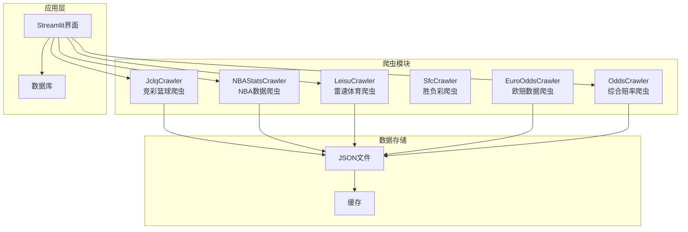
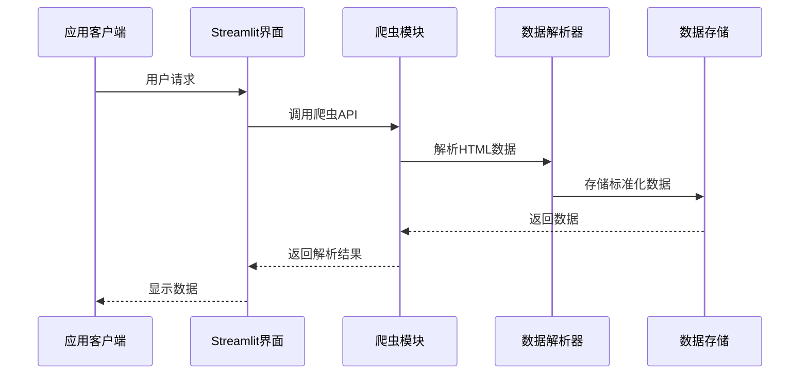
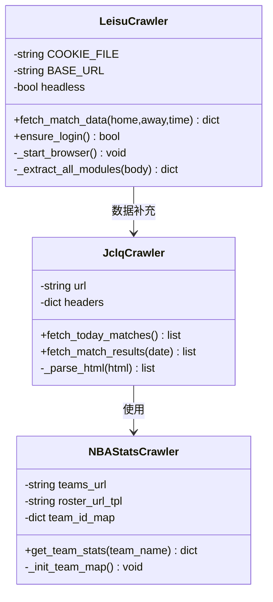
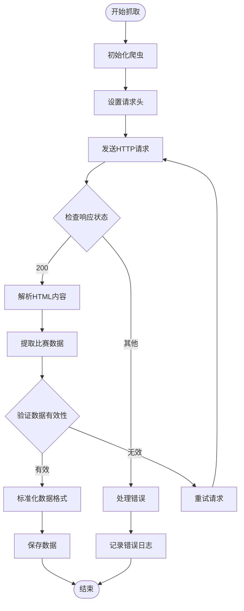
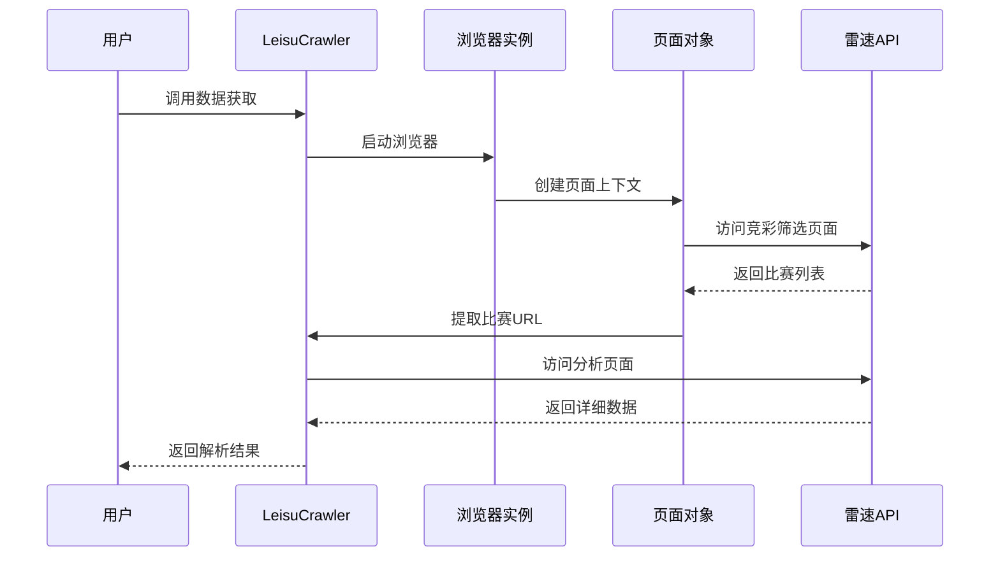
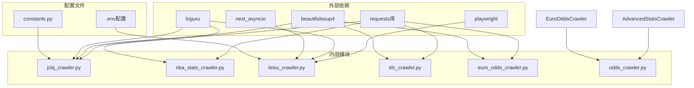
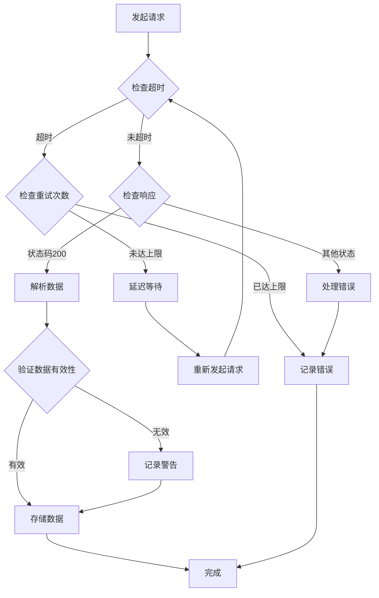

# 竞彩篮球数据爬虫API

<cite>
**本文档引用的文件**
- [jclq_crawler.py](file://src/crawler/jclq_crawler.py)
- [nba_stats_crawler.py](file://src/crawler/nba_stats_crawler.py)
- [leisu_crawler.py](file://src/crawler/leisu_crawler.py)
- [sfc_crawler.py](file://src/crawler/sfc_crawler.py)
- [euro_odds_crawler.py](file://src/crawler/euro_odds_crawler.py)
- [odds_crawler.py](file://src/crawler/odds_crawler.py)
- [3_Basketball.py](file://src/pages/3_Basketball.py)
- [.env](file://config/.env)
- [today_bball_matches.json](file://data/today_bball_matches.json)
- [test_leisu.py](file://scripts/test_leisu.py)
</cite>

## 目录
1. [项目概述](#项目概述)
2. [项目结构](#项目结构)
3. [核心组件](#核心组件)
4. [架构概览](#架构概览)
5. [详细组件分析](#详细组件分析)
6. [依赖关系分析](#依赖关系分析)
7. [性能考虑](#性能考虑)
8. [故障排除指南](#故障排除指南)
9. [结论](#结论)

## 项目概述

本项目是一个专门针对竞彩篮球数据的爬虫API系统，主要负责从500彩票网等数据源抓取竞彩篮球赛事信息，包括NBA比赛数据、赔率信息、比赛结果查询等功能。该系统采用模块化设计，支持多种数据源和数据格式，为后续的机器学习预测模型提供高质量的数据基础。

## 项目结构

**图表来源**
- [jclq_crawler.py:1-264](file://src/crawler/jclq_crawler.py#L1-L264)
- [nba_stats_crawler.py:1-133](file://src/crawler/nba_stats_crawler.py#L1-L133)
- [leisu_crawler.py:1-609](file://src/crawler/leisu_crawler.py#L1-L609)

**章节来源**
- [jclq_crawler.py:1-264](file://src/crawler/jclq_crawler.py#L1-L264)
- [nba_stats_crawler.py:1-133](file://src/crawler/nba_stats_crawler.py#L1-L133)
- [leisu_crawler.py:1-609](file://src/crawler/leisu_crawler.py#L1-L609)

## 核心组件

### 竞彩篮球爬虫 (JclqCrawler)

JclqCrawler是系统的核心组件，专门负责从500彩票网抓取竞彩篮球数据。该组件支持以下功能：

- **今日赛事抓取**：获取当天可购买的竞彩篮球赛事数据
- **历史赛果查询**：支持指定日期的历史比赛结果抓取
- **数据解析**：自动解析HTML页面中的比赛信息和赔率数据
- **数据标准化**：将不同格式的数据统一为标准结构

### NBA数据爬虫 (NBAStatsCrawler)

NBAStatsCrawler专注于获取NBA球队的详细统计数据：

- **球队映射**：维护ESPN API的球队ID映射关系
- **伤停信息**：获取球队的伤停情况和球员状态
- **战绩统计**：获取球队的近期战绩和排名信息
- **数据翻译**：将英文数据翻译为中文便于理解

### 雷速体育爬虫 (LeisuCrawler)

LeisuCrawler提供专业的体育数据分析服务：

- **浏览器自动化**：使用Playwright进行网页自动化操作
- **数据提取**：从雷速体育网站提取详细的球队和比赛数据
- **情报分析**：获取球队的SWOT分析和战术情报
- **多线程支持**：支持并发抓取多个比赛数据

**章节来源**
- [jclq_crawler.py:6-264](file://src/crawler/jclq_crawler.py#L6-L264)
- [nba_stats_crawler.py:6-133](file://src/crawler/nba_stats_crawler.py#L6-L133)
- [leisu_crawler.py:18-609](file://src/crawler/leisu_crawler.py#L18-L609)

## 架构概览

**图表来源**
- [3_Basketball.py:194-247](file://src/pages/3_Basketball.py#L194-L247)
- [jclq_crawler.py:14-32](file://src/crawler/jclq_crawler.py#L14-L32)

系统采用分层架构设计，每个爬虫模块都有明确的职责分工，通过统一的接口为上层应用提供数据服务。

## 详细组件分析

### 竞彩篮球爬虫详细分析

#### 类结构设计

**图表来源**
- [jclq_crawler.py:6-138](file://src/crawler/jclq_crawler.py#L6-L138)
- [nba_stats_crawler.py:6-125](file://src/crawler/nba_stats_crawler.py#L6-L125)
- [leisu_crawler.py:18-322](file://src/crawler/leisu_crawler.py#L18-L322)

#### 数据抓取流程

**图表来源**
- [jclq_crawler.py:14-32](file://src/crawler/jclq_crawler.py#L14-L32)
- [jclq_crawler.py:33-138](file://src/crawler/jclq_crawler.py#L33-L138)

#### 竞彩篮球数据格式

系统支持多种竞彩篮球数据格式：

| 数据类型 | 字段说明 | 示例值 |
|---------|----------|--------|
| 基本信息 | fixture_id | 2038984 |
| 基本信息 | match_num | 周五301 |
| 基本信息 | league | 欧篮联 |
| 基本信息 | home_team | 巴萨 |
| 基本信息 | away_team | 摩纳哥 |
| 基本信息 | match_time | 2026-04-11 01:30 |
| 胜负盘 | sf | ["1.94", "1.51"] |
| 让分盘 | rfsf | ["1.81", "1.60"] |
| 大小分盘 | dxf | ["1.66", "1.74"] |
| 让分值 | rangfen | "-2.5" |
| 预设总分 | yszf | "170.5" |

**章节来源**
- [jclq_crawler.py:117-131](file://src/crawler/jclq_crawler.py#L117-L131)
- [today_bball_matches.json:1-589](file://data/today_bball_matches.json#L1-L589)

### NBA数据爬虫详细分析

#### 球队映射机制

NBAStatsCrawler实现了复杂的球队名称映射系统：

**图表来源**
- [nba_stats_crawler.py:12-70](file://src/crawler/nba_stats_crawler.py#L12-L70)
- [nba_stats_crawler.py:71-125](file://src/crawler/nba_stats_crawler.py#L71-L125)

#### 伤停数据处理

系统能够处理多种类型的伤停信息：

| 英文状态 | 中文描述 | 处理方式 |
|---------|----------|----------|
| Out | 缺阵 | 标记为重要伤停 |
| Day-to-day | 出战成疑 | 标记为不确定 |
| Suspension | 禁赛 | 标记为临时缺阵 |
| Healthy | 健康 | 标记为可出战 |

**章节来源**
- [nba_stats_crawler.py:86-125](file://src/crawler/nba_stats_crawler.py#L86-L125)

### 雷速体育爬虫详细分析

#### 浏览器自动化架构

LeisuCrawler采用了先进的浏览器自动化技术：

**图表来源**
- [leisu_crawler.py:284-322](file://src/crawler/leisu_crawler.py#L284-L322)
- [leisu_crawler.py:323-408](file://src/crawler/leisu_crawler.py#L323-L408)

#### 数据提取模块

系统支持多种数据模块的提取：

| 模块名称 | 功能描述 | 提取内容 |
|---------|----------|----------|
| 历史交锋 | 球队历史对战记录 | 比分统计、交锋趋势 |
| 近期战绩 | 球队近期比赛表现 | 最近10场胜负记录 |
| 联赛积分 | 球队在联赛中的排名 | 积分、排名、胜平负统计 |
| 进球分布 | 球队进攻效率分析 | 各时间段进球分布 |
| 伤停情况 | 球员伤停状态 | 伤停名单、停赛信息 |
| 半全场胜负 | 比赛半场和全场结果 | 半全场胜负统计 |

**章节来源**
- [leisu_crawler.py:410-460](file://src/crawler/leisu_crawler.py#L410-L460)
- [test_leisu.py:76-121](file://scripts/test_leisu.py#L76-L121)

## 依赖关系分析

**图表来源**
- [jclq_crawler.py:1-5](file://src/crawler/jclq_crawler.py#L1-L5)
- [leisu_crawler.py:1-16](file://src/crawler/leisu_crawler.py#L1-L16)
- [nba_stats_crawler.py:1-5](file://src/crawler/nba_stats_crawler.py#L1-L5)

### 数据源特点对比

| 特性 | 500彩票网 | ESPN API | 雷速体育 | 胜负彩 |
|------|-----------|----------|----------|--------|
| 数据类型 | 竞彩赔率 | 球队统计 | 战术分析 | 足球数据 |
| 更新频率 | 实时 | 实时 | 实时 | 周期性 |
| 数据精度 | 高 | 高 | 中等 | 高 |
| 抓取难度 | 中等 | 低 | 高 | 低 |
| 适用场景 | 赔率分析 | 球队统计 | 战术研究 | 足球分析 |

**章节来源**
- [jclq_crawler.py:1-12](file://src/crawler/jclq_crawler.py#L1-L12)
- [nba_stats_crawler.py:7-11](file://src/crawler/nba_stats_crawler.py#L7-L11)
- [leisu_crawler.py:23-27](file://src/crawler/leisu_crawler.py#L23-L27)

## 性能考虑

### 并发处理机制

系统采用多线程和异步处理来提高数据抓取效率：

- **线程池管理**：LeisuCrawler使用专用线程池处理Playwright操作
- **请求超时控制**：所有HTTP请求设置合理的超时时间
- **重试机制**：网络请求失败时自动重试，避免数据丢失
- **缓存策略**：使用Streamlit的缓存机制减少重复请求

### 错误处理策略

**图表来源**
- [jclq_crawler.py:19-31](file://src/crawler/jclq_crawler.py#L19-L31)
- [leisu_crawler.py:42-56](file://src/crawler/leisu_crawler.py#L42-L56)

## 故障排除指南

### 常见问题及解决方案

| 问题类型 | 症状描述 | 解决方案 |
|----------|----------|----------|
| 网络连接失败 | 请求超时或连接错误 | 检查网络连接，增加超时时间 |
| 数据解析错误 | HTML结构变化导致解析失败 | 更新解析规则，增加异常处理 |
| API限制 | 请求被拒绝或IP被封 | 添加延时，使用代理IP |
| 数据格式不兼容 | 不同数据源格式差异 | 实现数据标准化转换 |
| 浏览器启动失败 | Playwright初始化错误 | 检查Chrome版本，更新依赖包 |

### 调试工具使用

系统提供了多种调试工具来帮助问题排查：

- **日志系统**：使用Loguru记录详细的执行日志
- **测试脚本**：提供独立的测试脚本来验证功能
- **数据验证**：自动验证抓取数据的完整性和准确性
- **错误监控**：实时监控爬虫运行状态和错误率

**章节来源**
- [test_leisu.py:1-129](file://scripts/test_leisu.py#L1-L129)
- [jclq_crawler.py:19-31](file://src/crawler/jclq_crawler.py#L19-L31)

## 结论

竞彩篮球数据爬虫API系统通过模块化的设计和多种数据源的集成，为篮球数据分析提供了全面的技术支持。系统的主要优势包括：

1. **多数据源支持**：整合了500彩票网、ESPN、雷速体育等多个权威数据源
2. **灵活的数据处理**：支持多种数据格式的标准化和转换
3. **稳定的错误处理**：完善的异常处理和重试机制
4. **高性能并发**：采用多线程和异步技术提高数据抓取效率
5. **友好的用户界面**：基于Streamlit的可视化界面便于使用

该系统为后续的机器学习预测模型提供了高质量、多样化的数据基础，是构建智能体育预测系统的基础设施。