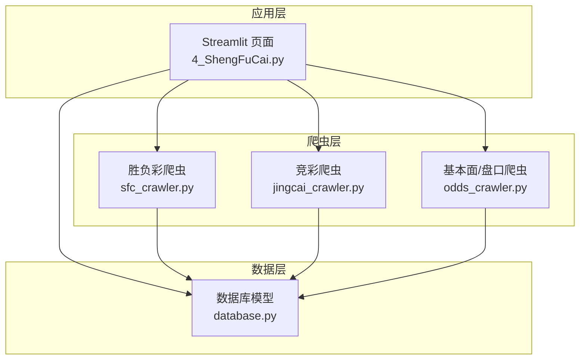
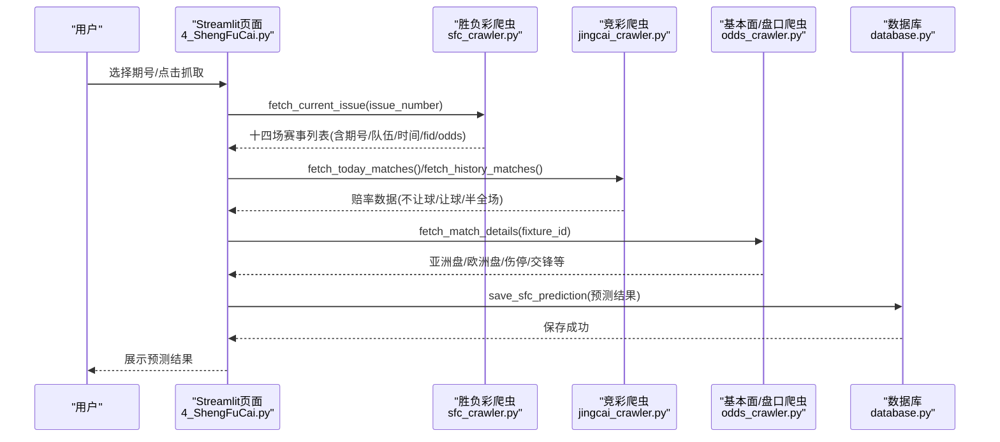
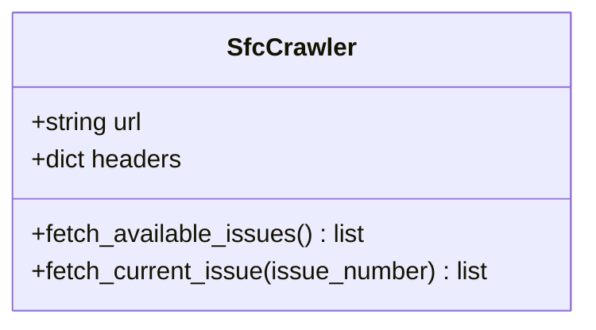
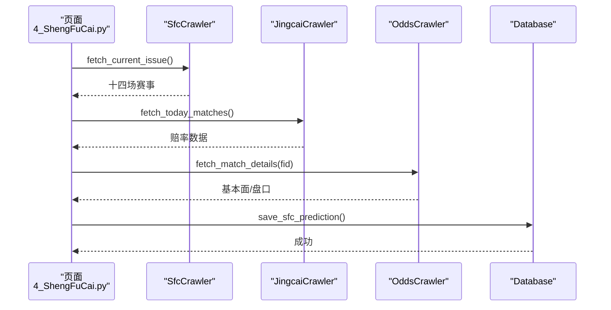
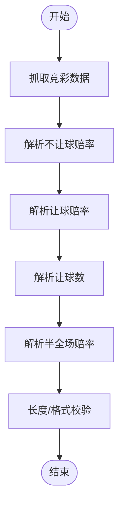
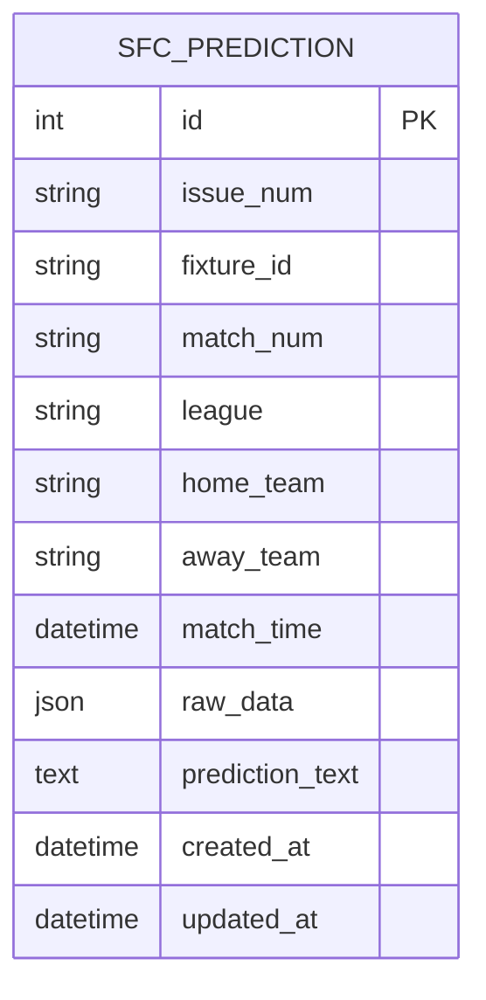
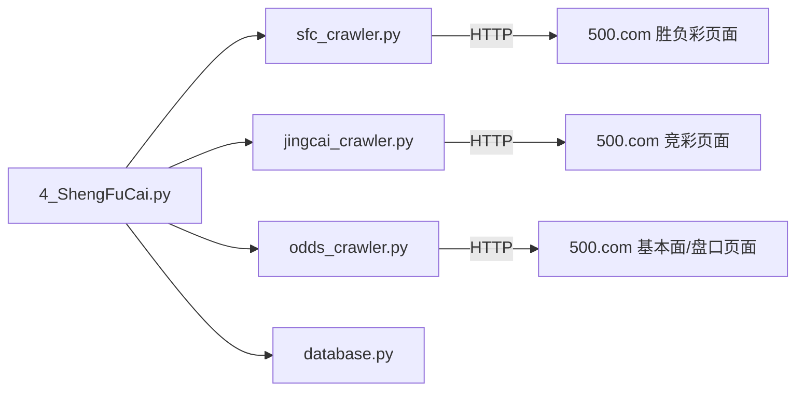

# 胜负彩数据爬虫API

<cite>
**本文引用的文件**
- [sfc_crawler.py](file://src/crawler/sfc_crawler.py)
- [4_ShengFuCai.py](file://src/pages/4_ShengFuCai.py)
- [database.py](file://src/db/database.py)
- [odds_crawler.py](file://src/crawler/odds_crawler.py)
- [jingcai_crawler.py](file://src/crawler/jingcai_crawler.py)
- [test_sfc_issue.py](file://scripts/test_sfc_issue.py)
- [constants.py](file://src/constants.py)
- [test_jingcai.py](file://tests/test_jingcai.py)
</cite>

## 目录
1. [简介](#简介)
2. [项目结构](#项目结构)
3. [核心组件](#核心组件)
4. [架构总览](#架构总览)
5. [详细组件分析](#详细组件分析)
6. [依赖分析](#依赖分析)
7. [性能考虑](#性能考虑)
8. [故障排查指南](#故障排查指南)
9. [结论](#结论)
10. [附录](#附录)

## 简介
本文件面向“胜负彩数据爬虫API”的使用者与维护者，系统化阐述 sfc_crawler 模块的功能边界、接口规范、数据结构与解析流程，覆盖以下能力：
- 官方数据抓取：从胜负彩官网抓取期号列表与当前期十四场赛事清单
- 开奖结果查询：通过竞彩历史接口获取已完成比赛的赛果与赔率
- 投注规则解析：解析不让球与让球的胜平负赔率及让球数
- 历史开奖记录：整合历史数据以支撑回测与模型优化
- 数据验证与清洗：对网页结构、字段完整性与类型进行校验
- 数据持久化：将胜负彩预测结果写入SQLite数据库

本API在Streamlit页面中作为前端入口，结合赔率抓取器与LLM预测器，形成“数据采集—特征融合—智能预测—结果入库”的完整链路。

## 项目结构
围绕胜负彩数据爬取与预测的关键文件组织如下：
- 爬虫层
  - sfc_crawler.py：胜负彩官网数据抓取与解析
  - odds_crawler.py：基本面与盘口数据抓取（亚洲盘、欧洲盘、伤停等）
  - jingcai_crawler.py：竞彩历史/当日数据抓取（含半全场）
- 应用层
  - 4_ShengFuCai.py：Streamlit页面，负责期号选择、数据抓取、预测执行与结果展示
- 数据层
  - database.py：SQLite模型定义与胜负彩预测结果的增删改查
- 测试与辅助
  - test_sfc_issue.py：期号抓取测试脚本
  - constants.py：全局常量（如鉴权Token有效期）

**图表来源**
- [4_ShengFuCai.py:13-56](file://src/pages/4_ShengFuCai.py#L13-L56)
- [sfc_crawler.py:7-139](file://src/crawler/sfc_crawler.py#L7-L139)
- [odds_crawler.py:9-161](file://src/crawler/odds_crawler.py#L9-L161)
- [jingcai_crawler.py:6-47](file://src/crawler/jingcai_crawler.py#L6-L47)
- [database.py:127-146](file://src/db/database.py#L127-L146)

**章节来源**
- [4_ShengFuCai.py:13-56](file://src/pages/4_ShengFuCai.py#L13-L56)
- [sfc_crawler.py:7-139](file://src/crawler/sfc_crawler.py#L7-L139)
- [odds_crawler.py:9-161](file://src/crawler/odds_crawler.py#L9-L161)
- [jingcai_crawler.py:6-47](file://src/crawler/jingcai_crawler.py#L6-L47)
- [database.py:127-146](file://src/db/database.py#L127-L146)

## 核心组件
- SfcCrawler（胜负彩爬虫）
  - 功能：抓取期号列表；抓取当前期十四场赛事；解析期号、队伍、时间、fid等字段
  - 关键接口：fetch_available_issues(), fetch_current_issue(issue_number)
- JingcaiCrawler（竞彩爬虫）
  - 功能：抓取当日/历史竞彩数据，解析不让球与让球赔率、让球数、半全场赔率
  - 关键接口：fetch_today_matches(), fetch_history_matches(), fetch_match_results()
- OddsCrawler（基本面/盘口爬虫）
  - 功能：抓取亚洲盘、欧洲盘、近期战绩、交锋历史、伤停等
  - 关键接口：fetch_match_details(fixture_id, home_team, away_team)
- Database（数据库）
  - 功能：定义胜负彩预测模型，提供保存/查询接口
  - 关键接口：save_sfc_prediction(), get_sfc_prediction()

**章节来源**
- [sfc_crawler.py:14-139](file://src/crawler/sfc_crawler.py#L14-L139)
- [jingcai_crawler.py:13-323](file://src/crawler/jingcai_crawler.py#L13-L323)
- [odds_crawler.py:17-161](file://src/crawler/odds_crawler.py#L17-L161)
- [database.py:127-146](file://src/db/database.py#L127-L146)

## 架构总览
胜负彩数据爬取与预测的整体流程如下：

**图表来源**
- [4_ShengFuCai.py:36-56](file://src/pages/4_ShengFuCai.py#L36-L56)
- [sfc_crawler.py:37-139](file://src/crawler/sfc_crawler.py#L37-L139)
- [odds_crawler.py:17-161](file://src/crawler/odds_crawler.py#L17-L161)
- [jingcai_crawler.py:13-47](file://src/crawler/jingcai_crawler.py#L13-L47)
- [database.py:374-420](file://src/db/database.py#L374-L420)

## 详细组件分析

### SfcCrawler 组件分析
- 职责
  - 从胜负彩官网抓取期号列表与当前期十四场赛事
  - 解析期号、联赛、对阵、开赛时间、fid、以及占位的 odds 字典
- 关键实现要点
  - 请求头设置 User-Agent，编码使用 gb2312
  - 期号解析优先级：显式传入 > 页面选中项 > 备用方案
  - 赛事表解析基于 id="vsTable" 的表格，逐行提取 td 内容
  - fid 通过 href 中的正则匹配提取
- 错误处理
  - 状态码非 200 返回空列表
  - 异常捕获并记录日志，避免中断流程
- 输出数据结构
  - 列表元素为字典，包含 match_num、league、home_team、away_team、match_time、fixture_id、issue_num、odds

**图表来源**
- [sfc_crawler.py:7-139](file://src/crawler/sfc_crawler.py#L7-L139)

**章节来源**
- [sfc_crawler.py:14-139](file://src/crawler/sfc_crawler.py#L14-L139)

### Streamlit 页面集成分析
- 功能
  - 提供期号下拉选择与“抓取/刷新/一键预测”等交互
  - 调用 SfcCrawler 获取十四场赛事，尝试合并竞彩赔率，调用 LLMPredictor 进行预测，保存至数据库
- 关键流程
  - 缓存期号与数据，降低重复抓取压力
  - 对每场比赛：若存在 fixture_id，则抓取基本面与盘口；随后执行预测并入库
  - 支持强制刷新缓存与重新预测

**图表来源**
- [4_ShengFuCai.py:29-86](file://src/pages/4_ShengFuCai.py#L29-L86)
- [sfc_crawler.py:37-139](file://src/crawler/sfc_crawler.py#L37-L139)
- [odds_crawler.py:17-161](file://src/crawler/odds_crawler.py#L17-L161)
- [jingcai_crawler.py:13-47](file://src/crawler/jingcai_crawler.py#L13-L47)
- [database.py:374-420](file://src/db/database.py#L374-L420)

**章节来源**
- [4_ShengFuCai.py:29-86](file://src/pages/4_ShengFuCai.py#L29-L86)

### 投注规则解析与历史数据
- 不让球与让球赔率
  - 不让球：胜/平/负三档赔率
  - 让球：胜/平/负三档赔率，配合让球数
  - 半全场（BQC）：9种组合的赔率映射
- 历史数据抓取
  - 通过竞彩历史接口，按日期拉取已完成比赛的赛果与赔率
  - 支持额外抓取半全场赛果，便于回测
- 数据验证
  - 赔率长度校验，不足3项补“-”
  - 让球数默认值为“0”

**图表来源**
- [jingcai_crawler.py:49-120](file://src/crawler/jingcai_crawler.py#L49-L120)
- [jingcai_crawler.py:233-323](file://src/crawler/jingcai_crawler.py#L233-L323)

**章节来源**
- [jingcai_crawler.py:49-120](file://src/crawler/jingcai_crawler.py#L49-L120)
- [jingcai_crawler.py:233-323](file://src/crawler/jingcai_crawler.py#L233-L323)

### 数据持久化与模型
- 胜负彩预测模型
  - 字段：issue_num、fixture_id、match_num、league、home_team、away_team、match_time、raw_data、prediction_text
  - 提供按期号与比赛编号查询与保存
- 数据库初始化
  - 自动创建表，支持SQLite路径与目录存在性保障

**图表来源**
- [database.py:127-146](file://src/db/database.py#L127-L146)

**章节来源**
- [database.py:127-146](file://src/db/database.py#L127-L146)
- [database.py:374-420](file://src/db/database.py#L374-L420)

## 依赖分析
- 组件耦合
  - 4_ShengFuCai.py 依赖 SfcCrawler、JingcaiCrawler、OddsCrawler、Database
  - SfcCrawler 仅依赖 requests、BeautifulSoup、re、datetime、loguru
  - Database 依赖 SQLAlchemy 与 SQLite
- 外部依赖
  - 500彩票网：胜负彩与竞彩页面结构
  - 可选：外部API（如竞彩官方接口）用于补充数据

**图表来源**
- [4_ShengFuCai.py:13-56](file://src/pages/4_ShengFuCai.py#L13-L56)
- [sfc_crawler.py:8-12](file://src/crawler/sfc_crawler.py#L8-L12)
- [jingcai_crawler.py:7-11](file://src/crawler/jingcai_crawler.py#L7-L11)
- [odds_crawler.py:10-15](file://src/crawler/odds_crawler.py#L10-L15)

**章节来源**
- [4_ShengFuCai.py:13-56](file://src/pages/4_ShengFuCai.py#L13-L56)
- [sfc_crawler.py:8-12](file://src/crawler/sfc_crawler.py#L8-L12)
- [jingcai_crawler.py:7-11](file://src/crawler/jingcai_crawler.py#L7-L11)
- [odds_crawler.py:10-15](file://src/crawler/odds_crawler.py#L10-L15)

## 性能考虑
- 请求超时与编码
  - 设置超时阈值，统一编码为 gb2312，避免乱码
- 缓存策略
  - Streamlit 缓存期号与数据，减少重复抓取
- 并发与节流
  - 页面内对预测过程添加延时，避免请求过快
- 数据清洗
  - 对赔率长度与格式进行校验，缺失值填充默认值

[本节为通用建议，无需特定文件引用]

## 故障排查指南
- 期号抓取失败
  - 检查网络连通性与页面结构变更
  - 参考测试脚本定位 data-expect 属性与 select#expect
- 赛事列表为空
  - 确认期号有效；检查 vsTable 是否存在；确认 td 数量与结构
- 赔率缺失
  - 竞彩页面可能未提供或隐藏；检查按钮 data-type 与 data-sp
- 数据库保存失败
  - 检查 issue_num 与 match_num 是否为空；确认 SQLite 文件路径与权限

**章节来源**
- [test_sfc_issue.py:1-28](file://scripts/test_sfc_issue.py#L1-L28)
- [sfc_crawler.py:80-139](file://src/crawler/sfc_crawler.py#L80-L139)
- [jingcai_crawler.py:91-113](file://src/crawler/jingcai_crawler.py#L91-L113)
- [database.py:374-420](file://src/db/database.py#L374-L420)

## 结论
sfc_crawler 模块提供了从胜负彩官网稳定抓取期号与十四场赛事的能力，并与竞彩与基本面爬虫协同，形成完整的数据采集与预测链路。通过数据库模型与Streamlit页面，实现了从数据到结果的闭环管理。建议持续关注500彩票网页面结构变化，完善异常处理与数据校验，以提升鲁棒性与准确性。

[本节为总结性内容，无需特定文件引用]

## 附录

### 接口规范与数据格式

- SfcCrawler.fetch_available_issues()
  - 输入：无
  - 输出：期号字符串列表（去重且保持顺序）
  - 典型返回：["26069", "26068", ...]

- SfcCrawler.fetch_current_issue(issue_number=None)
  - 输入：期号（可选）
  - 输出：十四场赛事列表，每项包含：
    - match_num、league、home_team、away_team、match_time、fixture_id、issue_num、odds
  - 典型字段类型：字符串/字符串/字符串/字符串/字符串/字符串/字符串/字典

- JingcaiCrawler.fetch_today_matches()/fetch_history_matches()
  - 输出：每场比赛包含：
    - fixture_id、match_num、league、home_team、away_team、match_time、odds
  - odds 内容：nspf（3项）、spf（3项）、rangqiu（字符串，默认"0"）、可选 bqc（半全场映射）

- Database.save_sfc_prediction(match_data)
  - 输入：包含 issue_num、match_num、raw_data、prediction_text 等字段的字典
  - 输出：布尔值（保存成功/失败）

**章节来源**
- [sfc_crawler.py:14-139](file://src/crawler/sfc_crawler.py#L14-L139)
- [jingcai_crawler.py:13-323](file://src/crawler/jingcai_crawler.py#L13-L323)
- [database.py:374-420](file://src/db/database.py#L374-L420)

### 网站数据结构与解析要点
- 期号来源
  - 通过页面链接的 data-expect 属性与 select#expect 获取
- 赛事表结构
  - 表格 id="vsTable"，行 class="bet-tb-tr"，td 数量应≥8
- fid 提取
  - 通过 td 内 a[href*="shuju-*.shtml"] 的 href 正则匹配
- 赔率按钮
  - 不让球：data-type="nspf"；让球：data-type="spf"；半全场：data-type="bqc"

**章节来源**
- [sfc_crawler.py:80-139](file://src/crawler/sfc_crawler.py#L80-L139)
- [test_sfc_issue.py:14-27](file://scripts/test_sfc_issue.py#L14-L27)
- [jingcai_crawler.py:91-113](file://src/crawler/jingcai_crawler.py#L91-L113)

### 配置与运行
- 运行入口
  - 直接运行 sfc_crawler.py 可输出抓取的前几场比赛示例
- 页面入口
  - 在 Streamlit 中访问“足彩十四场预测”页面，选择期号后抓取与预测
- 常量
  - AUTH_TOKEN_TTL：鉴权Token有效期（秒）

**章节来源**
- [sfc_crawler.py:141-145](file://src/crawler/sfc_crawler.py#L141-L145)
- [4_ShengFuCai.py:91-125](file://src/pages/4_ShengFuCai.py#L91-L125)
- [constants.py:3-4](file://src/constants.py#L3-L4)