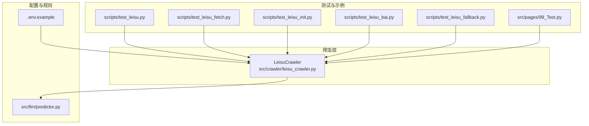
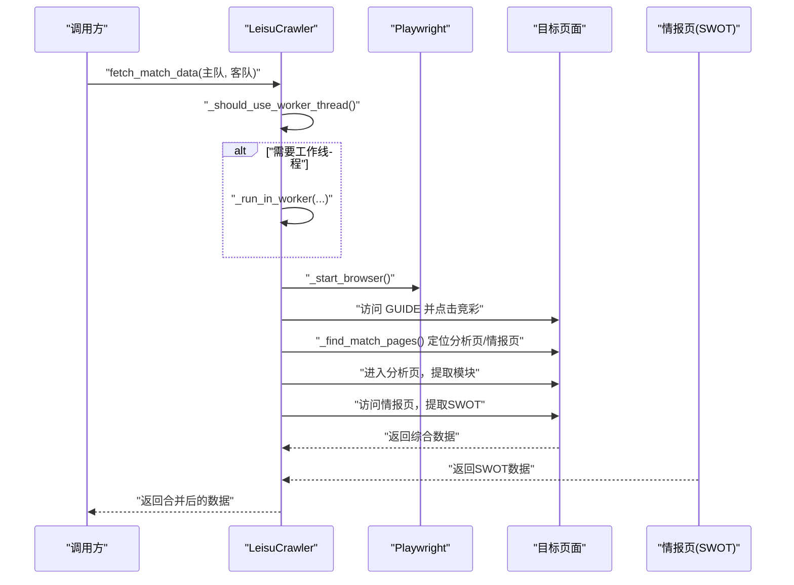
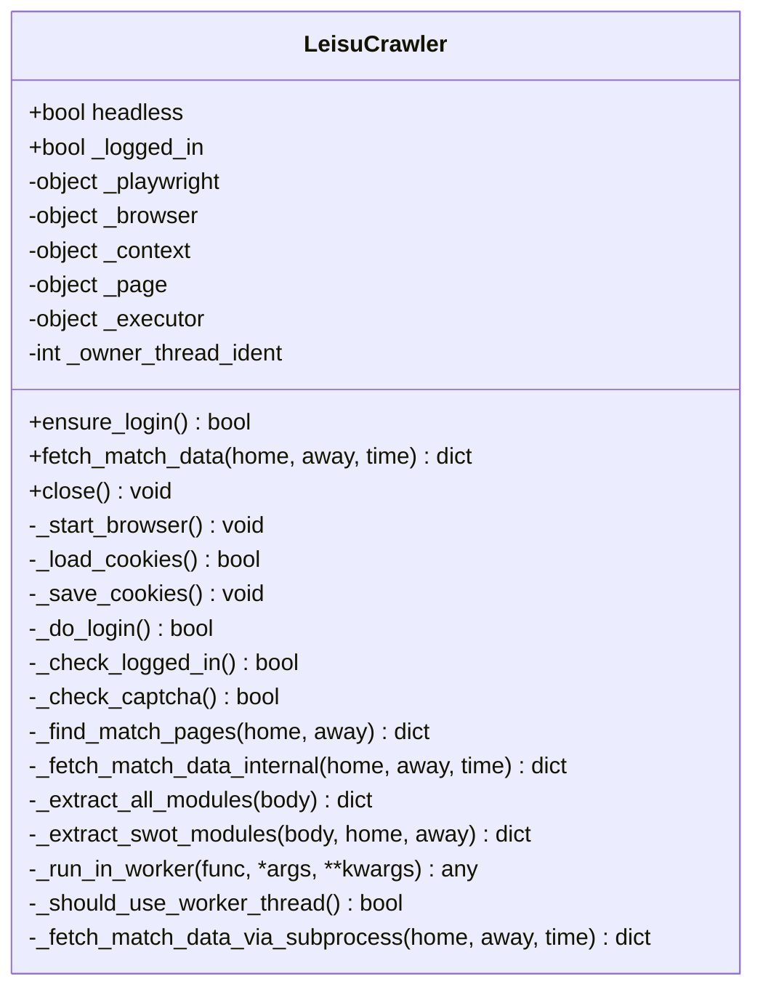
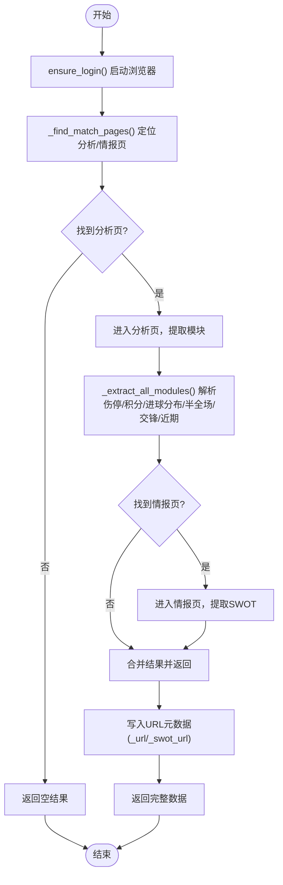
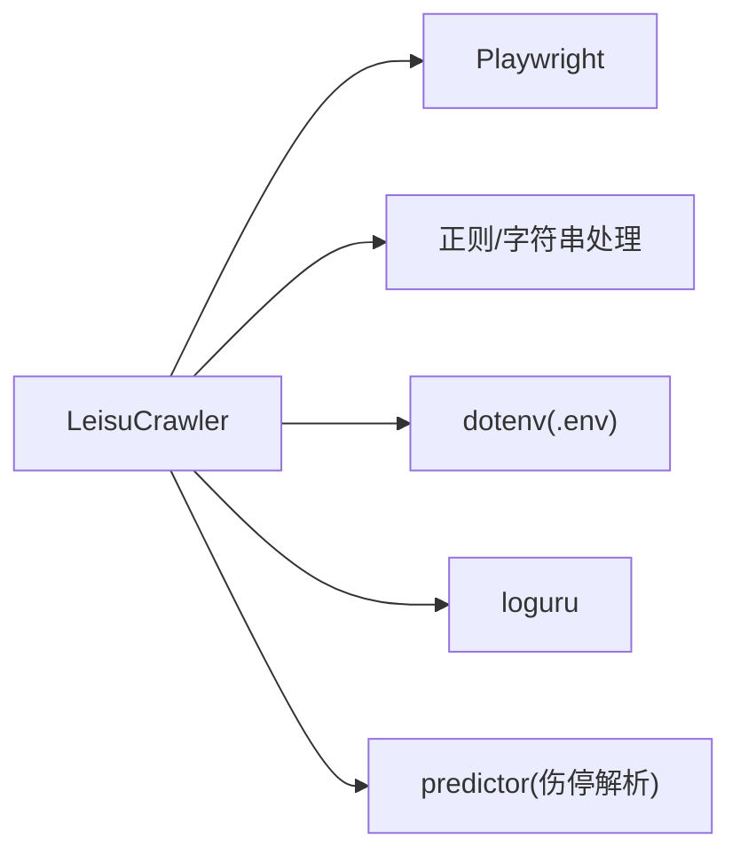

# 雷速数据爬虫API

<cite>
**本文引用的文件**
- [leisu_crawler.py](file://src/crawler/leisu_crawler.py)
- [test_leisu.py](file://scripts/test_leisu.py)
- [test_leisu_fetch.py](file://scripts/test_leisu_fetch.py)
- [test_leisu_init.py](file://scripts/test_leisu_init.py)
- [test_leisu_bai.py](file://scripts/test_leisu_bai.py)
- [test_leisu_fallback.py](file://scripts/test_leisu_fallback.py)
- [.env.example](file://config/.env.example)
- [99_Test.py](file://src/pages/99_Test.py)
- [predictor.py](file://src/llm/predictor.py)
</cite>

## 目录
1. [简介](#简介)
2. [项目结构](#项目结构)
3. [核心组件](#核心组件)
4. [架构总览](#架构总览)
5. [详细组件分析](#详细组件分析)
6. [依赖分析](#依赖分析)
7. [性能考虑](#性能考虑)
8. [故障排查指南](#故障排查指南)
9. [结论](#结论)
10. [附录](#附录)

## 简介
本文件为“雷速数据爬虫API”的权威技术文档，聚焦于 leisu_crawler 模块的功能与接口规范，涵盖以下能力：
- 雷速体育数据抓取：从“竞彩”列表定位比赛，进入“数据分析/情报”页面抓取关键模块。
- 伤停信息获取：从“伤停情况”模块抽取文本，并结合规则进行结构化解析。
- 球队阵容与状态：解析“联赛积分”“进球分布”“半全场胜负”等统计模块。
- 球员状态跟踪：通过伤停文本的关键词与语义规则，识别伤病类型与核心球员影响。
- 数据结构与解析：定义伤停文本格式、球员信息结构、球队数据标准化字段及更新频率控制建议。
- 反爬虫与稳定性：匿名模式优先、Cookie持久化、验证码检测与人工干预、子进程降级策略。
- 实时性保障：页面等待、重试与降级路径、错误恢复与日志记录。

## 项目结构
围绕 leisu_crawler 的主要文件与周边测试/示例如下：
- 爬虫核心：src/crawler/leisu_crawler.py
- 功能测试与演示：scripts/test_leisu*.py
- Streamlit 集成测试：src/pages/99_Test.py
- 环境变量示例：config/.env.example
- 伤停解析与规则：src/llm/predictor.py

图表来源
- [leisu_crawler.py:1-609](file://src/crawler/leisu_crawler.py#L1-L609)
- [test_leisu.py:1-129](file://scripts/test_leisu.py#L1-L129)
- [test_leisu_fetch.py:1-20](file://scripts/test_leisu_fetch.py#L1-L20)
- [test_leisu_init.py:1-15](file://scripts/test_leisu_init.py#L1-L15)
- [test_leisu_bai.py:1-28](file://scripts/test_leisu_bai.py#L1-L28)
- [test_leisu_fallback.py:1-17](file://scripts/test_leisu_fallback.py#L1-L17)
- [.env.example:1-16](file://config/.env.example#L1-L16)
- [99_Test.py:1-18](file://src/pages/99_Test.py#L1-L18)
- [predictor.py:289-396](file://src/llm/predictor.py#L289-L396)

章节来源
- [leisu_crawler.py:1-609](file://src/crawler/leisu_crawler.py#L1-L609)
- [test_leisu.py:1-129](file://scripts/test_leisu.py#L1-L129)
- [test_leisu_fetch.py:1-20](file://scripts/test_leisu_fetch.py#L1-L20)
- [test_leisu_init.py:1-15](file://scripts/test_leisu_init.py#L1-L15)
- [test_leisu_bai.py:1-28](file://scripts/test_leisu_bai.py#L1-L28)
- [test_leisu_fallback.py:1-17](file://scripts/test_leisu_fallback.py#L1-L17)
- [.env.example:1-16](file://config/.env.example#L1-L16)
- [99_Test.py:1-18](file://src/pages/99_Test.py#L1-L18)
- [predictor.py:289-396](file://src/llm/predictor.py#L289-L396)

## 核心组件
- LeisuCrawler 类：封装浏览器初始化、登录/匿名模式、页面导航、模块解析、子进程降级等。
- 关键方法：
  - 初始化与生命周期：__init__、ensure_login、close
  - 比赛搜索与定位：_find_match_pages、_extract_match_page_id、GUIDE_URL
  - 数据抓取与解析：fetch_match_data、_fetch_match_data_internal、_extract_all_modules、_extract_swot_modules
  - 登录与Cookie：_load_cookies、_save_cookies、_do_login、_check_logged_in、_check_captcha
  - 容错与降级：_run_in_worker、_should_use_worker_thread、_fetch_match_data_via_subprocess
- 数据结构要点：
  - 综合数据：包含伤停、积分、进球分布、半全场胜负、历史交锋、近期战绩等字段。
  - 情报数据：SWOT结构，含主队/客队标签与 pros/cons/neutral 三类要点。
  - 伤停文本：经清洗与截断，限制长度以提升后续解析稳定性。

章节来源
- [leisu_crawler.py:18-212](file://src/crawler/leisu_crawler.py#L18-L212)
- [leisu_crawler.py:213-408](file://src/crawler/leisu_crawler.py#L213-L408)
- [leisu_crawler.py:410-460](file://src/crawler/leisu_crawler.py#L410-L460)
- [leisu_crawler.py:538-582](file://src/crawler/leisu_crawler.py#L538-L582)

## 架构总览
下图展示从调用到数据产出的关键交互路径，包括页面导航、模块解析与降级策略：

图表来源
- [leisu_crawler.py:237-321](file://src/crawler/leisu_crawler.py#L237-L321)
- [leisu_crawler.py:323-408](file://src/crawler/leisu_crawler.py#L323-L408)
- [leisu_crawler.py:538-582](file://src/crawler/leisu_crawler.py#L538-L582)

## 详细组件分析

### 类与职责（类图）

图表来源
- [leisu_crawler.py:18-212](file://src/crawler/leisu_crawler.py#L18-L212)
- [leisu_crawler.py:237-321](file://src/crawler/leisu_crawler.py#L237-L321)
- [leisu_crawler.py:323-408](file://src/crawler/leisu_crawler.py#L323-L408)
- [leisu_crawler.py:410-460](file://src/crawler/leisu_crawler.py#L410-L460)
- [leisu_crawler.py:538-582](file://src/crawler/leisu_crawler.py#L538-L582)

### 接口规范与数据格式
- 输入参数
  - 主队/客队：字符串，支持简体中文全称或常用简称。
  - 比赛时间（可选）：字符串，用于辅助定位或过滤。
- 输出数据（综合模块）
  - 伤停：字符串片段，限制长度，便于后续结构化解析。
  - 积分：最多6个排名数字列表。
  - 进球分布：最多24个整数列表。
  - 半全场：字典，键为九宫格组合，值为计数。
  - 历史交锋/近期战绩：分数串列表，格式为“主-客”。
  - URL元数据：_url（分析页）、_swot_url（情报页）。
- 输出数据（SWOT情报）
  - 结构：包含 home_team、away_team、home/pros、home/cons、away/pros、away/cons、neutral。
  - 规则：通过文本清洗与标记点定位，提取主客有利/不利与中立要点，限制数量以避免噪声。

章节来源
- [leisu_crawler.py:410-460](file://src/crawler/leisu_crawler.py#L410-L460)
- [leisu_crawler.py:538-582](file://src/crawler/leisu_crawler.py#L538-L582)

### 数据解析流程（算法流程图）

图表来源
- [leisu_crawler.py:284-321](file://src/crawler/leisu_crawler.py#L284-L321)
- [leisu_crawler.py:323-408](file://src/crawler/leisu_crawler.py#L323-L408)
- [leisu_crawler.py:410-460](file://src/crawler/leisu_crawler.py#L410-L460)
- [leisu_crawler.py:538-582](file://src/crawler/leisu_crawler.py#L538-L582)

### 爬虫配置与反爬虫策略
- 配置项
  - 无头模式：headless 控制浏览器是否显示。
  - Cookie 文件：自动加载/保存，提升会话复用效率。
  - 登录态：支持匿名模式优先，必要时尝试登录并保存Cookie。
- 反爬虫应对
  - 匿名优先：默认匿名模式，减少登录依赖。
  - 用户代理与视口：设置常见UA与分辨率，降低特征暴露。
  - 验证码检测：检测页面关键字，遇验证码提示人工干预。
  - 事件循环兼容：在Streamlit等环境中应用 nest_asyncio，避免同步Playwright冲突。
  - 工作线程隔离：通过线程池在专用线程执行Playwright，避免主线程事件循环冲突。
  - 子进程降级：若工作线程不可用，启动子进程执行抓取，确保可用性。

章节来源
- [leisu_crawler.py:29-41](file://src/crawler/leisu_crawler.py#L29-L41)
- [leisu_crawler.py:58-87](file://src/crawler/leisu_crawler.py#L58-L87)
- [leisu_crawler.py:169-191](file://src/crawler/leisu_crawler.py#L169-L191)
- [leisu_crawler.py:161-167](file://src/crawler/leisu_crawler.py#L161-L167)
- [leisu_crawler.py:42-56](file://src/crawler/leisu_crawler.py#L42-L56)
- [leisu_crawler.py:248-283](file://src/crawler/leisu_crawler.py#L248-L283)

### 数据缓存与错误恢复
- 缓存机制
  - Cookie持久化：登录成功后保存Cookie，下次启动自动加载，减少重复登录成本。
- 错误恢复
  - 页面超时与异常：捕获并记录，返回空结果，避免中断流程。
  - 登录失败：降级为匿名模式继续抓取。
  - 情报页抓取失败：记录警告并继续返回分析页数据。
  - 子进程降级：当工作线程执行失败时，通过子进程隔离执行，提升鲁棒性。

章节来源
- [leisu_crawler.py:82-87](file://src/crawler/leisu_crawler.py#L82-L87)
- [leisu_crawler.py:180-191](file://src/crawler/leisu_crawler.py#L180-L191)
- [leisu_crawler.py:315-317](file://src/crawler/leisu_crawler.py#L315-L317)
- [leisu_crawler.py:248-283](file://src/crawler/leisu_crawler.py#L248-L283)

### 伤停数据格式与球员状态跟踪
- 伤停文本格式
  - 来源：分析页“伤停情况”模块，经截断与清洗，限制长度。
  - 特征：包含“伤病/停赛/受伤/缺阵/原因/位置/归队时间”等关键词。
- 球员信息结构
  - 字段：队伍、类型（伤病/停赛）、球员名、原因、核心程度（核心部位损伤计数）。
  - 规则：仅当文本包含明确伤停关键词时才视为有效；核心部位包括跟腱、肌肉、韧带、膝、踝等。
- 数据标准化
  - 统一输出为结构化数组，便于后续规则引擎与预测模型消费。
  - 与SWOT情报协同：结合主客标签与要点，形成更全面的战术与状态判断依据。

章节来源
- [leisu_crawler.py:421-428](file://src/crawler/leisu_crawler.py#L421-L428)
- [predictor.py:289-308](file://src/llm/predictor.py#L289-L308)
- [predictor.py:335-396](file://src/llm/predictor.py#L335-L396)

### 实时性保证机制
- 页面等待与稳定抓取
  - 页面跳转后等待固定时长，确保动态内容加载完成。
  - 对关键模块使用“模块切分+正则匹配”提取，减少DOM复杂度带来的不确定性。
- 更新频率控制建议
  - 建议在比赛开赛前30分钟至开赛期间高频抓取，赛后10分钟内低频轮询。
  - 伤停与情报页更新通常滞后于实际状态，应结合多源交叉验证与时间戳标注。

章节来源
- [leisu_crawler.py:297-298](file://src/crawler/leisu_crawler.py#L297-L298)
- [leisu_crawler.py:308-309](file://src/crawler/leisu_crawler.py#L308-L309)
- [leisu_crawler.py:314-315](file://src/crawler/leisu_crawler.py#L314-L315)

## 依赖分析
- 内部依赖
  - LeisuCrawler 依赖 Playwright 进行页面自动化，依赖正则表达式与字符串处理进行模块切分与清洗。
  - 与 predictor 的耦合体现在伤停文本的结构化解析，形成“爬取-清洗-结构化”的链路。
- 外部依赖
  - Playwright（Chromium）、loguru 日志、python-dotenv（环境变量加载）。
  - Streamlit 集成场景下依赖 nest_asyncio 以适配事件循环。

图表来源
- [leisu_crawler.py:1-16](file://src/crawler/leisu_crawler.py#L1-L16)
- [leisu_crawler.py:585-609](file://src/crawler/leisu_crawler.py#L585-L609)
- [predictor.py:289-396](file://src/llm/predictor.py#L289-L396)

章节来源
- [leisu_crawler.py:1-16](file://src/crawler/leisu_crawler.py#L1-L16)
- [leisu_crawler.py:585-609](file://src/crawler/leisu_crawler.py#L585-L609)
- [predictor.py:289-396](file://src/llm/predictor.py#L289-L396)

## 性能考虑
- 浏览器资源管理
  - 单实例复用浏览器上下文，避免频繁启动/关闭带来的延迟。
  - 专用线程执行Playwright，避免阻塞主线程与事件循环。
- 网络与页面加载
  - 合理设置等待时长与超时阈值，平衡稳定性与响应速度。
- 文本解析优化
  - 模块切分与截断限制长度，减少后续解析负担。
  - 正则匹配限定范围，避免全局扫描导致的性能问题。

## 故障排查指南
- 登录失败或验证码
  - 现象：无法检测登录态或页面出现验证码关键字。
  - 处理：启用人工干预，完成后重试；若持续失败，切换匿名模式。
- 页面超时或找不到比赛
  - 现象：竞彩列表加载失败或未匹配到目标比赛。
  - 处理：检查队名拼写与联赛名称白名单；适当增加等待时间；确认网络与地区限制。
- Streamlit 事件循环冲突
  - 现象：在Streamlit中直接启动Playwright同步API报错。
  - 处理：确保已应用 nest_asyncio；使用工作线程或子进程降级。
- 子进程抓取失败
  - 现象：工作线程不可用时，子进程返回非零退出码。
  - 处理：检查子进程环境变量与路径；查看标准错误输出定位问题。

章节来源
- [leisu_crawler.py:103-159](file://src/crawler/leisu_crawler.py#L103-L159)
- [leisu_crawler.py:161-167](file://src/crawler/leisu_crawler.py#L161-L167)
- [leisu_crawler.py:47-56](file://src/crawler/leisu_crawler.py#L47-L56)
- [leisu_crawler.py:248-283](file://src/crawler/leisu_crawler.py#L248-L283)
- [test_leisu_fallback.py:1-17](file://scripts/test_leisu_fallback.py#L1-L17)

## 结论
leisu_crawler 提供了面向雷速体育的稳健数据抓取能力，具备匿名优先、事件循环兼容、验证码检测与人工干预、工作线程与子进程降级等特性。其输出数据覆盖伤停、积分、进球分布、半全场胜负、历史交锋、近期战绩以及SWOT情报，满足战术分析与预测建模需求。结合 predictor 的伤停结构化规则，可进一步实现球员状态跟踪与核心影响评估。建议在生产环境中配合缓存、重试与监控，以获得更高的稳定性与实时性。

## 附录

### 使用示例与集成路径
- 基础使用
  - 初始化：LeisuCrawler(headless=True)
  - 抓取：fetch_match_data("主队", "客队")
  - 关闭：close()
- Streamlit 集成
  - 参考 src/pages/99_Test.py 中的按钮触发与异常处理。
- 环境变量
  - 参考 config/.env.example，用于第三方API密钥与数据库配置。

章节来源
- [test_leisu_fetch.py:1-20](file://scripts/test_leisu_fetch.py#L1-L20)
- [99_Test.py:1-18](file://src/pages/99_Test.py#L1-L18)
- [.env.example:1-16](file://config/.env.example#L1-L16)