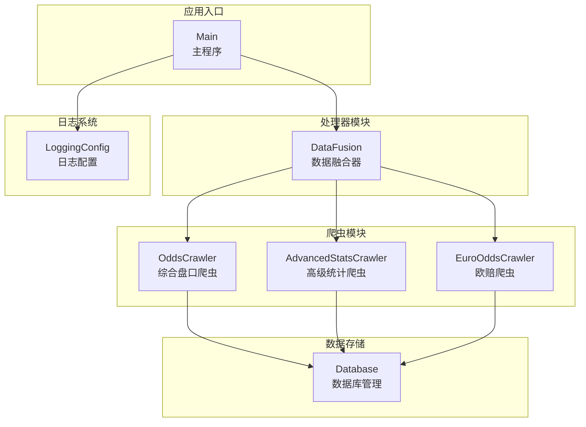
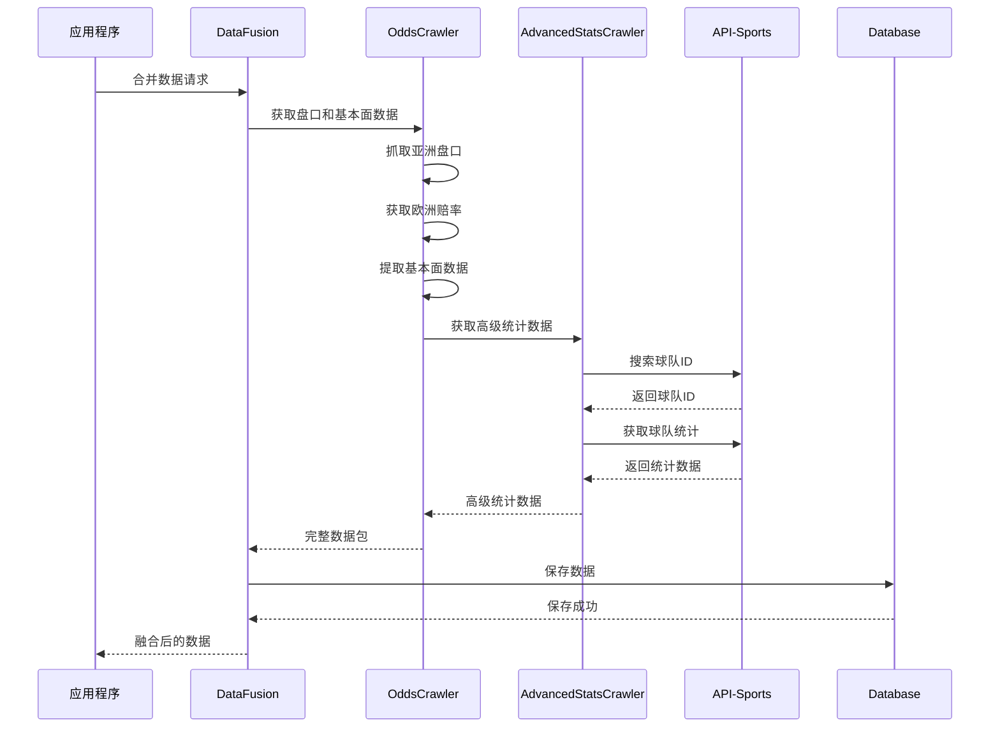
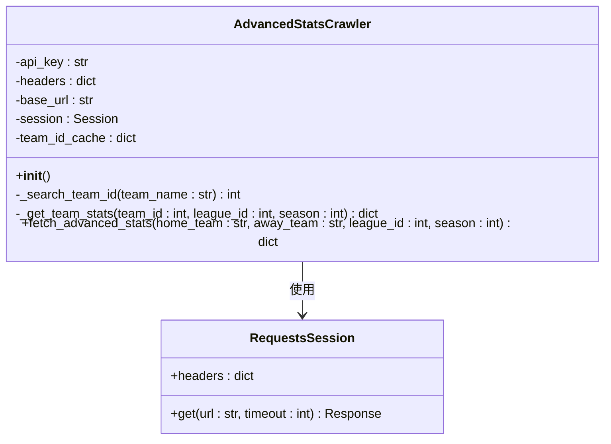
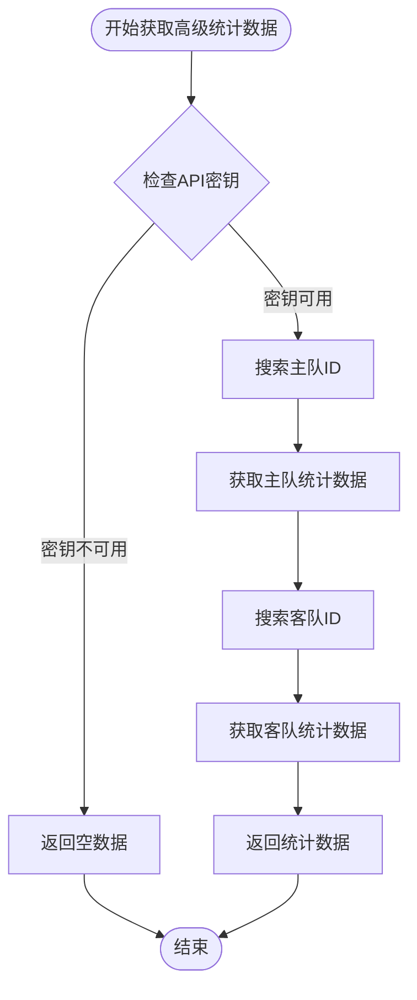
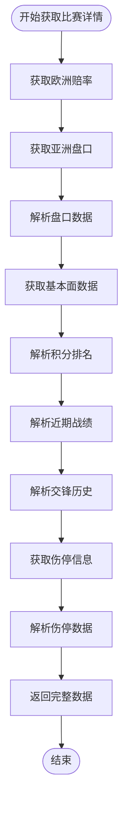
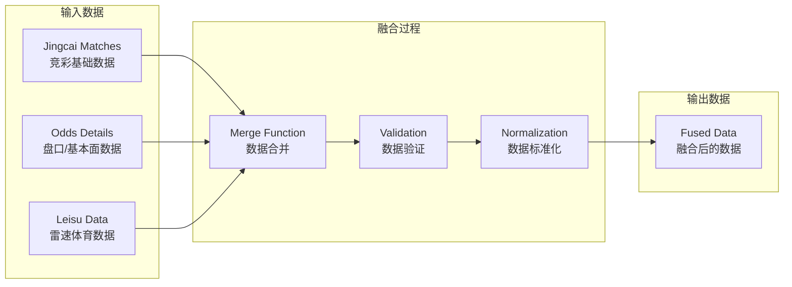
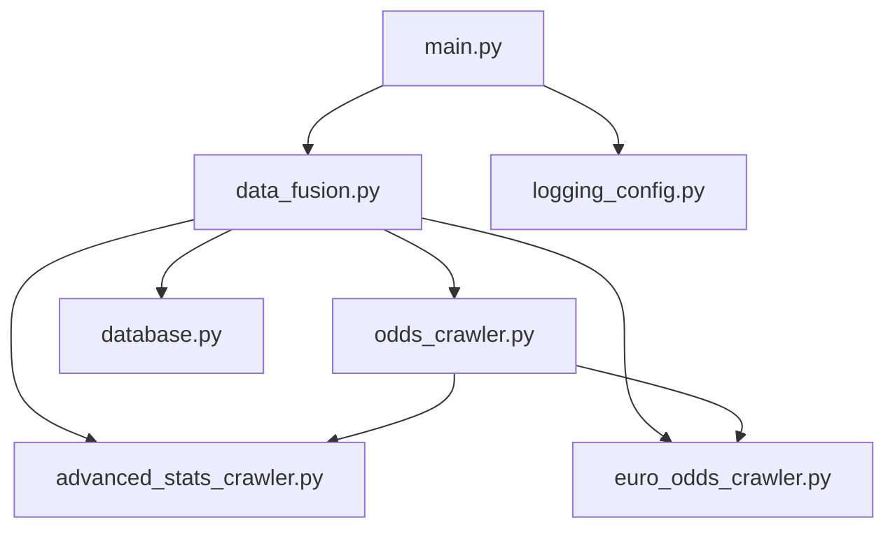

# 高级统计数据爬虫API

<cite>
**本文档引用的文件**
- [advanced_stats_crawler.py](file://src/crawler/advanced_stats_crawler.py)
- [odds_crawler.py](file://src/crawler/odds_crawler.py)
- [data_fusion.py](file://src/processor/data_fusion.py)
- [database.py](file://src/db/database.py)
- [main.py](file://src/main.py)
- [logging_config.py](file://src/logging_config.py)
- [euro_odds_crawler.py](file://src/crawler/euro_odds_crawler.py)
</cite>

## 目录
1. [简介](#简介)
2. [项目结构](#项目结构)
3. [核心组件](#核心组件)
4. [架构概览](#架构概览)
5. [详细组件分析](#详细组件分析)
6. [依赖分析](#依赖分析)
7. [性能考虑](#性能考虑)
8. [故障排除指南](#故障排除指南)
9. [结论](#结论)
10. [附录](#附录)

## 简介
高级统计数据爬虫API是一个专门用于获取和处理足球高级统计数据的模块化系统。该系统能够从多个数据源获取高阶技术统计（如场均射门、射正、进球期望等），并与基本面数据、赔率数据进行融合，为后续的预测模型提供高质量的输入数据。

该系统主要功能包括：
- 球队历史战绩数据获取
- 球员技术统计分析
- 战术数据分析
- 伤病报告获取
- 多数据源融合与验证

## 项目结构
该项目采用模块化架构，将不同的爬虫功能分离到独立的模块中，便于维护和扩展。

**图表来源**
- [advanced_stats_crawler.py:1-114](file://src/crawler/advanced_stats_crawler.py#L1-L114)
- [odds_crawler.py:1-167](file://src/crawler/odds_crawler.py#L1-L167)
- [data_fusion.py:1-108](file://src/processor/data_fusion.py#L1-L108)
- [database.py:1-567](file://src/db/database.py#L1-L567)

**章节来源**
- [advanced_stats_crawler.py:1-114](file://src/crawler/advanced_stats_crawler.py#L1-L114)
- [odds_crawler.py:1-167](file://src/crawler/odds_crawler.py#L1-L167)
- [data_fusion.py:1-108](file://src/processor/data_fusion.py#L1-L108)

## 核心组件
高级统计数据爬虫API由以下核心组件构成：

### AdvancedStatsCrawler类
这是系统的主要爬虫类，负责从API-Sports获取高级统计数据。

**主要特性：**
- 支持通过API-Sports获取真实的射门和进球期望数据
- 自动缓存球队ID，避免重复搜索
- 提供降级机制，当API密钥不可用时返回空数据
- 支持自定义联赛ID和赛季参数

### OddsCrawler类
综合爬虫类，整合多种数据源的信息。

**主要功能：**
- 抓取亚洲盘口数据
- 获取欧洲赔率（初赔和即时赔）
- 提取基本面数据（近期战绩、交锋历史、积分排名）
- 收集伤停信息和阵容数据

### DataFusion类
数据融合器，负责将来自不同爬虫的数据进行整合。

**核心能力：**
- 将竞彩基础数据与第三方盘口/基本面数据融合
- 支持可选的雷速体育数据增强
- 提供统一的数据格式化接口

**章节来源**
- [advanced_stats_crawler.py:9-114](file://src/crawler/advanced_stats_crawler.py#L9-L114)
- [odds_crawler.py:9-167](file://src/crawler/odds_crawler.py#L9-L167)
- [data_fusion.py:57-108](file://src/processor/data_fusion.py#L57-L108)

## 架构概览
系统采用分层架构设计，实现了数据获取、处理、存储的完整流程。

**图表来源**
- [data_fusion.py:61-108](file://src/processor/data_fusion.py#L61-L108)
- [odds_crawler.py:17-161](file://src/crawler/odds_crawler.py#L17-L161)
- [advanced_stats_crawler.py:82-114](file://src/crawler/advanced_stats_crawler.py#L82-L114)

## 详细组件分析

### AdvancedStatsCrawler组件分析

#### 类结构图

**图表来源**
- [advanced_stats_crawler.py:9-114](file://src/crawler/advanced_stats_crawler.py#L9-L114)

#### 数据获取流程

**图表来源**
- [advanced_stats_crawler.py:82-114](file://src/crawler/advanced_stats_crawler.py#L82-L114)

#### 关键方法说明

**fetch_advanced_stats方法**
- 输入参数：主队名称、客队名称、联赛ID、赛季
- 返回值：包含双方场均数据的字典
- 特殊处理：当API密钥未配置时，返回空字典供下游降级使用

**_search_team_id方法**
- 功能：根据球队名称搜索对应的ID
- 缓存机制：使用team_id_cache避免重复API调用
- 错误处理：捕获异常并记录调试信息

**_get_team_stats方法**
- 功能：获取指定球队的统计数据
- 当前实现：返回场均进球和失球数据
- 扩展预留：为xG、场均射门等指标预留字段

**章节来源**
- [advanced_stats_crawler.py:28-114](file://src/crawler/advanced_stats_crawler.py#L28-L114)

### OddsCrawler组件分析

#### 数据提取流程

**图表来源**
- [odds_crawler.py:17-161](file://src/crawler/odds_crawler.py#L17-L161)

#### 数据源集成
OddsCrawler集成了多个数据源：

**欧洲赔率数据**
- 来源：500.com欧赔分析页面
- 数据格式：包含初赔和即时赔的公司列表
- 公司筛选：默认保留前5家主流公司

**亚洲盘口数据**
- 来源：500.com亚盘分析页面
- 数据格式：主队让球盘口的三个数值
- 公司识别：自动识别澳门和Bet365

**基本面数据**
- 积分排名：从数据表格中提取
- 近期战绩：包含比赛场次、胜平负、进球失球
- 交锋历史：提取两队历史交锋摘要
- 伤停信息：从阵容页面提取伤病和停赛信息

**章节来源**
- [odds_crawler.py:17-161](file://src/crawler/odds_crawler.py#L17-L161)

### DataFusion组件分析

#### 数据融合策略

**图表来源**
- [data_fusion.py:61-108](file://src/processor/data_fusion.py#L61-L108)

#### 融合规则
DataFusion类遵循以下融合原则：

**数据完整性**
- 确保每个比赛都有完整的数据集
- 对于缺失的数据，使用降级策略或空值表示

**数据一致性**
- 统一数据格式和命名约定
- 标准化日期和时间格式

**可扩展性**
- 支持动态添加新的数据源
- 提供插件化的数据增强机制

**章节来源**
- [data_fusion.py:57-108](file://src/processor/data_fusion.py#L57-L108)

## 依赖分析

### 外部依赖
系统依赖以下外部库和服务：

**HTTP客户端**
- requests：用于发送HTTP请求
- BeautifulSoup：用于HTML解析

**数据处理**
- pandas：用于Excel数据处理
- SQLAlchemy：用于数据库操作

**配置管理**
- python-dotenv：用于环境变量管理

**日志系统**
- loguru：用于结构化日志记录

### 内部依赖关系

**图表来源**
- [main.py:25-32](file://src/main.py#L25-L32)
- [data_fusion.py:11-16](file://src/processor/data_fusion.py#L11-L16)

**章节来源**
- [main.py:1-33](file://src/main.py#L1-L33)
- [advanced_stats_crawler.py:1-7](file://src/crawler/advanced_stats_crawler.py#L1-L7)

## 性能考虑

### 缓存策略
系统实现了多层次的缓存机制：

**球队ID缓存**
- 在内存中缓存已搜索的球队ID
- 避免重复的API调用
- 减少响应时间

**会话复用**
- 使用requests.Session保持连接
- 减少TCP连接建立开销

### 并发处理
系统支持异步处理模式：

**事件循环配置**
- Windows平台使用ProactorEventLoop
- 支持嵌套asyncio应用

**重试机制**
- 欧赔爬虫具有内置的重试和退避策略
- 避免频繁请求导致的限流

### 内存管理
- 及时释放爬虫资源
- 控制数据量大小
- 使用生成器处理大数据集

## 故障排除指南

### 常见问题及解决方案

**API密钥配置问题**
- 症状：高级统计数据为空
- 解决方案：检查环境变量FOOTBALL_API_KEY是否正确设置

**网络连接超时**
- 症状：请求超时或连接失败
- 解决方案：增加timeout参数，检查网络连接

**数据解析错误**
- 症状：HTML解析失败或数据格式不正确
- 解决方案：检查目标网站结构变化，更新解析逻辑

**数据库连接问题**
- 症状：无法连接SQLite数据库
- 解决方案：检查数据库文件路径和权限

### 调试工具
系统提供了完善的日志记录机制：

**日志配置**
- 终端输出：INFO级别以上
- 文件输出：每天轮转，保留7天
- 结构化格式：包含时间戳、级别、模块信息

**调试建议**
- 启用DEBUG级别日志
- 检查API响应状态码
- 验证数据完整性

**章节来源**
- [logging_config.py:8-30](file://src/logging_config.py#L8-L30)
- [advanced_stats_crawler.py:46-48](file://src/crawler/advanced_stats_crawler.py#L46-L48)

## 结论
高级统计数据爬虫API提供了一个完整、可扩展的解决方案，用于获取和处理足球高级统计数据。系统的设计充分考虑了数据质量、性能和可维护性，能够满足专业预测系统的需求。

**主要优势：**
- 模块化设计，易于维护和扩展
- 多数据源融合，提高数据质量
- 完善的错误处理和降级机制
- 结构化的日志记录系统

**未来改进方向：**
- 增加更多的数据源支持
- 优化缓存策略
- 实现更智能的数据验证机制
- 提供更丰富的统计指标

## 附录

### API接口规范

#### AdvancedStatsCrawler接口
- 方法：fetch_advanced_stats(home_team, away_team, league_id=None, season=None)
- 返回：包含双方场均数据的字典
- 参数验证：检查API密钥有效性

#### OddsCrawler接口
- 方法：fetch_match_details(fixture_id, home_team=None, away_team=None)
- 返回：包含盘口、基本面、伤停等信息的完整数据包
- 数据格式：统一的JSON结构

#### DataFusion接口
- 方法：merge_data(jingcai_matches, odds_crawler, leisu_crawler=None)
- 返回：融合后的比赛数据列表
- 融合策略：基于fixture_id的数据合并

### 数据格式标准
系统采用统一的数据格式标准：

**时间格式**：ISO 8601标准
**数值格式**：浮点数精度控制
**文本格式**：UTF-8编码
**日期格式**：YYYY-MM-DD

### 配置参数
- FOOTBALL_API_KEY：API-Sports API密钥
- ENABLE_LEISU：是否启用雷速体育数据
- API超时：默认5秒
- 重试次数：默认3次