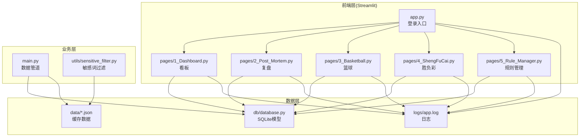
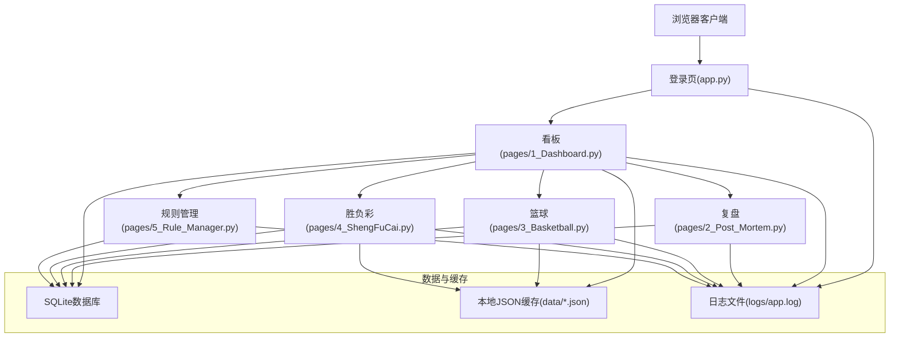
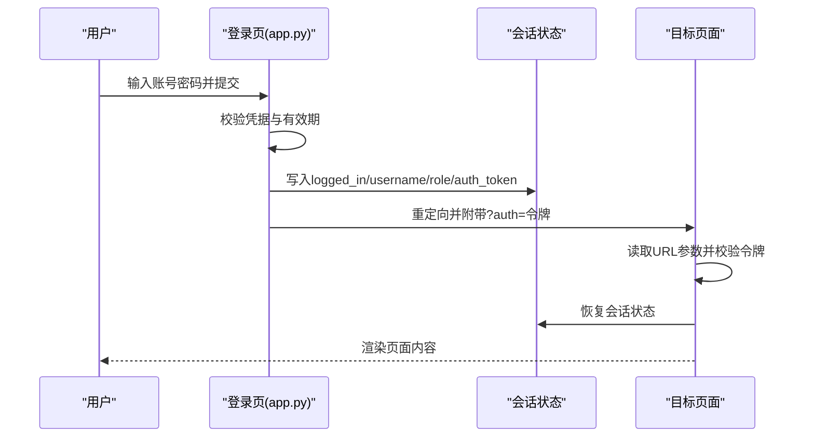
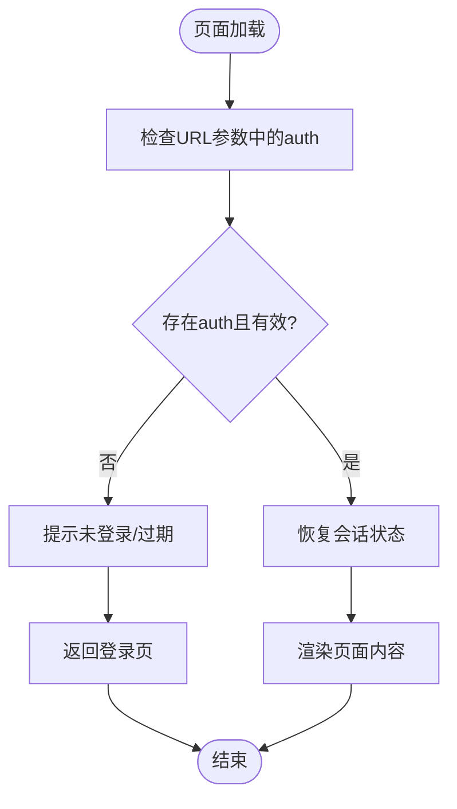
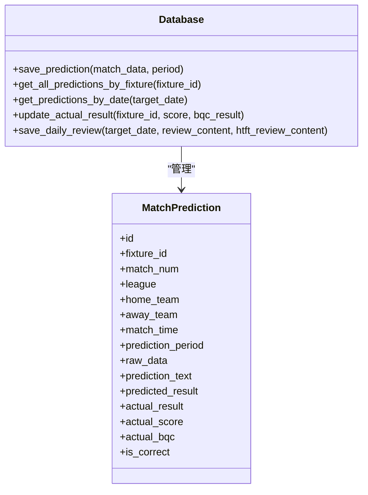
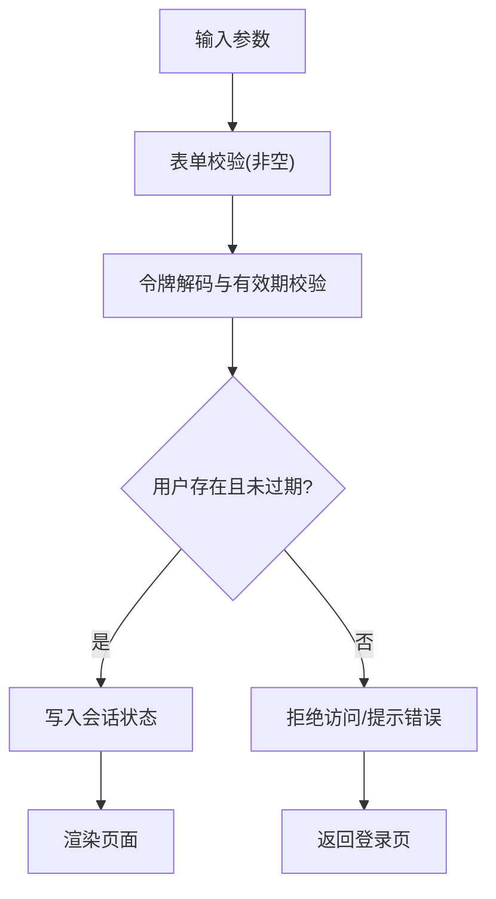
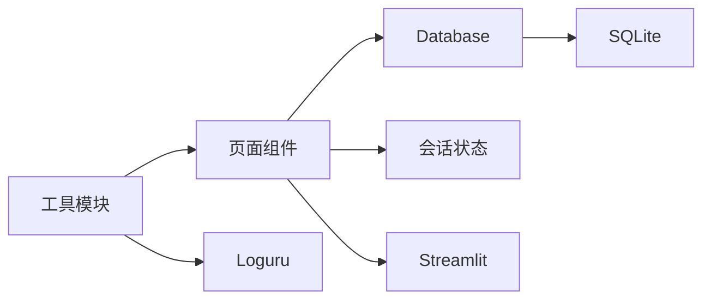

# Web应用管理API

<cite>
**本文档引用的文件**
- [src/app.py](file://src/app.py)
- [src/main.py](file://src/main.py)
- [src/manage_users.py](file://src/manage_users.py)
- [src/constants.py](file://src/constants.py)
- [src/pages/1_Dashboard.py](file://src/pages/1_Dashboard.py)
- [src/pages/2_Post_Mortem.py](file://src/pages/2_Post_Mortem.py)
- [src/pages/3_Basketball.py](file://src/pages/3_Basketball.py)
- [src/pages/4_ShengFuCai.py](file://src/pages/4_ShengFuCai.py)
- [src/pages/5_Rule_Manager.py](file://src/pages/5_Rule_Manager.py)
- [src/db/database.py](file://src/db/database.py)
- [src/utils/sensitive_filter.py](file://src/utils/sensitive_filter.py)
- [src/logging_config.py](file://src/logging_config.py)
</cite>

## 目录
1. [简介](#简介)
2. [项目结构](#项目结构)
3. [核心组件](#核心组件)
4. [架构总览](#架构总览)
5. [详细组件分析](#详细组件分析)
6. [依赖分析](#依赖分析)
7. [性能考虑](#性能考虑)
8. [故障排除指南](#故障排除指南)
9. [结论](#结论)

## 简介
本文件面向Web应用管理API，围绕以下目标展开：
- 页面路由管理接口：页面访问控制、导航管理、URL重写与会话传递
- 会话管理API：用户会话存储、会话过期处理、跨页面状态同步
- 安全控制接口：CSRF防护、XSS防护、输入验证
- 性能优化：缓存策略、用户体验改进方案

本项目采用Streamlit作为前端框架，配合SQLite数据库与本地JSON缓存实现轻量级Web应用。核心安全机制通过URL参数令牌与会话状态实现访问控制。

## 项目结构
项目采用按功能模块组织的结构，核心目录与职责如下：
- src：核心业务代码
  - app.py：登录入口与全局会话初始化
  - pages/*：页面路由与业务视图
  - db/database.py：数据库模型与CRUD
  - utils/*：工具模块（敏感词过滤等）
  - manage_users.py：用户生命周期管理脚本
  - main.py：批处理与数据管道入口
- data：本地缓存与数据库文件
- logs：应用日志
- config：环境配置（.env）

**图表来源**
- [src/app.py:1-166](file://src/app.py#L1-L166)
- [src/pages/1_Dashboard.py:1-800](file://src/pages/1_Dashboard.py#L1-L800)
- [src/pages/2_Post_Mortem.py:1-787](file://src/pages/2_Post_Mortem.py#L1-L787)
- [src/pages/3_Basketball.py:1-451](file://src/pages/3_Basketball.py#L1-L451)
- [src/pages/4_ShengFuCai.py:1-288](file://src/pages/4_ShengFuCai.py#L1-L288)
- [src/pages/5_Rule_Manager.py:1-678](file://src/pages/5_Rule_Manager.py#L1-L678)
- [src/db/database.py:1-567](file://src/db/database.py#L1-L567)

**章节来源**
- [src/app.py:1-166](file://src/app.py#L1-L166)
- [src/main.py:1-183](file://src/main.py#L1-L183)

## 核心组件
- 登录与会话控制
  - 登录入口与令牌生成：app.py负责生成包含用户名与时间戳的base64令牌，设置会话状态并重定向到看板
  - 会话恢复：各页面在加载时尝试从URL参数恢复会话，校验令牌有效期与用户有效性
  - 退出登录：清理会话状态与URL参数，返回登录页
- 页面路由与导航
  - 路由守卫：每个页面在顶部执行会话校验，未登录则返回登录页
  - 导航管理：侧边栏按钮在点击时自动注入auth令牌并切换页面
  - URL重写：通过st.query_params动态注入令牌，确保跨页面会话延续
- 数据持久化与缓存
  - 数据库：SQLite模型统一管理预测、复盘、规则等数据
  - 缓存：各页面使用@st.cache_data装饰器缓存数据，减少重复IO
- 安全与合规
  - 敏感词过滤：提供微信公众号文章敏感词替换工具
  - 日志：集中化日志输出，便于审计与排障

**章节来源**
- [src/app.py:51-163](file://src/app.py#L51-L163)
- [src/pages/1_Dashboard.py:21-69](file://src/pages/1_Dashboard.py#L21-L69)
- [src/pages/2_Post_Mortem.py:19-94](file://src/pages/2_Post_Mortem.py#L19-L94)
- [src/pages/3_Basketball.py:17-51](file://src/pages/3_Basketball.py#L17-L51)
- [src/pages/4_ShengFuCai.py:21-126](file://src/pages/4_ShengFuCai.py#L21-L126)
- [src/pages/5_Rule_Manager.py:85-421](file://src/pages/5_Rule_Manager.py#L85-L421)
- [src/db/database.py:200-567](file://src/db/database.py#L200-L567)
- [src/utils/sensitive_filter.py:1-151](file://src/utils/sensitive_filter.py#L1-L151)

## 架构总览
系统采用三层架构：
- 表现层：Streamlit页面组件，负责UI与交互
- 业务层：页面逻辑、数据管道与工具模块
- 数据层：SQLite数据库与本地JSON缓存

**图表来源**
- [src/app.py:110-163](file://src/app.py#L110-L163)
- [src/pages/1_Dashboard.py:179-311](file://src/pages/1_Dashboard.py#L179-L311)
- [src/pages/2_Post_Mortem.py:43-125](file://src/pages/2_Post_Mortem.py#L43-L125)
- [src/pages/3_Basketball.py:91-150](file://src/pages/3_Basketball.py#L91-L150)
- [src/pages/4_ShengFuCai.py:91-144](file://src/pages/4_ShengFuCai.py#L91-L144)
- [src/pages/5_Rule_Manager.py:384-448](file://src/pages/5_Rule_Manager.py#L384-L448)
- [src/db/database.py:200-567](file://src/db/database.py#L200-L567)

## 详细组件分析

### 登录与会话管理
- 令牌生成与校验
  - 生成：用户名+时间戳经base64编码，有效期由AUTH_TOKEN_TTL控制
  - 校验：解码后比较时间差与用户有效性，通过则写入session_state
- 会话状态
  - logged_in、username、role、auth_token、valid_until等键值
  - 退出登录时清空并移除URL参数
- 跨页面同步
  - 导航按钮点击时自动注入auth令牌，保证页面间会话一致

**图表来源**
- [src/app.py:94-163](file://src/app.py#L94-L163)
- [src/pages/1_Dashboard.py:32-49](file://src/pages/1_Dashboard.py#L32-L49)
- [src/pages/2_Post_Mortem.py:57-74](file://src/pages/2_Post_Mortem.py#L57-L74)
- [src/pages/3_Basketball.py:28-44](file://src/pages/3_Basketball.py#L28-L44)
- [src/pages/4_ShengFuCai.py:103-119](file://src/pages/4_ShengFuCai.py#L103-L119)
- [src/pages/5_Rule_Manager.py:387-402](file://src/pages/5_Rule_Manager.py#L387-L402)

**章节来源**
- [src/app.py:51-163](file://src/app.py#L51-L163)
- [src/constants.py:1-5](file://src/constants.py#L1-L5)
- [src/pages/1_Dashboard.py:21-69](file://src/pages/1_Dashboard.py#L21-L69)
- [src/pages/2_Post_Mortem.py:19-94](file://src/pages/2_Post_Mortem.py#L19-L94)
- [src/pages/3_Basketball.py:17-51](file://src/pages/3_Basketball.py#L17-L51)
- [src/pages/4_ShengFuCai.py:21-126](file://src/pages/4_ShengFuCai.py#L21-L126)
- [src/pages/5_Rule_Manager.py:85-421](file://src/pages/5_Rule_Manager.py#L85-L421)

### 页面路由与导航管理
- 路由守卫
  - 每个页面顶部检查st.query_params中的auth令牌与st.session_state中的登录状态
  - 未登录或过期时提示并返回登录页
- 导航按钮
  - 点击时若URL不含auth，则生成令牌并注入st.query_params
  - 使用st.switch_page进行页面切换
- URL重写
  - 通过st.query_params["auth"]实现URL重写，确保跨页面会话延续

**图表来源**
- [src/pages/1_Dashboard.py:32-55](file://src/pages/1_Dashboard.py#L32-L55)
- [src/pages/2_Post_Mortem.py:57-81](file://src/pages/2_Post_Mortem.py#L57-L81)
- [src/pages/3_Basketball.py:28-51](file://src/pages/3_Basketball.py#L28-L51)
- [src/pages/4_ShengFuCai.py:103-126](file://src/pages/4_ShengFuCai.py#L103-L126)
- [src/pages/5_Rule_Manager.py:387-409](file://src/pages/5_Rule_Manager.py#L387-L409)

**章节来源**
- [src/pages/1_Dashboard.py:21-69](file://src/pages/1_Dashboard.py#L21-L69)
- [src/pages/2_Post_Mortem.py:19-94](file://src/pages/2_Post_Mortem.py#L19-L94)
- [src/pages/3_Basketball.py:17-51](file://src/pages/3_Basketball.py#L17-L51)
- [src/pages/4_ShengFuCai.py:21-126](file://src/pages/4_ShengFuCai.py#L21-L126)
- [src/pages/5_Rule_Manager.py:85-421](file://src/pages/5_Rule_Manager.py#L85-L421)

### 数据持久化与缓存策略
- 缓存
  - @st.cache_data装饰器缓存数据加载，5分钟或1小时有效期
  - 缓存键为数据路径，clear()用于失效缓存
- 数据库
  - 统一的SQLite模型，支持预测、复盘、规则等数据的CRUD
  - 支持按日期窗口查询、实际赛果更新、复盘报告保存等

**图表来源**
- [src/db/database.py:200-567](file://src/db/database.py#L200-L567)

**章节来源**
- [src/pages/1_Dashboard.py:87-106](file://src/pages/1_Dashboard.py#L87-L106)
- [src/pages/3_Basketball.py:70-90](file://src/pages/3_Basketball.py#L70-L90)
- [src/pages/4_ShengFuCai.py:29-57](file://src/pages/4_ShengFuCai.py#L29-L57)
- [src/db/database.py:256-501](file://src/db/database.py#L256-L501)

### 安全控制接口
- CSRF防护
  - 通过URL参数令牌与会话状态双重校验，令牌有效期为8小时
  - 导航按钮自动注入令牌，避免手动拼接URL导致的令牌缺失
- XSS防护
  - 使用Streamlit的安全渲染机制，避免直接HTML注入
  - 敏感词过滤工具对公众号文章进行合规化处理
- 输入验证
  - 登录表单对用户名与密码进行非空校验
  - 用户管理脚本对密码进行哈希处理，角色与有效期参数化

**图表来源**
- [src/app.py:142-162](file://src/app.py#L142-L162)
- [src/app.py:65-82](file://src/app.py#L65-L82)
- [src/manage_users.py:9-37](file://src/manage_users.py#L9-L37)
- [src/utils/sensitive_filter.py:77-90](file://src/utils/sensitive_filter.py#L77-L90)

**章节来源**
- [src/app.py:51-163](file://src/app.py#L51-L163)
- [src/manage_users.py:1-45](file://src/manage_users.py#L1-L45)
- [src/utils/sensitive_filter.py:1-151](file://src/utils/sensitive_filter.py#L1-L151)

## 依赖分析
- 组件耦合
  - 页面与数据库：各页面均依赖Database类进行数据读写
  - 页面与会话：所有页面共享会话状态与令牌校验逻辑
  - 工具模块：敏感词过滤独立于业务逻辑，便于复用
- 外部依赖
  - Streamlit：页面渲染与交互
  - SQLAlchemy：数据库ORM
  - loguru：日志输出

**图表来源**
- [src/db/database.py:200-567](file://src/db/database.py#L200-L567)
- [src/pages/1_Dashboard.py:179-311](file://src/pages/1_Dashboard.py#L179-L311)
- [src/utils/sensitive_filter.py:1-151](file://src/utils/sensitive_filter.py#L1-L151)

**章节来源**
- [src/db/database.py:200-567](file://src/db/database.py#L200-L567)
- [src/pages/1_Dashboard.py:179-311](file://src/pages/1_Dashboard.py#L179-L311)
- [src/utils/sensitive_filter.py:1-151](file://src/utils/sensitive_filter.py#L1-L151)

## 性能考虑
- 缓存策略
  - 页面数据缓存：@st.cache_data装饰器，5分钟或1小时有效期，减少重复IO
  - 缓存失效：通过clear()主动失效，保证数据一致性
- 数据库优化
  - 索引：关键字段建立索引，提高查询效率
  - 批量操作：批量插入/更新，减少事务开销
- 用户体验
  - 进度条与提示信息：预测过程提供进度反馈
  - 自动刷新：预测完成后自动刷新页面，减少手动操作

**章节来源**
- [src/pages/1_Dashboard.py:87-106](file://src/pages/1_Dashboard.py#L87-L106)
- [src/pages/3_Basketball.py:70-90](file://src/pages/3_Basketball.py#L70-L90)
- [src/pages/4_ShengFuCai.py:29-57](file://src/pages/4_ShengFuCai.py#L29-L57)
- [src/db/database.py:256-501](file://src/db/database.py#L256-L501)

## 故障排除指南
- 登录失败
  - 检查用户名与密码是否正确
  - 确认用户有效期未过期
  - 查看日志文件定位错误原因
- 会话过期
  - 重新登录获取新令牌
  - 确保URL参数中包含auth令牌
- 数据加载失败
  - 清除缓存后重试
  - 检查数据文件是否存在与权限
- 预测异常
  - 检查LLM API配置
  - 查看数据库保存状态

**章节来源**
- [src/app.py:142-162](file://src/app.py#L142-L162)
- [src/pages/1_Dashboard.py:93-97](file://src/pages/1_Dashboard.py#L93-L97)
- [src/logging_config.py:1-30](file://src/logging_config.py#L1-L30)

## 结论
本Web应用管理API通过URL参数令牌与会话状态实现了轻量级的访问控制与跨页面状态同步。页面路由采用路由守卫与自动令牌注入机制，确保用户体验的一致性。数据库与缓存策略结合，满足了预测数据的高效读写需求。安全方面通过令牌校验、敏感词过滤与日志审计，提供了基本的CSRF与XSS防护能力。建议后续引入更完善的CSRF令牌机制与前端输入校验，以进一步提升安全性与稳定性。