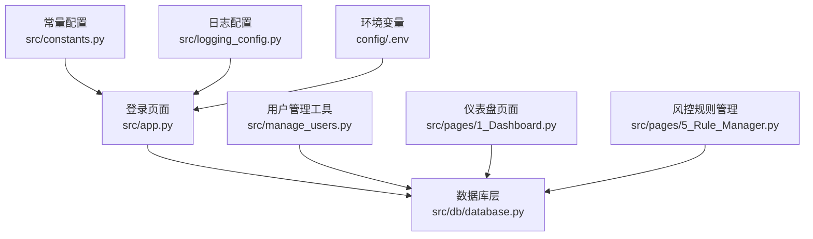
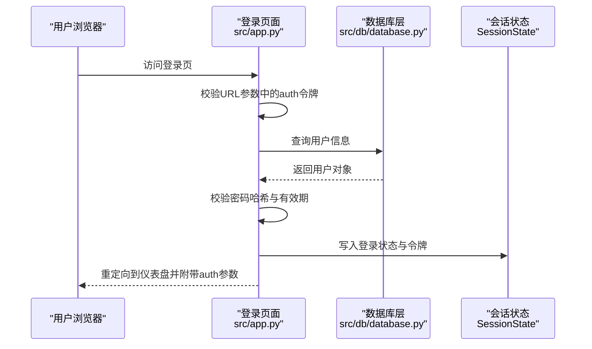
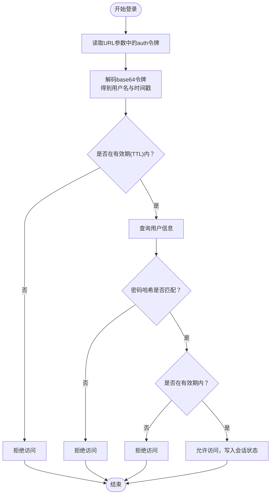
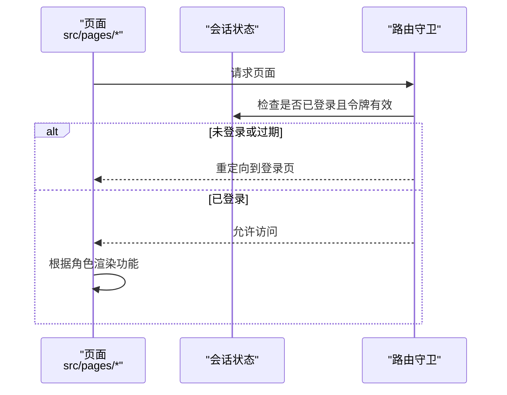
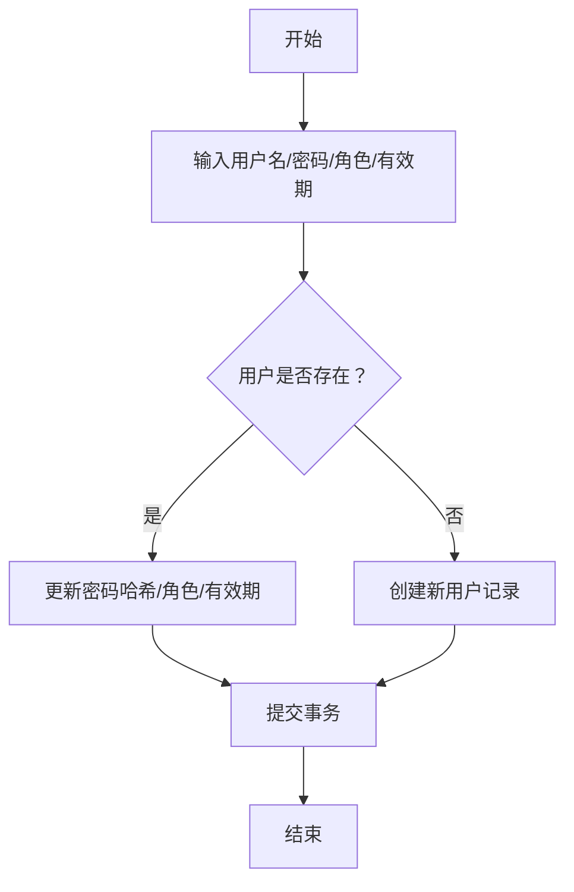
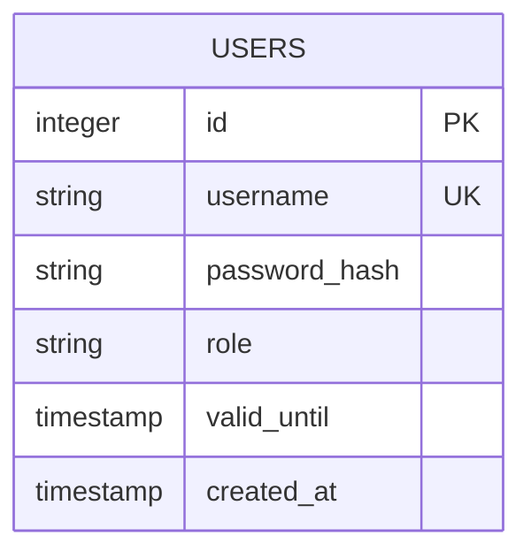
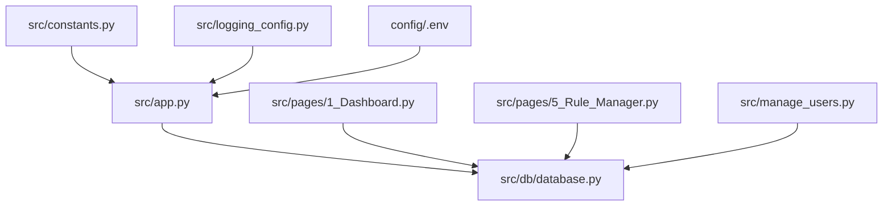

# 用户管理API

<cite>
**本文档引用的文件**
- [src/app.py](file://src/app.py)
- [src/manage_users.py](file://src/manage_users.py)
- [src/db/database.py](file://src/db/database.py)
- [src/constants.py](file://src/constants.py)
- [src/logging_config.py](file://src/logging_config.py)
- [src/pages/1_Dashboard.py](file://src/pages/1_Dashboard.py)
- [src/pages/5_Rule_Manager.py](file://src/pages/5_Rule_Manager.py)
- [config/.env](file://config/.env)
</cite>

## 目录
1. [简介](#简介)
2. [项目结构](#项目结构)
3. [核心组件](#核心组件)
4. [架构总览](#架构总览)
5. [详细组件分析](#详细组件分析)
6. [依赖关系分析](#依赖关系分析)
7. [性能考虑](#性能考虑)
8. [故障排除指南](#故障排除指南)
9. [结论](#结论)
10. [附录](#附录)

## 简介
本文件面向用户管理API的综合文档，涵盖以下主题：
- 用户认证接口：登录验证、会话管理、密码加密与令牌生成
- 用户权限控制API：角色分配、权限检查、访问控制与安全策略
- 用户生命周期管理：用户注册、状态变更、账户锁定与删除
- 安全最佳实践、审计日志与异常处理机制

本项目采用基于Streamlit的前端界面与SQLite数据库，通过自定义令牌与会话状态实现轻量级认证与权限控制。

## 项目结构
用户管理相关的关键文件与职责如下：
- 登录与认证流程：src/app.py
- 用户管理工具：src/manage_users.py
- 数据模型与数据库访问：src/db/database.py
- 常量配置（令牌有效期）：src/constants.py
- 日志配置：src/logging_config.py
- 仪表盘与用户管理UI：src/pages/1_Dashboard.py
- 风控规则管理（权限示例）：src/pages/5_Rule_Manager.py
- 环境变量配置：config/.env

**图表来源**
- [src/app.py:1-166](file://src/app.py#L1-L166)
- [src/manage_users.py:1-45](file://src/manage_users.py#L1-L45)
- [src/db/database.py:1-567](file://src/db/database.py#L1-L567)
- [src/constants.py:1-5](file://src/constants.py#L1-L5)
- [src/logging_config.py:1-30](file://src/logging_config.py#L1-L30)
- [src/pages/1_Dashboard.py:1-800](file://src/pages/1_Dashboard.py#L1-L800)
- [src/pages/5_Rule_Manager.py:1-678](file://src/pages/5_Rule_Manager.py#L1-L678)
- [config/.env:1-20](file://config/.env#L1-L20)

**章节来源**
- [src/app.py:1-166](file://src/app.py#L1-L166)
- [src/manage_users.py:1-45](file://src/manage_users.py#L1-L45)
- [src/db/database.py:1-567](file://src/db/database.py#L1-L567)
- [src/constants.py:1-5](file://src/constants.py#L1-L5)
- [src/logging_config.py:1-30](file://src/logging_config.py#L1-L30)
- [src/pages/1_Dashboard.py:1-800](file://src/pages/1_Dashboard.py#L1-L800)
- [src/pages/5_Rule_Manager.py:1-678](file://src/pages/5_Rule_Manager.py#L1-L678)
- [config/.env:1-20](file://config/.env#L1-L20)

## 核心组件
- 用户模型与数据库访问：User实体、get_user方法、会话状态持久化
- 登录与令牌：用户名+时间戳的base64令牌、有效期校验、URL参数传递
- 权限控制：角色字段（admin/editor/vip）、页面级路由守卫
- 用户管理UI：仪表盘中的Admin管理面板、新增/续期账号功能
- 日志与审计：统一日志配置、文件轮转与控制台输出

**章节来源**
- [src/db/database.py:58-67](file://src/db/database.py#L58-L67)
- [src/db/database.py:309-310](file://src/db/database.py#L309-L310)
- [src/app.py:51-62](file://src/app.py#L51-L62)
- [src/app.py:94-108](file://src/app.py#L94-L108)
- [src/pages/1_Dashboard.py:138-178](file://src/pages/1_Dashboard.py#L138-L178)
- [src/logging_config.py:8-30](file://src/logging_config.py#L8-L30)

## 架构总览
用户管理API的运行时交互流程如下：

**图表来源**
- [src/app.py:64-82](file://src/app.py#L64-L82)
- [src/app.py:94-108](file://src/app.py#L94-L108)
- [src/db/database.py:309-310](file://src/db/database.py#L309-L310)

## 详细组件分析

### 用户认证接口
- 登录验证
  - 输入：用户名、密码
  - 流程：查询用户 -> 校验密码哈希 -> 校验有效期 -> 返回角色与有效期
  - 关键实现位置：[src/app.py:94-108](file://src/app.py#L94-L108)，[src/db/database.py:309-310](file://src/db/database.py#L309-L310)
- 会话管理
  - 令牌生成：用户名+时间戳的base64编码
  - 令牌解析：从base64解码得到用户名与时间戳
  - URL参数传递：auth参数随路由传递
  - 关键实现位置：[src/app.py:51-62](file://src/app.py#L51-L62)，[src/app.py:64-82](file://src/app.py#L64-L82)
- 密码加密
  - 使用SHA-256对明文密码进行哈希
  - 关键实现位置：[src/app.py:91-92](file://src/app.py#L91-L92)，[src/manage_users.py:9-10](file://src/manage_users.py#L9-L10)
- 令牌生成与有效期
  - 令牌包含时间戳，配合常量AUTH_TOKEN_TTL进行有效期校验
  - 关键实现位置：[src/constants.py:3-4](file://src/constants.py#L3-L4)，[src/app.py:70](file://src/app.py#L70)

**图表来源**
- [src/app.py:64-82](file://src/app.py#L64-L82)
- [src/app.py:94-108](file://src/app.py#L94-L108)
- [src/constants.py:3-4](file://src/constants.py#L3-L4)

**章节来源**
- [src/app.py:51-108](file://src/app.py#L51-L108)
- [src/constants.py:3-4](file://src/constants.py#L3-L4)
- [src/db/database.py:309-310](file://src/db/database.py#L309-L310)

### 用户权限控制API
- 角色分配
  - 支持角色：admin、editor、vip
  - 仪表盘Admin面板提供角色选择与保存
  - 关键实现位置：[src/pages/1_Dashboard.py:145](file://src/pages/1_Dashboard.py#L145)，[src/pages/1_Dashboard.py:160-174](file://src/pages/1_Dashboard.py#L160-L174)
- 权限检查
  - 页面级路由守卫：若未登录或会话过期则返回登录页
  - 关键实现位置：[src/pages/1_Dashboard.py:51-55](file://src/pages/1_Dashboard.py#L51-L55)，[src/pages/5_Rule_Manager.py:404-408](file://src/pages/5_Rule_Manager.py#L404-L408)
- 访问控制列表与安全策略
  - 通过角色字段控制不同页面的可见性与功能（如风控规则管理仅admin可见）
  - 关键实现位置：[src/pages/1_Dashboard.py:199-200](file://src/pages/1_Dashboard.py#L199-L200)，[src/pages/5_Rule_Manager.py:266-277](file://src/pages/5_Rule_Manager.py#L266-L277)

**图表来源**
- [src/pages/1_Dashboard.py:51-55](file://src/pages/1_Dashboard.py#L51-L55)
- [src/pages/5_Rule_Manager.py:384-408](file://src/pages/5_Rule_Manager.py#L384-L408)

**章节来源**
- [src/pages/1_Dashboard.py:138-178](file://src/pages/1_Dashboard.py#L138-L178)
- [src/pages/5_Rule_Manager.py:266-277](file://src/pages/5_Rule_Manager.py#L266-L277)

### 用户生命周期管理
- 用户注册/更新
  - 通过用户管理工具或仪表盘Admin面板创建或更新用户
  - 设置角色与有效期（天数）
  - 关键实现位置：[src/manage_users.py:12-37](file://src/manage_users.py#L12-L37)，[src/pages/1_Dashboard.py:141-177](file://src/pages/1_Dashboard.py#L141-L177)
- 状态变更
  - 修改密码哈希、角色与有效期
  - 关键实现位置：[src/manage_users.py:21-24](file://src/manage_users.py#L21-L24)，[src/pages/1_Dashboard.py:160-164](file://src/pages/1_Dashboard.py#L160-L164)
- 账户锁定
  - 通过将valid_until设为过去时间实现锁定
  - 关键实现位置：[src/manage_users.py:42-44](file://src/manage_users.py#L42-L44)
- 删除功能
  - 项目未提供直接删除用户接口，可通过业务逻辑将用户标记为无效或清理其数据

**图表来源**
- [src/manage_users.py:12-37](file://src/manage_users.py#L12-L37)
- [src/pages/1_Dashboard.py:141-177](file://src/pages/1_Dashboard.py#L141-L177)

**章节来源**
- [src/manage_users.py:12-44](file://src/manage_users.py#L12-L44)
- [src/pages/1_Dashboard.py:138-178](file://src/pages/1_Dashboard.py#L138-L178)

### 数据模型与数据库
- 用户表结构
  - 字段：id、username、password_hash、role、valid_until、created_at
  - 关键实现位置：[src/db/database.py:58-67](file://src/db/database.py#L58-L67)
- 数据库初始化与连接
  - SQLite路径：data/football.db
  - 关键实现位置：[src/db/database.py:201-217](file://src/db/database.py#L201-L217)
- 用户查询
  - get_user方法：按用户名查询用户
  - 关键实现位置：[src/db/database.py:309-310](file://src/db/database.py#L309-L310)

**图表来源**
- [src/db/database.py:58-67](file://src/db/database.py#L58-L67)

**章节来源**
- [src/db/database.py:58-67](file://src/db/database.py#L58-L67)
- [src/db/database.py:201-217](file://src/db/database.py#L201-L217)
- [src/db/database.py:309-310](file://src/db/database.py#L309-L310)

## 依赖关系分析
- 组件耦合
  - 登录页面依赖数据库层进行用户查询
  - 仪表盘与风控规则管理页面依赖路由守卫与会话状态
  - 用户管理工具独立于Web层，直接操作数据库
- 外部依赖
  - 环境变量提供LLM与数据库配置
  - 日志系统统一输出到控制台与文件

**图表来源**
- [src/app.py:1-166](file://src/app.py#L1-L166)
- [src/db/database.py:1-567](file://src/db/database.py#L1-L567)
- [src/pages/1_Dashboard.py:1-800](file://src/pages/1_Dashboard.py#L1-L800)
- [src/pages/5_Rule_Manager.py:1-678](file://src/pages/5_Rule_Manager.py#L1-L678)
- [src/manage_users.py:1-45](file://src/manage_users.py#L1-L45)
- [src/constants.py:1-5](file://src/constants.py#L1-L5)
- [src/logging_config.py:1-30](file://src/logging_config.py#L1-L30)
- [config/.env:1-20](file://config/.env#L1-L20)

**章节来源**
- [src/app.py:1-166](file://src/app.py#L1-L166)
- [src/db/database.py:1-567](file://src/db/database.py#L1-L567)
- [src/pages/1_Dashboard.py:1-800](file://src/pages/1_Dashboard.py#L1-L800)
- [src/pages/5_Rule_Manager.py:1-678](file://src/pages/5_Rule_Manager.py#L1-L678)
- [src/manage_users.py:1-45](file://src/manage_users.py#L1-L45)
- [src/constants.py:1-5](file://src/constants.py#L1-L5)
- [src/logging_config.py:1-30](file://src/logging_config.py#L1-L30)
- [config/.env:1-20](file://config/.env#L1-L20)

## 性能考虑
- 令牌生成与解析为轻量级操作，对性能影响极小
- 数据库查询使用按用户名索引的查询，复杂度为O(1)
- 页面缓存与会话状态减少重复查询
- 建议
  - 控制令牌有效期以平衡安全性与用户体验
  - 对频繁操作的页面启用适当的缓存策略

## 故障排除指南
- 登录失败
  - 检查用户名是否存在与密码哈希是否匹配
  - 确认账户有效期未过期
  - 关键实现位置：[src/app.py:99-107](file://src/app.py#L99-L107)
- 会话过期
  - 令牌超过AUTH_TOKEN_TTL将被拒绝
  - 重新登录获取新令牌
  - 关键实现位置：[src/app.py:70](file://src/app.py#L70)，[src/constants.py:3-4](file://src/constants.py#L3-L4)
- 页面无权限
  - 确认当前用户角色具备访问权限
  - 关键实现位置：[src/pages/1_Dashboard.py:199-200](file://src/pages/1_Dashboard.py#L199-L200)，[src/pages/5_Rule_Manager.py:404-408](file://src/pages/5_Rule_Manager.py#L404-L408)
- 日志问题
  - 检查日志文件路径与轮转配置
  - 关键实现位置：[src/logging_config.py:14-29](file://src/logging_config.py#L14-L29)

**章节来源**
- [src/app.py:99-107](file://src/app.py#L99-L107)
- [src/app.py:70](file://src/app.py#L70)
- [src/constants.py:3-4](file://src/constants.py#L3-L4)
- [src/pages/1_Dashboard.py:199-200](file://src/pages/1_Dashboard.py#L199-L200)
- [src/pages/5_Rule_Manager.py:404-408](file://src/pages/5_Rule_Manager.py#L404-L408)
- [src/logging_config.py:14-29](file://src/logging_config.py#L14-L29)

## 结论
本用户管理API通过轻量级令牌与会话状态实现了基础的认证与权限控制，结合仪表盘与风控规则管理页面展示了角色驱动的功能访问。建议在生产环境中引入更强的密码策略、更严格的令牌安全措施与完善的审计日志体系。

## 附录
- 环境变量配置
  - LLM与数据库相关配置位于config/.env
  - 关键实现位置：[config/.env:1-20](file://config/.env#L1-L20)

**章节来源**
- [config/.env:1-20](file://config/.env#L1-L20)