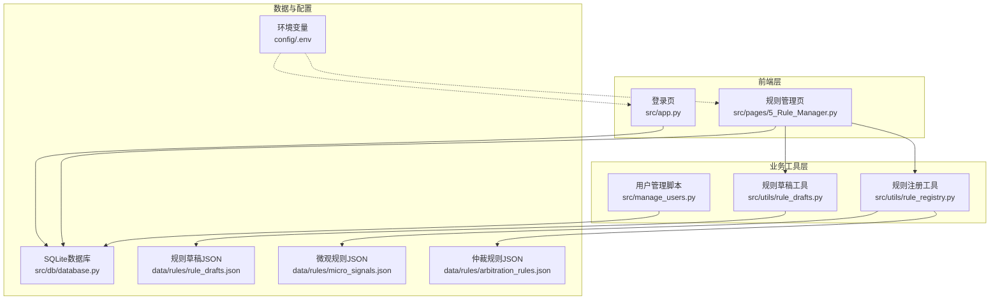
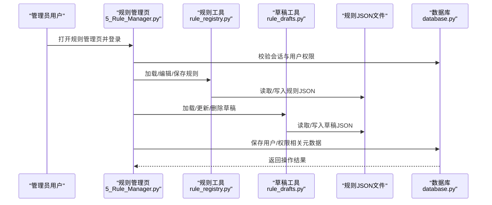
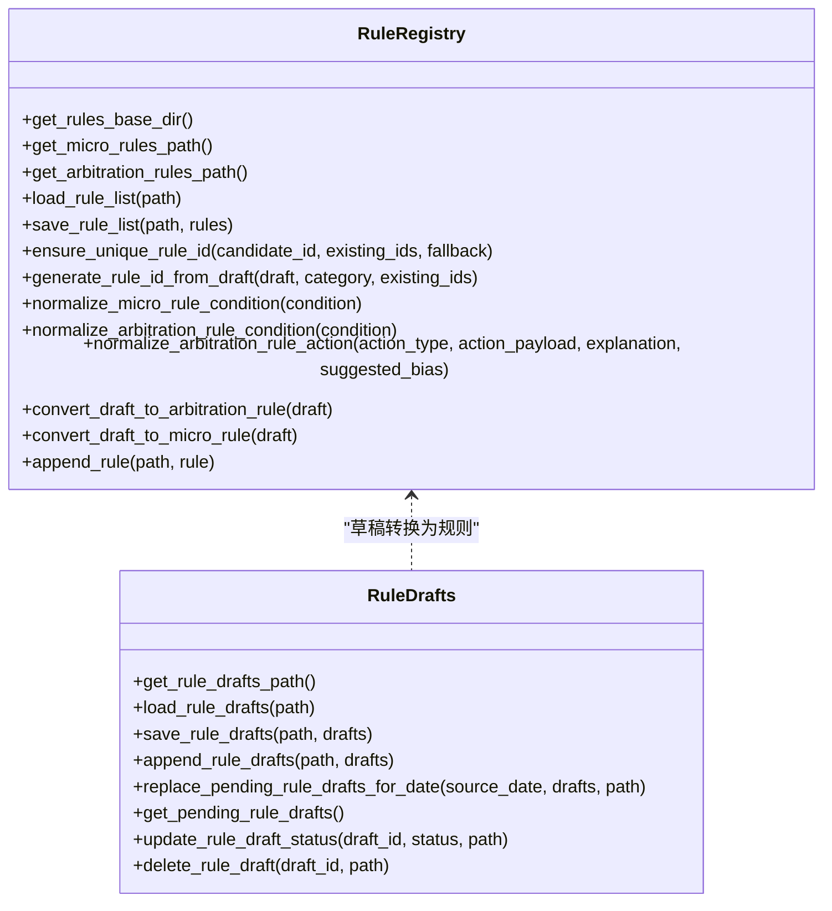
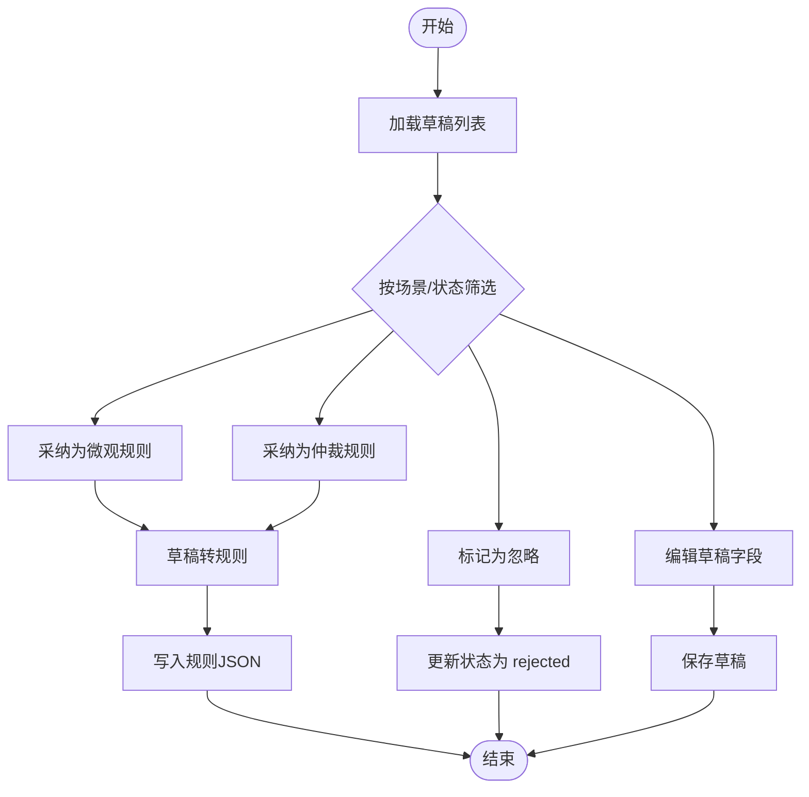
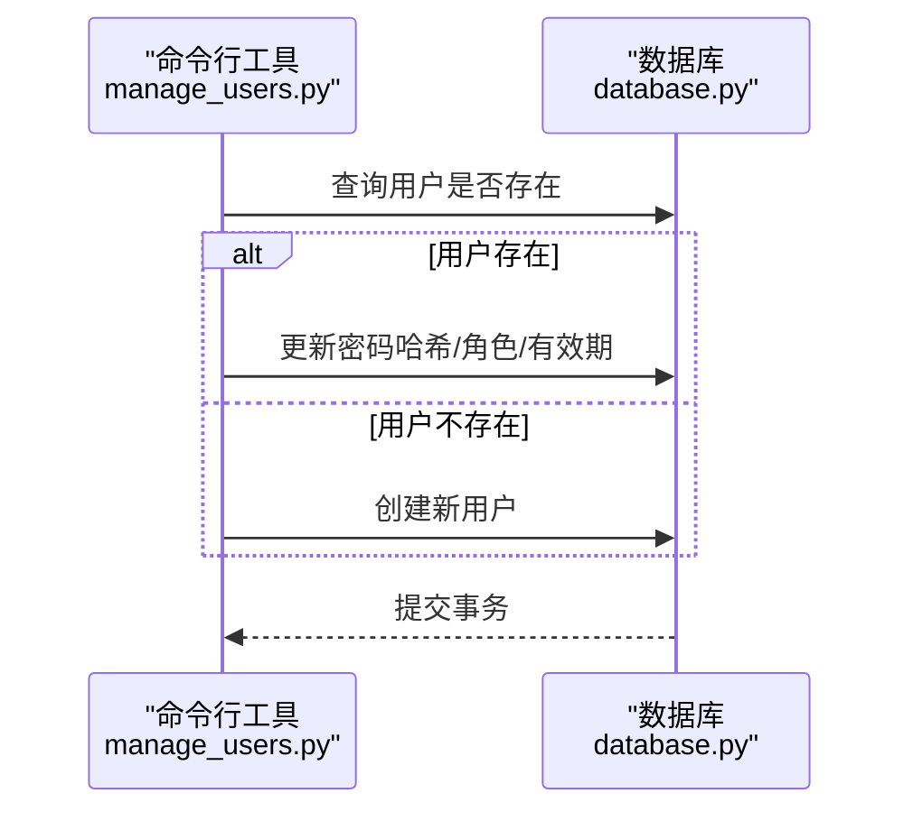
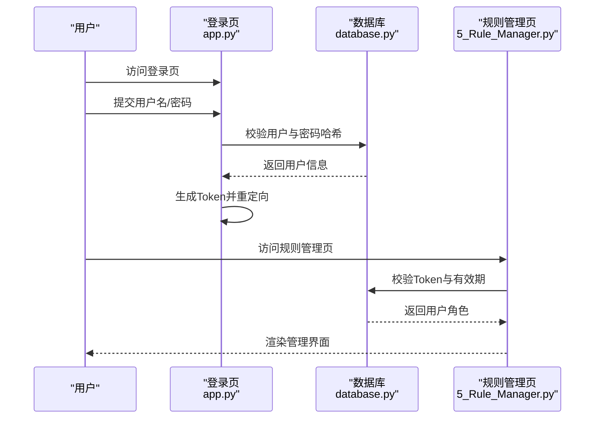
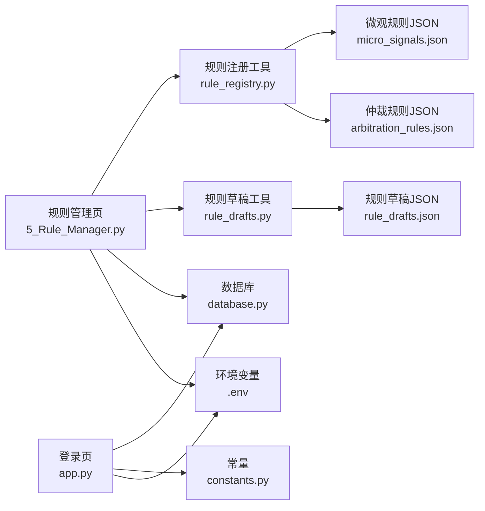

# 管理API

<cite>
**本文引用的文件**
- [src/app.py](file://src/app.py)
- [src/manage_users.py](file://src/manage_users.py)
- [src/db/database.py](file://src/db/database.py)
- [src/pages/5_Rule_Manager.py](file://src/pages/5_Rule_Manager.py)
- [src/utils/rule_registry.py](file://src/utils/rule_registry.py)
- [src/utils/rule_drafts.py](file://src/utils/rule_drafts.py)
- [src/constants.py](file://src/constants.py)
- [src/logging_config.py](file://src/logging_config.py)
- [config/.env](file://config/.env)
- [data/rules/rule_drafts.json](file://data/rules/rule_drafts.json)
- [data/rules/micro_signals.json](file://data/rules/micro_signals.json)
- [data/rules/arbitration_rules.json](file://data/rules/arbitration_rules.json)
</cite>

## 目录
1. [简介](#简介)
2. [项目结构](#项目结构)
3. [核心组件](#核心组件)
4. [架构总览](#架构总览)
5. [详细组件分析](#详细组件分析)
6. [依赖关系分析](#依赖关系分析)
7. [性能考量](#性能考量)
8. [故障排查指南](#故障排查指南)
9. [结论](#结论)
10. [附录](#附录)

## 简介
本文件面向管理API与管理界面，系统化梳理以下能力：
- 规则管理API：动态规则注册（rule_registry）、规则草稿管理（rule_drafts）与审核流程
- 用户管理API：用户认证、权限控制、角色管理与用户生命周期管理
- Web应用管理接口：页面路由、会话管理与安全控制
- 权限体系、访问控制与审计日志
- 管理界面集成方法与最佳实践

## 项目结构
该项目采用前端（Streamlit页面）+ 后端工具模块（规则引擎、用户与数据库）的组织方式。管理API主要体现在规则管理页面与用户管理脚本中，配合数据库与配置文件实现权限与审计。

**图表来源**
- [src/app.py:1-166](file://src/app.py#L1-L166)
- [src/pages/5_Rule_Manager.py:1-678](file://src/pages/5_Rule_Manager.py#L1-L678)
- [src/utils/rule_registry.py:1-278](file://src/utils/rule_registry.py#L1-L278)
- [src/utils/rule_drafts.py:1-91](file://src/utils/rule_drafts.py#L1-L91)
- [src/db/database.py:1-567](file://src/db/database.py#L1-L567)
- [config/.env:1-20](file://config/.env#L1-L20)
- [data/rules/rule_drafts.json:1-229](file://data/rules/rule_drafts.json#L1-L229)
- [data/rules/micro_signals.json:1-977](file://data/rules/micro_signals.json#L1-L977)
- [data/rules/arbitration_rules.json:1-63](file://data/rules/arbitration_rules.json#L1-L63)

**章节来源**
- [src/app.py:1-166](file://src/app.py#L1-L166)
- [src/pages/5_Rule_Manager.py:1-678](file://src/pages/5_Rule_Manager.py#L1-L678)
- [src/utils/rule_registry.py:1-278](file://src/utils/rule_registry.py#L1-L278)
- [src/utils/rule_drafts.py:1-91](file://src/utils/rule_drafts.py#L1-L91)
- [src/db/database.py:1-567](file://src/db/database.py#L1-L567)
- [config/.env:1-20](file://config/.env#L1-L20)
- [data/rules/rule_drafts.json:1-229](file://data/rules/rule_drafts.json#L1-L229)
- [data/rules/micro_signals.json:1-977](file://data/rules/micro_signals.json#L1-L977)
- [data/rules/arbitration_rules.json:1-63](file://data/rules/arbitration_rules.json#L1-L63)

## 核心组件
- 规则注册与转换工具：负责规则ID生成、条件规范化、动作类型归一化与规则持久化
- 规则草稿管理：负责草稿加载、保存、状态变更与替换
- 用户管理：负责用户创建/更新、密码哈希、角色与有效期管理
- 数据库抽象：提供用户、预测、复盘等表的ORM模型与常用查询
- Web会话与认证：基于URL参数的轻量Token传递与有效期校验
- 日志与审计：统一日志输出与文件轮转，便于审计追踪

**章节来源**
- [src/utils/rule_registry.py:1-278](file://src/utils/rule_registry.py#L1-L278)
- [src/utils/rule_drafts.py:1-91](file://src/utils/rule_drafts.py#L1-L91)
- [src/manage_users.py:1-45](file://src/manage_users.py#L1-L45)
- [src/db/database.py:1-567](file://src/db/database.py#L1-L567)
- [src/app.py:1-166](file://src/app.py#L1-L166)
- [src/logging_config.py:1-30](file://src/logging_config.py#L1-L30)

## 架构总览
管理API围绕“规则管理页 + 规则工具 + 草稿与规则JSON + 用户与数据库 + 会话与日志”的闭环展开。规则管理页负责UI交互与参数传递，规则工具负责规则转换与持久化，草稿与规则JSON提供数据源，用户与数据库提供身份与权限，会话与日志保障安全与审计。

**图表来源**
- [src/pages/5_Rule_Manager.py:384-678](file://src/pages/5_Rule_Manager.py#L384-L678)
- [src/utils/rule_registry.py:18-33](file://src/utils/rule_registry.py#L18-L33)
- [src/utils/rule_drafts.py:10-26](file://src/utils/rule_drafts.py#L10-L26)
- [src/db/database.py:309-311](file://src/db/database.py#L309-L311)

## 详细组件分析

### 规则管理API
规则管理API由规则注册工具与规则草稿工具构成，支持规则ID生成、条件规范化、动作类型归一化、规则持久化与草稿生命周期管理。

- 规则ID生成策略：基于标题/问题类型/触发条件等字段生成slug，保证唯一性并自动补后缀
- 条件规范化：将自然语言条件标准化为可执行的Python布尔表达式，支持别名替换与范围判断
- 动作类型归一化：将自然语言动作映射为统一的动作类型与参数payload
- 规则持久化：将规则写入对应的JSON文件，支持启用/禁用、优先级、场景键等字段

**图表来源**
- [src/utils/rule_registry.py:6-71](file://src/utils/rule_registry.py#L6-L71)
- [src/utils/rule_registry.py:102-177](file://src/utils/rule_registry.py#L102-L177)
- [src/utils/rule_registry.py:179-278](file://src/utils/rule_registry.py#L179-L278)
- [src/utils/rule_drafts.py:6-91](file://src/utils/rule_drafts.py#L6-L91)

**章节来源**
- [src/utils/rule_registry.py:1-278](file://src/utils/rule_registry.py#L1-L278)
- [src/utils/rule_drafts.py:1-91](file://src/utils/rule_drafts.py#L1-L91)
- [data/rules/rule_drafts.json:1-229](file://data/rules/rule_drafts.json#L1-L229)
- [data/rules/micro_signals.json:1-977](file://data/rules/micro_signals.json#L1-L977)
- [data/rules/arbitration_rules.json:1-63](file://data/rules/arbitration_rules.json#L1-L63)

### 规则草稿管理与审核流程
规则草稿管理提供草稿的增删改查、状态流转与替换机制，支持按日期批量替换与筛选。

- 草稿状态：draft/accepted/rejected等，支持按状态筛选
- 场景键：支持按场景键聚合与关联历史规则
- 审核动作：采纳为微观规则、采纳为仲裁规则、忽略草稿
- 替换机制：按日期批量替换待审核草稿

**图表来源**
- [src/utils/rule_drafts.py:48-91](file://src/utils/rule_drafts.py#L48-L91)
- [src/pages/5_Rule_Manager.py:577-678](file://src/pages/5_Rule_Manager.py#L577-L678)

**章节来源**
- [src/utils/rule_drafts.py:1-91](file://src/utils/rule_drafts.py#L1-L91)
- [src/pages/5_Rule_Manager.py:1-678](file://src/pages/5_Rule_Manager.py#L1-L678)

### 用户管理API
用户管理API提供用户创建/更新、密码哈希、角色与有效期管理，支持通过命令行工具批量初始化用户。

- 密码哈希：使用SHA-256对明文密码进行哈希
- 角色管理：支持admin/editor/vip等角色
- 有效期控制：支持设置账户有效期，到期后禁止登录
- 初始化：提供默认管理员与VIP用户的初始化脚本

**图表来源**
- [src/manage_users.py:12-37](file://src/manage_users.py#L12-L37)
- [src/db/database.py:58-67](file://src/db/database.py#L58-L67)

**章节来源**
- [src/manage_users.py:1-45](file://src/manage_users.py#L1-L45)
- [src/db/database.py:1-567](file://src/db/database.py#L1-L567)

### Web应用管理接口
Web应用管理接口涵盖登录页、会话管理与安全控制，基于URL参数传递轻量Token并校验有效期。

- Token生成：用户名+时间戳经Base64编码，有效期由常量控制
- 会话校验：URL参数auth存在时尝试恢复登录状态
- 页面路由：基于Streamlit pages目录约定，忽略文件名前缀数字与下划线
- 权限控制：根据用户角色渲染不同功能

**图表来源**
- [src/app.py:51-109](file://src/app.py#L51-L109)
- [src/pages/5_Rule_Manager.py:384-421](file://src/pages/5_Rule_Manager.py#L384-L421)
- [src/constants.py:3-5](file://src/constants.py#L3-L5)

**章节来源**
- [src/app.py:1-166](file://src/app.py#L1-L166)
- [src/pages/5_Rule_Manager.py:1-678](file://src/pages/5_Rule_Manager.py#L1-L678)
- [src/constants.py:1-5](file://src/constants.py#L1-L5)

### 权限体系、访问控制与审计日志
- 权限体系：用户角色（admin/editor/vip）决定可访问的功能范围
- 访问控制：登录页与规则管理页均进行会话与有效期校验
- 审计日志：统一使用Loguru进行终端与文件输出，支持按日轮转与保留7天

**章节来源**
- [src/db/database.py:58-67](file://src/db/database.py#L58-L67)
- [src/app.py:51-109](file://src/app.py#L51-L109)
- [src/logging_config.py:1-30](file://src/logging_config.py#L1-L30)

## 依赖关系分析
规则管理页依赖规则注册与草稿工具，二者均依赖规则JSON文件；规则管理页与用户管理页共同依赖数据库；登录页与规则管理页共享会话与常量配置。

**图表来源**
- [src/pages/5_Rule_Manager.py:15-26](file://src/pages/5_Rule_Manager.py#L15-L26)
- [src/utils/rule_registry.py:6-16](file://src/utils/rule_registry.py#L6-L16)
- [src/utils/rule_drafts.py:6-8](file://src/utils/rule_drafts.py#L6-L8)
- [src/app.py:30-31](file://src/app.py#L30-L31)
- [config/.env:1-20](file://config/.env#L1-L20)

**章节来源**
- [src/pages/5_Rule_Manager.py:1-678](file://src/pages/5_Rule_Manager.py#L1-L678)
- [src/utils/rule_registry.py:1-278](file://src/utils/rule_registry.py#L1-L278)
- [src/utils/rule_drafts.py:1-91](file://src/utils/rule_drafts.py#L1-L91)
- [src/app.py:1-166](file://src/app.py#L1-L166)
- [config/.env:1-20](file://config/.env#L1-L20)

## 性能考量
- 规则JSON读写：规则与草稿均以JSON文件形式存储，建议控制规则数量规模与并发写入频率，必要时引入锁或批处理
- 数据库查询：用户查询与预测查询使用ORM，建议在高频查询字段建立索引（如用户名、fixture_id、match_time等）
- 日志输出：文件轮转按日进行，建议监控磁盘占用与日志大小，避免影响系统性能

[本节为通用指导，无需具体文件来源]

## 故障排查指南
- 登录失败
  - 检查用户名是否存在与密码哈希是否匹配
  - 确认账户有效期未过期
  - 参考：[src/app.py:94-108](file://src/app.py#L94-L108)，[src/db/database.py:309-311](file://src/db/database.py#L309-L311)
- Token过期
  - 检查AUTH_TOKEN_TTL常量与URL参数auth的时间戳
  - 参考：[src/constants.py:3-5](file://src/constants.py#L3-L5)，[src/app.py:64-82](file://src/app.py#L64-L82)
- 规则保存失败
  - 检查规则JSON文件写入权限与路径
  - 参考：[src/utils/rule_registry.py:29-33](file://src/utils/rule_registry.py#L29-L33)
- 草稿状态异常
  - 检查草稿JSON中status字段与日期替换逻辑
  - 参考：[src/utils/rule_drafts.py:48-79](file://src/utils/rule_drafts.py#L48-L79)
- 日志未输出
  - 检查日志初始化与文件路径
  - 参考：[src/logging_config.py:8-29](file://src/logging_config.py#L8-L29)

**章节来源**
- [src/app.py:94-108](file://src/app.py#L94-L108)
- [src/constants.py:3-5](file://src/constants.py#L3-L5)
- [src/utils/rule_registry.py:29-33](file://src/utils/rule_registry.py#L29-L33)
- [src/utils/rule_drafts.py:48-79](file://src/utils/rule_drafts.py#L48-L79)
- [src/logging_config.py:8-29](file://src/logging_config.py#L8-L29)

## 结论
本管理API以规则管理页为核心，结合规则注册与草稿工具、数据库与会话机制，实现了从规则草稿到正式规则的闭环管理，并提供了用户认证、权限控制与审计日志能力。通过合理的文件化规则存储与轻量会话机制，系统具备良好的可维护性与可扩展性。

[本节为总结，无需具体文件来源]

## 附录
- 管理界面集成方法
  - 登录页：访问登录页后提交用户名/密码，系统生成Token并重定向至Dashboard
  - 规则管理页：通过URL参数auth恢复登录状态，支持按场景键筛选与草稿审核
  - 用户管理：通过命令行脚本批量创建/更新用户，设置角色与有效期
- 最佳实践
  - 规则草稿先行：先在草稿中沉淀经验，再审核采纳为正式规则
  - 条件规范化：尽量使用工具提供的条件规范化函数，减少误判
  - 审计留痕：依赖统一日志输出，定期检查日志文件与磁盘空间
  - 权限最小化：仅授予必要角色，避免admin滥用

[本节为通用指导，无需具体文件来源]