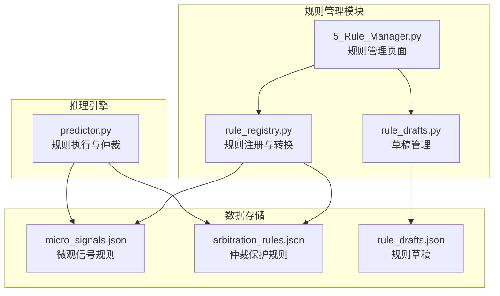
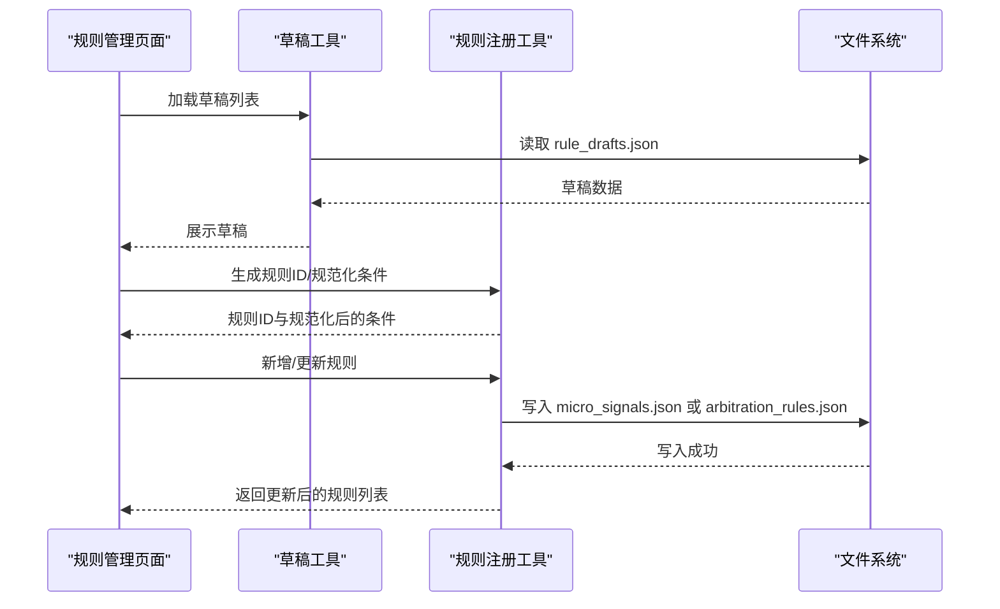
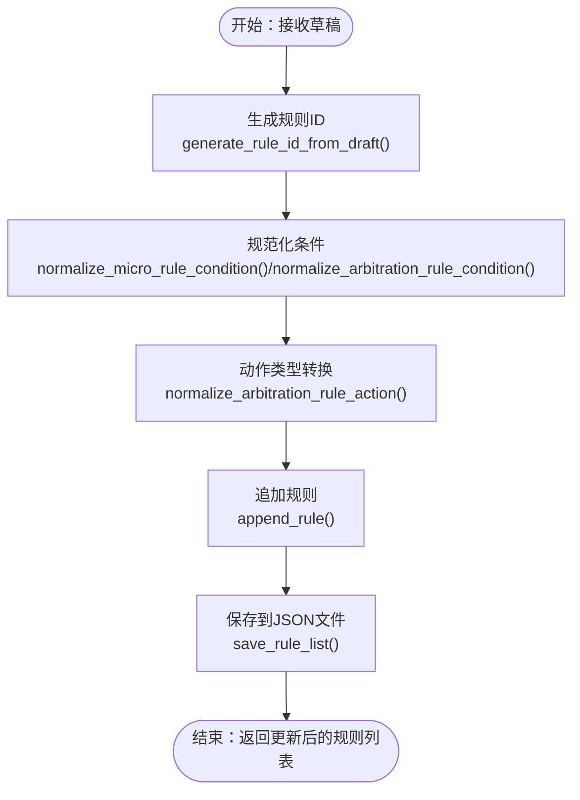
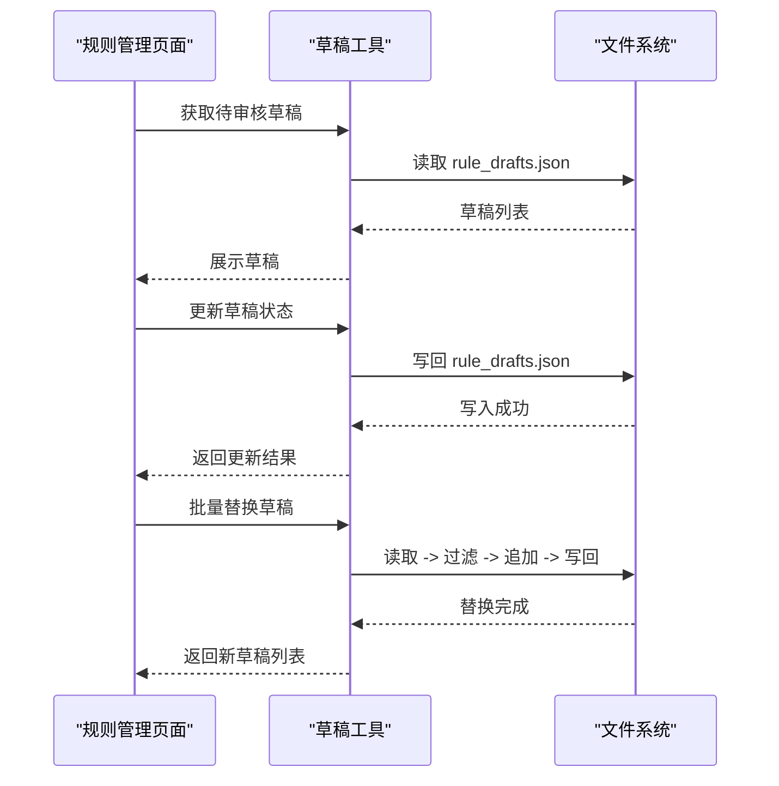
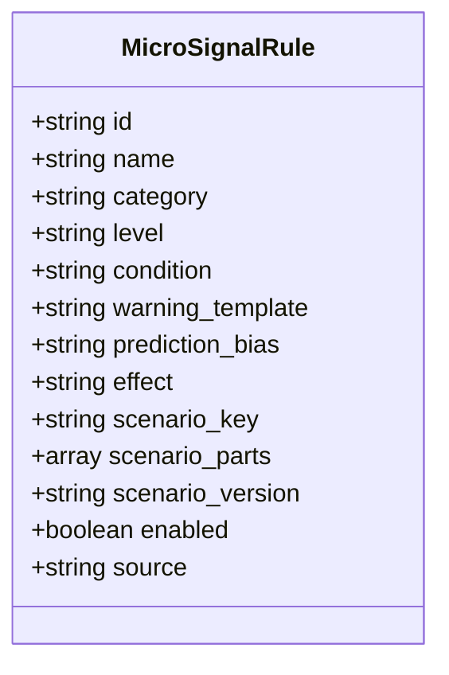
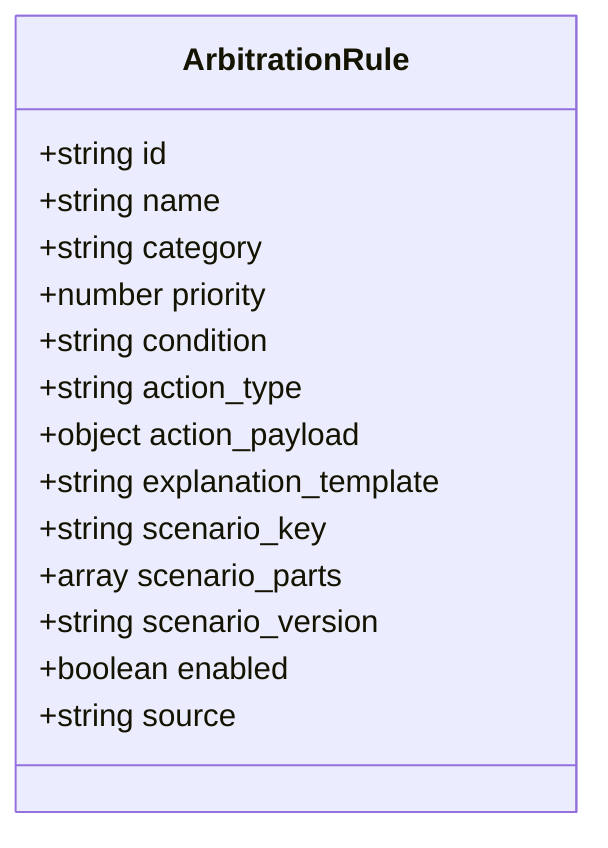
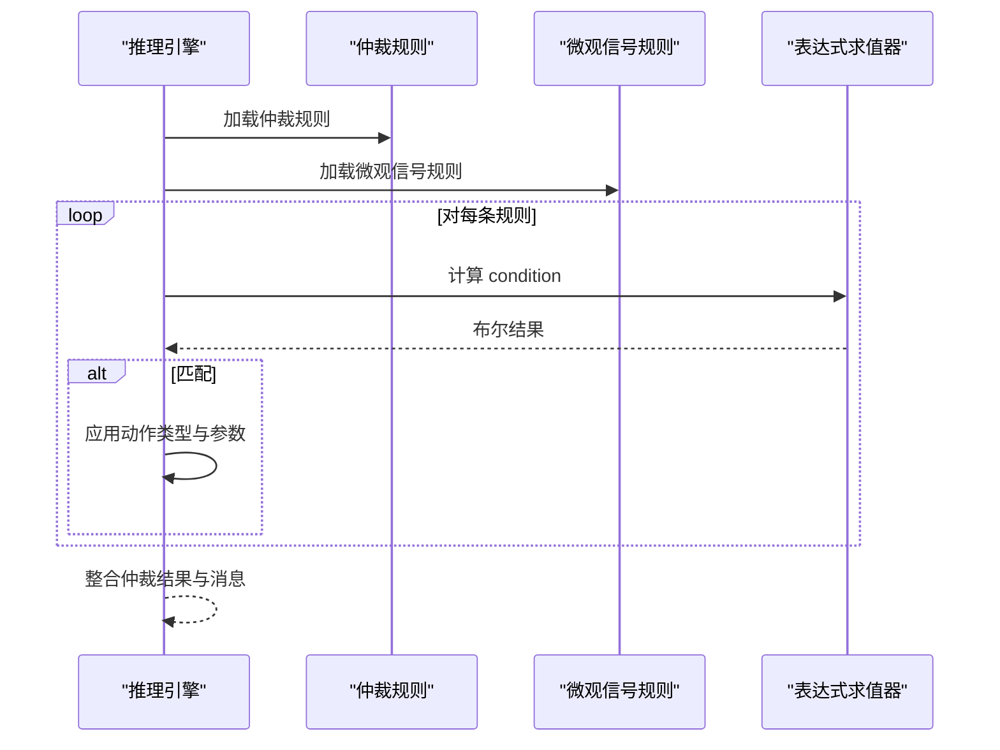
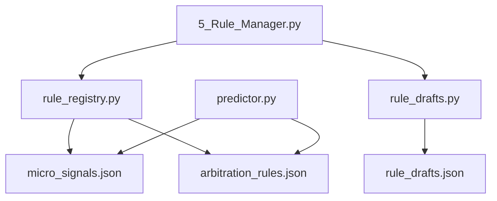

# 规则管理API

<cite>
**本文档引用的文件**
- [rule_registry.py](file://src/utils/rule_registry.py)
- [rule_drafts.py](file://src/utils/rule_drafts.py)
- [5_Rule_Manager.py](file://src/pages/5_Rule_Manager.py)
- [micro_signals.json](file://data/rules/micro_signals.json)
- [arbitration_rules.json](file://data/rules/arbitration_rules.json)
- [rule_drafts.json](file://data/rules/rule_drafts.json)
- [predictor.py](file://src/llm/predictor.py)
</cite>

## 目录
1. [简介](#简介)
2. [项目结构](#项目结构)
3. [核心组件](#核心组件)
4. [架构概览](#架构概览)
5. [详细组件分析](#详细组件分析)
6. [依赖分析](#依赖分析)
7. [性能考量](#性能考量)
8. [故障排除指南](#故障排除指南)
9. [结论](#结论)

## 简介
本文件面向规则管理API的使用者与维护者，系统性阐述动态规则注册接口、规则草稿管理API、微观信号规则与仲裁规则的具体实现机制，以及最佳实践、错误处理与性能优化建议。文档以代码为依据，结合实际数据文件与前端管理界面，帮助读者快速理解并正确使用规则管理功能。

## 项目结构
规则管理相关的核心文件分布如下：
- 工具模块：规则注册与草稿管理工具函数
- 数据文件：规则与草稿的持久化存储
- 前端页面：规则管理的可视化界面
- 推理引擎：规则的执行与仲裁逻辑

**图表来源**
- [rule_registry.py:1-278](file://src/utils/rule_registry.py#L1-L278)
- [rule_drafts.py:1-91](file://src/utils/rule_drafts.py#L1-L91)
- [5_Rule_Manager.py:1-678](file://src/pages/5_Rule_Manager.py#L1-L678)
- [micro_signals.json:1-977](file://data/rules/micro_signals.json#L1-L977)
- [arbitration_rules.json:1-63](file://data/rules/arbitration_rules.json#L1-L63)
- [rule_drafts.json:1-229](file://data/rules/rule_drafts.json#L1-L229)
- [predictor.py:1400-1599](file://src/llm/predictor.py#L1400-L1599)

**章节来源**
- [rule_registry.py:1-278](file://src/utils/rule_registry.py#L1-L278)
- [rule_drafts.py:1-91](file://src/utils/rule_drafts.py#L1-L91)
- [5_Rule_Manager.py:1-678](file://src/pages/5_Rule_Manager.py#L1-L678)

## 核心组件
- 规则注册与转换工具：负责规则ID生成、条件规范化、动作类型转换、规则持久化等
- 草稿管理工具：负责草稿的增删改查、状态管理、唯一ID生成等
- 规则管理页面：提供规则编辑、草稿审核、AI自动生成规则等功能
- 推理引擎：执行仲裁保护规则与微观信号规则，生成保护动作与仲裁结果

**章节来源**
- [rule_registry.py:18-33](file://src/utils/rule_registry.py#L18-L33)
- [rule_drafts.py:10-26](file://src/utils/rule_drafts.py#L10-L26)
- [5_Rule_Manager.py:94-215](file://src/pages/5_Rule_Manager.py#L94-L215)
- [predictor.py:1401-1473](file://src/llm/predictor.py#L1401-L1473)

## 架构概览
规则管理API采用分层设计：
- 表现层：Streamlit页面提供规则编辑与草稿审核界面
- 业务层：规则注册与草稿管理工具封装规则转换与持久化逻辑
- 数据层：JSON文件存储规则与草稿，路径由工具函数统一管理

**图表来源**
- [5_Rule_Manager.py:450-454](file://src/pages/5_Rule_Manager.py#L450-L454)
- [rule_drafts.py:10-26](file://src/utils/rule_drafts.py#L10-L26)
- [rule_registry.py:18-33](file://src/utils/rule_registry.py#L18-L33)
- [rule_registry.py:271-277](file://src/utils/rule_registry.py#L271-L277)

## 详细组件分析

### 动态规则注册接口
动态规则注册接口负责：
- 规则ID生成：根据草稿标题、类别与现有ID集合生成唯一ID，确保不冲突
- 规则条件规范化：将自然语言条件转换为可执行的Python布尔表达式，支持别名替换与范围语法
- 规则动作类型转换：将自然语言动作摘要转换为标准化的动作类型与参数
- 规则持久化：将规则写入对应的JSON文件

**图表来源**
- [rule_registry.py:57-70](file://src/utils/rule_registry.py#L57-L70)
- [rule_registry.py:102-147](file://src/utils/rule_registry.py#L102-L147)
- [rule_registry.py:150-176](file://src/utils/rule_registry.py#L150-L176)
- [rule_registry.py:179-218](file://src/utils/rule_registry.py#L179-L218)
- [rule_registry.py:271-277](file://src/utils/rule_registry.py#L271-L277)

**章节来源**
- [rule_registry.py:57-70](file://src/utils/rule_registry.py#L57-L70)
- [rule_registry.py:102-147](file://src/utils/rule_registry.py#L102-L147)
- [rule_registry.py:150-176](file://src/utils/rule_registry.py#L150-L176)
- [rule_registry.py:179-218](file://src/utils/rule_registry.py#L179-L218)
- [rule_registry.py:271-277](file://src/utils/rule_registry.py#L271-L277)

### 规则草稿管理API
规则草稿管理API提供以下能力：
- 草稿导入导出：读取与写入草稿JSON文件
- 草稿状态管理：接受、拒绝、忽略草稿，更新状态字段
- 草稿去重与唯一ID：为无ID草稿生成唯一ID，避免重复
- 草稿替换：按日期批量替换待审核草稿

**图表来源**
- [rule_drafts.py:10-26](file://src/utils/rule_drafts.py#L10-L26)
- [rule_drafts.py:68-79](file://src/utils/rule_drafts.py#L68-L79)
- [rule_drafts.py:82-91](file://src/utils/rule_drafts.py#L82-L91)
- [rule_drafts.py:48-61](file://src/utils/rule_drafts.py#L48-L61)

**章节来源**
- [rule_drafts.py:10-26](file://src/utils/rule_drafts.py#L10-L26)
- [rule_drafts.py:68-79](file://src/utils/rule_drafts.py#L68-L79)
- [rule_drafts.py:82-91](file://src/utils/rule_drafts.py#L82-L91)
- [rule_drafts.py:48-61](file://src/utils/rule_drafts.py#L48-L61)

### 微观信号规则实现
微观信号规则用于识别盘口与欧赔的特定组合形态，提供风险级别、预警模板与预测偏向。其特点包括：
- 条件表达式：使用Python布尔表达式，支持变量别名与范围语法
- 风险级别：高危/关注等级别，辅助优先级排序
- 预测偏向：明确的NSPF偏向，指导权重调整
- 场景剧本：将复杂盘口形态抽象为可复用的场景Key与Parts

**图表来源**
- [micro_signals.json:1-977](file://data/rules/micro_signals.json#L1-L977)
- [rule_registry.py:248-268](file://src/utils/rule_registry.py#L248-L268)

**章节来源**
- [micro_signals.json:1-977](file://data/rules/micro_signals.json#L1-L977)
- [rule_registry.py:248-268](file://src/utils/rule_registry.py#L248-L268)

### 仲裁规则实现
仲裁规则用于在预测过程中实施保护措施，防止弱证据推翻强盘口或在信息不足时直接回避。其特点包括：
- 动作类型：直接回避、禁止推翻、强制双选、压低置信度、要求补充推翻原因
- 动作参数：JSON格式，包含消息、置信度上限、双选开关、被禁止的维度等
- 解释模板：用于生成仲裁消息，指导用户理解规则触发原因

**图表来源**
- [arbitration_rules.json:1-63](file://data/rules/arbitration_rules.json#L1-L63)
- [rule_registry.py:221-245](file://src/utils/rule_registry.py#L221-L245)

**章节来源**
- [arbitration_rules.json:1-63](file://data/rules/arbitration_rules.json#L1-L63)
- [rule_registry.py:221-245](file://src/utils/rule_registry.py#L221-L245)

### 规则执行与仲裁机制
推理引擎在执行阶段：
- 加载规则：从JSON文件加载微观信号与仲裁规则
- 条件求值：使用安全表达式求值器对规则条件进行布尔计算
- 动作应用：根据动作类型更新仲裁结果，包括是否中止预测、是否强制双选、置信度上限等
- 结果整合：汇总所有触发规则的消息，形成最终仲裁说明

**图表来源**
- [predictor.py:1401-1473](file://src/llm/predictor.py#L1401-L1473)
- [predictor.py:1476-1499](file://src/llm/predictor.py#L1476-L1499)

**章节来源**
- [predictor.py:1401-1473](file://src/llm/predictor.py#L1401-L1473)
- [predictor.py:1476-1499](file://src/llm/predictor.py#L1476-L1499)

## 依赖分析
规则管理API的依赖关系清晰，耦合度较低：
- 规则管理页面依赖规则注册与草稿工具函数
- 规则注册工具依赖文件系统路径与JSON序列化
- 草稿工具独立管理草稿生命周期
- 推理引擎独立加载并执行规则

**图表来源**
- [5_Rule_Manager.py:16-26](file://src/pages/5_Rule_Manager.py#L16-L26)
- [rule_registry.py:6-15](file://src/utils/rule_registry.py#L6-L15)
- [rule_drafts.py:6](file://src/utils/rule_drafts.py#L6)
- [predictor.py:1401-1473](file://src/llm/predictor.py#L1401-L1473)

**章节来源**
- [5_Rule_Manager.py:16-26](file://src/pages/5_Rule_Manager.py#L16-L26)
- [rule_registry.py:6-15](file://src/utils/rule_registry.py#L6-L15)
- [rule_drafts.py:6](file://src/utils/rule_drafts.py#L6)
- [predictor.py:1401-1473](file://src/llm/predictor.py#L1401-L1473)

## 性能考量
- 文件I/O优化：批量读取与写入，避免频繁磁盘访问
- 表达式求值：使用安全表达式求值器，限制函数集，减少执行开销
- 规则数量控制：通过场景剧本与优先级管理，减少无效匹配
- 前端渲染：按场景筛选与焦点规则高亮，提升交互效率

[本节为通用性能建议，无需特定文件引用]

## 故障排除指南
常见问题与处理方法：
- 规则条件包含不支持的伪代码：规范化过程会抛出异常，需改写为Python布尔表达式
- 草稿状态更新失败：检查JSON文件权限与格式，确保状态字段存在
- 规则ID冲突：使用唯一ID生成函数，确保ID不重复
- 仲裁规则执行异常：捕获表达式求值异常并记录告警，不影响其他规则执行

**章节来源**
- [rule_registry.py:140-145](file://src/utils/rule_registry.py#L140-L145)
- [rule_drafts.py:68-79](file://src/utils/rule_drafts.py#L68-L79)
- [predictor.py:1435-1437](file://src/llm/predictor.py#L1435-L1437)

## 结论
规则管理API通过清晰的分层设计与严格的规则转换流程，实现了从草稿到规则的自动化与可视化管理。配合推理引擎的规则执行与仲裁机制，能够有效提升预测质量与风险管理能力。建议在日常使用中遵循最佳实践，定期审查规则有效性，并通过场景剧本与优先级管理保持规则库的可维护性。