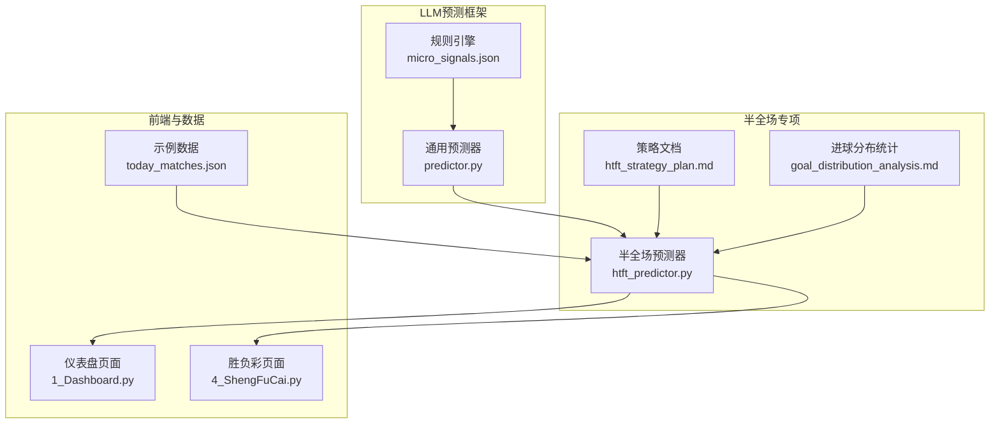
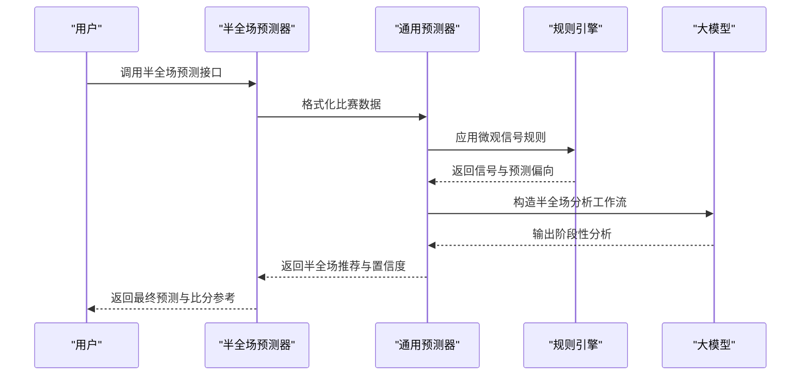
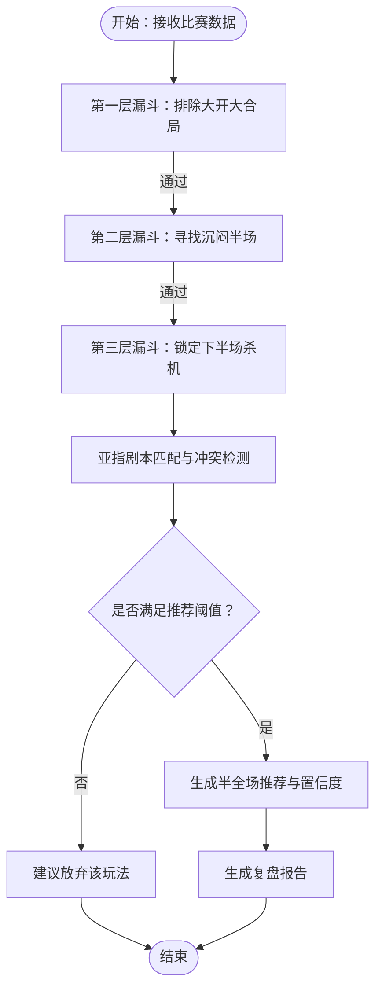
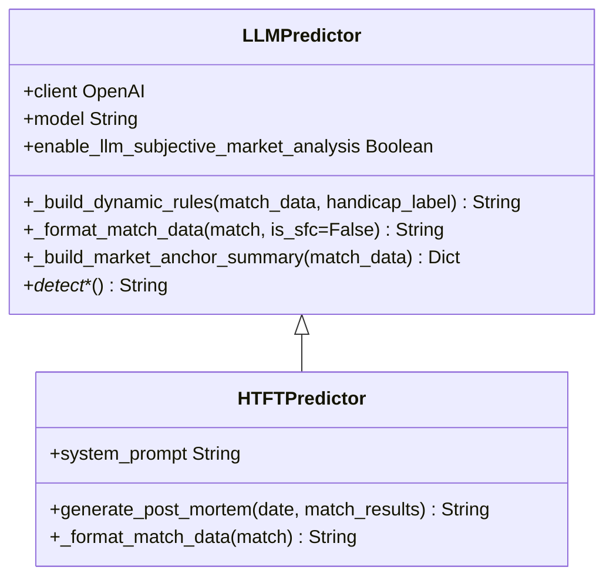
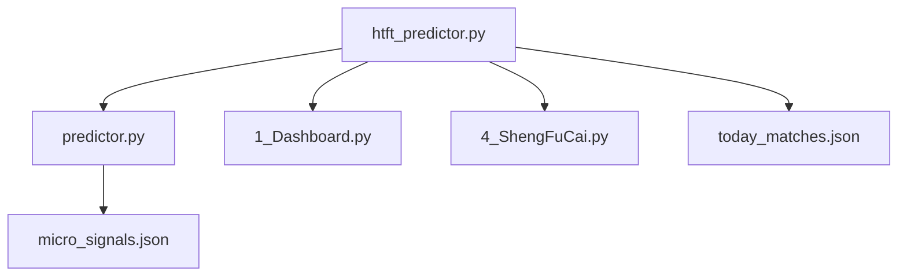

# 半全场预测器

<cite>
**本文档引用的文件**
- [htft_predictor.py](file://src/llm/htft_predictor.py)
- [predictor.py](file://src/llm/predictor.py)
- [htft_strategy_plan.md](file://docs/htft_strategy_plan.md)
- [goal_distribution_analysis.md](file://docs/goal_distribution_analysis.md)
- [micro_signals.json](file://data/rules/micro_signals.json)
- [today_matches.json](file://data/today_matches.json)
- [1_Dashboard.py](file://src/pages/1_Dashboard.py)
- [4_ShengFuCai.py](file://src/pages/4_ShengFuCai.py)
</cite>

## 目录
1. [简介](#简介)
2. [项目结构](#项目结构)
3. [核心组件](#核心组件)
4. [架构概览](#架构概览)
5. [详细组件分析](#详细组件分析)
6. [依赖分析](#依赖分析)
7. [性能考量](#性能考量)
8. [故障排查指南](#故障排查指南)
9. [结论](#结论)
10. [附录](#附录)

## 简介
本文件为“半全场预测器”的详细API文档，聚焦竞彩足球半全场（半场/全场）胜平负预测功能，涵盖以下关键主题：
- 半全场胜平负组合分析：围绕“半胜/半负/半平”与“全场胜/负/平”的组合关系，建立“上半场僵持期+下半场破局期”的专属分析漏斗。
- 进球分布预测：结合联赛特征聚类与进球盘口，提供半全场场景下的比分与进球数参考。
- 时间敏感性分析：强调半全场预测的时间窗口与盘口变化对预测的影响，以及模型对“上半场极可能进球”或“全场沉闷”的规避策略。
- 数据格式与历史统计：规范半全场赔率、亚指、大小球、半场/全场数据的输入格式，提供历史统计与回测支持。
- 盘口变化建模：将微观信号（如僵尸盘、深盘升水、浅盘降水等）转化为可执行的规则引擎，指导半全场预测。
- 特殊规则引擎与多阶段预测：定义“第一层漏斗（排除大开大合）→第二层漏斗（寻找沉闷半场）→第三层漏斗（锁定下半场杀机）”的三层过滤与建模流程。
- 使用示例、数据预处理与结果解释：提供API调用示例、数据准备清单与结果解读指南。
- 准确率评估与模型优化：基于复盘报告与历史数据，提出优化策略与风控建议。

## 项目结构
半全场预测器位于LLM预测框架之上，通过专用Prompt与规则引擎实现半全场专项分析。核心文件与职责如下：
- 半全场预测器：负责构造半全场专属Prompt、格式化半全场赔率、生成复盘报告。
- 通用预测器：提供数据格式化、盘口信号检测、规则引擎集成等通用能力。
- 文档与规则：提供半全场策略计划、进球分布统计、微观信号规则集。
- 前端页面：提供半全场预测结果展示与冲突检测。
- 示例数据：提供包含半全场赔率与历史结果的样例数据。

**图表来源**
- [htft_predictor.py:1-157](file://src/llm/htft_predictor.py#L1-L157)
- [predictor.py:1-281](file://src/llm/predictor.py#L1-L281)
- [micro_signals.json:1-800](file://data/rules/micro_signals.json#L1-L800)
- [htft_strategy_plan.md:1-76](file://docs/htft_strategy_plan.md#L1-L76)
- [goal_distribution_analysis.md:1-623](file://docs/goal_distribution_analysis.md#L1-L623)
- [1_Dashboard.py:874-1437](file://src/pages/1_Dashboard.py#L874-L1437)
- [4_ShengFuCai.py:1-288](file://src/pages/4_ShengFuCai.py#L1-L288)
- [today_matches.json:1-851](file://data/today_matches.json#L1-L851)

**章节来源**
- [htft_predictor.py:1-157](file://src/llm/htft_predictor.py#L1-L157)
- [predictor.py:1-281](file://src/llm/predictor.py#L1-L281)
- [micro_signals.json:1-800](file://data/rules/micro_signals.json#L1-L800)
- [htft_strategy_plan.md:1-76](file://docs/htft_strategy_plan.md#L1-L76)
- [goal_distribution_analysis.md:1-623](file://docs/goal_distribution_analysis.md#L1-L623)
- [1_Dashboard.py:874-1437](file://src/pages/1_Dashboard.py#L874-L1437)
- [4_ShengFuCai.py:1-288](file://src/pages/4_ShengFuCai.py#L1-L288)
- [today_matches.json:1-851](file://data/today_matches.json#L1-L851)

## 核心组件
- 半全场预测器（HTFTPredictor）
  - 专责半全场（Draw-Win/Draw-Lose/Draw-Draw）分析，构造“上半场僵持度+下半场破局力”的分析工作流。
  - 格式化半全场赔率字段，增强提示词可读性。
  - 生成半全场专项复盘报告，支持命中率总结、剧本偏差剖析与模型优化建议。
- 通用预测器（LLMPredictor）
  - 提供数据格式化、盘口信号检测、规则引擎集成、市场锚点定义等通用能力。
  - 支持动态规则装配与盘型路由，适配不同盘口与联赛特征。
- 规则引擎（micro_signals.json）
  - 提供微观信号规则集，覆盖僵尸盘、深盘升水、浅盘降水、欧赔骤降等高危/中危信号。
  - 支持预测偏向与效果标注，便于在半全场分析中应用。
- 策略与统计（htft_strategy_plan.md、goal_distribution_analysis.md）
  - 半全场策略计划：定义三层漏斗（排除大开大合→寻找沉闷半场→锁定下半场杀机）与亚指剧本匹配。
  - 进球分布统计：按联赛特征聚类提供进球概率分布，辅助半全场比分参考。
- 前端与数据（1_Dashboard.py、4_ShengFuCai.py、today_matches.json）
  - 仪表盘页面：展示半全场推荐与置信度，检测全场与半全场模型冲突并提示放弃。
  - 胜负彩页面：提供半全场数据抓取与预测入口。
  - 示例数据：包含半全场赔率字段的样例，便于API测试与演示。

**章节来源**
- [htft_predictor.py:7-157](file://src/llm/htft_predictor.py#L7-L157)
- [predictor.py:20-281](file://src/llm/predictor.py#L20-L281)
- [micro_signals.json:1-800](file://data/rules/micro_signals.json#L1-L800)
- [htft_strategy_plan.md:1-76](file://docs/htft_strategy_plan.md#L1-L76)
- [goal_distribution_analysis.md:1-623](file://docs/goal_distribution_analysis.md#L1-L623)
- [1_Dashboard.py:874-1437](file://src/pages/1_Dashboard.py#L874-L1437)
- [4_ShengFuCai.py:1-288](file://src/pages/4_ShengFuCai.py#L1-L288)
- [today_matches.json:1-851](file://data/today_matches.json#L1-L851)

## 架构概览
半全场预测器在通用预测器之上，通过专用Prompt与规则引擎协同工作，形成“数据输入→格式化→规则检测→分析工作流→结果输出→复盘优化”的闭环。

**图表来源**
- [htft_predictor.py:7-157](file://src/llm/htft_predictor.py#L7-L157)
- [predictor.py:81-281](file://src/llm/predictor.py#L81-L281)
- [micro_signals.json:1-800](file://data/rules/micro_signals.json#L1-L800)

## 详细组件分析

### 半全场预测器（HTFTPredictor）
- 专属Prompt与分析工作流
  - 第一层漏斗：排除全场进球期望过高（如全场让球>1.25或全场大小球>3.0）的比赛。
  - 第二层漏斗：寻找“沉闷半场”（双方近10场半场0-0或1-1概率>50%，半场大小球盘口为0.75或1球高水）。
  - 第三层漏斗：锁定“下半场杀机”（强队下半场进球占比>60%，全场平局欧赔>3.20）。
  - 亚指剧本匹配：阵容迷雾陷阱、骄傲的升班马、极限深盘杀下盘等。
  - 冲突与矛盾检测：严格控制“平胜/平负”的推荐阈值，避免与全场模型冲突。
- 数据格式化
  - 强化半全场赔率字段（平胜/平负/平平/胜胜/负负），便于分析与展示。
- 复盘报告生成
  - 专项表现总结、剧本偏差剖析、模型优化建议。
  - 基于历史半全场结果与实际赛果进行对比分析。

**图表来源**
- [htft_predictor.py:11-77](file://src/llm/htft_predictor.py#L11-L77)
- [htft_strategy_plan.md:49-66](file://docs/htft_strategy_plan.md#L49-L66)

**章节来源**
- [htft_predictor.py:7-157](file://src/llm/htft_predictor.py#L7-L157)
- [htft_strategy_plan.md:1-76](file://docs/htft_strategy_plan.md#L1-L76)

### 通用预测器（LLMPredictor）
- 数据格式化
  - 自动生成“基本面、高阶攻防数据、盘赔数据、微观信号、盘型标注、预警信号”等结构化文本。
  - 支持半全场赔率字段的格式化增强。
- 规则引擎集成
  - 动态路由：根据盘型（平手/浅盘/中盘/深盘）与联赛特征选择规则集。
  - 联赛特异性规则注入，减少上下文负担与规则冲突。
- 市场锚点与信号检测
  - 定义亚盘/欧赔锚点，辅助情报与盘口联动分析。
  - 检测深盘死水、半球生死盘、平手盘水位僵持、欧亚背离等量化预警。

**图表来源**
- [predictor.py:20-281](file://src/llm/predictor.py#L20-L281)
- [htft_predictor.py:7-157](file://src/llm/htft_predictor.py#L7-L157)

**章节来源**
- [predictor.py:20-281](file://src/llm/predictor.py#L20-L281)
- [htft_predictor.py:7-157](file://src/llm/htft_predictor.py#L7-L157)

### 规则引擎与微观信号
- 规则类型
  - 高危/中危/关注级信号，覆盖僵尸盘、深盘升水、浅盘降水、欧赔骤降等。
  - 支持预测偏向与效果标注，便于在半全场分析中强制或抑制特定方向。
- 应用方式
  - 通过条件表达式自动匹配盘口与赔率变化，输出预警模板与预测偏向。
  - 与通用预测器的动态规则装配结合，减少上下文负担。

**章节来源**
- [micro_signals.json:1-800](file://data/rules/micro_signals.json#L1-L800)
- [predictor.py:51-79](file://src/llm/predictor.py#L51-L79)

### 策略与统计支持
- 半全场策略计划
  - 明确“上半场僵持期”与“下半场破局期”的分析要点，提供亚指剧本与机构意图解读。
  - 设计三层漏斗与建模筛选条件，支撑程序化落地。
- 进球分布统计
  - 按联赛特征聚类提供进球概率分布，辅助半全场比分参考与置信度评估。

**章节来源**
- [htft_strategy_plan.md:1-76](file://docs/htft_strategy_plan.md#L1-L76)
- [goal_distribution_analysis.md:1-623](file://docs/goal_distribution_analysis.md#L1-L623)

### 前端与数据集成
- 仪表盘页面
  - 展示半全场推荐与置信度，解析推荐文本并反推置信度（含“放弃”场景的置信度修正）。
  - 检测全场与半全场模型冲突并提示放弃。
- 胜负彩页面
  - 提供半全场数据抓取与预测入口，支持一键分析与结果保存。
- 示例数据
  - 包含半全场赔率字段的样例，便于API测试与演示。

**章节来源**
- [1_Dashboard.py:874-1437](file://src/pages/1_Dashboard.py#L874-L1437)
- [4_ShengFuCai.py:1-288](file://src/pages/4_ShengFuCai.py#L1-L288)
- [today_matches.json:1-851](file://data/today_matches.json#L1-L851)

## 依赖分析
半全场预测器与通用预测器、规则引擎、前端页面与示例数据之间存在紧密耦合关系，依赖链如下：

**图表来源**
- [htft_predictor.py:1-157](file://src/llm/htft_predictor.py#L1-L157)
- [predictor.py:1-281](file://src/llm/predictor.py#L1-L281)
- [micro_signals.json:1-800](file://data/rules/micro_signals.json#L1-L800)
- [1_Dashboard.py:874-1437](file://src/pages/1_Dashboard.py#L874-L1437)
- [4_ShengFuCai.py:1-288](file://src/pages/4_ShengFuCai.py#L1-L288)
- [today_matches.json:1-851](file://data/today_matches.json#L1-L851)

**章节来源**
- [htft_predictor.py:1-157](file://src/llm/htft_predictor.py#L1-L157)
- [predictor.py:1-281](file://src/llm/predictor.py#L1-L281)
- [micro_signals.json:1-800](file://data/rules/micro_signals.json#L1-L800)
- [1_Dashboard.py:874-1437](file://src/pages/1_Dashboard.py#L874-L1437)
- [4_ShengFuCai.py:1-288](file://src/pages/4_ShengFuCai.py#L1-L288)
- [today_matches.json:1-851](file://data/today_matches.json#L1-L851)

## 性能考量
- 上下文控制
  - 通过动态规则装配与联赛特异性规则，减少单次对话上下文负担，避免规则冲突。
- 信号检测与预警
  - 将微观信号规则化，减少大模型主观推演负担，提升响应速度与一致性。
- 数据预处理
  - 统一格式化半全场赔率与盘口数据，减少解析成本与错误率。
- 前端解析
  - 仪表盘页面对推荐文本进行结构化解析，避免重复计算与冗余展示。

[本节为一般性指导，不直接分析具体文件，故无“章节来源”]

## 故障排查指南
- LLM密钥与基础URL
  - 确认.env文件中LLM_API_KEY与LLM_API_BASE配置正确，避免初始化失败。
- 半全场赔率缺失
  - 若bqc字段缺失，系统将无法生成半全场推荐，需补充数据或提示放弃。
- 置信度解析异常
  - 当推荐文本包含“放弃”时，置信度需进行反向修正（100 - 放置置信度），确保展示一致性。
- 模型冲突检测
  - 若全场与半全场模型出现严重冲突，仪表盘将提示放弃该场比赛的投注，避免风险扩大。
- 复盘报告生成失败
  - 当调用LLM生成复盘报告异常时，返回失败提示并记录日志，便于后续排查。

**章节来源**
- [predictor.py:21-46](file://src/llm/predictor.py#L21-L46)
- [htft_predictor.py:79-144](file://src/llm/htft_predictor.py#L79-L144)
- [1_Dashboard.py:874-903](file://src/pages/1_Dashboard.py#L874-L903)
- [1_Dashboard.py:1417-1422](file://src/pages/1_Dashboard.py#L1417-L1422)

## 结论
半全场预测器通过“三层漏斗+亚指剧本+微观信号”的组合，实现了对半全场胜平负的系统化分析。其核心优势在于：
- 明确的阶段化分析流程，覆盖“上半场僵持期+下半场破局期”的关键节点。
- 规则化与工程化落地，减少主观偏差与上下文负担。
- 与通用预测器、规则引擎、前端页面与示例数据的协同，形成完整的预测闭环。
建议在实际使用中：
- 严格遵循数据预处理要求，确保半全场赔率与盘口数据完整。
- 关注模型冲突与风控提示，必要时放弃高风险玩法。
- 基于复盘报告持续优化规则与Prompt，提升命中率与稳定性。

[本节为总结性内容，不直接分析具体文件，故无“章节来源”]

## 附录

### API使用示例（路径引用）
- 调用半全场预测接口
  - 示例路径：[调用半全场预测接口:1-157](file://src/llm/htft_predictor.py#L1-L157)
- 生成半全场复盘报告
  - 示例路径：[生成复盘报告:79-144](file://src/llm/htft_predictor.py#L79-L144)
- 解析半全场推荐与置信度
  - 示例路径：[解析推荐与置信度:874-903](file://src/pages/1_Dashboard.py#L874-L903)
- 检测模型冲突并提示放弃
  - 示例路径：[冲突检测:1417-1422](file://src/pages/1_Dashboard.py#L1417-L1422)

### 数据预处理要求
- 必填字段
  - 半全场赔率（bqc）：平胜/平负/平平/胜胜/负负等。
  - 盘口与赔率：亚指初盘/即时盘、大小球盘口、竞彩赔率。
- 可选字段
  - 进球分布、联赛特征、历史交锋、伤停信息等，用于增强分析。
- 示例数据
  - 参考路径：[示例数据:1-851](file://data/today_matches.json#L1-L851)

### 结果解释指南
- 推荐类型
  - 平胜/平负/平平/建议放弃该玩法。
- 置信度
  - 0-100，半全场预测难度极高，置信度>60即可视为重点关注。
- 比分与进球参考
  - 结合联赛特征聚类与历史统计，提供半全场场景下的比分与进球数参考。

**章节来源**
- [htft_predictor.py:79-157](file://src/llm/htft_predictor.py#L79-L157)
- [goal_distribution_analysis.md:1-623](file://docs/goal_distribution_analysis.md#L1-L623)
- [today_matches.json:1-851](file://data/today_matches.json#L1-L851)