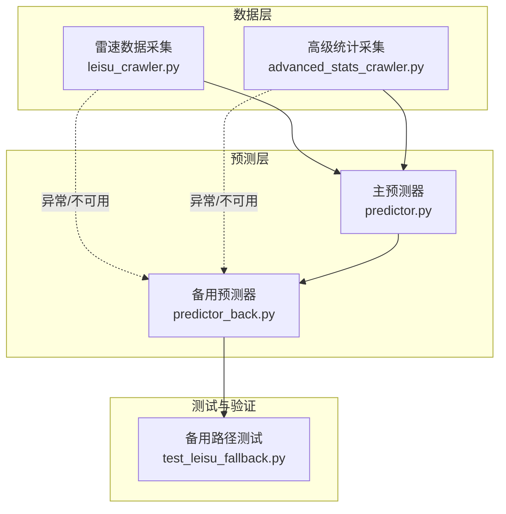
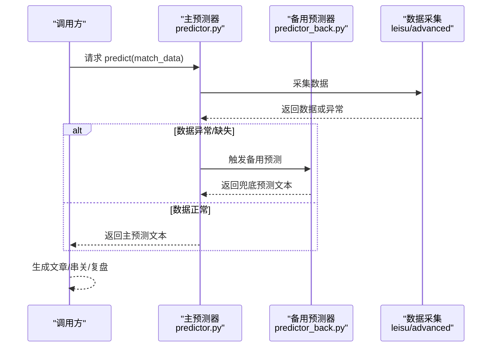
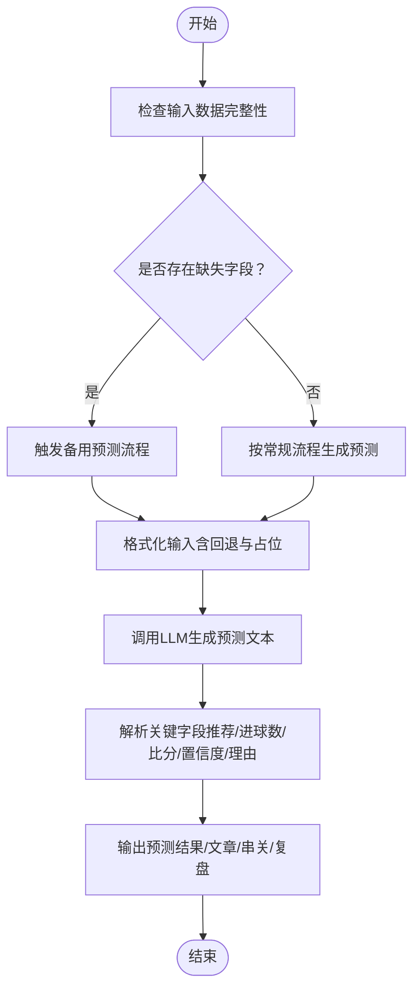
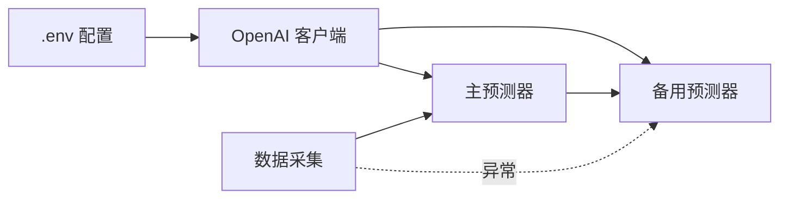

# 备用预测器

<cite>
**本文引用的文件**
- [predictor_back.py](file://src/llm/predictor_back.py)
- [predictor.py](file://src/llm/predictor.py)
- [leisu_crawler.py](file://src/crawler/leisu_crawler.py)
- [advanced_stats_crawler.py](file://src/crawler/advanced_stats_crawler.py)
- [test_leisu_fallback.py](file://scripts/test_leisu_fallback.py)
</cite>

## 目录
1. [简介](#简介)
2. [项目结构](#项目结构)
3. [核心组件](#核心组件)
4. [架构总览](#架构总览)
5. [详细组件分析](#详细组件分析)
6. [依赖分析](#依赖分析)
7. [性能考量](#性能考量)
8. [故障排查指南](#故障排查指南)
9. [结论](#结论)
10. [附录](#附录)

## 简介
本文件聚焦“备用预测器”的设计与实现，围绕 predictor_back 类的后备预测功能展开，系统阐述在主预测器数据缺失或异常时的降级处理、替代预测算法与容错机制；详述备用预测的数据输入要求、算法选择逻辑、预测结果生成流程；解释备用预测器与主预测器的协作关系、切换条件与性能对比；并提供使用场景、故障恢复策略与系统稳定性保障措施，以及监控指标与维护建议。

## 项目结构
- 备用预测器位于 src/llm/predictor_back.py，提供与主预测器互补的后备能力，侧重兜底与容错。
- 主预测器位于 src/llm/predictor.py，承担日常预测任务，内置规则引擎与多种风控信号。
- 数据采集侧包含 src/crawler 下的爬虫模块，如 leisu_crawler 与 advanced_stats_crawler，为预测提供基础数据；当真实 API 不可用时，下游会触发 fallback 逻辑。
- scripts/test_leisu_fallback.py 展示了在爬虫 worker 异常时的降级测试方法，体现备用路径的存在与验证方式。

图表来源
- [predictor_back.py](file://src/llm/predictor_back.py)
- [predictor.py](file://src/llm/predictor.py)
- [leisu_crawler.py](file://src/crawler/leisu_crawler.py)
- [advanced_stats_crawler.py](file://src/crawler/advanced_stats_crawler.py)
- [test_leisu_fallback.py](file://scripts/test_leisu_fallback.py)

章节来源
- [predictor_back.py](file://src/llm/predictor_back.py)
- [predictor.py](file://src/llm/predictor.py)
- [leisu_crawler.py](file://src/crawler/leisu_crawler.py)
- [advanced_stats_crawler.py](file://src/crawler/advanced_stats_crawler.py)
- [test_leisu_fallback.py](file://scripts/test_leisu_fallback.py)

## 核心组件
- 备用预测器 LLMPredictor（predictor_back.py）
  - 负责在主预测器数据链路异常或缺失时，提供兜底预测能力。
  - 内置系统提示词与格式化模板，支持生成公众号文章、复盘报告与串关方案。
  - 提供预测接口 predict，支持时间段自动判断与交叉盘风险提示。
- 主预测器 LLMPredictor（predictor.py）
  - 日常预测主体，集成规则引擎、盘赔信号检测、仲裁校验与风控约束。
  - 在数据采集异常时，备用预测器作为降级路径参与。
- 数据采集与降级
  - leisu_crawler 与 advanced_stats_crawler 在真实 API 不可用时，会触发 fallback，下游可切换至备用预测器。
  - test_leisu_fallback.py 通过模拟 worker 异常，验证 fallback 与备用路径可用性。

章节来源
- [predictor_back.py](file://src/llm/predictor_back.py)
- [predictor.py](file://src/llm/predictor.py)
- [leisu_crawler.py](file://src/crawler/leisu_crawler.py)
- [advanced_stats_crawler.py](file://src/crawler/advanced_stats_crawler.py)
- [test_leisu_fallback.py](file://scripts/test_leisu_fallback.py)

## 架构总览
备用预测器与主预测器的关系如下：
- 正常流程：主预测器 predict 负责生成预测文本与置信度；备用预测器在主预测器数据链路异常或缺失时接管。
- 协作关系：备用预测器不替代主预测器，而是作为“降级/容错”组件参与；当主预测器无法获取关键数据（如亚盘/欧赔/高级统计）时，备用预测器以更宽松的输入要求与简化规则生成预测。
- 切换条件：当数据采集模块抛出异常、关键字段缺失或数据质量不达标时，系统触发备用预测器；同时，备用预测器自身也内置“交叉盘/单日少赛事”等风控提示，辅助决策。

图表来源
- [predictor_back.py](file://src/llm/predictor_back.py)
- [predictor.py](file://src/llm/predictor.py)
- [leisu_crawler.py](file://src/crawler/leisu_crawler.py)
- [advanced_stats_crawler.py](file://src/crawler/advanced_stats_crawler.py)

## 详细组件分析

### 备用预测器 LLMPredictor（predictor_back.py）
- 初始化与配置
  - 从项目根目录加载 .env，读取 LLM API KEY、BASE_URL、MODEL 等参数，初始化 OpenAI 客户端。
  - 定义系统提示词（角色：资深足球数据分析师与竞彩操盘专家），强调“机构意图主导”“盘口逻辑优先”“交叉验证与结论生成”等核心理念。
- 数据格式化与输入要求
  - _format_match_data：将比赛信息、基本面、高阶攻防数据、盘赔数据（竞彩/亚指/半全场）等结构化为 Prompt 文本。
  - 输入字段包括：联赛、对阵、时间、近期战绩、交锋记录、伤停与阵容、高级统计（场均进球/失球/射门/射正/xG）、竞彩赔率、亚指初盘/即时盘、半全场赔率等。
  - 当部分字段缺失时，备用预测器采用正则回退与“未知”占位，保证输入完整性。
- 预测流程与算法选择逻辑
  - predict：自动判断时间段（pre_24h/pre_12h/final），拼接交叉盘/单日少赛事风险提示，调用 LLM 生成预测文本。
  - _determine_prediction_period：基于比赛时间计算与当前时间差，决定预测阶段。
  - parse_prediction_details：解析 LLM 输出，抽取“不让球推荐/让球推荐/进球数/比分/置信度/理由”等关键字段。
- 结果生成与输出
  - generate_article：将分析报告转换为公众号文章，包含标题、基本面剖析、机构意图与指数逻辑推演、比赛看法（含重点与扫盘清单）。
  - generate_post_mortem：基于预测与实际赛果生成复盘报告，提炼经验与优化建议。
  - generate_parlays：基于当日预测汇总生成串关方案，内置“交叉盘高危”风控提示与一致性约束。
  - compare_parlays：对比两次串关方案，分析选场差异、风险与回报评估。
- 容错与降级
  - 当数据采集异常或关键字段缺失时，备用预测器以“宽松输入+简化规则”生成预测，避免因数据不完整导致预测中断。
  - 内置“交叉盘/单日少赛事”风险提示，辅助风控与组合策略制定。

图表来源
- [predictor_back.py](file://src/llm/predictor_back.py)

章节来源
- [predictor_back.py](file://src/llm/predictor_back.py)

### 主预测器 LLMPredictor（predictor.py）
- 规则引擎与风控信号
  - 动态规则组装：根据盘型（平手/浅盘/中盘/深盘/超深盘）、联赛特征与市场变化，动态拼接提示词，减轻上下文负担并避免规则冲突。
  - 微观信号检测：超深盘死水陷阱、半球生死盘异动、平手盘水位僵持、赔率方向矛盾、盘水背离、浅盘升水诱下、欧亚背离量化、浅盘示弱诱下等。
  - 四维仲裁：基本面方向、盘赔方向、情报佐证结论、微观规则结论，最终仲裁方向与推翻原因，确保结论自洽与可追溯。
- 数据格式化与输入要求
  - _format_match_data：结构化展示联赛特性、近期战绩、伤停量化、进球分布、积分排名、历史交锋、近期战绩、高级统计、盘赔异动摘要、微观信号、盘型标注、风险预警等。
- 预测流程与输出
  - predict：调用 LLM 生成预测文本，parse_prediction_details 抽取关键字段。
  - generate_article/post_mortem/parlays/compare_parlays：与备用预测器类似，但规则更复杂、风控更严格。

章节来源
- [predictor.py](file://src/llm/predictor.py)

### 数据采集与降级（leisu/advanced_stats_crawler）
- leisu_crawler
  - 提供 fetch_match_data 与 _fetch_match_data_internal 等方法；当 worker 异常时，备用预测器可作为兜底路径。
  - _extract_team_label/_extract_swot_modules 等工具函数用于清洗与结构化数据。
- advanced_stats_crawler
  - 当未配置真实 API Key 时，直接返回空，由下游使用 500.com 的战绩正则 fallback，体现“真实数据不可用时的降级策略”。

章节来源
- [leisu_crawler.py](file://src/crawler/leisu_crawler.py)
- [advanced_stats_crawler.py](file://src/crawler/advanced_stats_crawler.py)

### 备用路径测试（test_leisu_fallback.py）
- 通过将 crawler._run_in_worker 替换为抛出异常的 boom 函数，模拟 worker 异常，验证备用预测器是否能正确接管并返回数据或兜底结果。
- 该测试体现了备用预测器在真实异常场景下的可用性与稳定性验证方法。

章节来源
- [test_leisu_fallback.py](file://scripts/test_leisu_fallback.py)

## 依赖分析
- 组件耦合
  - 备用预测器与主预测器：无直接调用关系，备用预测器作为“降级/容错”组件参与；当主预测器数据链路异常时，备用预测器接管。
  - 与数据采集：备用预测器依赖主预测器传递的结构化数据；当数据采集异常或缺失时，备用预测器以更宽松的输入要求生成预测。
- 外部依赖
  - OpenAI 客户端：用于调用 LLM 生成预测文本。
  - .env 配置：LLM_API_KEY、LLM_API_BASE、LLM_MODEL 等。
- 潜在循环依赖
  - 无直接循环依赖；备用预测器不依赖主预测器的规则引擎与风控信号，避免相互耦合。

图表来源
- [predictor_back.py](file://src/llm/predictor_back.py)
- [predictor.py](file://src/llm/predictor.py)
- [leisu_crawler.py](file://src/crawler/leisu_crawler.py)
- [advanced_stats_crawler.py](file://src/crawler/advanced_stats_crawler.py)

章节来源
- [predictor_back.py](file://src/llm/predictor_back.py)
- [predictor.py](file://src/llm/predictor.py)
- [leisu_crawler.py](file://src/crawler/leisu_crawler.py)
- [advanced_stats_crawler.py](file://src/crawler/advanced_stats_crawler.py)

## 性能考量
- 备用预测器优势
  - 输入要求更宽松：在关键字段缺失时仍可生成预测，减少预测中断风险。
  - 规则更简化：不引入复杂的微观信号与仲裁校验，降低推理复杂度与响应时间。
- 主预测器优势
  - 规则更完善：涵盖盘型分类、微观信号、仲裁校验与风控约束，预测更稳健。
  - 适合高并发与高精度场景：在数据完整时提供更高质量的预测与风控建议。
- 性能对比建议
  - 在数据完整时优先使用主预测器；在数据异常或缺失时自动切换至备用预测器，确保系统可用性。
  - 对备用预测器的 LLM 调用设置合理的超时与重试策略，避免阻塞主线程。

## 故障排查指南
- 常见问题
  - LLM_API_KEY 未配置：备用预测器初始化时报错并终止，需检查 .env 文件。
  - 数据采集异常：当 leisu/advanced_stats_crawler 抛出异常或返回空数据时，备用预测器接管。
  - 关键字段缺失：备用预测器通过正则回退与“未知”占位保证输入完整性。
- 排查步骤
  - 检查 .env 中 LLM 相关配置是否正确。
  - 查看数据采集模块日志，确认异常类型与触发条件。
  - 在备用预测器中打印格式化后的输入文本，核对字段是否缺失。
  - 使用 scripts/test_leisu_fallback.py 验证备用路径可用性。
- 恢复策略
  - 修复数据采集异常后，系统自动恢复至主预测器。
  - 对备用预测器的输出进行人工复核，确保推荐方向与风险提示合理。

章节来源
- [predictor_back.py](file://src/llm/predictor_back.py)
- [leisu_crawler.py](file://src/crawler/leisu_crawler.py)
- [advanced_stats_crawler.py](file://src/crawler/advanced_stats_crawler.py)
- [test_leisu_fallback.py](file://scripts/test_leisu_fallback.py)

## 结论
备用预测器以“降级/容错”为核心定位，在主预测器数据链路异常或缺失时提供稳定可靠的兜底能力。其通过宽松的输入要求、简化的规则与完善的容错机制，确保系统在极端条件下仍能输出预测结果。配合主预测器的复杂风控与规则引擎，备用预测器实现了高可用与高鲁棒性的协同架构。建议在生产环境中启用自动切换与监控告警，确保在异常场景下快速恢复与持续稳定运行。

## 附录
- 使用场景
  - 数据采集模块异常或网络中断时的兜底预测。
  - 关键字段缺失（如亚盘/欧赔/高级统计）时的降级处理。
  - 单日少赛事场景下的交叉盘风险提示与串关组合优化。
- 监控指标建议
  - 备用预测器触发次数与触发条件（异常类型、缺失字段、数据质量）。
  - 备用预测器输出的置信度分布与命中率。
  - LLM 调用耗时与成功率，设置超时与重试阈值。
- 维护建议
  - 定期验证备用预测器在异常场景下的可用性（参考 test_leisu_fallback.py）。
  - 对备用预测器的系统提示词与格式化模板进行版本管理与灰度发布。
  - 建立备用预测器输出的人工复核与反馈闭环，持续优化推荐质量与风控提示。