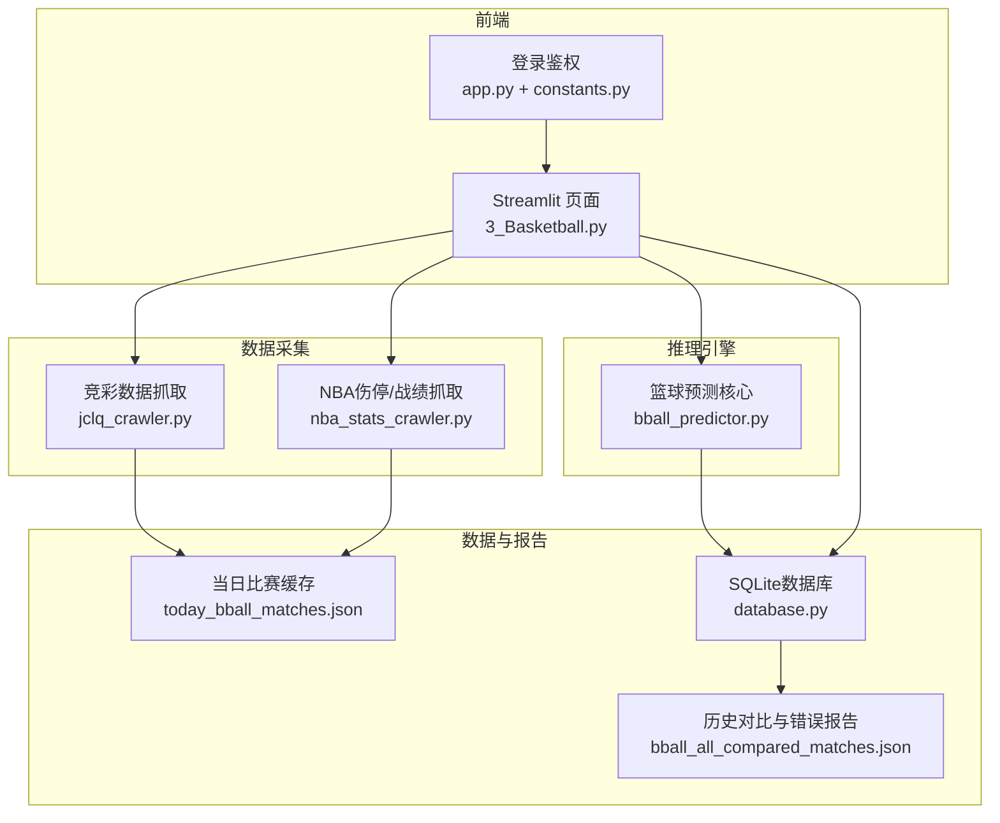
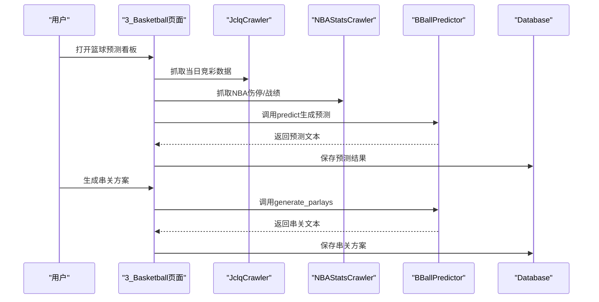
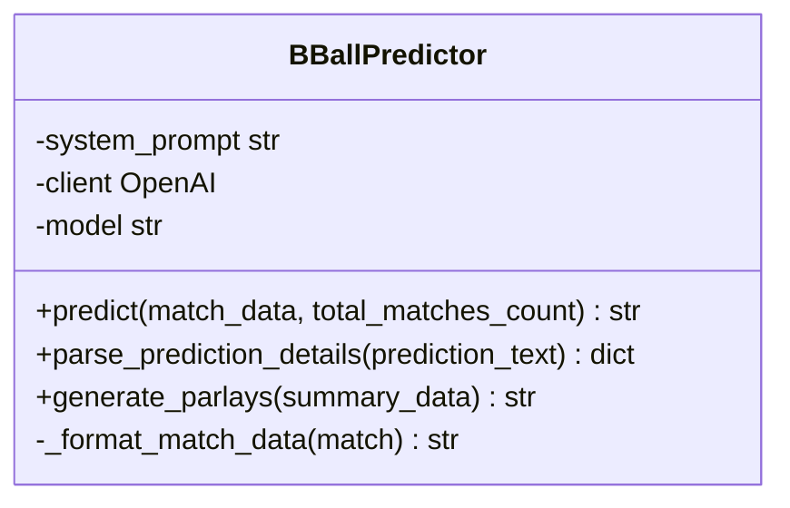
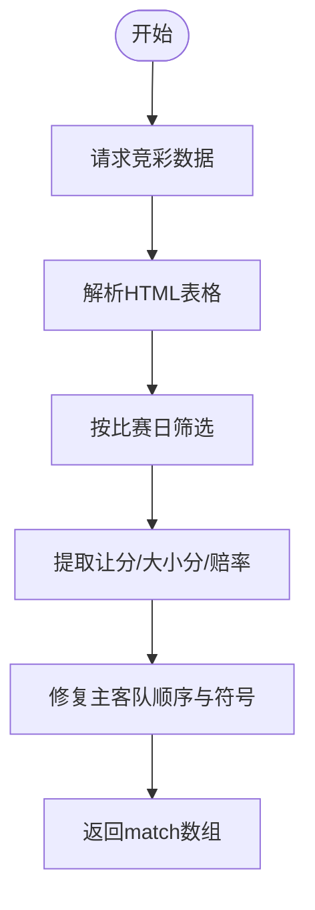
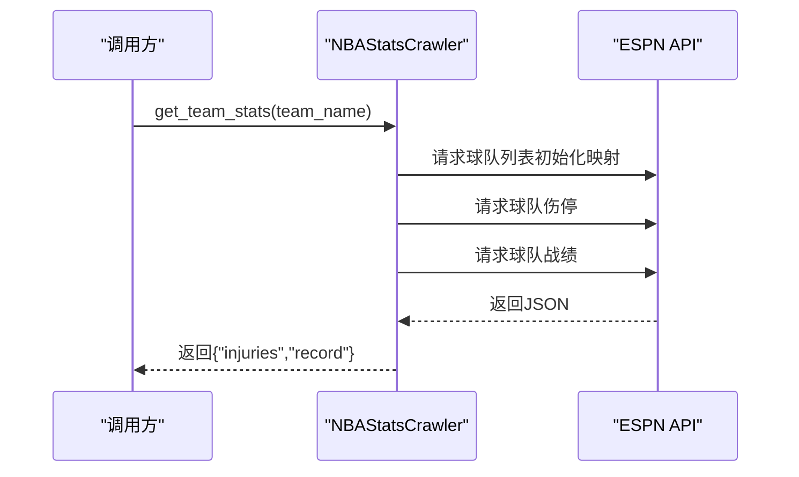
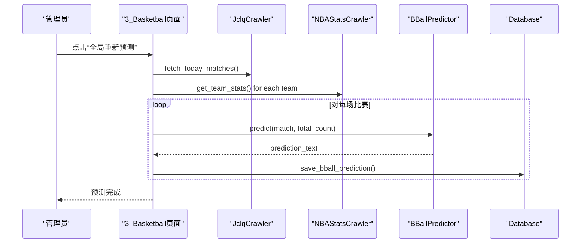
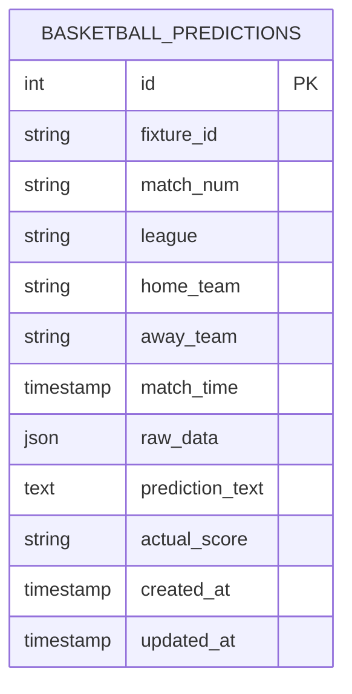
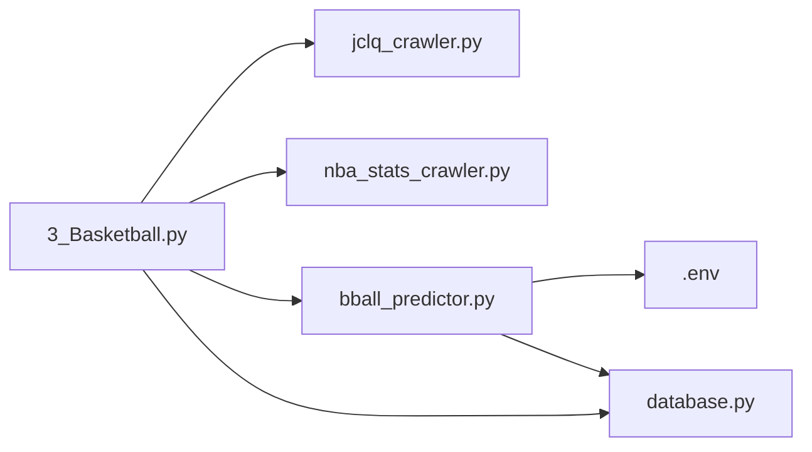
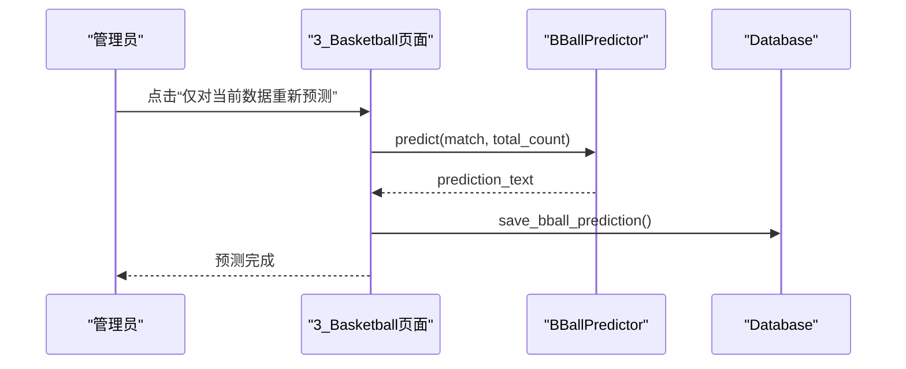

# 篮球预测器

<cite>
**本文引用的文件**
- [bball_predictor.py](file://src/llm/bball_predictor.py)
- [3_Basketball.py](file://src/pages/3_Basketball.py)
- [jclq_crawler.py](file://src/crawler/jclq_crawler.py)
- [nba_stats_crawler.py](file://src/crawler/nba_stats_crawler.py)
- [database.py](file://src/db/database.py)
- [.env](file://config/.env)
- [basketball_prediction_plan.md](file://docs/basketball_prediction_plan.md)
- [basketball_parlay_strategy.md](file://docs/basketball_parlay_strategy.md)
- [today_bball_matches.json](file://data/today_bball_matches.json)
- [bball_all_compared_matches.json](file://data/reports/bball_all_compared_matches.json)
- [app.py](file://src/app.py)
- [constants.py](file://src/constants.py)
</cite>

## 目录
1. [简介](#简介)
2. [项目结构](#项目结构)
3. [核心组件](#核心组件)
4. [架构总览](#架构总览)
5. [详细组件分析](#详细组件分析)
6. [依赖关系分析](#依赖关系分析)
7. [性能与可扩展性](#性能与可扩展性)
8. [故障排查与错误处理](#故障排查与错误处理)
9. [使用示例与API规范](#使用示例与api规范)
10. [准确性分析与模型监控](#准确性分析与模型监控)
11. [结论](#结论)

## 简介
本项目为“篮球预测器”，面向NBA/欧洲篮球等主流篮球赛事，提供竞彩篮球的多维度预测服务，涵盖全场胜负预测、盘口分析、大小分预测、特殊规则处理（如交叉盘、深盘阻上、体能崩盘等），并提供串关方案生成与风控策略。系统通过竞彩官网数据抓取、权威体育数据源伤停检索、大模型推理与数据库持久化，形成“数据采集-模型推理-结果展示-复盘优化”的闭环。

## 项目结构
- 模型与推理
  - src/llm/bball_predictor.py：篮球预测核心，封装提示词、数据格式化、预测与串关生成。
- 数据采集
  - src/crawler/jclq_crawler.py：竞彩篮球数据抓取（让分/大小分/赔率）。
  - src/crawler/nba_stats_crawler.py：NBA伤停与战绩抓取。
- 展示与交互
  - src/pages/3_Basketball.py：Streamlit页面，提供预测看板、全局重预测、串关生成、时间筛选等功能。
  - src/app.py、src/constants.py：登录鉴权与会话管理。
- 数据与持久化
  - data/today_bball_matches.json：当日比赛数据缓存。
  - src/db/database.py：SQLite数据库，存储篮球预测结果与串关方案。
- 文档与策略
  - docs/basketball_prediction_plan.md：预测五大维度与避坑指南。
  - docs/basketball_parlay_strategy.md：串关风控与实战策略。
- 配置
  - config/.env：LLM API密钥、模型与基础地址等。

图表来源
- [3_Basketball.py:1-451](file://src/pages/3_Basketball.py#L1-L451)
- [jclq_crawler.py:1-264](file://src/crawler/jclq_crawler.py#L1-L264)
- [nba_stats_crawler.py:1-133](file://src/crawler/nba_stats_crawler.py#L1-L133)
- [bball_predictor.py:1-282](file://src/llm/bball_predictor.py#L1-L282)
- [database.py:1-567](file://src/db/database.py#L1-L567)
- [today_bball_matches.json:1-589](file://data/today_bball_matches.json#L1-L589)
- [bball_all_compared_matches.json:1-128](file://data/reports/bball_all_compared_matches.json#L1-L128)

章节来源
- [3_Basketball.py:1-451](file://src/pages/3_Basketball.py#L1-L451)
- [jclq_crawler.py:1-264](file://src/crawler/jclq_crawler.py#L1-L264)
- [nba_stats_crawler.py:1-133](file://src/crawler/nba_stats_crawler.py#L1-L133)
- [bball_predictor.py:1-282](file://src/llm/bball_predictor.py#L1-L282)
- [database.py:1-567](file://src/db/database.py#L1-L567)
- [today_bball_matches.json:1-589](file://data/today_bball_matches.json#L1-L589)
- [bball_all_compared_matches.json:1-128](file://data/reports/bball_all_compared_matches.json#L1-L128)
- [app.py:1-166](file://src/app.py#L1-L166)
- [constants.py:1-5](file://src/constants.py#L1-L5)

## 核心组件
- 篮球预测器（BBallPredictor）
  - 职责：构造提示词、格式化输入、调用LLM生成预测、解析预测结果、生成串关方案。
  - 关键方法：predict、parse_prediction_details、generate_parlays。
- 竞彩数据抓取器（JclqCrawler）
  - 职责：从竞彩官网抓取当日可售比赛的让分、大小分、赔率等数据。
- NBA伤停/战绩抓取器（NBAStatsCrawler）
  - 职责：通过ESPN API获取球队伤停与战绩，补充基本面。
- Streamlit页面（3_Basketball.py）
  - 职责：展示预测看板、全局重预测、串关生成、时间筛选、管理员功能。
- 数据库（database.py）
  - 职责：存储篮球预测结果、串关方案、复盘报告等。
- 配置（.env）
  - 职责：LLM API密钥、基础地址、模型名称等。

章节来源
- [bball_predictor.py:9-282](file://src/llm/bball_predictor.py#L9-L282)
- [jclq_crawler.py:6-138](file://src/crawler/jclq_crawler.py#L6-L138)
- [nba_stats_crawler.py:6-125](file://src/crawler/nba_stats_crawler.py#L6-L125)
- [3_Basketball.py:91-451](file://src/pages/3_Basketball.py#L91-L451)
- [database.py:104-126](file://src/db/database.py#L104-L126)
- [.env:1-20](file://config/.env#L1-L20)

## 架构总览
系统采用“前端页面 + 数据采集 + 推理引擎 + 数据库存储”的分层架构。前端负责用户交互与展示；数据采集模块负责从竞彩与NBA官网抓取原始数据；推理引擎负责将数据转化为提示词并调用LLM生成预测；数据库负责持久化预测结果与串关方案；报告模块用于对比历史预测与实际结果，辅助模型优化。

图表来源
- [3_Basketball.py:194-268](file://src/pages/3_Basketball.py#L194-L268)
- [jclq_crawler.py:14-138](file://src/crawler/jclq_crawler.py#L14-L138)
- [nba_stats_crawler.py:71-125](file://src/crawler/nba_stats_crawler.py#L71-L125)
- [bball_predictor.py:166-198](file://src/llm/bball_predictor.py#L166-L198)
- [bball_predictor.py:199-282](file://src/llm/bball_predictor.py#L199-L282)
- [database.py:331-372](file://src/db/database.py#L331-L372)

## 详细组件分析

### 组件A：篮球预测器（BBallPredictor）
- 提示词设计
  - 采用“资深篮球分析师+操盘手”角色，包含五大分析维度：体能/赛程、伤停/战意、战术克制、盘口博弈、交叉盘风险。
  - 输出格式标准化，包含“赛事概览、伤停剖析、盘口推演、风控提示、最终预测（让分/大小分/胜负/置信度）”。
- 数据格式化
  - 将match对象格式化为prompt文本，明确“客队在前、主队在后”的主客体关系，标注让分针对主队。
- 预测解析
  - 从LLM输出中抽取“让分推荐”“大小分推荐”“置信度”“核心理由”，便于前端展示与排序。
- 串关生成
  - 基于当日汇总预测，强制风控：严禁双胆双热、规避深盘、规避体能红线、大小分必须基于Pace与防守效率。
  - 支持“交叉盘避险”与“时间范围筛选”。

图表来源
- [bball_predictor.py:9-282](file://src/llm/bball_predictor.py#L9-L282)

章节来源
- [bball_predictor.py:9-282](file://src/llm/bball_predictor.py#L9-L282)
- [basketball_prediction_plan.md:1-71](file://docs/basketball_prediction_plan.md#L1-L71)
- [basketball_parlay_strategy.md:1-51](file://docs/basketball_parlay_strategy.md#L1-L51)

### 组件B：竞彩数据抓取器（JclqCrawler）
- 功能
  - 从竞彩官网抓取当日可售比赛，解析让分、大小分、赔率（胜负/让分胜负/大小分）。
  - 自动修正主客队顺序与让分正负号，确保与提示词约定一致。
- 输出
  - 标准化的match数组，包含fixture_id、match_num、league、home_team、away_team、match_time、odds等字段。

图表来源
- [jclq_crawler.py:14-138](file://src/crawler/jclq_crawler.py#L14-L138)

章节来源
- [jclq_crawler.py:14-138](file://src/crawler/jclq_crawler.py#L14-L138)

### 组件C：NBA伤停/战绩抓取器（NBAStatsCrawler）
- 功能
  - 初始化球队ID映射，通过ESPN API获取伤停与战绩。
  - 将伤停状态翻译为中文，便于提示词与展示。
- 输出
  - 字典：{"injuries": "...", "record": "W-L"}

图表来源
- [nba_stats_crawler.py:71-125](file://src/crawler/nba_stats_crawler.py#L71-L125)

章节来源
- [nba_stats_crawler.py:71-125](file://src/crawler/nba_stats_crawler.py#L71-L125)

### 组件D：Streamlit页面（3_Basketball.py）
- 功能
  - 登录鉴权与会话管理（app.py + constants.py）。
  - 加载当日比赛数据（today_bball_matches.json），展示预测看板。
  - 管理员可全局重新抓取数据、拉取伤停、调用LLM预测并保存。
  - 支持按开赛时间段筛选、生成串关方案、查看历史预测与错误报告。
- 关键流程
  - 全局重预测：抓取竞彩数据 → 抓取伤停 → 调用predict → 保存数据库 → 刷新页面。
  - 串关生成：基于汇总预测，应用风控策略生成2串1方案。

图表来源
- [3_Basketball.py:194-268](file://src/pages/3_Basketball.py#L194-L268)
- [jclq_crawler.py:14-138](file://src/crawler/jclq_crawler.py#L14-L138)
- [nba_stats_crawler.py:71-125](file://src/crawler/nba_stats_crawler.py#L71-L125)
- [bball_predictor.py:166-198](file://src/llm/bball_predictor.py#L166-L198)
- [database.py:331-372](file://src/db/database.py#L331-L372)

章节来源
- [3_Basketball.py:91-451](file://src/pages/3_Basketball.py#L91-L451)
- [app.py:64-82](file://src/app.py#L64-L82)
- [constants.py:3-4](file://src/constants.py#L3-L4)

### 组件E：数据库（BasketballPrediction）
- 表结构
  - basketball_predictions：存储每场比赛的原始数据、预测文本、实际比分等。
- 方法
  - save_bball_prediction：保存或更新预测。
  - get_bball_prediction_by_fixture：按fixture_id查询预测。
- 用途
  - 为前端展示与复盘提供数据支撑。

图表来源
- [database.py:104-126](file://src/db/database.py#L104-L126)

章节来源
- [database.py:331-372](file://src/db/database.py#L331-L372)

## 依赖关系分析
- 组件耦合
  - 3_Basketball.py 依赖 JclqCrawler、NBAStatsCrawler、BBallPredictor、Database。
  - BBallPredictor 依赖 OpenAI客户端与.env中的LLM配置。
  - Database 依赖 SQLAlchemy，负责SQLite持久化。
- 外部依赖
  - 竞彩官网：提供让分/大小分/赔率。
  - ESPN API：提供NBA伤停/战绩。
  - OpenAI/第三方LLM：提供推理能力。

图表来源
- [3_Basketball.py:12-15](file://src/pages/3_Basketball.py#L12-L15)
- [jclq_crawler.py:1-12](file://src/crawler/jclq_crawler.py#L1-L12)
- [nba_stats_crawler.py:1-9](file://src/crawler/nba_stats_crawler.py#L1-L9)
- [bball_predictor.py:16-28](file://src/llm/bball_predictor.py#L16-L28)
- [database.py:200-217](file://src/db/database.py#L200-L217)
- [.env:4-7](file://config/.env#L4-L7)

章节来源
- [3_Basketball.py:12-15](file://src/pages/3_Basketball.py#L12-L15)
- [bball_predictor.py:16-28](file://src/llm/bball_predictor.py#L16-L28)
- [database.py:200-217](file://src/db/database.py#L200-L217)
- [.env:4-7](file://config/.env#L4-L7)

## 性能与可扩展性
- 性能要点
  - Streamlit缓存：页面数据5分钟缓存，减少重复IO。
  - 并行抓取：全局重预测时可并行调用NBAStatsCrawler与LLM预测。
  - 数据库批处理：批量保存预测与串关方案，降低写入开销。
- 可扩展性
  - 提示词模块化：可按联赛（NBA/CBA/EuroLeague）定制不同提示词模板。
  - 多模型接入：通过.env切换LLM供应商与模型，便于A/B测试。
  - 报告与监控：通过历史对比报告持续评估预测质量。

[本节为通用指导，无需列出章节来源]

## 故障排查与错误处理
- LLM配置错误
  - 现象：预测失败或提示“未找到LLM_API_KEY”。
  - 处理：检查.config/.env中LLM_API_KEY、LLM_API_BASE、LLM_MODEL。
- 竞彩数据抓取失败
  - 现象：竞彩页面编码或网络异常。
  - 处理：检查headers与timeout，确认竞彩官网可用性。
- 伤停数据缺失
  - 现象：NBAStatsCrawler返回“未能匹配到球队”或“获取伤停失败”。
  - 处理：检查球队名称映射与ESPN API可用性。
- 串关风控触发
  - 现象：生成串关方案时报错或提示“候选场次不足”。
  - 处理：检查时间筛选范围与最低候选数量（≥2）。

章节来源
- [bball_predictor.py:20-27](file://src/llm/bball_predictor.py#L20-L27)
- [jclq_crawler.py:20-31](file://src/crawler/jclq_crawler.py#L20-L31)
- [nba_stats_crawler.py:82-112](file://src/crawler/nba_stats_crawler.py#L82-L112)
- [3_Basketball.py:374-376](file://src/pages/3_Basketball.py#L374-L376)

## 使用示例与API规范

### 1) 数据格式规范
- 输入match字段
  - fixture_id、match_num、league、home_team、away_team、match_time、odds（包含sf/rfsf/dxf/rangfen/yszf）。
  - 可选：away_stats、home_stats（包含injuries、record）。
- 输出预测文本结构
  - 包含“赛事概览与体能状况”“最新伤停与战意剖析”“盘口变动与让分推演”“核心风控提示”“🎯 最终预测（让分/大小分/胜负/置信度）”。

章节来源
- [bball_predictor.py:92-122](file://src/llm/bball_predictor.py#L92-L122)
- [today_bball_matches.json:1-589](file://data/today_bball_matches.json#L1-L589)

### 2) 预测API调用流程
- 全局重预测（管理员）
  - 抓取竞彩数据 → 抓取伤停 → 调用predict → 保存数据库 → 刷新页面。
- 串关生成
  - 基于汇总预测，应用风控策略生成2串1方案。

图表来源
- [3_Basketball.py:250-268](file://src/pages/3_Basketball.py#L250-L268)
- [bball_predictor.py:166-198](file://src/llm/bball_predictor.py#L166-L198)
- [database.py:331-372](file://src/db/database.py#L331-L372)

### 3) 数据验证规则
- 让分盘口
  - 必须与主客体一致（提示词中明确“该数值是针对主队的”）。
- 大小分
  - 必须基于防守效率与Pace，不能仅看得分均值。
- 交叉盘
  - 单日仅2-3场时，必须强制引入“交叉盘避险”。
- 体能红线
  - 客场背靠背、长途飞行、高原/极寒客场需纳入风控。

章节来源
- [basketball_prediction_plan.md:40-71](file://docs/basketball_prediction_plan.md#L40-L71)
- [basketball_parlay_strategy.md:7-51](file://docs/basketball_parlay_strategy.md#L7-L51)

### 4) 错误处理方案
- LLM调用失败
  - 返回“预测失败: {错误信息}”，前端提示配置问题。
- 数据缺失
  - 伤停/战绩缺失时，提示“获取伤停数据失败/未能匹配到球队”，并在提示词中注明“信息缺失风险”。
- 网络异常
  - 抓取竞彩/ESPN接口超时或状态码异常，记录日志并返回空数据。

章节来源
- [bball_predictor.py:195-197](file://src/llm/bball_predictor.py#L195-L197)
- [nba_stats_crawler.py:110-112](file://src/crawler/nba_stats_crawler.py#L110-L112)
- [jclq_crawler.py:24-31](file://src/crawler/jclq_crawler.py#L24-L31)

## 准确性分析与模型监控
- 历史对比
  - data/reports/bball_all_compared_matches.json：记录实际比分、盘口、大小分结果与AI推荐，便于计算正确率与方向准确率。
- 错误归因
  - wrong_predictions.json：记录错误预测的原始数据与原因，辅助提示词优化。
- 监控指标建议
  - 让分盘正确率、大小分正确率、胜负参考正确率、置信度分布、单日交叉盘命中率、串关2串1命中率与回报率。

章节来源
- [bball_all_compared_matches.json:1-128](file://data/reports/bball_all_compared_matches.json#L1-L128)
- [wrong_predictions.json:1-238](file://data/reports/wrong_predictions.json#L1-L238)

## 结论
本项目通过“数据采集-模型推理-结果展示-复盘优化”的闭环，实现了对NBA/欧洲篮球的多维度预测与风控。提示词体系覆盖体能/伤停、战术克制、盘口博弈与特殊规则，结合数据库持久化与报告分析，为用户提供可解释、可追踪、可优化的预测服务。建议持续完善提示词模板、扩展多模型A/B测试与自动化监控，以进一步提升预测稳定性与回报率。