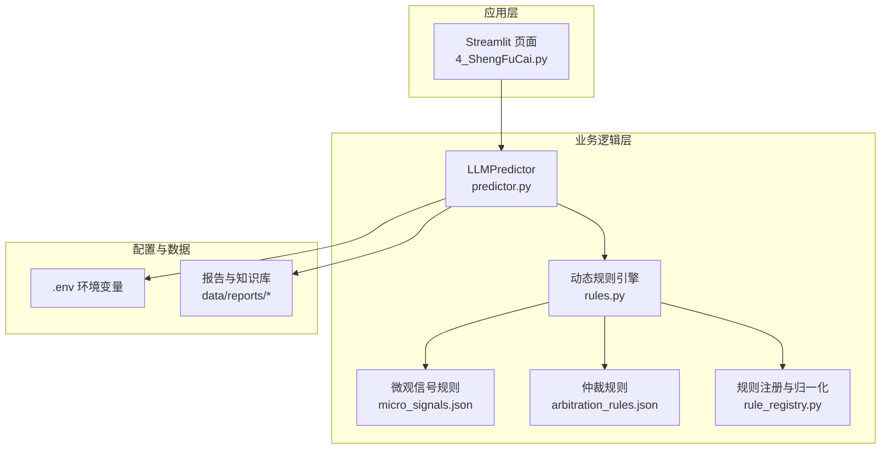
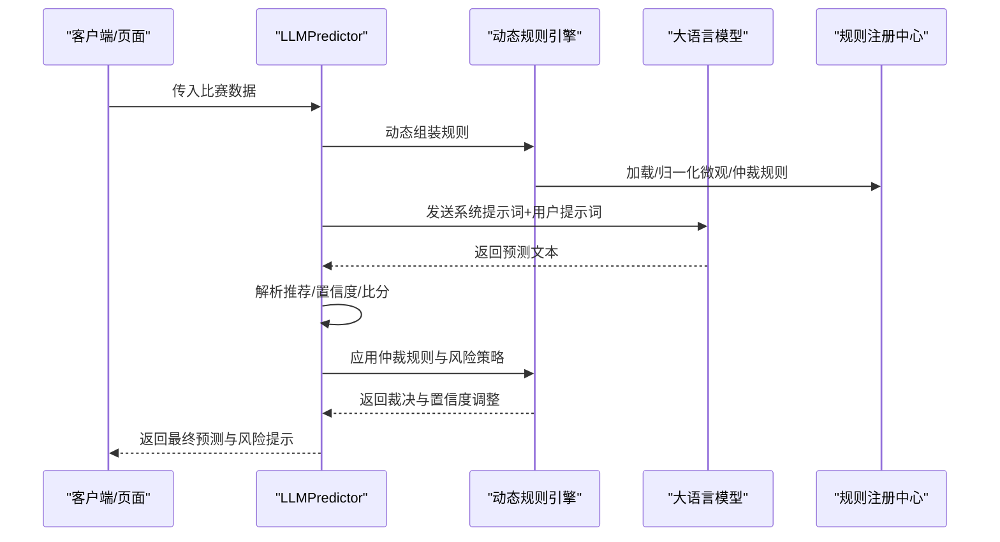
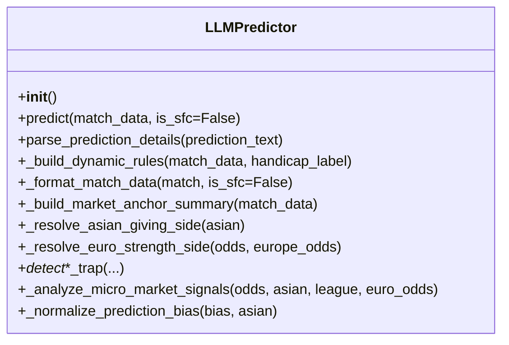
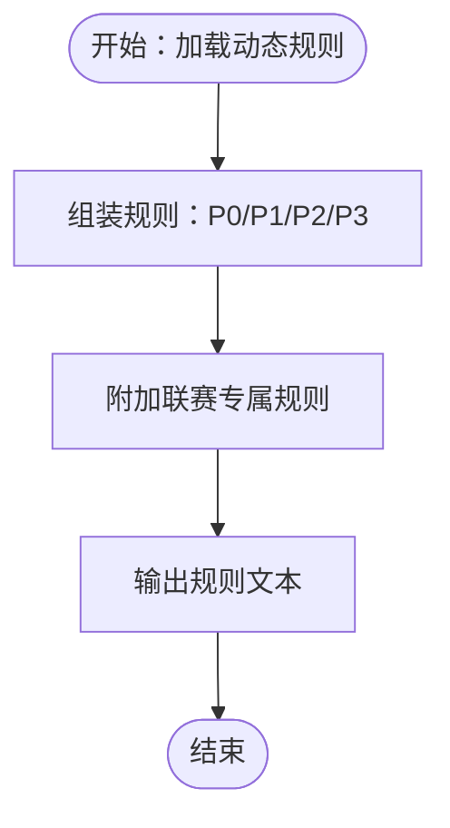
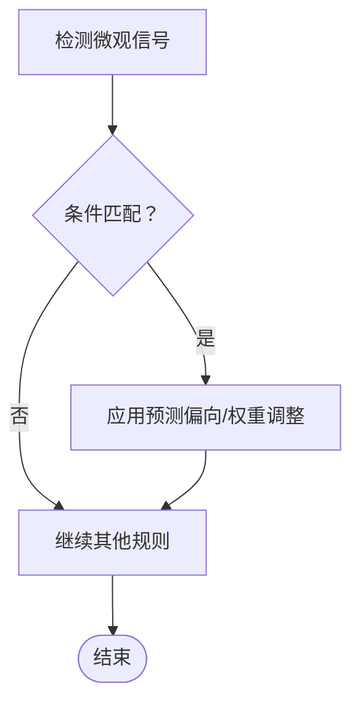
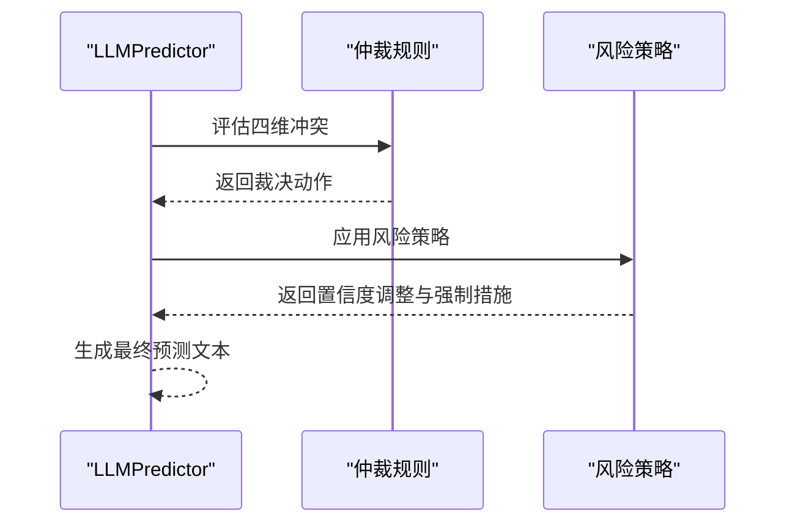
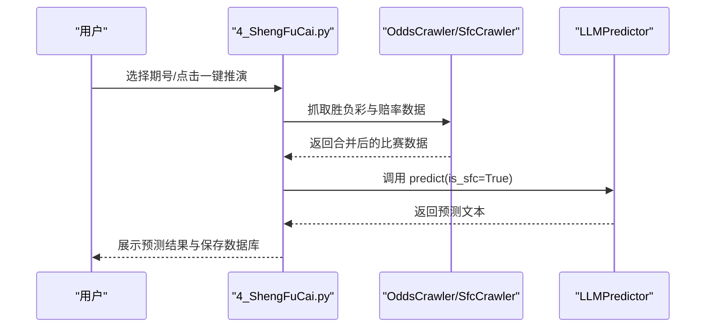
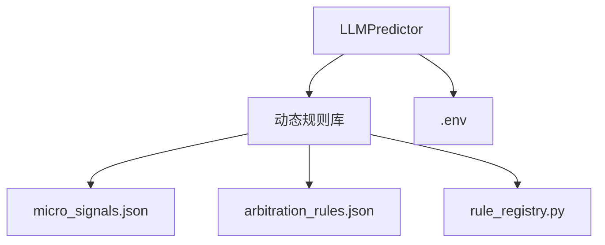

# 足球全场预测器

<cite>
**本文档引用的文件**
- [predictor.py](file://src/llm/predictor.py)
- [rules.py](file://src/llm/rules.py)
- [micro_signals.json](file://data/rules/micro_signals.json)
- [arbitration_rules.json](file://data/rules/arbitration_rules.json)
- [rule_registry.py](file://src/utils/rule_registry.py)
- [.env](file://config/.env)
- [4_ShengFuCai.py](file://src/pages/4_ShengFuCai.py)
- [test_predictor_rules.py](file://tests/test_predictor_rules.py)
- [三时间点预测对比技术架构.md](file://.trae/documents/三时间点预测对比技术架构.md)
</cite>

## 目录
1. [简介](#简介)
2. [项目结构](#项目结构)
3. [核心组件](#核心组件)
4. [架构总览](#架构总览)
5. [详细组件分析](#详细组件分析)
6. [依赖关系分析](#依赖关系分析)
7. [性能考虑](#性能考虑)
8. [故障排查指南](#故障排查指南)
9. [结论](#结论)
10. [附录](#附录)

## 简介
本项目提供一套面向中国体育彩票（竞彩）的足球全场胜平负预测系统，核心由 LLMPredictor 类驱动。系统融合基本面分析、亚盘/欧赔数据模型与机构操盘心理学，通过动态规则引擎对盘口异动进行微观信号检测与风险预警，最终输出包含竞彩推荐、让球推荐、置信度与比分参考的结构化预测结果。

## 项目结构
- 核心预测器：src/llm/predictor.py
- 动态规则库：src/llm/rules.py
- 微观信号规则：data/rules/micro_signals.json
- 仲裁规则：data/rules/arbitration_rules.json
- 规则注册与归一化：src/utils/rule_registry.py
- 环境配置：config/.env
- Web 界面集成：src/pages/4_ShengFuCai.py
- 测试用例：tests/test_predictor_rules.py
- 置信度评估文档：.trae/documents/三时间点预测对比技术架构.md

**图表来源**
- [predictor.py:1-800](file://src/llm/predictor.py#L1-L800)
- [rules.py:1-227](file://src/llm/rules.py#L1-L227)
- [micro_signals.json:1-200](file://data/rules/micro_signals.json#L1-L200)
- [arbitration_rules.json:1-63](file://data/rules/arbitration_rules.json#L1-L63)
- [rule_registry.py:1-278](file://src/utils/rule_registry.py#L1-L278)
- [.env:1-20](file://config/.env#L1-L20)

**章节来源**
- [predictor.py:1-800](file://src/llm/predictor.py#L1-L800)
- [rules.py:1-227](file://src/llm/rules.py#L1-L227)

## 核心组件
- LLMPredictor：负责构建预测提示词、调用大模型、解析结果、应用动态规则与仲裁规则、生成最终预测与置信度。
- 动态规则引擎：根据盘口深度与联赛特征动态组装规则，包含盘型规则、通用变化规则与热钱方向规则。
- 微观信号规则：基于亚盘/欧赔的量化信号，识别陷阱与阻上/诱上形态，提供预测偏向与权重调整。
- 仲裁规则：在四维仲裁（基本面/盘赔/情报/微观规则）冲突时进行裁决，必要时熔断或强制双选。
- 规则注册与归一化：提供规则 ID 生成、条件表达式归一化与动作类型标准化。

**章节来源**
- [predictor.py:20-80](file://src/llm/predictor.py#L20-L80)
- [rules.py:11-156](file://src/llm/rules.py#L11-L156)
- [micro_signals.json:1-200](file://data/rules/micro_signals.json#L1-L200)
- [arbitration_rules.json:1-63](file://data/rules/arbitration_rules.json#L1-L63)
- [rule_registry.py:102-176](file://src/utils/rule_registry.py#L102-L176)

## 架构总览
系统采用“提示词工程 + 动态规则 + 仲裁裁决”的三层架构：
- 输入层：比赛信息、基本面数据、盘赔数据
- 规则层：盘型规则、通用变化规则、热钱方向规则、微观信号规则、仲裁规则
- 输出层：竞彩推荐、让球推荐、置信度、比分参考、风险提示

**图表来源**
- [predictor.py:755-790](file://src/llm/predictor.py#L755-L790)
- [rules.py:11-156](file://src/llm/rules.py#L11-L156)
- [rule_registry.py:102-176](file://src/utils/rule_registry.py#L102-L176)

**章节来源**
- [predictor.py:755-790](file://src/llm/predictor.py#L755-L790)
- [rules.py:11-156](file://src/llm/rules.py#L11-L156)

## 详细组件分析

### LLMPredictor 类
- 初始化与配置
  - 从 .env 读取 LLM_API_KEY、LLM_API_BASE、LLM_MODEL，支持自定义 base_url 与 v1 路径规范。
  - 可通过环境变量启用 LLM 主观盘赔推演。
- 动态规则组装
  - 根据盘口深度与联赛特征动态路由规则：平手/浅盘/中盘/深盘专属规则。
  - 组合通用变化规则与热钱方向规则，形成针对性提示词。
- 输入数据格式
  - 赛事信息：联赛、主客队、比赛时间、联赛特性提示。
  - 基本面：积分排名、主/客队近期战绩、交锋记录、伤停与阵容、进球分布、历史交锋、近期战绩、高级攻防数据（场均进球/失球、射门/射正/xG）。
  - 盘赔数据：竞彩不让球/让球赔率、半全场赔率、亚洲盘口（澳门/贝宝）、市场锚点、盘赔异动摘要、微观信号、盘型标注、各类风险预警。
- LLM 调用参数
  - model：来自环境变量，默认 gpt-4o 或 deepseek-v4-pro。
  - temperature：0.7。
  - max_tokens：4000。
- 结果解析与置信度
  - parse_prediction_details：抽取竞彩推荐、让球推荐、置信度、比分参考、进球数置信度、四维仲裁与盘赔解析摘要。
- 风险预警与微观信号
  - 超深盘死水预警、半球生死盘预警、平手僵持预警、赔率方向矛盾预警、盘水背离预警、浅盘升水诱下预警、欧亚背离预警、浅盘示弱诱下预警等。
- 市场锚点与预测偏向
  - 通过 resolve_asian_giving_side 与 resolve_euro_strength_side 定义亚盘让球方与欧赔实力方，辅助预测偏向归一化与令牌映射。

**图表来源**
- [predictor.py:20-80](file://src/llm/predictor.py#L20-L80)
- [predictor.py:81-281](file://src/llm/predictor.py#L81-L281)
- [predictor.py:3205-3400](file://src/llm/predictor.py#L3205-L3400)

**章节来源**
- [predictor.py:20-80](file://src/llm/predictor.py#L20-L80)
- [predictor.py:81-281](file://src/llm/predictor.py#L81-L281)
- [predictor.py:3205-3400](file://src/llm/predictor.py#L3205-L3400)

### 动态规则引擎
- P0 绝对铁律：上下盘定义、主客不颠倒、让球逻辑自洽、赔率方向矛盾熔断、资金异动强制干预。
- 盘型规则（P1）：平手盘、浅盘、中盘、深盘专属规则，强调“示弱/阻上/诱上”的识别与解释。
- 通用变化规则（P2）：退盘≠必然看衰、浅盘异动只做解释补充、主流联赛浅盘示弱更常见。
- 热钱方向规则（P3）：基于历史数据的欧赔热钱方向铁律，区分反向背离与共识同向，提供安全/危险区间与博冷窗口。

**图表来源**
- [rules.py:11-156](file://src/llm/rules.py#L11-L156)

**章节来源**
- [rules.py:11-156](file://src/llm/rules.py#L11-L156)

### 微观信号规则
- 基于亚盘/欧赔的量化条件，识别高危/中危陷阱形态，如僵尸盘、半球退平半降温、深盘硬挺不退、半球升水陷阱、平半单向水位异动等。
- 每条规则包含 condition、warning_template、prediction_bias、effect 等字段，支持按优先级与级别触发。

**图表来源**
- [micro_signals.json:1-200](file://data/rules/micro_signals.json#L1-L200)

**章节来源**
- [micro_signals.json:1-200](file://data/rules/micro_signals.json#L1-L200)

### 仲裁规则与风险策略
- 仲裁规则在四维冲突时进行裁决，支持 abort_prediction、force_double、cap_confidence、forbid_override、require_override_reason 等动作。
- 风险策略：当触发微观信号、存在欧亚冲突、锚点分歧时，强制双选、提高置信度上限、要求解释市场锚点。

**图表来源**
- [arbitration_rules.json:1-63](file://data/rules/arbitration_rules.json#L1-L63)
- [test_predictor_rules.py:158-200](file://tests/test_predictor_rules.py#L158-L200)

**章节来源**
- [arbitration_rules.json:1-63](file://data/rules/arbitration_rules.json#L1-L63)
- [test_predictor_rules.py:158-200](file://tests/test_predictor_rules.py#L158-L200)

### Web 界面集成
- 页面 4_ShengFuCai.py 负责抓取胜负彩数据、合并竞彩赔率、调用 LLMPredictor 进行预测、保存结果并展示。
- 支持一键推演全部 14 场、强制重新推演、刷新数据等操作。

**图表来源**
- [4_ShengFuCai.py:58-86](file://src/pages/4_ShengFuCai.py#L58-L86)

**章节来源**
- [4_ShengFuCai.py:58-86](file://src/pages/4_ShengFuCai.py#L58-L86)

## 依赖关系分析
- LLMPredictor 依赖动态规则库与规则注册中心，通过规则 ID 与条件表达式实现可扩展的规则系统。
- 规则注册中心提供条件表达式归一化与动作类型标准化，确保规则在运行时可执行。
- 环境变量 .env 提供 LLM API 配置，影响模型调用与输出稳定性。

**图表来源**
- [predictor.py:20-80](file://src/llm/predictor.py#L20-L80)
- [rules.py:11-156](file://src/llm/rules.py#L11-L156)
- [rule_registry.py:102-176](file://src/utils/rule_registry.py#L102-L176)
- [.env:1-20](file://config/.env#L1-20)

**章节来源**
- [predictor.py:20-80](file://src/llm/predictor.py#L20-L80)
- [rules.py:11-156](file://src/llm/rules.py#L11-L156)
- [rule_registry.py:102-176](file://src/utils/rule_registry.py#L102-L176)
- [.env:1-20](file://config/.env#L1-20)

## 性能考虑
- 动态规则组装：通过按盘口与联赛特征路由规则，减少单次提示词长度，降低“中间幻觉”风险，提升推理稳定性。
- 温度与令牌：temperature=0.7，max_tokens=4000，平衡创造性与可控性。
- 缓存与重用：页面层对期号与数据进行缓存，减少重复抓取。
- 规则执行：条件表达式在运行时归一化为可执行 Python 表达式，避免复杂模板解析成本。

[本节为通用指导，无需特定文件引用]

## 故障排查指南
- LLM API 配置错误
  - 现象：初始化时报错“LLM_API_KEY is not set”或调用失败。
  - 处理：检查 .env 中 LLM_API_KEY、LLM_API_BASE、LLM_MODEL 是否正确配置。
- 规则加载异常
  - 现象：规则 JSON 语法错误或路径不存在。
  - 处理：确认 data/rules/*.json 存在且可读，使用 rule_registry 的加载函数进行校验。
- 预测结果解析失败
  - 现象：parse_prediction_details 返回默认值。
  - 处理：检查 LLM 输出格式是否符合预期，逐步缩小解析范围，定位缺失字段。
- 仲裁规则熔断
  - 现象：最终预测被熔断或强制双选。
  - 处理：查看仲裁规则触发详情与风险策略，确认是否存在高冲突证据。

**章节来源**
- [.env:1-20](file://config/.env#L1-L20)
- [test_predictor_rules.py:158-200](file://tests/test_predictor_rules.py#L158-L200)
- [predictor.py:3205-3400](file://src/llm/predictor.py#L3205-L3400)

## 结论
本系统通过“动态规则 + 微观信号 + 仲裁裁决”的组合，实现了对竞彩足球全场胜平负的结构化预测。LLMPredictor 将复杂的盘口与赔率信息转化为可解释的预测文本，并通过规则系统与风险策略保障输出的稳健性与可追溯性。建议在生产环境中持续迭代微观信号与仲裁规则，结合历史验证与复盘报告优化置信度评估与模型更新机制。

[本节为总结性内容，无需特定文件引用]

## 附录

### 预测输入数据格式
- 赛事信息：match_num、league、home_team、away_team、match_time
- 基本面：standings、home/away 近期战绩、h2h_summary、injuries、macau_recommendation、goal_distribution、standings_info、h2h_leisu、recent_leisu、advanced_stats（场均进球/失球、射门/射正/xG）
- 盘赔数据：odds（nspf/sbf/bqc）、asian_odds（macau/bet365）、europe_odds、rangqiu

**章节来源**
- [predictor.py:81-281](file://src/llm/predictor.py#L81-L281)

### LLM 调用参数配置
- model：来自环境变量，默认 gpt-4o 或 deepseek-v4-pro
- temperature：0.7
- max_tokens：4000
- base_url：自动规范化为以 /v1 结尾的 OpenAI 兼容接口

**章节来源**
- [predictor.py:20-46](file://src/llm/predictor.py#L20-L46)
- [.env:4-7](file://config/.env#L4-L7)

### 预测结果解析与置信度机制
- parse_prediction_details：抽取竞彩推荐（不让球/让球）、置信度、比分参考、进球数置信度、四维仲裁与盘赔解析摘要。
- 置信度评估：结合一致性、权重分布、历史验证与数据质量，形成综合评分（参考三时间点预测对比技术架构）。

**章节来源**
- [predictor.py:3205-3400](file://src/llm/predictor.py#L3205-L3400)
- [三时间点预测对比技术架构.md:203-227](file://.trae/documents/三时间点预测对比技术架构.md#L203-L227)

### 盘口分类系统与动态规则
- 平手：水位僵持识别、低水方倾向
- 浅盘：示弱总则、高水真实阻力、基本面差+浅盘的引流诱上
- 中盘：阻上/诱上区分、升盘+升水背离
- 深盘/超深盘：深盘客让防主胜、初盘深盘+低水态度盘、强队无压力两球半表演赛风险

**章节来源**
- [rules.py:32-64](file://src/llm/rules.py#L32-L64)

### 市场锚点定义与微观信号检测
- 市场锚点：亚盘实际让球方/上盘、欧赔实力方，用于统一竞彩推荐与盘口/欧赔口径冲突时的判断。
- 微观信号：基于亚盘/欧赔量化条件的陷阱识别，提供预测偏向与权重调整，触发时优先级高于基本面/情报。

**章节来源**
- [predictor.py:700-715](file://src/llm/predictor.py#L700-L715)
- [micro_signals.json:1-200](file://data/rules/micro_signals.json#L1-L200)

### 风险预警功能
- 超深盘死水预警、半球生死盘预警、平手僵持预警、赔率方向矛盾预警、盘水背离预警、浅盘升水诱下预警、欧亚背离预警、浅盘示弱诱下预警等。

**章节来源**
- [predictor.py:482-529](file://src/llm/predictor.py#L482-L529)
- [predictor.py:531-585](file://src/llm/predictor.py#L531-L585)
- [predictor.py:587-698](file://src/llm/predictor.py#L587-L698)

### 预测 API 使用示例（流程）
- 页面层：调用 SfcCrawler 获取胜负彩数据，合并竞彩赔率，实例化 LLMPredictor.predict(is_sfc=True)，保存预测结果。
- 关键步骤：fetch_match_details -> predictor.predict -> parse_prediction_details -> 保存数据库。

**章节来源**
- [4_ShengFuCai.py:58-86](file://src/pages/4_ShengFuCai.py#L58-L86)
- [predictor.py:3205-3400](file://src/llm/predictor.py#L3205-L3400)

### 错误处理策略
- 初始化失败：检查 .env 配置与 API Key。
- 规则加载失败：校验 JSON 语法与路径。
- 预测失败：捕获异常并返回错误信息，避免中断流程。
- 仲裁熔断：根据规则动作熔断预测或强制双选，确保输出稳健。

**章节来源**
- [.env:1-20](file://config/.env#L1-L20)
- [test_predictor_rules.py:158-200](file://tests/test_predictor_rules.py#L158-L200)

### 性能优化建议
- 规则缓存：将已加载的规则缓存于内存，避免重复读取。
- 提示词压缩：按盘口与联赛特征动态裁剪规则，减少上下文长度。
- 并发调用：在页面层对多场比赛并发预测时，控制并发度与速率限制。
- 日志与监控：记录调用耗时、错误率与规则触发统计，便于持续优化。

[本节为通用指导，无需特定文件引用]

### 预测准确性评估与模型更新
- 置信度评估：一致性、权重分布、历史验证、数据质量加权合成。
- 模型更新：基于复盘报告与错误分析，迭代微观信号与仲裁规则，定期评估命中率与误判类型，调整权重与阈值。

**章节来源**
- [三时间点预测对比技术架构.md:203-227](file://.trae/documents/三时间点预测对比技术架构.md#L203-L227)
- [test_predictor_rules.py:471-499](file://tests/test_predictor_rules.py#L471-L499)