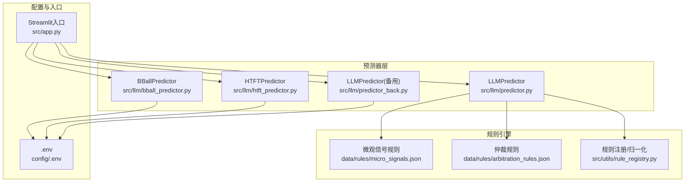
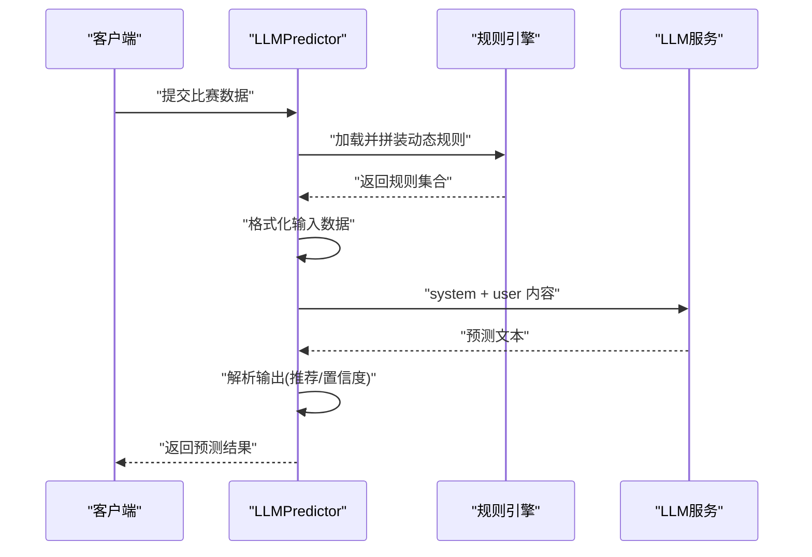
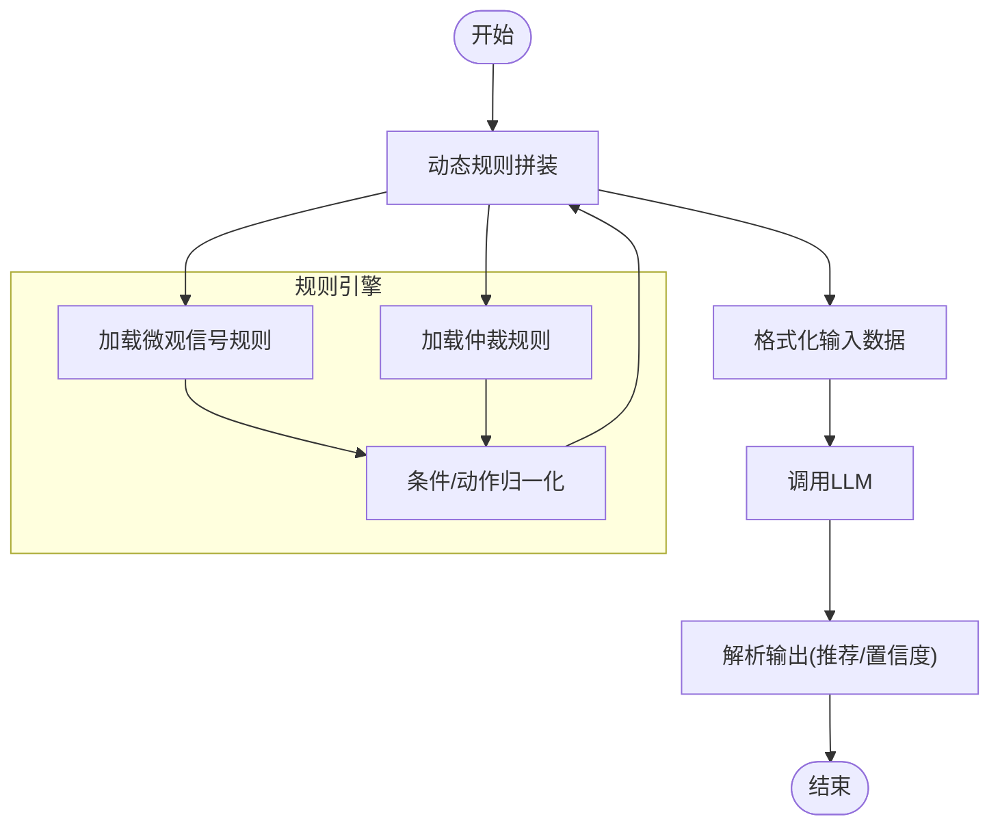
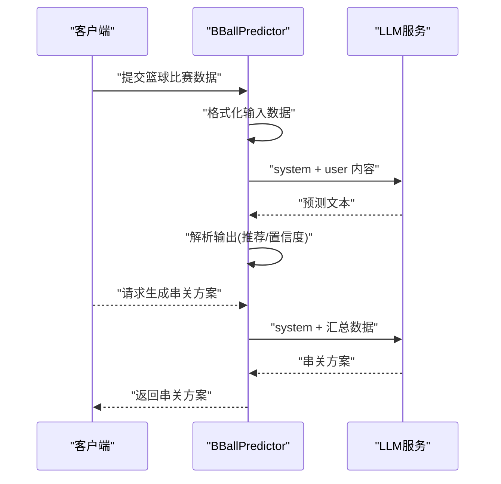
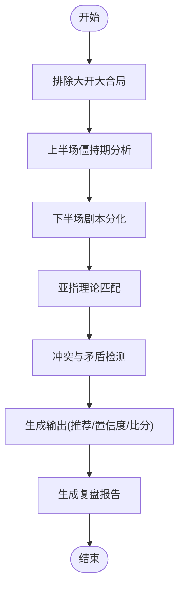
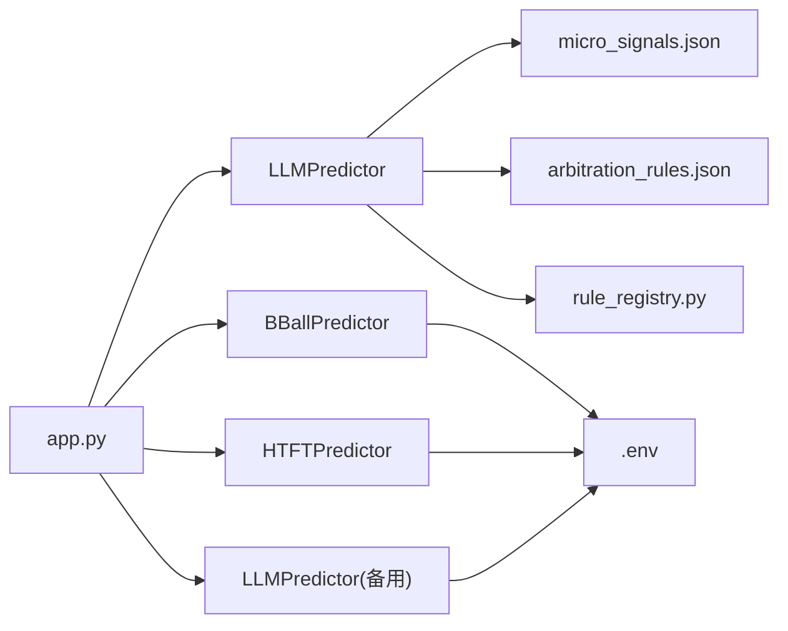

# 预测API

<cite>
**本文引用的文件**
- [predictor.py](file://src/llm/predictor.py)
- [bball_predictor.py](file://src/llm/bball_predictor.py)
- [htft_predictor.py](file://src/llm/htft_predictor.py)
- [predictor_back.py](file://src/llm/predictor_back.py)
- [.env](file://config/.env)
- [arbitration_rules.json](file://data/rules/arbitration_rules.json)
- [micro_signals.json](file://data/rules/micro_signals.json)
- [rule_registry.py](file://src/utils/rule_registry.py)
- [app.py](file://src/app.py)
</cite>

## 目录
1. [简介](#简介)
2. [项目结构](#项目结构)
3. [核心组件](#核心组件)
4. [架构总览](#架构总览)
5. [详细组件分析](#详细组件分析)
6. [依赖分析](#依赖分析)
7. [性能考虑](#性能考虑)
8. [故障排查指南](#故障排查指南)
9. [结论](#结论)
10. [附录](#附录)

## 简介
本文件为预测API的完整技术文档，覆盖足球全场预测（predictor）、篮球预测（bball_predictor）、半全场预测（htft_predictor）与备用预测器（predictor_back）的接口规范与实现细节。内容包括：
- 输入数据格式与字段要求
- LLM调用参数与提示词工程
- 输出解析与置信度评分机制
- 动态规则引擎与信号检测
- 使用示例、错误处理与性能优化
- 准确性评估与模型更新流程

## 项目结构
预测API位于src/llm目录，围绕LLM预测器构建，配合动态规则系统与数据格式化模块，形成“提示词工程 + 规则引擎 + 输出解析”的完整流水线。

**图表来源**
- [predictor.py:20-46](file://src/llm/predictor.py#L20-L46)
- [bball_predictor.py:9-28](file://src/llm/bball_predictor.py#L9-L28)
- [htft_predictor.py:7-10](file://src/llm/htft_predictor.py#L7-L10)
- [predictor_back.py:10-29](file://src/llm/predictor_back.py#L10-L29)
- [micro_signals.json:1-20](file://data/rules/micro_signals.json#L1-L20)
- [arbitration_rules.json:1-20](file://data/rules/arbitration_rules.json#L1-L20)
- [rule_registry.py:102-177](file://src/utils/rule_registry.py#L102-L177)
- [.env:4-7](file://config/.env#L4-L7)
- [app.py:1-20](file://src/app.py#L1-L20)

**章节来源**
- [predictor.py:20-46](file://src/llm/predictor.py#L20-L46)
- [bball_predictor.py:9-28](file://src/llm/bball_predictor.py#L9-L28)
- [htft_predictor.py:7-10](file://src/llm/htft_predictor.py#L7-L10)
- [predictor_back.py:10-29](file://src/llm/predictor_back.py#L10-L29)
- [.env:4-7](file://config/.env#L4-L7)
- [micro_signals.json:1-20](file://data/rules/micro_signals.json#L1-L20)
- [arbitration_rules.json:1-20](file://data/rules/arbitration_rules.json#L1-L20)
- [rule_registry.py:102-177](file://src/utils/rule_registry.py#L102-L177)
- [app.py:1-20](file://src/app.py#L1-L20)

## 核心组件
- LLMPredictor（足球全场预测）
  - 功能：整合基本面、盘口、赔率与微观信号，输出竞彩推荐与置信度
  - 关键点：动态规则拼装、伤停结构化解析、盘口异动检测、信号偏见归一化
- BBallPredictor（篮球预测）
  - 功能：基于系统提示词与格式化数据，输出让分胜负与大小分推荐
  - 关键点：系统提示词工程、交叉盘风险提示、串关生成
- HTFTPredictor（半全场预测）
  - 功能：聚焦半全场（平胜/平负/平平）剧本推演，输出置信度与比分参考
  - 关键点：上下半场剧本分流、亚指陷阱匹配、冲突与矛盾检测
- LLMPredictor(备用)（备用预测器）
  - 功能：提供更严格的风控与仲裁规则集成，支持复盘与文章生成
  - 关键点：交叉验证与结论生成、风控提示、复盘与文章生成

**章节来源**
- [predictor.py:81-281](file://src/llm/predictor.py#L81-L281)
- [bball_predictor.py:92-122](file://src/llm/bball_predictor.py#L92-L122)
- [htft_predictor.py:145-157](file://src/llm/htft_predictor.py#L145-L157)
- [predictor_back.py:191-287](file://src/llm/predictor_back.py#L191-L287)

## 架构总览
预测API采用“提示词工程 + 动态规则 + 信号检测”的三层架构：
- 提示词工程：各预测器内置系统提示词，定义分析流程与输出格式
- 动态规则：从micro_signals.json与arbitration_rules.json加载规则，动态拼装到提示词
- 信号检测：对盘口、欧赔、伤停等数据进行信号提取与偏见归一化

**图表来源**
- [predictor.py:51-79](file://src/llm/predictor.py#L51-L79)
- [predictor.py:81-281](file://src/llm/predictor.py#L81-L281)
- [predictor.py:689-753](file://src/llm/predictor.py#L689-L753)
- [micro_signals.json:1-20](file://data/rules/micro_signals.json#L1-L20)
- [arbitration_rules.json:1-20](file://data/rules/arbitration_rules.json#L1-L20)

**章节来源**
- [predictor.py:51-79](file://src/llm/predictor.py#L51-L79)
- [predictor.py:81-281](file://src/llm/predictor.py#L81-L281)
- [predictor.py:689-753](file://src/llm/predictor.py#L689-L753)
- [micro_signals.json:1-20](file://data/rules/micro_signals.json#L1-L20)
- [arbitration_rules.json:1-20](file://data/rules/arbitration_rules.json#L1-L20)

## 详细组件分析

### LLMPredictor（足球全场预测）
- 输入数据格式
  - 必填字段：联赛、对阵、时间、近期战绩、交锋记录、伤停情报、高级统计、盘口与赔率
  - 可选字段：情报要点、历史交锋、进球分布、积分排名等
- LLM调用参数
  - 模型：从.env读取LLM_MODEL
  - 基础URL：从.env读取LLM_API_BASE
  - 温度：0.7（稳定输出）
  - 最大token：4000
- 动态规则引擎
  - 盘型路由：根据盘口深度与联赛特征动态拼装规则
  - 微观信号：基于micro_signals.json的Python布尔表达式检测
  - 仲裁规则：基于arbitration_rules.json的条件与动作
- 输出解析与置信度
  - 解析竞彩推荐（不让球/让球）、比分参考、置信度
  - 信号偏见归一化：将自然语言偏见映射到标准化标签
- 错误处理
  - API密钥缺失抛出异常
  - LLM调用异常返回失败信息

**图表来源**
- [predictor.py:51-79](file://src/llm/predictor.py#L51-L79)
- [predictor.py:81-281](file://src/llm/predictor.py#L81-L281)
- [predictor.py:289-440](file://src/llm/predictor.py#L289-L440)
- [micro_signals.json:1-20](file://data/rules/micro_signals.json#L1-L20)
- [arbitration_rules.json:1-20](file://data/rules/arbitration_rules.json#L1-L20)
- [rule_registry.py:102-177](file://src/utils/rule_registry.py#L102-L177)

**章节来源**
- [predictor.py:20-46](file://src/llm/predictor.py#L20-L46)
- [predictor.py:51-79](file://src/llm/predictor.py#L51-L79)
- [predictor.py:81-281](file://src/llm/predictor.py#L81-L281)
- [predictor.py:289-440](file://src/llm/predictor.py#L289-L440)
- [micro_signals.json:1-20](file://data/rules/micro_signals.json#L1-L20)
- [arbitration_rules.json:1-20](file://data/rules/arbitration_rules.json#L1-L20)
- [rule_registry.py:102-177](file://src/utils/rule_registry.py#L102-L177)

### BBallPredictor（篮球预测）
- 输入数据格式
  - 客队/主队、时间、最新基本面（战绩/伤停）、竞彩官方盘口与赔率
- LLM调用参数
  - 模型：LLM_MODEL
  - 温度：0.7
  - 最大token：4000
- 输出解析
  - 解析让分胜负与大小分推荐、置信度与核心风控提示
- 串关生成
  - 基于当日预测结果生成稳健与进阶两种串关方案，强制规避极端赛程交叉盘风险

**图表来源**
- [bball_predictor.py:166-198](file://src/llm/bball_predictor.py#L166-L198)
- [bball_predictor.py:199-282](file://src/llm/bball_predictor.py#L199-L282)

**章节来源**
- [bball_predictor.py:92-122](file://src/llm/bball_predictor.py#L92-L122)
- [bball_predictor.py:124-164](file://src/llm/bball_predictor.py#L124-L164)
- [bball_predictor.py:166-198](file://src/llm/bball_predictor.py#L166-L198)
- [bball_predictor.py:199-282](file://src/llm/bball_predictor.py#L199-L282)

### HTFTPredictor（半全场预测）
- 输入数据格式
  - 在LLMPredictor基础上增强半全场赔率字段
- 分析工作流
  - 第一层：排除大开大合局
  - 第二层：上半场僵持期分析
  - 第三层：下半场剧本分化
  - 亚指理论套用与修正
  - 冲突与矛盾检测与阈值控制
- 输出解析
  - 半全场推荐（平胜/平负/平平/建议放弃）
  - 置信度与比分参考
- 复盘生成
  - 基于预测与实际赛果生成专项复盘报告

**图表来源**
- [htft_predictor.py:79-144](file://src/llm/htft_predictor.py#L79-L144)
- [htft_predictor.py:145-157](file://src/llm/htft_predictor.py#L145-L157)

**章节来源**
- [htft_predictor.py:11-77](file://src/llm/htft_predictor.py#L11-L77)
- [htft_predictor.py:79-144](file://src/llm/htft_predictor.py#L79-L144)
- [htft_predictor.py:145-157](file://src/llm/htft_predictor.py#L145-L157)

### LLMPredictor(备用)（备用预测器）
- 提示词工程
  - 更严格的风控与仲裁规则集成
  - 交叉验证与结论生成
- 输出解析
  - 解析不让球/让球推荐、进球数与比分参考、置信度
- 复盘与文章生成
  - 支持生成公众号风格文章与复盘报告

**章节来源**
- [predictor_back.py:30-189](file://src/llm/predictor_back.py#L30-L189)
- [predictor_back.py:289-440](file://src/llm/predictor_back.py#L289-L440)
- [predictor_back.py:618-688](file://src/llm/predictor_back.py#L618-L688)

## 依赖分析
- 外部依赖
  - OpenAI SDK：用于调用LLM
  - dotenv：读取.env配置
  - loguru：日志记录
- 内部依赖
  - 规则系统：micro_signals.json与arbitration_rules.json
  - 规则注册/归一化：rule_registry.py
  - Streamlit入口：app.py

**图表来源**
- [predictor.py:15-18](file://src/llm/predictor.py#L15-L18)
- [predictor_back.py:17-28](file://src/llm/predictor_back.py#L17-L28)
- [bball_predictor.py:16-27](file://src/llm/bball_predictor.py#L16-L27)
- [htft_predictor.py:5-5](file://src/llm/htft_predictor.py#L5-L5)
- [micro_signals.json:1-20](file://data/rules/micro_signals.json#L1-L20)
- [arbitration_rules.json:1-20](file://data/rules/arbitration_rules.json#L1-L20)
- [rule_registry.py:102-177](file://src/utils/rule_registry.py#L102-L177)
- [app.py:1-20](file://src/app.py#L1-L20)

**章节来源**
- [predictor.py:15-18](file://src/llm/predictor.py#L15-L18)
- [predictor_back.py:17-28](file://src/llm/predictor_back.py#L17-L28)
- [bball_predictor.py:16-27](file://src/llm/bball_predictor.py#L16-L27)
- [htft_predictor.py:5-5](file://src/llm/htft_predictor.py#L5-L5)
- [micro_signals.json:1-20](file://data/rules/micro_signals.json#L1-L20)
- [arbitration_rules.json:1-20](file://data/rules/arbitration_rules.json#L1-L20)
- [rule_registry.py:102-177](file://src/utils/rule_registry.py#L102-L177)
- [app.py:1-20](file://src/app.py#L1-L20)

## 性能考虑
- 提示词长度控制：LLM最大token限制为4000，需确保输入数据经格式化后不超过阈值
- 规则加载缓存：动态规则在单次预测中重复使用，避免重复I/O
- 交叉验证与风控：在备用预测器中引入交叉验证与风控提示，减少错误预测
- 模型选择：根据稳定性需求选择LLM_MODEL，必要时降低temperature以提升输出稳定性

[本节为通用指导，无需源码引用]

## 故障排查指南
- API密钥缺失
  - 现象：初始化时报错并抛出异常
  - 处理：检查.env中的LLM_API_KEY是否正确配置
- LLM调用失败
  - 现象：predict方法返回“预测失败: ...”
  - 处理：检查网络连接、LLM_API_BASE与LLM_MODEL配置
- 规则条件不支持
  - 现象：规则条件包含不支持的伪代码/函数
  - 处理：使用rule_registry.py提供的归一化函数，将条件改写为可执行的Python布尔表达式
- 输出解析异常
  - 现象：解析竞彩推荐/置信度失败
  - 处理：检查LLM输出格式是否符合解析规则；备用预测器提供更严格的解析逻辑

**章节来源**
- [predictor.py:35-38](file://src/llm/predictor.py#L35-L38)
- [predictor.py:751-753](file://src/llm/predictor.py#L751-L753)
- [rule_registry.py:135-146](file://src/utils/rule_registry.py#L135-L146)
- [predictor_back.py:289-440](file://src/llm/predictor_back.py#L289-L440)

## 结论
预测API通过提示词工程与动态规则引擎实现了对足球与篮球赛事的智能化预测，具备：
- 可扩展的规则系统（微观信号与仲裁规则）
- 稳健的输出解析与置信度评分
- 面向实战的风控与复盘能力
建议在生产环境中：
- 严格管理.env配置
- 建立规则审核与反馈循环
- 定期评估预测准确性并迭代规则

[本节为总结性内容，无需源码引用]

## 附录

### 使用示例（路径指引）
- 足球全场预测
  - 输入数据格式参考：[输入数据格式:81-121](file://src/llm/predictor.py#L81-L121)
  - 调用示例：[predict方法:689-753](file://src/llm/predictor.py#L689-L753)
  - 输出解析：[parse_prediction_details:289-440](file://src/llm/predictor.py#L289-L440)
- 篮球预测
  - 输入数据格式参考：[篮球输入格式:92-122](file://src/llm/bball_predictor.py#L92-L122)
  - 调用示例：[predict方法:166-198](file://src/llm/bball_predictor.py#L166-L198)
  - 串关生成：[generate_parlays:199-282](file://src/llm/bball_predictor.py#L199-L282)
- 半全场预测
  - 输入数据格式参考：[半全场输入格式:145-157](file://src/llm/htft_predictor.py#L145-L157)
  - 分析工作流：[系统提示词:11-77](file://src/llm/htft_predictor.py#L11-L77)
  - 复盘生成：[generate_post_mortem:79-144](file://src/llm/htft_predictor.py#L79-L144)
- 备用预测器
  - 提示词工程：[系统提示词:30-189](file://src/llm/predictor_back.py#L30-L189)
  - 输出解析：[parse_prediction_details:289-440](file://src/llm/predictor_back.py#L289-L440)
  - 复盘与文章生成：[generate_post_mortem/generate_article:618-688](file://src/llm/predictor_back.py#L618-L688)

### 配置与环境
- LLM配置
  - LLM_API_KEY：大语言模型API密钥
  - LLM_API_BASE：LLM服务基础URL
  - LLM_MODEL：使用的模型名称
- 示例配置
  - [示例.env:4-7](file://config/.env#L4-L7)

**章节来源**
- [predictor.py:81-121](file://src/llm/predictor.py#L81-L121)
- [predictor.py:689-753](file://src/llm/predictor.py#L689-L753)
- [predictor.py:289-440](file://src/llm/predictor.py#L289-L440)
- [bball_predictor.py:92-122](file://src/llm/bball_predictor.py#L92-L122)
- [bball_predictor.py:166-198](file://src/llm/bball_predictor.py#L166-L198)
- [bball_predictor.py:199-282](file://src/llm/bball_predictor.py#L199-L282)
- [htft_predictor.py:145-157](file://src/llm/htft_predictor.py#L145-L157)
- [htft_predictor.py:11-77](file://src/llm/htft_predictor.py#L11-L77)
- [htft_predictor.py:79-144](file://src/llm/htft_predictor.py#L79-L144)
- [predictor_back.py:30-189](file://src/llm/predictor_back.py#L30-L189)
- [predictor_back.py:289-440](file://src/llm/predictor_back.py#L289-L440)
- [predictor_back.py:618-688](file://src/llm/predictor_back.py#L618-L688)
- [.env:4-7](file://config/.env#L4-L7)