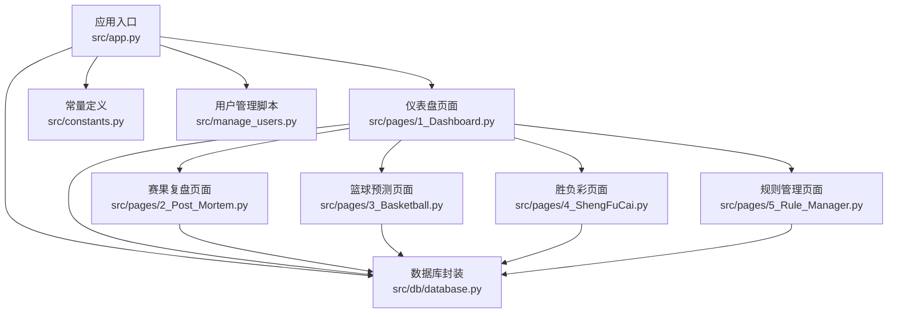
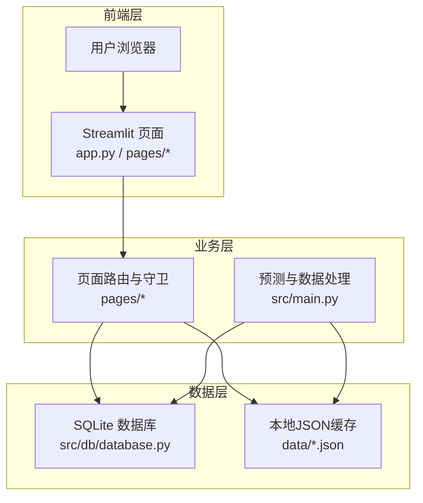
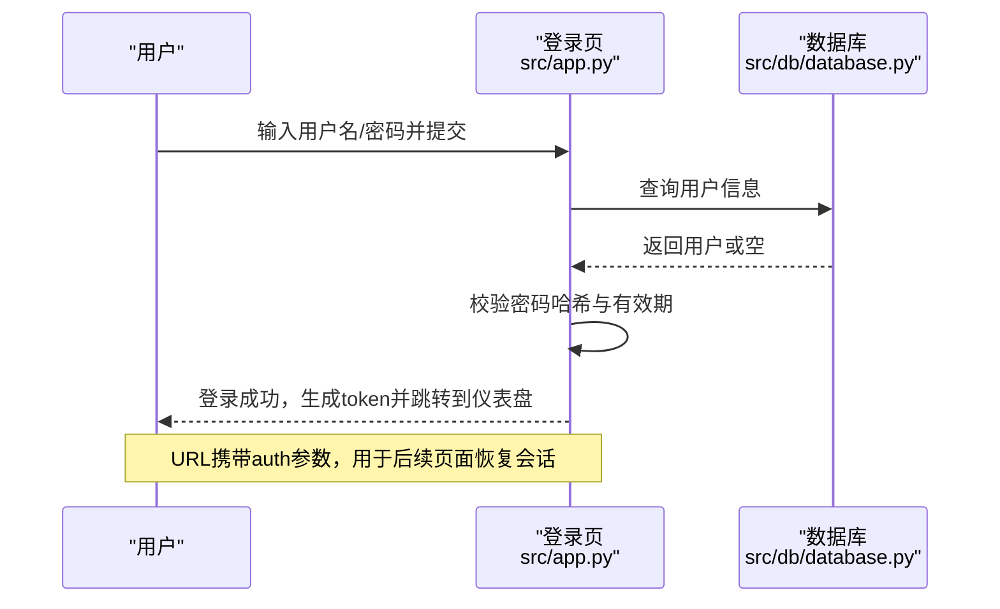
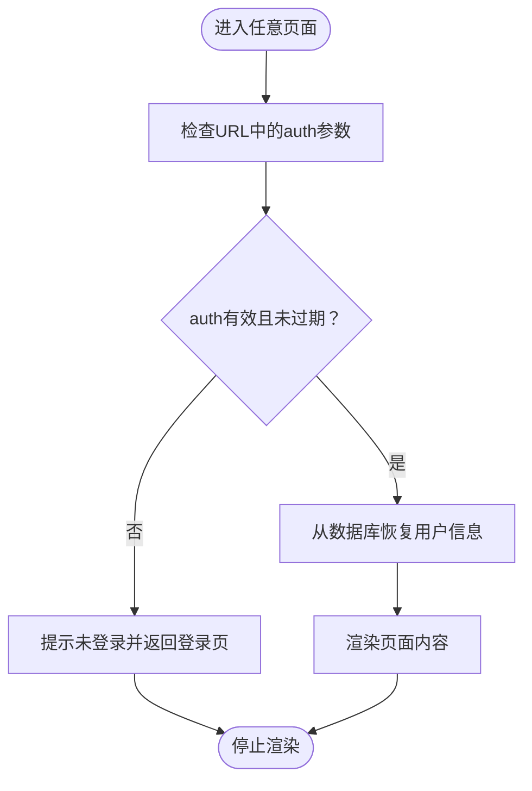
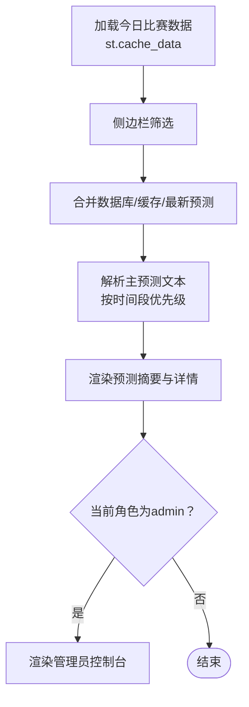
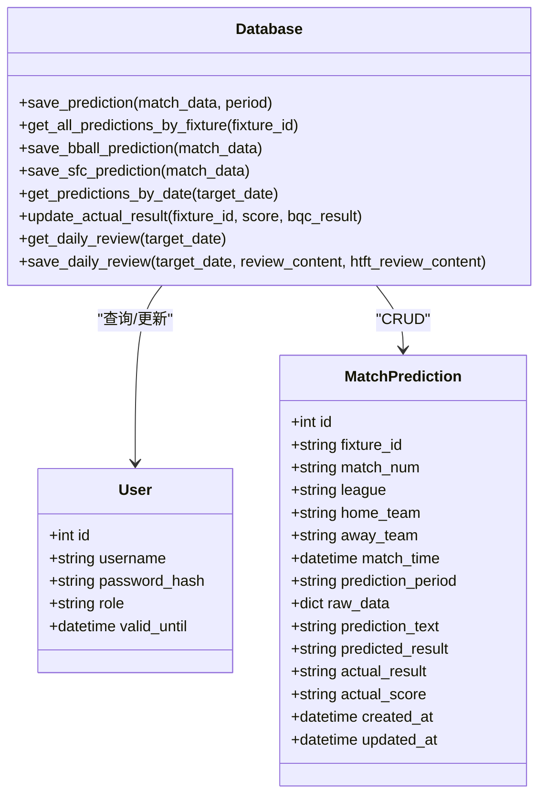
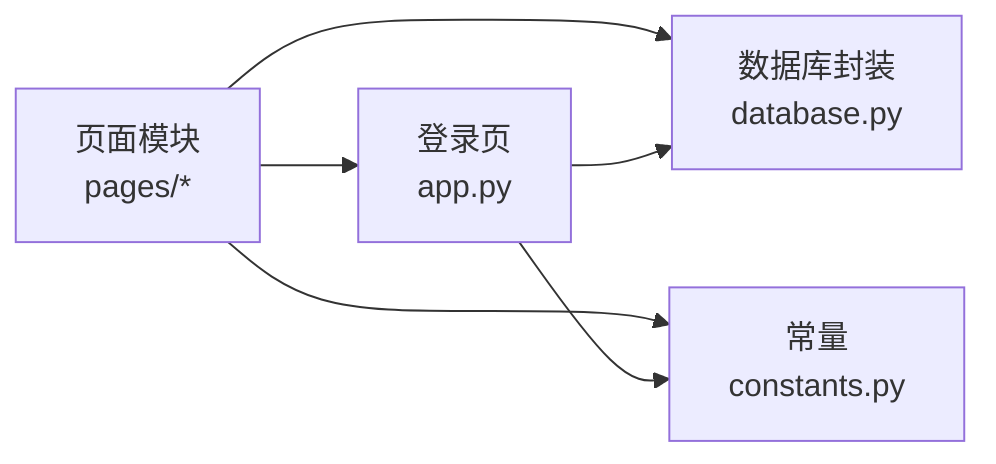

# Web界面系统

<cite>
**本文档引用的文件**
- [src/app.py](file://src/app.py)
- [src/main.py](file://src/main.py)
- [src/pages/1_Dashboard.py](file://src/pages/1_Dashboard.py)
- [src/pages/2_Post_Mortem.py](file://src/pages/2_Post_Mortem.py)
- [src/pages/3_Basketball.py](file://src/pages/3_Basketball.py)
- [src/pages/4_ShengFuCai.py](file://src/pages/4_ShengFuCai.py)
- [src/pages/5_Rule_Manager.py](file://src/pages/5_Rule_Manager.py)
- [src/db/database.py](file://src/db/database.py)
- [src/constants.py](file://src/constants.py)
- [src/manage_users.py](file://src/manage_users.py)
</cite>

## 目录
1. [简介](#简介)
2. [项目结构](#项目结构)
3. [核心组件](#核心组件)
4. [架构总览](#架构总览)
5. [详细组件分析](#详细组件分析)
6. [依赖关系分析](#依赖关系分析)
7. [性能考虑](#性能考虑)
8. [故障排查指南](#故障排查指南)
9. [结论](#结论)
10. [附录](#附录)

## 简介
本项目是一个基于 Streamlit 的 Web 界面系统，面向内部邀请用户，提供竞彩足球与篮球的预测看板、赛果复盘、动态风控规则管理以及胜负彩（十四场）智能预测等功能。系统采用轻量化的前后端一体化架构，前端页面通过 Streamlit 构建，后端数据持久化使用 SQLite，配合数据库层封装与预测模块，形成从数据采集、融合、预测到展示的完整链路。

## 项目结构
- 应用入口与登录页：src/app.py
- 页面路由与业务页面：src/pages/1_Dashboard.py、src/pages/2_Post_Mortem.py、src/pages/3_Basketball.py、src/pages/4_ShengFuCai.py、src/pages/5_Rule_Manager.py
- 数据与模型：src/main.py（离线批处理）、src/db/database.py（数据库封装）、src/constants.py（常量）
- 用户管理：src/manage_users.py
- 配置与环境：.streamlit/config.toml、.streamlit/credentials.toml（仓库中未提供，但代码中有读取逻辑）

图表来源
- [src/app.py:1-166](file://src/app.py#L1-L166)
- [src/pages/1_Dashboard.py:1-800](file://src/pages/1_Dashboard.py#L1-L800)
- [src/pages/2_Post_Mortem.py:1-200](file://src/pages/2_Post_Mortem.py#L1-L200)
- [src/pages/3_Basketball.py:1-200](file://src/pages/3_Basketball.py#L1-L200)
- [src/pages/4_ShengFuCai.py:1-200](file://src/pages/4_ShengFuCai.py#L1-L200)
- [src/pages/5_Rule_Manager.py:1-200](file://src/pages/5_Rule_Manager.py#L1-L200)
- [src/db/database.py:1-567](file://src/db/database.py#L1-L567)
- [src/constants.py:1-5](file://src/constants.py#L1-L5)
- [src/manage_users.py:1-45](file://src/manage_users.py#L1-L45)

章节来源
- [src/app.py:1-166](file://src/app.py#L1-L166)
- [src/pages/1_Dashboard.py:1-800](file://src/pages/1_Dashboard.py#L1-L800)
- [src/db/database.py:1-567](file://src/db/database.py#L1-L567)

## 核心组件
- 登录与会话管理：基于 URL 查询参数携带的 base64 编码 token，结合会话状态与数据库用户校验，实现无 Cookie 的轻量会话。
- 页面路由与守卫：各页面均在顶部进行“路由守卫”，从 URL 参数恢复登录状态，未登录则返回登录页。
- 数据持久化：SQLite + SQLAlchemy ORM，统一的数据库类封装多张表（用户、预测、复盘、串关等）。
- 权限控制：基于用户角色（admin/editor/vip）的菜单与功能可见性控制。
- 响应式布局：使用 Streamlit 容器与列布局，适配宽屏展示与侧边栏导航。

章节来源
- [src/app.py:51-162](file://src/app.py#L51-L162)
- [src/pages/1_Dashboard.py:21-69](file://src/pages/1_Dashboard.py#L21-L69)
- [src/db/database.py:200-308](file://src/db/database.py#L200-L308)
- [src/constants.py:3-4](file://src/constants.py#L3-L4)

## 架构总览
系统采用“前端页面 + 数据库 + 预测模块”的分层架构。前端页面通过路由守卫与会话状态控制访问；数据层负责用户与预测结果的持久化；预测模块在后台批处理脚本中调用，前端页面通过缓存与数据库读取展示结果。

图表来源
- [src/app.py:110-162](file://src/app.py#L110-L162)
- [src/pages/1_Dashboard.py:87-106](file://src/pages/1_Dashboard.py#L87-L106)
- [src/main.py:34-135](file://src/main.py#L34-L135)
- [src/db/database.py:200-308](file://src/db/database.py#L200-L308)

## 详细组件分析

### 登录与会话管理
- 登录流程
  - 用户输入用户名/密码，后端校验用户存在性、密码哈希与有效期。
  - 登录成功后生成包含用户名与时间戳的 token，并写入会话状态与 URL 查询参数。
  - 通过跳转到“仪表盘”并附带 auth 参数，实现跨页面会话延续。
- 会话恢复
  - 各页面在顶部读取 URL 中的 auth 参数，解码后与当前时间差小于 TTL，则从数据库校验用户有效性并恢复会话。
- 退出登录
  - 清空会话状态与 URL 查询参数，返回登录页。

图表来源
- [src/app.py:94-162](file://src/app.py#L94-L162)
- [src/db/database.py:309-310](file://src/db/database.py#L309-L310)

章节来源
- [src/app.py:51-162](file://src/app.py#L51-L162)
- [src/constants.py:3-4](file://src/constants.py#L3-L4)
- [src/db/database.py:309-310](file://src/db/database.py#L309-L310)

### 页面路由机制
- 路由守卫
  - 每个页面在顶部尝试从 URL 查询参数恢复会话，若未登录则提示并返回登录页。
- 页面跳转
  - 通过 st.switch_page 并在 URL 中附加 auth 参数，保证跨页面会话一致。
- 页面布局
  - 仪表盘使用宽屏布局与侧边栏导航；其他页面隐藏默认导航栏，采用自定义侧边栏返回与跳转。

图表来源
- [src/pages/1_Dashboard.py:32-55](file://src/pages/1_Dashboard.py#L32-L55)
- [src/pages/2_Post_Mortem.py:57-81](file://src/pages/2_Post_Mortem.py#L57-L81)
- [src/pages/3_Basketball.py:28-51](file://src/pages/3_Basketball.py#L28-L51)
- [src/pages/4_ShengFuCai.py:103-126](file://src/pages/4_ShengFuCai.py#L103-L126)

章节来源
- [src/pages/1_Dashboard.py:21-69](file://src/pages/1_Dashboard.py#L21-L69)
- [src/pages/2_Post_Mortem.py:57-94](file://src/pages/2_Post_Mortem.py#L57-L94)
- [src/pages/3_Basketball.py:28-68](file://src/pages/3_Basketball.py#L28-L68)
- [src/pages/4_ShengFuCai.py:103-126](file://src/pages/4_ShengFuCai.py#L103-L126)

### 仪表盘页面（Dashboard）
- 数据加载与缓存
  - 使用 st.cache_data 缓存今日比赛数据（5分钟），避免重复 IO。
- 预测结果展示
  - 合并数据库、缓存与最新预测，按时间段优先级解析主预测文本。
- 筛选与导航
  - 侧边栏多选联赛筛选；一键展开/折叠；导航到篮球、胜负彩、复盘与规则管理。
- 管理员功能
  - 用户新增/续期；全局重新预测（全场）；历史数据拉取；日志查看。

图表来源
- [src/pages/1_Dashboard.py:87-137](file://src/pages/1_Dashboard.py#L87-L137)
- [src/pages/1_Dashboard.py:214-278](file://src/pages/1_Dashboard.py#L214-L278)
- [src/pages/1_Dashboard.py:314-539](file://src/pages/1_Dashboard.py#L314-L539)

章节来源
- [src/pages/1_Dashboard.py:87-137](file://src/pages/1_Dashboard.py#L87-L137)
- [src/pages/1_Dashboard.py:214-278](file://src/pages/1_Dashboard.py#L214-L278)
- [src/pages/1_Dashboard.py:314-539](file://src/pages/1_Dashboard.py#L314-L539)

### 赛果复盘页面（Post Mortem）
- 功能概述
  - 选择日期，抓取该日赛果并更新数据库；展示预测与实际对比；支持补拉历史数据。
- 路由守卫与导航
  - 与仪表盘一致的会话恢复与跳转逻辑。

章节来源
- [src/pages/2_Post_Mortem.py:43-125](file://src/pages/2_Post_Mortem.py#L43-L125)
- [src/pages/2_Post_Mortem.py:156-193](file://src/pages/2_Post_Mortem.py#L156-L193)

### 篮球预测页面（Basketball）
- 功能概述
  - 展示今日竞彩篮球赛事；管理员可进行全局重新预测；支持展开/折叠详情。
- 路由守卫与导航
  - 与仪表盘一致的会话恢复与跳转逻辑。

章节来源
- [src/pages/3_Basketball.py:91-128](file://src/pages/3_Basketball.py#L91-L128)
- [src/pages/3_Basketball.py:194-200](file://src/pages/3_Basketball.py#L194-L200)

### 胜负彩页面（ShengFuCai）
- 功能概述
  - 选择期号抓取胜负彩数据；一键/强制重新推演全部；刷新缓存。
- 数据流
  - 缓存期号与数据；抓取基本面与赔率；调用预测模型；保存数据库。

章节来源
- [src/pages/4_ShengFuCai.py:29-57](file://src/pages/4_ShengFuCai.py#L29-L57)
- [src/pages/4_ShengFuCai.py:182-200](file://src/pages/4_ShengFuCai.py#L182-L200)

### 规则管理页面（Rule Manager）
- 功能概述
  - 微观规则与仲裁规则的可视化编辑、启用/禁用、优先级调整与草稿转换。
- 交互设计
  - 使用 expander 展示每条规则，支持聚焦特定规则与草稿建议高亮。

章节来源
- [src/pages/5_Rule_Manager.py:94-144](file://src/pages/5_Rule_Manager.py#L94-L144)
- [src/pages/5_Rule_Manager.py:146-200](file://src/pages/5_Rule_Manager.py#L146-L200)

### 数据库与模型交互
- 数据库封装
  - 统一的 Database 类，封装用户、预测、复盘、串关等多表操作；提供列兼容性检查与预测优先级合并。
- 预测集成
  - 仪表盘与胜负彩页面通过数据库读取历史预测与实际结果；管理员可进行全局重新预测并回写数据库。

图表来源
- [src/db/database.py:200-308](file://src/db/database.py#L200-L308)
- [src/db/database.py:58-103](file://src/db/database.py#L58-L103)

章节来源
- [src/db/database.py:200-308](file://src/db/database.py#L200-L308)
- [src/db/database.py:58-103](file://src/db/database.py#L58-L103)

### 用户管理与权限控制
- 用户管理
  - 提供创建/更新用户接口，设置角色与有效期；命令行脚本默认创建 admin 与 VIP 测试账号。
- 权限控制
  - 仪表盘侧边栏根据角色显示不同功能；管理员可见日志与全局控制台。

章节来源
- [src/manage_users.py:12-37](file://src/manage_users.py#L12-L37)
- [src/pages/1_Dashboard.py:199-200](file://src/pages/1_Dashboard.py#L199-L200)

## 依赖关系分析
- 组件耦合
  - 页面与数据库：各页面均依赖 Database 类进行数据读写。
  - 页面与常量：登录 token TTL 由 constants 提供。
  - 页面与会话：通过 URL 查询参数与会话状态双向维持会话。
- 外部依赖
  - Streamlit：页面构建与交互。
  - SQLAlchemy：数据库 ORM。
  - Python 标准库与第三方（如 pandas、openpyxl）用于数据处理与 Excel 回写。

图表来源
- [src/pages/1_Dashboard.py:18-20](file://src/pages/1_Dashboard.py#L18-L20)
- [src/app.py:30-31](file://src/app.py#L30-L31)
- [src/constants.py:3-4](file://src/constants.py#L3-L4)

章节来源
- [src/pages/1_Dashboard.py:18-20](file://src/pages/1_Dashboard.py#L18-L20)
- [src/app.py:30-31](file://src/app.py#L30-L31)
- [src/constants.py:3-4](file://src/constants.py#L3-L4)

## 性能考虑
- 数据缓存
  - 仪表盘与胜负彩页面使用 st.cache_data 缓存数据与期号，减少重复 IO。
- 预测回写
  - 管理员全局重新预测时，按需覆盖保存并清理缓存，保证前端读取到最新数据。
- IO 优化
  - 本地 JSON 缓存与数据库双写，降低频繁 IO 压力；Excel 回写采用批量更新。

章节来源
- [src/pages/1_Dashboard.py:87-106](file://src/pages/1_Dashboard.py#L87-L106)
- [src/pages/4_ShengFuCai.py:29-57](file://src/pages/4_ShengFuCai.py#L29-L57)
- [src/pages/1_Dashboard.py:503-507](file://src/pages/1_Dashboard.py#L503-L507)

## 故障排查指南
- 登录失败
  - 检查用户名是否存在、密码哈希是否匹配、账号有效期是否过期。
- 会话过期
  - URL 中 auth 参数超过 TTL（默认 8 小时）将失效；刷新页面或重新登录。
- 数据为空
  - 确认离线批处理是否成功生成今日数据缓存；检查 data 目录权限。
- Excel 回写失败
  - 检查列名一致性（如“编码”）与 sheet 名称；确保 openpyxl 可用。
- 日志查看
  - 管理员可在仪表盘侧边栏查看最近 50 行日志。

章节来源
- [src/app.py:94-108](file://src/app.py#L94-L108)
- [src/pages/1_Dashboard.py:292-311](file://src/pages/1_Dashboard.py#L292-L311)

## 结论
本系统通过轻量的会话机制与清晰的页面路由，实现了从登录到预测展示的完整闭环。数据库封装与缓存策略保障了性能与一致性，管理员功能提供了强大的运维与优化能力。建议后续增强错误边界与安全校验，完善权限粒度与审计日志。

## 附录
- 开发与部署建议
  - 使用 .streamlit/config.toml 与 .streamlit/credentials.toml 管理前端配置与凭据。
  - 通过 src/manage_users.py 快速创建/更新用户与有效期。
  - 离线批处理脚本 src/main.py 作为数据与预测的源头，建议定时调度。