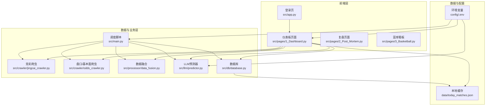
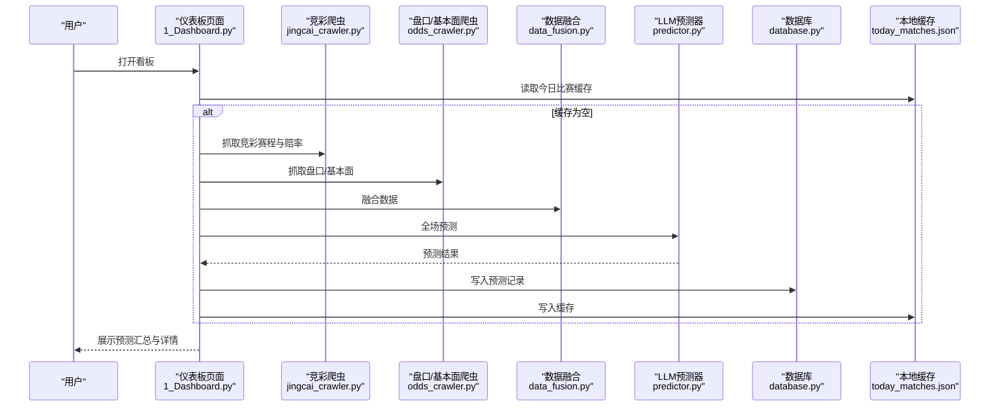
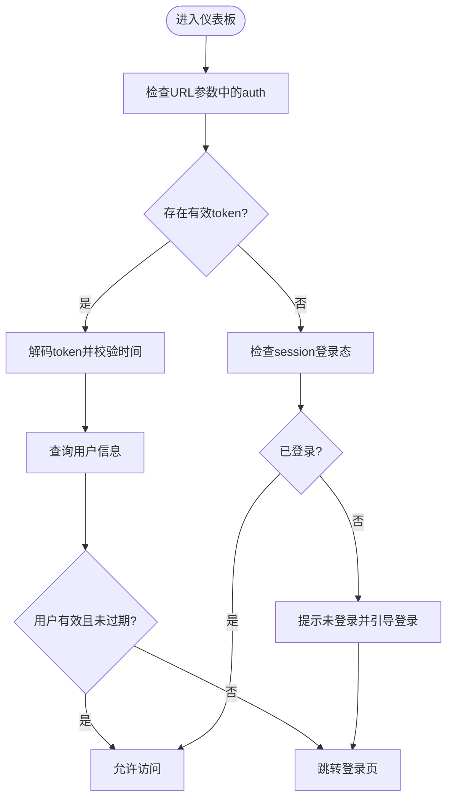
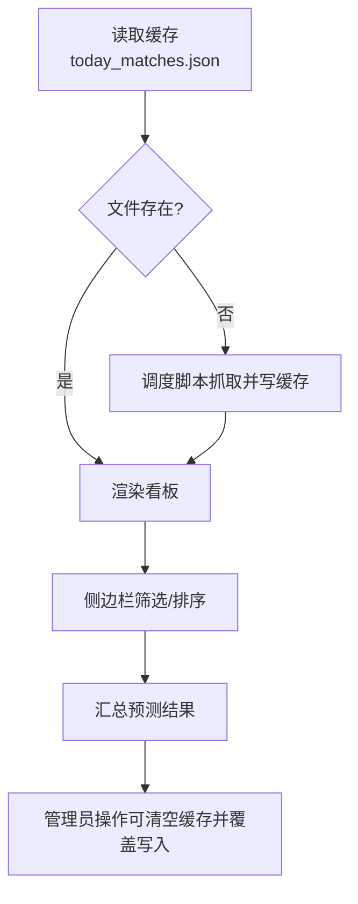
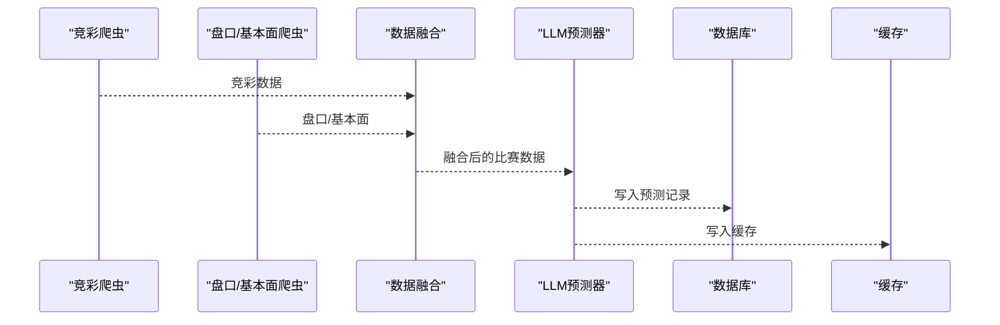
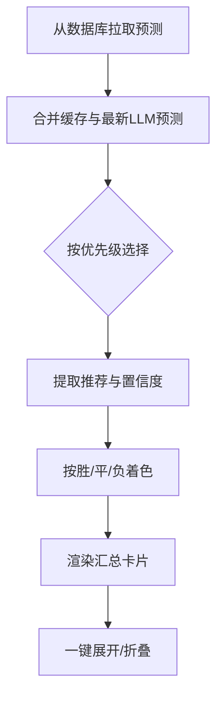
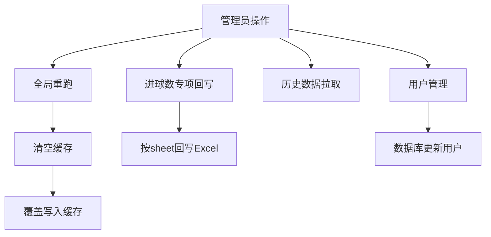
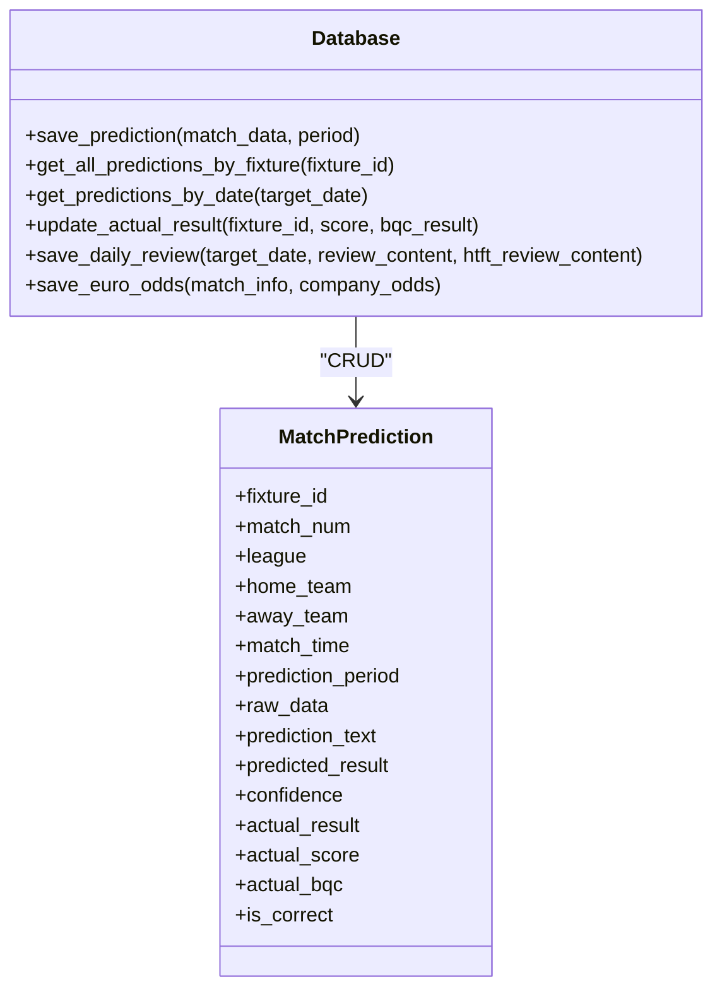
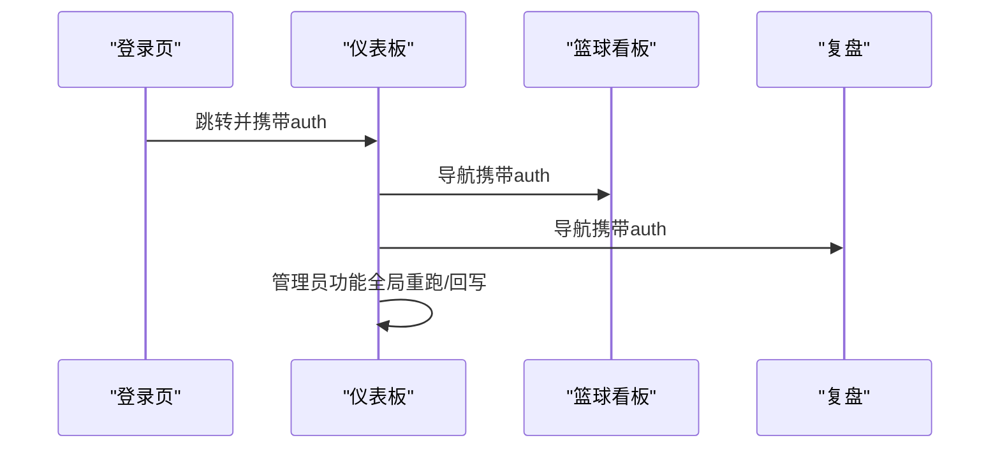
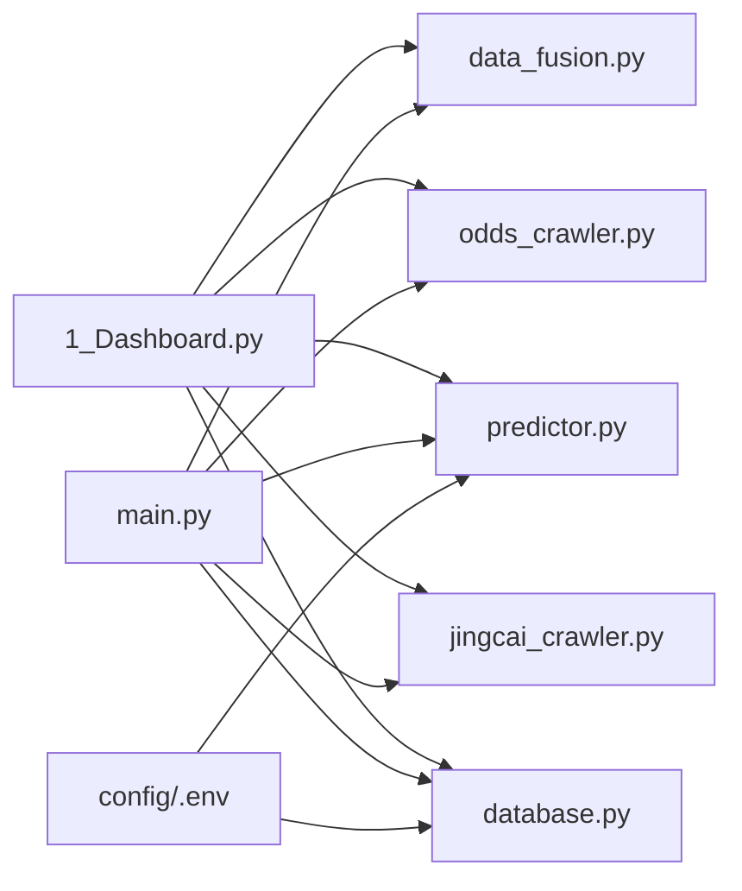

# 仪表板页面

<cite>
**本文引用的文件**
- [src/pages/1_Dashboard.py](file://src/pages/1_Dashboard.py)
- [src/app.py](file://src/app.py)
- [src/main.py](file://src/main.py)
- [src/db/database.py](file://src/db/database.py)
- [src/constants.py](file://src/constants.py)
- [src/llm/predictor.py](file://src/llm/predictor.py)
- [src/processor/data_fusion.py](file://src/processor/data_fusion.py)
- [src/crawler/jingcai_crawler.py](file://src/crawler/jingcai_crawler.py)
- [src/crawler/odds_crawler.py](file://src/crawler/odds_crawler.py)
- [data/today_matches.json](file://data/today_matches.json)
- [config/.env](file://config/.env)
- [src/pages/2_Post_Mortem.py](file://src/pages/2_Post_Mortem.py)
- [src/pages/3_Basketball.py](file://src/pages/3_Basketball.py)
- [src/manage_users.py](file://src/manage_users.py)
</cite>

## 目录
1. [简介](#简介)
2. [项目结构](#项目结构)
3. [核心组件](#核心组件)
4. [架构总览](#架构总览)
5. [详细组件分析](#详细组件分析)
6. [依赖分析](#依赖分析)
7. [性能考虑](#性能考虑)
8. [故障排查指南](#故障排查指南)
9. [结论](#结论)
10. [附录](#附录)

## 简介
本文件面向前端与全栈开发者，系统性阐述“仪表板页面”的技术实现，涵盖以下主题：
- 预测看板的数据展示逻辑与实时更新机制
- 比赛数据的获取、处理与渲染流程，含预测结果可视化
- 用户权限控制、数据过滤与排序
- 图表组件集成方案、响应式布局与用户体验优化
- 与后端数据库的交互、数据缓存与性能优化
- 仪表板的定制与扩展实践

## 项目结构
仪表板页面位于 Streamlit Pages 目录，配合应用入口、数据抓取与融合、LLM 预测、数据库持久化与环境配置共同组成完整的预测看板体系。

图示来源
- [src/pages/1_Dashboard.py:1-120](file://src/pages/1_Dashboard.py#L1-L120)
- [src/app.py:110-166](file://src/app.py#L110-L166)
- [src/main.py:34-136](file://src/main.py#L34-L136)
- [src/processor/data_fusion.py:57-108](file://src/processor/data_fusion.py#L57-L108)
- [src/crawler/jingcai_crawler.py:13-47](file://src/crawler/jingcai_crawler.py#L13-L47)
- [src/crawler/odds_crawler.py:17-161](file://src/crawler/odds_crawler.py#L17-L161)
- [src/db/database.py:200-330](file://src/db/database.py#L200-L330)
- [config/.env:1-20](file://config/.env#L1-L20)

章节来源
- [src/pages/1_Dashboard.py:1-120](file://src/pages/1_Dashboard.py#L1-L120)
- [src/app.py:110-166](file://src/app.py#L110-L166)
- [src/main.py:34-136](file://src/main.py#L34-L136)

## 核心组件
- 仪表板页面：负责登录态校验、侧边栏导航、数据筛选、预测汇总、全局控制（仅管理员）、预测详情渲染与交互。
- 登录入口：提供账号密码登录、Token 恢复登录态、跳转至看板。
- 数据抓取与融合：竞彩官方数据 + 盘口/基本面 + 雷速体育数据增强。
- LLM 预测器：基于规则与上下文的竞彩推荐与置信度生成。
- 数据库：SQLite 存储预测、赛果、复盘与历史欧赔等。
- 本地缓存：JSON 文件缓存今日比赛数据，减少重复抓取与提升渲染速度。
- 环境配置：LLM、数据库、第三方 API 等密钥与开关。

章节来源
- [src/pages/1_Dashboard.py:138-311](file://src/pages/1_Dashboard.py#L138-L311)
- [src/app.py:94-162](file://src/app.py#L94-L162)
- [src/processor/data_fusion.py:57-108](file://src/processor/data_fusion.py#L57-L108)
- [src/db/database.py:200-330](file://src/db/database.py#L200-L330)
- [data/today_matches.json:1-200](file://data/today_matches.json#L1-L200)
- [config/.env:1-20](file://config/.env#L1-L20)

## 架构总览
仪表板采用“前端渲染 + 本地缓存 + 后端数据库 + 多源数据抓取”的架构。数据流从竞彩与第三方盘口/基本面抓取，经融合与 LLM 预测后落库并缓存，前端以 Streamlit 渲染，管理员可触发全局重跑与回写 Excel。

图示来源
- [src/pages/1_Dashboard.py:208-212](file://src/pages/1_Dashboard.py#L208-L212)
- [src/main.py:42-126](file://src/main.py#L42-L126)
- [src/processor/data_fusion.py:61-108](file://src/processor/data_fusion.py#L61-L108)
- [src/crawler/jingcai_crawler.py:13-47](file://src/crawler/jingcai_crawler.py#L13-L47)
- [src/crawler/odds_crawler.py:17-161](file://src/crawler/odds_crawler.py#L17-L161)
- [src/db/database.py:256-304](file://src/db/database.py#L256-L304)
- [data/today_matches.json:1-200](file://data/today_matches.json#L1-L200)

## 详细组件分析

### 1) 登录与权限控制
- 登录入口负责账号密码校验、Token 生成与恢复、跳转看板。
- 仪表板页面通过 URL 参数中的 auth token 恢复登录态，校验有效期与用户有效性。
- 角色控制：admin 可使用全局重跑、Excel 回写、用户管理等高级功能；VIP 用户可见基础预测与到期时间提示。

图示来源
- [src/app.py:64-82](file://src/app.py#L64-L82)
- [src/pages/1_Dashboard.py:32-55](file://src/pages/1_Dashboard.py#L32-L55)
- [src/constants.py:3-5](file://src/constants.py#L3-L5)

章节来源
- [src/app.py:94-162](file://src/app.py#L94-L162)
- [src/pages/1_Dashboard.py:32-55](file://src/pages/1_Dashboard.py#L32-L55)
- [src/constants.py:3-5](file://src/constants.py#L3-L5)

### 2) 数据获取与缓存
- 本地缓存：仪表板读取 data/today_matches.json 作为数据源；若不存在则提示先运行调度脚本。
- 调度脚本：抓取竞彩、盘口/基本面、融合、LLM 预测、入库、写缓存。
- 缓存策略：仪表板使用 @st.cache_data(ttl=300) 缓存数据，5 分钟失效；管理员操作会清空缓存并覆盖写入。

图示来源
- [src/pages/1_Dashboard.py:86-106](file://src/pages/1_Dashboard.py#L86-L106)
- [src/main.py:102-126](file://src/main.py#L102-L126)
- [data/today_matches.json:1-200](file://data/today_matches.json#L1-L200)

章节来源
- [src/pages/1_Dashboard.py:86-106](file://src/pages/1_Dashboard.py#L86-L106)
- [src/main.py:102-126](file://src/main.py#L102-L126)

### 3) 数据融合与预测
- 融合流程：竞彩基础数据 + 盘口/基本面 + 雷速体育数据增强（伤停、交锋、进球分布、积分排名等）。
- 预测流程：LLM 预测器根据规则与上下文生成推荐与置信度，并写入数据库与缓存。

图示来源
- [src/processor/data_fusion.py:61-108](file://src/processor/data_fusion.py#L61-L108)
- [src/crawler/odds_crawler.py:17-161](file://src/crawler/odds_crawler.py#L17-L161)
- [src/llm/predictor.py:20-80](file://src/llm/predictor.py#L20-L80)
- [src/db/database.py:256-304](file://src/db/database.py#L256-L304)

章节来源
- [src/processor/data_fusion.py:57-108](file://src/processor/data_fusion.py#L57-L108)
- [src/crawler/odds_crawler.py:17-161](file://src/crawler/odds_crawler.py#L17-L161)
- [src/llm/predictor.py:20-80](file://src/llm/predictor.py#L20-L80)

### 4) 预测结果可视化与交互
- 预测汇总：从数据库聚合各时间段预测，合并缓存与最新 LLM 预测，优先级为 final > pre_12h > pre_24h。
- 标题栏推荐：解析推荐与置信度，按胜/平/负着色展示。
- 侧边栏筛选：按联赛多选筛选；显示当前数量；一键展开/折叠。
- 导航：跳转篮球、胜负彩、复盘、规则管理（admin）等页面。

图示来源
- [src/pages/1_Dashboard.py:108-136](file://src/pages/1_Dashboard.py#L108-L136)
- [src/pages/1_Dashboard.py:751-800](file://src/pages/1_Dashboard.py#L751-L800)
- [src/db/database.py:325-329](file://src/db/database.py#L325-L329)

章节来源
- [src/pages/1_Dashboard.py:108-136](file://src/pages/1_Dashboard.py#L108-L136)
- [src/pages/1_Dashboard.py:751-800](file://src/pages/1_Dashboard.py#L751-L800)
- [src/db/database.py:325-329](file://src/db/database.py#L325-L329)

### 5) 管理员功能与数据回写
- 全局重跑：按日期与时间段过滤，重新抓取、融合、预测并覆盖缓存。
- 进球数专项：按日期预测并回写 Excel（支持“预测进球数”与“重新预测”）。
- 历史数据拉取：仅入库历史已完赛数据，不预测。
- 用户管理：admin 可新增/续期账号，设置角色与有效期。

图示来源
- [src/pages/1_Dashboard.py:314-750](file://src/pages/1_Dashboard.py#L314-L750)
- [src/manage_users.py:12-37](file://src/manage_users.py#L12-L37)

章节来源
- [src/pages/1_Dashboard.py:314-750](file://src/pages/1_Dashboard.py#L314-L750)
- [src/manage_users.py:12-37](file://src/manage_users.py#L12-L37)

### 6) 与后端数据库的交互
- 表结构：用户、比赛预测（含时间段）、篮球预测、胜负彩预测、每日串关、每日复盘、欧赔历史等。
- 关键方法：保存/更新预测、按日期查询、更新实际赛果、保存串关与复盘、保存欧赔历史等。
- 查询优先级：同一 fixture_id 下按 repredicted > final > pre_12h > pre_24h 优先。

图示来源
- [src/db/database.py:200-562](file://src/db/database.py#L200-L562)

章节来源
- [src/db/database.py:200-562](file://src/db/database.py#L200-L562)

### 7) 页面间导航与路由守卫
- 登录页：生成 auth token，跳转看板。
- 仪表板：恢复登录态，侧边栏导航至篮球、胜负彩、复盘、规则管理。
- 复盘页：按日期抓取赛果并比对，更新数据库与展示。
- 篮球页：加载今日篮球数据，支持展开/折叠与全局重跑（admin）。

图示来源
- [src/app.py:110-160](file://src/app.py#L110-L160)
- [src/pages/1_Dashboard.py:227-277](file://src/pages/1_Dashboard.py#L227-L277)
- [src/pages/2_Post_Mortem.py:112-124](file://src/pages/2_Post_Mortem.py#L112-L124)
- [src/pages/3_Basketball.py:99-127](file://src/pages/3_Basketball.py#L99-L127)

章节来源
- [src/app.py:110-160](file://src/app.py#L110-L160)
- [src/pages/1_Dashboard.py:227-277](file://src/pages/1_Dashboard.py#L227-L277)
- [src/pages/2_Post_Mortem.py:112-124](file://src/pages/2_Post_Mortem.py#L112-L124)
- [src/pages/3_Basketball.py:99-127](file://src/pages/3_Basketball.py#L99-L127)

## 依赖分析
- 外部依赖：requests、BeautifulSoup、pandas、openpyxl、loguru、sqlalchemy、openai、dotenv。
- 内部模块：爬虫、融合、LLM、数据库、页面、常量、环境配置。
- 潜在循环依赖：页面与数据库、爬虫与融合、LLM 与规则模块之间为单向依赖，无明显循环。

图示来源
- [src/pages/1_Dashboard.py:8-18](file://src/pages/1_Dashboard.py#L8-L18)
- [src/main.py:25-32](file://src/main.py#L25-L32)
- [config/.env:1-20](file://config/.env#L1-L20)

章节来源
- [src/pages/1_Dashboard.py:8-18](file://src/pages/1_Dashboard.py#L8-L18)
- [src/main.py:25-32](file://src/main.py#L25-L32)
- [config/.env:1-20](file://config/.env#L1-L20)

## 性能考虑
- 缓存策略：@st.cache_data(ttl=300) 减少重复渲染；管理员操作后清空缓存并覆盖写入，保证一致性。
- 数据抓取：竞彩与盘口/基本面分步抓取，融合时按 fixture_id 匹配，避免重复 IO。
- LLM 调用：按总场次传参，逐条预测并写库，避免一次性大批次导致超时。
- 数据库：按日期窗口查询与优先级合并，减少冗余记录。
- 前端渲染：侧边栏筛选与一键展开/折叠降低 DOM 压力。

## 故障排查指南
- 登录失败：检查账号是否存在、密码哈希是否匹配、有效期是否过期；确认 auth token 未过期。
- 无数据：确认 data/today_matches.json 是否存在；若不存在，先运行调度脚本生成缓存。
- 爬虫异常：竞彩/盘口/基本面抓取失败时查看日志；检查网络与反爬限制。
- 数据库异常：核对表结构与列是否存在；必要时使用列补齐逻辑。
- Excel 回写失败：检查 sheet 名称与列索引；确认 openpyxl 可写权限。

章节来源
- [src/app.py:94-108](file://src/app.py#L94-L108)
- [src/pages/1_Dashboard.py:208-212](file://src/pages/1_Dashboard.py#L208-L212)
- [src/db/database.py:219-233](file://src/db/database.py#L219-L233)

## 结论
仪表板页面通过“本地缓存 + 多源数据抓取 + LLM 预测 + 数据库存储”的闭环，实现了稳定、可扩展的预测看板。管理员具备强大的全局控制能力，普通用户可获得清晰的预测汇总与交互体验。建议持续优化缓存命中率、LLM 调用并发与前端渲染性能，并完善监控与告警机制。

## 附录
- 环境变量：LLM_API_KEY、LLM_API_BASE、LLM_MODEL、DATABASE_URL、ENABLE_LEISU 等。
- 常用路径：data/today_matches.json、data/football.db、config/.env。
- 页面导航：登录页 -> 仪表板 -> 篮球 -> 复盘 -> 规则管理（admin）。