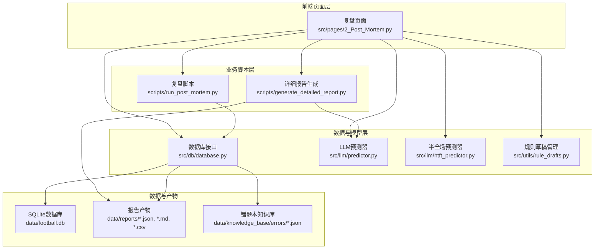
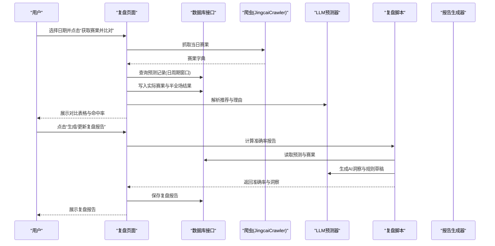
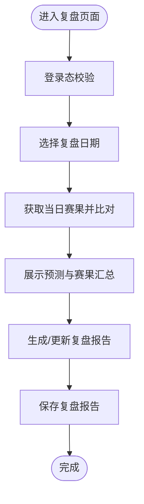
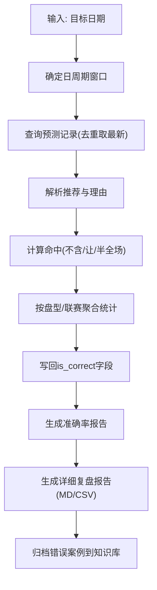
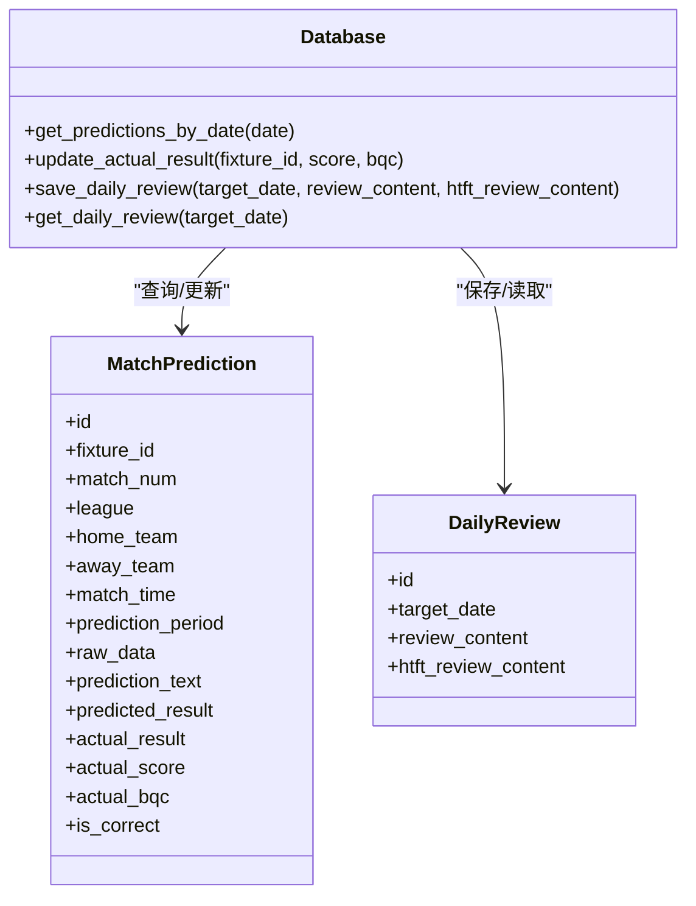
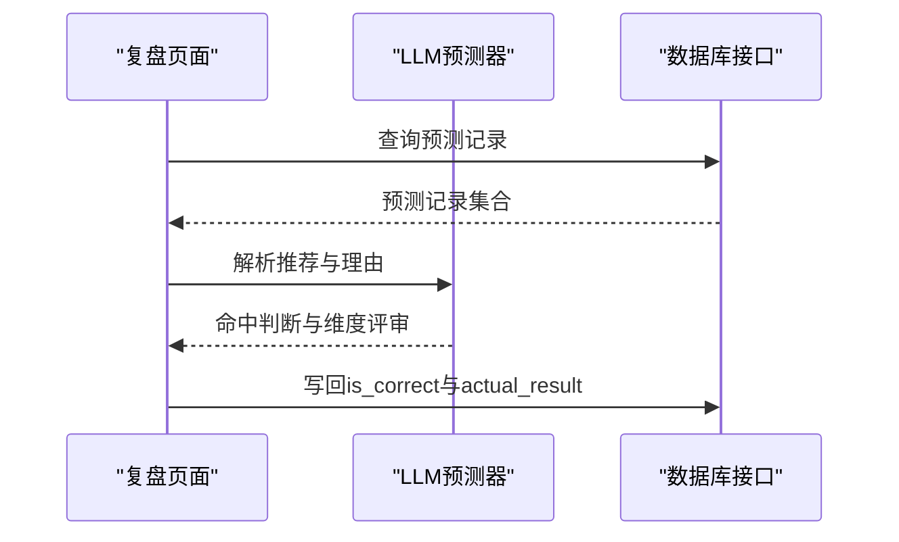
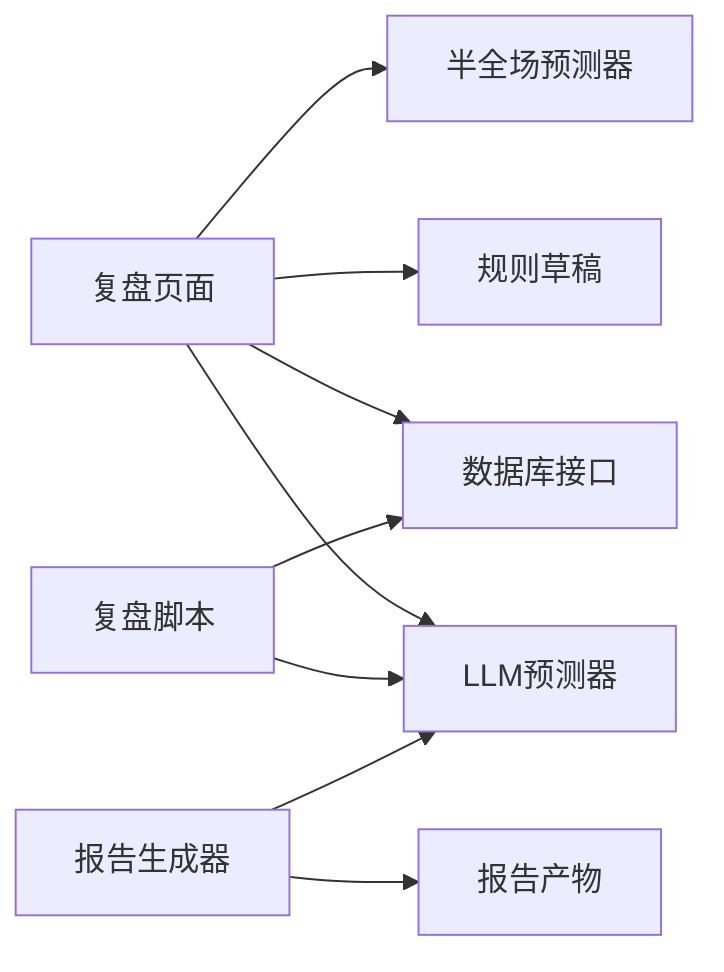

# 复盘报告页面

<cite>
**本文引用的文件**
- [2_Post_Mortem.py](file://src/pages/2_Post_Mortem.py)
- [run_post_mortem.py](file://scripts/run_post_mortem.py)
- [database.py](file://src/db/database.py)
- [predictor.py](file://src/llm/predictor.py)
- [htft_predictor.py](file://src/llm/htft_predictor.py)
- [generate_detailed_report.py](file://scripts/generate_detailed_report.py)
- [rule_drafts.py](file://src/utils/rule_drafts.py)
- [detailed_post_mortem_report.md](file://data/reports/detailed_post_mortem_report.md)
- [wrong_predictions.json](file://data/reports/wrong_predictions.json)
- [errors_2026-04-30.json](file://data/knowledge_base/errors/errors_2026-04-30.json)
</cite>

## 目录
1. [简介](#简介)
2. [项目结构](#项目结构)
3. [核心组件](#核心组件)
4. [架构总览](#架构总览)
5. [详细组件分析](#详细组件分析)
6. [依赖关系分析](#依赖关系分析)
7. [性能考量](#性能考量)
8. [故障排查指南](#故障排查指南)
9. [结论](#结论)
10. [附录](#附录)

## 简介
本技术文档面向复盘报告页面，系统性阐述历史数据分析、预测准确性评估与性能指标计算的实现，详述报告生成流程、数据对比分析与统计图表展示逻辑，覆盖不同时间段的数据筛选、命中率计算与趋势分析，提供完整的复盘模板、报告格式化与导出能力，并解释数据源组织方式、分析算法选择与结果验证机制，为分析师与研究人员提供使用与定制指导。

## 项目结构
复盘报告页面位于前端页面层，围绕数据库、爬虫、LLM预测器与规则草稿系统协同工作，形成“数据采集—预测—对比—复盘—规则沉淀”的闭环。

**图表来源**
- [2_Post_Mortem.py:1-787](file://src/pages/2_Post_Mortem.py#L1-L787)
- [run_post_mortem.py:1-824](file://scripts/run_post_mortem.py#L1-L824)
- [database.py:1-567](file://src/db/database.py#L1-L567)
- [predictor.py:1-800](file://src/llm/predictor.py#L1-L800)
- [htft_predictor.py:1-157](file://src/llm/htft_predictor.py#L1-L157)
- [generate_detailed_report.py:1-164](file://scripts/generate_detailed_report.py#L1-L164)

**章节来源**
- [2_Post_Mortem.py:1-787](file://src/pages/2_Post_Mortem.py#L1-L787)
- [run_post_mortem.py:1-824](file://scripts/run_post_mortem.py#L1-L824)
- [database.py:1-567](file://src/db/database.py#L1-L567)

## 核心组件
- 复盘页面控制器：负责日期选择、数据抓取、预测对比、AI复盘、规则草稿与报告生成。
- 复盘脚本：自动化计算准确率、生成详细复盘报告与CSV导出。
- 数据库接口：提供预测记录、实际赛果、复盘报告与知识库的持久化。
- LLM预测器：构建比赛数据提示、执行预测、生成复盘与半全场专项分析。
- 规则草稿系统：维护候选规则草稿，支持审核与采纳。
- 报告与知识库：生成Markdown/CSV报告，归档错误案例。

**章节来源**
- [2_Post_Mortem.py:43-787](file://src/pages/2_Post_Mortem.py#L43-L787)
- [run_post_mortem.py:253-492](file://scripts/run_post_mortem.py#L253-L492)
- [database.py:451-562](file://src/db/database.py#L451-L562)
- [predictor.py:20-800](file://src/llm/predictor.py#L20-L800)
- [rule_drafts.py:1-91](file://src/utils/rule_drafts.py#L1-L91)

## 架构总览
复盘页面通过Streamlit渲染交互界面，调用数据库接口获取预测记录，结合LLM预测器解析推荐与理由，计算命中率并生成复盘报告；同时支持对历史补拉数据进行重新预测，生成“repredicted”周期记录，便于对比与趋势分析。

**图表来源**
- [2_Post_Mortem.py:143-750](file://src/pages/2_Post_Mortem.py#L143-L750)
- [run_post_mortem.py:253-492](file://scripts/run_post_mortem.py#L253-L492)
- [database.py:451-501](file://src/db/database.py#L451-L501)
- [predictor.py:20-800](file://src/llm/predictor.py#L20-L800)

## 详细组件分析

### 复盘页面（前端交互与流程编排）
- 登录态与路由守卫：通过URL参数恢复登录状态，确保安全访问。
- 日期选择与数据抓取：支持抓取当日赛果并写入数据库，匹配预测记录，更新实际比分与半全场结果。
- 历史数据补拉与重新预测：清理历史窗口记录，融合盘口数据后入库；对历史补拉记录批量重新预测，生成“repredicted”周期记录。
- 对比展示与重跑：展示预测与赛果汇总表，支持仅重跑未命中、注入雷速情报、完成后自动更新复盘报告。
- AI深度复盘：生成/更新“全场预测”与“半全场专项”复盘报告，持久化到数据库；展示候选规则草稿，支持跳转规则管理页。

**图表来源**
- [2_Post_Mortem.py:43-787](file://src/pages/2_Post_Mortem.py#L43-L787)

**章节来源**
- [2_Post_Mortem.py:43-787](file://src/pages/2_Post_Mortem.py#L43-L787)

### 复盘脚本（准确率计算与报告生成）
- 准确率计算：按日周期窗口（目标日12:00~次日12:00）查询预测记录，解析推荐与理由，计算NSPF/SPF/BQC命中情况，写回is_correct字段。
- 盘型与联赛分组：按盘型（平手/半球/深盘等）与联赛分组统计命中率，输出结构化报告。
- 详细复盘报告：生成Markdown与CSV报告，包含逐场明细与冷门复盘建议；错误案例自动归档至知识库。
- 半全场专项：基于半全场推荐与实际结果，生成专项复盘报告。

**图表来源**
- [run_post_mortem.py:253-492](file://scripts/run_post_mortem.py#L253-L492)
- [generate_detailed_report.py:12-164](file://scripts/generate_detailed_report.py#L12-L164)

**章节来源**
- [run_post_mortem.py:253-492](file://scripts/run_post_mortem.py#L253-L492)
- [generate_detailed_report.py:12-164](file://scripts/generate_detailed_report.py#L12-L164)

### 数据库接口（数据模型与查询）
- 数据模型：MatchPrediction、DailyReview、EuroOddsHistory等，支持预测记录、复盘报告、欧赔历史等。
- 查询与更新：按日周期窗口查询预测记录，优先选择repredicted/final/pre_12h/pre_24h；更新实际赛果与半全场结果；保存复盘报告。
- 辅助方法：提取竞彩推荐、解析比分得到实际结果、批量保存欧赔历史。

**图表来源**
- [database.py:68-175](file://src/db/database.py#L68-L175)
- [database.py:451-562](file://src/db/database.py#L451-L562)

**章节来源**
- [database.py:68-175](file://src/db/database.py#L68-L175)
- [database.py:451-562](file://src/db/database.py#L451-L562)

### LLM预测器（提示工程与分析）
- 提示构建：将基本面、伤停、高级统计、盘赔数据格式化为提示文本，动态组装规则（盘型、联赛、变化规则、热钱规则）。
- 盘赔信号：检测深盘死水、半球生死盘、平手僵持、欧亚背离、浅盘升水诱下等微观信号，输出预测偏向与风控提示。
- 复盘与洞察：解析推荐与理由，生成准确率报告与规则草稿，支持半全场专项分析。

**图表来源**
- [predictor.py:20-800](file://src/llm/predictor.py#L20-L800)
- [2_Post_Mortem.py:370-750](file://src/pages/2_Post_Mortem.py#L370-L750)

**章节来源**
- [predictor.py:20-800](file://src/llm/predictor.py#L20-L800)
- [2_Post_Mortem.py:370-750](file://src/pages/2_Post_Mortem.py#L370-L750)

### 半全场专项分析
- 专项提示：聚焦半全场（平胜/平负/平平）的上半场僵持与下半场分化逻辑，结合亚指理论与赔率规律。
- 复盘流程：收集半全场推荐与实际结果，生成专项复盘报告，提出模型优化建议。

**章节来源**
- [htft_predictor.py:7-157](file://src/llm/htft_predictor.py#L7-L157)

### 规则草稿系统（规则沉淀与审核）
- 草稿管理：加载/保存/追加规则草稿，按日期替换待审草稿，查询待审草稿。
- 页面集成：复盘页面展示候选规则草稿，支持跳转规则管理页进行审核与采纳。

**章节来源**
- [rule_drafts.py:1-91](file://src/utils/rule_drafts.py#L1-L91)
- [2_Post_Mortem.py:571-688](file://src/pages/2_Post_Mortem.py#L571-L688)

## 依赖关系分析
- 页面依赖：复盘页面依赖数据库接口、爬虫、LLM预测器、规则草稿与半全场预测器。
- 脚本依赖：复盘脚本依赖数据库接口与LLM预测器，生成报告并归档错误案例。
- 数据依赖：准确率计算依赖预测记录与实际赛果；报告生成依赖结构化准确率数据与LLM洞察。

**图表来源**
- [2_Post_Mortem.py:1-787](file://src/pages/2_Post_Mortem.py#L1-L787)
- [run_post_mortem.py:1-824](file://scripts/run_post_mortem.py#L1-L824)
- [generate_detailed_report.py:1-164](file://scripts/generate_detailed_report.py#L1-L164)

**章节来源**
- [2_Post_Mortem.py:1-787](file://src/pages/2_Post_Mortem.py#L1-L787)
- [run_post_mortem.py:1-824](file://scripts/run_post_mortem.py#L1-L824)
- [generate_detailed_report.py:1-164](file://scripts/generate_detailed_report.py#L1-L164)

## 性能考量
- 数据查询优化：按日周期窗口与fixture_id优先级查询，减少重复记录与冗余数据。
- 批量写入：准确率计算后统一提交数据库事务，降低I/O开销。
- LLM调用节流：页面与脚本中对LLM调用进行进度反馈与异常处理，避免长时间阻塞。
- 缓存与会话：页面使用session_state缓存准确率报告与临时状态，减少重复计算。

[本节为通用性能讨论，不直接分析具体文件]

## 故障排查指南
- 登录态失效：检查URL参数auth与会话状态，确认令牌未过期。
- 无赛果数据：确认爬虫抓取成功，检查目标日期是否有比赛或数据延迟。
- 无预测记录：确认预测记录在日周期窗口内，检查prediction_period优先级与去重逻辑。
- LLM调用失败：检查API密钥与基础地址配置，确认网络连通性。
- 报告生成异常：检查报告文件权限与路径，确认JSON数据完整性。

**章节来源**
- [2_Post_Mortem.py:57-81](file://src/pages/2_Post_Mortem.py#L57-L81)
- [run_post_mortem.py:16-46](file://scripts/run_post_mortem.py#L16-L46)
- [generate_detailed_report.py:12-25](file://scripts/generate_detailed_report.py#L12-L25)

## 结论
复盘报告页面通过“页面交互—脚本计算—LLM洞察—规则沉淀”的闭环，实现了历史数据分析、预测准确性评估与性能指标计算的自动化与可视化。页面支持不同时间段的数据筛选、命中率与趋势分析，提供完整的复盘模板、报告格式化与导出能力，并建立了错误案例的知识库归档与规则草稿审核机制，为分析师与研究人员提供了高效、可追溯的复盘工具。

## 附录

### 报告产物与格式
- 结构化准确率报告：包含总体与分组命中率、逐场明细与维度评审。
- 详细复盘报告：Markdown与CSV格式，包含逐场明细与冷门复盘建议。
- 半全场专项报告：基于半全场推荐与实际结果的专项复盘与模型优化建议。
- 错题本知识库：按日期归档错误案例，沉淀微观信号规则。

**章节来源**
- [run_post_mortem.py:253-492](file://scripts/run_post_mortem.py#L253-L492)
- [generate_detailed_report.py:38-164](file://scripts/generate_detailed_report.py#L38-L164)
- [detailed_post_mortem_report.md:1-50](file://data/reports/detailed_post_mortem_report.md#L1-L50)
- [wrong_predictions.json:1-238](file://data/reports/wrong_predictions.json#L1-L238)
- [errors_2026-04-30.json:1-14](file://data/knowledge_base/errors/errors_2026-04-30.json#L1-L14)