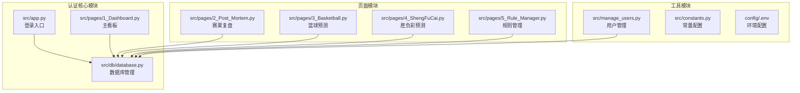
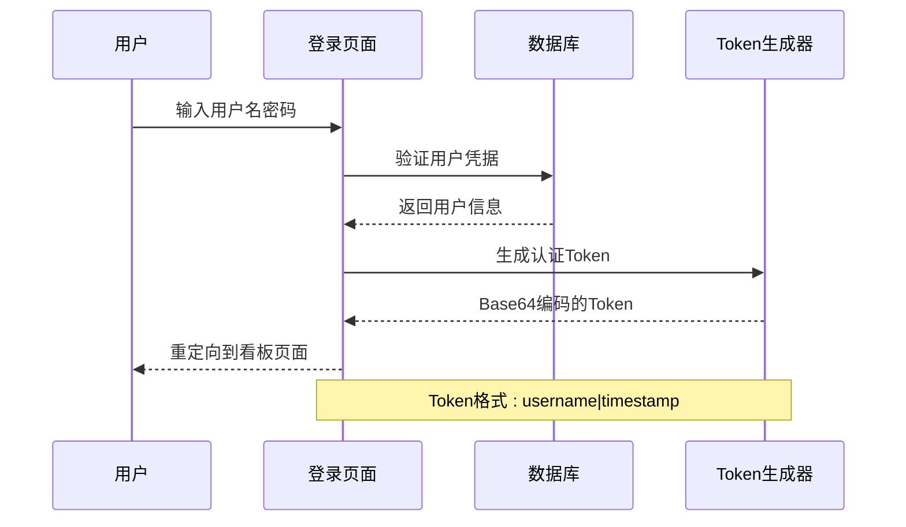
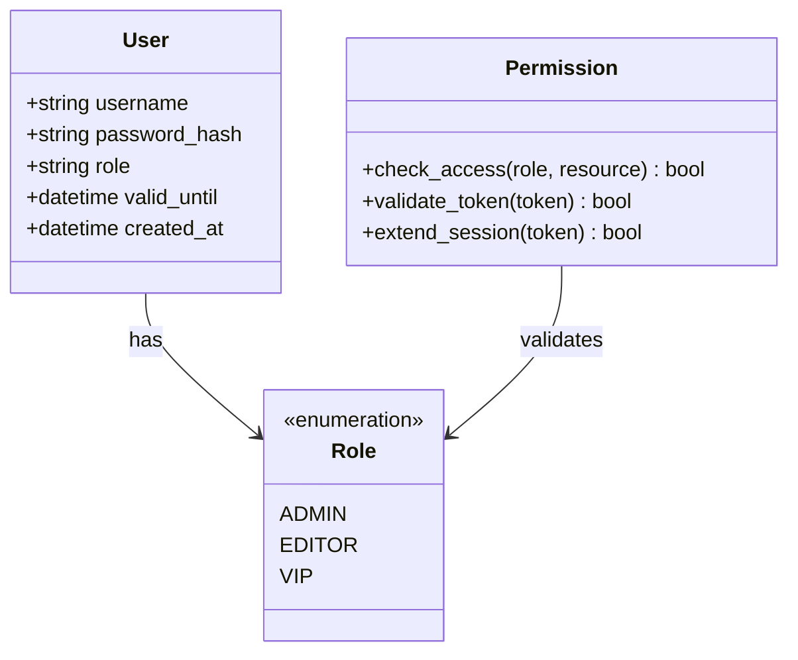
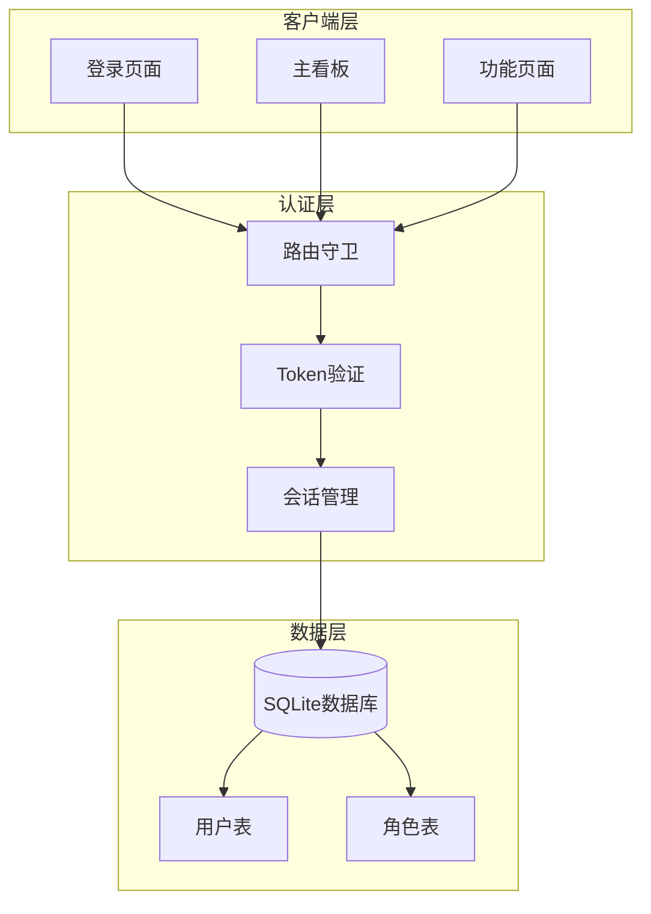
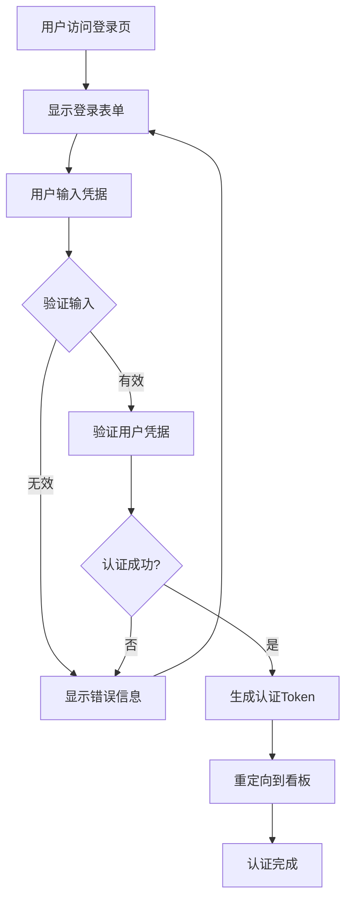
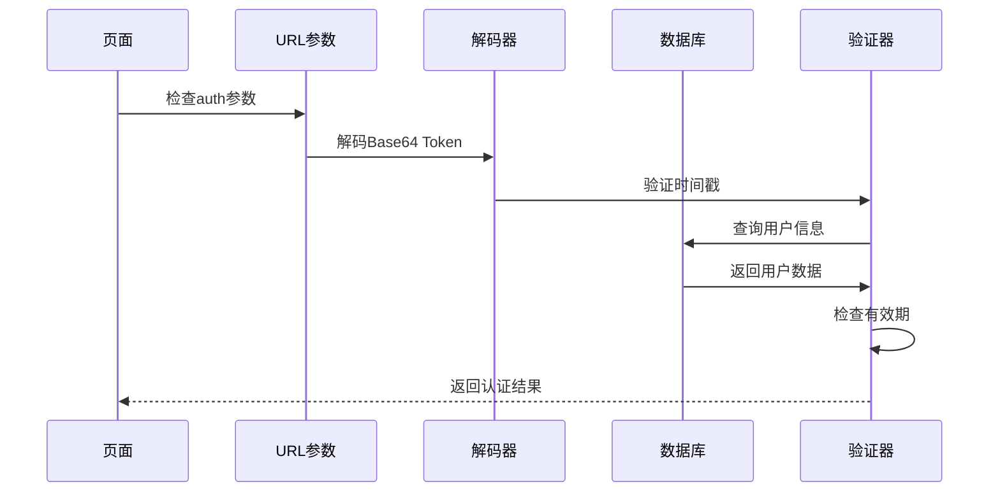
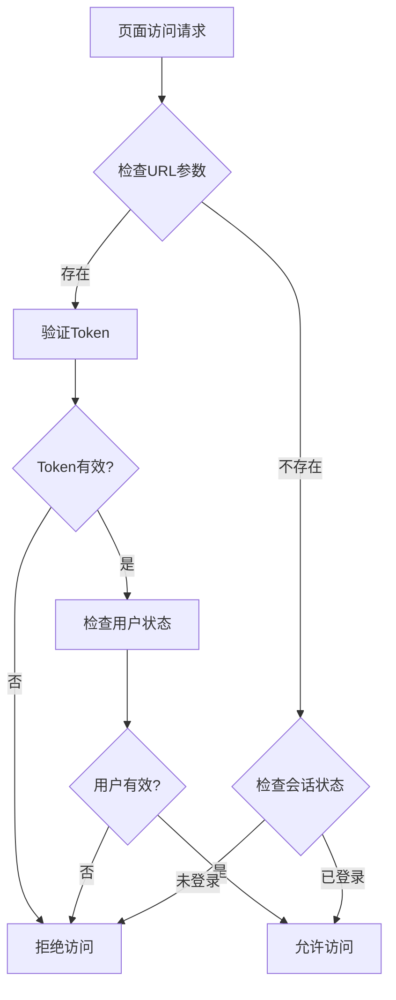
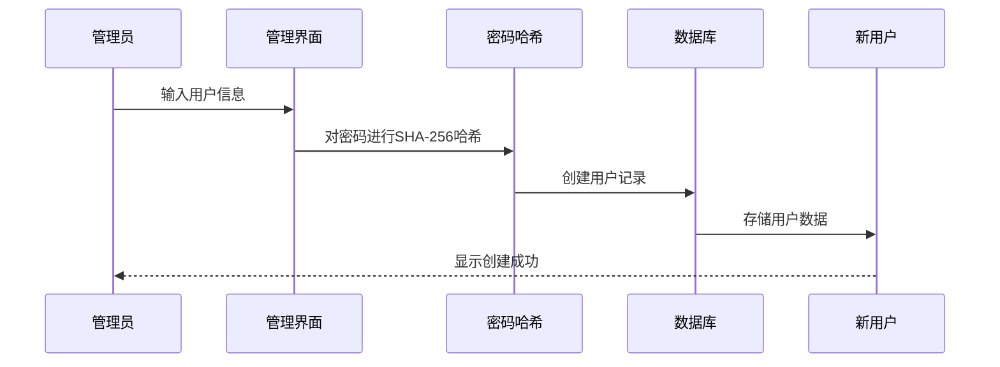
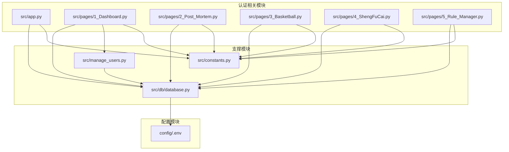

# 用户认证系统

<cite>
**本文档引用的文件**
- [src/app.py](file://src/app.py)
- [src/pages/1_Dashboard.py](file://src/pages/1_Dashboard.py)
- [src/pages/2_Post_Mortem.py](file://src/pages/2_Post_Mortem.py)
- [src/pages/3_Basketball.py](file://src/pages/3_Basketball.py)
- [src/pages/4_ShengFuCai.py](file://src/pages/4_ShengFuCai.py)
- [src/pages/5_Rule_Manager.py](file://src/pages/5_Rule_Manager.py)
- [src/db/database.py](file://src/db/database.py)
- [src/manage_users.py](file://src/manage_users.py)
- [src/constants.py](file://src/constants.py)
- [config/.env](file://config/.env)
</cite>

## 目录
1. [简介](#简介)
2. [项目结构](#项目结构)
3. [核心组件](#核心组件)
4. [架构概览](#架构概览)
5. [详细组件分析](#详细组件分析)
6. [依赖关系分析](#依赖关系分析)
7. [性能考虑](#性能考虑)
8. [故障排除指南](#故障排除指南)
9. [结论](#结论)

## 简介

本项目是一个基于Streamlit的足球预测分析系统，实现了完整的用户认证和权限管理系统。系统采用基于Token的认证机制，使用SHA-256密码哈希算法，实现了1小时有效期的会话管理，并提供了完整的用户注册、权限管理和安全防护功能。

## 项目结构

项目采用模块化设计，主要包含以下核心模块：

**图表来源**
- [src/app.py:1-166](file://src/app.py#L1-L166)
- [src/pages/1_Dashboard.py:1-800](file://src/pages/1_Dashboard.py#L1-L800)
- [src/db/database.py:1-567](file://src/db/database.py#L1-L567)

**章节来源**
- [src/app.py:1-166](file://src/app.py#L1-L166)
- [src/pages/1_Dashboard.py:1-800](file://src/pages/1_Dashboard.py#L1-L800)
- [src/db/database.py:1-567](file://src/db/database.py#L1-L567)

## 核心组件

### 认证Token系统

系统实现了基于Base64编码的轻量级Token机制：

**图表来源**
- [src/app.py:51-62](file://src/app.py#L51-L62)
- [src/pages/1_Dashboard.py:21-27](file://src/pages/1_Dashboard.py#L21-L27)

### 密码哈希机制

系统使用SHA-256算法进行密码哈希处理：

| 特性 | 描述 |
|------|------|
| 哈希算法 | SHA-256 |
| 输入处理 | UTF-8编码 |
| 输出格式 | 64字符十六进制字符串 |
| 安全性 | 单向哈希，不可逆 |

**章节来源**
- [src/app.py:91-92](file://src/app.py#L91-L92)
- [src/manage_users.py:9-10](file://src/manage_users.py#L9-L10)

### 用户权限模型

系统实现了三层权限控制体系：

**图表来源**
- [src/db/database.py:58-67](file://src/db/database.py#L58-L67)
- [src/pages/1_Dashboard.py:138-178](file://src/pages/1_Dashboard.py#L138-L178)

**章节来源**
- [src/db/database.py:58-67](file://src/db/database.py#L58-L67)
- [src/pages/1_Dashboard.py:138-178](file://src/pages/1_Dashboard.py#L138-L178)

## 架构概览

系统采用客户端-服务器分离的认证架构：

**图表来源**
- [src/app.py:64-82](file://src/app.py#L64-L82)
- [src/pages/1_Dashboard.py:32-49](file://src/pages/1_Dashboard.py#L32-L49)

## 详细组件分析

### 登录表单实现

登录表单采用Streamlit原生组件构建，提供直观的用户体验：

**图表来源**
- [src/app.py:136-162](file://src/app.py#L136-L162)

**章节来源**
- [src/app.py:136-162](file://src/app.py#L136-L162)

### Token生成与验证机制

系统实现了完整的Token生命周期管理：

#### Token生成流程
1. **数据组装**: `username|timestamp`格式
2. **Base64编码**: 使用UTF-8编码后进行Base64处理
3. **URL安全**: 生成的Token可直接作为URL参数传递

#### Token验证流程

**图表来源**
- [src/app.py:51-62](file://src/app.py#L51-L62)
- [src/app.py:64-82](file://src/app.py#L64-L82)

**章节来源**
- [src/app.py:51-62](file://src/app.py#L51-L62)
- [src/app.py:64-82](file://src/app.py#L64-L82)

### 权限验证流程

系统在每个页面都实现了统一的权限验证机制：

**图表来源**
- [src/pages/1_Dashboard.py:32-55](file://src/pages/1_Dashboard.py#L32-L55)
- [src/pages/2_Post_Mortem.py:57-80](file://src/pages/2_Post_Mortem.py#L57-L80)

**章节来源**
- [src/pages/1_Dashboard.py:32-55](file://src/pages/1_Dashboard.py#L32-L55)
- [src/pages/2_Post_Mortem.py:57-80](file://src/pages/2_Post_Mortem.py#L57-L80)

### 用户注册与管理

系统提供了完整的用户生命周期管理：

#### 用户创建流程

**图表来源**
- [src/manage_users.py:12-37](file://src/manage_users.py#L12-L37)
- [src/pages/1_Dashboard.py:138-178](file://src/pages/1_Dashboard.py#L138-L178)

**章节来源**
- [src/manage_users.py:12-37](file://src/manage_users.py#L12-L37)
- [src/pages/1_Dashboard.py:138-178](file://src/pages/1_Dashboard.py#L138-L178)

### 会话管理策略

系统实现了基于URL参数的轻量级会话管理：

| 特性 | 实现方式 | 安全性 |
|------|----------|--------|
| 会话存储 | URL参数 | 临时存储，随请求传递 |
| 有效期控制 | 1小时时间戳校验 | 内置过期检测 |
| 会话清理 | 退出登录清除 | 主动清理机制 |
| 跨页面共享 | Token传递 | 页面间共享 |

**章节来源**
- [src/constants.py:3-4](file://src/constants.py#L3-L4)
- [src/app.py:70](file://src/app.py#L70)

## 依赖关系分析

系统各模块间的依赖关系如下：

**图表来源**
- [src/app.py:29](file://src/app.py#L29)
- [src/pages/1_Dashboard.py:10](file://src/pages/1_Dashboard.py#L10)
- [src/db/database.py:1](file://src/db/database.py#L1)

**章节来源**
- [src/app.py:29](file://src/app.py#L29)
- [src/pages/1_Dashboard.py:10](file://src/pages/1_Dashboard.py#L10)
- [src/db/database.py:1](file://src/db/database.py#L1)

## 性能考虑

### Token验证性能

系统采用轻量级的Token验证机制，具有以下性能特点：

- **验证复杂度**: O(1) - 基于时间戳的简单比较
- **内存占用**: 极低 - 仅存储必要的会话状态
- **网络开销**: 最小化 - Token作为URL参数传递
- **缓存策略**: 页面级缓存配合Token验证

### 数据库访问优化

- **连接池**: SQLAlchemy连接池管理
- **查询优化**: 基于索引的用户查询
- **事务管理**: 自动事务提交和回滚
- **资源清理**: 及时关闭数据库连接

## 故障排除指南

### 常见问题及解决方案

#### 登录失败问题
**症状**: 用户名或密码错误提示
**原因分析**:
- 用户名不存在
- 密码哈希不匹配
- 账户已过期

**解决步骤**:
1. 验证用户名是否存在
2. 检查密码是否正确
3. 确认账户有效期
4. 重新生成用户记录

#### Token过期问题
**症状**: 页面访问被拒绝，提示会话过期
**原因分析**:
- Token超过1小时有效期
- 时间戳计算错误
- 服务器时间不同步

**解决步骤**:
1. 重新登录获取新Token
2. 检查系统时间设置
3. 验证Token生成逻辑

#### 权限不足问题
**症状**: 访问受限页面显示权限错误
**原因分析**:
- 用户角色权限不足
- 会话状态异常
- 页面路由守卫失效

**解决步骤**:
1. 检查用户角色设置
2. 验证会话状态
3. 重新登录系统

**章节来源**
- [src/app.py:99-107](file://src/app.py#L99-L107)
- [src/pages/1_Dashboard.py:51-55](file://src/pages/1_Dashboard.py#L51-L55)

## 结论

本用户认证系统实现了以下关键特性：

### 安全特性
- **密码保护**: 使用SHA-256哈希算法
- **会话安全**: 1小时有效期的Token机制
- **权限控制**: 三层角色权限模型
- **访问验证**: 每页面统一的路由守卫

### 功能完整性
- **用户管理**: 注册、更新、删除完整流程
- **权限管理**: 角色分配和权限验证
- **会话管理**: 自动过期和清理机制
- **跨页面共享**: Token在页面间传递

### 扩展性设计
- **模块化架构**: 清晰的组件分离
- **配置管理**: 环境变量和常量配置
- **数据库抽象**: ORM模型封装
- **页面路由**: 统一的访问控制

该系统为足球预测分析平台提供了坚实的安全基础，支持未来的功能扩展和安全增强需求。