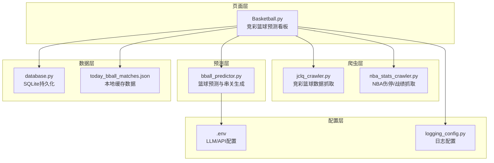
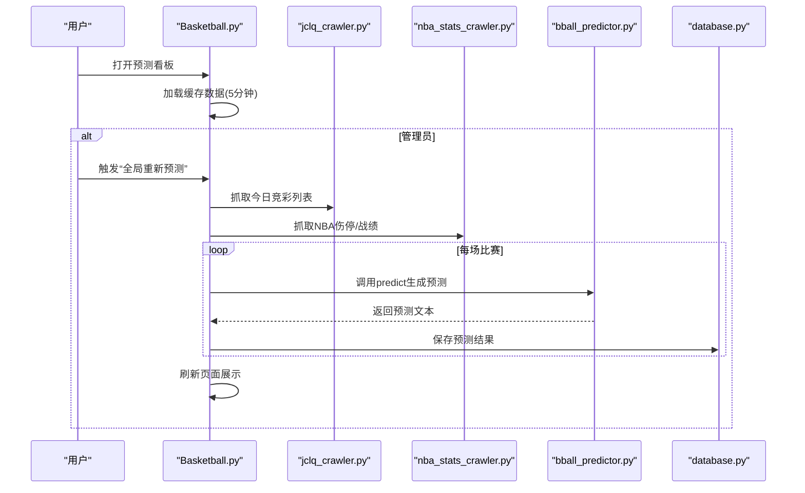
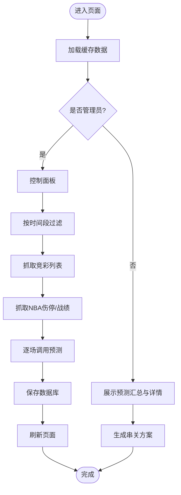
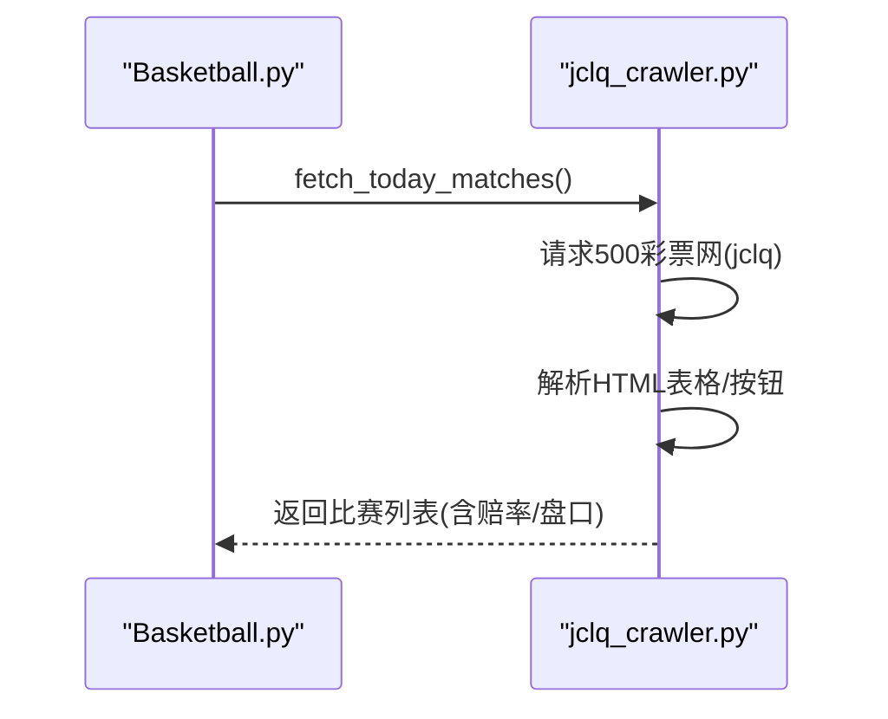
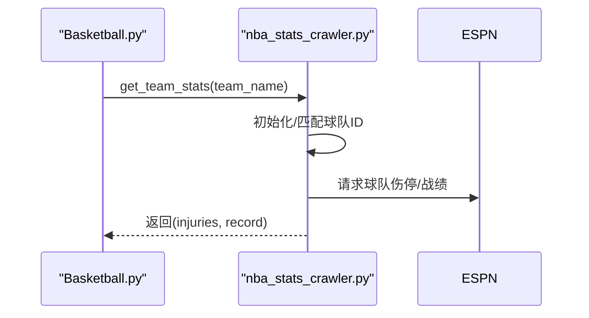
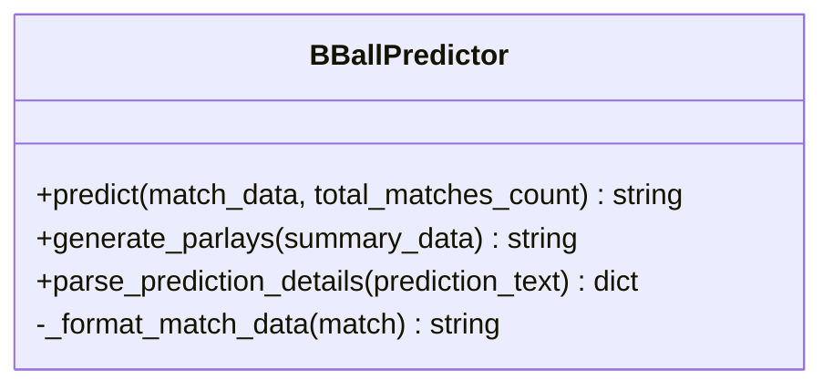
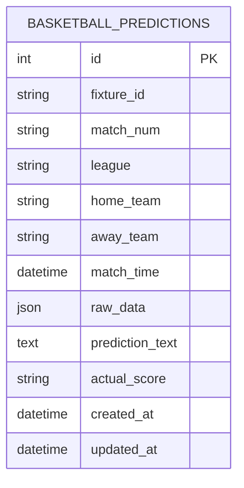
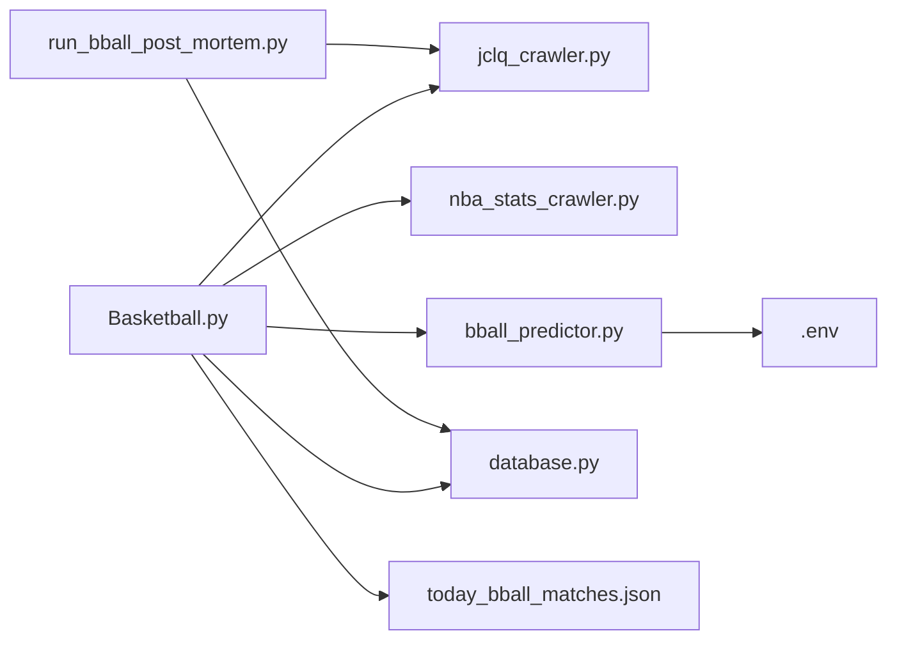

# 篮球预测页面

<cite>
**本文引用的文件**
- [Basketball.py](file://src/pages/3_Basketball.py)
- [bball_predictor.py](file://src/llm/bball_predictor.py)
- [jclq_crawler.py](file://src/crawler/jclq_crawler.py)
- [nba_stats_crawler.py](file://src/crawler/nba_stats_crawler.py)
- [database.py](file://src/db/database.py)
- [basketball_prediction_plan.md](file://docs/basketball_prediction_plan.md)
- [basketball_parlay_strategy.md](file://docs/basketball_parlay_strategy.md)
- [today_bball_matches.json](file://data/today_bball_matches.json)
- [.env](file://config/.env)
- [run_bball_post_mortem.py](file://scripts/run_bball_post_mortem.py)
- [app.py](file://src/app.py)
- [constants.py](file://src/constants.py)
- [logging_config.py](file://src/logging_config.py)
</cite>

## 目录
1. [简介](#简介)
2. [项目结构](#项目结构)
3. [核心组件](#核心组件)
4. [架构总览](#架构总览)
5. [详细组件分析](#详细组件分析)
6. [依赖关系分析](#依赖关系分析)
7. [性能考量](#性能考量)
8. [故障排查指南](#故障排查指南)
9. [结论](#结论)
10. [附录](#附录)

## 简介
本文件面向篮球分析师与数据用户，系统化阐述“篮球预测页面”的技术实现与业务流程，覆盖NBA与CBA比赛数据的采集、处理、预测与展示，详解盘口类型、技术统计与基本面分析方法，给出实时更新机制、预测模型调用与结果展示逻辑，以及与爬虫系统的集成、数据同步策略与异常处理机制。文档同时提供串关策略与风控建议，帮助用户正确使用预测工具并提升命中率。

## 项目结构
- 页面层：Streamlit页面负责用户交互与结果展示
- 爬虫层：竞彩篮球数据抓取与NBA伤停/战绩抓取
- 预测层：基于大模型的篮球预测与串关生成
- 数据层：SQLite数据库持久化与复盘分析
- 配置层：环境变量与日志配置

图表来源
- [Basketball.py:1-451](file://src/pages/3_Basketball.py#L1-L451)
- [jclq_crawler.py:1-264](file://src/crawler/jclq_crawler.py#L1-L264)
- [nba_stats_crawler.py:1-133](file://src/crawler/nba_stats_crawler.py#L1-L133)
- [bball_predictor.py:1-282](file://src/llm/bball_predictor.py#L1-L282)
- [database.py:1-567](file://src/db/database.py#L1-L567)
- [.env:1-20](file://config/.env#L1-L20)
- [logging_config.py:1-30](file://src/logging_config.py#L1-L30)

章节来源
- [Basketball.py:1-451](file://src/pages/3_Basketball.py#L1-L451)
- [jclq_crawler.py:1-264](file://src/crawler/jclq_crawler.py#L1-L264)
- [nba_stats_crawler.py:1-133](file://src/crawler/nba_stats_crawler.py#L1-L133)
- [bball_predictor.py:1-282](file://src/llm/bball_predictor.py#L1-L282)
- [database.py:1-567](file://src/db/database.py#L1-L567)
- [.env:1-20](file://config/.env#L1-L20)
- [logging_config.py:1-30](file://src/logging_config.py#L1-L30)

## 核心组件
- 页面控制器：负责登录态校验、数据加载与缓存、预测触发、串关生成与展示
- 竞彩数据抓取器：从500彩票网抓取竞彩篮球列表、赔率与盘口
- NBA伤停/战绩抓取器：从ESPN API抓取球队伤停与战绩
- 篮球预测器：基于大模型的系统提示词与工作流，输出让分/大小分预测与置信度
- 数据库：持久化预测结果、串关方案与复盘记录
- 配置与日志：LLM API密钥、模型与基础地址、日志轮转

章节来源
- [Basketball.py:1-451](file://src/pages/3_Basketball.py#L1-L451)
- [jclq_crawler.py:1-264](file://src/crawler/jclq_crawler.py#L1-L264)
- [nba_stats_crawler.py:1-133](file://src/crawler/nba_stats_crawler.py#L1-L133)
- [bball_predictor.py:1-282](file://src/llm/bball_predictor.py#L1-L282)
- [database.py:1-567](file://src/db/database.py#L1-L567)
- [.env:1-20](file://config/.env#L1-L20)
- [logging_config.py:1-30](file://src/logging_config.py#L1-L30)

## 架构总览
页面通过定时缓存加载本地JSON数据，支持管理员一键全局重新预测与仅刷新预测。预测流程包括：抓取竞彩列表、按需抓取NBA伤停/战绩、调用大模型生成预测、保存数据库并刷新页面。串关生成基于预测汇总与风控策略，支持时间范围筛选与方案生成。

图表来源
- [Basketball.py:194-268](file://src/pages/3_Basketball.py#L194-L268)
- [jclq_crawler.py:14-31](file://src/crawler/jclq_crawler.py#L14-L31)
- [nba_stats_crawler.py:71-125](file://src/crawler/nba_stats_crawler.py#L71-L125)
- [bball_predictor.py:166-198](file://src/llm/bball_predictor.py#L166-L198)
- [database.py:331-366](file://src/db/database.py#L331-L366)

章节来源
- [Basketball.py:170-268](file://src/pages/3_Basketball.py#L170-L268)
- [jclq_crawler.py:14-31](file://src/crawler/jclq_crawler.py#L14-L31)
- [nba_stats_crawler.py:71-125](file://src/crawler/nba_stats_crawler.py#L71-L125)
- [bball_predictor.py:166-198](file://src/llm/bball_predictor.py#L166-L198)
- [database.py:331-366](file://src/db/database.py#L331-L366)

## 详细组件分析

### 页面控制器（Basketball.py）
- 登录态与路由：支持URL参数恢复登录、会话有效期校验与跳转
- 数据加载与缓存：使用装饰器缓存5分钟，避免频繁IO
- 管理员功能：
  - 按时间段过滤抓取（凌晨/白天/傍晚/晚场/自定义）
  - 全局重新预测：抓取列表→抓取伤停→调用预测→保存数据库→刷新
  - 仅刷新预测：对现有数据抓取伤停→重新预测→保存→刷新
- 预测汇总与展示：解析预测文本，提取推荐、置信度与理由，排序展示
- 串关生成：基于汇总数据生成稳健与进阶方案，支持时间范围过滤
- 比赛详情：展示官方盘口与赔率，管理员可单场重新预测

图表来源
- [Basketball.py:70-268](file://src/pages/3_Basketball.py#L70-L268)

章节来源
- [Basketball.py:1-451](file://src/pages/3_Basketball.py#L1-L451)

### 竞彩数据抓取器（jclq_crawler.py）
- 目标：从500彩票网抓取竞彩篮球今日可售列表，解析赔率与盘口
- 关键点：
  - 解析HTML表格，修正主客队顺序与让分/大小分值
  - 自动识别“让分”“大小分”按钮所在单元格，避免data属性滞后
  - 仅保留与当前日期一致的比赛编号
  - 历史赛果抓取：解析比分、计算胜负/让分/大小分结果

图表来源
- [jclq_crawler.py:14-138](file://src/crawler/jclq_crawler.py#L14-L138)
- [Basketball.py:198-221](file://src/pages/3_Basketball.py#L198-L221)

章节来源
- [jclq_crawler.py:1-264](file://src/crawler/jclq_crawler.py#L1-L264)
- [Basketball.py:194-221](file://src/pages/3_Basketball.py#L194-L221)

### NBA伤停/战绩抓取器（nba_stats_crawler.py）
- 目标：从ESPN API获取球队伤停与战绩，用于预测输入
- 关键点：
  - 初始化球队名称与ID映射，支持中英文/简称匹配
  - 伤停翻译：Out/Day-to-Day/Suspension映射中文状态
  - 战绩：获取胜-负摘要
  - 异常处理：网络失败时返回错误提示

图表来源
- [nba_stats_crawler.py:71-125](file://src/crawler/nba_stats_crawler.py#L71-L125)
- [Basketball.py:227-231](file://src/pages/3_Basketball.py#L227-L231)

章节来源
- [nba_stats_crawler.py:1-133](file://src/crawler/nba_stats_crawler.py#L1-L133)
- [Basketball.py:227-231](file://src/pages/3_Basketball.py#L227-L231)

### 篮球预测器（bball_predictor.py）
- 目标：基于系统提示词与工作流，输出让分/大小分预测与置信度
- 关键点：
  - 系统提示词包含五大维度：伤停/阵容、赛程消耗、战术克制、盘口博弈、欧篮专项
  - 输入格式化：将比赛信息、伤停/战绩、官方盘口与赔率整合
  - 特殊风险提示：单日极少赛事的交叉盘风险
  - 预测解析：从模型输出提取推荐、大小分、置信度与理由
  - 串关生成：基于汇总数据与风控策略生成稳健/进阶方案
  - API配置：从.env读取LLM密钥、基础地址与模型名

图表来源
- [bball_predictor.py:9-282](file://src/llm/bball_predictor.py#L9-L282)

章节来源
- [bball_predictor.py:1-282](file://src/llm/bball_predictor.py#L1-L282)
- [.env:4-7](file://config/.env#L4-L7)

### 数据库（database.py）
- 目标：持久化篮球预测结果、串关方案与复盘记录
- 关键点：
  - 篮球预测表：fixture_id、match_num、league、teams、match_time、raw_data、prediction_text、actual_score
  - 保存接口：save_bball_prediction
  - 查询接口：get_bball_prediction_by_fixture
  - 复盘：脚本读取历史赛果与预测，对比命中并更新数据库字段

图表来源
- [database.py:104-125](file://src/db/database.py#L104-L125)

章节来源
- [database.py:331-372](file://src/db/database.py#L331-L372)
- [run_bball_post_mortem.py:89-121](file://scripts/run_bball_post_mortem.py#L89-L121)

### 配置与登录（.env、app.py、constants.py、logging_config.py）
- .env：LLM_API_KEY、LLM_API_BASE、LLM_MODEL、DATABASE_URL等
- app.py：登录态校验、URL参数恢复、会话状态维护
- constants.py：认证token有效期
- logging_config.py：日志轮转与输出

章节来源
- [.env:1-20](file://config/.env#L1-L20)
- [app.py:64-82](file://src/app.py#L64-L82)
- [constants.py:1-5](file://src/constants.py#L1-L5)
- [logging_config.py:1-30](file://src/logging_config.py#L1-L30)

## 依赖关系分析
- 页面依赖：爬虫（竞彩列表/NBA伤停）、预测器（大模型）、数据库（持久化）、本地缓存（JSON）
- 预测器依赖：.env中的LLM配置
- 复盘脚本依赖：爬虫（历史赛果）、数据库（预测记录）

图表来源
- [Basketball.py:12-16](file://src/pages/3_Basketball.py#L12-L16)
- [jclq_crawler.py:1-264](file://src/crawler/jclq_crawler.py#L1-L264)
- [nba_stats_crawler.py:1-133](file://src/crawler/nba_stats_crawler.py#L1-L133)
- [bball_predictor.py:1-282](file://src/llm/bball_predictor.py#L1-L282)
- [database.py:1-567](file://src/db/database.py#L1-L567)
- [run_bball_post_mortem.py:13-14](file://scripts/run_bball_post_mortem.py#L13-L14)

章节来源
- [Basketball.py:1-16](file://src/pages/3_Basketball.py#L1-L16)
- [run_bball_post_mortem.py:1-267](file://scripts/run_bball_post_mortem.py#L1-L267)

## 性能考量
- 缓存策略：页面数据5分钟缓存，降低IO与网络压力
- 并发与批处理：全局预测按场次循环调用，建议在后台任务中异步执行
- 网络超时：爬虫设置合理超时，异常时返回空列表并记录日志
- 数据库写入：批量保存预测结果，避免频繁事务
- 日志轮转：按天轮转，保留7天，避免磁盘膨胀

## 故障排查指南
- LLM配置缺失：检查.env中LLM_API_KEY、LLM_API_BASE、LLM_MODEL是否正确
- 爬虫失败：确认500网可访问、User-Agent可用、HTML结构未变更
- 伤停抓取失败：ESPN API可能返回空或网络异常，检查返回JSON结构
- 预测文本解析：若模型输出格式变化，需更新解析逻辑
- 数据库异常：检查SQLite路径与权限，确认表结构存在
- 复盘脚本：确保历史赛果抓取成功、预测记录存在且match_num匹配

章节来源
- [bball_predictor.py:20-27](file://src/llm/bball_predictor.py#L20-L27)
- [jclq_crawler.py:20-31](file://src/crawler/jclq_crawler.py#L20-L31)
- [nba_stats_crawler.py:87-125](file://src/crawler/nba_stats_crawler.py#L87-L125)
- [database.py:200-217](file://src/db/database.py#L200-L217)
- [run_bball_post_mortem.py:89-121](file://scripts/run_bball_post_mortem.py#L89-L121)

## 结论
篮球预测页面通过“页面-爬虫-预测-数据库-配置”的分层设计，实现了竞彩篮球数据的自动化采集、多维度分析与可视化展示。管理员可通过控制面板一键全局预测并刷新，用户可基于置信度与理由进行决策。结合串关风控策略与复盘机制，系统在提升预测质量的同时，增强了可追溯性与可维护性。

## 附录

### 篮球预测核心维度与风控
- 基本面与人员变动：核心伤停、阵容深度、CBA外援政策
- 赛程消耗与体能：背靠背、魔鬼客场、高原/极寒客场
- 战术克制与高阶数据：Pace、空间与内线博弈、防守效率
- 盘口逻辑与机构博弈：让分深浅、大小分诱导、单日极少风险
- 欧篮专项：双赛周、主场加成、40分钟赛制与关键分值、防守效率权重

章节来源
- [basketball_prediction_plan.md:1-71](file://docs/basketball_prediction_plan.md#L1-L71)

### 串关风控与实战策略
- 三大死穴：双胆双热、深盘体能陷阱、仅看场均得分串大小分
- 职业级策略：同场关联、2串1矩阵、单日极少时交叉避险
- 大模型提示词优化：严禁长串、强制异构组合、体能一票否决

章节来源
- [basketball_parlay_strategy.md:1-51](file://docs/basketball_parlay_strategy.md#L1-L51)

### 数据来源与缓存
- 本地缓存：data/today_bball_matches.json
- 历史复盘：data/reports/bball_all_compared_matches.json、CSV

章节来源
- [today_bball_matches.json:1-589](file://data/today_bball_matches.json#L1-L589)
- [run_bball_post_mortem.py:26-77](file://scripts/run_bball_post_mortem.py#L26-L77)