# 胜负彩页面

<cite>
**本文档引用的文件**
- [4_ShengFuCai.py](file://src/pages/4_ShengFuCai.py)
- [sfc_crawler.py](file://src/crawler/sfc_crawler.py)
- [odds_crawler.py](file://src/crawler/odds_crawler.py)
- [jingcai_crawler.py](file://src/crawler/jingcai_crawler.py)
- [predictor.py](file://src/llm/predictor.py)
- [predictor_back.py](file://src/llm/predictor_back.py)
- [database.py](file://src/db/database.py)
- [app.py](file://src/app.py)
- [constants.py](file://src/constants.py)
- [.env](file://config/.env)
- [micro_signals.json](file://data/rules/micro_signals.json)
- [arbitration_rules.json](file://data/rules/arbitration_rules.json)
- [rule_registry.py](file://src/utils/rule_registry.py)
</cite>

## 目录
1. [简介](#简介)
2. [项目结构](#项目结构)
3. [核心组件](#核心组件)
4. [架构概览](#架构概览)
5. [详细组件分析](#详细组件分析)
6. [依赖关系分析](#依赖关系分析)
7. [性能考虑](#性能考虑)
8. [故障排除指南](#故障排除指南)
9. [结论](#结论)

## 简介

胜负彩页面是泊松数据模型系统中的核心功能模块，专门用于处理中国体育彩票的胜负彩（十四场）玩法。该页面集成了完整的数据采集、分析预测、风险控制和历史回溯分析功能，为足彩分析师和玩家提供专业的投注决策支持工具。

系统采用现代化的Web应用架构，基于Streamlit构建用户界面，结合强大的AI预测模型和丰富的足彩规则引擎，实现了从数据采集到决策输出的全流程自动化。页面支持多种玩法的智能分析，包括传统的全场胜平负（不让球）和让球胜平负玩法，并提供实时的风险控制机制和历史数据分析功能。

## 项目结构

项目采用模块化设计，主要分为以下几个核心层次：

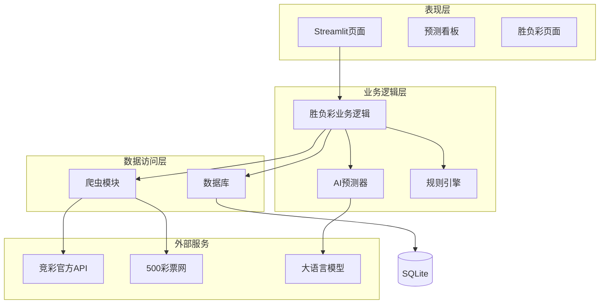

**图表来源**
- [4_ShengFuCai.py:1-288](file://src/pages/4_ShengFuCai.py#L1-L288)
- [predictor.py:1-800](file://src/llm/predictor.py#L1-L800)
- [database.py:1-567](file://src/db/database.py#L1-L567)

**章节来源**
- [4_ShengFuCai.py:1-288](file://src/pages/4_ShengFuCai.py#L1-L288)
- [app.py:1-166](file://src/app.py#L1-L166)

## 核心组件

### 页面控制器组件

胜负彩页面的核心控制器负责整个页面的生命周期管理，包括用户认证、数据获取、预测执行和结果展示等功能。

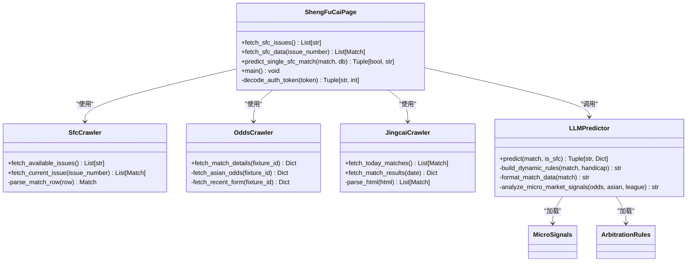

**图表来源**
- [4_ShengFuCai.py:1-288](file://src/pages/4_ShengFuCai.py#L1-L288)
- [sfc_crawler.py:1-145](file://src/crawler/sfc_crawler.py#L1-L145)
- [odds_crawler.py:1-167](file://src/crawler/odds_crawler.py#L1-L167)
- [jingcai_crawler.py:1-330](file://src/crawler/jingcai_crawler.py#L1-L330)
- [predictor.py:1-800](file://src/llm/predictor.py#L1-L800)

### 数据模型组件

系统采用标准化的数据模型来存储和管理胜负彩相关的所有数据，包括期号、比赛信息、预测结果和历史数据等。

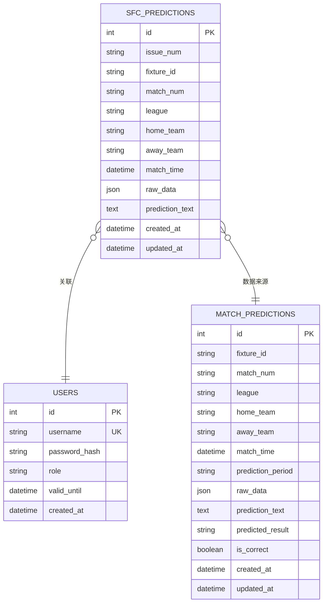

**图表来源**
- [database.py:127-147](file://src/db/database.py#L127-L147)
- [database.py:58-103](file://src/db/database.py#L58-L103)

**章节来源**
- [4_ShengFuCai.py:58-87](file://src/pages/4_ShengFuCai.py#L58-L87)
- [database.py:1-567](file://src/db/database.py#L1-L567)

## 架构概览

胜负彩页面采用分层架构设计，实现了清晰的关注点分离和职责划分：

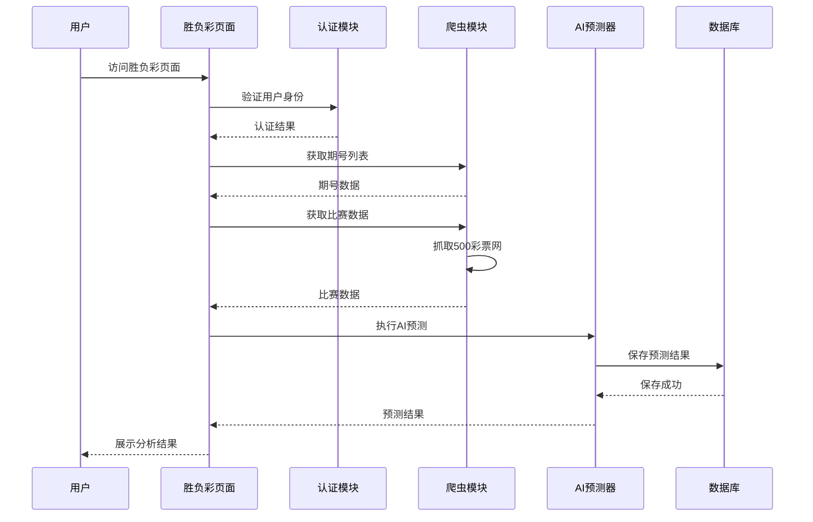

**图表来源**
- [4_ShengFuCai.py:91-288](file://src/pages/4_ShengFuCai.py#L91-L288)
- [app.py:64-82](file://src/app.py#L64-L82)

### 数据流架构

系统实现了完整的数据流处理管道，从原始数据获取到最终结果输出：

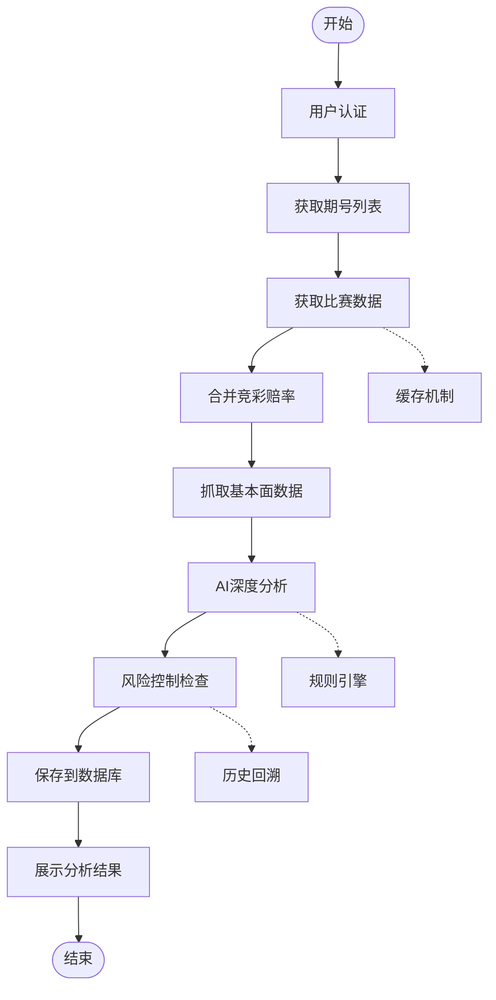

**图表来源**
- [4_ShengFuCai.py:35-56](file://src/pages/4_ShengFuCai.py#L35-L56)
- [predictor.py:81-120](file://src/llm/predictor.py#L81-L120)

**章节来源**
- [4_ShengFuCai.py:1-288](file://src/pages/4_ShengFuCai.py#L1-L288)
- [predictor.py:1-800](file://src/llm/predictor.py#L1-L800)

## 详细组件分析

### 胜负彩数据采集组件

#### 期号获取机制

系统通过专门的爬虫模块从500彩票网获取可用的胜负彩期号信息，实现了自动化的期号发现和管理功能。

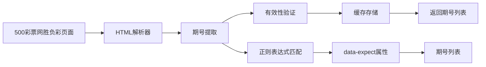

**图表来源**
- [sfc_crawler.py:14-36](file://src/crawler/sfc_crawler.py#L14-L36)

#### 比赛数据获取

系统能够从500彩票网获取详细的胜负彩比赛信息，包括对阵双方、比赛时间、期号等关键数据。

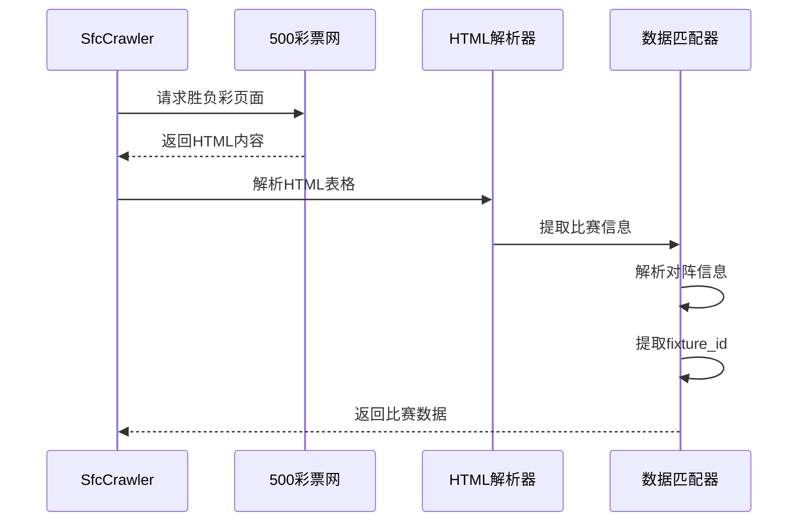

**图表来源**
- [sfc_crawler.py:37-139](file://src/crawler/sfc_crawler.py#L37-L139)

**章节来源**
- [sfc_crawler.py:1-145](file://src/crawler/sfc_crawler.py#L1-L145)

### AI预测分析组件

#### 预测算法架构

AI预测器采用了多层次的分析架构，结合了盘口分析、基本面评估和微观信号检测等多种技术手段。

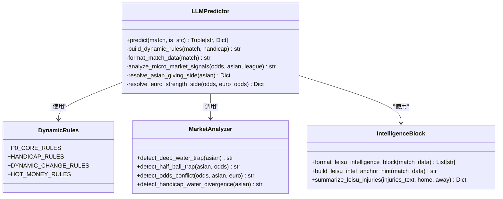

**图表来源**
- [predictor.py:20-80](file://src/llm/predictor.py#L20-L80)
- [predictor.py:482-586](file://src/llm/predictor.py#L482-L586)
- [predictor.py:435-481](file://src/llm/predictor.py#L435-L481)

#### 微观信号检测机制

系统实现了复杂的微观信号检测算法，能够识别各种盘口陷阱和诱导信号：

| 信号类型 | 触发条件 | 风险等级 | 预测偏向 |
|---------|---------|---------|---------|
| 平半僵尸盘 | 初盘0.25且即时盘0.25，上盘水位≥1.00 | 🔴高危 | 禁止下盘 |
| 半球退平半降温 | 初盘0.5且即时盘0.25，上盘水位0.85-0.95 | 🔴高危 | 支持主队不败 |
| 深盘硬挺不退 | 初盘≥0.75且即时盘不变，上盘水位≥0.95 | 🔴高危 | 警惕让球方穿盘能力 |
| 半球生死盘 | 初盘半球且上盘水位异常升高 | 🔴高危 | 禁止让球方打出 |

**章节来源**
- [predictor.py:482-586](file://src/llm/predictor.py#L482-L586)
- [micro_signals.json:1-977](file://data/rules/micro_signals.json#L1-L977)

### 风险控制组件

#### 仲裁规则引擎

系统内置了完善的仲裁规则引擎，用于在关键时刻做出风险控制决策：

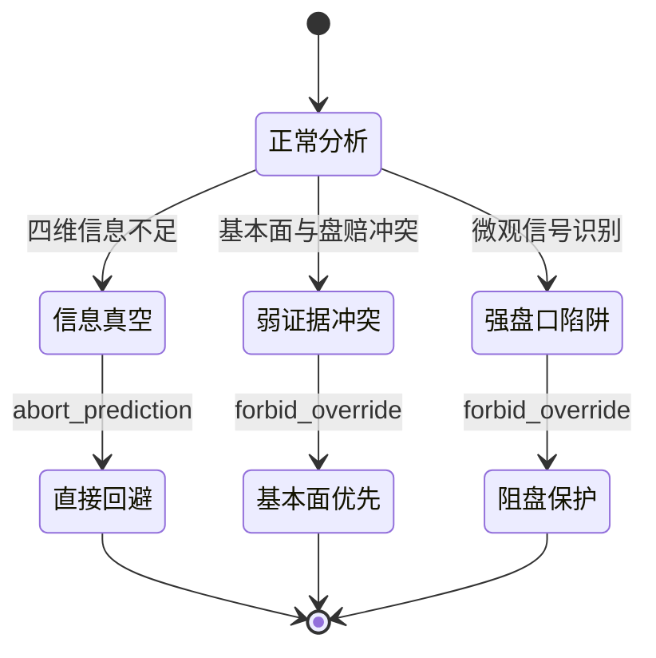

**图表来源**
- [arbitration_rules.json:1-63](file://data/rules/arbitration_rules.json#L1-L63)
- [rule_registry.py:150-176](file://src/utils/rule_registry.py#L150-L176)

#### 组合投注优化策略

系统支持多种组合投注策略的优化和风险控制：

| 策略类型 | 风险控制机制 | 适用场景 |
|---------|-------------|---------|
| 单场预测 | 置信度阈值控制 | 风险偏好较低的用户 |
| 双选策略 | 预测偏向抑制 | 需要平衡风险的用户 |
| 串关组合 | 最大化收益控制 | 高风险偏好用户 |
| 历史回溯 | 绩效评估机制 | 风险管理优化 |

**章节来源**
- [predictor.py:5228-5269](file://src/llm/predictor.py#L5228-L5269)
- [arbitration_rules.json:1-63](file://data/rules/arbitration_rules.json#L1-L63)

### 数据持久化组件

#### 数据库设计

系统采用SQLite作为主要数据存储，设计了专门的表结构来支持胜负彩业务需求：

```mermaid
erDiagram
SFC_PREDICTIONS {
int id PK
string issue_num
string fixture_id
string match_num
string league
string home_team
string away_team
datetime match_time
json raw_data
text prediction_text
datetime created_at
datetime updated_at
}
ISSUE_INDEX IX_issue_num ON SFC_PREDICTIONS(issue_num)
FIXTURE_INDEX IX_fixture_id ON SFC_PREDICTIONS(fixture_id)
MATCH_INDEX IX_match_num ON SFC_PREDICTIONS(match_num)
SFC_PREDICTIONS ||--o{ USERS : "关联用户"
SFC_PREDICTIONS ||--o{ MATCH_PREDICTIONS : "历史数据"
```

**图表来源**
- [database.py:127-147](file://src/db/database.py#L127-L147)

**章节来源**
- [database.py:1-567](file://src/db/database.py#L1-L567)

## 依赖关系分析

### 外部依赖关系

系统对外部服务的依赖关系如下：

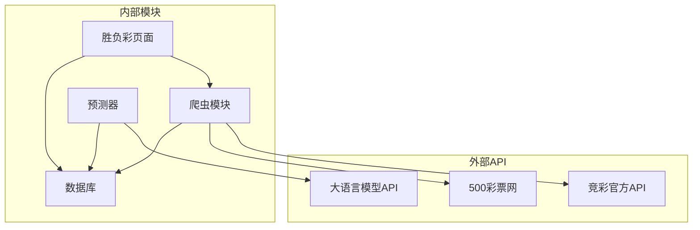

**图表来源**
- [4_ShengFuCai.py:13-16](file://src/pages/4_ShengFuCai.py#L13-L16)
- [predictor.py:27-42](file://src/llm/predictor.py#L27-L42)

### 内部模块依赖

系统内部模块之间的依赖关系体现了清晰的分层架构：

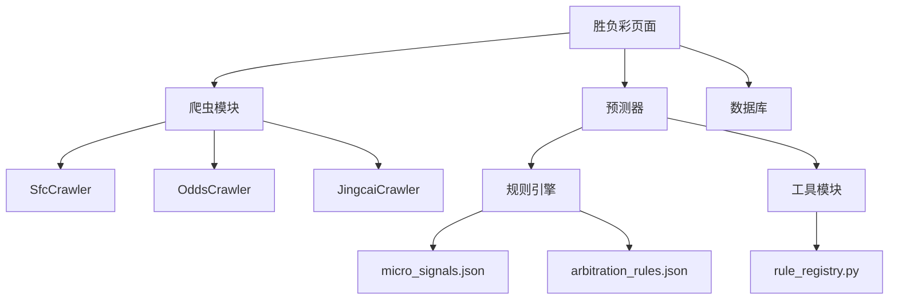

**图表来源**
- [4_ShengFuCai.py:1-288](file://src/pages/4_ShengFuCai.py#L1-L288)
- [predictor.py:1-800](file://src/llm/predictor.py#L1-L800)

**章节来源**
- [4_ShengFuCai.py:1-288](file://src/pages/4_ShengFuCai.py#L1-L288)
- [predictor.py:1-800](file://src/llm/predictor.py#L1-L800)

## 性能考虑

### 缓存策略

系统实现了多层次的缓存机制来提升性能：

1. **页面级缓存**：使用Streamlit的`@st.cache_data`装饰器缓存期号和比赛数据
2. **请求级缓存**：对频繁访问的API接口进行短期缓存
3. **数据库缓存**：对预测结果进行本地缓存以减少重复计算

### 并发处理

系统支持并发处理多个比赛的预测任务：

- **异步爬取**：多个爬虫任务可以并行执行
- **批量预测**：支持批量处理多个比赛的预测请求
- **数据库连接池**：优化数据库访问性能

### 资源优化

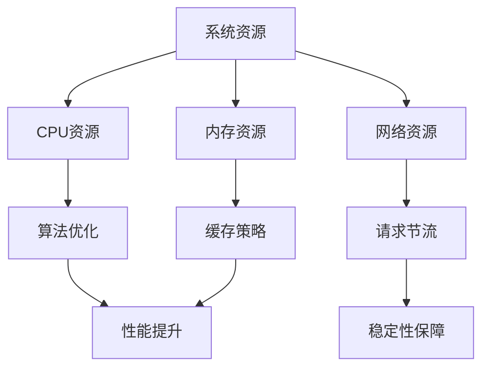

## 故障排除指南

### 常见问题诊断

#### 数据获取失败

当出现数据获取失败时，系统会显示相应的错误信息并提供解决方案：

1. **网络连接问题**：检查代理设置和网络连接
2. **API限流**：等待一段时间后重试
3. **页面结构变更**：更新爬虫解析逻辑

#### 预测结果异常

当预测结果不符合预期时，可以通过以下方式进行排查：

1. **检查规则配置**：确认规则文件是否正确加载
2. **验证数据质量**：检查输入数据的完整性和准确性
3. **调试模式**：启用详细日志输出进行问题定位

#### 性能问题

系统提供了多种性能监控和优化机制：

- **缓存清理**：定期清理过期缓存数据
- **数据库优化**：定期维护数据库索引和统计信息
- **资源监控**：监控系统资源使用情况

**章节来源**
- [4_ShengFuCai.py:168-174](file://src/pages/4_ShengFuCai.py#L168-L174)
- [predictor.py:1-800](file://src/llm/predictor.py#L1-L800)

## 结论

胜负彩页面作为泊松数据模型系统的核心功能模块，成功实现了传统足彩玩法的智能化处理。通过集成先进的AI预测技术和丰富的足彩规则引擎，系统为分析师和玩家提供了专业、可靠、高效的决策支持工具。

系统的主要优势包括：

1. **全面的数据覆盖**：支持多种数据源和玩法的综合分析
2. **智能的风险控制**：内置完善的仲裁规则和风险管理体系
3. **灵活的配置机制**：支持规则的动态调整和优化
4. **优秀的用户体验**：直观的界面设计和流畅的操作体验

未来的发展方向包括进一步优化预测算法、扩展支持的玩法类型、增强个性化定制功能等。通过持续的技术创新和功能完善，胜负彩页面将继续为用户提供更加专业和可靠的足彩分析服务。