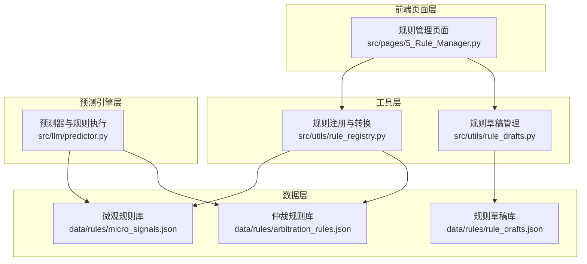
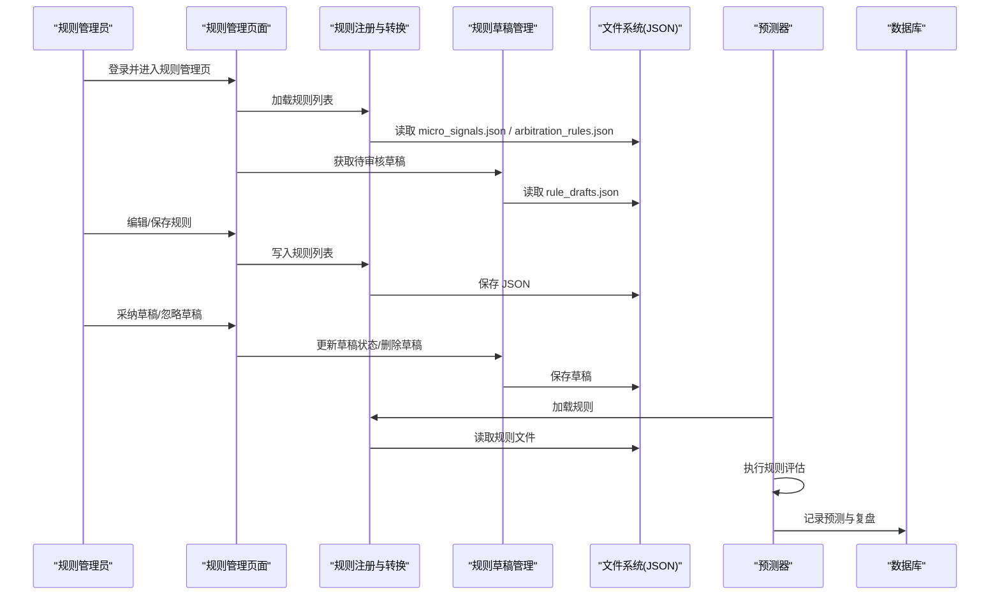
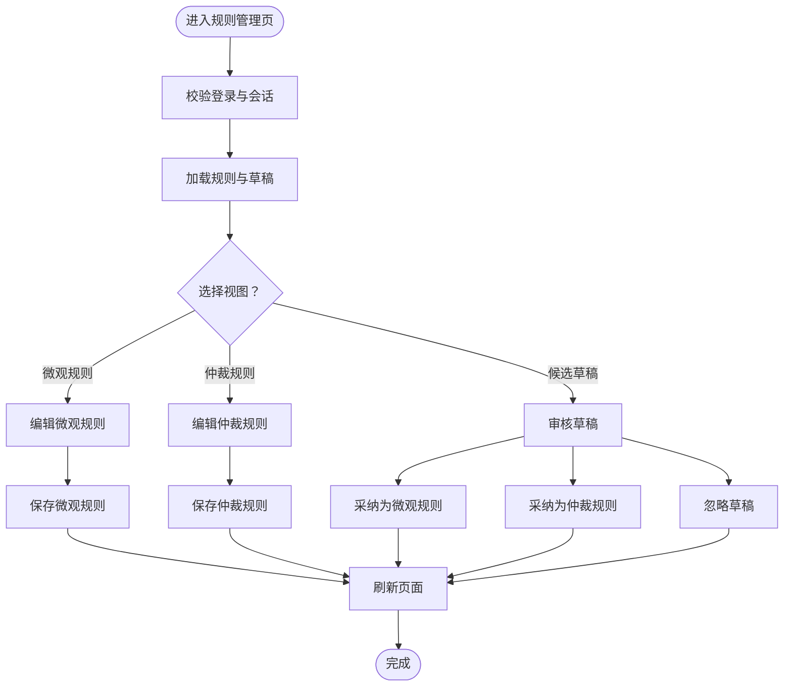
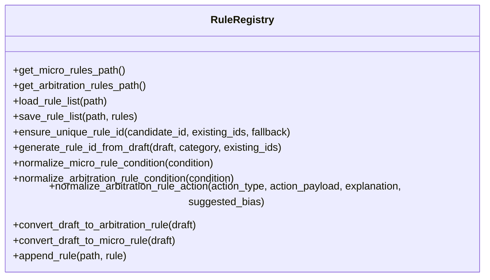
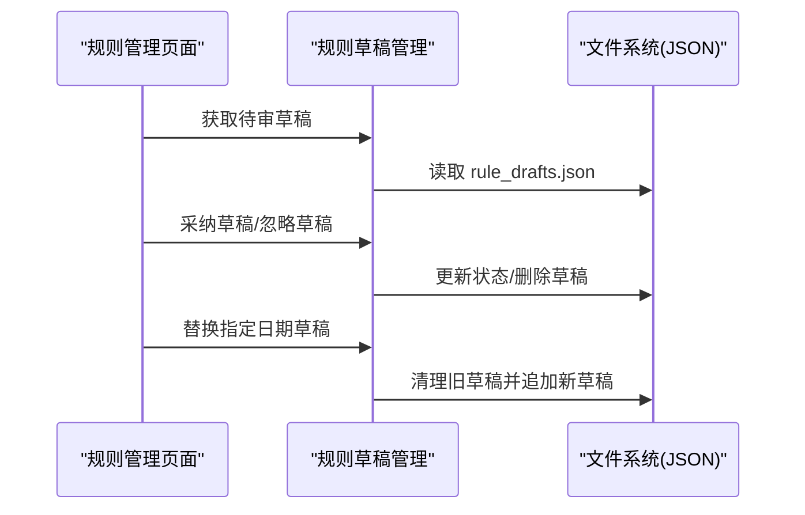
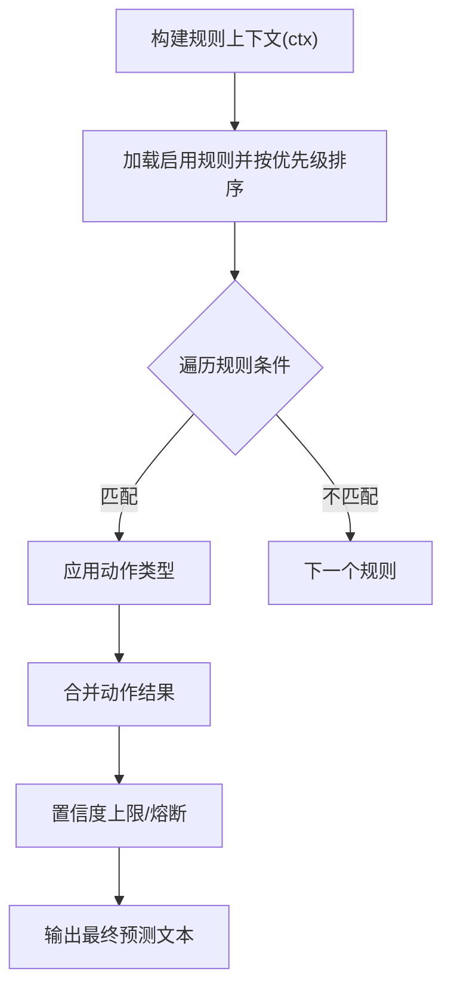
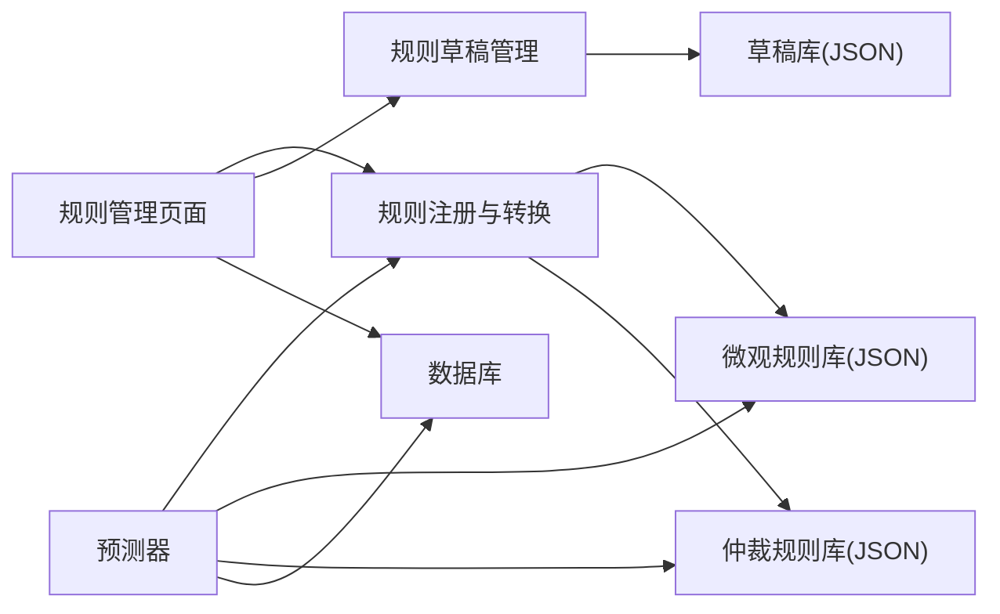

# 规则管理页面

<cite>
**本文档引用的文件**
- [5_Rule_Manager.py](file://src/pages/5_Rule_Manager.py)
- [rule_registry.py](file://src/utils/rule_registry.py)
- [rule_drafts.py](file://src/utils/rule_drafts.py)
- [micro_signals.json](file://data/rules/micro_signals.json)
- [arbitration_rules.json](file://data/rules/arbitration_rules.json)
- [rule_drafts.json](file://data/rules/rule_drafts.json)
- [predictor.py](file://src/llm/predictor.py)
- [constants.py](file://src/constants.py)
- [database.py](file://src/db/database.py)
</cite>

## 目录
1. [简介](#简介)
2. [项目结构](#项目结构)
3. [核心组件](#核心组件)
4. [架构总览](#架构总览)
5. [详细组件分析](#详细组件分析)
6. [依赖关系分析](#依赖关系分析)
7. [性能考量](#性能考量)
8. [故障排查指南](#故障排查指南)
9. [结论](#结论)
10. [附录](#附录)

## 简介
本文件面向规则管理页面的技术文档，聚焦动态规则引擎的管理界面、规则编辑与版本控制功能。文档详细说明规则的创建、修改、删除与发布流程，包括规则草稿的保存与审批机制；涵盖规则测试、验证与部署的完整工作流；提供规则模板设计方案、条件表达式编写与执行逻辑的可视化展示；解释规则与预测模型的集成方式、实时生效机制与回滚策略；并为规则管理员与系统维护人员提供专业的规则管理工具使用指导。

## 项目结构
规则管理页面位于 Streamlit 页面层，规则数据持久化在 data/rules 目录下的 JSON 文件中，规则注册与转换逻辑在 utils 层，预测模型在 llm 层执行规则评估。

图表来源
- [5_Rule_Manager.py:1-678](file://src/pages/5_Rule_Manager.py#L1-L678)
- [rule_registry.py:1-278](file://src/utils/rule_registry.py#L1-L278)
- [rule_drafts.py:1-91](file://src/utils/rule_drafts.py#L1-L91)
- [micro_signals.json:1-977](file://data/rules/micro_signals.json#L1-L977)
- [arbitration_rules.json:1-63](file://data/rules/arbitration_rules.json#L1-L63)
- [rule_drafts.json:1-229](file://data/rules/rule_drafts.json#L1-L229)
- [predictor.py:1400-1599](file://src/llm/predictor.py#L1400-L1599)

章节来源
- [5_Rule_Manager.py:384-678](file://src/pages/5_Rule_Manager.py#L384-L678)
- [rule_registry.py:10-33](file://src/utils/rule_registry.py#L10-L33)
- [rule_drafts.py:6-26](file://src/utils/rule_drafts.py#L6-L26)

## 核心组件
- 规则管理页面：提供微观规则、仲裁规则与候选草稿的统一管理界面，支持筛选、编辑、保存与 AI 自动生成规则。
- 规则注册与转换：负责规则文件的读写、ID 唯一化、条件表达式标准化与草稿转正式规则。
- 规则草稿管理：负责草稿的增删改查、状态变更与替换。
- 规则库：以 JSON 文件形式存储，包含微观规则与仲裁规则，支持启用/禁用与场景化剧本。
- 预测器：在预测阶段加载并执行规则，支持仲裁保护规则的上下文构建与执行。

章节来源
- [5_Rule_Manager.py:94-521](file://src/pages/5_Rule_Manager.py#L94-L521)
- [rule_registry.py:29-71](file://src/utils/rule_registry.py#L29-L71)
- [rule_drafts.py:21-89](file://src/utils/rule_drafts.py#L21-L89)
- [micro_signals.json:1-977](file://data/rules/micro_signals.json#L1-L977)
- [arbitration_rules.json:1-63](file://data/rules/arbitration_rules.json#L1-L63)
- [predictor.py:1401-1473](file://src/llm/predictor.py#L1401-L1473)

## 架构总览
规则管理页面通过工具层与数据层交互，实现规则的可视化编辑与持久化；预测器在运行时加载规则并执行，形成“规则管理—规则持久化—规则执行”的闭环。

图表来源
- [5_Rule_Manager.py:449-521](file://src/pages/5_Rule_Manager.py#L449-L521)
- [rule_registry.py:18-33](file://src/utils/rule_registry.py#L18-L33)
- [rule_drafts.py:63-89](file://src/utils/rule_drafts.py#L63-L89)
- [predictor.py:1401-1473](file://src/llm/predictor.py#L1401-L1473)
- [database.py:200-324](file://src/db/database.py#L200-L324)

## 详细组件分析

### 规则管理页面（页面层）
- 登录鉴权：支持查询参数认证与会话保持，令牌有效期来自常量配置。
- 规则区域切换：微观规则、仲裁规则、候选草稿三视图，支持按盘口剧本筛选。
- 规则编辑：
  - 微观规则：启用/禁用、条件、警告模板、预测偏向、作用类型。
  - 仲裁规则：启用/禁用、条件、动作类型、动作参数、解释模板、优先级。
- AI 自动生成：基于复盘报告生成微观规则配置，支持预览与一键添加。
- 草稿处理：支持采纳为微观/仲裁规则、忽略草稿、基于旧规则优化。

图表来源
- [5_Rule_Manager.py:384-678](file://src/pages/5_Rule_Manager.py#L384-L678)
- [5_Rule_Manager.py:94-521](file://src/pages/5_Rule_Manager.py#L94-L521)

章节来源
- [5_Rule_Manager.py:384-678](file://src/pages/5_Rule_Manager.py#L384-L678)
- [constants.py:3-5](file://src/constants.py#L3-L5)

### 规则注册与转换（工具层）
- 路径管理：提供规则文件路径与读写接口。
- ID 唯一化：根据候选 ID 与现有集合生成唯一规则 ID。
- 条件标准化：
  - 微观规则：将自然语言别名映射为 Python 表达式，规范化布尔关键字与比较语法。
  - 仲裁规则：将条件从 ctx 上下文访问规范化为可执行表达式。
- 草稿转规则：将草稿转换为正式规则，自动填充优先级、动作类型与解释模板。
- 规则追加：确保重复 ID 不覆盖已有规则。

图表来源
- [rule_registry.py:10-278](file://src/utils/rule_registry.py#L10-L278)

章节来源
- [rule_registry.py:18-71](file://src/utils/rule_registry.py#L18-L71)
- [rule_registry.py:102-177](file://src/utils/rule_registry.py#L102-L177)
- [rule_registry.py:221-268](file://src/utils/rule_registry.py#L221-L268)

### 规则草稿管理（工具层）
- 草稿文件路径与读写。
- 批量追加与去重：为每个草稿生成唯一 draft_id 并避免重复。
- 替换指定日期的待审草稿：按日期清理旧草稿并追加新草稿。
- 查询与状态更新：获取待审草稿、更新状态、删除草稿。

图表来源
- [rule_drafts.py:63-89](file://src/utils/rule_drafts.py#L63-L89)
- [rule_drafts.py:48-61](file://src/utils/rule_drafts.py#L48-L61)

章节来源
- [rule_drafts.py:10-89](file://src/utils/rule_drafts.py#L10-L89)

### 规则库（数据层）
- 微观规则库：包含规则 ID、名称、类别、等级、条件、警告模板、预测偏向、作用类型、场景化剧本等字段。
- 仲裁规则库：包含规则 ID、名称、类别、优先级、条件、动作类型、动作参数、解释模板、启用状态等字段。
- 草稿库：包含草稿 ID、标题、目标范围、问题类型、触发条件描述、建议条件、建议动作、优先级、来源比赛、状态等字段。

章节来源
- [micro_signals.json:1-977](file://data/rules/micro_signals.json#L1-L977)
- [arbitration_rules.json:1-63](file://data/rules/arbitration_rules.json#L1-L63)
- [rule_drafts.json:1-229](file://data/rules/rule_drafts.json#L1-L229)

### 预测器中的规则执行（运行时）
- 规则加载：仅读取 enabled 为真且按优先级倒序排序的规则。
- 上下文构建：将盘口、欧赔、联赛等信息封装为 ctx，兼容旧版 asian 直接引用。
- 条件求值：使用安全函数集在受限环境中执行规则条件。
- 动作应用：根据动作类型执行熔断、强制双选、置信度上限、禁止推翻或要求推翻原因等操作，并将结果应用到最终预测文本。

图表来源
- [predictor.py:1401-1473](file://src/llm/predictor.py#L1401-L1473)
- [predictor.py:1476-1499](file://src/llm/predictor.py#L1476-L1499)

章节来源
- [predictor.py:1401-1473](file://src/llm/predictor.py#L1401-L1473)
- [predictor.py:1476-1499](file://src/llm/predictor.py#L1476-L1499)

## 依赖关系分析
- 页面层依赖工具层：规则读写、ID 唯一化、条件标准化、草稿管理。
- 工具层依赖数据层：JSON 文件读写。
- 预测器依赖工具层：规则加载与执行。
- 页面层与预测器共同依赖数据库：预测记录与复盘记录。

图表来源
- [5_Rule_Manager.py:16-26](file://src/pages/5_Rule_Manager.py#L16-L26)
- [rule_registry.py:18-33](file://src/utils/rule_registry.py#L18-L33)
- [rule_drafts.py:21-26](file://src/utils/rule_drafts.py#L21-L26)
- [predictor.py:1401-1473](file://src/llm/predictor.py#L1401-L1473)
- [database.py:200-324](file://src/db/database.py#L200-L324)

章节来源
- [5_Rule_Manager.py:16-26](file://src/pages/5_Rule_Manager.py#L16-L26)
- [rule_registry.py:18-33](file://src/utils/rule_registry.py#L18-L33)
- [rule_drafts.py:21-26](file://src/utils/rule_drafts.py#L21-L26)
- [predictor.py:1401-1473](file://src/llm/predictor.py#L1401-L1473)
- [database.py:200-324](file://src/db/database.py#L200-L324)

## 性能考量
- 规则文件读写：采用一次性读取与写入，避免频繁 IO；保存时进行目录创建与编码处理。
- 条件求值：在受限环境中执行，仅暴露必要内置函数，减少安全风险与执行开销。
- 草稿管理：批量追加与去重，避免重复 ID；替换指定日期草稿时先清理再追加，保证一致性。
- 页面渲染：使用 Streamlit 的 expander 与 columns 布局，提升交互体验与渲染效率。

## 故障排查指南
- 登录失效：检查查询参数 auth 与会话状态，确认令牌有效期与用户角色。
- 规则保存失败：检查规则文件路径与权限，确认 JSON 格式正确；查看工具层异常处理。
- 草稿状态更新失败：确认草稿 ID 存在且状态字段可写；检查文件写入是否成功。
- 规则执行异常：检查条件表达式是否符合上下文访问规范；查看预测器日志输出。
- 数据库操作失败：检查数据库连接与表结构，确认列存在性与事务回滚处理。

章节来源
- [5_Rule_Manager.py:384-421](file://src/pages/5_Rule_Manager.py#L384-L421)
- [rule_registry.py:29-33](file://src/utils/rule_registry.py#L29-L33)
- [rule_drafts.py:68-89](file://src/utils/rule_drafts.py#L68-L89)
- [predictor.py:1435-1437](file://src/llm/predictor.py#L1435-L1437)
- [database.py:219-233](file://src/db/database.py#L219-L233)

## 结论
规则管理页面提供了完整的规则生命周期管理能力，涵盖从草稿生成、审核、采纳到正式发布的全流程。通过工具层的规则注册与转换、草稿管理与数据层的 JSON 持久化，实现了规则的可视化编辑与版本控制。预测器在运行时加载并执行规则，确保规则的实时生效与可审计性。整体架构清晰、职责分离明确，适合规则管理员与系统维护人员高效协作与持续优化。

## 附录
- 使用建议：
  - 在规则编辑前先筛选目标盘口剧本，便于对照历史规则与草稿。
  - 对于复杂条件，优先使用工具层提供的条件标准化功能，减少手写错误。
  - 采纳草稿前先预览生成的规则配置，确认后再保存。
  - 定期审查仲裁规则的动作类型与优先级，确保在高风险场景下能够及时熔断或限制置信度。
- 版本控制与回滚：
  - 通过草稿状态管理与规则 ID 唯一化，实现规则变更的可追踪与可回滚。
  - 在预测记录中保留规则命中与仲裁动作日志，便于事后审计与复盘。