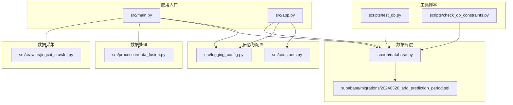
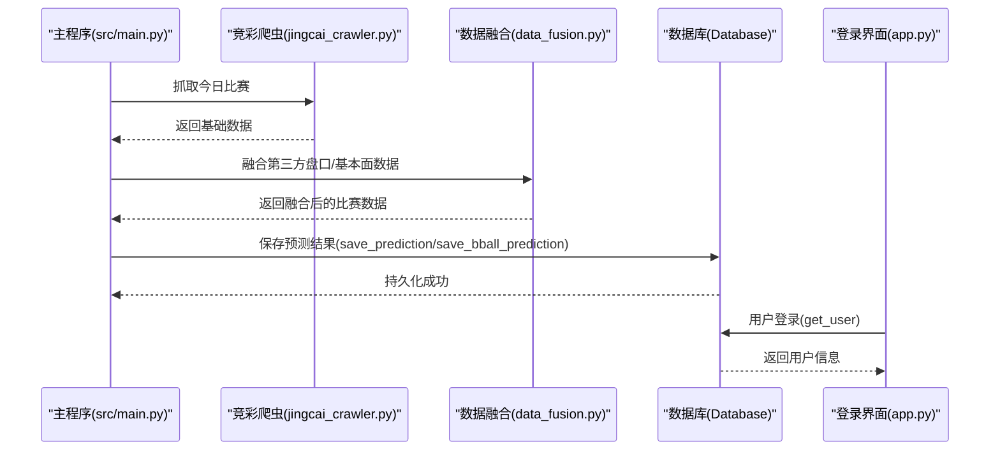
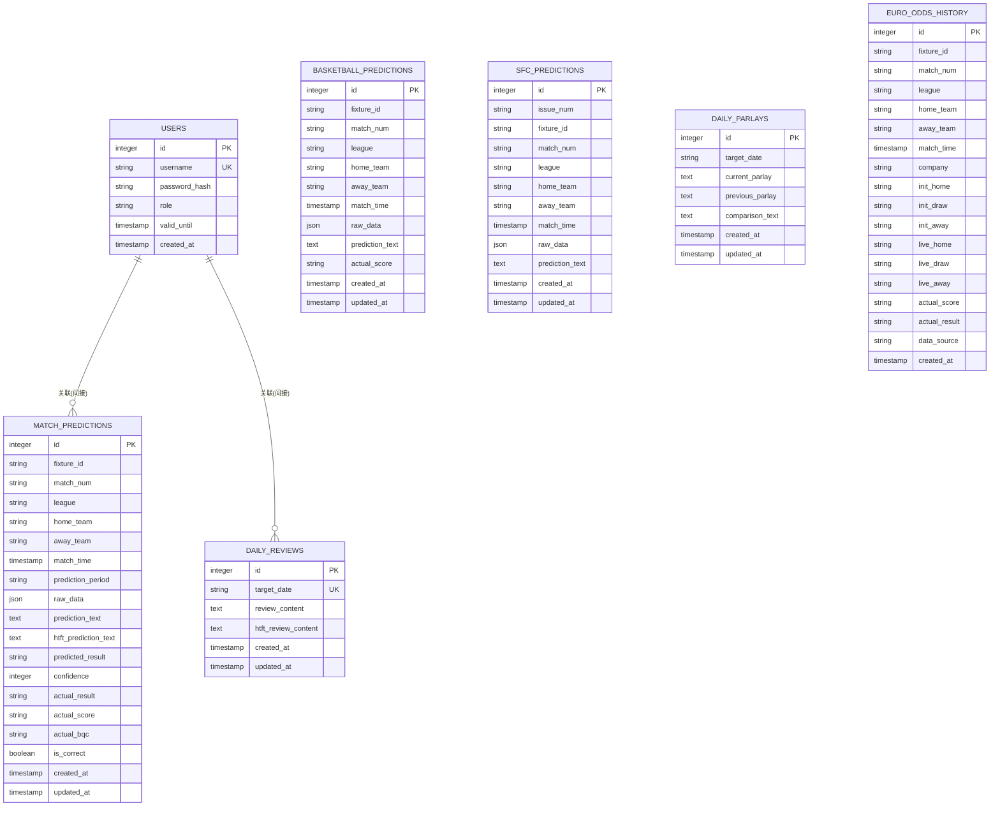
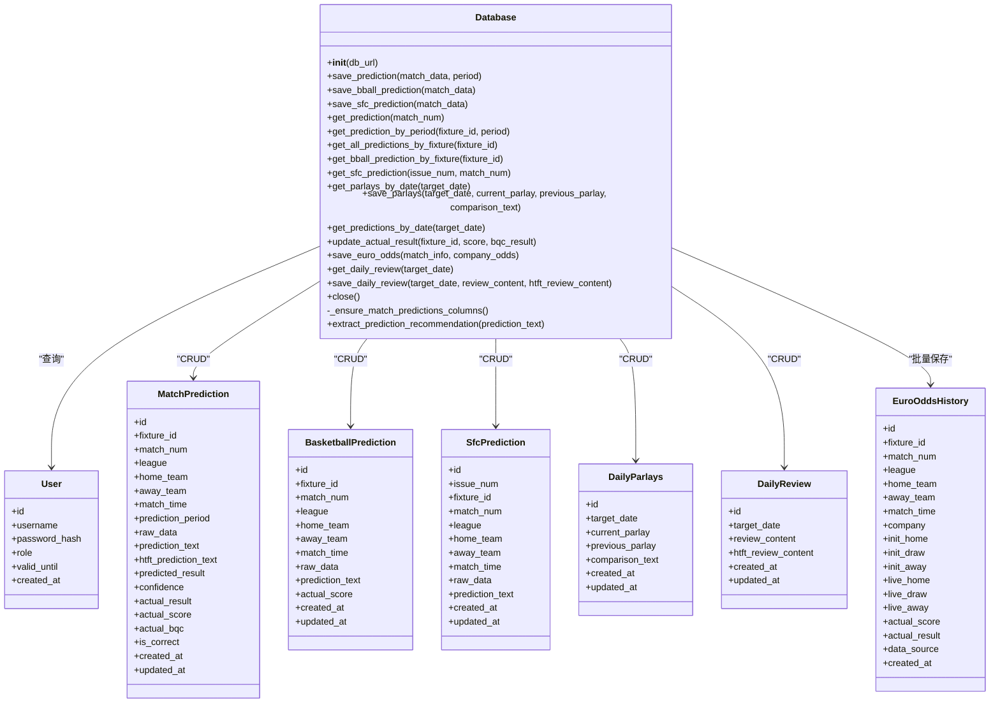
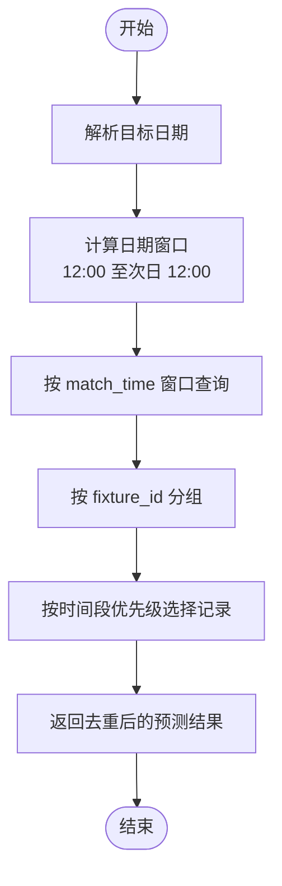
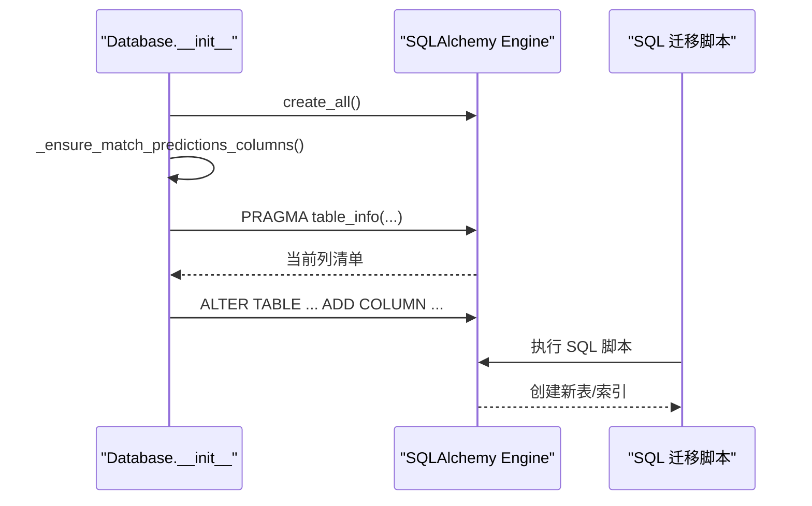
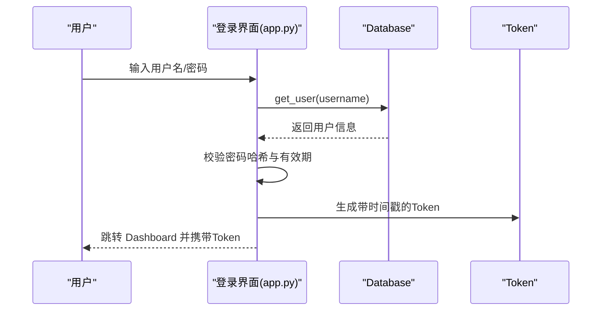
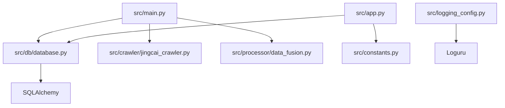

# 存储管理系统

<cite>
**本文档引用的文件**
- [src/db/database.py](file://src/db/database.py)
- [supabase/migrations/20240326_add_prediction_period.sql](file://supabase/migrations/20240326_add_prediction_period.sql)
- [src/main.py](file://src/main.py)
- [src/app.py](file://src/app.py)
- [src/logging_config.py](file://src/logging_config.py)
- [src/constants.py](file://src/constants.py)
- [scripts/test_db.py](file://scripts/test_db.py)
- [scripts/check_db_constraints.py](file://scripts/check_db_constraints.py)
- [src/crawler/jingcai_crawler.py](file://src/crawler/jingcai_crawler.py)
- [src/processor/data_fusion.py](file://src/processor/data_fusion.py)
- [src/utils/rule_registry.py](file://src/utils/rule_registry.py)
</cite>

## 目录
1. [简介](#简介)
2. [项目结构](#项目结构)
3. [核心组件](#核心组件)
4. [架构总览](#架构总览)
5. [详细组件分析](#详细组件分析)
6. [依赖关系分析](#依赖关系分析)
7. [性能考虑](#性能考虑)
8. [故障排除指南](#故障排除指南)
9. [结论](#结论)
10. [附录](#附录)

## 简介
本文件为存储管理系统的综合技术文档，面向数据库管理员与后端开发者，全面阐述数据库设计、ORM模型定义、数据访问层实现、表结构与索引策略、查询优化方案、数据迁移与版本管理、备份恢复策略、缓存策略、性能监控与容量规划、数据安全与权限控制、审计日志等主题。系统采用 SQLite 作为本地存储，结合 SQLAlchemy ORM 进行对象映射与数据持久化，配合多源数据采集与融合流程，形成从数据采集到预测存储的完整链路。

## 项目结构
项目采用功能模块化组织，核心存储相关代码集中在 src/db/database.py，配合脚本工具进行数据库约束检查与测试。主要模块包括：
- 数据库层：ORM 模型与数据访问方法
- 数据采集层：竞彩、欧赔、雷速等爬虫模块
- 数据处理层：数据融合与特征增强
- 应用入口：主流程调度与 Streamlit 登录界面
- 工具脚本：数据库约束检查与测试

**图表来源**
- [src/main.py:1-183](file://src/main.py#L1-L183)
- [src/app.py:1-166](file://src/app.py#L1-L166)
- [src/db/database.py:1-567](file://src/db/database.py#L1-L567)
- [supabase/migrations/20240326_add_prediction_period.sql:1-51](file://supabase/migrations/20240326_add_prediction_period.sql#L1-L51)
- [scripts/test_db.py:1-9](file://scripts/test_db.py#L1-L9)
- [scripts/check_db_constraints.py:1-49](file://scripts/check_db_constraints.py#L1-L49)
- [src/logging_config.py:1-30](file://src/logging_config.py#L1-L30)
- [src/constants.py:1-5](file://src/constants.py#L1-L5)

**章节来源**
- [src/main.py:1-183](file://src/main.py#L1-L183)
- [src/app.py:1-166](file://src/app.py#L1-L166)
- [src/db/database.py:1-567](file://src/db/database.py#L1-L567)

## 核心组件
本系统的核心存储组件围绕以下 ORM 模型展开：
- 用户表：用户认证与权限控制
- 足球预测表：支持多时间段（pre_24h、pre_12h、final、repredicted）的预测记录
- 篮球预测表：篮球比赛预测
- 胜负彩预测表：竞彩胜负彩预测
- 每日串关方案表：每日生成的串关策略
- 每日复盘表：每日复盘总结
- 欧赔历史表：欧赔初赔与临赔历史
- 数据库类：封装连接、迁移、CRUD、查询与辅助方法

关键字段与约束：
- 多表包含索引字段（如 fixture_id、match_num、target_date 等），用于加速查询
- match_predictions 表通过 prediction_period 支持同一场比赛在不同时间段的多条记录
- SQLite 本地数据库，首次运行自动创建表结构；通过运行时列补丁保证向后兼容

**章节来源**
- [src/db/database.py:58-198](file://src/db/database.py#L58-L198)
- [supabase/migrations/20240326_add_prediction_period.sql:1-51](file://supabase/migrations/20240326_add_prediction_period.sql#L1-L51)

## 架构总览
系统整体数据流从竞彩数据抓取开始，经过第三方数据融合与特征增强，调用大模型生成预测，最终将预测结果持久化到 SQLite。登录鉴权通过 Token 机制实现，日志统一由 Loguru 管理。

**图表来源**
- [src/main.py:34-135](file://src/main.py#L34-L135)
- [src/crawler/jingcai_crawler.py:13-47](file://src/crawler/jingcai_crawler.py#L13-L47)
- [src/processor/data_fusion.py:61-107](file://src/processor/data_fusion.py#L61-L107)
- [src/db/database.py:256-304](file://src/db/database.py#L256-L304)
- [src/app.py:94-108](file://src/app.py#L94-L108)

## 详细组件分析

### 数据库模型与表结构
- 用户表(users)：用户名唯一、角色区分、有效期控制
- 足球预测表(match_predictions)：支持多时间段记录，包含原始数据JSON、预测文本、竞彩推荐、实际结果等
- 篮球预测表(basketball_predictions)：篮球预测专用
- 胜负彩预测表(sfc_predictions)：按期号与场次组合唯一
- 每日串关方案表(daily_parlays)：按日期唯一
- 每日复盘表(daily_reviews)：按日期唯一
- 欧赔历史表(euro_odds_history)：记录博彩公司初赔与临赔变化

**图表来源**
- [src/db/database.py:58-198](file://src/db/database.py#L58-L198)

**章节来源**
- [src/db/database.py:58-198](file://src/db/database.py#L58-L198)

### 数据访问层实现
- 连接与初始化：自动创建 SQLite 数据库与表，确保目录存在
- 运行时列补丁：为 match_predictions 表补齐 predicted_result 列
- 保存与更新：save_prediction/save_bball_prediction/save_sfc_prediction 等方法支持新增与更新
- 查询接口：按比赛编号、时间段、日期窗口等维度查询
- 辅助方法：提取竞彩推荐、解析比赛时间、解析实际结果

**图表来源**
- [src/db/database.py:200-562](file://src/db/database.py#L200-L562)

**章节来源**
- [src/db/database.py:200-562](file://src/db/database.py#L200-L562)

### 查询流程与优化策略
- 日期窗口查询：按目标日期 12:00 至次日 12:00 的时间窗口筛选比赛
- 同一 fixture_id 的多时间段优先级：repredicted > final > pre_12h > pre_24h
- 索引策略：为 fixture_id、prediction_period、(fixture_id, prediction_period) 等建立索引，提升查询效率
- JSON 字段：raw_data 采用 JSON 存储，便于扩展但查询时需注意性能

**图表来源**
- [src/db/database.py:451-478](file://src/db/database.py#L451-L478)

**章节来源**
- [src/db/database.py:451-478](file://src/db/database.py#L451-L478)

### 数据迁移与版本管理
- 运行时列补丁：在初始化时检测并添加 predicted_result 列，避免破坏现有数据
- SQL 迁移：通过 supabase/migrations/20240326_add_prediction_period.sql 为 match_predictions 表添加 prediction_period 列并重建索引
- 向后兼容：通过运行时检查与 SQL 迁移共同保障新旧版本共存

**图表来源**
- [src/db/database.py:219-233](file://src/db/database.py#L219-L233)
- [supabase/migrations/20240326_add_prediction_period.sql:1-51](file://supabase/migrations/20240326_add_prediction_period.sql#L1-L51)

**章节来源**
- [src/db/database.py:219-233](file://src/db/database.py#L219-L233)
- [supabase/migrations/20240326_add_prediction_period.sql:1-51](file://supabase/migrations/20240326_add_prediction_period.sql#L1-L51)

### 缓存策略与性能监控
- 本地 JSON 缓存：主流程将融合后的数据写入 data/today_matches.json 与 data/today_bball_matches.json，减少重复抓取
- 日志监控：Loguru 统一日志输出，支持终端与文件轮转（1天，保留7天）
- 性能建议：
  - 为高频查询字段建立索引（fixture_id、target_date、prediction_period）
  - 对 JSON 字段的复杂查询进行限制，必要时拆分结构化字段
  - 批量插入欧赔历史数据时使用事务提交

**章节来源**
- [src/main.py:102-109](file://src/main.py#L102-L109)
- [src/logging_config.py:8-29](file://src/logging_config.py#L8-L29)

### 数据安全与权限控制
- 登录鉴权：Token 机制，包含用户名与时间戳，支持 TTL 校验与有效期控制
- 密码存储：SHA-256 哈希存储，结合有效期内校验
- 角色控制：用户角色区分（admin/editor/vip），可用于前端页面与功能权限控制

**图表来源**
- [src/app.py:94-108](file://src/app.py#L94-L108)
- [src/constants.py:3-4](file://src/constants.py#L3-L4)

**章节来源**
- [src/app.py:94-108](file://src/app.py#L94-L108)
- [src/constants.py:3-4](file://src/constants.py#L3-L4)

### 审计日志与备份恢复
- 审计日志：通过 Loguru 记录 INFO 级别及以上日志，便于追踪业务流程与异常
- 备份恢复：SQLite 为单文件数据库，可通过复制 data/football.db 实现备份；恢复时替换数据库文件即可

**章节来源**
- [src/logging_config.py:8-29](file://src/logging_config.py#L8-L29)

## 依赖关系分析
- 组件耦合：Database 类集中封装数据库操作，其他模块通过其提供的方法进行数据交互
- 外部依赖：SQLAlchemy、requests、BeautifulSoup、Loguru、OpenAI SDK 等
- 循环依赖：未发现循环导入，模块间通过函数调用解耦

**图表来源**
- [src/db/database.py:1-8](file://src/db/database.py#L1-L8)
- [src/main.py:25-32](file://src/main.py#L25-L32)
- [src/app.py:29-30](file://src/app.py#L29-L30)
- [src/logging_config.py:3](file://src/logging_config.py#L3)

**章节来源**
- [src/db/database.py:1-8](file://src/db/database.py#L1-L8)
- [src/main.py:25-32](file://src/main.py#L25-L32)
- [src/app.py:29-30](file://src/app.py#L29-L30)

## 性能考虑
- 索引优化：为高频过滤字段建立索引，减少全表扫描
- 查询优化：日期窗口查询与优先级去重逻辑已在服务端实现，避免客户端重复处理
- I/O 优化：本地 JSON 缓存减少网络请求，SQLite 写入使用事务批量提交
- 监控与告警：通过日志系统记录关键操作耗时与异常，便于定位性能瓶颈

## 故障排除指南
- 数据库约束检查：使用 scripts/check_db_constraints.py 检查表结构、索引与约束
- 数据库测试：使用 scripts/test_db.py 查看日期范围与匹配记录
- 常见问题：
  - 无法连接数据库：确认 data/football.db 路径与权限
  - 预测数据缺失：检查 save_prediction/save_bball_prediction 是否正确调用
  - 登录失败：核对用户名、密码哈希与有效期内校验

**章节来源**
- [scripts/check_db_constraints.py:1-49](file://scripts/check_db_constraints.py#L1-L49)
- [scripts/test_db.py:1-9](file://scripts/test_db.py#L1-L9)

## 结论
该存储管理系统以 SQLite 为基础，结合 SQLAlchemy ORM 实现了清晰的模型定义与数据访问层，配合多源数据采集与融合流程，形成了从数据到预测再到持久化的完整闭环。通过索引策略、运行时迁移与 SQL 脚本、本地缓存与统一日志等手段，系统在易用性与可维护性方面具备良好表现。建议在生产环境中进一步引入连接池、定期备份与监控告警机制，以提升稳定性与可观测性。

## 附录
- 关键实现路径参考：
  - [数据库初始化与表创建:200-217](file://src/db/database.py#L200-L217)
  - [预测保存与更新:256-304](file://src/db/database.py#L256-L304)
  - [日期窗口查询与优先级去重:451-478](file://src/db/database.py#L451-L478)
  - [欧赔历史批量保存:502-539](file://src/db/database.py#L502-L539)
  - [登录鉴权与 Token 校验:94-108](file://src/app.py#L94-L108)
  - [日志配置与轮转:8-29](file://src/logging_config.py#L8-L29)