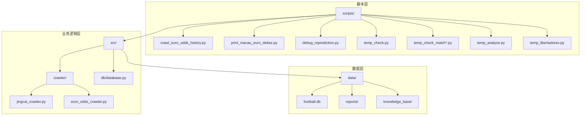
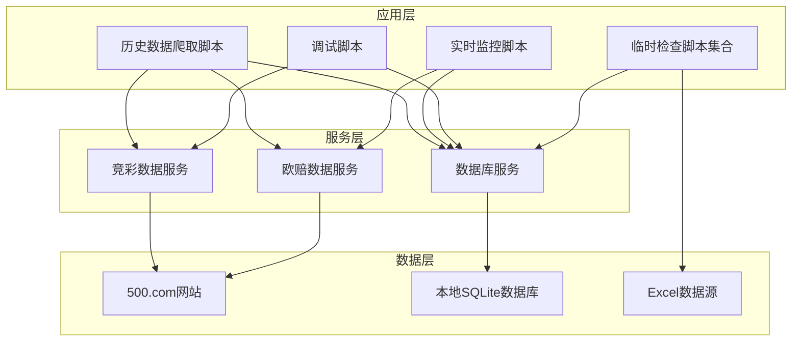
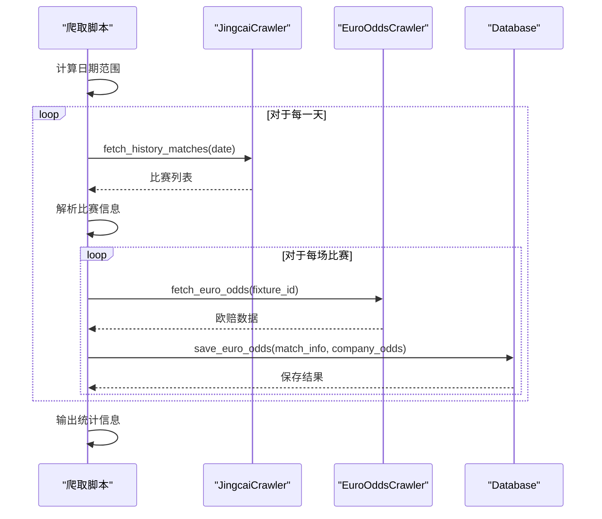
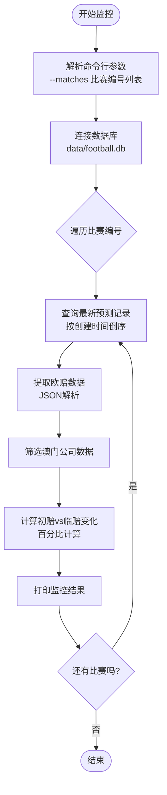
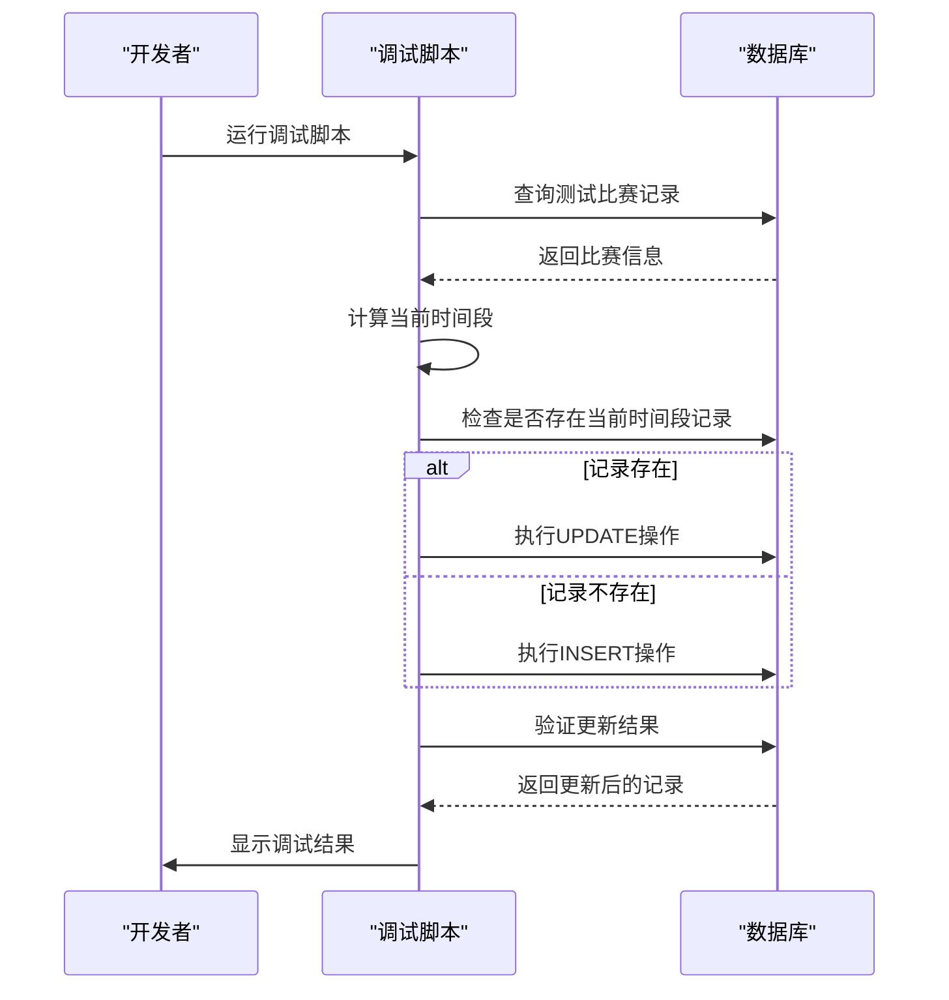
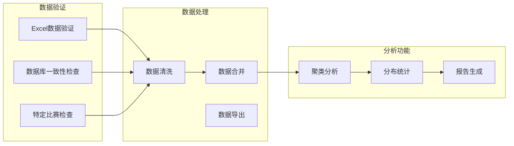
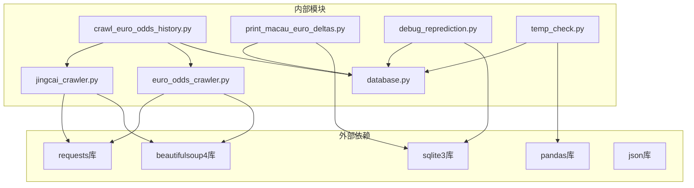
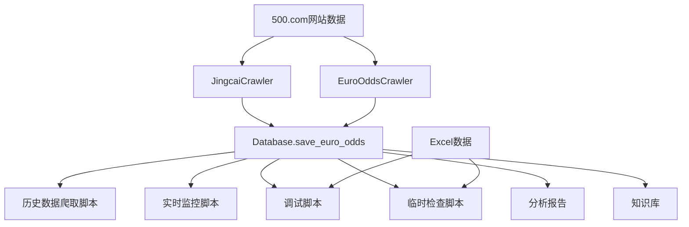
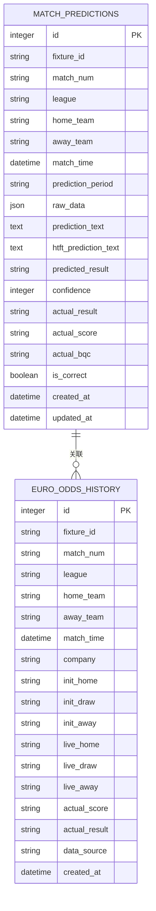

# 实用辅助脚本

<cite>
**本文档引用的文件**
- [crawl_euro_odds_history.py](file://scripts/crawl_euro_odds_history.py)
- [print_macau_euro_deltas.py](file://scripts/print_macau_euro_deltas.py)
- [debug_reprediction.py](file://scripts/debug_reprediction.py)
- [temp_check.py](file://scripts/temp_check.py)
- [temp_check_match.py](file://scripts/temp_check_match.py)
- [temp_check_match2.py](file://scripts/temp_check_match2.py)
- [temp_check_match3.py](file://scripts/temp_check_match3.py)
- [temp_check_match4.py](file://scripts/temp_check_match4.py)
- [temp_analyze.py](file://scripts/temp_analyze.py)
- [temp_libertadores.py](file://scripts/temp_libertadores.py)
- [database.py](file://src/db/database.py)
- [euro_odds_crawler.py](file://src/crawler/euro_odds_crawler.py)
- [jingcai_crawler.py](file://src/crawler/jingcai_crawler.py)
</cite>

## 目录
1. [简介](#简介)
2. [项目结构](#项目结构)
3. [核心组件](#核心组件)
4. [架构概览](#架构概览)
5. [详细组件分析](#详细组件分析)
6. [依赖分析](#依赖分析)
7. [性能考虑](#性能考虑)
8. [故障排除指南](#故障排除指南)
9. [结论](#结论)
10. [附录](#附录)

## 简介

本文件系统性地介绍了足球预测项目中的实用辅助脚本，涵盖四个主要类别：

- **欧洲赔率历史爬取脚本**：从500.com批量拉取历史比赛的欧洲赔率数据，包括初赔和临赔，存储到数据库中用于赔率变化规律分析。
- **澳门欧赔差值打印脚本**：实时监控特定比赛的澳门公司欧赔数据，计算初赔与临赔的变动幅度，提供异常检测和通知功能。
- **重新预测调试脚本**：模拟重新预测过程，帮助定位错误、调整参数并验证结果，支持多时间段预测记录的管理。
- **临时检查脚本**：提供快速验证、数据核对和问题诊断功能，包括Excel数据与数据库的匹配验证、特殊比赛场景的检查等。

这些脚本通过统一的数据库接口和爬虫模块，实现了数据获取、存储、分析和验证的完整闭环，为模型训练和业务决策提供了可靠的数据支撑。

## 项目结构

项目采用模块化设计，辅助脚本位于`scripts/`目录，核心业务逻辑分布在`src/`目录下的各个模块中。关键目录结构如下：



**图表来源**
- [crawl_euro_odds_history.py:1-118](file://scripts/crawl_euro_odds_history.py#L1-L118)
- [print_macau_euro_deltas.py:1-74](file://scripts/print_macau_euro_deltas.py#L1-L74)
- [debug_reprediction.py:1-118](file://scripts/debug_reprediction.py#L1-L118)
- [temp_check.py:1-68](file://scripts/temp_check.py#L1-L68)
- [database.py:1-567](file://src/db/database.py#L1-L567)

**章节来源**
- [crawl_euro_odds_history.py:1-118](file://scripts/crawl_euro_odds_history.py#L1-L118)
- [print_macau_euro_deltas.py:1-74](file://scripts/print_macau_euro_deltas.py#L1-L74)
- [debug_reprediction.py:1-118](file://scripts/debug_reprediction.py#L1-L118)
- [temp_check.py:1-68](file://scripts/temp_check.py#L1-L68)
- [database.py:1-567](file://src/db/database.py#L1-L567)

## 核心组件

### 数据库接口模块
数据库模块提供了统一的SQLite访问接口，支持多种预测类型的数据存储和查询：
- **MatchPrediction模型**：存储比赛预测信息，支持多时间段记录（pre_24h、pre_12h、final）
- **EuroOddsHistory模型**：专门存储欧洲赔率历史数据，支持初赔vs临赔的对比分析
- **批量操作**：提供save_euro_odds等批量数据插入功能

### 爬虫模块
爬虫模块负责从500.com网站抓取竞彩和欧赔数据：
- **JingcaiCrawler**：抓取竞彩赛事数据，包含胜平负和半全场赔率
- **EuroOddsCrawler**：抓取欧洲赔率初赔和临赔数据，支持重试和限流控制

### 辅助脚本模块
辅助脚本模块包含多个实用工具，每个脚本都有明确的功能定位：
- **历史数据爬取**：批量获取历史比赛数据
- **实时监控**：监控特定比赛的赔率变化
- **调试工具**：模拟预测流程，定位问题
- **数据验证**：验证Excel数据与数据库的一致性

**章节来源**
- [database.py:68-198](file://src/db/database.py#L68-L198)
- [jingcai_crawler.py:6-330](file://src/crawler/jingcai_crawler.py#L6-L330)
- [euro_odds_crawler.py:8-118](file://src/crawler/euro_odds_crawler.py#L8-L118)

## 架构概览

整个辅助脚本系统采用分层架构设计，各层职责清晰，耦合度低：



**图表来源**
- [crawl_euro_odds_history.py:43-117](file://scripts/crawl_euro_odds_history.py#L43-L117)
- [print_macau_euro_deltas.py:27-73](file://scripts/print_macau_euro_deltas.py#L27-L73)
- [debug_reprediction.py:15-117](file://scripts/debug_reprediction.py#L15-L117)
- [temp_check.py:4-67](file://scripts/temp_check.py#L4-L67)

系统的核心优势在于：
- **模块化设计**：每个脚本专注于特定任务，便于维护和扩展
- **统一接口**：通过数据库模块提供统一的数据访问接口
- **容错机制**：爬虫模块内置重试和限流机制，提高稳定性
- **数据一致性**：通过标准化的数据格式确保跨模块数据一致性

## 详细组件分析

### 欧洲赔率历史爬取脚本

#### 数据获取策略
该脚本采用分步获取策略，确保数据的完整性和准确性：



**图表来源**
- [crawl_euro_odds_history.py:43-117](file://scripts/crawl_euro_odds_history.py#L43-L117)
- [jingcai_crawler.py:233-323](file://src/crawler/jingcai_crawler.py#L233-L323)
- [euro_odds_crawler.py:17-111](file://src/crawler/euro_odds_crawler.py#L17-L111)

#### 存储格式
历史数据采用标准化的存储格式，确保后续分析的便利性：

| 字段名 | 类型 | 描述 | 示例 |
|--------|------|------|------|
| fixture_id | String | 比赛唯一标识 | "1337828" |
| match_num | String | 比赛编号 | "周一001" |
| league | String | 联赛名称 | "英超" |
| home_team | String | 主队名称 | "曼城" |
| away_team | String | 客队名称 | "利物浦" |
| match_time | DateTime | 比赛时间 | "2024-01-15 15:00:00" |
| company | String | 博彩公司 | "澳门" |
| init_home | String | 初赔主胜 | "2.10" |
| init_draw | String | 初赔平局 | "3.25" |
| init_away | String | 初赔客胜 | "3.40" |
| live_home | String | 临赔主胜 | "2.05" |
| live_draw | String | 临赔平局 | "3.30" |
| live_away | String | 临赔客胜 | "3.50" |
| actual_score | String | 实际比分 | "2:1" |
| actual_result | String | 实际结果 | "胜" |

#### 更新机制
脚本支持增量更新和全量更新两种模式：
- **增量更新**：每天自动获取最新数据，避免重复爬取
- **全量更新**：可指定天数范围进行批量爬取
- **数据校验**：自动过滤无效数据，确保数据质量

**章节来源**
- [crawl_euro_odds_history.py:18-117](file://scripts/crawl_euro_odds_history.py#L18-L117)
- [database.py:502-539](file://src/db/database.py#L502-L539)

### 澳门欧赔差值打印脚本

#### 实时监控功能
该脚本提供实时监控特定比赛的澳门公司欧赔数据变化：



**图表来源**
- [print_macau_euro_deltas.py:27-73](file://scripts/print_macau_euro_deltas.py#L27-L73)

#### 异常检测机制
脚本内置多重异常检测和容错机制：
- **数据完整性检查**：验证初赔和临赔数据的有效性
- **数值转换保护**：安全处理非数值数据
- **数据库连接异常**：优雅处理数据库连接失败
- **比赛编号验证**：确保查询到有效的比赛记录

#### 通知功能
虽然当前版本主要提供控制台输出，但可以轻松扩展为：
- **邮件通知**：当赔率变化超过阈值时发送邮件
- **微信通知**：集成企业微信或个人微信推送
- **Slack通知**：在团队协作平台中发送提醒
- **声音提示**：播放特定音效提醒重要变化

**章节来源**
- [print_macau_euro_deltas.py:7-73](file://scripts/print_macau_euro_deltas.py#L7-L73)

### 重新预测调试脚本

#### 错误定位流程
调试脚本提供完整的错误定位和修复流程：



**图表来源**
- [debug_reprediction.py:15-117](file://scripts/debug_reprediction.py#L15-L117)

#### 参数调整机制
脚本支持动态参数调整，便于测试不同的预测策略：
- **时间段判断**：根据比赛剩余时间自动选择预测时间段
- **预测内容**：可自定义预测文本内容进行测试
- **时间戳处理**：精确处理比赛时间和当前时间的差异

#### 结果验证流程
调试脚本提供多层次的结果验证：
- **数据完整性验证**：检查所有必要字段是否正确保存
- **时间线验证**：确保预测记录的时间顺序正确
- **重复记录检查**：避免同一时间段出现重复记录
- **数据库一致性验证**：确保所有相关表的数据一致性

**章节来源**
- [debug_reprediction.py:15-117](file://scripts/debug_reprediction.py#L15-L117)

### 临时检查脚本集合

#### 快速验证功能
临时检查脚本提供多种快速验证能力：



**图表来源**
- [temp_check.py:4-67](file://scripts/temp_check.py#L4-L67)
- [temp_analyze.py:5-256](file://scripts/temp_analyze.py#L5-L256)

#### 数据核对机制
脚本提供全面的数据核对功能：
- **Excel与数据库匹配**：验证Excel中的比赛数据在数据库中的对应关系
- **缺失数据检测**：识别并报告缺失的关键字段
- **数据类型验证**：确保数据类型符合预期
- **重复数据处理**：自动去除重复记录

#### 问题诊断功能
临时检查脚本具备强大的问题诊断能力：
- **特殊比赛场景**：针对特定联赛（如解放者杯）的专门检查
- **赔率数据验证**：检查亚洲盘口和欧赔数据的完整性
- **预测数据分析**：分析预测结果的质量和一致性
- **历史数据分析**：支持历史数据的批量分析和报告生成

**章节来源**
- [temp_check.py:4-67](file://scripts/temp_check.py#L4-L67)
- [temp_check_match.py:5-25](file://scripts/temp_check_match.py#L5-L25)
- [temp_check_match2.py:5-12](file://scripts/temp_check_match2.py#L5-L12)
- [temp_check_match3.py:7-25](file://scripts/temp_check_match3.py#L7-L25)
- [temp_check_match4.py:6-12](file://scripts/temp_check_match4.py#L6-L12)
- [temp_libertadores.py:4-10](file://scripts/temp_libertadores.py#L4-L10)
- [temp_analyze.py:5-256](file://scripts/temp_analyze.py#L5-L256)

## 依赖分析

### 组件间依赖关系



**图表来源**
- [crawl_euro_odds_history.py:5-15](file://scripts/crawl_euro_odds_history.py#L5-L15)
- [print_macau_euro_deltas.py:1-5](file://scripts/print_macau_euro_deltas.py#L1-L5)
- [debug_reprediction.py:1-7](file://scripts/debug_reprediction.py#L1-L7)
- [temp_check.py:1-2](file://scripts/temp_check.py#L1-L2)
- [jingcai_crawler.py:1-5](file://src/crawler/jingcai_crawler.py#L1-L5)
- [euro_odds_crawler.py:1-6](file://src/crawler/euro_odds_crawler.py#L1-L6)

### 数据流依赖

脚本之间的数据流关系体现了系统的层次化设计：



**图表来源**
- [crawl_euro_odds_history.py:43-117](file://scripts/crawl_euro_odds_history.py#L43-L117)
- [print_macau_euro_deltas.py:27-73](file://scripts/print_macau_euro_deltas.py#L27-L73)
- [debug_reprediction.py:15-117](file://scripts/debug_reprediction.py#L15-L117)
- [temp_check.py:4-67](file://scripts/temp_check.py#L4-L67)

**章节来源**
- [crawl_euro_odds_history.py:5-15](file://scripts/crawl_euro_odds_history.py#L5-L15)
- [print_macau_euro_deltas.py:1-5](file://scripts/print_macau_euro_deltas.py#L1-L5)
- [debug_reprediction.py:1-7](file://scripts/debug_reprediction.py#L1-L7)
- [temp_check.py:1-2](file://scripts/temp_check.py#L1-L2)

## 性能考虑

### 网络请求优化
- **限流控制**：历史数据爬取脚本在每次请求间添加0.5秒延迟，避免触发网站限流
- **重试机制**：爬虫模块内置指数退避重试，最多重试3次，总等待时间不超过12秒
- **超时设置**：所有网络请求设置15秒超时，确保脚本不会长时间阻塞

### 数据库性能
- **批量操作**：历史数据爬取采用批量插入，减少数据库往返次数
- **索引优化**：数据库表建立适当的索引（如fixture_id、match_time等）
- **连接池**：数据库模块使用连接池管理，提高并发性能

### 内存管理
- **分批处理**：临时检查脚本使用分批处理大数据集，避免内存溢出
- **惰性加载**：Excel数据采用惰性加载，只在需要时读取特定工作表
- **及时释放**：脚本执行完成后及时释放数据库连接和文件句柄

### 并发处理
- **异步爬取**：未来可考虑引入异步爬取提高效率
- **多进程**：对于大量独立的检查任务，可考虑多进程并行处理
- **缓存机制**：实现数据缓存，避免重复查询相同数据

## 故障排除指南

### 常见问题及解决方案

#### 网络连接问题
**问题症状**：爬虫脚本频繁报错，无法获取数据
**可能原因**：
- 网络不稳定或防火墙拦截
- 500.com网站临时不可用
- IP被网站限制访问

**解决步骤**：
1. 检查网络连接状态
2. 尝试手动访问500.com网站确认可用性
3. 增加重试次数和等待时间
4. 考虑使用代理IP

#### 数据解析错误
**问题症状**：脚本在解析网页数据时抛出异常
**可能原因**：
- 网站HTML结构发生变化
- 数据格式不符合预期
- 编码问题导致解析失败

**解决步骤**：
1. 检查网页源代码结构变化
2. 更新解析规则以适应新的HTML结构
3. 添加更健壮的数据验证和异常处理
4. 实施降级策略处理部分数据缺失

#### 数据库连接问题
**问题症状**：脚本无法连接到SQLite数据库
**可能原因**：
- 数据库文件路径错误
- 文件权限不足
- 数据库文件损坏

**解决步骤**：
1. 验证数据库文件路径是否正确
2. 检查文件权限设置
3. 使用SQLite工具检查数据库完整性
4. 备份并重建数据库文件

#### 数据不一致问题
**问题症状**：Excel数据与数据库中的数据不匹配
**可能原因**：
- 数据导入时出现错误
- 数据格式转换问题
- 缺失数据未正确处理

**解决步骤**：
1. 使用临时检查脚本验证数据一致性
2. 检查数据转换逻辑
3. 实施数据验证规则
4. 建立数据质量监控机制

**章节来源**
- [crawl_euro_odds_history.py:18-22](file://scripts/crawl_euro_odds_history.py#L18-L22)
- [euro_odds_crawler.py:28-46](file://src/crawler/euro_odds_crawler.py#L28-L46)
- [database.py:219-232](file://src/db/database.py#L219-L232)

## 结论

本实用辅助脚本系统为足球预测项目提供了完整的数据支撑和质量保障：

### 主要成就
- **数据完整性**：通过历史数据爬取脚本建立了完整的赔率历史数据库
- **实时监控**：通过澳门欧赔差值打印脚本实现了关键数据的实时监控
- **调试能力**：通过重新预测调试脚本提供了强大的问题定位和修复能力
- **数据验证**：通过临时检查脚本集合实现了全面的数据质量保证

### 技术特色
- **模块化设计**：每个脚本职责明确，便于维护和扩展
- **容错机制**：内置多重异常处理和重试机制
- **标准化接口**：统一的数据库访问接口确保数据一致性
- **可扩展性**：架构设计支持功能扩展和性能优化

### 未来改进方向
- **自动化监控**：实现定时任务自动执行关键监控脚本
- **告警系统**：集成邮件、微信等多种通知方式
- **性能优化**：引入异步处理和缓存机制提升性能
- **可视化界面**：开发Web界面提供更好的用户体验

这些脚本不仅满足了当前的业务需求，还为未来的功能扩展和技术升级奠定了坚实的基础。

## 附录

### 使用示例

#### 历史数据爬取
```bash
python scripts/crawl_euro_odds_history.py 30
```

#### 实时监控特定比赛
```bash
python scripts/print_macau_euro_deltas.py --matches 周一001 周二002
```

#### 调试重新预测
```bash
python scripts/debug_reprediction.py
```

#### 数据验证
```bash
python scripts/temp_check.py
```

### 关键配置参数

| 参数名 | 默认值 | 用途 | 示例 |
|--------|--------|------|------|
| days | 30 | 历史数据爬取天数 | `python crawl_euro_odds_history.py 60` |
| retries | 3 | 爬虫重试次数 | 在爬虫模块中配置 |
| delay | 2.0 | 重试等待时间(秒) | 在爬虫模块中配置 |
| max_companies | 5 | 保留的博彩公司数量 | 在爬虫模块中配置 |
| timeout | 15 | 网络请求超时(秒) | 在爬虫模块中配置 |

### 数据库表结构



**图表来源**
- [database.py:68-198](file://src/db/database.py#L68-L198)