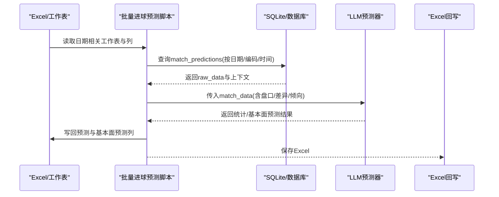
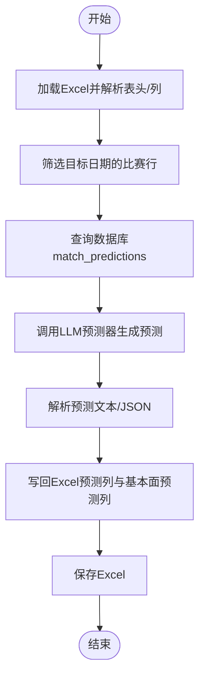
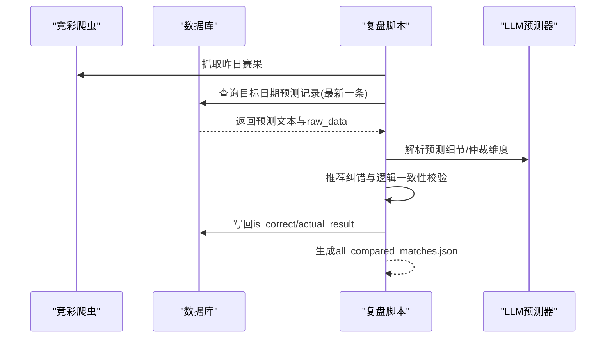
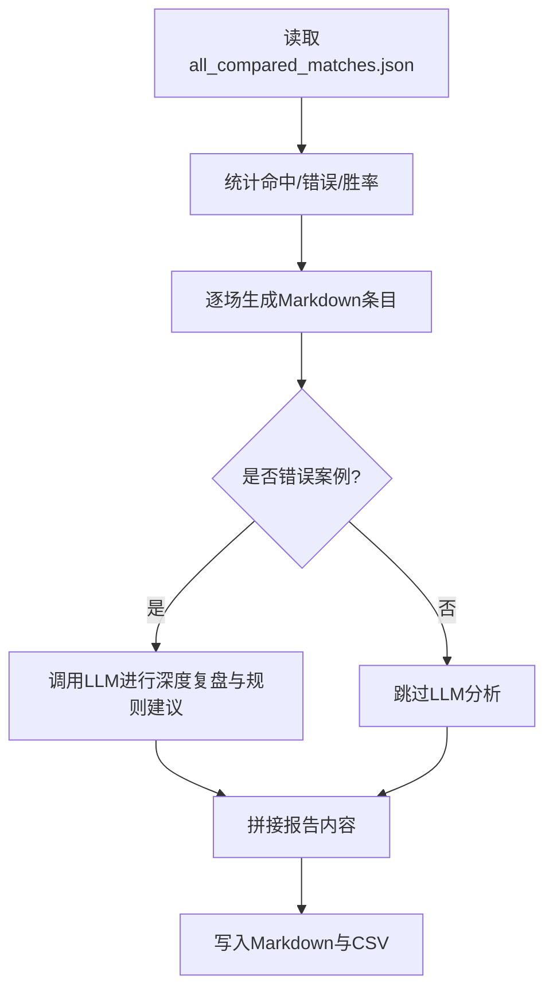
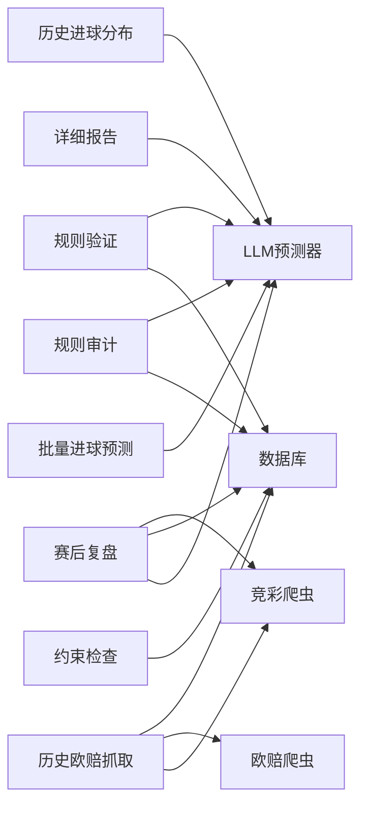

# 工具脚本系统

<cite>
**本文引用的文件**
- [scripts/analyze_0412.py](file://scripts/analyze_0412.py)
- [scripts/batch_predict_goals.py](file://scripts/batch_predict_goals.py)
- [scripts/run_post_mortem.py](file://scripts/run_post_mortem.py)
- [scripts/generate_detailed_report.py](file://scripts/generate_detailed_report.py)
- [scripts/analyze_errors.py](file://scripts/analyze_errors.py)
- [scripts/test_db.py](file://scripts/test_db.py)
- [scripts/check_db_constraints.py](file://scripts/check_db_constraints.py)
- [scripts/crawl_euro_odds_history.py](file://scripts/crawl_euro_odds_history.py)
- [scripts/audit_micro_signals_date.py](file://scripts/audit_micro_signals_date.py)
- [scripts/verify_micro_signals_2026_05_09.py](file://scripts/verify_micro_signals_2026_05_09.py)
- [scripts/temp_analyze.py](file://scripts/temp_analyze.py)
- [scripts/rerun_007_predict.py](file://scripts/rerun_007_predict.py)
- [scripts/test_inject.py](file://scripts/test_inject.py)
- [scripts/test_leisu.py](file://scripts/test_leisu.py)
- [scripts/test_streamlit_loop.py](file://scripts/test_streamlit_loop.py)
</cite>

## 目录
1. [简介](#简介)
2. [项目结构](#项目结构)
3. [核心组件](#核心组件)
4. [架构总览](#架构总览)
5. [详细组件分析](#详细组件分析)
6. [依赖分析](#依赖分析)
7. [性能考虑](#性能考虑)
8. [故障排除指南](#故障排除指南)
9. [结论](#结论)
10. [附录](#附录)

## 简介
本文件为工具脚本系统的全面使用与技术文档，覆盖以下方面：
- 批处理脚本的功能用途、使用方法与配置选项
- 数据分析脚本的实现逻辑、算法原理与输出格式
- 系统维护脚本的操作流程、安全注意事项与故障排除
- 测试工具的使用指南、覆盖率要求与持续集成配置
- 脚本调度机制、日志记录与性能监控策略
- 面向运维与开发者的完整使用手册

## 项目结构
工具脚本集中于 scripts 目录，围绕“预测数据采集—预测执行—复盘分析—规则审计—报表生成—数据库维护—测试验证”的闭环展开。核心流程涉及 Excel/数据库/爬虫/LLM 预测器/规则引擎等模块。

```mermaid
graph TB
subgraph "脚本层"
S1["analyze_0412.py"]
S2["batch_predict_goals.py"]
S3["run_post_mortem.py"]
S4["generate_detailed_report.py"]
S5["analyze_errors.py"]
S6["crawl_euro_odds_history.py"]
S7["check_db_constraints.py"]
S8["audit_micro_signals_date.py"]
S9["verify_micro_signals_2026_05_09.py"]
S10["temp_analyze.py"]
S11["rerun_007_predict.py"]
S12["test_inject.py"]
S13["test_leisu.py"]
S14["test_streamlit_loop.py"]
end
subgraph "应用层"
A1["src.crawler.jingcai_crawler"]
A2["src.crawler.euro_odds_crawler"]
A3["src.crawler.leisu_crawler"]
A4["src.db.database"]
A5["src.llm.predictor"]
A6["src.processor.data_fusion"]
end
S1 --> A5
S2 --> A5
S3 --> A1
S3 --> A4
S3 --> A5
S4 --> A5
S5 --> A5
S6 --> A1
S6 --> A2
S6 --> A4
S7 --> A4
S8 --> A4
S8 --> A5
S9 --> A4
S9 --> A5
S10 --> A5
S11 --> A3
S11 --> A6
S11 --> A5
S12 --> A3
S12 --> A6
S13 --> A3
S14 --> A3
```

图表来源
- [scripts/batch_predict_goals.py:1-248](file://scripts/batch_predict_goals.py#L1-L248)
- [scripts/run_post_mortem.py:1-824](file://scripts/run_post_mortem.py#L1-L824)
- [scripts/generate_detailed_report.py:1-164](file://scripts/generate_detailed_report.py#L1-L164)
- [scripts/crawl_euro_odds_history.py:1-118](file://scripts/crawl_euro_odds_history.py#L1-L118)
- [scripts/audit_micro_signals_date.py:1-115](file://scripts/audit_micro_signals_date.py#L1-L115)
- [scripts/verify_micro_signals_2026_05_09.py:1-175](file://scripts/verify_micro_signals_2026_05_09.py#L1-L175)
- [scripts/temp_analyze.py:1-256](file://scripts/temp_analyze.py#L1-L256)
- [scripts/rerun_007_predict.py:1-34](file://scripts/rerun_007_predict.py#L1-L34)
- [scripts/test_inject.py:1-23](file://scripts/test_inject.py#L1-L23)
- [scripts/test_leisu.py:1-129](file://scripts/test_leisu.py#L1-L129)
- [scripts/test_streamlit_loop.py:1-34](file://scripts/test_streamlit_loop.py#L1-L34)

章节来源
- [scripts/batch_predict_goals.py:1-248](file://scripts/batch_predict_goals.py#L1-L248)
- [scripts/run_post_mortem.py:1-824](file://scripts/run_post_mortem.py#L1-L824)
- [scripts/generate_detailed_report.py:1-164](file://scripts/generate_detailed_report.py#L1-L164)
- [scripts/crawl_euro_odds_history.py:1-118](file://scripts/crawl_euro_odds_history.py#L1-L118)
- [scripts/audit_micro_signals_date.py:1-115](file://scripts/audit_micro_signals_date.py#L1-L115)
- [scripts/verify_micro_signals_2026_05_09.py:1-175](file://scripts/verify_micro_signals_2026_05_09.py#L1-L175)
- [scripts/temp_analyze.py:1-256](file://scripts/temp_analyze.py#L1-L256)
- [scripts/rerun_007_predict.py:1-34](file://scripts/rerun_007_predict.py#L1-L34)
- [scripts/test_inject.py:1-23](file://scripts/test_inject.py#L1-L23)
- [scripts/test_leisu.py:1-129](file://scripts/test_leisu.py#L1-L129)
- [scripts/test_streamlit_loop.py:1-34](file://scripts/test_streamlit_loop.py#L1-L34)

## 核心组件
- 预测与复盘流水线
  - 采集与注入：从竞彩/雷速体育/欧赔源抓取数据，注入到预测上下文
  - 预测执行：调用 LLM 预测器生成推荐与仲裁维度
  - 复盘与写回：根据赛果计算命中率，写回数据库字段
- 规则审计与验证
  - 微观信号规则审计：按日期窗口对比存储与重新计算的规则 ID
  - 规则命中验证：针对特定规则集合进行盘口/水位联动分析
- 数据分析与报表
  - 历史进球分布统计：基于盘口/差异/倾向/联赛聚类的后验概率
  - 详细复盘报告：Markdown 与 CSV 输出，支持冷门深度分析
- 数据库维护与测试
  - 约束检查：SQLite 表结构/索引/约束核查
  - 历史欧赔抓取：批量历史数据入库
  - 数据库连通性与日期扫描：辅助定位问题

章节来源
- [scripts/run_post_mortem.py:253-492](file://scripts/run_post_mortem.py#L253-L492)
- [scripts/audit_micro_signals_date.py:23-115](file://scripts/audit_micro_signals_date.py#L23-L115)
- [scripts/verify_micro_signals_2026_05_09.py:71-175](file://scripts/verify_micro_signals_2026_05_09.py#L71-L175)
- [scripts/temp_analyze.py:108-256](file://scripts/temp_analyze.py#L108-L256)
- [scripts/generate_detailed_report.py:12-164](file://scripts/generate_detailed_report.py#L12-L164)
- [scripts/check_db_constraints.py:1-49](file://scripts/check_db_constraints.py#L1-L49)
- [scripts/crawl_euro_odds_history.py:43-118](file://scripts/crawl_euro_odds_history.py#L43-L118)

## 架构总览
下图展示典型“批量进球预测”与“赛后复盘”的端到端流程。

图表来源
- [scripts/batch_predict_goals.py:13-248](file://scripts/batch_predict_goals.py#L13-L248)

章节来源
- [scripts/batch_predict_goals.py:13-248](file://scripts/batch_predict_goals.py#L13-L248)

## 详细组件分析

### 批量进球预测脚本（batch_predict_goals.py）
- 功能概述
  - 从 Excel 中定位目标日期的比赛行，读取数据库中对应的 raw_data
  - 调用 LLM 预测器生成统计/基本面预测结果
  - 回写 Excel 的预测列与基本面预测列，并持久化
- 关键流程
  - Excel 解析：兼容多表/列名差异，统一日期格式
  - 数据库查询：按 match_num 与日期/创建时间匹配
  - 预测执行：构造 match_data（含盘口/差异/倾向），解析预测文本
  - 结果回写：统计预测写入预测列，基本面预测写入基本面预测列
- 输出
  - 成功/失败状态与计数，最终保存 Excel

图表来源
- [scripts/batch_predict_goals.py:13-248](file://scripts/batch_predict_goals.py#L13-L248)

章节来源
- [scripts/batch_predict_goals.py:13-248](file://scripts/batch_predict_goals.py#L13-L248)

### 赛后复盘与准确率统计（run_post_mortem.py）
- 功能概述
  - 从竞彩爬虫抓取昨日赛果，与数据库预测记录比对
  - 计算命中率（不让球/让球/半全场），生成结构化报告并写回 is_correct
- 关键流程
  - 爬取赛果：按日期窗口拉取
  - 数据对齐：按 fixture_id/球队名/时间进行模糊匹配
  - 推荐解析与纠错：修复让球缺字、方向反转等幻觉
  - 命中判定：NSPF/SPF/BQC 三类指标
  - 报告生成：all_compared_matches.json 与统计摘要
- 输出
  - 控制台统计摘要
  - JSON 报告文件
  - 数据库字段 is_correct/actual_result 更新

图表来源
- [scripts/run_post_mortem.py:494-824](file://scripts/run_post_mortem.py#L494-L824)

章节来源
- [scripts/run_post_mortem.py:16-492](file://scripts/run_post_mortem.py#L16-L492)
- [scripts/run_post_mortem.py:494-824](file://scripts/run_post_mortem.py#L494-L824)

### 详细复盘报告生成（generate_detailed_report.py）
- 功能概述
  - 基于 all_compared_matches.json 生成 Markdown 与 CSV 报告
  - 对错误案例调用 LLM 进行“盘口调度致死原因剖析”与“微观信号修正规则”
- 输出
  - Markdown 报告（按日期命名）
  - CSV 追加（便于导入表格）

图表来源
- [scripts/generate_detailed_report.py:12-164](file://scripts/generate_detailed_report.py#L12-L164)

章节来源
- [scripts/generate_detailed_report.py:12-164](file://scripts/generate_detailed_report.py#L12-L164)

### 错误案例归因分析（analyze_errors.py）
- 功能概述
  - 读取 wrong_predictions.json，构造提示词，调用 LLM 归纳共性盲区并给出 Prompt 优化建议
- 输出
  - 生成 post_mortem_report.md（包含整体统计与优化建议）

章节来源
- [scripts/analyze_errors.py:13-93](file://scripts/analyze_errors.py#L13-L93)

### 历史欧赔批量抓取（crawl_euro_odds_history.py）
- 功能概述
  - 按日期范围抓取已完成比赛，拉取欧赔初盘/即时盘，存入 euro_odds_history 表
- 参数
  - 天数（默认30天）
- 输出
  - 控制台日志与入库统计

章节来源
- [scripts/crawl_euro_odds_history.py:43-118](file://scripts/crawl_euro_odds_history.py#L43-L118)

### 数据库约束检查（check_db_constraints.py）
- 功能概述
  - 检查 SQLite 表结构、索引、唯一性与建表 SQL
- 输出
  - 控制台打印表结构与索引详情

章节来源
- [scripts/check_db_constraints.py:1-49](file://scripts/check_db_constraints.py#L1-L49)

### 微观信号规则审计（audit_micro_signals_date.py）
- 功能概述
  - 按日期窗口（12:00~次日12:00）抽取预测记录，对比存储与重新计算的规则 ID，统计增删数量
- 输出
  - 控制台打印差异统计与明细

章节来源
- [scripts/audit_micro_signals_date.py:23-115](file://scripts/audit_micro_signals_date.py#L23-L115)

### 规则命中验证（verify_micro_signals_2026_05_09.py）
- 功能概述
  - 针对特定日期窗口与目标规则集合，计算盘口/水位变化与推荐方向，输出对比明细
- 输出
  - 控制台打印匹配记录与关键指标

章节来源
- [scripts/verify_micro_signals_2026_05_09.py:71-175](file://scripts/verify_micro_signals_2026_05_09.py#L71-L175)

### 历史进球分布统计（temp_analyze.py）
- 功能概述
  - 读取 Excel/数据库，按联赛聚类与盘口/差异/倾向分组统计实际进球分布，生成 Markdown 报告并持久化历史
- 输出
  - docs/goal_distribution_analysis.md
  - 数据库存储（去重与持久化）

章节来源
- [scripts/temp_analyze.py:5-256](file://scripts/temp_analyze.py#L5-L256)

### 重新预测单场示例（rerun_007_predict.py）
- 功能概述
  - 注入雷速数据，调用预测器重新预测单场，输出 payload 至 data/tmp_rerun_007_result.json
- 输出
  - JSON 文件（包含 injury_text、goal_distribution、prediction 等）

章节来源
- [scripts/rerun_007_predict.py:11-34](file://scripts/rerun_007_predict.py#L11-L34)

### 数据注入与测试（test_inject.py）
- 功能概述
  - 调用 LeisuCrawler 与 data_fusion.inject_leisu_data，验证注入流程
- 输出
  - 控制台打印结果

章节来源
- [scripts/test_inject.py:8-23](file://scripts/test_inject.py#L8-L23)

### 雷速体育数据采集测试（test_leisu.py）
- 功能概述
  - 模拟竞彩引导页，解析对阵列表与分析区块，抽取伤停/积分/进球分布/半全场/交锋/近期战绩等
- 输出
  - 控制台打印解析结果

章节来源
- [scripts/test_leisu.py:1-129](file://scripts/test_leisu.py#L1-L129)

### Streamlit 事件循环模拟（test_streamlit_loop.py）
- 功能概述
  - 在 Windows 上设置事件循环策略，模拟异步执行 LeisuCrawler 的 fetch_match_data
- 输出
  - 控制台打印结果/异常

章节来源
- [scripts/test_streamlit_loop.py:1-34](file://scripts/test_streamlit_loop.py#L1-L34)

### 早期分析脚本（analyze_0412.py）
- 功能概述
  - 读取指定日期工作表，解析“重新预测”列，统计命中率并输出错误匹配清单
- 输出
  - 控制台统计与错误项列表

章节来源
- [scripts/analyze_0412.py:1-50](file://scripts/analyze_0412.py#L1-L50)

## 依赖分析
- 组件耦合
  - 脚本与 src 层模块松耦合，通过 sys.path 追加项目根路径导入
  - 数据库访问集中在 src.db.database，爬虫集中在 src.crawler.*，预测集中在 src.llm.*
- 外部依赖
  - pandas/openpyxl/pymysql/sqlalchemy/loguru 等
- 潜在风险
  - Excel 列名/表名兼容性、日期格式统一、数据库连接并发与事务提交
  - 爬虫稳定性与限流策略

图表来源
- [scripts/batch_predict_goals.py:1-248](file://scripts/batch_predict_goals.py#L1-L248)
- [scripts/run_post_mortem.py:1-824](file://scripts/run_post_mortem.py#L1-L824)
- [scripts/generate_detailed_report.py:1-164](file://scripts/generate_detailed_report.py#L1-L164)
- [scripts/crawl_euro_odds_history.py:1-118](file://scripts/crawl_euro_odds_history.py#L1-L118)
- [scripts/audit_micro_signals_date.py:1-115](file://scripts/audit_micro_signals_date.py#L1-L115)
- [scripts/verify_micro_signals_2026_05_09.py:1-175](file://scripts/verify_micro_signals_2026_05_09.py#L1-L175)
- [scripts/temp_analyze.py:1-256](file://scripts/temp_analyze.py#L1-L256)
- [scripts/check_db_constraints.py:1-49](file://scripts/check_db_constraints.py#L1-L49)

章节来源
- [scripts/batch_predict_goals.py:1-248](file://scripts/batch_predict_goals.py#L1-L248)
- [scripts/run_post_mortem.py:1-824](file://scripts/run_post_mortem.py#L1-L824)
- [scripts/generate_detailed_report.py:1-164](file://scripts/generate_detailed_report.py#L1-L164)
- [scripts/crawl_euro_odds_history.py:1-118](file://scripts/crawl_euro_odds_history.py#L1-L118)
- [scripts/audit_micro_signals_date.py:1-115](file://scripts/audit_micro_signals_date.py#L1-L115)
- [scripts/verify_micro_signals_2026_05_09.py:1-175](file://scripts/verify_micro_signals_2026_05_09.py#L1-L175)
- [scripts/temp_analyze.py:1-256](file://scripts/temp_analyze.py#L1-L256)
- [scripts/check_db_constraints.py:1-49](file://scripts/check_db_constraints.py#L1-L49)

## 性能考虑
- I/O 与并发
  - 批量写回 Excel 建议一次性保存，减少磁盘 IO
  - 爬虫请求需加延时（如欧赔抓取中已有 0.5s 间隔），避免触发限流
- 数据库
  - 复盘阶段批量写回建议使用事务，减少提交次数
  - 索引缺失可能导致查询缓慢，可通过约束检查脚本核对
- LLM 调用
  - 错误案例分析与深度复盘建议控制消息长度与温度参数，避免超时
- 内存与缓存
  - 大规模 Excel/数据库读取建议分批处理，避免内存峰值过高

## 故障排除指南
- Excel 解析失败
  - 现象：找不到必需列或日期格式异常
  - 处理：确认列名兼容（空格/大小写）、日期统一为 YYYY-MM-DD；必要时启用兼容模式
- 数据库连接/事务
  - 现象：写回失败/提交异常
  - 处理：检查连接状态、事务提交时机；确保异常捕获后仍提交
- 爬虫不稳定
  - 现象：竞彩/欧赔抓取失败或空数据
  - 处理：增加重试与延时；检查目标站点结构变化
- LLM 调用失败
  - 现象：深度复盘/错误归因失败
  - 处理：检查网络/鉴权/模型参数；降低温度与最大 token
- 数据库约束问题
  - 现象：索引缺失/唯一性异常
  - 处理：使用约束检查脚本核对表结构与建表 SQL，按需重建索引

章节来源
- [scripts/batch_predict_goals.py:13-248](file://scripts/batch_predict_goals.py#L13-L248)
- [scripts/run_post_mortem.py:514-786](file://scripts/run_post_mortem.py#L514-L786)
- [scripts/crawl_euro_odds_history.py:92-111](file://scripts/crawl_euro_odds_history.py#L92-L111)
- [scripts/check_db_constraints.py:13-47](file://scripts/check_db_constraints.py#L13-L47)

## 结论
本工具脚本系统围绕“预测—采集—复盘—规则审计—报表—维护—测试”的完整闭环构建，具备良好的扩展性与可维护性。通过标准化的数据输入/输出、健壮的错误处理与日志记录，能够支撑日常运营与模型迭代需求。建议在生产环境中结合定时任务与监控告警，确保脚本稳定运行与数据质量。

## 附录
- 使用建议
  - 批量进球预测：按日期运行，注意 Excel 列名兼容与数据库连接
  - 赛后复盘：每日定时执行，确保竞彩数据可用
  - 规则审计：按日期窗口定期审计，关注规则增删趋势
  - 报告生成：先运行复盘，再生成详细报告
  - 数据库维护：定期检查约束与索引，必要时重建
  - 测试验证：使用测试脚本验证注入/爬取/预测链路