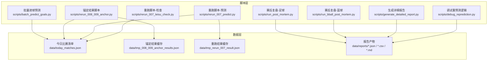
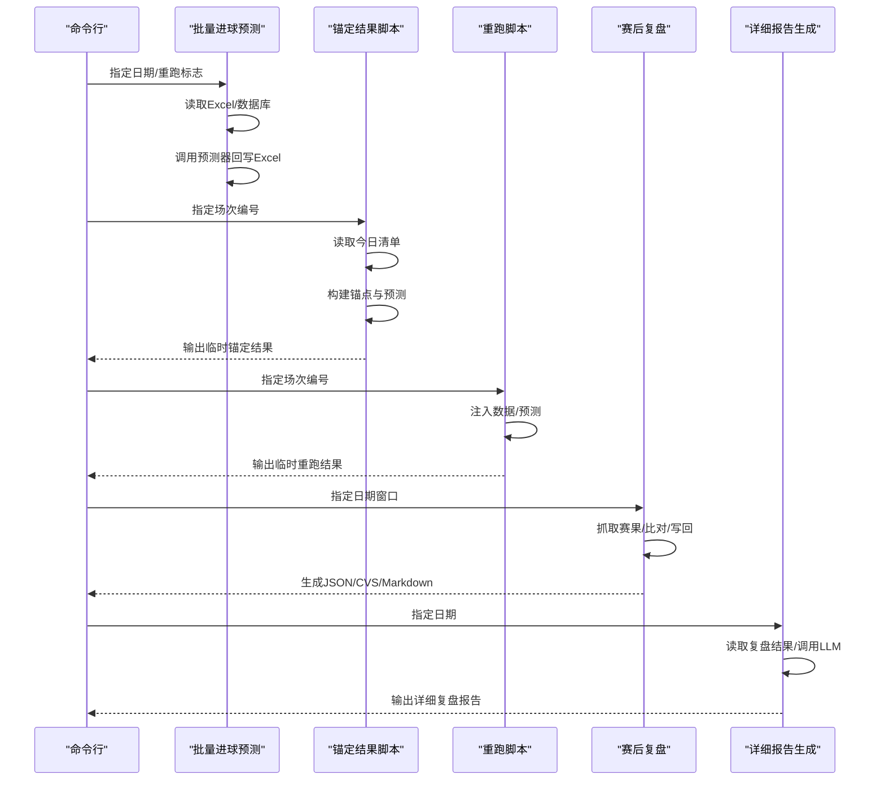
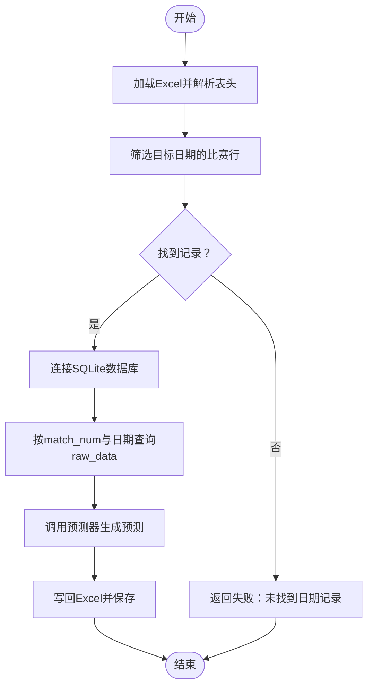
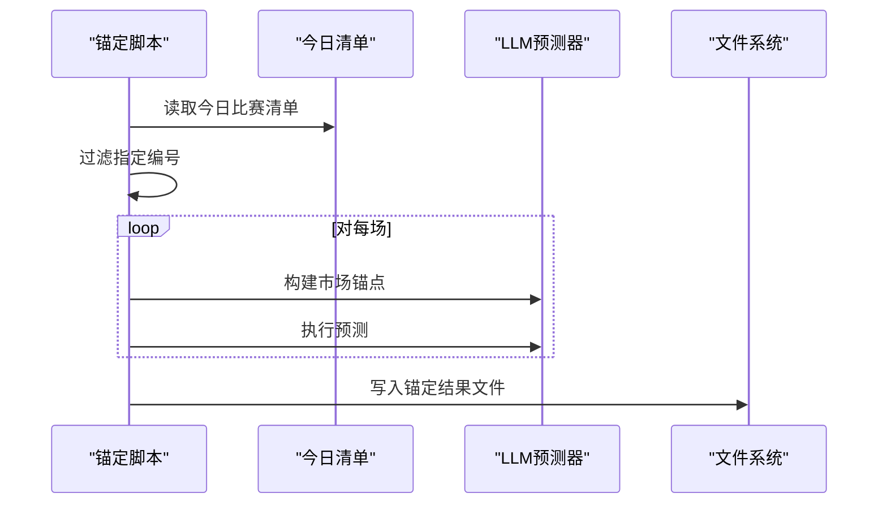
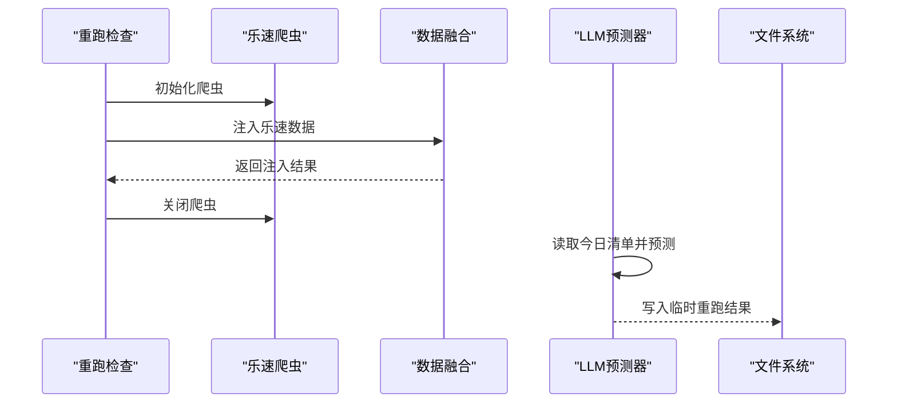
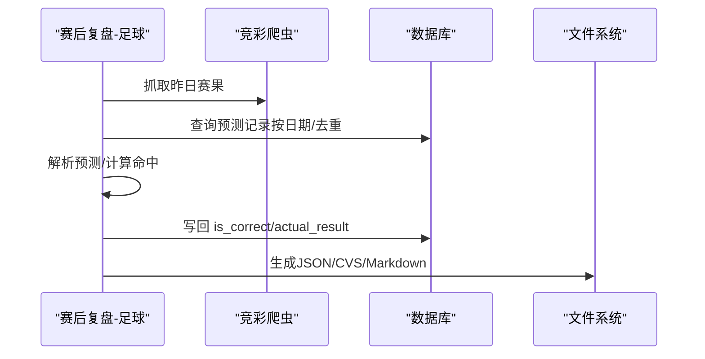
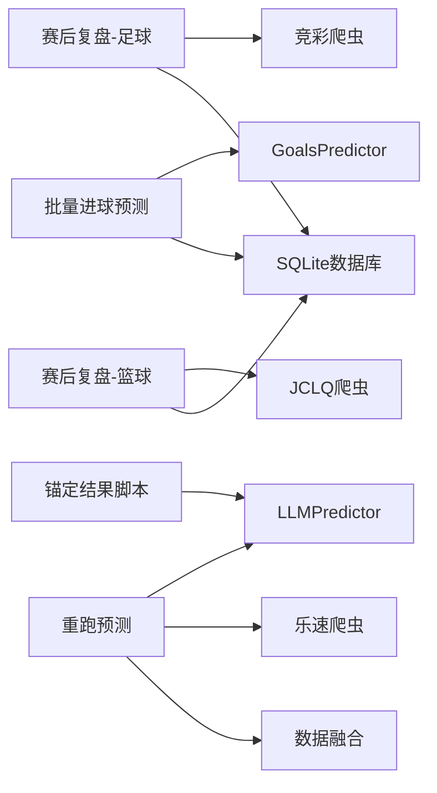

# 批处理脚本

<cite>
**本文引用的文件**
- [batch_predict_goals.py](file://scripts/batch_predict_goals.py)
- [rerun_008_009_anchor.py](file://scripts/rerun_008_009_anchor.py)
- [rerun_007_predict.py](file://scripts/rerun_007_predict.py)
- [rerun_007_leisu_check.py](file://scripts/rerun_007_leisu_check.py)
- [debug_reprediction.py](file://scripts/debug_reprediction.py)
- [run_post_mortem.py](file://scripts/run_post_mortem.py)
- [run_bball_post_mortem.py](file://scripts/run_bball_post_mortem.py)
- [generate_detailed_report.py](file://scripts/generate_detailed_report.py)
- [today_matches.json](file://data/today_matches.json)
- [tmp_008_009_anchor_results.json](file://data/tmp_008_009_anchor_results.json)
- [tmp_rerun_007_result.json](file://data/tmp_rerun_007_result.json)
</cite>

## 目录
1. [简介](#简介)
2. [项目结构](#项目结构)
3. [核心组件](#核心组件)
4. [架构总览](#架构总览)
5. [详细组件分析](#详细组件分析)
6. [依赖分析](#依赖分析)
7. [性能考虑](#性能考虑)
8. [故障排查指南](#故障排查指南)
9. [结论](#结论)
10. [附录](#附录)

## 简介
本文件系统化梳理本项目的批处理脚本体系，聚焦以下目标：
- 批量预测脚本的执行流程、参数配置与调度机制
- 重跑脚本的工作原理、适用场景与操作步骤
- 锚定结果脚本的实现逻辑、数据验证与结果更新流程
- 最佳实践、性能优化建议与常见问题解决方案
- 具体命令行示例与配置文件说明

## 项目结构
本项目将“批处理脚本”集中放置于 scripts 目录，围绕“预测—复盘—报告—重跑—锚定”形成闭环。关键数据位于 data 目录，报告产物位于 data/reports。

图表来源
- [batch_predict_goals.py:1-248](file://scripts/batch_predict_goals.py#L1-L248)
- [rerun_008_009_anchor.py:1-27](file://scripts/rerun_008_009_anchor.py#L1-L27)
- [rerun_007_predict.py:1-34](file://scripts/rerun_007_predict.py#L1-L34)
- [rerun_007_leisu_check.py:1-27](file://scripts/rerun_007_leisu_check.py#L1-L27)
- [run_post_mortem.py:1-824](file://scripts/run_post_mortem.py#L1-L824)
- [run_bball_post_mortem.py:1-267](file://scripts/run_bball_post_mortem.py#L1-L267)
- [generate_detailed_report.py:1-164](file://scripts/generate_detailed_report.py#L1-L164)
- [debug_reprediction.py:1-118](file://scripts/debug_reprediction.py#L1-L118)

章节来源
- [batch_predict_goals.py:1-248](file://scripts/batch_predict_goals.py#L1-L248)
- [rerun_008_009_anchor.py:1-27](file://scripts/rerun_008_009_anchor.py#L1-L27)
- [rerun_007_predict.py:1-34](file://scripts/rerun_007_predict.py#L1-L34)
- [rerun_007_leisu_check.py:1-27](file://scripts/rerun_007_leisu_check.py#L1-L27)
- [run_post_mortem.py:1-824](file://scripts/run_post_mortem.py#L1-L824)
- [run_bball_post_mortem.py:1-267](file://scripts/run_bball_post_mortem.py#L1-L267)
- [generate_detailed_report.py:1-164](file://scripts/generate_detailed_report.py#L1-L164)
- [debug_reprediction.py:1-118](file://scripts/debug_reprediction.py#L1-L118)

## 核心组件
- 批量进球预测脚本：从 Excel 读取目标日期比赛，结合数据库 match_predictions 的 raw_data，调用 GoalsPredictor 进行预测并回写 Excel。
- 锚定结果脚本：针对特定编号（如周三008/009）抽取市场锚点与预测，生成临时缓存文件，便于快速复核与二次分析。
- 重跑脚本：对单场（如周三007）进行数据注入与预测重跑，输出临时结果文件，便于快速验证与对比。
- 赛后复盘脚本：自动抓取赛果、比对预测、计算命中率、写回数据库并生成报告。
- 详细报告生成器：读取复盘结果，对错误案例进行深度复盘并导出 Markdown/CVS。
- 调试重预测逻辑：模拟数据库中不同时间段记录的存在与否，演示插入/更新流程。

章节来源
- [batch_predict_goals.py:13-240](file://scripts/batch_predict_goals.py#L13-L240)
- [rerun_008_009_anchor.py:6-26](file://scripts/rerun_008_009_anchor.py#L6-L26)
- [rerun_007_predict.py:11-33](file://scripts/rerun_007_predict.py#L11-L33)
- [rerun_007_leisu_check.py:10-26](file://scripts/rerun_007_leisu_check.py#L10-L26)
- [run_post_mortem.py:253-492](file://scripts/run_post_mortem.py#L253-L492)
- [generate_detailed_report.py:12-164](file://scripts/generate_detailed_report.py#L12-L164)
- [debug_reprediction.py:9-118](file://scripts/debug_reprediction.py#L9-L118)

## 架构总览
批处理脚本围绕“数据输入—预测推理—结果回写/输出—报告生成—反馈闭环”展开。下图展示脚本间的数据流与依赖关系：

图表来源
- [batch_predict_goals.py:13-240](file://scripts/batch_predict_goals.py#L13-L240)
- [rerun_008_009_anchor.py:6-26](file://scripts/rerun_008_009_anchor.py#L6-L26)
- [rerun_007_predict.py:11-33](file://scripts/rerun_007_predict.py#L11-L33)
- [run_post_mortem.py:494-800](file://scripts/run_post_mortem.py#L494-L800)
- [generate_detailed_report.py:12-164](file://scripts/generate_detailed_report.py#L12-L164)

## 详细组件分析

### 批量进球预测脚本（batch_predict_goals.py）
- 功能概述
  - 从 docs/foot_prediction.xlsx 中定位目标日期的比赛行，兼容多种表头名称与列布局。
  - 从 SQLite 数据库 data/football.db 的 match_predictions 表读取 raw_data，构造 match_data 并调用 GoalsPredictor.predict 进行预测。
  - 将统计预测与基本面预测结果写回 Excel 对应列，保存工作簿。
- 关键流程
  - Excel 解析：遍历工作表，解析表头，定位日期/编码/预测列等关键字段。
  - 数据库查询：按 match_num 与日期匹配，优先匹配当天，否则回退到最近记录。
  - 预测与回写：解析预测文本，提取进球数或统计结果，写回 Excel 并保存。
- 参数与入口
  - 命令行参数：日期字符串；--repredict 标志表示“重新预测”模式。
  - 依赖：GoalsPredictor、SQLite 数据库、Excel 文件。
- 典型用法
  - python scripts/batch_predict_goals.py 2026-05-12
  - python scripts/batch_predict_goals.py 2026-05-12 --repredict

图表来源
- [batch_predict_goals.py:13-240](file://scripts/batch_predict_goals.py#L13-L240)

章节来源
- [batch_predict_goals.py:13-240](file://scripts/batch_predict_goals.py#L13-L240)

### 锚定结果脚本（rerun_008_009_anchor.py）
- 功能概述
  - 从 data/today_matches.json 读取今日比赛清单，筛选指定编号（如周三008/009）。
  - 调用 LLMPredictor._build_market_anchor_summary 构建市场锚点，执行 predict 并汇总结果。
  - 将结果写入 data/tmp_008_009_anchor_results.json，便于后续复核。
- 适用场景
  - 快速锚定关键场次的盘口/欧赔锚点与预测结论，辅助风控与规则制定。
- 操作步骤
  - 确认 data/today_matches.json 已更新。
  - 运行脚本，检查 data/tmp_008_009_anchor_results.json 是否生成。

图表来源
- [rerun_008_009_anchor.py:6-26](file://scripts/rerun_008_009_anchor.py#L6-L26)
- [tmp_008_009_anchor_results.json:1-44](file://data/tmp_008_009_anchor_results.json#L1-L44)

章节来源
- [rerun_008_009_anchor.py:6-26](file://scripts/rerun_008_009_anchor.py#L6-L26)
- [tmp_008_009_anchor_results.json:1-44](file://data/tmp_008_009_anchor_results.json#L1-L44)

### 重跑脚本（rerun_007_predict.py 与 rerun_007_leisu_check.py）
- 重跑预测（rerun_007_predict.py）
  - 从 data/today_matches.json 读取周三007，注入乐速数据，调用 LLMPredictor.predict 生成预测。
  - 输出 data/tmp_rerun_007_result.json，包含预测文本、伤停摘要、进球分布等。
- 重跑检查（rerun_007_leisu_check.py）
  - 读取周三007，调用 inject_leisu_data 注入数据并打印关键字段，便于诊断数据注入是否成功。
- 适用场景
  - 验证数据注入链路、预测稳定性与输出一致性。
- 操作步骤
  - 先运行检查脚本确认注入成功。
  - 再运行重跑脚本生成预测缓存。

图表来源
- [rerun_007_predict.py:11-33](file://scripts/rerun_007_predict.py#L11-L33)
- [rerun_007_leisu_check.py:10-26](file://scripts/rerun_007_leisu_check.py#L10-L26)
- [tmp_rerun_007_result.json:1-31](file://data/tmp_rerun_007_result.json#L1-L31)

章节来源
- [rerun_007_predict.py:11-33](file://scripts/rerun_007_predict.py#L11-L33)
- [rerun_007_leisu_check.py:10-26](file://scripts/rerun_007_leisu_check.py#L10-L26)
- [tmp_rerun_007_result.json:1-31](file://data/tmp_rerun_007_result.json#L1-L31)

### 赛后复盘脚本（run_post_mortem.py 与 run_bball_post_mortem.py）
- 足球复盘（run_post_mortem.py）
  - 抓取竞彩赛果，按日期窗口与 fixture_id 去重，解析预测文本，计算命中情况。
  - 写回数据库 is_correct 与 actual_result 字段，生成 data/reports/all_compared_matches.json 与 wrong_predictions.json。
- 篮球复盘（run_bball_post_mortem.py）
  - 抓取 JCLQ 赛果，匹配预测记录，计算命中并写回篮球预测表。
  - 生成 data/reports/bball_all_compared_matches.json 与 CSV 报告。
- 适用场景
  - 自动化生成准确率报告、错误案例集合与详细复盘材料。

图表来源
- [run_post_mortem.py:494-800](file://scripts/run_post_mortem.py#L494-L800)
- [run_bball_post_mortem.py:79-262](file://scripts/run_bball_post_mortem.py#L79-L262)

章节来源
- [run_post_mortem.py:253-492](file://scripts/run_post_mortem.py#L253-L492)
- [run_post_mortem.py:494-800](file://scripts/run_post_mortem.py#L494-L800)
- [run_bball_post_mortem.py:79-262](file://scripts/run_bball_post_mortem.py#L79-L262)

### 详细报告生成器（generate_detailed_report.py）
- 功能概述
  - 读取 data/reports/all_compared_matches.json，对错误案例调用 LLM 进行深度复盘，生成 Markdown 与 CSV 报告。
- 适用场景
  - 为错误案例沉淀规则、优化微观信号与风控策略。
- 操作步骤
  - 确保已运行赛后复盘脚本生成 all_compared_matches.json。
  - 运行生成器，查看 reports 目录输出。

章节来源
- [generate_detailed_report.py:12-164](file://scripts/generate_detailed_report.py#L12-L164)

### 调试重预测逻辑（debug_reprediction.py）
- 功能概述
  - 模拟数据库中不同时间段记录的存在与否，演示插入/更新 match_predictions 的逻辑分支。
- 适用场景
  - 验证“重新预测”与“最终预测”等时间段的写入策略。

章节来源
- [debug_reprediction.py:9-118](file://scripts/debug_reprediction.py#L9-L118)

## 依赖分析
- 组件耦合
  - 批量预测脚本依赖 GoalsPredictor 与 SQLite 数据库，耦合点在数据源与预测器接口。
  - 锚定/重跑脚本依赖 LLMPredictor 与数据注入模块，耦合点在数据注入与预测接口。
  - 复盘脚本依赖爬虫与数据库 ORM，耦合点在数据抓取与写回。
- 外部依赖
  - Python 第三方库：openpyxl（Excel）、sqlite3（数据库）、sqlalchemy（ORM）、requests（爬虫）等。
- 潜在循环依赖
  - 脚本间通过 data 文件解耦，未发现循环导入。

图表来源
- [batch_predict_goals.py:11-153](file://scripts/batch_predict_goals.py#L11-L153)
- [rerun_008_009_anchor.py:4-15](file://scripts/rerun_008_009_anchor.py#L4-L15)
- [rerun_007_predict.py:7-23](file://scripts/rerun_007_predict.py#L7-L23)
- [run_post_mortem.py:12-14](file://scripts/run_post_mortem.py#L12-L14)
- [run_bball_post_mortem.py:13-14](file://scripts/run_bball_post_mortem.py#L13-L14)

章节来源
- [batch_predict_goals.py:11-153](file://scripts/batch_predict_goals.py#L11-L153)
- [rerun_008_009_anchor.py:4-15](file://scripts/rerun_008_009_anchor.py#L4-L15)
- [rerun_007_predict.py:7-23](file://scripts/rerun_007_predict.py#L7-L23)
- [run_post_mortem.py:12-14](file://scripts/run_post_mortem.py#L12-L14)
- [run_bball_post_mortem.py:13-14](file://scripts/run_bball_post_mortem.py#L13-L14)

## 性能考虑
- I/O 优化
  - Excel 读写：批量写回后再保存，减少磁盘 IO 次数。
  - 数据库访问：按 match_num 与日期进行索引友好查询，避免全表扫描。
- 并发与批处理
  - 脚本以顺序执行为主，适合在调度器中按任务队列串行运行。
- 资源管理
  - 爬虫实例在使用后及时关闭，避免资源泄漏。
- 缓存与中间文件
  - 临时结果文件（如 tmp_*.json）用于快速验证，建议定期清理。

## 故障排查指南
- Excel 表头不匹配
  - 现象：未找到日期/编码/预测列。
  - 处理：脚本内置多轮兼容解析与列名模糊匹配，仍失败时检查表头是否包含目标关键词。
- 数据库无记录
  - 现象：按 match_num 与日期未查询到 raw_data。
  - 处理：检查 match_num 是否正确，或放宽查询条件回退到最近记录。
- 预测结果为空或解析失败
  - 现象：预测文本无法提取统计结果或基本面预测。
  - 处理：检查预测器输出格式，必要时降级使用文本提取规则。
- 爬虫注入失败
  - 现象：注入后关键字段缺失。
  - 处理：先运行重跑检查脚本确认注入成功，再进行预测重跑。
- 复盘未生成报告
  - 现象：all_compared_matches.json 为空或不存在。
  - 处理：确认赛后复盘脚本已成功抓取赛果并写回数据库。

章节来源
- [batch_predict_goals.py:96-239](file://scripts/batch_predict_goals.py#L96-L239)
- [rerun_007_leisu_check.py:15-26](file://scripts/rerun_007_leisu_check.py#L15-L26)
- [run_post_mortem.py:502-508](file://scripts/run_post_mortem.py#L502-L508)

## 结论
本批处理脚本体系实现了从“数据注入—预测—复盘—报告—规则沉淀”的闭环。通过锚定结果与重跑脚本快速验证关键场次，借助赛后复盘自动化生成准确率与错误案例，最终由详细报告驱动规则优化。建议在生产环境中配合调度器定时执行，并对关键中间文件进行监控与清理。

## 附录

### 命令行示例
- 批量进球预测（普通/重新预测）
  - python scripts/batch_predict_goals.py 2026-05-12
  - python scripts/batch_predict_goals.py 2026-05-12 --repredict
- 锚定结果
  - python scripts/rerun_008_009_anchor.py
- 重跑脚本
  - python scripts/rerun_007_leisu_check.py
  - python scripts/rerun_007_predict.py
- 赛后复盘
  - python scripts/run_post_mortem.py
  - python scripts/run_bball_post_mortem.py
- 详细报告
  - python scripts/generate_detailed_report.py
- 调试重预测
  - python scripts/debug_reprediction.py

### 配置文件与数据文件说明
- data/today_matches.json
  - 今日比赛清单，包含 fixture_id、match_num、league、队伍、时间、赔率、盘口、情报等字段。
- data/tmp_008_009_anchor_results.json
  - 锚定结果缓存，包含市场锚点与预测摘要。
- data/tmp_rerun_007_result.json
  - 重跑结果缓存，包含预测文本、伤停摘要、进球分布等。
- data/reports/
  - all_compared_matches.json：复盘比对结果（足球）。
  - bball_all_compared_matches.json：复盘比对结果（篮球）。
  - detailed_post_mortem_report_YYYY-MM-DD.md：详细复盘报告。
  - detailed_post_mortem_report.csv：CSV 导出。
  - wrong_predictions.json：错误预测集合（历史兼容）。

章节来源
- [today_matches.json:1-200](file://data/today_matches.json#L1-L200)
- [tmp_008_009_anchor_results.json:1-44](file://data/tmp_008_009_anchor_results.json#L1-L44)
- [tmp_rerun_007_result.json:1-31](file://data/tmp_rerun_007_result.json#L1-L31)
- [run_post_mortem.py:794-800](file://scripts/run_post_mortem.py#L794-L800)
- [run_bball_post_mortem.py:246-262](file://scripts/run_bball_post_mortem.py#L246-L262)
- [generate_detailed_report.py:125-164](file://scripts/generate_detailed_report.py#L125-L164)