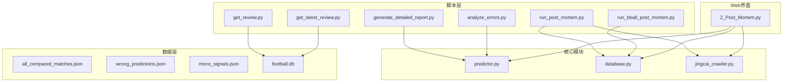
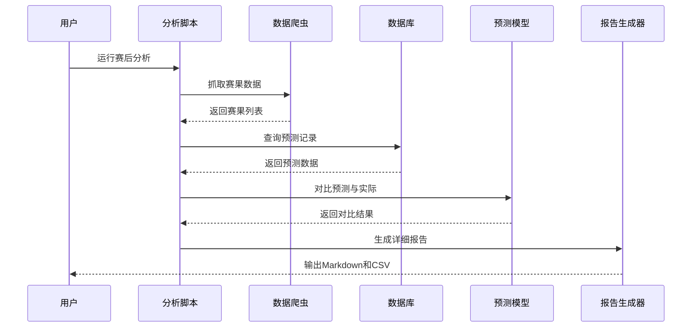
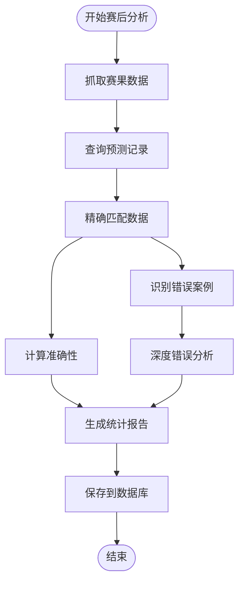
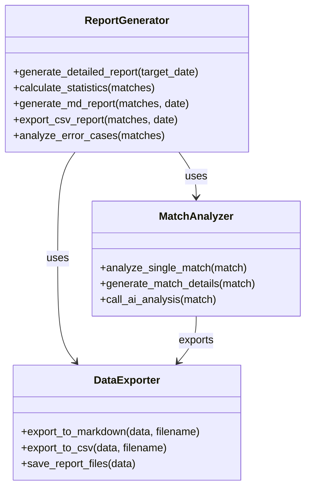
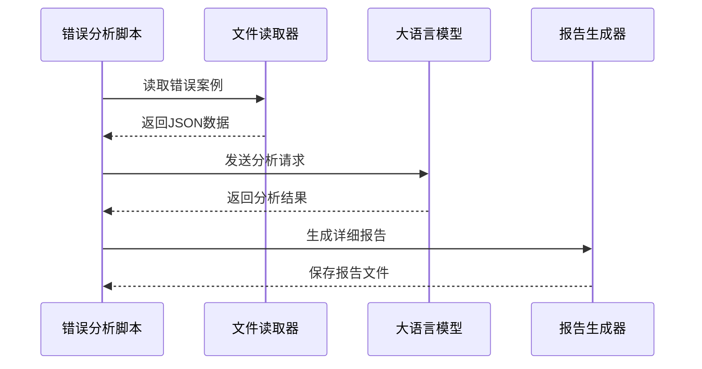
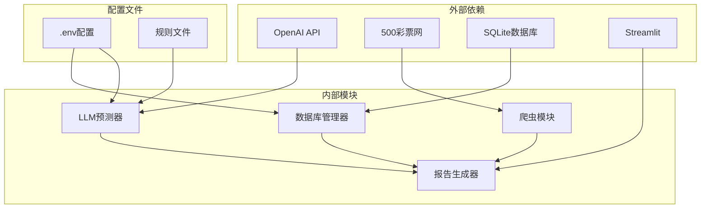

# 报告生成脚本

<cite>
**本文档引用的文件**
- [generate_detailed_report.py](file://scripts/generate_detailed_report.py)
- [run_post_mortem.py](file://scripts/run_post_mortem.py)
- [analyze_errors.py](file://scripts/analyze_errors.py)
- [run_bball_post_mortem.py](file://scripts/run_bball_post_mortem.py)
- [get_review.py](file://scripts/get_review.py)
- [get_latest_review.py](file://scripts/get_latest_review.py)
- [predictor.py](file://src/llm/predictor.py)
- [database.py](file://src/db/database.py)
- [jingcai_crawler.py](file://src/crawler/jingcai_crawler.py)
- [2_Post_Mortem.py](file://src/pages/2_Post_Mortem.py)
- [.env](file://config/.env)
- [all_compared_matches.json](file://data/reports/all_compared_matches.json)
- [wrong_predictions.json](file://data/reports/wrong_predictions.json)
- [micro_signals.json](file://data/rules/micro_signals.json)
</cite>

## 目录
1. [项目概述](#项目概述)
2. [项目结构](#项目结构)
3. [核心组件](#核心组件)
4. [架构概览](#架构概览)
5. [详细组件分析](#详细组件分析)
6. [依赖关系分析](#依赖关系分析)
7. [性能考虑](#性能考虑)
8. [故障排除指南](#故障排除指南)
9. [结论](#结论)
10. [附录](#附录)

## 项目概述

本项目是一个完整的赛后分析和报告生成系统，专注于足球预测模型的统计计算、表现评估和趋势分析。系统通过自动化脚本和Web界面，实现了从数据采集、模型预测、结果对比到报告生成的全流程自动化。

该系统的核心功能包括：
- **赛后分析**：自动对比预测结果与实际赛果，生成详细的复盘报告
- **统计计算**：计算整体准确率、按联赛和盘型的分组统计
- **趋势分析**：识别预测模型的共性问题和改进方向
- **多维度评估**：从基本面、盘赔、情报等多个维度进行综合分析
- **自动化报告**：生成Markdown和CSV格式的详细报告

## 项目结构

**图表来源**
- [generate_detailed_report.py:1-164](file://scripts/generate_detailed_report.py#L1-L164)
- [run_post_mortem.py:1-824](file://scripts/run_post_mortem.py#L1-L824)
- [predictor.py:1-800](file://src/llm/predictor.py#L1-L800)

**章节来源**
- [generate_detailed_report.py:1-164](file://scripts/generate_detailed_report.py#L1-L164)
- [run_post_mortem.py:1-824](file://scripts/run_post_mortem.py#L1-L824)

## 核心组件

### 1. 赛后分析引擎

赛后分析引擎是整个系统的核心，负责：
- **数据对比**：自动对比AI预测与实际赛果
- **准确性计算**：计算整体命中率和分组统计
- **错误分析**：识别预测失败的案例并进行深度分析
- **报告生成**：生成详细的复盘报告和统计数据

### 2. 预测模型集成

预测模型集成了多种分析维度：
- **基本面分析**：球队状态、伤停情况、历史交锋
- **盘赔分析**：亚盘、欧赔的动态变化和异常检测
- **情报分析**：来自不同渠道的战术和技术情报
- **微观信号**：基于规则库的盘口陷阱识别

### 3. 数据存储系统

系统采用SQLite数据库存储：
- **预测记录**：保存每次预测的详细信息
- **赛果数据**：记录实际比赛结果
- **复盘报告**：持久化每日的分析报告
- **规则库**：存储盘口陷阱识别规则

**章节来源**
- [predictor.py:1-800](file://src/llm/predictor.py#L1-L800)
- [database.py:1-567](file://src/db/database.py#L1-L567)

## 架构概览

**图表来源**
- [run_post_mortem.py:494-824](file://scripts/run_post_mortem.py#L494-L824)
- [generate_detailed_report.py:12-164](file://scripts/generate_detailed_report.py#L12-L164)

## 详细组件分析

### 赛后分析脚本 (run_post_mortem.py)

该脚本是整个系统的中枢，负责完整的赛后分析流程：

#### 核心功能模块

**1. 比赛结果抓取**
- 从500彩票网抓取指定日期的比赛结果
- 支持正常赛果和半全场结果的获取
- 自动处理日期格式和数据解析

**2. 预测数据对比**
- 从数据库获取指定日期的预测记录
- 通过match_num和时间信息进行精确匹配
- 自动计算预测准确性并更新数据库

**3. 统计分析计算**
- 整体命中率统计
- 按联赛的分组统计
- 按盘型的分组统计
- 详细的错误案例分析

**图表来源**
- [run_post_mortem.py:253-492](file://scripts/run_post_mortem.py#L253-L492)

**章节来源**
- [run_post_mortem.py:16-492](file://scripts/run_post_mortem.py#L16-L492)

### 详细报告生成器 (generate_detailed_report.py)

该脚本专注于生成详细的复盘报告：

#### 报告生成流程

**1. 数据准备**
- 读取all_compared_matches.json文件
- 验证数据完整性和有效性
- 准备报告所需的统计信息

**2. 统计计算**
- 总场次统计
- 命中场次统计
- 错误场次统计
- 整体胜率计算

**3. 逐场复盘**
- 生成每个比赛的详细分析
- 区分命中和错误的处理逻辑
- 为错误案例调用AI进行深度分析

**4. 多格式输出**
- Markdown格式的详细报告
- CSV格式的结构化数据
- 自动化的文件保存

**图表来源**
- [generate_detailed_report.py:12-164](file://scripts/generate_detailed_report.py#L12-L164)

**章节来源**
- [generate_detailed_report.py:12-164](file://scripts/generate_detailed_report.py#L12-L164)

### 错误分析脚本 (analyze_errors.py)

该脚本专门用于分析预测错误案例：

#### 分析流程

**1. 错误案例收集**
- 从wrong_predictions.json读取错误数据
- 限制分析的案例数量（默认前10个）
- 整理成AI可读的文本格式

**2. AI深度分析**
- 构建专门的分析提示词
- 调用LLM进行错误归因分析
- 识别预测模型的共性盲区

**3. 结果输出**
- 生成详细的分析报告
- 提供针对性的改进建议
- 保存为Markdown格式

**图表来源**
- [analyze_errors.py:13-93](file://scripts/analyze_errors.py#L13-L93)

**章节来源**
- [analyze_errors.py:13-93](file://scripts/analyze_errors.py#L13-L93)

### 篮球赛后分析 (run_bball_post_mortem.py)

该脚本专门处理篮球比赛的赛后分析：

#### 篮球特化功能

**1. 数据结构适配**
- 适配篮球比赛特有的数据结构
- 处理让分和大小分两种预测类型
- 支持篮球特有的胜负判定逻辑

**2. 自动化报告**
- 生成详细的篮球复盘报告
- 追加到CSV文件中
- 支持后续的自动化处理

**3. 错误反思机制**
- 为错误案例生成AI反思
- 提供篮球特化的分析建议
- 支持未来引入专门的篮球LLM

**章节来源**
- [run_bball_post_mortem.py:19-267](file://scripts/run_bball_post_mortem.py#L19-L267)

### Web界面集成 (2_Post_Mortem.py)

Web界面提供了可视化的报告生成功能：

#### 界面功能

**1. 日期选择和数据获取**
- 用户友好的日期选择器
- 自动从500网抓取赛果
- 实时数据更新和展示

**2. 复盘报告管理**
- 查看和编辑每日复盘报告
- 生成和更新AI洞察报告
- 管理规则草稿和建议

**3. 规则管理系统集成**
- 直接链接到规则管理页面
- 支持规则的快速修改和新增
- 提供智能的规则建议

**章节来源**
- [2_Post_Mortem.py:43-787](file://src/pages/2_Post_Mortem.py#L43-L787)

## 依赖关系分析

**图表来源**
- [.env:1-20](file://config/.env#L1-L20)
- [predictor.py:20-46](file://src/llm/predictor.py#L20-L46)

### 外部依赖

**1. LLM API服务**
- OpenAI兼容的API接口
- 支持多种模型（GPT-4、DeepSeek等）
- 可配置的API端点和密钥

**2. 数据源**
- 500彩票网的竞彩数据
- 实时的赛果和赔率数据
- 历史数据的批量获取

### 内部模块依赖

**1. 核心预测器**
- 集成多种分析规则和信号
- 支持动态规则加载
- 提供统一的预测接口

**2. 数据库层**
- 统一的数据访问接口
- 支持多种数据类型的存储
- 提供事务管理和错误处理

**章节来源**
- [.env:1-20](file://config/.env#L1-L20)
- [predictor.py:1-800](file://src/llm/predictor.py#L1-L800)

## 性能考虑

### 1. 数据处理优化

**批量操作**
- 使用SQLAlchemy的批量查询和更新
- 减少数据库连接次数
- 优化JSON数据的序列化和反序列化

**缓存策略**
- 预加载常用的规则数据
- 缓存API响应结果
- 避免重复的网络请求

### 2. 内存管理

**数据分块处理**
- 对大量数据进行分批处理
- 及时释放不需要的对象
- 监控内存使用情况

**文件I/O优化**
- 使用with语句确保文件正确关闭
- 批量写入减少磁盘I/O
- 合理的缓冲区大小设置

### 3. 并发处理

**异步操作**
- API调用的异步处理
- 多线程的数据处理
- 非阻塞的数据库操作

## 故障排除指南

### 常见问题及解决方案

**1. API连接问题**
- 检查LLM_API_KEY配置
- 验证API端点可达性
- 查看网络连接状态

**2. 数据获取失败**
- 验证500彩票网的可用性
- 检查日期格式的正确性
- 确认网络代理设置

**3. 数据库连接错误**
- 检查SQLite文件权限
- 验证数据库文件完整性
- 查看数据库锁状态

**4. 报告生成异常**
- 检查输出目录权限
- 验证JSON数据格式
- 确认文件编码设置

**章节来源**
- [database.py:200-233](file://src/db/database.py#L200-L233)

## 结论

本报告生成系统通过自动化脚本和Web界面，实现了从数据采集到报告生成的完整流程。系统的主要优势包括：

1. **全面的分析能力**：涵盖基本面、盘赔、情报等多个维度
2. **灵活的报告格式**：支持Markdown和CSV等多种输出格式
3. **智能化的错误分析**：通过AI技术识别预测模型的共性问题
4. **用户友好的界面**：提供直观的Web界面进行数据管理和报告查看
5. **可扩展的架构**：支持规则的动态加载和模型的灵活配置

系统为足球预测模型的持续优化提供了强有力的技术支撑，通过自动化的复盘分析帮助团队不断改进预测准确性。

## 附录

### 配置文件说明

**环境变量配置**
- LLM_API_KEY：大语言模型API密钥
- LLM_API_BASE：API服务端点地址
- DATABASE_URL：数据库连接字符串
- LLM_MODEL：使用的模型名称

### 数据文件格式

**all_compared_matches.json**
- 存储完整的赛后对比数据
- 包含每场比赛的详细分析结果
- 支持后续的报告生成和分析

**wrong_predictions.json**
- 专门存储预测错误的案例
- 用于专门的错误分析脚本
- 支持AI驱动的深度分析

### 规则系统

**micro_signals.json**
- 存储盘口陷阱识别规则
- 支持动态加载和更新
- 提供详细的规则条件和警告信息