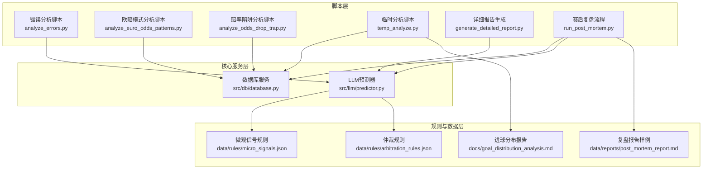
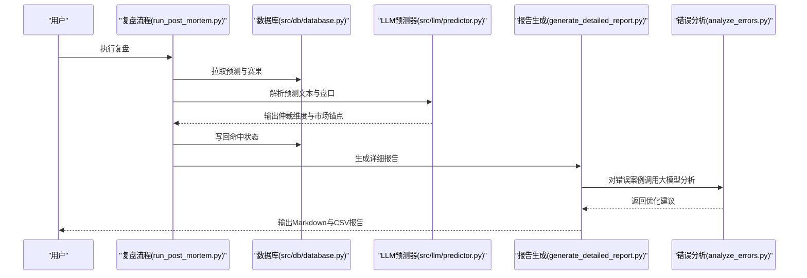
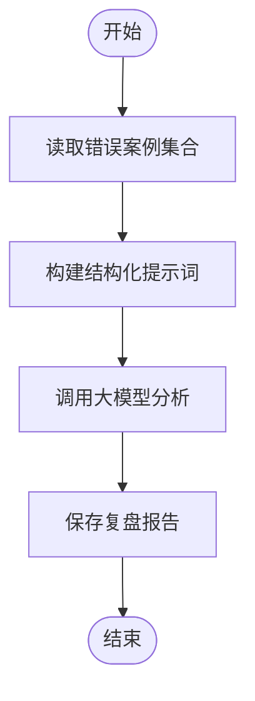
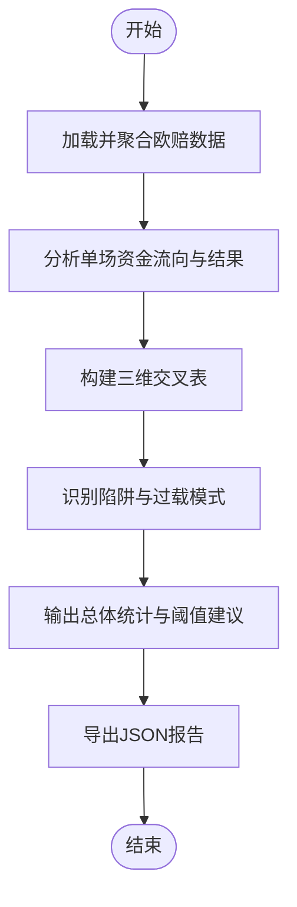
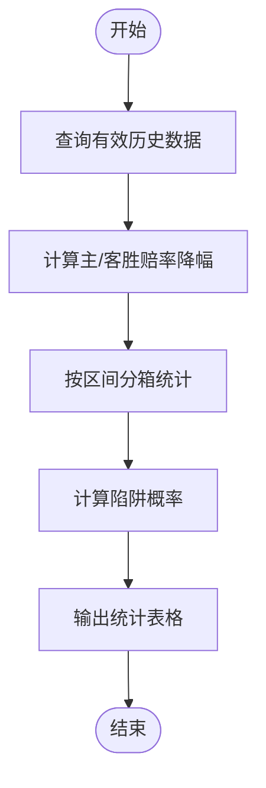
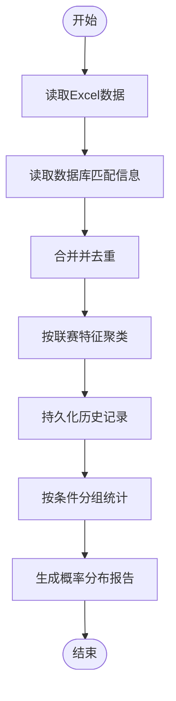
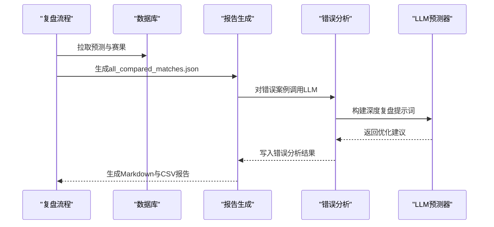
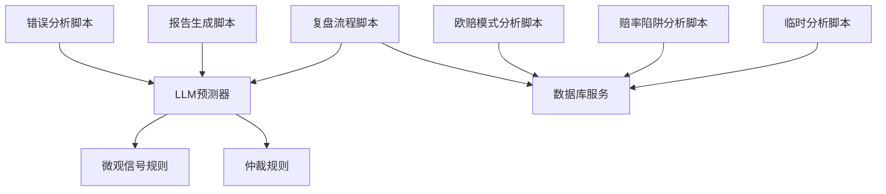

# 数据分析脚本

<cite>
**本文档引用的文件**
- [analyze_errors.py](file://scripts/analyze_errors.py)
- [analyze_euro_odds_patterns.py](file://scripts/analyze_euro_odds_patterns.py)
- [analyze_odds_drop_trap.py](file://scripts/analyze_odds_drop_trap.py)
- [temp_analyze.py](file://scripts/temp_analyze.py)
- [generate_detailed_report.py](file://scripts/generate_detailed_report.py)
- [run_post_mortem.py](file://scripts/run_post_mortem.py)
- [database.py](file://src/db/database.py)
- [predictor.py](file://src/llm/predictor.py)
- [micro_signals.json](file://data/rules/micro_signals.json)
- [arbitration_rules.json](file://data/rules/arbitration_rules.json)
- [post_mortem_report.md](file://data/reports/post_mortem_report.md)
- [goal_distribution_analysis.md](file://docs/goal_distribution_analysis.md)
- [README.md](file://README.md)
</cite>

## 目录
1. [简介](#简介)
2. [项目结构](#项目结构)
3. [核心组件](#核心组件)
4. [架构概览](#架构概览)
5. [详细组件分析](#详细组件分析)
6. [依赖关系分析](#依赖关系分析)
7. [性能考量](#性能考量)
8. [故障排除指南](#故障排除指南)
9. [结论](#结论)
10. [附录](#附录)

## 简介
本文件面向数据分析脚本的使用者与维护者，系统性梳理了错误分析、欧赔模式分析、赔率陷阱分析以及临时分析脚本的设计思路、实现细节与使用方法。文档涵盖统计方法、异常检测算法、风险评估机制、报告生成流程、数据可视化与结果解读技巧，并提供可操作的执行指南与最佳实践。

## 项目结构
该项目采用模块化设计，数据分析脚本位于 scripts/ 目录，核心业务逻辑集中在 src/ 目录，数据与规则存储在 data/ 与 docs/ 目录。整体架构围绕数据采集、处理、分析与报告生成展开。

**图表来源**
- [analyze_errors.py:1-93](file://scripts/analyze_errors.py#L1-L93)
- [analyze_euro_odds_patterns.py:1-348](file://scripts/analyze_euro_odds_patterns.py#L1-L348)
- [analyze_odds_drop_trap.py:1-87](file://scripts/analyze_odds_drop_trap.py#L1-L87)
- [temp_analyze.py:1-256](file://scripts/temp_analyze.py#L1-L256)
- [generate_detailed_report.py:1-164](file://scripts/generate_detailed_report.py#L1-L164)
- [run_post_mortem.py:1-824](file://scripts/run_post_mortem.py#L1-L824)
- [database.py:1-567](file://src/db/database.py#L1-L567)
- [predictor.py:1-800](file://src/llm/predictor.py#L1-L800)
- [micro_signals.json:1-977](file://data/rules/micro_signals.json#L1-L977)
- [arbitration_rules.json:1-63](file://data/rules/arbitration_rules.json#L1-L63)
- [post_mortem_report.md:1-65](file://data/reports/post_mortem_report.md#L1-L65)
- [goal_distribution_analysis.md:1-623](file://docs/goal_distribution_analysis.md#L1-L623)

**章节来源**
- [README.md:1-41](file://README.md#L1-L41)

## 核心组件
- 错误分析脚本：基于大模型对错误案例进行深度归因，输出可执行的优化建议。
- 欧赔模式分析脚本：构建三维交叉分析（赔率比×降幅×资金方向），识别诱盘陷阱与共识过载。
- 赔率陷阱分析脚本：基于SQLite查询与Pandas统计，量化主/客胜赔率下降陷阱的概率。
- 临时分析脚本：整合Excel与数据库数据，按联赛特征聚类统计进球数概率分布，生成报告。
- 报告生成脚本：汇总复盘结果，生成Markdown与CSV报告。
- 复盘流程脚本：自动化拉取赛果、比对预测、生成错误案例并触发深度分析。

**章节来源**
- [analyze_errors.py:1-93](file://scripts/analyze_errors.py#L1-L93)
- [analyze_euro_odds_patterns.py:1-348](file://scripts/analyze_euro_odds_patterns.py#L1-L348)
- [analyze_odds_drop_trap.py:1-87](file://scripts/analyze_odds_drop_trap.py#L1-L87)
- [temp_analyze.py:1-256](file://scripts/temp_analyze.py#L1-L256)
- [generate_detailed_report.py:1-164](file://scripts/generate_detailed_report.py#L1-L164)
- [run_post_mortem.py:1-824](file://scripts/run_post_mortem.py#L1-L824)

## 架构概览
数据分析脚本通过统一的数据访问接口与规则引擎协同工作，形成“数据采集→规则应用→统计分析→报告生成”的闭环。

**图表来源**
- [run_post_mortem.py:253-824](file://scripts/run_post_mortem.py#L253-L824)
- [generate_detailed_report.py:12-164](file://scripts/generate_detailed_report.py#L12-L164)
- [analyze_errors.py:13-93](file://scripts/analyze_errors.py#L13-L93)
- [database.py:451-567](file://src/db/database.py#L451-L567)
- [predictor.py:1-800](file://src/llm/predictor.py#L1-L800)

## 详细组件分析

### 错误分析脚本（analyze_errors.py）
- 统计方法：读取错误案例集合，构造结构化提示词，调用大模型进行归因分析。
- 异常检测：基于错误案例的典型模式（如诱盘、共识陷阱、战意误判）进行归纳。
- 报告生成：输出Markdown格式的复盘报告，包含整体胜率、归因总结与优化建议。
- 关键流程图：

**图表来源**
- [analyze_errors.py:13-93](file://scripts/analyze_errors.py#L13-L93)

**章节来源**
- [analyze_errors.py:1-93](file://scripts/analyze_errors.py#L1-L93)
- [post_mortem_report.md:1-65](file://data/reports/post_mortem_report.md#L1-L65)

### 欧赔模式分析脚本（analyze_euro_odds_patterns.py）
- 数据挖掘：从数据库按fixture聚合5家公司欧赔数据，提取初赔、临赔与实际赛果。
- 统计方法：构建三维交叉表（赔率比分档×降幅分档×资金方向），计算命中率与强队打出率。
- 异常检测：识别“反向背离+明显差距”构成的诱盘陷阱与“共识同向+接近盘口”的共识过载。
- 趋势预测：基于历史样本阈值，输出可执行的交易策略建议。
- 关键流程图：

**图表来源**
- [analyze_euro_odds_patterns.py:49-348](file://scripts/analyze_euro_odds_patterns.py#L49-L348)

**章节来源**
- [analyze_euro_odds_patterns.py:1-348](file://scripts/analyze_euro_odds_patterns.py#L1-L348)

### 赔率陷阱分析脚本（analyze_odds_drop_trap.py）
- 风险评估：筛选澳门/Bet365有效历史数据，计算主/客胜赔率下降幅度。
- 异常检测：按降幅区间统计“未打出主/客胜”的陷阱概率，识别高危区间。
- 预警系统：输出各降幅区间的陷阱概率，辅助风控与策略调整。
- 关键流程图：

**图表来源**
- [analyze_odds_drop_trap.py:7-87](file://scripts/analyze_odds_drop_trap.py#L7-L87)

**章节来源**
- [analyze_odds_drop_trap.py:1-87](file://scripts/analyze_odds_drop_trap.py#L1-L87)

### 临时分析脚本（temp_analyze.py）
- 数据整合：读取Excel与数据库，按日期与编码去重合并，匹配实际比赛信息。
- 联赛聚类：基于预定义联赛特征，将比赛归类到A-E组，便于分组统计。
- 统计分析：按盘口、预测差异、倾向与聚类分组统计实际进球数分布，生成概率矩阵。
- 报告生成：输出Markdown报告，持久化历史分析结果，支持后续复盘。
- 关键流程图：

**图表来源**
- [temp_analyze.py:5-256](file://scripts/temp_analyze.py#L5-L256)

**章节来源**
- [temp_analyze.py:1-256](file://scripts/temp_analyze.py#L1-L256)
- [goal_distribution_analysis.md:1-623](file://docs/goal_distribution_analysis.md#L1-L623)

### 报告生成与复盘流程
- 复盘流程：自动化拉取赛果、比对预测、生成错误案例并写回数据库。
- 详细报告：对错误案例调用大模型进行深度复盘，输出Markdown与CSV报告。
- 关键序列图：

**图表来源**
- [run_post_mortem.py:494-824](file://scripts/run_post_mortem.py#L494-L824)
- [generate_detailed_report.py:12-164](file://scripts/generate_detailed_report.py#L12-L164)
- [analyze_errors.py:13-93](file://scripts/analyze_errors.py#L13-L93)

**章节来源**
- [run_post_mortem.py:1-824](file://scripts/run_post_mortem.py#L1-L824)
- [generate_detailed_report.py:1-164](file://scripts/generate_detailed_report.py#L1-L164)

## 依赖关系分析
- 数据访问：脚本通过数据库服务统一访问match_predictions、euro_odds_history等表。
- 规则引擎：LLM预测器集成微观信号与仲裁规则，驱动盘口与赔率的异常检测与风险评估。
- 文件依赖：报告生成依赖于错误案例集合与规则文件，临时分析依赖于Excel与数据库。

**图表来源**
- [database.py:1-567](file://src/db/database.py#L1-L567)
- [predictor.py:1-800](file://src/llm/predictor.py#L1-L800)
- [micro_signals.json:1-977](file://data/rules/micro_signals.json#L1-L977)
- [arbitration_rules.json:1-63](file://data/rules/arbitration_rules.json#L1-L63)

**章节来源**
- [database.py:1-567](file://src/db/database.py#L1-L567)
- [predictor.py:1-800](file://src/llm/predictor.py#L1-L800)
- [micro_signals.json:1-977](file://data/rules/micro_signals.json#L1-L977)
- [arbitration_rules.json:1-63](file://data/rules/arbitration_rules.json#L1-L63)

## 性能考量
- 数据库查询优化：按日期与fixture_id进行索引与分组，减少重复扫描。
- 内存与I/O：批量写入与持久化，避免频繁磁盘操作；对大型Excel文件进行分片处理。
- 规则匹配效率：将规则预编译为可执行模板，减少运行时解析成本。
- 大模型调用：控制提示词长度与并发数量，合理设置温度与最大令牌数。

## 故障排除指南
- 数据库连接失败：检查数据库路径与权限，确认SQLite文件存在。
- LLM调用异常：验证API密钥与基础URL配置，检查网络连通性。
- 规则文件缺失：确认data/rules目录下micro_signals.json与arbitration_rules.json存在。
- 报告生成失败：检查输出目录权限与文件命名冲突。
- Excel解析错误：确认Excel列名标准化与日期格式一致性。

**章节来源**
- [database.py:200-233](file://src/db/database.py#L200-L233)
- [predictor.py:20-46](file://src/llm/predictor.py#L20-L46)

## 结论
本数据分析脚本体系通过结构化的统计方法、规则驱动的异常检测与自动化报告生成，实现了从错误归因到策略优化的闭环。建议在实际使用中结合业务场景对阈值与规则进行迭代优化，并持续积累历史数据以提升模型鲁棒性。

## 附录
- 使用指南
  - 错误分析：运行脚本读取错误案例，生成复盘报告。
  - 欧赔模式分析：执行脚本生成三维交叉表与阈值建议。
  - 赔率陷阱分析：执行脚本输出各降幅区间的陷阱概率。
  - 临时分析：准备Excel数据，运行脚本生成进球分布报告。
  - 报告生成：在复盘完成后运行脚本生成详细报告与CSV。
- 数据可视化与结果解读
  - 交叉表与概率分布图可用于直观展示陷阱与过载模式。
  - 建议结合历史趋势与基本面信息进行综合判断，避免单一指标误导。
- 最佳实践
  - 定期更新规则文件，纳入复盘反馈。
  - 对高危区间设置风控阈值，限制单场或累计暴露。
  - 保持数据质量，确保队名对齐与日期格式统一。