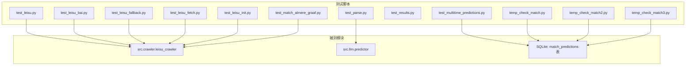
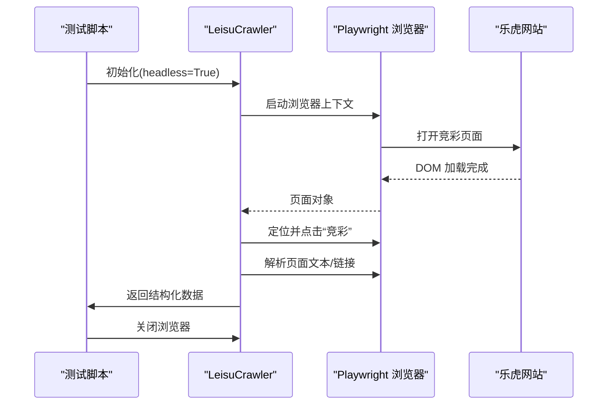
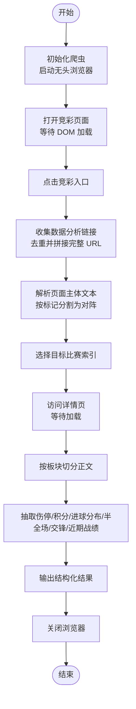
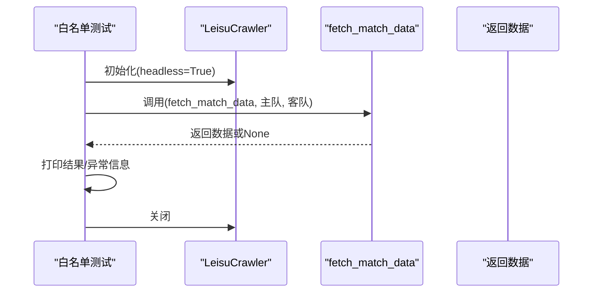
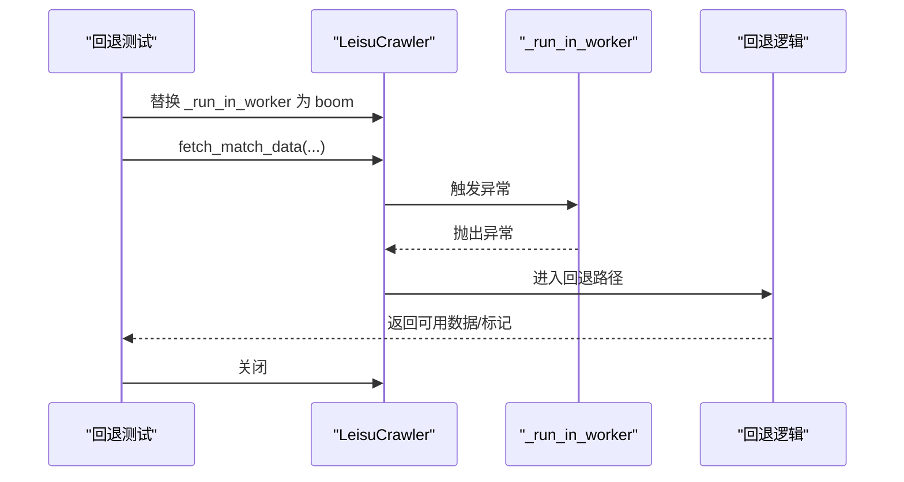
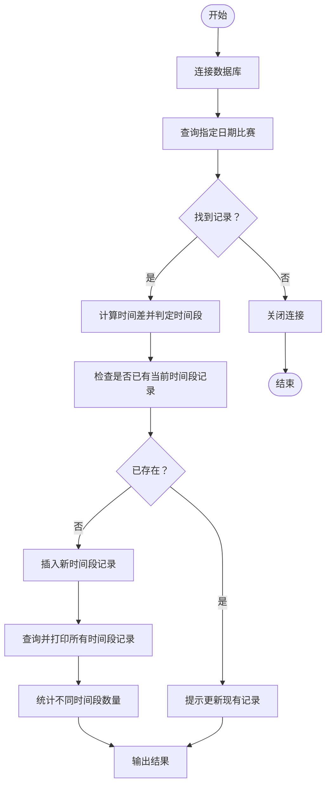
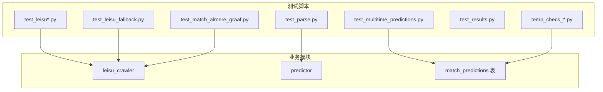

# 测试验证脚本

<cite>
**本文引用的文件**
- [scripts/test_leisu.py](file://scripts/test_leisu.py)
- [scripts/test_leisu_bai.py](file://scripts/test_leisu_bai.py)
- [scripts/test_leisu_fallback.py](file://scripts/test_leisu_fallback.py)
- [scripts/test_leisu_fetch.py](file://scripts/test_leisu_fetch.py)
- [scripts/test_leisu_init.py](file://scripts/test_leisu_init.py)
- [scripts/test_match_almere_graaf.py](file://scripts/test_match_almere_graaf.py)
- [scripts/test_multitime_predictions.py](file://scripts/test_multitime_predictions.py)
- [scripts/test_results.py](file://scripts/test_results.py)
- [scripts/test_parse.py](file://scripts/test_parse.py)
- [scripts/temp_check_match.py](file://scripts/temp_check_match.py)
- [scripts/temp_check_match2.py](file://scripts/temp_check_match2.py)
- [scripts/temp_check_match3.py](file://scripts/temp_check_match3.py)
</cite>

## 目录
1. [引言](#引言)
2. [项目结构](#项目结构)
3. [核心组件](#核心组件)
4. [架构总览](#架构总览)
5. [详细组件分析](#详细组件分析)
6. [依赖分析](#依赖分析)
7. [性能考虑](#性能考虑)
8. [故障排查指南](#故障排查指南)
9. [结论](#结论)
10. [附录](#附录)

## 引言
本文件系统化梳理与测试验证相关的一系列脚本，围绕“乐视为例”的爬虫测试、数据获取验证、错误处理机制展开；同时覆盖白名单测试脚本的权限验证、访问控制与安全检查流程；解释回退机制测试脚本的容错处理、异常恢复与数据一致性保障；提供匹配测试脚本的准确性验证、结果比对与统计分析方法，并包含多时间预测测试的时序分析、结果验证与性能评估。

## 项目结构
测试验证脚本主要位于 scripts 目录下，按功能划分为：
- 爬虫与数据获取测试：test_leisu*.py、test_results.py
- 回退机制测试：test_leisu_fallback.py
- 匹配测试与解析：test_match_almere_graaf.py、test_parse.py、temp_check_* 系列
- 多时间预测测试：test_multitime_predictions.py

图表来源
- [scripts/test_leisu.py:1-129](file://scripts/test_leisu.py#L1-L129)
- [scripts/test_leisu_bai.py:1-28](file://scripts/test_leisu_bai.py#L1-L28)
- [scripts/test_leisu_fallback.py:1-17](file://scripts/test_leisu_fallback.py#L1-L17)
- [scripts/test_leisu_fetch.py:1-20](file://scripts/test_leisu_fetch.py#L1-L20)
- [scripts/test_leisu_init.py:1-15](file://scripts/test_leisu_init.py#L1-L15)
- [scripts/test_match_almere_graaf.py:1-14](file://scripts/test_match_almere_graaf.py#L1-L14)
- [scripts/test_multitime_predictions.py:1-104](file://scripts/test_multitime_predictions.py#L1-L104)
- [scripts/test_results.py:1-21](file://scripts/test_results.py#L1-L21)
- [scripts/test_parse.py:1-13](file://scripts/test_parse.py#L1-L13)
- [scripts/temp_check_match.py:1-26](file://scripts/temp_check_match.py#L1-L26)
- [scripts/temp_check_match2.py:1-12](file://scripts/temp_check_match2.py#L1-L12)
- [scripts/temp_check_match3.py:1-26](file://scripts/temp_check_match3.py#L1-L26)

章节来源
- [scripts/test_leisu.py:1-129](file://scripts/test_leisu.py#L1-L129)
- [scripts/test_leisu_bai.py:1-28](file://scripts/test_leisu_bai.py#L1-L28)
- [scripts/test_leisu_fallback.py:1-17](file://scripts/test_leisu_fallback.py#L1-L17)
- [scripts/test_leisu_fetch.py:1-20](file://scripts/test_leisu_fetch.py#L1-L20)
- [scripts/test_leisu_init.py:1-15](file://scripts/test_leisu_init.py#L1-L15)
- [scripts/test_match_almere_graaf.py:1-14](file://scripts/test_match_almere_graaf.py#L1-L14)
- [scripts/test_multitime_predictions.py:1-104](file://scripts/test_multitime_predictions.py#L1-L104)
- [scripts/test_results.py:1-21](file://scripts/test_results.py#L1-L21)
- [scripts/test_parse.py:1-13](file://scripts/test_parse.py#L1-L13)
- [scripts/temp_check_match.py:1-26](file://scripts/temp_check_match.py#L1-L26)
- [scripts/temp_check_match2.py:1-12](file://scripts/temp_check_match2.py#L1-L12)
- [scripts/temp_check_match3.py:1-26](file://scripts/temp_check_match3.py#L1-L26)

## 核心组件
- 乐视为例的爬虫测试脚本：通过 Playwright 控制浏览器，抓取竞彩页面并解析关键板块，输出结构化结果，用于验证数据提取逻辑与稳定性。
- 白名单测试脚本：通过 LeisuCrawler 的公开接口 fetch_match_data 定位特定比赛，验证权限与访问控制，确保在受限环境下仍可正确返回数据或明确错误。
- 回退机制测试脚本：通过替换内部执行函数强制触发异常，验证回退路径是否生效，确保在主流程失败时仍能返回可用数据或进行降级处理。
- 匹配测试脚本：针对特定队伍组合与时间戳进行查询，验证数据入库与检索一致性；结合临时脚本对 raw_data 字段进行解析与比对。
- 多时间预测测试：基于 SQLite 数据库中的 match_predictions 表，模拟不同时段预测的创建与合并，验证时间窗口划分与去重策略。
- 结果验证脚本：抓取第三方开奖结果页面，解析并打印关键字段，用于后续比对与统计分析。

章节来源
- [scripts/test_leisu.py:10-129](file://scripts/test_leisu.py#L10-L129)
- [scripts/test_leisu_bai.py:9-27](file://scripts/test_leisu_bai.py#L9-L27)
- [scripts/test_leisu_fallback.py:5-16](file://scripts/test_leisu_fallback.py#L5-L16)
- [scripts/test_match_almere_graaf.py:7-13](file://scripts/test_match_almere_graaf.py#L7-L13)
- [scripts/test_multitime_predictions.py:10-104](file://scripts/test_multitime_predictions.py#L10-L104)
- [scripts/test_results.py:5-21](file://scripts/test_results.py#L5-L21)

## 架构总览
以下序列图展示“乐视为例”的端到端测试流程：初始化爬虫、打开页面、定位元素、提取数据、关闭资源。

图表来源
- [scripts/test_leisu.py:10-129](file://scripts/test_leisu.py#L10-L129)

章节来源
- [scripts/test_leisu.py:10-129](file://scripts/test_leisu.py#L10-L129)

## 详细组件分析

### 乐视为例的爬虫测试脚本（test_leisu.py）
- 功能要点
  - 初始化无头浏览器，访问竞彩引导页，等待 DOM 加载与稳定。
  - 提取“数据分析”类链接列表，构建完整 URL 并去重。
  - 从页面主体文本中按固定标记分割，识别主客队名称，生成比赛列表。
  - 访问目标详情页，按板块切分正文，抽取伤停、积分、进球分布、半全场胜负、历史交锋、近期战绩等字段。
  - 输出 JSON 格式的结果，包含 URL 与各板块摘要。
- 错误处理
  - 使用 try/finally 确保浏览器资源释放。
  - 对目标索引越界进行显式退出，便于快速定位问题。
- 性能与健壮性
  - 明确的等待与超时设置，避免过早读取未渲染内容。
  - 正则表达式限定提取范围，减少噪声干扰。

图表来源
- [scripts/test_leisu.py:10-129](file://scripts/test_leisu.py#L10-L129)

章节来源
- [scripts/test_leisu.py:10-129](file://scripts/test_leisu.py#L10-L129)

### 白名单测试脚本（test_leisu_bai.py）
- 功能要点
  - 通过 LeisuCrawler 的公开接口 fetch_match_data 获取指定比赛的数据。
  - 输出成功/失败状态与 JSON 结果，便于人工核验。
- 权限与访问控制
  - 通过调用公开接口验证外部访问路径，确保在受限网络或权限配置下仍可返回数据或抛出可预期异常。
- 安全检查
  - 统一使用 headless 模式，避免交互式弹窗影响自动化测试。
  - 异常捕获与堆栈打印，便于审计与溯源。

图表来源
- [scripts/test_leisu_bai.py:9-27](file://scripts/test_leisu_bai.py#L9-L27)

章节来源
- [scripts/test_leisu_bai.py:9-27](file://scripts/test_leisu_bai.py#L9-L27)

### 回退机制测试脚本（test_leisu_fallback.py）
- 功能要点
  - 替换内部执行函数，强制触发异常，验证回退路径是否生效。
  - 输出 fallback_ok 标记与实际返回值，辅助判断容错与恢复能力。
- 容错与一致性
  - 在主流程失败时，确保返回非空数据或至少保留关键字段（如 _url），维持上层调用的连续性。

图表来源
- [scripts/test_leisu_fallback.py:5-16](file://scripts/test_leisu_fallback.py#L5-L16)

章节来源
- [scripts/test_leisu_fallback.py:5-16](file://scripts/test_leisu_fallback.py#L5-L16)

### 匹配测试脚本（test_match_almere_graaf.py）
- 功能要点
  - 以具体队伍与时间戳为参数，调用 fetch_match_data，验证数据存在性与返回格式。
- 准确性验证
  - 通过 HAS_DATA 与 DATA 输出，快速判断匹配是否成功；结合数据库脚本进一步核对 raw_data 内容。

章节来源
- [scripts/test_match_almere_graaf.py:7-13](file://scripts/test_match_almere_graaf.py#L7-L13)

### 匹配测试与解析（test_parse.py）
- 功能要点
  - 使用 LLM 预测器解析预测文本，提取关键推荐、比分参考与信心指数等字段。
- 结果比对与统计
  - 将解析结果打印，便于与期望模板进行比对；可扩展为批量统计准确率与置信度分布。

章节来源
- [scripts/test_parse.py:3-12](file://scripts/test_parse.py#L3-L12)

### 数据库匹配检查（temp_check_* 系列）
- 功能要点
  - 查询 match_predictions 表，定位特定编号的记录，读取 raw_data 并解析亚洲盘口与 NSPF 等字段。
- 统计分析
  - 通过对比不同编号的记录，观察字段完整性与一致性，辅助评估数据质量与清洗效果。

章节来源
- [scripts/temp_check_match.py:5-25](file://scripts/temp_check_match.py#L5-L25)
- [scripts/temp_check_match2.py:3-11](file://scripts/temp_check_match2.py#L3-L11)
- [scripts/temp_check_match3.py:7-25](file://scripts/temp_check_match3.py#L7-L25)

### 多时间预测测试（test_multitime_predictions.py）
- 功能要点
  - 连接 SQLite 数据库，查找指定日期的比赛记录，计算当前应属的时间段（pre_24h、pre_12h、final）。
  - 检查是否存在当前时间段记录，若无则插入新记录并验证多时间段共存。
- 时序分析与性能评估
  - 通过比较比赛时间与当前时间，判断时间段划分逻辑是否合理。
  - 统计同一 fixture_id 下不同 prediction_period 的数量，验证去重与合并策略的有效性。

图表来源
- [scripts/test_multitime_predictions.py:10-104](file://scripts/test_multitime_predictions.py#L10-L104)

章节来源
- [scripts/test_multitime_predictions.py:10-104](file://scripts/test_multitime_predictions.py#L10-L104)

### 结果验证脚本（test_results.py）
- 功能要点
  - 抓取第三方开奖结果页面，解析表格行，提取场次编号、主客队与比分字段。
- 统计分析
  - 用于与预测结果进行比对，计算命中率、比分准确度等指标。

章节来源
- [scripts/test_results.py:5-21](file://scripts/test_results.py#L5-L21)

## 依赖分析
- 组件耦合
  - 测试脚本均依赖 src.crawler.leisu_crawler 与 src.llm.predictor，体现测试对业务模块的直接依赖。
  - 多时间预测测试依赖 SQLite 数据库中的 match_predictions 表，体现对持久化存储的依赖。
- 外部依赖
  - requests、BeautifulSoup 用于网页抓取与解析。
  - Playwright 用于浏览器自动化与页面交互。
- 潜在循环依赖
  - 当前脚本均为测试入口，未见直接循环导入；业务模块间通过明确接口交互，降低耦合风险。

图表来源
- [scripts/test_leisu.py:8](file://scripts/test_leisu.py#L8)
- [scripts/test_leisu_bai.py:7](file://scripts/test_leisu_bai.py#L7)
- [scripts/test_leisu_fallback.py:3](file://scripts/test_leisu_fallback.py#L3)
- [scripts/test_match_almere_graaf.py:5](file://scripts/test_match_almere_graaf.py#L5)
- [scripts/test_parse.py:3](file://scripts/test_parse.py#L3)
- [scripts/test_multitime_predictions.py:6](file://scripts/test_multitime_predictions.py#L6)
- [scripts/temp_check_match.py:6](file://scripts/temp_check_match.py#L6)
- [scripts/temp_check_match2.py:3](file://scripts/temp_check_match2.py#L3)
- [scripts/temp_check_match3.py:4](file://scripts/temp_check_match3.py#L4)

章节来源
- [scripts/test_leisu.py:8](file://scripts/test_leisu.py#L8)
- [scripts/test_leisu_bai.py:7](file://scripts/test_leisu_bai.py#L7)
- [scripts/test_leisu_fallback.py:3](file://scripts/test_leisu_fallback.py#L3)
- [scripts/test_match_almere_graaf.py:5](file://scripts/test_match_almere_graaf.py#L5)
- [scripts/test_parse.py:3](file://scripts/test_parse.py#L3)
- [scripts/test_multitime_predictions.py:6](file://scripts/test_multitime_predictions.py#L6)
- [scripts/temp_check_match.py:6](file://scripts/temp_check_match.py#L6)
- [scripts/temp_check_match2.py:3](file://scripts/temp_check_match2.py#L3)
- [scripts/temp_check_match3.py:4](file://scripts/temp_check_match3.py#L4)

## 性能考虑
- 网络与解析
  - 合理设置等待与超时，避免频繁重试导致资源浪费。
  - 使用正则与字符串切片限制提取范围，减少不必要的内存占用。
- 数据库操作
  - 查询时使用 LIMIT 与 ORDER BY 优化，避免全表扫描。
  - 插入新记录前先检查重复，减少冗余写入。
- 浏览器资源
  - 统一在 finally 中关闭浏览器，防止进程泄漏。

## 故障排查指南
- 爬虫测试失败
  - 检查页面元素定位是否随站点变化而失效；必要时调整选择器或等待条件。
  - 查看浏览器日志与截图（如启用），确认交互步骤是否按预期执行。
- 数据为空或 None
  - 核对输入参数（主队、客队、时间戳）是否正确；检查 fetch 接口返回值与异常分支。
- 回退机制未触发
  - 确认替换的内部函数是否被正确调用；检查回退逻辑的异常类型与捕获范围。
- 多时间预测冲突
  - 核对时间段划分逻辑与时间差阈值；确保插入前的去重检查有效。
- 数据库查询异常
  - 检查表结构变更与字段命名；确认连接路径与权限。

章节来源
- [scripts/test_leisu.py:126-129](file://scripts/test_leisu.py#L126-L129)
- [scripts/test_leisu_bai.py:20-24](file://scripts/test_leisu_bai.py#L20-L24)
- [scripts/test_leisu_fallback.py:12-16](file://scripts/test_leisu_fallback.py#L12-L16)
- [scripts/test_multitime_predictions.py:94-99](file://scripts/test_multitime_predictions.py#L94-L99)
- [scripts/temp_check_match.py:24](file://scripts/temp_check_match.py#L24)

## 结论
上述测试验证脚本覆盖了从页面抓取、数据解析、权限与安全验证、回退机制、匹配准确性到多时间预测的全流程验证。通过结构化的测试流程与清晰的输出格式，能够高效定位问题并保障系统在复杂场景下的稳定性与一致性。

## 附录
- 建议将常用验证步骤封装为可复用的测试工具函数，统一异常处理与日志输出。
- 对于第三方网站的结构变化，建议增加版本化选择器与降级策略，提升鲁棒性。
- 将测试结果纳入持续集成流水线，定期运行以监控回归风险。