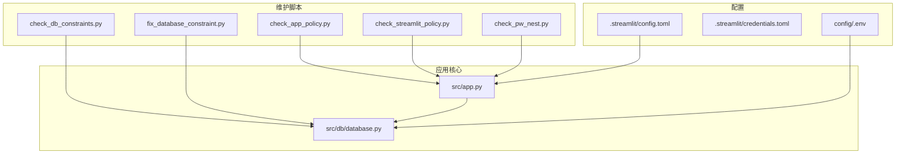
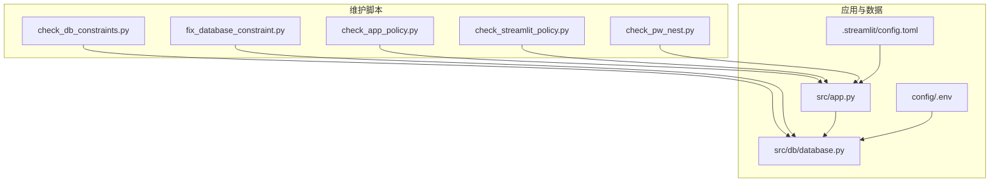
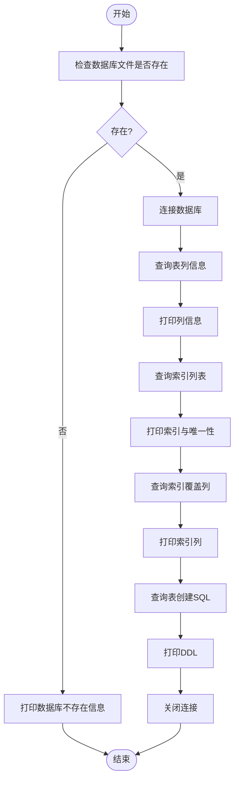
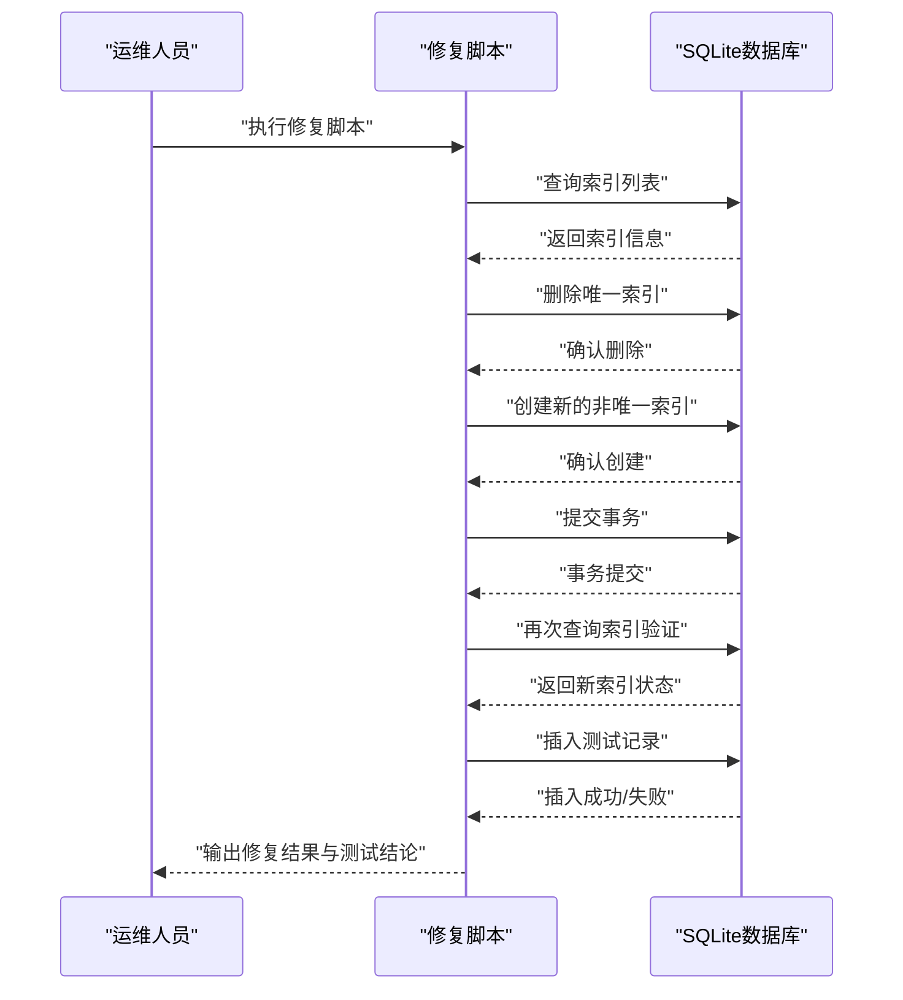
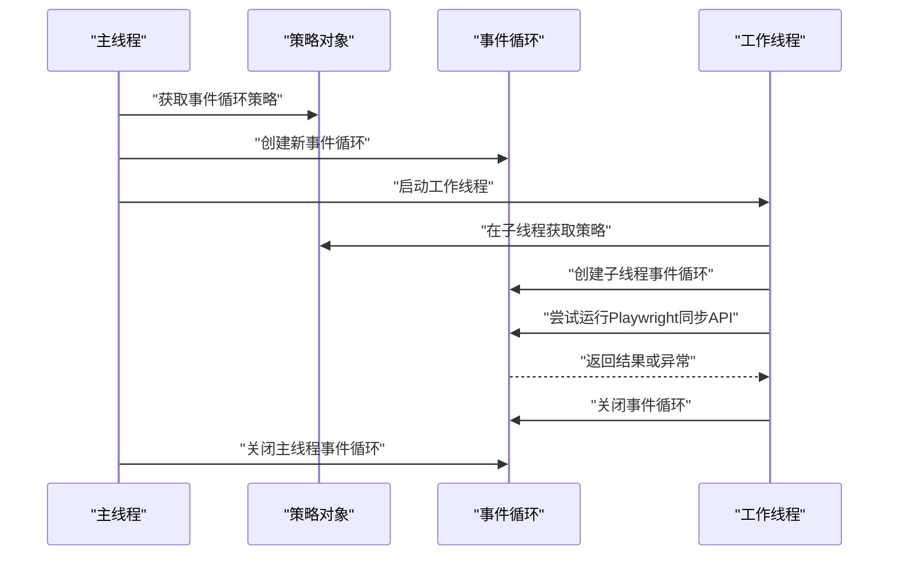
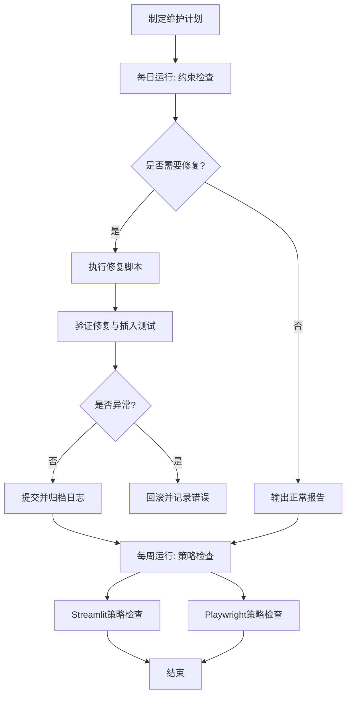
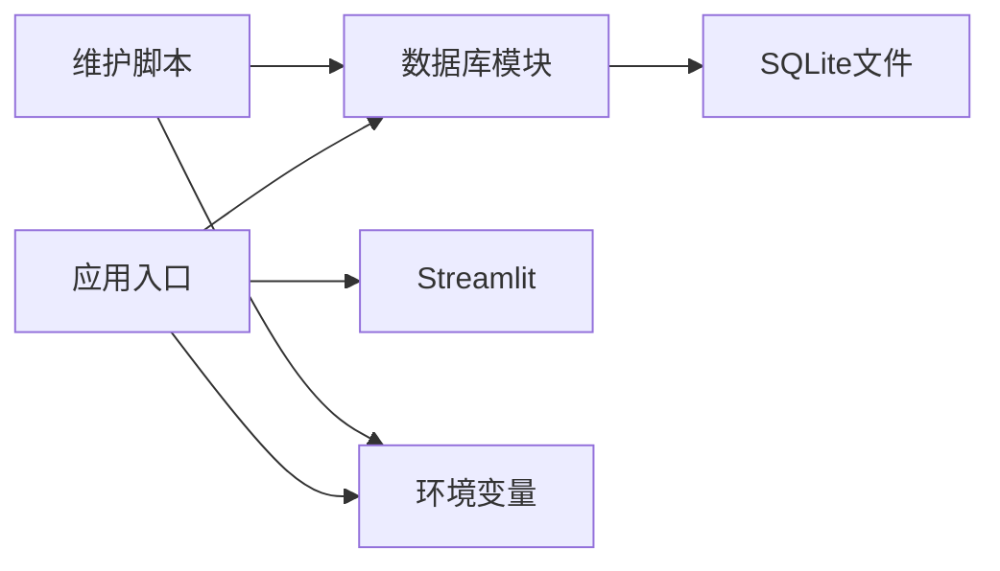

# 系统维护脚本

<cite>
**本文引用的文件**
- [scripts/check_db_constraints.py](file://scripts/check_db_constraints.py)
- [scripts/fix_database_constraint.py](file://scripts/fix_database_constraint.py)
- [scripts/check_app_policy.py](file://scripts/check_app_policy.py)
- [scripts/check_streamlit_policy.py](file://scripts/check_streamlit_policy.py)
- [scripts/check_pw_nest.py](file://scripts/check_pw_nest.py)
- [src/db/database.py](file://src/db/database.py)
- [src/app.py](file://src/app.py)
- [.streamlit/config.toml](file://.streamlit/config.toml)
- [.streamlit/credentials.toml](file://.streamlit/credentials.toml)
- [config/.env](file://config/.env)
</cite>

## 目录
1. [简介](#简介)
2. [项目结构](#项目结构)
3. [核心组件](#核心组件)
4. [架构总览](#架构总览)
5. [详细组件分析](#详细组件分析)
6. [依赖分析](#依赖分析)
7. [性能考虑](#性能考虑)
8. [故障排查指南](#故障排查指南)
9. [结论](#结论)
10. [附录](#附录)

## 简介
本文件面向系统维护与运维工程师，系统化梳理并文档化以下四类维护脚本的功能与实现要点：
- 数据库约束检查脚本：完整性验证、约束检测算法与修复策略
- 数据库约束修复脚本：自动修复机制、安全检查与回滚保护
- 应用策略检查脚本：事件循环策略检查、权限验证、合规性与安全审计
- 系统健康检查：定期维护流程、故障预防与应急响应

文档在保证技术深度的同时，尽量以可读方式呈现，便于不同背景读者理解。

## 项目结构
本项目采用按职责分层的组织方式：
- scripts：系统维护与诊断脚本集合
- src：业务核心模块（数据库ORM、应用入口等）
- config：环境变量与密钥配置
- .streamlit：Streamlit服务端配置
- data：SQLite数据库文件所在目录

图表来源
- [scripts/check_db_constraints.py:1-49](file://scripts/check_db_constraints.py#L1-L49)
- [scripts/fix_database_constraint.py:1-104](file://scripts/fix_database_constraint.py#L1-L104)
- [scripts/check_app_policy.py:1-14](file://scripts/check_app_policy.py#L1-L14)
- [scripts/check_streamlit_policy.py:1-14](file://scripts/check_streamlit_policy.py#L1-L14)
- [scripts/check_pw_nest.py:1-35](file://scripts/check_pw_nest.py#L1-L35)
- [src/db/database.py:1-567](file://src/db/database.py#L1-L567)
- [src/app.py:1-166](file://src/app.py#L1-L166)
- [.streamlit/config.toml:1-6](file://.streamlit/config.toml#L1-L6)
- [.streamlit/credentials.toml:1-3](file://.streamlit/credentials.toml#L1-L3)
- [config/.env:1-20](file://config/.env#L1-L20)

章节来源
- [scripts/check_db_constraints.py:1-49](file://scripts/check_db_constraints.py#L1-L49)
- [scripts/fix_database_constraint.py:1-104](file://scripts/fix_database_constraint.py#L1-L104)
- [scripts/check_app_policy.py:1-14](file://scripts/check_app_policy.py#L1-L14)
- [scripts/check_streamlit_policy.py:1-14](file://scripts/check_streamlit_policy.py#L1-L14)
- [scripts/check_pw_nest.py:1-35](file://scripts/check_pw_nest.py#L1-L35)
- [src/db/database.py:1-567](file://src/db/database.py#L1-L567)
- [src/app.py:1-166](file://src/app.py#L1-L166)
- [.streamlit/config.toml:1-6](file://.streamlit/config.toml#L1-L6)
- [.streamlit/credentials.toml:1-3](file://.streamlit/credentials.toml#L1-L3)
- [config/.env:1-20](file://config/.env#L1-L20)

## 核心组件
- 数据库约束检查脚本：读取SQLite数据库中的表结构、索引与SQL定义，输出当前约束状态，作为修复前的诊断依据。
- 数据库约束修复脚本：基于检查结果执行索引重建与多时间段写入测试，具备事务提交与回滚保护。
- 应用策略检查脚本：检查事件循环策略在不同上下文（应用、Streamlit、Playwright）下的行为，辅助定位并发与异步问题。
- 应用入口与数据库模块：提供统一的数据库连接、表结构初始化与数据操作接口，支撑维护脚本的诊断与修复。

章节来源
- [scripts/check_db_constraints.py:1-49](file://scripts/check_db_constraints.py#L1-L49)
- [scripts/fix_database_constraint.py:1-104](file://scripts/fix_database_constraint.py#L1-L104)
- [scripts/check_app_policy.py:1-14](file://scripts/check_app_policy.py#L1-L14)
- [scripts/check_streamlit_policy.py:1-14](file://scripts/check_streamlit_policy.py#L1-L14)
- [scripts/check_pw_nest.py:1-35](file://scripts/check_pw_nest.py#L1-L35)
- [src/db/database.py:1-567](file://src/db/database.py#L1-L567)
- [src/app.py:1-166](file://src/app.py#L1-L166)

## 架构总览
维护脚本围绕数据库与应用入口协同工作，通过环境配置驱动运行。

图表来源
- [scripts/check_db_constraints.py:1-49](file://scripts/check_db_constraints.py#L1-L49)
- [scripts/fix_database_constraint.py:1-104](file://scripts/fix_database_constraint.py#L1-L104)
- [scripts/check_app_policy.py:1-14](file://scripts/check_app_policy.py#L1-L14)
- [scripts/check_streamlit_policy.py:1-14](file://scripts/check_streamlit_policy.py#L1-L14)
- [scripts/check_pw_nest.py:1-35](file://scripts/check_pw_nest.py#L1-L35)
- [src/db/database.py:1-567](file://src/db/database.py#L1-L567)
- [src/app.py:1-166](file://src/app.py#L1-L166)
- [config/.env:1-20](file://config/.env#L1-L20)
- [.streamlit/config.toml:1-6](file://.streamlit/config.toml#L1-L6)

## 详细组件分析

### 数据库约束检查脚本
- 完整性验证
  - 读取目标表的列信息，输出列名、类型与主键标记
  - 列举索引列表，输出索引名称与唯一性，并进一步列出索引覆盖的列
  - 输出表创建SQL，用于核验约束定义
- 约束检测算法
  - 使用SQLite元数据查询接口获取表结构与索引定义
  - 通过SQL字符串比对识别约束类型（如唯一性）
- 修复策略前置
  - 该脚本不直接修改数据库，仅输出诊断信息，为后续修复脚本提供依据

图表来源
- [scripts/check_db_constraints.py:1-49](file://scripts/check_db_constraints.py#L1-L49)

章节来源
- [scripts/check_db_constraints.py:1-49](file://scripts/check_db_constraints.py#L1-L49)

### 数据库约束修复脚本
- 自动修复机制
  - 先扫描现有索引，输出当前状态
  - 删除特定唯一索引（若存在），避免同一fixture_id下多时间段记录冲突
  - 创建新的非唯一复合索引，提升多时间段查询与写入能力
  - 提交事务并验证修复结果
- 安全检查
  - 在事务块内执行修复，异常时回滚，避免部分成功导致的数据不一致
  - 修复完成后进行插入测试，验证多时间段写入是否正常
- 回滚保护
  - 捕获异常并执行回滚，确保数据库处于一致状态
  - 修复过程严格遵循“先检查、再删除、后创建”的顺序，降低风险

图表来源
- [scripts/fix_database_constraint.py:1-104](file://scripts/fix_database_constraint.py#L1-L104)

章节来源
- [scripts/fix_database_constraint.py:1-104](file://scripts/fix_database_constraint.py#L1-L104)

### 应用策略检查脚本
- 权限验证
  - 检查事件循环策略在主线程与子线程中的行为差异，避免在Windows平台出现不兼容
  - 通过创建独立事件循环，验证策略切换对异步任务的影响
- 合规性检查
  - 在Streamlit与Playwright场景下分别验证事件循环策略，确保嵌套调用不会引发异常
  - 对Playwright同步API的使用进行安全包装，捕获异常并打印堆栈
- 安全审计
  - 记录策略类型与事件循环类型，便于审计与问题定位
  - 通过线程隔离避免跨线程事件循环共享带来的副作用

图表来源
- [scripts/check_app_policy.py:1-14](file://scripts/check_app_policy.py#L1-L14)
- [scripts/check_streamlit_policy.py:1-14](file://scripts/check_streamlit_policy.py#L1-L14)
- [scripts/check_pw_nest.py:1-35](file://scripts/check_pw_nest.py#L1-L35)

章节来源
- [scripts/check_app_policy.py:1-14](file://scripts/check_app_policy.py#L1-L14)
- [scripts/check_streamlit_policy.py:1-14](file://scripts/check_streamlit_policy.py#L1-L14)
- [scripts/check_pw_nest.py:1-35](file://scripts/check_pw_nest.py#L1-L35)

### 系统健康检查（综合维护流程）
- 定期维护流程
  - 周期性运行数据库约束检查脚本，记录表结构与索引状态
  - 根据检查结果决定是否执行修复脚本，修复后进行插入测试
  - 在应用启动前后运行策略检查脚本，确保事件循环策略稳定
- 故障预防
  - 通过索引重建避免唯一约束导致的重复写入失败
  - 通过事务与回滚保护，防止修复过程中的数据不一致
  - 通过策略检查提前发现异步/并发问题
- 应急响应
  - 修复失败时立即回滚，保留现场并输出错误信息
  - 对Playwright相关问题捕获异常并打印堆栈，便于快速定位

图表来源
- [scripts/check_db_constraints.py:1-49](file://scripts/check_db_constraints.py#L1-L49)
- [scripts/fix_database_constraint.py:1-104](file://scripts/fix_database_constraint.py#L1-L104)
- [scripts/check_app_policy.py:1-14](file://scripts/check_app_policy.py#L1-L14)
- [scripts/check_streamlit_policy.py:1-14](file://scripts/check_streamlit_policy.py#L1-L14)
- [scripts/check_pw_nest.py:1-35](file://scripts/check_pw_nest.py#L1-L35)

## 依赖分析
- 组件耦合
  - 维护脚本与数据库模块通过SQLite文件与SQLAlchemy ORM交互
  - 应用入口与数据库模块通过统一的数据库连接与会话管理
- 外部依赖
  - Streamlit用于前端展示与登录流程
  - Python异步生态（asyncio、nest_asyncio）用于事件循环策略与嵌套调用
  - 环境变量提供数据库URL与第三方API密钥

图表来源
- [src/db/database.py:1-567](file://src/db/database.py#L1-L567)
- [src/app.py:1-166](file://src/app.py#L1-L166)
- [config/.env:1-20](file://config/.env#L1-L20)

章节来源
- [src/db/database.py:1-567](file://src/db/database.py#L1-L567)
- [src/app.py:1-166](file://src/app.py#L1-L166)
- [config/.env:1-20](file://config/.env#L1-L20)

## 性能考虑
- 索引设计
  - 通过非唯一复合索引提升多时间段查询效率，减少重复写入阻塞
- 事务控制
  - 修复过程使用事务，异常回滚，避免中间状态污染
- 异步策略
  - 在Windows平台强制事件循环策略，减少子进程与异步任务的兼容性问题
- 日志与审计
  - 通过日志记录策略类型与事件循环类型，便于性能与稳定性分析

## 故障排查指南
- 数据库约束问题
  - 若修复后仍无法插入多条记录，检查索引是否正确重建，确认事务是否提交
  - 如出现唯一约束冲突，确认是否仍有未删除的唯一索引
- 事件循环策略问题
  - 在Windows平台遇到异步任务异常，检查是否应用了事件循环策略修正
  - Playwright相关报错时，查看异常堆栈并确认事件循环是否正确关闭
- 配置问题
  - 确认数据库URL指向正确的SQLite文件路径
  - 检查Streamlit服务端配置是否符合生产要求

章节来源
- [scripts/fix_database_constraint.py:1-104](file://scripts/fix_database_constraint.py#L1-L104)
- [scripts/check_pw_nest.py:1-35](file://scripts/check_pw_nest.py#L1-L35)
- [config/.env:1-20](file://config/.env#L1-L20)
- [.streamlit/config.toml:1-6](file://.streamlit/config.toml#L1-L6)

## 结论
本维护脚本体系覆盖了数据库约束的诊断与修复、应用事件循环策略的检查与加固，以及针对Streamlit与Playwright的异步安全检查。通过标准化的维护流程、事务与回滚保护、以及策略检查与日志审计，能够有效预防与快速响应系统运行中的常见问题，保障系统的稳定性与可维护性。

## 附录
- 快速参考
  - 数据库约束检查：运行检查脚本，核对索引与唯一性
  - 数据库约束修复：在确认后运行修复脚本，验证插入测试
  - 策略检查：在应用启动前后运行策略检查脚本，确保异步安全
- 参考配置
  - 数据库URL与第三方API密钥位于环境变量文件
  - Streamlit服务端配置位于配置文件

章节来源
- [config/.env:1-20](file://config/.env#L1-L20)
- [.streamlit/config.toml:1-6](file://.streamlit/config.toml#L1-L6)
- [.streamlit/credentials.toml:1-3](file://.streamlit/credentials.toml#L1-L3)