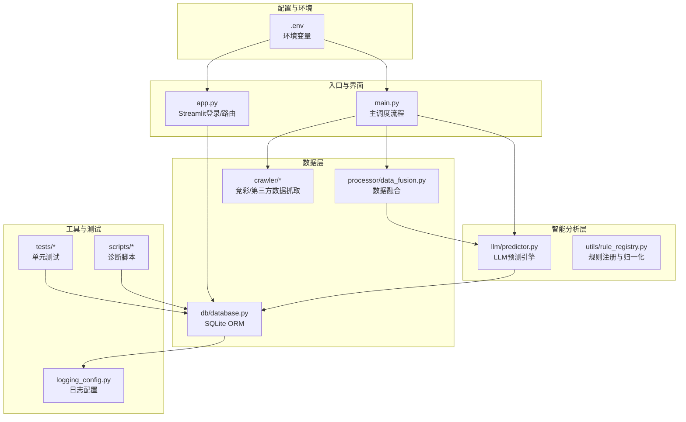
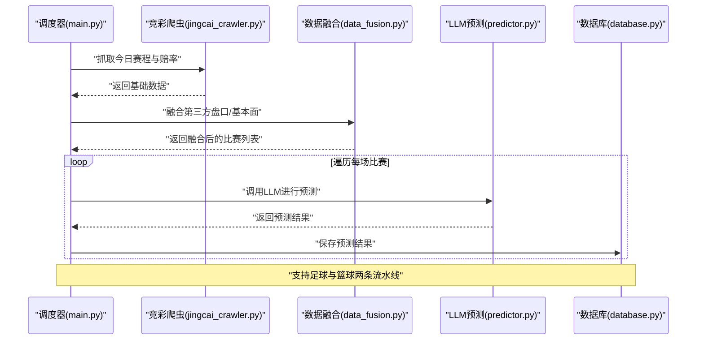
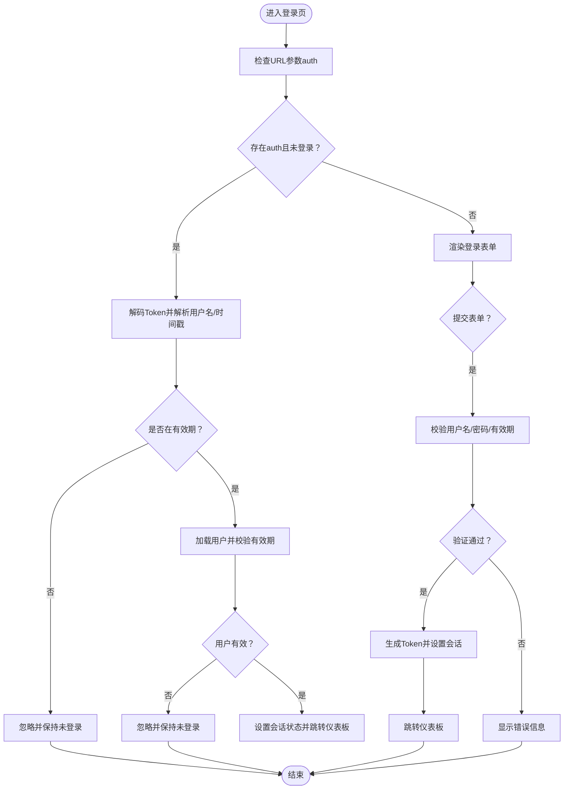
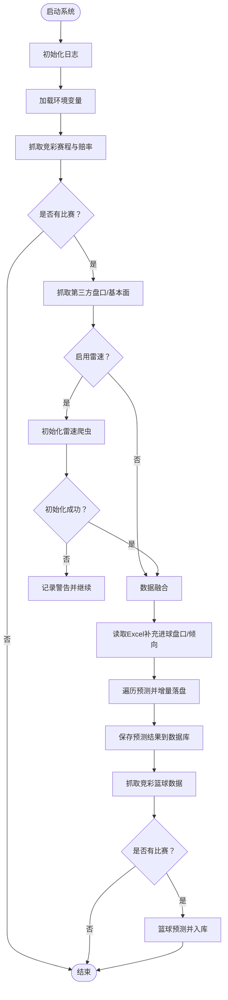
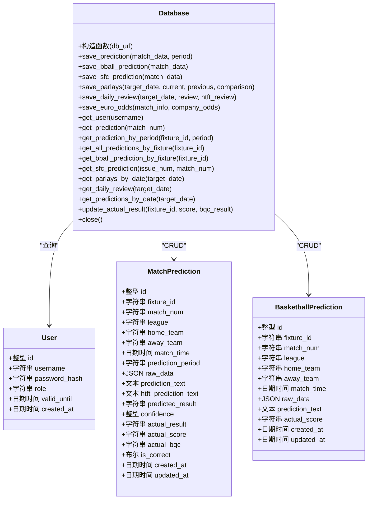
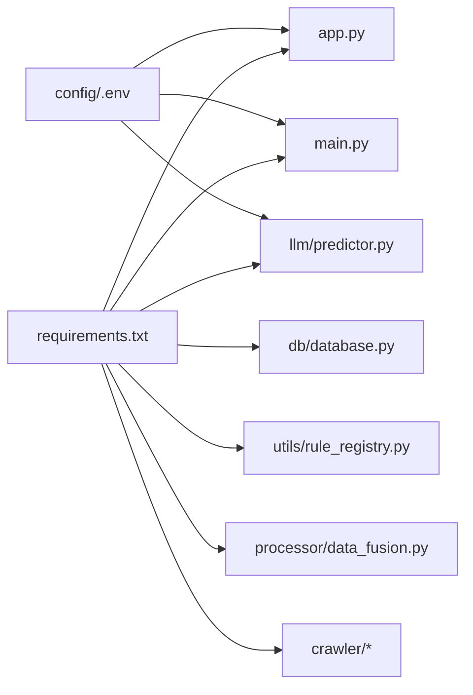

# 代码规范与最佳实践

<cite>
**本文档引用的文件**
- [README.md](file://README.md)
- [requirements.txt](file://requirements.txt)
- [config/.env](file://config/.env)
- [src/main.py](file://src/main.py)
- [src/app.py](file://src/app.py)
- [src/constants.py](file://src/constants.py)
- [src/logging_config.py](file://src/logging_config.py)
- [src/db/database.py](file://src/db/database.py)
- [src/processor/data_fusion.py](file://src/processor/data_fusion.py)
- [src/crawler/jingcai_crawler.py](file://src/crawler/jingcai_crawler.py)
- [src/llm/predictor.py](file://src/llm/predictor.py)
- [src/utils/rule_registry.py](file://src/utils/rule_registry.py)
- [tests/test_database_prediction_extract.py](file://tests/test_database_prediction_extract.py)
- [scripts/test_db.py](file://scripts/test_db.py)
</cite>

## 目录
1. [引言](#引言)
2. [项目结构](#项目结构)
3. [核心组件](#核心组件)
4. [架构总览](#架构总览)
5. [详细组件分析](#详细组件分析)
6. [依赖分析](#依赖分析)
7. [性能考虑](#性能考虑)
8. [故障排查指南](#故障排查指南)
9. [结论](#结论)
10. [附录](#附录)

## 引言
本文件旨在制定并实施统一的代码规范与最佳实践标准，覆盖Python编码规范、命名约定、代码组织原则、模块设计与函数设计规范、错误处理标准、注释与文档字符串要求、日志记录标准、代码审查检查清单、质量保证流程、性能优化与并发安全等方面。该规范以项目现有实现为基础，结合可扩展性与可维护性需求，形成一套适用于本项目的统一标准。

## 项目结构
项目采用分层与功能域结合的组织方式：
- config：存放环境变量与配置文件
- data：本地数据缓存与规则数据
- src：核心业务代码，按功能域划分
  - crawler：数据抓取模块
  - processor：数据融合与预处理
  - llm：大模型调用与提示词工程
  - db：数据库抽象与持久化
  - utils：工具与规则引擎
  - pages：Streamlit页面（可选）
  - 入口：app.py（Web应用）、main.py（批处理调度）
- tests：单元测试
- scripts：辅助脚本与诊断工具
- logs：日志输出目录

图表来源
- [src/app.py:1-166](file://src/app.py#L1-L166)
- [src/main.py:1-183](file://src/main.py#L1-L183)
- [src/processor/data_fusion.py:1-108](file://src/processor/data_fusion.py#L1-L108)
- [src/db/database.py:1-567](file://src/db/database.py#L1-L567)
- [src/llm/predictor.py:1-800](file://src/llm/predictor.py#L1-L800)
- [src/utils/rule_registry.py:1-278](file://src/utils/rule_registry.py#L1-L278)
- [src/logging_config.py:1-30](file://src/logging_config.py#L1-L30)
- [config/.env:1-20](file://config/.env#L1-L20)

章节来源
- [README.md:24-41](file://README.md#L24-L41)
- [requirements.txt:1-16](file://requirements.txt#L1-L16)

## 核心组件
- 应用入口与界面
  - app.py：登录认证、会话状态管理、URL参数解码、Token生成与校验、页面路由与跳转
  - main.py：主流程编排，抓取竞彩/第三方数据、数据融合、LLM预测、结果入库、篮球预测与入库
- 数据层
  - database.py：SQLAlchemy ORM模型与数据库操作封装，含用户、预测、串关、复盘、欧赔历史等表
  - data_fusion.py：竞彩数据与第三方数据融合，可选注入雷速数据
  - jingcai_crawler.py：竞彩赛程与赔率抓取，支持历史数据与赛果抓取
- 智能分析层
  - predictor.py：LLM预测引擎，规则构建、数据格式化、市场锚点、微信号检测、预测偏向归一化
  - rule_registry.py：规则ID生成、条件表达式归一化、动作类型标准化
- 工具与配置
  - logging_config.py：日志初始化（终端+文件，按天轮转，保留7天）
  - constants.py：共享常量（如认证Token有效期）

章节来源
- [src/app.py:1-166](file://src/app.py#L1-L166)
- [src/main.py:1-183](file://src/main.py#L1-L183)
- [src/db/database.py:1-567](file://src/db/database.py#L1-L567)
- [src/processor/data_fusion.py:1-108](file://src/processor/data_fusion.py#L1-L108)
- [src/crawler/jingcai_crawler.py:1-330](file://src/crawler/jingcai_crawler.py#L1-L330)
- [src/llm/predictor.py:1-800](file://src/llm/predictor.py#L1-L800)
- [src/utils/rule_registry.py:1-278](file://src/utils/rule_registry.py#L1-L278)
- [src/logging_config.py:1-30](file://src/logging_config.py#L1-L30)
- [src/constants.py:1-5](file://src/constants.py#L1-L5)

## 架构总览
系统采用“数据采集-数据融合-智能分析-存储-展示/通知”的分层架构。主流程在main.py中编排，通过crawler获取原始数据，processor进行融合与增强，llm进行推理分析，db持久化结果，app.py提供登录与路由，logging_config统一日志输出。

图表来源
- [src/main.py:34-136](file://src/main.py#L34-L136)
- [src/processor/data_fusion.py:61-108](file://src/processor/data_fusion.py#L61-L108)
- [src/crawler/jingcai_crawler.py:13-48](file://src/crawler/jingcai_crawler.py#L13-L48)
- [src/db/database.py:256-305](file://src/db/database.py#L256-L305)

## 详细组件分析

### 组件A：登录与会话管理（app.py）
- 设计要点
  - 使用base64编码的Token携带用户名与时间戳，结合AUTH_TOKEN_TTL进行有效期控制
  - 通过URL参数auth恢复登录状态，避免重复登录
  - 使用Session State管理登录态，支持登出与重定向
- 错误处理
  - 解码失败、过期、授权到期均进行容错处理，避免抛出异常
- 命名与组织
  - 函数命名清晰：encode_auth_token、decode_auth_token、check_login
  - 常量集中于constants.py，便于统一修改

图表来源
- [src/app.py:51-109](file://src/app.py#L51-L109)
- [src/constants.py:3-5](file://src/constants.py#L3-L5)

章节来源
- [src/app.py:1-166](file://src/app.py#L1-L166)
- [src/constants.py:1-5](file://src/constants.py#L1-L5)

### 组件B：主流程编排（main.py）
- 设计要点
  - 分阶段执行：抓取竞彩→抓取第三方→数据融合→Excel补充→LLM预测→入库→篮球流水线
  - 条件化启用第三方数据源（如雷速），失败时记录警告并继续
  - 对预测结果进行增量落盘，保证中间状态可恢复
- 错误处理
  - 环境变量加载失败、第三方数据源异常、Excel读取异常均捕获并记录日志
- 性能与并发
  - 使用同步流程，避免多进程/多线程复杂度；如需并发可在数据抓取层引入异步或限流策略

图表来源
- [src/main.py:34-177](file://src/main.py#L34-L177)

章节来源
- [src/main.py:1-183](file://src/main.py#L1-L183)

### 组件C：数据库与ORM（database.py）
- 设计要点
  - 使用SQLAlchemy ORM定义多张表（用户、足球预测、篮球预测、胜负彩、串关、复盘、欧赔历史）
  - 提供统一的保存/查询方法，支持时间段标识（pre_24h、pre_12h、final、repredicted）
  - 对历史字段进行兼容解析（支持多种时间格式与ISO格式）
- 错误处理
  - 事务异常时回滚并打印错误，避免脏数据
- 性能与并发
  - 使用连接池与会话管理；如需高并发建议引入连接池配置与读写分离

图表来源
- [src/db/database.py:58-198](file://src/db/database.py#L58-L198)
- [src/db/database.py:200-562](file://src/db/database.py#L200-L562)

章节来源
- [src/db/database.py:1-567](file://src/db/database.py#L1-L567)

### 组件D：数据融合（data_fusion.py）
- 设计要点
  - 支持按环境开关启用/禁用雷速数据注入
  - 将第三方盘口、基本面、伤停、交锋、进球分布、情报等数据注入到比赛对象
- 错误处理
  - 雷速初始化失败或注入异常时记录警告并继续

章节来源
- [src/processor/data_fusion.py:1-108](file://src/processor/data_fusion.py#L1-L108)

### 组件E：竞彩爬虫（jingcai_crawler.py）
- 设计要点
  - 支持今日/历史数据抓取，解析HTML表格，提取赔率与赛果
  - 支持半全场赔率与赛果的合并
- 错误处理
  - 请求失败、解析异常均捕获并记录日志

章节来源
- [src/crawler/jingcai_crawler.py:1-330](file://src/crawler/jingcai_crawler.py#L1-L330)

### 组件F：LLM预测引擎（predictor.py）
- 设计要点
  - 动态规则构建：根据盘口、联赛、变化趋势组合提示词
  - 市场锚点：亚赔让球方与欧赔实力方的判定
  - 微信号检测：超深盘死水、半球生死盘、平手僵持、赔率矛盾、盘水背离、浅盘诱盘等
  - 预测偏向归一化：将自然语言偏向映射到胜/平/负及其组合
- 错误处理
  - 规则解析与条件表达式转换失败时抛出异常，便于规则编辑阶段发现

章节来源
- [src/llm/predictor.py:1-800](file://src/llm/predictor.py#L1-L800)

### 组件G：规则注册与归一化（rule_registry.py）
- 设计要点
  - 自动生成唯一规则ID，支持中文标题归一化
  - 归一化条件表达式，将自然语言别名映射为可执行的Python布尔表达式
  - 动作类型标准化：熔断、强制双选、限制置信度、禁止推翻、要求解释等

章节来源
- [src/utils/rule_registry.py:1-278](file://src/utils/rule_registry.py#L1-L278)

### 组件H：日志配置（logging_config.py）
- 设计要点
  - 初始化日志系统，移除默认handler，避免重复输出
  - 终端输出INFO级别并着色，文件输出按天轮转，保留7天
  - 全局单例初始化，避免重复配置

章节来源
- [src/logging_config.py:1-30](file://src/logging_config.py#L1-L30)

## 依赖分析
- 外部依赖
  - requests、beautifulsoup4、pandas、openai、sqlalchemy、python-dotenv、streamlit、schedule、loguru、playwright、nest_asyncio、simpleeval、openpyxl
- 内部依赖
  - app.py依赖logging_config、db.database、constants
  - main.py依赖logging_config、crawler、processor、llm、db
  - db.database被各模块广泛使用
  - predictor依赖utils.rule_registry与.env中的LLM配置

图表来源
- [requirements.txt:1-16](file://requirements.txt#L1-L16)
- [config/.env:1-20](file://config/.env#L1-L20)

章节来源
- [requirements.txt:1-16](file://requirements.txt#L1-L16)
- [config/.env:1-20](file://config/.env#L1-L20)

## 性能考虑
- IO密集与网络请求
  - 爬虫与API调用应设置合理超时与重试策略，避免阻塞主线程
  - 对第三方数据源增加限速与退避机制，防止触发反爬或服务端压力
- 数据库
  - 使用事务批量插入，减少提交次数；对高频查询建立索引（如fixture_id、match_time、target_date）
  - SQLite适合小规模数据，生产化可考虑PostgreSQL/MySQL
- LLM调用
  - 控制上下文长度，拆分长对话；对昂贵调用增加缓存与重用
- 并发与异步
  - 当前为同步流程；如需并发，可在数据抓取层引入异步与连接池，注意线程安全与锁竞争
- 内存管理
  - 避免一次性加载超大JSON；采用流式处理与增量落盘
  - 及时释放临时对象与关闭爬虫资源

## 故障排查指南
- 登录与会话
  - 检查.env中的密钥与URL；确认Token有效期与时间戳解析
- 数据抓取
  - 竞彩/第三方接口变更导致解析失败，查看日志中的WARNING与ERROR
  - 雷速注入失败时，确认ENABLE_LEISU开关与网络连通性
- 数据库
  - 使用scripts/test_db.py验证数据库连接与表结构；检查列是否存在（如predicted_result）
- LLM与规则
  - 规则条件表达式非法会抛出异常，检查rule_registry的条件归一化逻辑
- 日志
  - 查看logs/app.log，按日期轮转定位问题时间点

章节来源
- [scripts/test_db.py:1-9](file://scripts/test_db.py#L1-L9)
- [src/logging_config.py:19-29](file://src/logging_config.py#L19-L29)

## 结论
本规范以项目现有实现为基础，明确了编码风格、命名约定、模块设计、函数设计、错误处理、注释与文档字符串、日志标准、代码审查与质量保证流程、性能优化与并发安全等关键方面。建议在团队内推广并持续演进，结合自动化工具（如lint、type check、静态分析、CI）保障一致性与质量。

## 附录

### A. Python编码规范与命名约定
- 文件与模块
  - 模块名使用小写与下划线，避免缩写；功能域清晰分包
  - 入口文件使用main.py、app.py等语义化命名
- 类与函数
  - 类名使用PascalCase；函数/方法使用snake_case
  - 私有成员以下划线前缀；公共API尽量简洁明确
- 常量
  - 常量使用UPPER_CASE；共享常量集中于constants.py
- 变量
  - 变量名语义化，避免单字母；布尔变量使用is_/has_等前缀

### B. 代码组织原则
- 分层清晰：数据采集、处理、分析、存储、展示各司其职
- 单一职责：每个模块/类聚焦一个领域，避免“上帝类”
- 可测试性：函数尽量纯函数化，必要时通过依赖注入替换外部依赖
- 可配置性：敏感信息与可变参数放入.env或配置文件

### C. 函数设计规范
- 输入输出
  - 明确参数类型与默认值；返回值统一格式（成功/失败+消息）
- 异常处理
  - 明确边界异常，捕获后记录日志并向上抛出或返回错误码
- 文档字符串
  - 函数/类需提供简要说明、参数、返回值与异常说明

### D. 错误处理标准
- 统一使用try/except捕获异常，记录日志并进行降级处理
- 对外部依赖失败进行告警与重试策略
- 数据库事务失败必须回滚并记录错误

### E. 注释与文档字符串要求
- 函数/类注释：描述用途、输入输出、异常、注意事项
- 关键流程注释：解释业务背景与决策依据
- TODO/FIXME：短期方案与遗留问题需明确责任人与截止时间

### F. 日志记录标准
- 日志级别：DEBUG/INFO/WARNING/ERROR；避免滥用DEBUG
- 输出格式：包含时间、级别、模块名、函数名、行号与消息
- 文件轮转：按天轮转，保留7天；避免日志过大

### G. 代码审查检查清单
- 代码风格：PEP8、命名一致性、导入顺序
- 安全性：敏感信息不硬编码、Token有效期、最小权限
- 性能：IO与网络请求超时、缓存与批处理、索引与查询优化
- 可靠性：异常捕获与回滚、幂等性、重试与退避
- 可测试性：可注入依赖、Mock外部调用、覆盖关键分支
- 文档：注释与文档字符串完整、README更新

### H. 质量保证流程
- 提交前自检：格式化、静态检查、单元测试
- CI集成：自动运行测试与覆盖率检查
- 发布前评审：关键模块与外部依赖变更评审
- 回归测试：数据库schema变更与规则更新回归