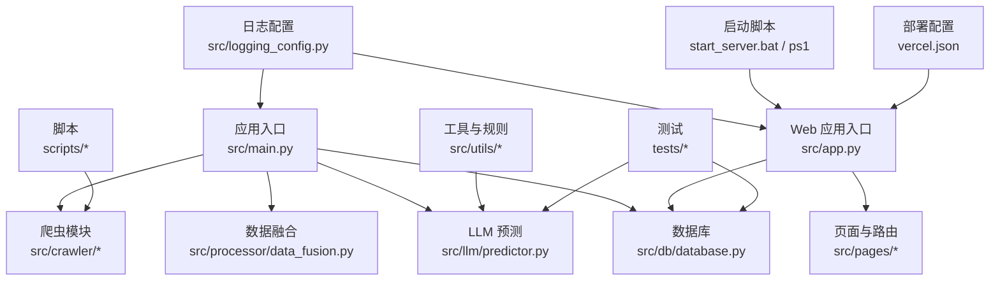
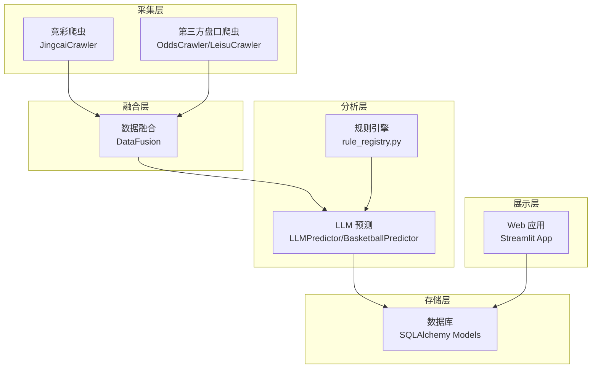
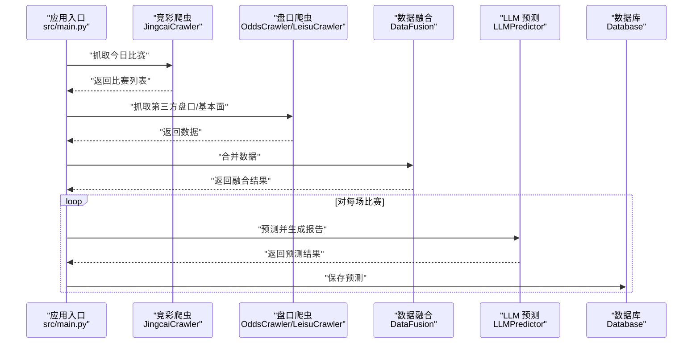
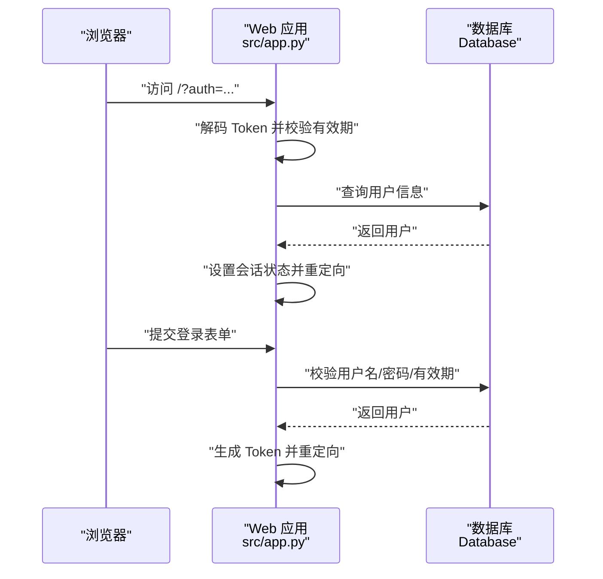
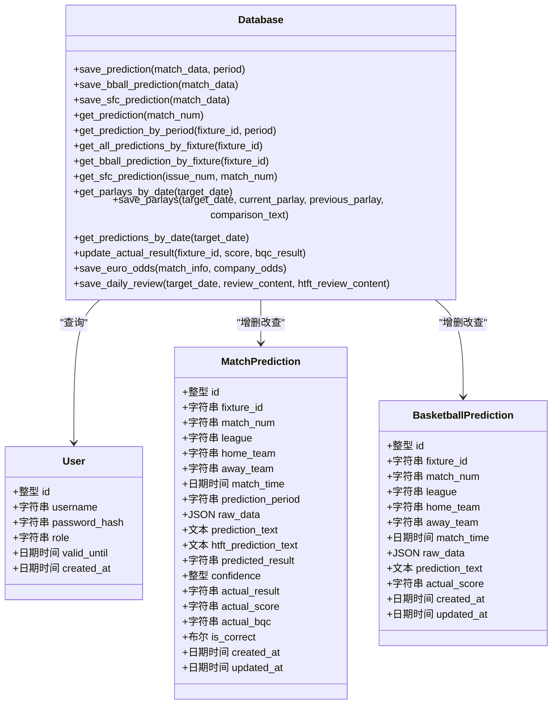
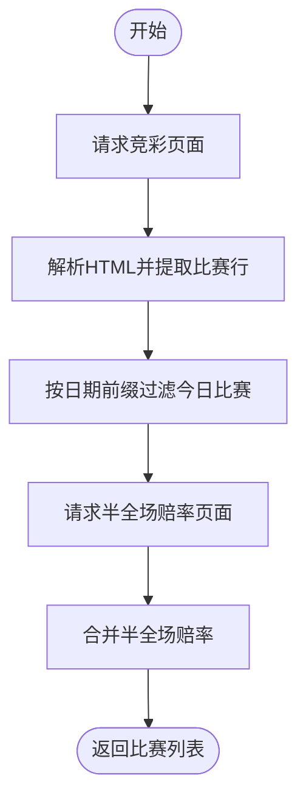
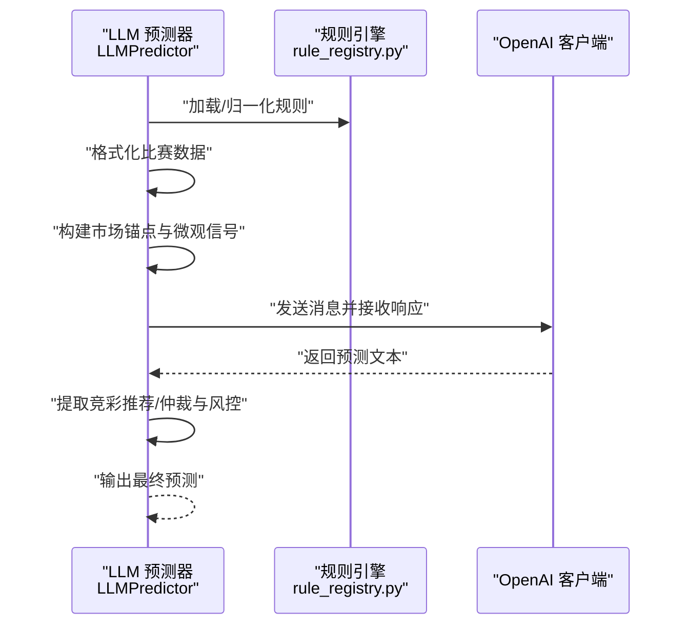
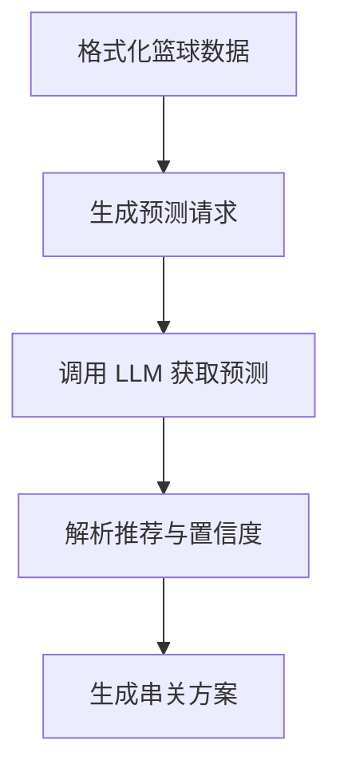
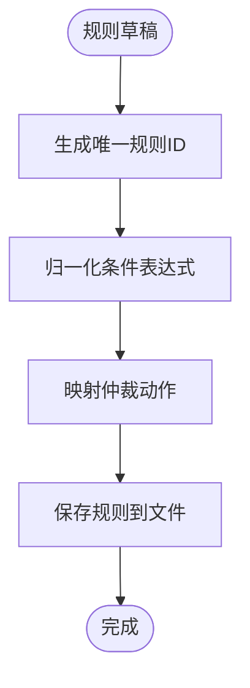
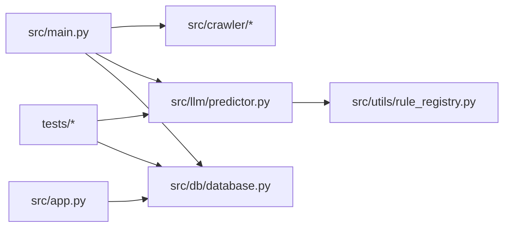

# 开发指南

<cite>
**本文引用的文件**   
- [src/main.py](file://src/main.py)
- [src/app.py](file://src/app.py)
- [src/db/database.py](file://src/db/database.py)
- [src/crawler/jingcai_crawler.py](file://src/crawler/jingcai_crawler.py)
- [src/llm/predictor.py](file://src/llm/predictor.py)
- [src/llm/bball_predictor.py](file://src/llm/bball_predictor.py)
- [src/logging_config.py](file://src/logging_config.py)
- [src/constants.py](file://src/constants.py)
- [src/utils/rule_registry.py](file://src/utils/rule_registry.py)
- [tests/test_predictor_rules.py](file://tests/test_predictor_rules.py)
- [tests/test_database_prediction_extract.py](file://tests/test_database_prediction_extract.py)
- [scripts/test_streamlit_loop.py](file://scripts/test_streamlit_loop.py)
- [start_server.bat](file://start_server.bat)
- [start_server.ps1](file://start_server.ps1)
- [vercel.json](file://vercel.json)
</cite>

## 目录
1. [简介](#简介)
2. [项目结构](#项目结构)
3. [核心组件](#核心组件)
4. [架构总览](#架构总览)
5. [详细组件分析](#详细组件分析)
6. [依赖分析](#依赖分析)
7. [性能考虑](#性能考虑)
8. [故障排查指南](#故障排查指南)
9. [结论](#结论)
10. [附录](#附录)

## 简介
本开发指南面向开发团队，旨在提供从环境搭建、代码规范、测试策略、代码审查、版本控制与发布管理，到新功能开发与模块扩展、API 设计原则、调试与性能分析、问题排查以及贡献者协作规范的完整指引。项目是一个集成了数据采集、数据融合、LLM 预测、数据库持久化与 Streamlit 可视化的综合预测系统，覆盖足彩与竞彩篮球两大业务域。

## 项目结构
项目采用按功能域划分的目录组织方式，核心模块包括：
- 应用入口与调度：src/main.py
- Web 应用入口：src/app.py
- 数据库与模型：src/db/database.py
- 爬虫模块：src/crawler/*
- LLM 预测模块：src/llm/*
- 工具与规则：src/utils/*
- 日志配置：src/logging_config.py
- 常量：src/constants.py
- 测试：tests/*
- 脚本：scripts/*
- 启动脚本：start_server.bat、start_server.ps1
- 部署配置：vercel.json

图表来源
- [src/main.py:1-183](file://src/main.py#L1-L183)
- [src/app.py:1-166](file://src/app.py#L1-L166)
- [src/db/database.py:1-567](file://src/db/database.py#L1-L567)
- [src/logging_config.py:1-30](file://src/logging_config.py#L1-L30)
- [vercel.json:1-1](file://vercel.json#L1-L1)

章节来源
- [src/main.py:1-183](file://src/main.py#L1-L183)
- [src/app.py:1-166](file://src/app.py#L1-L166)
- [src/db/database.py:1-567](file://src/db/database.py#L1-L567)
- [src/logging_config.py:1-30](file://src/logging_config.py#L1-L30)
- [vercel.json:1-1](file://vercel.json#L1-L1)

## 核心组件
- 应用入口与调度：负责定时任务编排、数据采集、数据融合、LLM 预测、缓存与数据库落库。
- Web 应用入口：基于 Streamlit 的登录认证与页面路由，提供预测看板与管理页面。
- 数据库：基于 SQLAlchemy 的 ORM 模型，支持多表结构与历史窗口查询。
- 爬虫：竞彩官方数据、第三方基本面与盘口数据抓取与解析。
- LLM 预测：规则驱动的动态 Prompt 构建、盘口与基本面分析、仲裁与风控。
- 工具与规则：规则注册、ID 生成、条件表达式归一化、仲裁动作映射。
- 日志：统一日志配置，终端与文件双输出，按天轮转。
- 测试：规则与数据库提取逻辑的单元测试。

章节来源
- [src/main.py:34-136](file://src/main.py#L34-L136)
- [src/app.py:94-108](file://src/app.py#L94-L108)
- [src/db/database.py:200-307](file://src/db/database.py#L200-L307)
- [src/crawler/jingcai_crawler.py:13-47](file://src/crawler/jingcai_crawler.py#L13-L47)
- [src/llm/predictor.py:20-46](file://src/llm/predictor.py#L20-L46)
- [src/utils/rule_registry.py:102-176](file://src/utils/rule_registry.py#L102-L176)
- [src/logging_config.py:8-29](file://src/logging_config.py#L8-L29)

## 架构总览
系统采用“采集-融合-分析-存储-展示”的分层架构：
- 采集层：爬虫模块抓取竞彩与第三方数据。
- 融合层：数据融合模块整合多源数据。
- 分析层：LLM 预测模块基于规则与盘口/基本面进行分析。
- 存储层：SQLite 数据库存储预测与历史数据。
- 展示层：Streamlit Web 应用提供登录、看板与管理页面。

图表来源
- [src/crawler/jingcai_crawler.py:13-47](file://src/crawler/jingcai_crawler.py#L13-L47)
- [src/llm/predictor.py:20-46](file://src/llm/predictor.py#L20-L46)
- [src/utils/rule_registry.py:102-176](file://src/utils/rule_registry.py#L102-L176)
- [src/db/database.py:200-307](file://src/db/database.py#L200-L307)
- [src/app.py:94-108](file://src/app.py#L94-L108)

## 详细组件分析

### 应用入口与调度（src/main.py）
- 职责：按阶段执行数据采集、融合、LLM 预测、缓存与数据库落库。
- 关键流程：
  - 阶段1-2：抓取竞彩官方赛程与赔率。
  - 阶段3：抓取第三方基本面与盘口数据并融合。
  - 阶段4：调用 LLM 进行预测，逐步写回缓存。
  - 阶段5：将预测结果保存至数据库。
  - 篮球部分：独立流程，拉取 NBA 基础数据并预测。

图表来源
- [src/main.py:34-136](file://src/main.py#L34-L136)
- [src/crawler/jingcai_crawler.py:13-47](file://src/crawler/jingcai_crawler.py#L13-L47)
- [src/db/database.py:256-304](file://src/db/database.py#L256-L304)

章节来源
- [src/main.py:34-136](file://src/main.py#L34-L136)

### Web 应用入口（src/app.py）
- 职责：登录认证、Token 生成与校验、页面路由与导航。
- 关键流程：
  - 从 URL 查询参数恢复登录状态（带有效期校验）。
  - 用户登录后生成带时间戳的 Token，跳转至 Dashboard。
  - 退出登录时清理会话状态与查询参数。

图表来源
- [src/app.py:64-82](file://src/app.py#L64-L82)
- [src/app.py:94-108](file://src/app.py#L94-L108)
- [src/db/database.py:309-310](file://src/db/database.py#L309-L310)

章节来源
- [src/app.py:64-82](file://src/app.py#L64-L82)
- [src/app.py:94-108](file://src/app.py#L94-L108)
- [src/constants.py:3-4](file://src/constants.py#L3-L4)

### 数据库与模型（src/db/database.py）
- 职责：ORM 模型定义、表结构迁移、数据读写与查询。
- 关键实体：用户、足球预测、篮球预测、胜负彩预测、每日串关、每日复盘、欧赔历史。
- 关键方法：保存/更新预测、提取竞彩推荐、按日期窗口查询、更新实际赛果、保存欧赔历史、保存/更新每日串关与复盘。

图表来源
- [src/db/database.py:58-126](file://src/db/database.py#L58-L126)
- [src/db/database.py:200-307](file://src/db/database.py#L200-L307)

章节来源
- [src/db/database.py:58-126](file://src/db/database.py#L58-L126)
- [src/db/database.py:200-307](file://src/db/database.py#L200-L307)

### 竞彩爬虫（src/crawler/jingcai_crawler.py）
- 职责：抓取竞彩官方赛程、赔率与半全场数据，支持历史数据与赛果抓取。
- 关键流程：请求页面 -> 解析 HTML -> 提取比赛信息与赔率 -> 合并半全场赔率 -> 返回结构化数据。

图表来源
- [src/crawler/jingcai_crawler.py:13-47](file://src/crawler/jingcai_crawler.py#L13-L47)
- [src/crawler/jingcai_crawler.py:122-148](file://src/crawler/jingcai_crawler.py#L122-L148)

章节来源
- [src/crawler/jingcai_crawler.py:13-47](file://src/crawler/jingcai_crawler.py#L13-L47)
- [src/crawler/jingcai_crawler.py:122-148](file://src/crawler/jingcai_crawler.py#L122-L148)

### LLM 预测（src/llm/predictor.py）
- 职责：加载 .env 配置，构建动态规则与 Prompt，调用 LLM 进行预测，提取竞彩推荐并进行仲裁与风控。
- 关键流程：加载规则 -> 格式化数据 -> 构建市场锚点 -> 微观信号检测 -> 仲裁与风控 -> 输出预测报告。

图表来源
- [src/llm/predictor.py:20-46](file://src/llm/predictor.py#L20-L46)
- [src/utils/rule_registry.py:102-176](file://src/utils/rule_registry.py#L102-L176)

章节来源
- [src/llm/predictor.py:20-46](file://src/llm/predictor.py#L20-L46)
- [src/utils/rule_registry.py:102-176](file://src/utils/rule_registry.py#L102-L176)

### 篮球预测（src/llm/bball_predictor.py）
- 职责：针对竞彩篮球的系统化分析 Prompt，涵盖体能、伤停、盘口与大小分逻辑，支持生成串关方案。
- 关键流程：格式化篮球数据 -> 生成预测 -> 解析推荐 -> 生成串关方案。

图表来源
- [src/llm/bball_predictor.py:92-122](file://src/llm/bball_predictor.py#L92-L122)
- [src/llm/bball_predictor.py:166-197](file://src/llm/bball_predictor.py#L166-L197)
- [src/llm/bball_predictor.py:199-281](file://src/llm/bball_predictor.py#L199-L281)

章节来源
- [src/llm/bball_predictor.py:92-122](file://src/llm/bball_predictor.py#L92-L122)
- [src/llm/bball_predictor.py:166-197](file://src/llm/bball_predictor.py#L166-L197)
- [src/llm/bball_predictor.py:199-281](file://src/llm/bball_predictor.py#L199-L281)

### 工具与规则（src/utils/rule_registry.py）
- 职责：规则 ID 生成、条件表达式归一化、仲裁动作映射、规则加载与保存。
- 关键流程：生成唯一规则 ID -> 归一化条件表达式 -> 映射动作类型 -> 保存规则。

图表来源
- [src/utils/rule_registry.py:57-70](file://src/utils/rule_registry.py#L57-L70)
- [src/utils/rule_registry.py:102-176](file://src/utils/rule_registry.py#L102-L176)
- [src/utils/rule_registry.py:221-245](file://src/utils/rule_registry.py#L221-L245)

章节来源
- [src/utils/rule_registry.py:57-70](file://src/utils/rule_registry.py#L57-L70)
- [src/utils/rule_registry.py:102-176](file://src/utils/rule_registry.py#L102-L176)
- [src/utils/rule_registry.py:221-245](file://src/utils/rule_registry.py#L221-L245)

### 日志配置（src/logging_config.py）
- 职责：统一日志初始化，终端 INFO 级别输出与文件按天轮转。
- 关键流程：创建日志目录 -> 移除默认处理器 -> 添加终端与文件处理器 -> 初始化完成。

章节来源
- [src/logging_config.py:8-29](file://src/logging_config.py#L8-L29)

## 依赖分析
- 组件耦合：
  - 应用入口与爬虫/融合/LLM/数据库存在直接调用关系。
  - Web 应用与数据库存在查询与写入关系。
  - 规则引擎为预测模块提供条件与动作归一化。
- 外部依赖：
  - OpenAI 客户端用于 LLM 调用。
  - SQLAlchemy 用于数据库访问。
  - Streamlit 用于 Web 展示。
  - requests/BeautifulSoup 用于网页抓取。
- 潜在循环依赖：当前模块间为单向调用，未发现循环导入。

图表来源
- [src/main.py:25-32](file://src/main.py#L25-L32)
- [src/app.py:29-30](file://src/app.py#L29-L30)
- [src/llm/predictor.py:16-18](file://src/llm/predictor.py#L16-L18)
- [src/utils/rule_registry.py:1-4](file://src/utils/rule_registry.py#L1-L4)

章节来源
- [src/main.py:25-32](file://src/main.py#L25-L32)
- [src/app.py:29-30](file://src/app.py#L29-L30)
- [src/llm/predictor.py:16-18](file://src/llm/predictor.py#L16-L18)
- [src/utils/rule_registry.py:1-4](file://src/utils/rule_registry.py#L1-L4)

## 性能考虑
- I/O 密集：爬虫与 LLM 调用为主要性能瓶颈，建议：
  - 使用异步与并发策略（当前入口已应用 nest_asyncio）。
  - 缓存第三方数据与 LLM 响应，减少重复请求。
  - 优化数据库写入批处理与索引。
- 内存与序列化：大量 JSON 数据融合与预测报告生成，建议：
  - 分批处理与增量写回缓存文件。
  - 控制 Prompt 长度与上下文窗口。
- 日志与监控：统一日志与文件轮转，便于性能分析与问题定位。

## 故障排查指南
- 登录与认证问题：
  - 检查 Token 有效期与数据库用户有效性。
  - 确认 .env 中 LLM API 配置正确。
- 爬虫异常：
  - 检查竞彩页面结构变更与编码问题。
  - 验证第三方数据源可用性与反爬策略。
- 数据库问题：
  - 确认 SQLite 路径与权限，检查列补齐逻辑。
  - 使用测试用例验证推荐提取逻辑。
- LLM 调用失败：
  - 核对 API Key 与 Base URL。
  - 检查网络连通性与代理设置。
- Web 应用启动：
  - 使用启动脚本设置 STREAMLIT_CONFIG_DIR。
  - 确认虚拟环境与依赖安装。

章节来源
- [src/app.py:64-82](file://src/app.py#L64-L82)
- [src/db/database.py:200-307](file://src/db/database.py#L200-L307)
- [tests/test_database_prediction_extract.py:4-24](file://tests/test_database_prediction_extract.py#L4-L24)
- [start_server.bat:10-11](file://start_server.bat#L10-L11)
- [start_server.ps1:7-9](file://start_server.ps1#L7-L9)

## 结论
本指南提供了从环境搭建到开发、测试、部署与运维的全流程规范。建议团队遵循统一的代码风格、测试策略与审查流程，持续完善规则引擎与预测模型，保障系统的稳定性与可维护性。

## 附录

### 开发环境搭建
- 安装 Python 与虚拟环境，激活 venv。
- 安装依赖：requests、beautifulsoup4、sqlalchemy、openai、streamlit、loguru、python-dotenv、pandas 等。
- 准备 .env 文件（包含 LLM API Key、Base URL、模型名等）。
- 启动 Web 应用：使用启动脚本设置配置目录并运行 Streamlit。

章节来源
- [start_server.bat:10-11](file://start_server.bat#L10-L11)
- [start_server.ps1:7-9](file://start_server.ps1#L7-L9)

### 代码规范与最佳实践
- 命名规范：模块与类使用清晰语义，函数与变量描述性强。
- 错误处理：捕获异常并记录日志，避免静默失败。
- 配置管理：敏感信息放入 .env，避免硬编码。
- 日志规范：统一使用 loguru，按级别输出并轮转。

章节来源
- [src/logging_config.py:8-29](file://src/logging_config.py#L8-L29)

### 测试策略与编写
- 单元测试：覆盖规则加载、仲裁评估、推荐提取等关键逻辑。
- 集成测试：模拟爬虫与数据库交互，验证端到端流程。
- 示例测试文件：
  - 规则与仲裁：tests/test_predictor_rules.py
  - 推荐提取：tests/test_database_prediction_extract.py
  - Streamlit 循环模拟：scripts/test_streamlit_loop.py

章节来源
- [tests/test_predictor_rules.py:11-90](file://tests/test_predictor_rules.py#L11-L90)
- [tests/test_database_prediction_extract.py:4-24](file://tests/test_database_prediction_extract.py#L4-L24)
- [scripts/test_streamlit_loop.py:13-34](file://scripts/test_streamlit_loop.py#L13-L34)

### 代码审查流程
- 提交前自检：通过静态检查与单元测试。
- 提交 MR：在合并前至少一次代码审查。
- 审查要点：逻辑正确性、异常处理、日志与性能、安全与配置。

### 版本控制与发布
- 分支策略：主分支保护，功能在分支开发并通过 MR 合并。
- 提交信息：清晰描述变更内容与影响范围。
- 发布配置：vercel.json 用于前端路由重写，配合后端服务部署。

章节来源
- [vercel.json:1-1](file://vercel.json#L1-L1)

### 新功能开发与模块扩展
- 新爬虫：遵循现有爬虫结构，增加解析与错误处理。
- 新预测模型：在 llm 目录新增模块，复用规则引擎与数据库接口。
- 规则扩展：通过规则注册工具生成 ID、归一化条件并保存。

章节来源
- [src/utils/rule_registry.py:57-70](file://src/utils/rule_registry.py#L57-L70)
- [src/llm/bball_predictor.py:92-122](file://src/llm/bball_predictor.py#L92-L122)

### API 设计原则
- 统一数据结构：比赛信息、赔率、基本面字段标准化。
- 错误与状态：明确返回结构与错误码，便于前端展示。
- 安全性：Token 校验与有效期控制，数据库访问最小权限。

章节来源
- [src/app.py:64-82](file://src/app.py#L64-L82)
- [src/db/database.py:200-307](file://src/db/database.py#L200-L307)

### 调试技巧与性能分析
- 日志：INFO 级别输出关键步骤，文件轮转便于回溯。
- 断点与单元测试：定位规则与数据处理问题。
- 性能：缓存与批处理，避免重复 I/O。

章节来源
- [src/logging_config.py:8-29](file://src/logging_config.py#L8-L29)